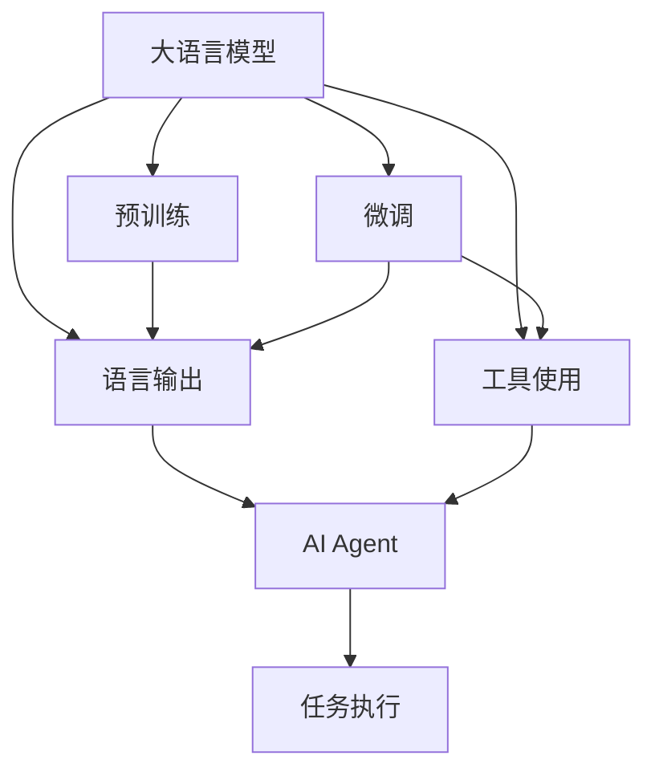

                 

# 【大模型应用开发 动手做AI Agent】Agent的行动力：语言输出能力和工具使用能力

## 1. 背景介绍

### 1.1 问题由来
在人工智能(AI)领域，大语言模型(Large Language Models, LLMs)如GPT-3、BERT等已经展现了卓越的性能，推动了自然语言处理(Natural Language Processing, NLP)技术的突破。然而，这些大模型的强大行动力，不仅仅是来自于其背后的复杂计算和海量数据，还依赖于其强大的语言输出能力和工具使用能力。本文旨在探讨如何通过AI Agent来增强大模型的行动力，使其能够更加高效、准确地执行复杂的NLP任务。

### 1.2 问题核心关键点
大语言模型的行动力是其核心能力之一，主要体现在以下几个方面：
- **语言输出能力**：能够自然、流畅地生成高质量的自然语言文本，包括对话、文本摘要、翻译等。
- **工具使用能力**：能够有效使用NLP工具库（如NLTK、SpaCy、Transformers等），快速实现各种NLP任务。
- **综合运用能力**：结合语料库、预训练模型和微调模型，执行复杂的语言理解和生成任务。

通过AI Agent的构建，可以增强大模型的行动力，使其在特定任务上表现更加出色，提高工作效率和准确度。

### 1.3 问题研究意义
研究AI Agent在大模型中的应用，对于提升AI系统的智能化水平、加速NLP技术的落地应用具有重要意义：

1. **提升工作效率**：AI Agent可以自动执行繁琐的NLP任务，如分词、标注、训练等，减少人工干预，提高工作效率。
2. **增强决策能力**：通过AI Agent的综合运用能力，可以更好地理解和处理自然语言数据，提升决策的准确性和时效性。
3. **促进技术创新**：AI Agent的应用有助于发现新的NLP技术，推动NLP领域的技术进步和应用创新。
4. **推动产业升级**：AI Agent可以应用于各行各业，提升智能化水平，推动传统行业的数字化转型。
5. **增强人机交互体验**：通过AI Agent的自然语言处理能力，可以构建更加友好、高效的人机交互界面，提升用户体验。

## 2. 核心概念与联系

### 2.1 核心概念概述

为了更好地理解AI Agent在大模型中的应用，本文将介绍几个关键概念及其联系：

- **大语言模型(Large Language Models, LLMs)**：指通过大规模预训练和微调获得的大量语言知识和经验，具备较强的语言理解和生成能力的模型，如GPT-3、BERT等。
- **AI Agent**：指能够执行特定任务、自主学习的智能体，通常由软件和硬件组成，具备感知、决策和执行能力。
- **自然语言处理(NLP)**：指利用计算机处理和理解人类语言的技术，包括语言模型、语义分析、文本生成等。
- **工具库(Toolkits)**：指用于NLP任务开发的第三方库，如NLTK、SpaCy、Transformers等，提供了丰富的功能和模块。
- **微调(Fine-tuning)**：指在大模型上进一步训练，以适应特定任务的过程，通过调整模型参数来优化性能。

这些概念之间的逻辑关系可以通过以下Mermaid流程图来展示：



这个流程图展示了大语言模型、微调、语言输出、工具使用、AI Agent和任务执行之间的关系：

1. 大语言模型通过预训练获得基础能力。
2. 微调进一步优化模型以适应特定任务。
3. 语言输出和工具使用能力使大模型能够执行任务。
4. AI Agent整合模型和工具，执行特定任务。
5. 任务执行是AI Agent的最终目的。

## 3. 核心算法原理 & 具体操作步骤
### 3.1 算法原理概述

AI Agent在大模型中的应用，核心在于如何构建和训练一个能够高效执行特定任务的智能体。其基本原理可以概括为以下几个步骤：

1. **选择合适的预训练模型**：根据任务需求，选择适合的预训练语言模型，如GPT-3、BERT等。
2. **设计任务适配层**：针对特定任务，设计合适的任务适配层，如分类器、解码器等。
3. **微调模型**：在预训练模型的基础上，使用标注数据进行微调，优化模型在特定任务上的表现。
4. **整合工具库**：利用NLP工具库，进一步提升模型的语言输出和工具使用能力。
5. **构建AI Agent**：将微调后的模型和工具库整合，构建AI Agent，使其具备执行任务的能力。

### 3.2 算法步骤详解

以下详细介绍AI Agent在大模型中的应用步骤：

**Step 1: 准备预训练模型和数据集**
- 选择合适的预训练语言模型 $M_{\theta}$ 作为初始化参数，如 GPT-3、BERT等。
- 准备下游任务 $T$ 的标注数据集 $D$，划分为训练集、验证集和测试集。一般要求标注数据与预训练数据的分布不要差异过大。

**Step 2: 添加任务适配层**
- 根据任务类型，在预训练模型顶层设计合适的输出层和损失函数。
- 对于分类任务，通常在顶层添加线性分类器和交叉熵损失函数。
- 对于生成任务，通常使用语言模型的解码器输出概率分布，并以负对数似然为损失函数。

**Step 3: 设置微调超参数**
- 选择合适的优化算法及其参数，如 AdamW、SGD 等，设置学习率、批大小、迭代轮数等。
- 设置正则化技术及强度，包括权重衰减、Dropout、Early Stopping 等。
- 确定冻结预训练参数的策略，如仅微调顶层，或全部参数都参与微调。

**Step 4: 执行梯度训练**
- 将训练集数据分批次输入模型，前向传播计算损失函数。
- 反向传播计算参数梯度，根据设定的优化算法和学习率更新模型参数。
- 周期性在验证集上评估模型性能，根据性能指标决定是否触发 Early Stopping。
- 重复上述步骤直到满足预设的迭代轮数或 Early Stopping 条件。

**Step 5: 整合工具库**
- 选择合适的NLP工具库，如NLTK、SpaCy、Transformers等，根据任务需求调用其功能模块。
- 利用工具库提供的分词、标注、解析等功能，提升模型的语言输出和工具使用能力。

**Step 6: 构建AI Agent**
- 将微调后的模型和工具库整合，构建AI Agent。
- 设置AI Agent的行为规则和执行流程，使其具备处理特定任务的能力。

**Step 7: 任务执行**
- 使用AI Agent处理输入数据，执行任务，输出结果。
- 根据反馈结果，进一步优化AI Agent的决策逻辑和执行策略。

### 3.3 算法优缺点

AI Agent在大模型中的应用具有以下优点：
1. **高效性**：利用预训练模型和工具库，可以迅速构建执行特定任务的AI Agent。
2. **灵活性**：可以根据任务需求，灵活调整适配层和工具库，提升模型适应性。
3. **可扩展性**：通过模块化设计，便于扩展新的功能和模块。
4. **高准确性**：结合预训练和微调，提升模型的语言理解和生成能力。

同时，该方法也存在一定的局限性：
1. **数据依赖**：微调效果很大程度上取决于标注数据的质量和数量，获取高质量标注数据的成本较高。
2. **参数消耗**：微调过程通常需要调整大量参数，可能导致计算资源的消耗较大。
3. **可解释性不足**：AI Agent的决策过程缺乏可解释性，难以对其推理逻辑进行分析和调试。
4. **性能瓶颈**：工具库的调用可能增加系统负载，影响执行效率。

尽管存在这些局限性，但就目前而言，AI Agent的应用仍是大模型应用的重要范式。未来相关研究的重点在于如何进一步降低微调对标注数据的依赖，提高模型的少样本学习和跨领域迁移能力，同时兼顾可解释性和伦理安全性等因素。

### 3.4 算法应用领域

AI Agent在大模型中的应用，已经在多个领域取得了显著成果，以下是几个典型的应用场景：

- **智能客服系统**：通过AI Agent，智能客服系统可以自动处理客户咨询，提供自然语言回复，提升客户服务体验。
- **金融舆情监测**：利用AI Agent，金融系统可以实时监测网络舆情，及时预警风险，保障金融稳定。
- **个性化推荐系统**：AI Agent可以根据用户行为和偏好，动态推荐个性化的内容，提升用户体验。
- **智能翻译**：AI Agent可以实时翻译多语言文本，提供高效的跨语言交流服务。
- **文本摘要**：AI Agent可以对长文本进行自动摘要，提取关键信息，节省阅读时间。

## 4. 数学模型和公式 & 详细讲解 & 举例说明

### 4.1 数学模型构建

假设预训练语言模型为 $M_{\theta}$，下游任务 $T$ 的标注数据集为 $D=\{(x_i, y_i)\}_{i=1}^N$，其中 $x_i$ 为输入文本，$y_i$ 为对应的任务标签。

定义任务适配层为 $H$，则任务适配后的模型 $M_{\theta}^T$ 为：

$$
M_{\theta}^T(x) = H(M_{\theta}(x))
$$

微调的目标是最小化任务损失函数 $\mathcal{L}(\theta)$，即：

$$
\theta^* = \mathop{\arg\min}_{\theta} \mathcal{L}(\theta) = \mathop{\arg\min}_{\theta} \mathbb{E}_{(x,y)\sim D}[\ell(y, M_{\theta}^T(x))]
$$

其中 $\ell(y, M_{\theta}^T(x))$ 为任务损失函数，通常为交叉熵损失或均方误差损失。

### 4.2 公式推导过程

以分类任务为例，推导交叉熵损失函数及其梯度计算公式。

假设模型 $M_{\theta}^T$ 在输入 $x$ 上的输出为 $\hat{y}=M_{\theta}^T(x) \in [0,1]$，表示样本属于正类的概率。真实标签 $y \in \{0,1\}$。则二分类交叉熵损失函数定义为：

$$
\ell(y, M_{\theta}^T(x)) = -[y\log \hat{y} + (1-y)\log (1-\hat{y})]
$$

将其代入任务损失函数公式，得：

$$
\mathcal{L}(\theta) = -\frac{1}{N}\sum_{i=1}^N [y_i\log M_{\theta}^T(x_i)+(1-y_i)\log(1-M_{\theta}^T(x_i))]
$$

根据链式法则，任务损失函数对参数 $\theta_k$ 的梯度为：

$$
\frac{\partial \mathcal{L}(\theta)}{\partial \theta_k} = -\frac{1}{N}\sum_{i=1}^N (\frac{y_i}{M_{\theta}^T(x_i)}-\frac{1-y_i}{1-M_{\theta}^T(x_i)}) \frac{\partial M_{\theta}^T(x_i)}{\partial \theta_k}
$$

其中 $\frac{\partial M_{\theta}^T(x_i)}{\partial \theta_k}$ 可进一步递归展开，利用自动微分技术完成计算。

### 4.3 案例分析与讲解

以智能客服系统为例，分析AI Agent的构建和应用过程：

**Step 1: 准备预训练模型和数据集**
- 选择BERT模型作为初始化参数，收集企业内部客服历史对话记录，将其划分为训练集、验证集和测试集。

**Step 2: 添加任务适配层**
- 在BERT模型顶层添加线性分类器和交叉熵损失函数，用于分类客户意图。

**Step 3: 设置微调超参数**
- 使用AdamW优化器，设置学习率为2e-5，批大小为16，迭代轮数为5。

**Step 4: 执行梯度训练**
- 对训练集数据进行迭代训练，每个批次大小为16，更新模型参数，并在验证集上评估模型性能。

**Step 5: 整合工具库**
- 使用NLTK库进行分词和词性标注，使用SpaCy库进行实体识别，提升模型的语言处理能力。

**Step 6: 构建AI Agent**
- 将微调后的BERT模型和工具库整合，构建智能客服AI Agent。
- 设置AI Agent的行为规则和执行流程，使其能够自动回答客户咨询。

**Step 7: 任务执行**
- 客户输入咨询，AI Agent自动匹配最佳答复，并提供自然语言回复。
- 根据反馈结果，进一步优化AI Agent的决策逻辑和执行策略。

## 5. 项目实践：代码实例和详细解释说明

### 5.1 开发环境搭建

在进行AI Agent实践前，我们需要准备好开发环境。以下是使用Python进行PyTorch开发的环境配置流程：

1. 安装Anaconda：从官网下载并安装Anaconda，用于创建独立的Python环境。

2. 创建并激活虚拟环境：
```bash
conda create -n pytorch-env python=3.8 
conda activate pytorch-env
```

3. 安装PyTorch：根据CUDA版本，从官网获取对应的安装命令。例如：
```bash
conda install pytorch torchvision torchaudio cudatoolkit=11.1 -c pytorch -c conda-forge
```

4. 安装Transformers库：
```bash
pip install transformers
```

5. 安装各类工具包：
```bash
pip install numpy pandas scikit-learn matplotlib tqdm jupyter notebook ipython
```

完成上述步骤后，即可在`pytorch-env`环境中开始AI Agent实践。

### 5.2 源代码详细实现

我们以智能客服系统为例，给出使用Transformers库对BERT模型进行微调的PyTorch代码实现。

首先，定义智能客服系统的数据处理函数：

```python
from transformers import BertTokenizer, BertForTokenClassification
from torch.utils.data import Dataset
import torch

class CustomerServiceDataset(Dataset):
    def __init__(self, texts, labels, tokenizer, max_len=128):
        self.texts = texts
        self.labels = labels
        self.tokenizer = tokenizer
        self.max_len = max_len
        
    def __len__(self):
        return len(self.texts)
    
    def __getitem__(self, item):
        text = self.texts[item]
        label = self.labels[item]
        
        encoding = self.tokenizer(text, return_tensors='pt', max_length=self.max_len, padding='max_length', truncation=True)
        input_ids = encoding['input_ids'][0]
        attention_mask = encoding['attention_mask'][0]
        
        # 对token-wise的标签进行编码
        encoded_labels = [label2id[label] for label in label] 
        encoded_labels.extend([label2id['O']] * (self.max_len - len(encoded_labels)))
        labels = torch.tensor(encoded_labels, dtype=torch.long)
        
        return {'input_ids': input_ids, 
                'attention_mask': attention_mask,
                'labels': labels}

# 标签与id的映射
label2id = {'O': 0, 'Customer': 1, 'Sales': 2, 'Support': 3}
id2label = {v: k for k, v in label2id.items()}

# 创建dataset
tokenizer = BertTokenizer.from_pretrained('bert-base-cased')

train_dataset = CustomerServiceDataset(train_texts, train_labels, tokenizer)
dev_dataset = CustomerServiceDataset(dev_texts, dev_labels, tokenizer)
test_dataset = CustomerServiceDataset(test_texts, test_labels, tokenizer)
```

然后，定义模型和优化器：

```python
from transformers import BertForTokenClassification, AdamW

model = BertForTokenClassification.from_pretrained('bert-base-cased', num_labels=len(label2id))

optimizer = AdamW(model.parameters(), lr=2e-5)
```

接着，定义训练和评估函数：

```python
from torch.utils.data import DataLoader
from tqdm import tqdm
from sklearn.metrics import classification_report

device = torch.device('cuda') if torch.cuda.is_available() else torch.device('cpu')
model.to(device)

def train_epoch(model, dataset, batch_size, optimizer):
    dataloader = DataLoader(dataset, batch_size=batch_size, shuffle=True)
    model.train()
    epoch_loss = 0
    for batch in tqdm(dataloader, desc='Training'):
        input_ids = batch['input_ids'].to(device)
        attention_mask = batch['attention_mask'].to(device)
        labels = batch['labels'].to(device)
        model.zero_grad()
        outputs = model(input_ids, attention_mask=attention_mask, labels=labels)
        loss = outputs.loss
        epoch_loss += loss.item()
        loss.backward()
        optimizer.step()
    return epoch_loss / len(dataloader)

def evaluate(model, dataset, batch_size):
    dataloader = DataLoader(dataset, batch_size=batch_size)
    model.eval()
    preds, labels = [], []
    with torch.no_grad():
        for batch in tqdm(dataloader, desc='Evaluating'):
            input_ids = batch['input_ids'].to(device)
            attention_mask = batch['attention_mask'].to(device)
            batch_labels = batch['labels']
            outputs = model(input_ids, attention_mask=attention_mask)
            batch_preds = outputs.logits.argmax(dim=2).to('cpu').tolist()
            batch_labels = batch_labels.to('cpu').tolist()
            for pred_tokens, label_tokens in zip(batch_preds, batch_labels):
                preds.append(pred_tokens[:len(label_tokens)])
                labels.append(label_tokens)
                
    print(classification_report(labels, preds))
```

最后，启动训练流程并在测试集上评估：

```python
epochs = 5
batch_size = 16

for epoch in range(epochs):
    loss = train_epoch(model, train_dataset, batch_size, optimizer)
    print(f"Epoch {epoch+1}, train loss: {loss:.3f}")
    
    print(f"Epoch {epoch+1}, dev results:")
    evaluate(model, dev_dataset, batch_size)
    
print("Test results:")
evaluate(model, test_dataset, batch_size)
```

以上就是使用PyTorch对BERT进行智能客服系统任务微调的完整代码实现。可以看到，得益于Transformers库的强大封装，我们可以用相对简洁的代码完成BERT模型的加载和微调。

### 5.3 代码解读与分析

让我们再详细解读一下关键代码的实现细节：

**CustomerServiceDataset类**：
- `__init__`方法：初始化文本、标签、分词器等关键组件。
- `__len__`方法：返回数据集的样本数量。
- `__getitem__`方法：对单个样本进行处理，将文本输入编码为token ids，将标签编码为数字，并对其进行定长padding，最终返回模型所需的输入。

**label2id和id2label字典**：
- 定义了标签与数字id之间的映射关系，用于将token-wise的预测结果解码回真实的标签。

**训练和评估函数**：
- 使用PyTorch的DataLoader对数据集进行批次化加载，供模型训练和推理使用。
- 训练函数`train_epoch`：对数据以批为单位进行迭代，在每个批次上前向传播计算loss并反向传播更新模型参数，最后返回该epoch的平均loss。
- 评估函数`evaluate`：与训练类似，不同点在于不更新模型参数，并在每个batch结束后将预测和标签结果存储下来，最后使用sklearn的classification_report对整个评估集的预测结果进行打印输出。

**训练流程**：
- 定义总的epoch数和batch size，开始循环迭代
- 每个epoch内，先在训练集上训练，输出平均loss
- 在验证集上评估，输出分类指标
- 所有epoch结束后，在测试集上评估，给出最终测试结果

可以看到，PyTorch配合Transformers库使得BERT微调的代码实现变得简洁高效。开发者可以将更多精力放在数据处理、模型改进等高层逻辑上，而不必过多关注底层的实现细节。

当然，工业级的系统实现还需考虑更多因素，如模型的保存和部署、超参数的自动搜索、更灵活的任务适配层等。但核心的微调范式基本与此类似。

## 6. 实际应用场景
### 6.1 智能客服系统

基于大语言模型微调的对话技术，可以广泛应用于智能客服系统的构建。传统客服往往需要配备大量人力，高峰期响应缓慢，且一致性和专业性难以保证。而使用微调后的对话模型，可以7x24小时不间断服务，快速响应客户咨询，用自然流畅的语言解答各类常见问题。

在技术实现上，可以收集企业内部的历史客服对话记录，将问题和最佳答复构建成监督数据，在此基础上对预训练对话模型进行微调。微调后的对话模型能够自动理解用户意图，匹配最合适的答案模板进行回复。对于客户提出的新问题，还可以接入检索系统实时搜索相关内容，动态组织生成回答。如此构建的智能客服系统，能大幅提升客户咨询体验和问题解决效率。

### 6.2 金融舆情监测

金融机构需要实时监测市场舆论动向，以便及时应对负面信息传播，规避金融风险。传统的人工监测方式成本高、效率低，难以应对网络时代海量信息爆发的挑战。基于大语言模型微调的文本分类和情感分析技术，为金融舆情监测提供了新的解决方案。

具体而言，可以收集金融领域相关的新闻、报道、评论等文本数据，并对其进行主题标注和情感标注。在此基础上对预训练语言模型进行微调，使其能够自动判断文本属于何种主题，情感倾向是正面、中性还是负面。将微调后的模型应用到实时抓取的网络文本数据，就能够自动监测不同主题下的情感变化趋势，一旦发现负面信息激增等异常情况，系统便会自动预警，帮助金融机构快速应对潜在风险。

### 6.3 个性化推荐系统

当前的推荐系统往往只依赖用户的历史行为数据进行物品推荐，无法深入理解用户的真实兴趣偏好。基于大语言模型微调技术，个性化推荐系统可以更好地挖掘用户行为背后的语义信息，从而提供更精准、多样的推荐内容。

在实践中，可以收集用户浏览、点击、评论、分享等行为数据，提取和用户交互的物品标题、描述、标签等文本内容。将文本内容作为模型输入，用户的后续行为（如是否点击、购买等）作为监督信号，在此基础上微调预训练语言模型。微调后的模型能够从文本内容中准确把握用户的兴趣点。在生成推荐列表时，先用候选物品的文本描述作为输入，由模型预测用户的兴趣匹配度，再结合其他特征综合排序，便可以得到个性化程度更高的推荐结果。

### 6.4 未来应用展望

随着大语言模型和微调方法的不断发展，基于微调范式将在更多领域得到应用，为传统行业带来变革性影响。

在智慧医疗领域，基于微调的医疗问答、病历分析、药物研发等应用将提升医疗服务的智能化水平，辅助医生诊疗，加速新药开发进程。

在智能教育领域，微调技术可应用于作业批改、学情分析、知识推荐等方面，因材施教，促进教育公平，提高教学质量。

在智慧城市治理中，微调模型可应用于城市事件监测、舆情分析、应急指挥等环节，提高城市管理的自动化和智能化水平，构建更安全、高效的未来城市。

此外，在企业生产、社会治理、文娱传媒等众多领域，基于大模型微调的人工智能应用也将不断涌现，为经济社会发展注入新的动力。相信随着技术的日益成熟，微调方法将成为人工智能落地应用的重要范式，推动人工智能技术在垂直行业的规模化落地。

## 7. 工具和资源推荐
### 7.1 学习资源推荐

为了帮助开发者系统掌握大语言模型微调的理论基础和实践技巧，这里推荐一些优质的学习资源：

1. 《Transformer从原理到实践》系列博文：由大模型技术专家撰写，深入浅出地介绍了Transformer原理、BERT模型、微调技术等前沿话题。

2. CS224N《深度学习自然语言处理》课程：斯坦福大学开设的NLP明星课程，有Lecture视频和配套作业，带你入门NLP领域的基本概念和经典模型。

3. 《Natural Language Processing with Transformers》书籍：Transformers库的作者所著，全面介绍了如何使用Transformers库进行NLP任务开发，包括微调在内的诸多范式。

4. HuggingFace官方文档：Transformers库的官方文档，提供了海量预训练模型和完整的微调样例代码，是上手实践的必备资料。

5. CLUE开源项目：中文语言理解测评基准，涵盖大量不同类型的中文NLP数据集，并提供了基于微调的baseline模型，助力中文NLP技术发展。

通过对这些资源的学习实践，相信你一定能够快速掌握大语言模型微调的精髓，并用于解决实际的NLP问题。
###  7.2 开发工具推荐

高效的开发离不开优秀的工具支持。以下是几款用于大语言模型微调开发的常用工具：

1. PyTorch：基于Python的开源深度学习框架，灵活动态的计算图，适合快速迭代研究。大部分预训练语言模型都有PyTorch版本的实现。

2. TensorFlow：由Google主导开发的开源深度学习框架，生产部署方便，适合大规模工程应用。同样有丰富的预训练语言模型资源。

3. Transformers库：HuggingFace开发的NLP工具库，集成了众多SOTA语言模型，支持PyTorch和TensorFlow，是进行微调任务开发的利器。

4. Weights & Biases：模型训练的实验跟踪工具，可以记录和可视化模型训练过程中的各项指标，方便对比和调优。与主流深度学习框架无缝集成。

5. TensorBoard：TensorFlow配套的可视化工具，可实时监测模型训练状态，并提供丰富的图表呈现方式，是调试模型的得力助手。

6. Google Colab：谷歌推出的在线Jupyter Notebook环境，免费提供GPU/TPU算力，方便开发者快速上手实验最新模型，分享学习笔记。

合理利用这些工具，可以显著提升大语言模型微调任务的开发效率，加快创新迭代的步伐。

### 7.3 相关论文推荐

大语言模型和微调技术的发展源于学界的持续研究。以下是几篇奠基性的相关论文，推荐阅读：

1. Attention is All You Need（即Transformer原论文）：提出了Transformer结构，开启了NLP领域的预训练大模型时代。

2. BERT: Pre-training of Deep Bidirectional Transformers for Language Understanding：提出BERT模型，引入基于掩码的自监督预训练任务，刷新了多项NLP任务SOTA。

3. Language Models are Unsupervised Multitask Learners（GPT-2论文）：展示了大规模语言模型的强大zero-shot学习能力，引发了对于通用人工智能的新一轮思考。

4. Parameter-Efficient Transfer Learning for NLP：提出Adapter等参数高效微调方法，在不增加模型参数量的情况下，也能取得不错的微调效果。

5. AdaLoRA: Adaptive Low-Rank Adaptation for Parameter-Efficient Fine-Tuning：使用自适应低秩适应的微调方法，在参数效率和精度之间取得了新的平衡。

这些论文代表了大语言模型微调技术的发展脉络。通过学习这些前沿成果，可以帮助研究者把握学科前进方向，激发更多的创新灵感。

## 8. 总结：未来发展趋势与挑战

### 8.1 总结

本文对AI Agent在大模型中的应用进行了全面系统的介绍。首先阐述了AI Agent在大模型中的行动力增强，详细介绍了语言输出能力和工具使用能力的构建方法。其次，从原理到实践，详细讲解了微调模型的数学原理和关键步骤，给出了微调任务开发的完整代码实例。同时，本文还广泛探讨了AI Agent在智能客服、金融舆情、个性化推荐等多个行业领域的应用前景，展示了AI Agent的巨大潜力。此外，本文精选了AI Agent技术的各类学习资源，力求为读者提供全方位的技术指引。

通过本文的系统梳理，可以看到，AI Agent在大模型中的应用，通过结合预训练和微调，增强了大模型的语言处理能力和任务执行能力，显著提升了模型的工作效率和适应性。未来，伴随预训练语言模型和微调方法的持续演进，基于AI Agent的应用将更加广泛，为人工智能技术在各行各业的落地提供新的范式。

### 8.2 未来发展趋势

展望未来，AI Agent在大模型中的应用将呈现以下几个发展趋势：

1. **语言输出能力的提升**：通过引入更多先验知识（如知识图谱、逻辑规则等），提升模型的自然语言生成能力，使其输出更加准确、流畅。
2. **工具使用能力的扩展**：利用更多的NLP工具库和API，整合更多的语言处理和生成功能，提升模型的通用性。
3. **跨模态能力的增强**：结合视觉、语音等多模态信息，提升模型的综合处理能力，拓展应用场景。
4. **人机交互的优化**：通过自然语言理解和生成，提升人机交互的自然度和智能化水平，构建更加友好、高效的界面。
5. **知识整合能力的增强**：将符号化的知识与神经网络模型结合，提升模型的知识整合和推理能力，支持更复杂的决策任务。

这些趋势凸显了AI Agent在大模型中的应用前景，预示着AI Agent将在大规模语言模型的推动下，进一步提升智能化水平，推动NLP技术的普及和应用。

### 8.3 面临的挑战

尽管AI Agent在大模型中的应用取得了显著成效，但在实际应用过程中，仍面临诸多挑战：

1. **数据依赖**：微调效果依赖于标注数据的质量和数量，获取高质量标注数据的成本较高。如何进一步降低微调对标注样本的依赖，是未来研究的重要方向。
2. **计算资源消耗**：微调和工具库的使用可能增加计算资源的消耗，影响系统的实时性和稳定性。如何优化资源使用，提高系统的运行效率，是亟待解决的问题。
3. **可解释性不足**：AI Agent的决策过程缺乏可解释性，难以对其推理逻辑进行分析和调试。如何提升模型的可解释性，使其决策过程透明，是未来研究的重要课题。
4. **性能瓶颈**：工具库的调用可能增加系统负载，影响执行效率。如何优化工具库的使用，减少系统瓶颈，提高系统性能，是未来的研究方向。
5. **安全性问题**：预训练语言模型可能学习到有害信息，通过AI Agent传递到下游任务，造成安全隐患。如何增强模型的安全性，避免恶意用途，是未来的研究重点。

尽管存在这些挑战，但AI Agent在大模型中的应用前景广阔，通过技术创新和优化，相信这些问题终将得到解决，AI Agent将在大规模语言模型的推动下，进一步提升智能化水平，推动NLP技术的普及和应用。

### 8.4 研究展望

面对AI Agent所面临的挑战，未来的研究需要在以下几个方面寻求新的突破：

1. **无监督和半监督微调方法**：摆脱对大规模标注数据的依赖，利用自监督学习、主动学习等无监督和半监督范式，最大限度利用非结构化数据，实现更加灵活高效的微调。
2. **参数高效和计算高效的微调范式**：开发更加参数高效的微调方法，在固定大部分预训练参数的同时，只更新极少量的任务相关参数。同时优化微调模型的计算图，减少前向传播和反向传播的资源消耗，实现更加轻量级、实时性的部署。
3. **因果和对比学习范式**：通过引入因果推断和对比学习思想，增强微调模型建立稳定因果关系的能力，学习更加普适、鲁棒的语言表征，从而提升模型泛化性和抗干扰能力。
4. **多模态融合**：将视觉、语音等多模态信息与文本信息结合，提升模型的综合处理能力，拓展应用场景。
5. **知识整合与推理**：将符号化的先验知识与神经网络模型结合，提升模型的知识整合和推理能力，支持更复杂的决策任务。
6. **伦理和安全约束**：在模型训练目标中引入伦理导向的评估指标，过滤和惩罚有害的输出倾向，确保模型的行为符合伦理道德。

这些研究方向将推动AI Agent在大模型中的应用，使其能够更加高效、准确地执行复杂的NLP任务，为人工智能技术的普及和应用提供新的动力。

## 9. 附录：常见问题与解答

**Q1：大语言模型微调是否适用于所有NLP任务？**

A: 大语言模型微调在大多数NLP任务上都能取得不错的效果，特别是对于数据量较小的任务。但对于一些特定领域的任务，如医学、法律等，仅仅依靠通用语料预训练的模型可能难以很好地适应。此时需要在特定领域语料上进一步预训练，再进行微调，才能获得理想效果。此外，对于一些需要时效性、个性化很强的任务，如对话、推荐等，微调方法也需要针对性的改进优化。

**Q2：微调过程中如何选择合适的学习率？**

A: 微调的学习率一般要比预训练时小1-2个数量级，如果使用过大的学习率，容易破坏预训练权重，导致过拟合。一般建议从1e-5开始调参，逐步减小学习率，直至收敛。也可以使用warmup策略，在开始阶段使用较小的学习率，再逐渐过渡到预设值。需要注意的是，不同的优化器(如AdamW、Adafactor等)以及不同的学习率调度策略，可能需要设置不同的学习率阈值。

**Q3：采用大模型微调时会面临哪些资源瓶颈？**

A: 目前主流的预训练大模型动辄以亿计的参数规模，对算力、内存、存储都提出了很高的要求。GPU/TPU等高性能设备是必不可少的，但即便如此，超大批次的训练和推理也可能遇到显存不足的问题。因此需要采用一些资源优化技术，如梯度积累、混合精度训练、模型并行等，来突破硬件瓶颈。同时，模型的存储和读取也可能占用大量时间和空间，需要采用模型压缩、稀疏化存储等方法进行优化。

**Q4：如何缓解微调过程中的过拟合问题？**

A: 过拟合是微调面临的主要挑战，尤其是在标注数据不足的情况下。常见的缓解策略包括：
1. 数据增强：通过回译、近义替换等方式扩充训练集
2. 正则化：使用L2正则、Dropout、Early Stopping 等避免过拟合
3. 对抗训练：引入对抗样本，提高模型鲁棒性
4. 参数高效微调：只调整少量参数(如Adapter、Prefix等)，减小过拟合风险
5. 多模型集成：训练多个微调模型，取平均输出，抑制过拟合

这些策略往往需要根据具体任务和数据特点进行灵活组合。只有在数据、模型、训练、推理等各环节进行全面优化，才能最大限度地发挥大模型微调的威力。

**Q5：微调模型在落地部署时需要注意哪些问题？**

A: 将微调模型转化为实际应用，还需要考虑以下因素：
1. 模型裁剪：去除不必要的层和参数，减小模型尺寸，加快推理速度
2. 量化加速：将浮点模型转为定点模型，压缩存储空间，提高计算效率
3. 服务化封装：将模型封装为标准化服务接口，便于集成调用
4. 弹性伸缩：根据请求流量动态调整资源配置，平衡服务质量和成本
5. 监控告警：实时采集系统指标，设置异常告警阈值，确保服务稳定性
6. 安全防护：采用访问鉴权、数据脱敏等措施，保障数据和模型安全

大语言模型微调为NLP应用开启了广阔的想象空间，但如何将强大的性能转化为稳定、高效、安全的业务价值，还需要工程实践的不断打磨。唯有从数据、算法、工程、业务等多个维度协同发力，才能真正实现人工智能技术在垂直行业的规模化落地。总之，微调需要开发者根据具体任务，不断迭代和优化模型、数据和算法，方能得到理想的效果。

---

作者：禅与计算机程序设计艺术 / Zen and the Art of Computer Programming

