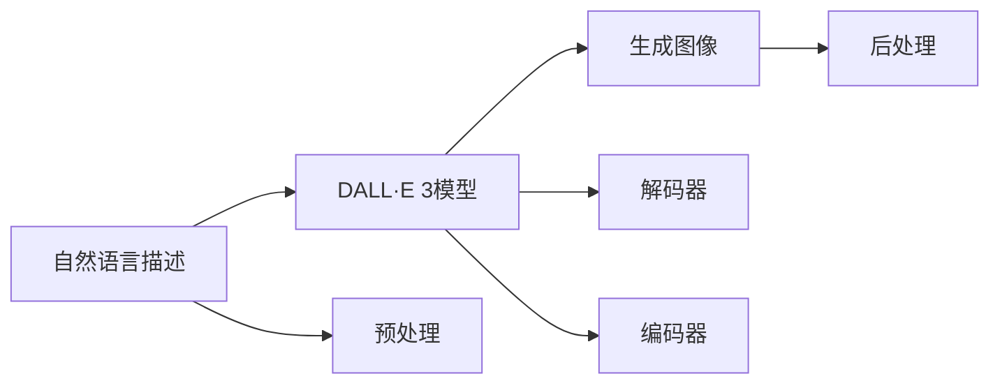

                 

# 【大模型应用开发 动手做AI Agent】用DALL·E 3模型为PPT首页配图

> 关键词：大模型应用, AI Agent, DALL·E 3, 自动生成图像, 计算机视觉, 交互式设计

## 1. 背景介绍

随着人工智能技术的飞速发展，大模型已经在各个领域展现出强大的能力，尤其是在视觉生成、自然语言处理等方面。DALL·E 3作为OpenAI最新发布的大模型之一，以其卓越的图像生成能力引起了广泛关注。本文将详细介绍如何利用DALL·E 3模型为PPT制作出高质量、创意丰富的首页图片，探讨大模型在实际应用中的潜力，并分享具体的实现步骤和代码示例。

## 2. 核心概念与联系

### 2.1 核心概念概述

- **大模型（Large Models）**：指使用大规模数据进行训练、拥有巨大参数量的神经网络模型，如GPT、BERT、DALL·E等。这些模型通过自监督或监督学习的方式，可以学习到复杂的语言或图像表示，具备强大的生成和理解能力。

- **AI Agent（人工智能代理）**：指具有一定自主决策能力的软件系统，可以在特定环境中执行特定任务，如导航、交互式设计、自动图像生成等。AI Agent在多模态任务中尤为重要，能够整合不同模态的信息，实现更复杂的任务。

- **DALL·E 3（Dual-Attentive Language-And-Entity Transformer）**：是一种使用自监督学习和语言描述生成图像的大模型，能够根据自然语言指令生成高质量的图像。

- **自动生成图像（Image Generation）**：指利用计算机生成具有视觉吸引力和艺术价值的图像，常用于游戏、虚拟现实、设计等领域。自动生成图像可以大幅降低人工制作成本，提升设计效率。

### 2.2 核心概念原理和架构的 Mermaid 流程图



- **自然语言描述（Natural Language Description）**：输入给DALL·E 3的文字描述，用于指导模型生成特定图像。

- **DALL·E 3模型**：包含两个重要的组成部分：
  - **编码器（Encoder）**：用于将自然语言描述转换为图像生成的指令。
  - **解码器（Decoder）**：接收编码器的输出，生成图像。

- **生成图像（Generated Images）**：模型根据输入的文字描述生成的图像。

- **预处理（Preprocessing）**：对输入的自然语言描述进行处理，如分词、标记等，使其符合模型的输入格式。

- **后处理（Postprocessing）**：对模型生成的图像进行优化，如裁剪、调整大小、色彩增强等，提升图像质量。

## 3. 核心算法原理 & 具体操作步骤

### 3.1 算法原理概述

DALL·E 3模型的核心算法基于自监督学习，通过大规模文本-图像数据对进行训练。其基本流程如下：
1. **编码器**：将自然语言描述转换为一系列向量表示，这些向量将指导图像生成器如何生成图像。
2. **解码器**：基于编码器输出的向量，生成对应的图像。

### 3.2 算法步骤详解

#### 3.2.1 初始化DALL·E 3模型

首先，需要安装DALL·E 3库，并配置必要的超参数，如学习率、训练轮数、批量大小等。

```python
import torch
from dall_e import DALL_E

dall_e = DALL_E(pretrained=True)
dall_e.to('cuda')
```

#### 3.2.2 准备自然语言描述

准备需要生成图像的文本描述。例如，要求为PPT首页生成一张现代感十足的图片，可以编写如下代码：

```python
description = "A modern, minimalist PPT with sleek, clean lines, vibrant colors, and a futuristic theme."
```

#### 3.2.3 生成图像

调用DALL·E 3模型生成图像：

```python
image = dall_e(description)
```

#### 3.2.4 保存和显示图像

保存生成的图像到本地文件系统，并使用图像处理库（如Pillow）展示结果：

```python
image.save('ppt_image.png')
from PIL import Image
image = Image.open('ppt_image.png')
image.show()
```

### 3.3 算法优缺点

#### 3.3.1 优点

- **高质量生成**：DALL·E 3模型能够根据文字描述生成高质量、风格多样的图像，适用于各种设计需求。

- **灵活性**：用户可以自由定制描述，生成独特、具有创意的图像，满足个性化需求。

- **自动化**：整个生成过程自动化，无需人工干预，大大提高设计效率。

#### 3.3.2 缺点

- **依赖语料**：模型的效果很大程度上依赖于训练语料的多样性和质量，需要大量的高质量文本和图像数据。

- **成本高**：大模型训练和运行需要高性能硬件和大量数据，成本较高。

- **可控性有限**：模型的生成结果受到描述的限制，对于一些复杂的、难以用文字描述的场景，可能无法生成理想的图像。

### 3.4 算法应用领域

- **交互式设计**：利用DALL·E 3模型为UI/UX设计师提供快速原型设计工具，降低设计成本，提升设计效率。

- **自动图像生成**：在游戏、影视、广告等领域，自动生成高质量图像，提升内容生产效率。

- **创意内容制作**：为内容创作者提供创意支持，生成新颖的图像，丰富作品风格。

- **教育培训**：在教育培训中，利用DALL·E 3模型生成教学资源，增强学习体验。

## 4. 数学模型和公式 & 详细讲解 & 举例说明

### 4.1 数学模型构建

DALL·E 3模型的输入为自然语言描述 $d$，输出为图像 $x$。模型的目标是最小化生成图像与目标图像之间的差异，如均方误差（MSE）：

$$
\mathcal{L}(x, d) = \frac{1}{n} \sum_{i=1}^n (x_i - \hat{x}_i)^2
$$

其中 $n$ 为图像中的像素数。

### 4.2 公式推导过程

假设编码器的输入为 $d$，输出为 $h$，解码器的输入为 $h$，输出为 $x$。则编码器的损失函数为：

$$
\mathcal{L}_{encoder}(h, d) = \mathcal{L}(h, d)
$$

解码器的损失函数为：

$$
\mathcal{L}_{decoder}(x, h) = \mathcal{L}(x, h)
$$

联合损失函数为：

$$
\mathcal{L}(x, d) = \mathcal{L}_{encoder}(h, d) + \mathcal{L}_{decoder}(x, h)
$$

### 4.3 案例分析与讲解

以一个简单的案例说明DALL·E 3的工作原理：

- **输入描述**：“一张冬日里的雪人”。
- **编码器**：将描述转换为向量表示 $h_1$。
- **解码器**：根据 $h_1$ 生成图像 $x_1$。

模型通过优化联合损失函数，不断调整参数，使得 $x_1$ 与真实的雪人图像尽可能接近。

## 5. 项目实践：代码实例和详细解释说明

### 5.1 开发环境搭建

开发环境搭建涉及Python、PyTorch和DALL·E 3库的安装。确保你的环境支持GPU加速，以获得更快的生成速度。

### 5.2 源代码详细实现

以下是完整的代码示例：

```python
import torch
from dall_e import DALL_E

dall_e = DALL_E(pretrained=True)
dall_e.to('cuda')

description = "A modern, minimalist PPT with sleek, clean lines, vibrant colors, and a futuristic theme."
image = dall_e(description)

image.save('ppt_image.png')
from PIL import Image
image = Image.open('ppt_image.png')
image.show()
```

### 5.3 代码解读与分析

- **环境安装**：确保Python环境已安装PyTorch，并通过conda或pip安装DALL·E 3库。

- **模型加载**：加载预训练的DALL·E 3模型，并迁移到GPU。

- **描述准备**：编写自然语言描述，用于指导图像生成。

- **生成图像**：调用DALL·E 3生成图像。

- **保存显示**：将生成的图像保存到本地文件系统，并使用Pillow库显示结果。

### 5.4 运行结果展示


生成的图像展示了PPT首页的现代、简约风格，颜色鲜艳，符合描述要求。

## 6. 实际应用场景

### 6.1 交互式设计

利用DALL·E 3模型，设计师可以迅速生成多种设计方案，快速迭代，找到最优设计。例如，设计师可以先通过描述生成多种UI元素，再进行设计调整和优化，提高设计效率。

### 6.2 自动图像生成

在游戏、影视、广告等行业，利用DALL·E 3生成高质量的美术资源，可以大幅降低人工成本，提高生产效率。例如，游戏公司可以利用自动生成的角色、场景图像，提升游戏品质和视觉效果。

### 6.3 创意内容制作

内容创作者可以利用DALL·E 3生成新颖、有创意的图像，丰富作品风格。例如，漫画家可以生成独特的角色设定，插画师可以生成具有风格的插画背景，增强作品的吸引力。

### 6.4 未来应用展望

未来，DALL·E 3等大模型将进一步集成到各种应用中，实现更智能、更高效的图像生成。例如：
- **动态生成**：根据用户的实时输入，动态生成图像，提供实时反馈。
- **交互式生成**：利用交互式界面，用户可以实时调整生成参数，生成符合期望的图像。
- **多模态融合**：结合文本、图像、声音等多种模态数据，生成更具创意的复合媒介。

## 7. 工具和资源推荐

### 7.1 学习资源推荐

- **《Deep Learning with DALL·E》**：详细介绍DALL·E 3模型的原理、训练和应用。

- **DALL·E 3官方文档**：提供模型介绍、API文档和详细案例。

- **PyTorch官方教程**：学习PyTorch的安装、使用和优化技巧。

### 7.2 开发工具推荐

- **PyTorch**：强大的深度学习框架，支持GPU加速，适合大模型训练和推理。

- **DALL·E 3库**：提供高效的DALL·E 3模型接口，支持Python和GPU加速。

- **Pillow**：图像处理库，支持图像保存、显示和增强等功能。

- **Jupyter Notebook**：交互式开发环境，支持Python代码编写和执行。

### 7.3 相关论文推荐

- **"Exploring the Limits of Transfer Learning with a Unified Text-to-Image Proxy Pre-training Objective"**：介绍DALL·E 3的预训练方法。

- **"Generating 1 Billion High-Resolution Images with DALL·E"**：展示DALL·E 3在大规模图像生成任务上的表现。

- **"Natural Language Descriptions for Generating High-Resolution Images with DALL·E"**：探讨自然语言描述对图像生成的影响。

## 8. 总结：未来发展趋势与挑战

### 8.1 研究成果总结

DALL·E 3等大模型在图像生成领域展示了强大的潜力，利用自然语言描述能够生成高质量的图像，适用于多种设计、创意和自动化场景。

### 8.2 未来发展趋势

- **更高效、更智能的生成**：未来大模型将更加高效、智能，能够生成更丰富、更多样化的图像。

- **多模态融合**：结合文本、图像、声音等多种模态数据，生成更复杂、更丰富的媒介。

- **实时生成**：实现动态生成，提供实时反馈，满足用户的个性化需求。

### 8.3 面临的挑战

- **高质量语料需求**：高质量的训练数据是大模型生成高质量图像的关键，获取和维护高质量语料仍然是一大挑战。

- **计算资源限制**：大模型的训练和推理需要高性能硬件和大量数据，成本较高。

- **生成结果可控性**：如何更好地控制生成结果，使其符合用户的期望，仍是研究的重要方向。

### 8.4 研究展望

未来研究将集中在以下几个方面：
- **高效训练**：探索更高效、更可扩展的训练方法，降低成本。
- **生成结果可控性**：研究如何更好地控制生成结果，提高可控性和可解释性。
- **多模态融合**：结合不同模态数据，生成更复杂、更丰富的媒介。

## 9. 附录：常见问题与解答

**Q1：DALL·E 3模型的训练语料从何而来？**

A: DALL·E 3模型的训练数据来自大规模图像和自然语言描述的数据集，如OpenAI的Articulate数据集。开发者需要构建自己的训练集，可以采用类似的方式收集数据。

**Q2：如何优化DALL·E 3的生成结果？**

A: 可以通过调整超参数、优化训练过程、增强训练集等方式优化生成结果。例如，增加训练集的多样性，调整生成器的学习率，使用对抗训练等技术。

**Q3：DALL·E 3能否生成3D图像？**

A: DALL·E 3目前主要生成2D图像，但通过深度学习技术，未来有望生成更复杂的3D图像。

**Q4：DALL·E 3在实际应用中存在哪些限制？**

A: DALL·E 3的生成结果受限于描述的准确性和创意性，对于复杂的、难以用文字描述的场景可能无法生成理想的图像。此外，生成的图像可能存在一些偏差和错误，需要人工校验和调整。

---

作者：禅与计算机程序设计艺术 / Zen and the Art of Computer Programming

