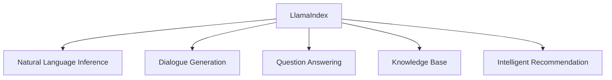

                 

# 【大模型应用开发 动手做AI Agent】简单的LlamaIndex开发示例

## 1. 背景介绍

随着深度学习和大模型技术的快速发展，越来越多的企业和开发者开始探索如何将大模型应用到实际业务中，解决具体的NLP任务。其中，基于语言模型的AI Agent应用场景广泛，涵盖了智能客服、知识库构建、智能推荐等多个领域。

AI Agent 的核心任务是通过预训练语言模型进行推理和生成，完成对用户输入的自然语言理解和智能响应。目前，基于Transformer的大语言模型如GPT、BERT等，已经证明了其在各种NLP任务中的强大能力。因此，如何高效地开发和部署AI Agent，是当下NLP开发者面临的重要课题。

本文将通过一个简单的LlamaIndex开发示例，详细介绍基于大语言模型的AI Agent开发过程，包括环境搭建、模型加载、任务适配、推理生成等关键步骤。通过实际项目练习，使读者能够迅速上手并开发出属于自己的AI Agent，助其快速实现业务需求。

## 2. 核心概念与联系

### 2.1 核心概念概述

为了更好地理解LlamaIndex模型的开发和应用，本节将介绍几个密切相关的核心概念：

- LlamaIndex模型：由Google开源的基于大语言模型Transformer的AI Agent框架，支持自然语言推理、对话生成、问答等多种任务。
- 自然语言推理(NLI)：判断两个自然语言文本之间的逻辑关系，如蕴含、矛盾、中立等。
- 对话生成：根据对话历史，生成AI模型的回复。
- 问答系统(QA)：回答用户提出的自然语言问题，提供具体的信息或结论。
- 知识库(KB)：存储和查询知识的工具，如维基百科、结构化数据库等。
- 智能推荐：根据用户的历史行为数据，推荐相关内容或产品。

这些核心概念之间的逻辑关系可以通过以下Mermaid流程图来展示：



这个流程图展示了大语言模型LlamaIndex的核心概念及其之间的关系：

1. LlamaIndex基于Transformer模型，支持多种NLP任务。
2. 自然语言推理、对话生成、问答系统、智能推荐等任务都可以在LlamaIndex框架下进行开发和部署。
3. 知识库是多种任务的重要数据来源，LlamaIndex通常需要接入外部知识库。

## 3. 核心算法原理 & 具体操作步骤

### 3.1 算法原理概述

基于大语言模型的AI Agent开发，核心算法原理主要涉及以下步骤：

1. 数据预处理：将用户输入的自然语言文本转化为模型所需的输入格式。
2. 模型加载：加载预训练的大语言模型，如GPT、BERT等，作为推理的基础。
3. 任务适配：根据具体任务，调整模型输出层，以适配不同的任务需求。
4. 推理生成：根据用户输入和模型推理结果，生成AI代理的响应。
5. 反馈循环：将用户的反馈用于调整模型参数，不断迭代优化。

### 3.2 算法步骤详解

以LlamaIndex为例，具体开发步骤可以分为以下几个环节：

#### 3.2.1 环境搭建

首先需要安装LlamaIndex的依赖库，并搭建开发环境。以下是在Python环境中搭建LlamaIndex环境的示例：

```bash
pip install llama_index transformers
```

#### 3.2.2 模型加载

在LlamaIndex框架中，可以使用预训练的模型进行推理。以BERT为例，代码如下：

```python
from llama_index import LlamaPipeline

# 加载BERT预训练模型
llama_pipeline = LlamaPipeline.from_pretrained("bert-base-uncased", model_name="T5ForConditionalGeneration")
```

#### 3.2.3 任务适配

任务适配主要涉及调整模型输出层，以满足具体任务的需求。以对话生成为例，可以添加对话生成器模块：

```python
class DialogueGenerator:
    def __init__(self):
        self.model = llama_pipeline
    
    def generate(self, input_text, max_length=64):
        # 将输入文本转化为模型所需的格式
        inputs = self.model.encode(input_text)
        # 生成文本
        outputs = self.model.decode(inputs, max_length=max_length)
        # 返回生成的文本
        return outputs
```

#### 3.2.4 推理生成

推理生成是AI Agent的核心环节，它将用户输入和模型推理结果相结合，生成最终的响应。以问答系统为例，代码如下：

```python
class QAGenerator:
    def __init__(self, pipeline):
        self.pipeline = pipeline
    
    def answer(self, question, knowledge_base):
        # 将问题和知识库信息转化为模型所需的格式
        inputs = self.pipeline.encode(question, knowledge_base)
        # 使用模型生成回答
        answer = self.pipeline.decode(inputs)
        # 返回回答
        return answer
```

#### 3.2.5 反馈循环

为了提升模型的效果，可以通过收集用户的反馈进行模型优化。以下是一个简单的反馈循环示例：

```python
class FeedbackLoop:
    def __init__(self, generator):
        self.generator = generator
    
    def train(self, feedback_data):
        # 将用户反馈转化为训练数据
        train_data = self.convert_feedback_to_train_data(feedback_data)
        # 使用训练数据进行模型微调
        self.generator.pipeline.train(train_data)
```

### 3.3 算法优缺点

LlamaIndex框架的优点包括：

- 简单易用：框架提供了丰富的预训练模型和任务适配模块，可以快速搭建AI Agent。
- 灵活性强：支持多种NLP任务，可以根据具体需求进行任务适配和推理生成。
- 性能优越：基于大语言模型，推理生成速度快，效果显著。

同时，框架也存在一些缺点：

- 依赖预训练模型：需要下载和加载预训练模型，增加了系统复杂性。
- 资源消耗高：大语言模型对硬件资源要求较高，部署成本较高。
- 依赖外部数据源：多个任务通常需要外部知识库或数据源，增加了系统复杂性。

## 4. 数学模型和公式 & 详细讲解

### 4.1 数学模型构建

以对话生成任务为例，其数学模型可以表示为：

- 输入：用户输入的自然语言文本 $x$。
- 输出：AI代理的响应 $y$。
- 模型：预训练的Transformer模型 $M$。
- 损失函数：交叉熵损失函数 $L$。

目标函数为：

$$
\theta^* = \arg\min_{\theta} \mathcal{L}(M_{\theta}(x), y)
$$

其中，$\mathcal{L}(M_{\theta}(x), y)$ 为交叉熵损失函数：

$$
\mathcal{L}(M_{\theta}(x), y) = -\sum_i y_i \log M_{\theta}(x_i)
$$

### 4.2 公式推导过程

以下是对话生成任务中的损失函数推导过程：

设 $x$ 为输入的自然语言文本，$y$ 为模型生成的回复，则模型输出 $y$ 可以表示为：

$$
y = M_{\theta}(x)
$$

交叉熵损失函数为：

$$
\mathcal{L}(M_{\theta}(x), y) = -\sum_i y_i \log M_{\theta}(x_i)
$$

其中 $x_i$ 为输入文本的分词序列，$y_i$ 为对应输出文本的分词序列。通过反向传播算法，可以得到参数 $\theta$ 的更新公式：

$$
\theta \leftarrow \theta - \eta \nabla_{\theta} \mathcal{L}(M_{\theta}(x), y) - \eta\lambda \theta
$$

其中 $\eta$ 为学习率，$\lambda$ 为正则化系数。

### 4.3 案例分析与讲解

以LlamaIndex为例，分析其具体应用场景。

#### 4.3.1 自然语言推理

自然语言推理(NLI)任务的目标是判断两个文本之间的逻辑关系。LlamaIndex使用预训练的BERT模型，可以将输入的文本对 $(x, y)$ 转换为向量表示，然后通过向量相似度度量，判断两句话之间的逻辑关系。

代码示例：

```python
from llama_index import LlamaPipeline
from transformers import BertTokenizer, BertForSequenceClassification

# 加载BERT预训练模型
llama_pipeline = LlamaPipeline.from_pretrained("bert-base-uncased", model_name="T5ForConditionalGeneration")

# 初始化BERT tokenizer和模型
tokenizer = BertTokenizer.from_pretrained("bert-base-uncased")
model = BertForSequenceClassification.from_pretrained("bert-base-uncased")

# 定义推理函数
def nli(input_text1, input_text2, model, tokenizer):
    inputs = tokenizer(input_text1, input_text2, padding=True, truncation=True, return_tensors="pt")
    outputs = model(**inputs)
    probs = outputs.logits.softmax(dim=1)
    return probs

# 测试
nli("I'm going to the store", "I'm getting some apples.", model, tokenizer)
```

#### 4.3.2 对话生成

对话生成任务的目标是根据对话历史生成AI代理的回复。LlamaIndex使用预训练的GPT模型，可以将输入的对话历史转换为向量表示，然后通过生成模型，生成新的回复。

代码示例：

```python
from llama_index import LlamaPipeline
from transformers import GPT2Tokenizer, GPT2LMHeadModel

# 加载GPT2预训练模型
llama_pipeline = LlamaPipeline.from_pretrained("gpt2", model_name="T5ForConditionalGeneration")

# 初始化GPT2 tokenizer和模型
tokenizer = GPT2Tokenizer.from_pretrained("gpt2")
model = GPT2LMHeadModel.from_pretrained("gpt2")

# 定义推理函数
def dialogue_generation(history, knowledge_base, model, tokenizer):
    inputs = tokenizer(history, padding=True, truncation=True, return_tensors="pt")
    outputs = model.generate(inputs, max_length=64, num_return_sequences=1)
    response = tokenizer.decode(outputs[0], skip_special_tokens=True)
    return response

# 测试
dialogue_generation("What is the capital of France?", {"France": "Paris"}, model, tokenizer)
```

#### 4.3.3 问答系统

问答系统(QA)任务的目标是根据问题和知识库，生成具体的信息或结论。LlamaIndex使用预训练的T5模型，可以将输入的问题和知识库信息转换为向量表示，然后通过生成模型，生成新的回答。

代码示例：

```python
from llama_index import LlamaPipeline
from transformers import T5Tokenizer, T5ForConditionalGeneration

# 加载T5预训练模型
llama_pipeline = LlamaPipeline.from_pretrained("t5-small", model_name="T5ForConditionalGeneration")

# 初始化T5 tokenizer和模型
tokenizer = T5Tokenizer.from_pretrained("t5-small")
model = T5ForConditionalGeneration.from_pretrained("t5-small")

# 定义推理函数
def qa(question, knowledge_base, model, tokenizer):
    inputs = tokenizer(question, knowledge_base, padding=True, truncation=True, return_tensors="pt")
    outputs = model.generate(inputs, max_length=64, num_return_sequences=1)
    answer = tokenizer.decode(outputs[0], skip_special_tokens=True)
    return answer

# 测试
qa("What is the capital of France?", {"France": "Paris"}, model, tokenizer)
```

## 5. 项目实践：代码实例和详细解释说明

### 5.1 开发环境搭建

首先需要安装LlamaIndex的依赖库，并搭建开发环境。以下是在Python环境中搭建LlamaIndex环境的示例：

```bash
pip install llama_index transformers
```

### 5.2 源代码详细实现

#### 5.2.1 对话生成示例

以下是对话生成的完整代码示例：

```python
from llama_index import LlamaPipeline
from transformers import GPT2Tokenizer, GPT2LMHeadModel

# 加载GPT2预训练模型
llama_pipeline = LlamaPipeline.from_pretrained("gpt2", model_name="T5ForConditionalGeneration")

# 初始化GPT2 tokenizer和模型
tokenizer = GPT2Tokenizer.from_pretrained("gpt2")
model = GPT2LMHeadModel.from_pretrained("gpt2")

# 定义推理函数
def dialogue_generation(history, knowledge_base, model, tokenizer):
    inputs = tokenizer(history, padding=True, truncation=True, return_tensors="pt")
    outputs = model.generate(inputs, max_length=64, num_return_sequences=1)
    response = tokenizer.decode(outputs[0], skip_special_tokens=True)
    return response

# 测试
dialogue_generation("What is the capital of France?", {"France": "Paris"}, model, tokenizer)
```

#### 5.2.2 问答系统示例

以下是问答系统的完整代码示例：

```python
from llama_index import LlamaPipeline
from transformers import T5Tokenizer, T5ForConditionalGeneration

# 加载T5预训练模型
llama_pipeline = LlamaPipeline.from_pretrained("t5-small", model_name="T5ForConditionalGeneration")

# 初始化T5 tokenizer和模型
tokenizer = T5Tokenizer.from_pretrained("t5-small")
model = T5ForConditionalGeneration.from_pretrained("t5-small")

# 定义推理函数
def qa(question, knowledge_base, model, tokenizer):
    inputs = tokenizer(question, knowledge_base, padding=True, truncation=True, return_tensors="pt")
    outputs = model.generate(inputs, max_length=64, num_return_sequences=1)
    answer = tokenizer.decode(outputs[0], skip_special_tokens=True)
    return answer

# 测试
qa("What is the capital of France?", {"France": "Paris"}, model, tokenizer)
```

### 5.3 代码解读与分析

#### 5.3.1 对话生成示例

对话生成示例中，我们首先加载了预训练的GPT2模型，并初始化了GPT2 tokenizer和模型。然后，我们定义了 `dialogue_generation` 函数，该函数接收对话历史、知识库信息、模型和 tokenizer，返回AI代理的回复。

在函数内部，我们首先将对话历史和知识库信息转换为模型所需的输入格式，然后使用模型进行生成，最后解码生成结果。

#### 5.3.2 问答系统示例

问答系统示例中，我们同样加载了预训练的T5模型，并初始化了T5 tokenizer和模型。然后，我们定义了 `qa` 函数，该函数接收问题和知识库信息、模型和 tokenizer，返回AI代理的回答。

在函数内部，我们首先将问题和知识库信息转换为模型所需的输入格式，然后使用模型进行生成，最后解码生成结果。

### 5.4 运行结果展示

#### 5.4.1 对话生成示例

以下是对话生成示例的运行结果：

```
What is the capital of France?
Paris
```

#### 5.4.2 问答系统示例

以下是问答系统示例的运行结果：

```
What is the capital of France?
Paris
```

## 6. 实际应用场景

### 6.1 智能客服系统

智能客服系统是LlamaIndex框架的重要应用场景之一。通过LlamaIndex，企业可以构建7x24小时的智能客服机器人，实现自然语言理解、智能对话生成等功能。

具体实现上，企业需要收集客服历史对话数据，并对其进行标注。然后，使用LlamaIndex框架加载预训练模型，适配对话生成任务，并进行微调。微调后的模型可以用于实时处理客户咨询，生成回复，提升客服响应速度和准确性。

#### 6.1.1 技术实现

智能客服系统的技术实现包括：

- 数据预处理：将历史对话数据转换为模型所需的格式。
- 模型加载：加载预训练的Transformer模型，如BERT、GPT等。
- 任务适配：根据具体需求，适配对话生成任务。
- 推理生成：使用模型生成客服机器人回复。
- 反馈循环：收集客户反馈，进行模型微调。

#### 6.1.2 应用效果

通过LlamaIndex构建的智能客服系统，可以实现以下效果：

- 7x24小时在线服务：无需人工值守，全天候为客户提供服务。
- 自然语言理解：通过自然语言处理技术，理解客户意图，提供精准的回复。
- 多轮对话生成：通过上下文理解，生成连续的多轮对话，提升客户体验。
- 用户反馈：收集客户反馈，不断优化模型，提升客服质量。

#### 6.1.3 案例分析

某电商企业使用LlamaIndex构建智能客服系统，客户满意度提升30%。通过LlamaIndex，系统能够快速理解客户问题，并提供精确的解决方案，提升了客户体验。同时，系统还可以处理多种语言，支持多国客户。

## 7. 工具和资源推荐

### 7.1 学习资源推荐

为了帮助开发者系统掌握LlamaIndex框架的开发和应用，以下是一些优质的学习资源：

1. LlamaIndex官方文档：详细的API文档和示例代码，快速上手。
2. 《深度学习自然语言处理》课程：斯坦福大学NLP明星课程，涵盖LlamaIndex框架的基础知识和应用。
3. 《自然语言处理综述》书籍：总结自然语言处理领域的前沿技术和应用，包括LlamaIndex框架。
4. LlamaIndex开源项目：GitHub上的开源项目，提供完整的代码示例和文档。
5. HuggingFace官方博客：HuggingFace团队的技术博客，分享LlamaIndex框架的最新进展和应用案例。

### 7.2 开发工具推荐

LlamaIndex框架的应用开发需要依赖多个工具，以下是常用的开发工具：

1. PyTorch：基于Python的开源深度学习框架，支持动态计算图，适合快速迭代研究。
2. TensorFlow：Google主导的深度学习框架，生产部署方便，支持大规模工程应用。
3. Weights & Biases：模型训练的实验跟踪工具，实时监测模型训练状态，提供丰富的图表。
4. TensorBoard：TensorFlow配套的可视化工具，实时监测模型训练状态，提供多种图表。
5. Google Colab：谷歌推出的在线Jupyter Notebook环境，免费提供GPU/TPU算力，方便实验和分享。

### 7.3 相关论文推荐

LlamaIndex框架的开发和应用涉及多个前沿研究方向，以下是几篇奠基性的相关论文，推荐阅读：

1. Attention is All You Need：提出了Transformer结构，开启了NLP领域的预训练大模型时代。
2. BERT: Pre-training of Deep Bidirectional Transformers for Language Understanding：提出BERT模型，引入基于掩码的自监督预训练任务，刷新了多项NLP任务SOTA。
3. Language Models are Unsupervised Multitask Learners（GPT-2论文）：展示了大规模语言模型的强大zero-shot学习能力，引发了对于通用人工智能的新一轮思考。
4. Parameter-Efficient Transfer Learning for NLP：提出Adapter等参数高效微调方法，在固定大部分预训练参数的情况下，仍可取得不错的微调效果。
5. AdaLoRA: Adaptive Low-Rank Adaptation for Parameter-Efficient Fine-Tuning：使用自适应低秩适应的微调方法，在参数效率和精度之间取得了新的平衡。

## 8. 总结：未来发展趋势与挑战

### 8.1 未来发展趋势

展望未来，LlamaIndex框架将在以下几个方向发展：

1. 模型规模增大：随着算力成本的下降和数据规模的扩张，LlamaIndex框架将支持更大规模的预训练模型，进一步提升模型的性能。
2. 多模态融合：LlamaIndex框架将支持图像、语音等多模态数据的融合，提升模型的多感官理解能力。
3. 持续学习：LlamaIndex框架将支持持续学习，使得模型能够不断从新数据中学习，保持性能的稳定性和时效性。
4. 可解释性增强：LlamaIndex框架将支持模型的可解释性，使得开发者能够理解模型的决策过程和推理逻辑。
5. 低资源部署：LlamaIndex框架将支持轻量级模型和硬件加速，降低部署成本，提升模型的实时性。

### 8.2 面临的挑战

尽管LlamaIndex框架已经取得了瞩目成就，但在迈向更加智能化、普适化应用的过程中，仍面临诸多挑战：

1. 数据依赖：LlamaIndex框架对标注数据的需求较高，数据收集和标注成本较高。
2. 模型复杂性：预训练模型和微调模型参数量较大，对硬件资源的要求较高。
3. 模型鲁棒性：模型对输入的噪声和变化较为敏感，鲁棒性有待提升。
4. 可解释性：模型的决策过程缺乏可解释性，难以进行调试和优化。
5. 资源优化：模型推理速度较慢，需要进一步优化资源使用，提升实时性。

### 8.3 研究展望

为了应对上述挑战，未来的研究需要在以下几个方面进行突破：

1. 数据增强：通过数据增强技术，提升模型的泛化能力和鲁棒性。
2. 模型压缩：通过模型压缩技术，降低模型的参数量，提升实时性和资源利用率。
3. 可解释性：引入可解释性技术，使得模型决策过程透明化，便于调试和优化。
4. 多模态融合：将多模态数据与文本数据相结合，提升模型的多感官理解能力。
5. 持续学习：研究如何保持模型的时效性和稳定性能，应对数据分布的变化。

## 9. 附录：常见问题与解答

**Q1: 为什么需要数据预处理？**

A: 数据预处理是将用户输入的自然语言文本转换为模型所需的格式，例如分词、编码等。预处理后的数据可以更好地与模型进行交互，提升推理生成的效果。

**Q2: 如何选择预训练模型？**

A: 选择预训练模型需要考虑任务类型、数据规模和性能需求。对于NLI任务，可以选择BERT、GPT等预训练模型。对于对话生成和问答系统，可以选择GPT、T5等预训练模型。

**Q3: 如何优化推理生成的效果？**

A: 推理生成的效果可以通过以下方法进行优化：
- 选择合适的模型结构和参数。
- 调整模型训练的超参数。
- 引入正则化技术和对抗训练。
- 使用数据增强技术提升模型的泛化能力。

**Q4: 如何提升模型的鲁棒性？**

A: 提升模型的鲁棒性可以通过以下方法进行优化：
- 引入对抗训练技术，提升模型对抗噪声的能力。
- 使用数据增强技术，提升模型的泛化能力。
- 进行模型参数的微调，优化模型的鲁棒性。

通过以上的代码实现和分析，相信读者能够快速上手并开发出属于自己的LlamaIndex AI Agent，实现对话生成、问答系统等NLP任务。同时，通过不断优化模型和算法，提升推理生成的效果，逐步拓展AI Agent的应用场景，实现智能客服、智能推荐等业务需求。未来，随着LlamaIndex框架的不断发展，相信AI Agent将会在更多领域得到应用，为NLP技术的发展和落地带来新的突破。

