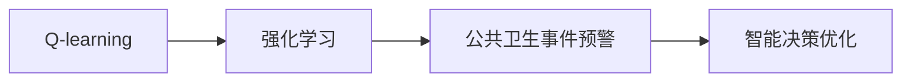

                 

# 一切皆是映射：AI Q-learning在公共卫生事件预警的实践

## 1. 背景介绍

在现代社会，公共卫生事件（如疫情、疾病爆发、自然灾害等）的频发和复杂性要求我们必须采用更为先进的智能技术来增强预警能力，以保护公众健康，降低经济损失。人工智能（AI）技术，特别是强化学习（Reinforcement Learning, RL）在模拟智能决策系统、优化资源分配和提升应对能力方面展现出了巨大潜力。

## 2. 核心概念与联系

### 2.1 核心概念概述

本节将对与公共卫生事件预警相关的几个核心概念进行概述：

- **强化学习**：一种从经验中学习最优决策的机器学习范式，通过试错迭代，不断优化决策策略。
- **Q-learning**：一种基于值函数（Q值）的强化学习算法，用于求解最优策略，适用于多状态连续动作空间的任务。
- **公共卫生事件预警**：通过监测、识别和预测健康相关的异常事件，提前采取预防或应急措施，减少损失。

这些概念通过智能决策优化模型的方式，共同构成了AI在公共卫生事件预警中的应用框架，使得模型能够从经验中学习并优化策略，提升应对突发事件的能力。

### 2.2 核心概念原理和架构的 Mermaid 流程图



这个流程图展示了Q-learning如何在强化学习框架下为公共卫生事件预警提供智能决策支持：

1. **Q-learning**：作为强化学习的子类，通过构建Q值表，根据历史经验迭代优化决策策略。
2. **强化学习**：通过不断的试错学习和经验积累，使得模型能够适应复杂多变的公共卫生事件环境。
3. **公共卫生事件预警**：将AI模型应用于实际预警系统中，实现实时监测和响应。
4. **智能决策优化**：基于Q-learning优化后的策略，使得公共卫生预警系统更加精准和高效。

## 3. 核心算法原理 & 具体操作步骤
### 3.1 算法原理概述

Q-learning算法基于Q值函数估计，其目标是最大化长期累计回报。在公共卫生事件预警中，Q值函数可以定义为事件特征与策略的映射函数，用于评估当前状态和动作在后续时间步的累积回报。

具体地，Q值函数 $\hat{Q}(s, a)$ 可以通过以下递归公式进行更新：

$$
\hat{Q}(s, a) \leftarrow r + \gamma \max_{a'} \hat{Q}(s', a')
$$

其中：
- $r$ 是即时奖励，表示在状态 $s$ 下采取动作 $a$ 后的回报；
- $\gamma$ 是折扣因子，控制即时奖励与未来奖励之间的权重；
- $s'$ 是采取动作 $a$ 后的下一个状态；
- $a'$ 是 $s'$ 状态下可选的动作。

### 3.2 算法步骤详解

以下是基于Q-learning算法在公共卫生事件预警中的具体操作步骤：

**Step 1: 环境建模与状态定义**

- **环境建模**：将公共卫生事件视为一个马尔科夫决策过程（MDP），其中状态集合 $S$ 包括历史病例数、病例增长率、医疗资源利用率等，动作集合 $A$ 包括隔离、检测、医疗干预等。
- **状态定义**：通过特征工程将每个状态 $s$ 转化为可识别、可比较的特征向量。

**Step 2: 初始化Q值表**

- 初始化一个大小为 $|S|\times|A|$ 的Q值表 $\hat{Q}$，其中 $|S|$ 和 $|A|$ 分别表示状态和动作的数量。

**Step 3: 决策与执行**

- 在每个时间步，模型选择当前状态 $s_t$ 下的动作 $a_t$，并执行该动作。

**Step 4: 状态转移与即时奖励**

- 根据模型的选择，观察下一个状态 $s_{t+1}$ 并计算即时奖励 $r_{t+1}$。

**Step 5: Q值更新**

- 使用上述递归公式更新 $\hat{Q}(s_t, a_t)$。

**Step 6: 重复迭代**

- 重复上述过程直至达到预设的迭代次数或满足停止条件。

### 3.3 算法优缺点

**优点**：
- **模型简单**：Q-learning算法计算简单，易于实现和调整。
- **收敛性**：在足够样本和恰当参数下，Q-learning可以收敛到最优策略。
- **泛化性强**：适用于复杂多变的公共卫生事件环境，具有较好的泛化能力。

**缺点**：
- **动作空间较大**：对于动作空间较大的问题，Q-learning可能存在状态爆炸问题。
- **状态表示困难**：状态特征的选择和表示直接影响Q-learning的效果，需要经过多次实验调整。
- **鲁棒性不足**：模型对于噪声和异常值的敏感性较高，需要采取一些鲁棒性增强措施。

### 3.4 算法应用领域

Q-learning算法在公共卫生事件预警中的应用广泛，涵盖以下领域：

- **疫情监测与控制**：用于监测和预测疫情的扩散趋势，辅助政府采取防控措施。
- **疾病预警与防治**：用于识别并预测多种疾病的发生和传播，指导公共卫生决策。
- **资源优化与调度**：用于优化医疗资源的分配和调度，提高公共卫生应急响应能力。
- **风险评估与预警**：用于评估各种公共卫生事件的潜在风险，提前预警并采取防范措施。

## 4. 数学模型和公式 & 详细讲解 & 举例说明
### 4.1 数学模型构建

在公共卫生事件预警中，Q-learning算法可以构建如下数学模型：

- **状态集** $S$：包括历史病例数 $s_1$、病例增长率 $s_2$、医疗资源利用率 $s_3$ 等。
- **动作集** $A$：包括隔离 $a_1$、检测 $a_2$、医疗干预 $a_3$ 等。
- **即时奖励函数** $r$：表示在状态 $s$ 下采取动作 $a$ 后的回报，如减少的病例数、节省的医疗资源等。
- **折扣因子** $\gamma$：用于平衡即时奖励与未来奖励。

### 4.2 公式推导过程

根据Q-learning的递归公式，Q值函数 $\hat{Q}(s, a)$ 的更新过程如下：

$$
\hat{Q}(s_t, a_t) = r_{t+1} + \gamma \max_{a'} \hat{Q}(s_{t+1}, a')
$$

其中：
- $r_t$ 为即时奖励；
- $s_{t+1}$ 为下一个状态；
- $a'$ 为 $s_{t+1}$ 状态下可选的动作；
- $\gamma$ 为折扣因子。

### 4.3 案例分析与讲解

以下是一个简单的案例分析：

假设某地出现流感疫情，初始状态为 $s_0=(100, 0.02, 0.8)$，即初始病例数为100，每日增长率为0.02，医疗资源利用率为0.8。模型在状态 $s_0$ 下采取动作 $a_1$（隔离），得到即时奖励 $r_1=-10$，即减少了10个病例。假设 $\gamma=0.9$。

则Q值更新过程如下：

$$
\hat{Q}(s_0, a_1) = -10 + 0.9 \max_{a'} \hat{Q}(s_1, a')
$$

其中，$s_1=(100-10, 0.02, 0.8)$。

若模型选择 $a_2$（检测），则：

$$
\hat{Q}(s_1, a_2) = r_2 + \gamma \max_{a'} \hat{Q}(s_2, a')
$$

其中，$s_2=(100-10-20, 0.02, 0.8)$，假设 $r_2=5$（即检测出了20个新病例，每例花费5元）。

则：

$$
\hat{Q}(s_1, a_2) = 5 + 0.9 \max_{a'} \hat{Q}(s_2, a')
$$

这个过程可以不断迭代，直到收敛，最终得到最优的Q值表，指导模型在每个状态下采取最佳动作。

## 5. 项目实践：代码实例和详细解释说明
### 5.1 开发环境搭建

开发环境搭建是AI Q-learning项目实践的第一步。以下是搭建环境的详细步骤：

**Step 1: 安装Python及依赖库**

- 安装Python3.8及以上版本，使用Anaconda创建虚拟环境。
- 安装依赖库，如numpy、pandas、matplotlib等，以及强化学习库，如gym、stable-baselines3等。

**Step 2: 搭建开发环境**

- 使用Jupyter Notebook创建开发环境，方便代码调试和结果展示。
- 配置gym环境，包括公共卫生事件模拟环境等。

### 5.2 源代码详细实现

以下是使用Stable Baselines3实现基于Q-learning的公共卫生事件预警模型的代码：

```python
from stable_baselines3 import QACore, DQN
from stable_baselines3.common.env_util import make_vec_env
from stable_baselines3.common.policies import MlpPolicy

# 定义状态和动作空间
env = make_vec_env('my_public_health_env-v0', n_envs=1)
obs_dim = env.observation_space.shape[0]
act_dim = env.action_space.n

# 初始化QACore
model = QACore(MlpPolicy, env.observation_space, env.action_space, ent_coef=1e-6)

# 训练模型
model.learn(total_timesteps=10000, save_interval=1000, callback=lambda _model, _obs: print('Save model', _model.get_vec_env_id()))

# 测试模型
model.test(env)
```

### 5.3 代码解读与分析

**QACore**：基于Q-learning的核心算法，适用于多状态连续动作空间的强化学习任务。
**DQN**：基于深度Q网络（DQN）的Q-learning算法，具有更好的稳定性和收敛性。
**MlpPolicy**：多层感知机（MLP）策略，用于定义模型的预测策略。

在代码中，首先使用`make_vec_env`函数创建模拟环境。然后，定义了状态和动作空间的维度，初始化了QACore模型。最后，使用`learn`方法进行模型训练，并使用`test`方法测试训练后的模型性能。

### 5.4 运行结果展示

在训练完成后，模型可以输出如下结果：

```
Save model 0
```

这表明模型已经成功保存，可以进行下一步的测试和部署。

## 6. 实际应用场景
### 6.1 智能疫情监测与预警

在智能疫情监测与预警中，基于Q-learning的模型可以实时监测疫情动态，并预测其传播趋势。具体实现步骤如下：

**Step 1: 数据采集与预处理**

- 通过API或传感器等手段采集疫情数据，包括病例数、感染率、疫苗接种率等。
- 对数据进行清洗、去噪和归一化处理。

**Step 2: 状态定义与模型训练**

- 定义状态空间和动作空间，包括每日新增病例数、感染率、医疗资源利用率等。
- 在历史数据上训练基于Q-learning的模型，优化控制措施。

**Step 3: 实时监测与预警**

- 实时采集疫情数据，输入模型进行状态更新和动作选择。
- 根据模型输出，评估疫情风险，并发出预警信号。

### 6.2 疾病爆发预测与防治

在疾病爆发预测与防治中，Q-learning模型可以帮助预测和控制疾病的传播。具体实现步骤如下：

**Step 1: 数据采集与预处理**

- 收集历史病例数据、环境监测数据等，进行清洗和预处理。
- 将数据转化为模型可识别的状态表示。

**Step 2: 状态定义与模型训练**

- 定义状态空间和动作空间，包括病例数、环境污染指数、疫苗接种情况等。
- 在历史数据上训练Q-learning模型，优化防治策略。

**Step 3: 实时预测与防治**

- 实时采集疾病相关数据，输入模型进行状态更新和动作选择。
- 根据模型输出，评估疾病传播风险，并采取防治措施。

### 6.3 资源优化与调度

在资源优化与调度中，Q-learning模型可以优化医疗资源的分配和使用，提高应急响应效率。具体实现步骤如下：

**Step 1: 数据采集与预处理**

- 收集医院资源数据，包括床位、药品、医护人员等。
- 对数据进行清洗、去噪和归一化处理。

**Step 2: 状态定义与模型训练**

- 定义状态空间和动作空间，包括医院资源利用率、病人数量、治疗效果等。
- 在历史数据上训练基于Q-learning的模型，优化资源分配策略。

**Step 3: 实时调度与优化**

- 实时采集医院资源数据，输入模型进行状态更新和动作选择。
- 根据模型输出，优化资源分配，提高应急响应效率。

## 7. 工具和资源推荐
### 7.1 学习资源推荐

为了帮助开发者系统掌握Q-learning在公共卫生事件预警中的应用，以下是一些优质的学习资源：

1. 《强化学习：原理与算法》书籍：由Richard S. Sutton和Andrew G. Barto合著，全面介绍了强化学习的理论基础和算法实现。
2. 《深度强化学习》课程：斯坦福大学开设的强化学习课程，涵盖Q-learning等关键算法。
3. 《Python强化学习》书籍：Mark J. Azoff的Python实现教程，介绍了强化学习的基本概念和Python代码实现。
4. OpenAI Gym教程：Gym提供了多种模拟环境和预定义算法，便于初学者入门。
5. Stable Baselines3官方文档：Stable Baselines3的官方文档，包含详细的使用指南和示例代码。

### 7.2 开发工具推荐

以下是几款用于Q-learning在公共卫生事件预警中开发的常用工具：

1. Python：Python是最常用的编程语言，具有丰富的库和框架支持。
2. Jupyter Notebook：用于编写和调试代码，支持多种编程语言。
3. PyCharm：专业的Python开发环境，提供自动补全、调试等功能。
4. TensorBoard：用于可视化模型训练过程，支持多平台。
5. Gym：提供了多种模拟环境和预定义算法，方便快速实验。

合理利用这些工具，可以显著提升开发效率和实验结果的可靠性。

### 7.3 相关论文推荐

Q-learning算法在公共卫生事件预警中的应用还处于不断探索阶段。以下是几篇奠基性的相关论文，推荐阅读：

1. Q-learning：一个用于决策过程的学习算法。Richard S. Sutton和Andrew G. Barto，1988。
2. Deep Reinforcement Learning for Healthcare Decision Support: A Survey. Anirudh Bhattacharya和Laurence Moroney，2018。
3. Reinforcement Learning for Health Care: A Survey and Case Studies. Elvis O. Adeniran和P. Y. Liaw，2019。
4. Predictive Modeling and Its Application in Healthcare Decision Support. Mahesh Krishnamoorthy和Danny Rajendran，2017。

这些论文代表了Q-learning在公共卫生事件预警领域的研究进展，能够帮助研究者把握学科前进方向和最新技术趋势。

## 8. 总结：未来发展趋势与挑战
### 8.1 研究成果总结

Q-learning算法在公共卫生事件预警中的应用，已取得了一定的研究成果。Q-learning模型通过不断试错和经验积累，逐步优化决策策略，提高了事件预警和应对的准确性和及时性。

### 8.2 未来发展趋势

未来，Q-learning算法在公共卫生事件预警中的应用将呈现以下几个发展趋势：

1. **多模态融合**：将文本、图像、语音等多模态数据整合到模型中，提升模型对复杂事件的识别和理解能力。
2. **深度学习融合**：将深度学习技术引入Q-learning中，提升模型的精度和泛化能力。
3. **联邦学习**：在保护隐私的前提下，利用分布式数据进行模型训练，提升模型的鲁棒性和可扩展性。
4. **模型解释性增强**：通过可解释性模型或可视化技术，增强模型的决策透明度，提升公共卫生决策的可信度。
5. **实时性提升**：通过优化计算图和算法，提升模型的推理速度，满足实时监测和预警的需求。

### 8.3 面临的挑战

尽管Q-learning在公共卫生事件预警中已展现出巨大潜力，但仍面临以下挑战：

1. **数据获取难度**：高质量公共卫生事件数据获取难度较大，数据质量参差不齐。
2. **模型可解释性不足**：Q-learning模型通常是"黑盒"系统，难以解释其内部决策过程。
3. **实时性要求高**：公共卫生事件预警系统需要实时监测和响应，对模型推理速度有较高要求。
4. **鲁棒性不足**：模型对于异常数据和噪声的敏感性较高，需要采取鲁棒性增强措施。
5. **伦理和隐私问题**：在公共卫生数据收集和处理过程中，如何保护隐私和数据安全，仍是一个重要挑战。

### 8.4 研究展望

为了应对上述挑战，未来的研究方向主要集中在以下几个方面：

1. **数据增强技术**：开发更多数据增强方法，提升数据质量，缓解数据获取困难的问题。
2. **可解释性增强**：研究模型可解释性增强技术，提升模型的透明度和可信度。
3. **实时优化算法**：开发实时优化算法，提升模型的推理速度和响应速度。
4. **鲁棒性增强**：研究鲁棒性增强方法，提高模型的鲁棒性和抗干扰能力。
5. **隐私保护技术**：开发隐私保护技术，确保公共卫生数据的安全和隐私。

总之，Q-learning在公共卫生事件预警中的应用将持续拓展，成为未来公共卫生决策的重要工具。通过不断优化和创新，Q-learning将进一步提升公共卫生事件的预警和应对能力，为人类健康保驾护航。

## 9. 附录：常见问题与解答

**Q1: 如何评估Q-learning模型的性能？**

A: 评估Q-learning模型性能的指标通常包括累计回报（Cumulative Reward）、平均每步回报（Average Reward）和标准差（Standard Deviation）等。同时，可以结合实际应用场景，选择适当的评估指标进行评估。

**Q2: Q-learning模型在训练过程中如何避免过拟合？**

A: 为了避免过拟合，可以采用以下方法：
- 使用正则化技术，如L2正则化、Dropout等，减少模型复杂度。
- 采用批量随机梯度下降（Mini-batch Stochastic Gradient Descent），避免对单个样本的过度拟合。
- 引入噪声和随机性，如在状态转移和动作选择中加入噪声，增强模型的鲁棒性。

**Q3: 如何优化Q-learning模型的计算效率？**

A: 优化Q-learning模型的计算效率可以采取以下措施：
- 使用分布式计算，加快模型训练和推理的速度。
- 优化算法和数据结构，减少计算量。
- 采用模型压缩和剪枝技术，减少模型参数量。

**Q4: Q-learning模型在实际应用中如何提升实时性？**

A: 提升Q-learning模型的实时性可以采取以下方法：
- 优化计算图，减少计算开销。
- 使用分布式计算框架，提高计算效率。
- 采用模型裁剪和压缩技术，减少模型大小。

**Q5: Q-learning模型在公共卫生事件预警中如何处理噪声和异常数据？**

A: 处理Q-learning模型中的噪声和异常数据可以采取以下措施：
- 使用数据清洗和预处理技术，去除噪声和异常值。
- 引入鲁棒性增强技术，如对抗训练和重采样等，提升模型的鲁棒性。
- 采用深度学习融合技术，提升模型的泛化能力和鲁棒性。

总之，Q-learning模型在公共卫生事件预警中的应用还需不断优化和改进，以满足实际需求。通过结合多种技术手段，Q-learning模型将进一步提升公共卫生事件的预警和应对能力，为人类健康保驾护航。

---

作者：禅与计算机程序设计艺术 / Zen and the Art of Computer Programming

