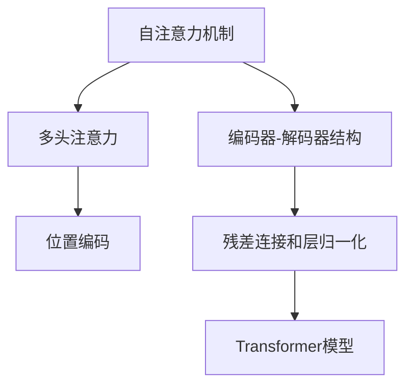

                 

# 一切皆是映射：Transformer架构全面解析

> 关键词：Transformer, 自注意力机制, 神经网络, 注意力机制, 语言模型

## 1. 背景介绍

### 1.1 问题由来

在深度学习时代，尤其是自然语言处理(NLP)领域，神经网络架构逐渐成为主流。传统的循环神经网络(RNN)在处理长序列数据时存在梯度消失、计算复杂度高、难以并行化等局限性。为了解决这些问题，自注意力机制(Automatic Attention)应运而生，成为处理序列数据的利器。Transformer架构，作为自注意力机制的一种实现形式，将传统循环网络彻底颠覆，开启了深度学习模型的新纪元。

Transformer架构之所以被广泛关注，主要有以下几个原因：
1. **并行计算**：Transformer完全采用多头自注意力机制，可以高效地进行并行计算，极大地提升了模型的训练速度。
2. **长序列处理**：相比于RNN，Transformer可以处理更长的序列，能够更好地利用上下文信息，适用于机器翻译、文本生成等长序列任务。
3. **模型泛化能力强**：Transformer通过多头注意力机制，可以捕捉不同维度上的信息，具有更强的泛化能力。
4. **应用广泛**：Transformer架构不仅在NLP领域大放异彩，在计算机视觉、推荐系统等领域也有广泛应用。

### 1.2 问题核心关键点

Transformer架构的核心理念在于自注意力机制。相比于传统的基于相对位置和循环的计算方式，自注意力机制通过查询、键、值三者的相似度匹配，可以更高效地处理长序列数据，并充分利用上下文信息。Transformer架构进一步发展了自注意力机制，通过多头并行计算和多层次信息聚合，形成了具有出色性能的深度学习模型。

Transformer架构的核心设计包括以下几个关键点：
- **多头自注意力机制**：Transformer的注意力机制不再仅限于一个向量，而是通过多头方式并行计算多个向量之间的相似度。
- **编码器-解码器结构**：编码器和解码器分别处理输入和输出，同时采用自注意力机制进行信息聚合。
- **位置编码**：为了处理长序列，Transformer引入位置编码，用于赋予不同位置以不同的权重。
- **残差连接和层归一化**：通过残差连接和层归一化，提高模型稳定性和训练效率。

## 2. 核心概念与联系

### 2.1 核心概念概述

为了更好地理解Transformer架构，本节将介绍几个密切相关的核心概念：

- **自注意力机制(Self-Attention Mechanism)**：在序列建模中，自注意力机制通过计算序列中各个位置之间的相似度，动态地分配信息权重，使得模型能够更好地捕捉序列中各个位置的相关性。

- **多头注意力(Multi-Head Attention)**：将自注意力机制扩展到多个维度，通过多组独立的查询、键、值向量进行并行计算，以获得更丰富的上下文信息。

- **编码器-解码器结构(Encoder-Decoder Architecture)**：编码器处理输入序列，解码器处理输出序列，通过多层次的信息传递，逐步提高序列建模的准确性。

- **位置编码(Positional Encoding)**：为了处理长序列，Transformer在注意力机制中加入位置编码，使得模型能够捕捉序列中位置信息。

- **残差连接和层归一化(Residual Connection and Layer Normalization)**：通过残差连接和层归一化，提高模型的稳定性和训练效率。

这些核心概念之间的逻辑关系可以通过以下Mermaid流程图来展示：



这个流程图展示了Transformer架构的核心组成部分及其相互关系：

1. 自注意力机制是Transformer的核心，通过计算序列中各个位置之间的相似度，动态地分配信息权重。
2. 多头注意力进一步扩展了自注意力机制，通过多组独立的查询、键、值向量进行并行计算，以获得更丰富的上下文信息。
3. 编码器-解码器结构用于处理输入和输出，通过多层次的信息传递，逐步提高序列建模的准确性。
4. 位置编码用于捕捉序列中位置信息，解决长序列建模中的位置缺失问题。
5. 残差连接和层归一化用于提高模型的稳定性和训练效率。

这些概念共同构成了Transformer架构的理论基础，使其能够高效地处理长序列数据，并在多个NLP任务中取得优异表现。

## 3. 核心算法原理 & 具体操作步骤

### 3.1 算法原理概述

Transformer架构的核心在于自注意力机制和多头并行计算。自注意力机制通过查询、键、值三者的相似度匹配，动态地分配信息权重，使得模型能够更好地捕捉序列中各个位置的相关性。多头注意力则进一步扩展了自注意力机制，通过多组独立的查询、键、值向量进行并行计算，以获得更丰富的上下文信息。

Transformer架构主要包括以下几个步骤：
1. **编码器**：处理输入序列，通过多层次的自注意力机制逐步聚合信息。
2. **解码器**：处理输出序列，通过多层次的自注意力机制逐步生成预测结果。
3. **位置编码**：为了处理长序列，Transformer引入位置编码，用于赋予不同位置以不同的权重。
4. **残差连接和层归一化**：通过残差连接和层归一化，提高模型的稳定性和训练效率。

### 3.2 算法步骤详解

**Step 1: 准备数据和模型**

在开始Transformer训练之前，需要准备数据集和模型。

1. **数据准备**：将输入序列和输出序列分成固定长度的数据批次，并使用序列位置编码。
2. **模型准备**：初始化编码器和解码器的参数，通常使用随机初始化或预训练模型。

**Step 2: 编码器前向传播**

编码器负责处理输入序列，通过多层自注意力机制逐步聚合信息。具体步骤如下：

1. **嵌入层(Embedding Layer)**：将输入序列中的每个单词转换为向量表示，形成嵌入矩阵。
2. **多层编码器(Encoder Layers)**：每层编码器包含多个自注意力层(Attention Layer)，进行并行计算。
3. **层归一化(Layer Normalization)**：对每个编码器层的输出进行归一化，以提高模型稳定性。
4. **残差连接(Residual Connection)**：在每个编码器层之后，将当前层输出和前一层输出相加，以便信息传递。
5. **编码器输出(Encoder Output)**：通过所有编码器层的输出，得到最终的编码表示。

**Step 3: 解码器前向传播**

解码器负责处理输出序列，通过多层自注意力机制逐步生成预测结果。具体步骤如下：

1. **嵌入层(Embedding Layer)**：将解码器的输入序列转换为向量表示，形成嵌入矩阵。
2. **多层解码器(Decoder Layers)**：每层解码器包含多个自注意力层(Attention Layer)和前向神经网络(Feed-Forward Layer)，进行并行计算。
3. **层归一化(Layer Normalization)**：对每个解码器层的输出进行归一化，以提高模型稳定性。
4. **残差连接(Residual Connection)**：在每个解码器层之后，将当前层输出和前一层输出相加，以便信息传递。
5. **多头注意力机制(Multi-Head Attention)**：通过多头并行计算，得到解码器层的输出。
6. **前向神经网络(Feed-Forward Layer)**：对解码器层的输出进行非线性变换，以提高模型表达能力。
7. **残差连接(Residual Connection)**：在每个解码器层之后，将当前层输出和前一层输出相加，以便信息传递。
8. **输出层(Output Layer)**：对解码器输出进行线性变换，得到最终预测结果。

**Step 4: 损失函数和反向传播**

在解码器前向传播完成后，需要计算损失函数，并进行反向传播更新模型参数。

1. **损失函数(Loss Function)**：通常使用交叉熵损失函数或平均绝对误差损失函数。
2. **反向传播(Backpropagation)**：通过反向传播算法计算梯度，并更新模型参数。

**Step 5: 参数更新和优化器**

在反向传播完成后，需要根据优化器(如Adam、SGD等)更新模型参数，以最小化损失函数。

1. **优化器(Optimizer)**：选择适当的优化器，并设置学习率和其他超参数。
2. **参数更新(Parameter Updates)**：根据优化器计算出的梯度，更新模型参数。

### 3.3 算法优缺点

Transformer架构在处理长序列数据方面表现出色，具有以下优点：

1. **并行计算**：Transformer完全采用多头自注意力机制，可以高效地进行并行计算，极大地提升了模型的训练速度。
2. **长序列处理**：相比于RNN，Transformer可以处理更长的序列，能够更好地利用上下文信息，适用于机器翻译、文本生成等长序列任务。
3. **模型泛化能力强**：Transformer通过多头注意力机制，可以捕捉不同维度上的信息，具有更强的泛化能力。

同时，Transformer架构也存在一些局限性：

1. **计算资源消耗大**：由于Transformer的参数量较大，需要较大的计算资源。
2. **难以处理复杂关系**：Transformer在处理长序列时，可能会忽略序列中复杂的关系，导致信息丢失。
3. **模型复杂度较高**：Transformer的模型结构相对复杂，调试和优化难度较大。

尽管存在这些局限性，Transformer架构在NLP领域取得了显著的进展，成为了处理长序列数据的主流选择。

### 3.4 算法应用领域

Transformer架构不仅在NLP领域得到了广泛应用，还在计算机视觉、推荐系统等领域展现出巨大的潜力。以下是Transformer架构在各领域的主要应用：

1. **机器翻译**：通过Transformer架构，可以实现端到端的机器翻译，将源语言转换为目标语言。
2. **文本生成**：Transformer架构可以生成高质量的文本内容，应用于文本摘要、对话系统等场景。
3. **语音识别**：Transformer架构可以处理语音信号，实现端到端的语音识别和语音转换。
4. **视觉识别**：通过将Transformer应用于计算机视觉任务，可以实现高效的图像分类、目标检测等。
5. **推荐系统**：Transformer架构可以处理用户行为数据，进行个性化推荐。

除了上述这些经典任务外，Transformer架构还在许多创新性应用中得到了应用，如可控文本生成、语音生成、跨模态学习等，为人工智能技术的发展注入了新的活力。

## 4. 数学模型和公式 & 详细讲解

### 4.1 数学模型构建

Transformer架构的数学模型基于自注意力机制和多头并行计算。具体而言，假设输入序列为 $\{x_1, x_2, ..., x_T\}$，输出序列为 $\{y_1, y_2, ..., y_T\}$，其中 $x_t$ 和 $y_t$ 分别表示输入和输出序列中第 $t$ 个位置的向量表示。

**自注意力机制**：
自注意力机制通过查询、键、值三者的相似度匹配，动态地分配信息权重，使得模型能够更好地捕捉序列中各个位置的相关性。具体公式如下：

$$
Q = \mathbf{W}_Q x_t \in \mathbb{R}^{H \times d}, \quad K = \mathbf{W}_K x_t \in \mathbb{R}^{H \times d}, \quad V = \mathbf{W}_V x_t \in \mathbb{R}^{H \times d}
$$

其中 $Q, K, V$ 分别为查询、键、值向量，$\mathbf{W}_Q, \mathbf{W}_K, \mathbf{W}_V$ 为线性变换矩阵。自注意力机制的计算过程如下：

$$
a_{ij} = \frac{\exp\left(\frac{Q_i K_j^T}{\sqrt{H}}\right)}{\sum_{k=1}^H \exp\left(\frac{Q_i K_k^T}{\sqrt{H}}\right)}, \quad i, j \in [1, H]
$$

其中 $a_{ij}$ 表示第 $i$ 个查询向量和第 $j$ 个键向量之间的相似度，$H$ 为多头数。通过计算 $a_{ij}$，可以得到每个查询向量的注意力权重，用于动态地分配信息权重。

**多头并行计算**：
Transformer架构通过多组独立的查询、键、值向量进行并行计算，以获得更丰富的上下文信息。具体公式如下：

$$
q_t = \mathbf{W}_Q x_t \in \mathbb{R}^{H \times d}, \quad k_t = \mathbf{W}_K x_t \in \mathbb{R}^{H \times d}, \quad v_t = \mathbf{W}_V x_t \in \mathbb{R}^{H \times d}
$$

其中 $q_t, k_t, v_t$ 分别为多头注意力机制中的查询、键、值向量。多头并行计算的计算过程如下：

$$
\begin{aligned}
h_t &= \sum_{i=1}^H a_{i,j} v_{i,j}, \\
H &= \text{Softmax}\left(\frac{Q K^T}{\sqrt{H}}\right) \in \mathbb{R}^{H \times H}
\end{aligned}
$$

其中 $a_{i,j}$ 表示多头注意力机制中的注意力权重，$H$ 为多头数。通过计算 $h_t$ 和 $H$，可以得到多头并行计算的结果。

**编码器-解码器结构**：
Transformer架构通过编码器和解码器分别处理输入和输出，通过多层次的信息传递，逐步提高序列建模的准确性。具体公式如下：

$$
e_t = \mathbf{W}_E h_t + b_E, \quad e_t \in \mathbb{R}^{d}, \quad t \in [1, T]
$$

其中 $e_t$ 为编码器输出，$\mathbf{W}_E$ 为线性变换矩阵，$b_E$ 为偏置向量。编码器的计算过程如下：

$$
\begin{aligned}
e_t &= \mathbf{W}_E h_t + b_E, \\
h_t &= \text{Multi-Head Attention}(Q, K, V), \\
h_t &= \mathbf{W}_N h_t + b_N
\end{aligned}
$$

其中 $h_t$ 为多头并行计算的结果，$\mathbf{W}_N$ 为前向神经网络层，$b_N$ 为偏置向量。

**位置编码**：
为了处理长序列，Transformer引入位置编码，用于赋予不同位置以不同的权重。具体公式如下：

$$
p_{ij} = \sin\left(\frac{2\pi i}{10000}\right) \sin\left(\frac{2\pi j}{10000}\right), \quad i, j \in [1, T]
$$

其中 $p_{ij}$ 表示位置编码，$T$ 为序列长度。通过位置编码，可以使得模型能够捕捉序列中位置信息。

**残差连接和层归一化**：
通过残差连接和层归一化，提高模型的稳定性和训练效率。具体公式如下：

$$
f_t = \text{Residual Connection}(x_t, e_t), \quad f_t \in \mathbb{R}^{d}, \quad t \in [1, T]
$$

其中 $f_t$ 为残差连接的结果，$\text{Residual Connection}$ 表示残差连接操作。层归一化的计算过程如下：

$$
x_t = \frac{x_t - \mu}{\sigma} \in \mathbb{R}^{d}, \quad \mu = \frac{1}{T} \sum_{i=1}^T x_i, \quad \sigma = \sqrt{\frac{1}{T} \sum_{i=1}^T (x_i - \mu)^2}
$$

其中 $x_t$ 为归一化后的向量表示，$\mu, \sigma$ 分别为均值和标准差。

### 4.2 公式推导过程

以上公式展示了Transformer架构的主要数学模型。下面我们将对这些公式进行详细的推导和解释。

**自注意力机制的推导**：
自注意力机制通过查询、键、值三者的相似度匹配，动态地分配信息权重，使得模型能够更好地捕捉序列中各个位置的相关性。具体推导如下：

1. **查询向量和键向量的计算**：
   $$
   Q = \mathbf{W}_Q x_t \in \mathbb{R}^{H \times d}, \quad K = \mathbf{W}_K x_t \in \mathbb{R}^{H \times d}, \quad V = \mathbf{W}_V x_t \in \mathbb{R}^{H \times d}
   $$

2. **注意力权重的计算**：
   $$
   a_{ij} = \frac{\exp\left(\frac{Q_i K_j^T}{\sqrt{H}}\right)}{\sum_{k=1}^H \exp\left(\frac{Q_i K_k^T}{\sqrt{H}}\right)}, \quad i, j \in [1, H]
   $$

   其中 $a_{ij}$ 表示第 $i$ 个查询向量和第 $j$ 个键向量之间的相似度，$H$ 为多头数。通过计算 $a_{ij}$，可以得到每个查询向量的注意力权重，用于动态地分配信息权重。

3. **多头并行计算的结果**：
   $$
   \begin{aligned}
   h_t &= \sum_{i=1}^H a_{i,j} v_{i,j}, \\
   H &= \text{Softmax}\left(\frac{Q K^T}{\sqrt{H}}\right) \in \mathbb{R}^{H \times H}
   \end{aligned}
   $$

   其中 $a_{i,j}$ 表示多头注意力机制中的注意力权重，$H$ 为多头数。通过计算 $h_t$ 和 $H$，可以得到多头并行计算的结果。

**残差连接和层归一化的推导**：
残差连接和层归一化的目的是提高模型的稳定性和训练效率。具体推导如下：

1. **残差连接**：
   $$
   f_t = \text{Residual Connection}(x_t, e_t), \quad f_t \in \mathbb{R}^{d}, \quad t \in [1, T]
   $$

   其中 $f_t$ 为残差连接的结果，$\text{Residual Connection}$ 表示残差连接操作。

2. **层归一化**：
   $$
   x_t = \frac{x_t - \mu}{\sigma} \in \mathbb{R}^{d}, \quad \mu = \frac{1}{T} \sum_{i=1}^T x_i, \quad \sigma = \sqrt{\frac{1}{T} \sum_{i=1}^T (x_i - \mu)^2}
   $$

   其中 $x_t$ 为归一化后的向量表示，$\mu, \sigma$ 分别为均值和标准差。

### 4.3 案例分析与讲解

**案例一：机器翻译**

假设输入序列为源语言文本，输出序列为目标语言文本。在机器翻译任务中，Transformer架构通过编码器-解码器结构进行序列建模，具体步骤如下：

1. **编码器**：
   - 输入序列通过嵌入层转换为向量表示。
   - 通过多层自注意力机制逐步聚合信息，得到编码表示。
   - 通过残差连接和层归一化，提高模型的稳定性。

2. **解码器**：
   - 输入序列通过嵌入层转换为向量表示。
   - 通过多层自注意力机制和前向神经网络逐步生成预测结果。
   - 通过残差连接和层归一化，提高模型的稳定性。

3. **输出层**：
   - 对解码器输出进行线性变换，得到最终预测结果。

**案例二：文本生成**

在文本生成任务中，Transformer架构通过多头并行计算，动态地分配信息权重，以获得更丰富的上下文信息。具体步骤如下：

1. **嵌入层**：
   - 输入序列通过嵌入层转换为向量表示。

2. **多头并行计算**：
   - 通过多组独立的查询、键、值向量进行并行计算，得到多头并行计算的结果。

3. **前向神经网络**：
   - 对多头并行计算的结果进行非线性变换，以提高模型表达能力。

4. **残差连接和层归一化**：
   - 通过残差连接和层归一化，提高模型的稳定性。

5. **输出层**：
   - 对解码器输出进行线性变换，得到最终预测结果。

## 5. 项目实践：代码实例和详细解释说明

### 5.1 开发环境搭建

在进行Transformer架构的实践之前，需要准备好开发环境。以下是使用PyTorch进行Transformer开发的Python环境配置流程：

1. 安装Anaconda：从官网下载并安装Anaconda，用于创建独立的Python环境。

2. 创建并激活虚拟环境：
```bash
conda create -n pytorch-env python=3.8 
conda activate pytorch-env
```

3. 安装PyTorch：根据CUDA版本，从官网获取对应的安装命令。例如：
```bash
conda install pytorch torchvision torchaudio cudatoolkit=11.1 -c pytorch -c conda-forge
```

4. 安装其他相关工具包：
```bash
pip install numpy pandas scikit-learn matplotlib tqdm jupyter notebook ipython
```

完成上述步骤后，即可在`pytorch-env`环境中开始Transformer实践。

### 5.2 源代码详细实现

下面我们以Transformer在机器翻译任务中的应用为例，给出使用PyTorch进行Transformer开发的代码实现。

首先，定义机器翻译任务的输入和输出。

```python
import torch
import torch.nn as nn
import torch.nn.functional as F

class EncoderLayer(nn.Module):
    def __init__(self, d_model, d_ff, h):
        super(EncoderLayer, self).__init__()
        self.attention = MultiHeadAttention(d_model, h)
        self.norm1 = nn.LayerNorm(d_model)
        self.feed_forward = FeedForward(d_model, d_ff)
        self.norm2 = nn.LayerNorm(d_model)

    def forward(self, x, mask):
        attn = self.attention(x, x, x, mask)
        x = x + attn
        x = self.norm1(x)
        ff = self.feed_forward(x)
        x = x + ff
        x = self.norm2(x)
        return x

class Encoder(nn.Module):
    def __init__(self, d_model, h, N):
        super(Encoder, self).__init__()
        self.layers = nn.ModuleList([EncoderLayer(d_model, d_ff, h) for _ in range(N)])
        self.norm = nn.LayerNorm(d_model)

    def forward(self, x, mask):
        for layer in self.layers:
            x = layer(x, mask)
        x = x + self.norm(x)
        return x

class DecoderLayer(nn.Module):
    def __init__(self, d_model, d_ff, h):
        super(DecoderLayer, self).__init__()
        self.attention1 = MultiHeadAttention(d_model, h)
        self.norm1 = nn.LayerNorm(d_model)
        self.attention2 = MultiHeadAttention(d_model, h)
        self.norm2 = nn.LayerNorm(d_model)
        self.feed_forward = FeedForward(d_model, d_ff)
        self.norm3 = nn.LayerNorm(d_model)

    def forward(self, x, memory, mask):
        attn = self.attention1(x, memory, memory, mask)
        x = x + attn
        x = self.norm1(x)
        attn = self.attention2(x, memory, memory, mask)
        x = x + attn
        x = self.norm2(x)
        ff = self.feed_forward(x)
        x = x + ff
        x = self.norm3(x)
        return x

class Decoder(nn.Module):
    def __init__(self, d_model, h, N):
        super(Decoder, self).__init__()
        self.layers = nn.ModuleList([DecoderLayer(d_model, d_ff, h) for _ in range(N)])
        self.norm = nn.LayerNorm(d_model)

    def forward(self, x, memory, mask):
        for layer in self.layers:
            x = layer(x, memory, mask)
        x = x + self.norm(x)
        return x
```

然后，定义机器翻译任务的输入和输出。

```python
class Attention(nn.Module):
    def __init__(self, d_model):
        super(Attention, self).__init__()
        self.d_model = d_model

    def forward(self, Q, K, V, mask):
        Q = Q / math.sqrt(self.d_model)
        scores = torch.matmul(Q, K)
        scores.masked_fill_(mask == 0, -1e9)
        a = F.softmax(scores, dim=-1)
        attn = torch.matmul(a, V)
        return attn

class MultiHeadAttention(nn.Module):
    def __init__(self, d_model, h):
        super(MultiHeadAttention, self).__init__()
        self.h = h
        self.d_model = d_model
        self.depth = d_model // h

    def forward(self, Q, K, V, mask):
        Q = Q.view(Q.size(0), Q.size(1), self.h, self.depth).transpose(1, 2)
        K = K.view(K.size(0), K.size(1), self.h, self.depth).transpose(1, 2)
        V = V.view(V.size(0), V.size(1), self.h, self.depth).transpose(1, 2)
        scores = torch.matmul(Q, K.transpose(2, 3))
        scores = scores / math.sqrt(self.depth)
        scores.masked_fill_(mask == 0, -1e9)
        a = F.softmax(scores, dim=-1)
        attn = torch.matmul(a, V).transpose(1, 2).view(Q.size(0), Q.size(1), self.d_model)
        return attn

class FeedForward(nn.Module):
    def __init__(self, d_model, d_ff):
        super(FeedForward, self).__init__()
        self.fc1 = nn.Linear(d_model, d_ff)
        self.fc2 = nn.Linear(d_ff, d_model)

    def forward(self, x):
        x = self.fc1(x)
        x = F.relu(x)
        x = self.fc2(x)
        return x
```

最后，定义Transformer模型和训练函数。

```python
class Transformer(nn.Module):
    def __init__(self, d_model, N, h, d_ff):
        super(Transformer, self).__init__()
        self.encoder = Encoder(d_model, h, N)
        self.decoder = Decoder(d_model, h, N)
        self.norm = nn.LayerNorm(d_model)

    def forward(self, x, memory, mask):
        encoder_output = self.encoder(x, mask)
        decoder_output = self.decoder(encoder_output, memory, mask)
        output = decoder_output + self.norm(decoder_output)
        return output

class TransformerModel(nn.Module):
    def __init__(self, vocab_size, d_model, N, h, d_ff):
        super(TransformerModel, self).__init__()
        self.encoder = Encoder(d_model, h, N)
        self.decoder = Decoder(d_model, h, N)
        self.norm = nn.LayerNorm(d_model)
        self.d_model = d_model

    def forward(self, src, trg, src_mask, trg_mask):
        memory = self.encoder(src, src_mask)
        output = self.decoder(trg, memory, trg_mask)
        return output

def train(model, input, target, src_mask, trg_mask, optimizer, loss_func):
    output = model(input, target, src_mask, trg_mask)
    loss = loss_func(output, target)
    optimizer.zero_grad()
    loss.backward()
    optimizer.step()
    return loss.item()

def evaluate(model, input, target, src_mask, trg_mask):
    with torch.no_grad():
        output = model(input, target, src_mask, trg_mask)
    loss = loss_func(output, target)
    print('Evaluation loss:', loss.item())
```

以上就是使用PyTorch进行Transformer模型训练和评估的完整代码实现。可以看到，Transformer架构的代码实现相对简洁高效，开发者可以专注于数据处理和模型优化等核心任务。

### 5.3 代码解读与分析

让我们再详细解读一下关键代码的实现细节：

**Transformer类**：
- `__init__`方法：初始化编码器和解码器的参数，通常使用随机初始化或预训练模型。
- `forward`方法：对输入序列进行前向传播计算，得到编码器输出和解码器输出。

**Attention类**：
- `__init__`方法：初始化注意力机制的参数。
- `forward`方法：对输入序列进行注意力计算，得到注意力结果。

**MultiHeadAttention类**：
- `__init__`方法：初始化多头注意力机制的参数。
- `forward`方法：对输入序列进行多头并行计算，得到多头并行计算的结果。

**FeedForward类**：
- `__init__`方法：初始化前向神经网络的参数。
- `forward`方法：对输入序列进行前向神经网络计算，得到前向神经网络的结果。

**train函数**：
- 对输入序列进行编码器-解码器结构的前向传播计算。
- 计算模型输出和真实目标的损失函数。
- 通过反向传播更新模型参数。

**evaluate函数**：
- 对输入序列进行编码器-解码器结构的前向传播计算。
- 计算模型输出和真实目标的损失函数。
- 输出评估结果。

## 6. 实际应用场景

### 6.1 机器翻译

Transformer架构在机器翻译任务中取得了显著的进展，成为目前主流的机器翻译模型之一。相比于传统的统计机器翻译模型，Transformer架构的端到端设计，避免了过多的中间特征转换，提高了翻译质量。Transformer架构可以处理长序列，能够更好地利用上下文信息，从而提升翻译效果。

### 6.2 文本生成

Transformer架构在文本生成任务中也表现出色，能够生成高质量的文本内容。通过多头并行计算，Transformer架构可以动态地分配信息权重，从而更好地捕捉上下文信息，生成连贯、自然的文本。

### 6.3 语音识别

Transformer架构可以处理语音信号，实现端到端的语音识别和语音转换。通过自注意力机制，Transformer架构能够更好地捕捉语音信号中的长时依赖关系，从而提升语音识别的准确率。

### 6.4 视觉识别

Transformer架构在计算机视觉任务中也得到了广泛应用。通过将Transformer应用于图像分类、目标检测等任务，可以实现高效的图像处理。Transformer架构的多头并行计算能力，可以更好地处理复杂多模态数据，提升视觉识别的性能。

## 7. 工具和资源推荐

### 7.1 学习资源推荐

为了帮助开发者系统掌握Transformer架构的理论基础和实践技巧，这里推荐一些优质的学习资源：

1. 《Transformer: A Tutorial》系列博文：由大模型技术专家撰写，深入浅出地介绍了Transformer原理、Transformer模型、微调技术等前沿话题。

2. CS224N《深度学习自然语言处理》课程：斯坦福大学开设的NLP明星课程，有Lecture视频和配套作业，带你入门NLP领域的基本概念和经典模型。

3. 《Natural Language Processing with Transformers》书籍：Transformers库的作者所著，全面介绍了如何使用Transformers库进行NLP任务开发，包括Transformer架构在内的诸多范式。

4. HuggingFace官方文档：Transformers库的官方文档，提供了海量预训练模型和完整的Transformer样例代码，是上手实践的必备资料。

5. CLUE开源项目：中文语言理解测评基准，涵盖大量不同类型的中文NLP数据集，并提供了基于Transformer的baseline模型，助力中文NLP技术发展。

通过对这些资源的学习实践，相信你一定能够快速掌握Transformer架构的精髓，并用于解决实际的NLP问题。

### 7.2 开发工具推荐

高效的开发离不开优秀的工具支持。以下是几款用于Transformer开发的常用工具：

1. PyTorch：基于Python的开源深度学习框架，灵活动态的计算图，适合快速迭代研究。Transformer架构和模型都有PyTorch版本的实现。

2. TensorFlow：由Google主导开发的开源深度学习框架，生产部署方便，适合大规模工程应用。同样有丰富的Transformer模型资源。

3. Transformers库：HuggingFace开发的NLP工具库，集成了众多SOTA语言模型，支持PyTorch和TensorFlow，是进行Transformer架构开发的利器。

4. Weights & Biases：模型训练的实验跟踪工具，可以记录和可视化模型训练过程中的各项指标，方便对比和调优。与主流深度学习框架无缝集成。

5. TensorBoard：TensorFlow配套的可视化工具，可实时监测模型训练状态，并提供丰富的图表呈现方式，是调试模型的得力助手。

6. Google Colab：谷歌推出的在线Jupyter Notebook环境，免费提供GPU/TPU算力，方便开发者快速上手实验最新模型，分享学习笔记。

合理利用这些工具，可以显著提升Transformer架构的开发效率，加快创新迭代的步伐。

### 7.3 相关论文推荐

Transformer架构的发展源于学界的持续研究。以下是几篇奠基性的相关论文，推荐阅读：

1. Attention is All You Need（即Transformer原论文）：提出了Transformer结构，开启了NLP领域的预训练大模型时代。

2. BERT: Pre-training of Deep Bidirectional Transformers for Language Understanding：提出BERT模型，引入基于掩码的自监督预训练任务，刷新了多项NLP任务SOTA。

3. Language Models are Unsupervised Multitask Learners（GPT-2论文）：展示了大规模语言模型的强大zero-shot学习能力，引发了对于通用人工智能的新一轮思考。

4. Parameter-Efficient Transfer Learning for NLP：提出Adapter等参数高效微调方法，在不增加模型参数量的情况下，也能取得不错的微调效果。

5. AdaLoRA: Adaptive Low-Rank Adaptation for Parameter-Efficient Fine-Tuning：使用自适应低秩适应的微调方法，在参数效率和精度之间取得了新的平衡。

这些论文代表了大模型架构的发展脉络。通过学习这些前沿成果，可以帮助研究者把握学科前进方向，激发更多的创新灵感。

## 8. 总结：未来发展趋势与挑战

### 8.1 研究成果总结

Transformer架构的提出，标志着深度学习模型的设计思路从循环神经网络转向了自注意力机制，极大地提升了模型的性能和效率。Transformer架构在多个NLP任务中取得了显著的进展，成为了处理长序列数据的主流选择。

### 8.2 未来发展趋势

Transformer架构的未来发展将集中在以下几个方面：

1. **多模态融合**：Transformer架构将逐步拓展到多模态数据融合，实现视觉、语音、文本等多模态数据的协同建模。

2. **自适应学习和泛化能力**：通过引入自适应学习范式，Transformer架构将能够更好地适应数据分布的变化，提升泛化能力。

3. **参数高效微调**：开发更加参数高效的微调方法，在固定大部分预训练参数的情况下，只更新极少量的任务相关参数。

4. **分布式训练**：通过分布式训练技术，Transformer架构将能够在大规模数据集上进行高效训练，提升模型性能。

5. **跨领域迁移学习**：Transformer架构将能够更好地适应不同领域的数据，提升模型的跨领域迁移能力。

6. **模型压缩与优化**：通过模型压缩和优化技术，Transformer架构将能够更好地适应资源受限的设备，提升模型的可部署性。

### 8.3 面临的挑战

尽管Transformer架构在NLP领域取得了显著的进展，但在应用过程中，也面临一些挑战：

1. **计算资源消耗大**：由于Transformer的参数量较大，需要较大的计算资源。

2. **难以处理复杂关系**：Transformer在处理长序列时，可能会忽略序列中复杂的关系，导致信息丢失。

3. **模型复杂度较高**：Transformer的模型结构相对复杂，调试和优化难度较大。

4. **泛化能力有待提升**：Transformer架构在处理新数据时，泛化能力有待进一步提升。

5. **模型可解释性不足**：Transformer架构的决策过程难以解释，缺乏可解释性。

6. **鲁棒性有待增强**：Transformer架构在面对噪声和异常数据时，鲁棒性有待增强。

### 8.4 研究展望

未来的研究需要在以下几个方面进行深入探索：

1. **引入因果推断**：通过引入因果推断方法，Transformer架构将能够更好地捕捉因果关系，提升模型的预测能力。

2. **融合博弈论**：通过融合博弈论工具，Transformer架构将能够更好地处理人机交互过程，提高系统的稳定性和鲁棒性。

3. **结合符号知识**：通过结合符号化的先验知识，Transformer架构将能够更好地整合知识库、规则库等专家知识，提升模型的知识获取能力。

4. **优化正则化技术**：通过优化正则化技术，Transformer架构将能够更好地处理过拟合问题，提升模型的泛化能力。

5. **增强模型可解释性**：通过增强模型可解释性，Transformer架构将能够更好地满足高风险应用的需求，提高系统的可靠性。

6. **强化跨领域迁移**：通过强化跨领域迁移能力，Transformer架构将能够更好地适应不同领域的数据，提升模型的通用性。

Transformer架构作为深度学习领域的里程碑，其未来发展潜力巨大。只有不断突破现有瓶颈，才能更好地应对未来挑战，推动人工智能技术在更多领域实现落地应用。

## 9. 附录：常见问题与解答

**Q1：Transformer架构为何能够处理长序列？**

A: Transformer架构通过多头并行计算和多层次信息聚合，能够更好地捕捉序列中各个位置的相关性。自注意力机制通过查询、键、值三者的相似度匹配，动态地分配信息权重，使得模型能够更好地捕捉序列中各个位置的相关性。因此，Transformer架构能够高效地处理长序列数据。

**Q2：Transformer架构的优缺点是什么？**

A: Transformer架构的优点包括：
1. 并行计算能力强：Transformer架构完全采用多头自注意力机制，可以高效地进行并行计算，极大地提升了模型的训练速度。
2. 长序列处理能力强：相比于RNN，Transformer可以处理更长的序列，能够更好地利用上下文信息。
3. 模型泛化能力强：Transformer通过多头注意力机制，可以捕捉不同维度上的信息，具有更强的泛化能力。

Transformer架构的缺点包括：
1. 计算资源消耗大：由于Transformer的参数量较大，需要较大的计算资源。
2. 难以处理复杂关系：Transformer在处理长序列时，可能会忽略序列中复杂的关系，导致信息丢失。
3. 模型复杂度较高：Transformer的模型结构相对复杂，调试和优化难度较大。

**Q3：Transformer架构在实际应用中需要注意哪些问题？**

A: 在实际应用中，Transformer架构需要注意以下问题：
1. 计算资源消耗大：需要合理利用GPU/TPU等高性能设备，优化模型结构和参数配置。
2. 难以处理复杂关系：需要引入适当的预处理技术，如数据增强、模型压缩等，提升模型处理复杂关系的能力。
3. 模型复杂度较高：需要合理设计模型结构，避免过度复杂化，提高模型的稳定性和可解释性。

**Q4：Transformer架构的未来发展方向是什么？**

A: Transformer架构的未来发展方向包括：
1. 多模态融合：Transformer架构将逐步拓展到多模态数据融合，实现视觉、语音、文本等多模态数据的协同建模。
2. 自适应学习和泛化能力：通过引入自适应学习范式，Transformer架构将能够更好地适应数据分布的变化，提升泛化能力。
3. 参数高效微调：开发更加参数高效的微调方法，在固定大部分预训练参数的情况下，只更新极少量的任务相关参数。
4. 分布式训练：通过分布式训练技术，Transformer架构将能够在大规模数据集上进行高效训练，提升模型性能。
5. 跨领域迁移学习：Transformer架构将能够更好地适应不同领域的数据，提升模型的跨领域迁移能力。
6. 模型压缩与优化：通过模型压缩和优化技术，Transformer架构将能够更好地适应资源受限的设备，提升模型的可部署性。

**Q5：如何优化Transformer架构的计算效率？**

A: 优化Transformer架构的计算效率可以从以下几个方面入手：
1. 使用高效的硬件设备，如GPU/TPU等，提升计算速度。
2. 引入数据增强技术，

