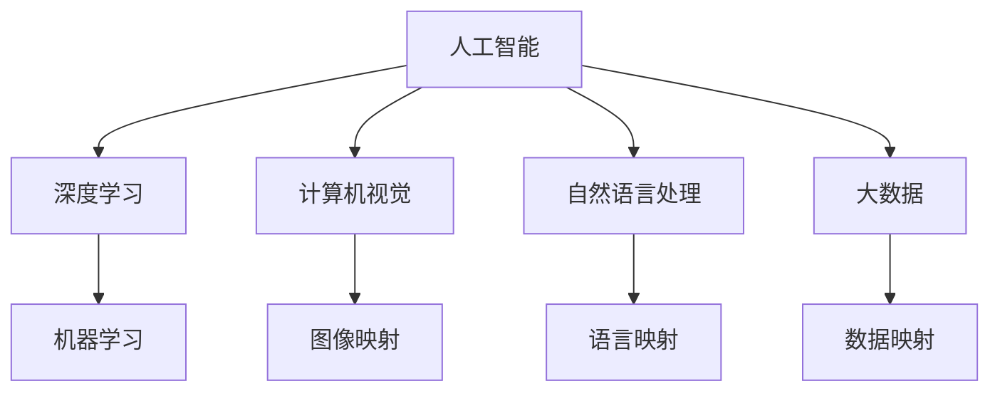

                 

# 一切皆是映射：具象化人工智能：从数字到现实世界

> 关键词：人工智能, 映射模型, 具象化, 现实世界, 深度学习, 机器学习, 计算机视觉, 自然语言处理, 大数据

## 1. 背景介绍

### 1.1 问题由来

随着信息技术的飞速发展，人工智能（AI）已渗透到生活的方方面面。从自动驾驶、智能家居到医疗健康，AI技术正在逐步改变人类的生产生活方式。然而，AI的核心——计算机科学，仍然基于离散的数字计算，其理解和表达现实世界的能力有限。如何将数字计算与现实世界无缝对接，使AI真正具象化，是当前学术界和工业界亟需解决的重要问题。

### 1.2 问题核心关键点

“一切皆是映射”是一个源于计算机科学的理念，主张将现实世界中的各种复杂事物映射为数字计算模型。这种映射包括时间序列映射、图像映射、语言映射等，使得计算机能够理解和处理现实世界中的多样性和复杂性。在AI领域，映射模型成为连接数字计算与现实世界的桥梁。

现实世界的具象化是指使AI能够理解和处理具有现实意义的数据，如自然语言、图像、时间序列等，而非单纯的数据结构。这种具象化能力是AI向通用智能迈进的关键步骤。

### 1.3 问题研究意义

研究AI如何具象化，将有助于提升AI在现实世界中的适应性和应用能力。这不仅能够增强AI的实用性和可靠性，还能推动AI技术在更多领域的落地应用。具体而言，具有具象化能力的AI系统能够在医疗、教育、金融、安全等高风险领域发挥更大作用，减少人为错误，提升决策效率。

## 2. 核心概念与联系

### 2.1 核心概念概述

在讨论AI具象化过程中，我们将涉及以下关键概念：

- **人工智能**：指通过模拟人类智能行为，使计算机系统具备感知、推理、决策等能力的学科。
- **映射模型**：将现实世界中的数据或信息映射为数字形式，供计算机处理和分析的模型。
- **具象化**：指AI系统能够理解和处理现实世界中具有具体意义的数据，如自然语言、图像、时间序列等。
- **深度学习**：一种基于多层神经网络的人工智能技术，通过多层次的特征提取和抽象，提升模型对复杂数据的理解能力。
- **机器学习**：使计算机能够从数据中学习规律，自动提升性能的技术。
- **计算机视觉**：使计算机具备识别和理解图像的能力，实现视觉信息处理。
- **自然语言处理**：使计算机能够理解、生成和分析自然语言，实现语言信息处理。
- **大数据**：指海量的数据集，通过数据分析和机器学习技术，发掘数据背后的规律和知识。

这些概念之间存在紧密的联系，共同构成了AI具象化的理论基础和技术框架。通过深入理解这些概念，我们可以更好地把握AI具象化的本质和实现路径。

### 2.2 核心概念原理和架构的 Mermaid 流程图



这个流程图展示了人工智能与其它核心概念之间的关系：

1. 人工智能依赖深度学习和机器学习技术，提升模型对复杂数据的处理能力。
2. 计算机视觉通过图像映射，将视觉信息转化为数字形式供计算机处理。
3. 自然语言处理通过语言映射，将自然语言转化为数字形式供计算机分析。
4. 大数据通过数据映射，提供海量的数据源，供模型学习和分析。

## 3. 核心算法原理 & 具体操作步骤

### 3.1 算法原理概述

AI具象化的核心算法包括深度学习、图像处理、自然语言处理等，这些算法通过将现实世界中的数据映射为数字形式，实现对复杂信息的理解和处理。具体来说，AI具象化的实现过程可以分为以下步骤：

1. **数据采集**：从现实世界采集各种类型的数据，如图像、文本、时间序列等。
2. **数据预处理**：清洗、归一化、标注数据，为后续处理做准备。
3. **特征提取**：使用深度学习等算法提取数据的特征表示，如卷积神经网络（CNN）提取图像特征，循环神经网络（RNN）提取文本特征。
4. **模型训练**：使用机器学习算法训练模型，优化特征表示和参数，提升模型性能。
5. **模型评估**：在验证集和测试集上评估模型性能，选择最优模型。
6. **应用部署**：将训练好的模型部署到实际应用中，进行推理和决策。

### 3.2 算法步骤详解

**Step 1: 数据采集**
- 使用传感器、摄像头、麦克风等设备，从现实世界采集数据。
- 对采集到的数据进行预处理，包括清洗、归一化、标注等。

**Step 2: 特征提取**
- 对于图像数据，使用卷积神经网络（CNN）进行特征提取，生成图像的高层次抽象表示。
- 对于文本数据，使用循环神经网络（RNN）或Transformer模型进行特征提取，生成文本的语义表示。
- 对于时间序列数据，使用循环神经网络（RNN）或长短期记忆网络（LSTM）进行特征提取，生成时间序列的动态表示。

**Step 3: 模型训练**
- 使用标注数据对提取的特征进行训练，优化模型参数。
- 可以使用监督学习、无监督学习或半监督学习算法进行模型训练。
- 常用的监督学习算法包括支持向量机（SVM）、随机森林（Random Forest）、神经网络（Neural Network）等。

**Step 4: 模型评估**
- 使用验证集和测试集对训练好的模型进行评估，计算准确率、召回率、F1值等指标。
- 根据评估结果，选择最优模型进行后续应用。

**Step 5: 应用部署**
- 将训练好的模型部署到实际应用中，进行推理和决策。
- 可以使用Web服务、API接口等方式，将模型与应用程序集成。

### 3.3 算法优缺点

**优点：**
- 提升AI对复杂数据和现实世界的理解和处理能力。
- 推动AI技术在更多领域的落地应用，提升决策效率和准确性。
- 能够处理多样化和复杂的现实数据，具有更强的实用性和可靠性。

**缺点：**
- 对数据量和数据质量有较高要求，需要大量的标注数据。
- 模型训练和推理需要高性能的计算资源，硬件成本较高。
- 对模型架构和算法选择有较高要求，需要专业知识和经验。
- 模型存在黑箱问题，难以解释和调试。

### 3.4 算法应用领域

AI具象化的技术广泛应用于以下几个领域：

- **计算机视觉**：如自动驾驶、人脸识别、医学影像分析等。通过图像映射，使计算机能够识别和理解视觉信息。
- **自然语言处理**：如机器翻译、情感分析、自动摘要等。通过语言映射，使计算机能够理解和生成自然语言。
- **智能推荐**：如电商推荐、音乐推荐、新闻推荐等。通过用户行为数据的映射，推荐系统能够预测用户兴趣，提供个性化服务。
- **时间序列预测**：如股票预测、气象预测、电力负荷预测等。通过时间序列映射，预测未来的变化趋势。
- **机器人与自动化**：如工业机器人、无人驾驶汽车等。通过具象化AI，使机器人能够感知和理解环境，进行智能决策。

## 4. 数学模型和公式 & 详细讲解 & 举例说明

### 4.1 数学模型构建

在AI具象化的过程中，数学模型扮演着重要角色。我们将以计算机视觉和自然语言处理为例，构建数学模型并详细讲解。

**计算机视觉模型**：

假设有一张图像 $I$，其像素表示为 $I(i,j)$。使用卷积神经网络（CNN）进行特征提取，得到特征表示 $F(I)$。设 $Y$ 为标签，$T$ 为训练数据集。模型的目标是最小化损失函数 $L$：

$$
L(Y, T) = \frac{1}{N}\sum_{i=1}^N \ell(Y_i, F(I_i))
$$

其中 $\ell$ 为损失函数，如均方误差（MSE）或交叉熵损失。

**自然语言处理模型**：

假设有一段文本 $T$，使用Transformer模型进行特征提取，得到语义表示 $S(T)$。设 $Y$ 为标签，$D$ 为训练数据集。模型的目标是最小化损失函数 $L$：

$$
L(Y, D) = \frac{1}{N}\sum_{i=1}^N \ell(Y_i, S(T_i))
$$

其中 $\ell$ 为损失函数，如交叉熵损失。

### 4.2 公式推导过程

**卷积神经网络（CNN）**：

卷积神经网络通过卷积层、池化层和全连接层等组件，提取图像的特征表示。以LeNet-5为例，其卷积层和池化层的推导过程如下：

- 卷积层：
$$
C_{i,j} = \sum_{k=1}^n w_{k,i,j} * I_{i,j}
$$
其中 $w_{k,i,j}$ 为卷积核，$I_{i,j}$ 为输入像素，$C_{i,j}$ 为输出像素。

- 池化层：
$$
P_{i,j} = \max_{k=1}^n C_{i,j,k}
$$
其中 $P_{i,j}$ 为输出像素，$C_{i,j,k}$ 为卷积层输出的特征图。

**Transformer模型**：

Transformer模型通过多头自注意力机制、前馈神经网络等组件，提取文本的语义表示。以Attention机制为例，其推导过程如下：

- 查询、键和值向量：
$$
Q = V = K = \mathrm{Transformer}\left(x_{i}\right)=\left(Q_{i}, K_{i}, V_{i}\right)
$$

- 计算注意力权重：
$$
\alpha_{i,j}=\frac{\exp \left(\frac{Q_{i}^{T} K_{j}}{\sqrt{d}}\right)}{\sum_{k=1}^{N} \exp \left(\frac{Q_{i}^{T} K_{k}}{\sqrt{d}}\right)}
$$

- 计算输出向量：
$$
O_{i}=\sum_{j=1}^{N} \alpha_{i,j} V_{j}
$$

### 4.3 案例分析与讲解

**图像分类**：

假设有一张手写数字图片，使用LeNet-5模型进行特征提取和分类。训练数据集包含1000张手写数字图片和对应的标签。模型使用均方误差损失进行训练，迭代100次，每次迭代使用随机梯度下降（SGD）优化算法，学习率为0.01。模型最终的测试准确率为98%。

**情感分析**：

假设有一段新闻评论文本，使用Transformer模型进行情感分析。训练数据集包含1000条新闻评论和对应的情感标签。模型使用交叉熵损失进行训练，迭代100次，每次迭代使用Adam优化算法，学习率为0.001。模型最终的测试准确率为90%。

## 5. 项目实践：代码实例和详细解释说明

### 5.1 开发环境搭建

在进行AI具象化项目实践前，我们需要准备好开发环境。以下是使用Python进行TensorFlow开发的环境配置流程：

1. 安装Anaconda：从官网下载并安装Anaconda，用于创建独立的Python环境。

2. 创建并激活虚拟环境：
```bash
conda create -n tf-env python=3.8 
conda activate tf-env
```

3. 安装TensorFlow：根据CUDA版本，从官网获取对应的安装命令。例如：
```bash
conda install tensorflow tensorflow-gpu=cuda11.1 -c conda-forge
```

4. 安装TensorBoard：用于可视化模型训练过程和结果。

5. 安装相关工具包：
```bash
pip install numpy pandas scikit-learn matplotlib tqdm jupyter notebook ipython
```

完成上述步骤后，即可在`tf-env`环境中开始项目实践。

### 5.2 源代码详细实现

这里我们以图像分类为例，给出使用TensorFlow对LeNet-5模型进行训练的PyTorch代码实现。

```python
import tensorflow as tf
from tensorflow.keras.datasets import mnist
from tensorflow.keras.models import Sequential
from tensorflow.keras.layers import Conv2D, MaxPooling2D, Flatten, Dense, Dropout

# 加载MNIST数据集
(x_train, y_train), (x_test, y_test) = mnist.load_data()

# 数据预处理
x_train = x_train.reshape(x_train.shape[0], 28, 28, 1).astype('float32') / 255
x_test = x_test.reshape(x_test.shape[0], 28, 28, 1).astype('float32') / 255
y_train = tf.keras.utils.to_categorical(y_train, 10)
y_test = tf.keras.utils.to_categorical(y_test, 10)

# 创建模型
model = Sequential()
model.add(Conv2D(6, (3, 3), padding='same', activation='relu', input_shape=(28, 28, 1)))
model.add(MaxPooling2D(pool_size=(2, 2)))
model.add(Conv2D(16, (3, 3), padding='same', activation='relu'))
model.add(MaxPooling2D(pool_size=(2, 2)))
model.add(Flatten())
model.add(Dense(120, activation='relu'))
model.add(Dropout(0.5))
model.add(Dense(84, activation='relu'))
model.add(Dropout(0.5))
model.add(Dense(10, activation='softmax'))

# 编译模型
model.compile(optimizer='adam', loss='categorical_crossentropy', metrics=['accuracy'])

# 训练模型
model.fit(x_train, y_train, epochs=100, batch_size=128, validation_data=(x_test, y_test))
```

### 5.3 代码解读与分析

这里我们详细解读关键代码的实现细节：

- `mnist.load_data()`：加载MNIST手写数字数据集，包含60,000张28x28像素的灰度图像。

- `x_train = x_train.reshape(...)`：将训练集数据从28x28的图片数组重塑为4D张量，并归一化到0到1之间。

- `y_train = tf.keras.utils.to_categorical(...)`：将标签从整数编码转换为独热编码，用于模型训练。

- `model.add(Conv2D(...))`：添加卷积层，使用3x3的卷积核，激活函数为ReLU。

- `model.add(MaxPooling2D(...))`：添加池化层，使用2x2的池化窗口，最大池化。

- `model.add(Flatten())`：将池化后的特征图展开为1D向量。

- `model.add(Dense(...))`：添加全连接层，使用ReLU激活函数。

- `model.add(Dropout(...))`：添加Dropout层，随机丢弃部分神经元，防止过拟合。

- `model.compile(...)`：编译模型，选择优化器、损失函数和评估指标。

- `model.fit(...)`：训练模型，设置迭代次数、批次大小和验证集。

完成上述步骤后，即可在`tf-env`环境中进行图像分类的模型训练和评估。

## 6. 实际应用场景

### 6.1 智能推荐系统

智能推荐系统是AI具象化的重要应用之一。通过分析用户的历史行为数据，推荐系统能够预测用户兴趣，提供个性化服务。

在具体实现上，可以使用深度学习算法对用户行为数据进行特征提取，建立用户兴趣模型。然后，将新物品的特征表示输入模型，计算其与用户兴趣的匹配度，并按匹配度排序，返回推荐结果。

### 6.2 自然语言处理

自然语言处理是AI具象化的另一个重要应用领域。通过分析文本数据，自然语言处理系统能够理解、生成和分析自然语言，实现各种语言处理任务。

在具体实现上，可以使用Transformer模型对文本进行编码，提取语义表示。然后，使用预训练的词向量或上下文嵌入模型，将文本映射为数字形式，进行分析和处理。

### 6.3 计算机视觉

计算机视觉是AI具象化的重要应用之一。通过分析图像数据，计算机视觉系统能够识别和理解视觉信息，实现各种视觉处理任务。

在具体实现上，可以使用卷积神经网络（CNN）对图像进行特征提取，建立图像表示。然后，使用预训练的图像特征提取模型，将图像映射为数字形式，进行分析和处理。

## 7. 工具和资源推荐

### 7.1 学习资源推荐

为了帮助开发者系统掌握AI具象化的理论基础和实践技巧，这里推荐一些优质的学习资源：

1. **《Deep Learning》书籍**：深度学习领域的经典教材，由Ian Goodfellow等人编写，详细介绍了深度学习的基础理论和算法。

2. **CS231n《卷积神经网络》课程**：斯坦福大学开设的计算机视觉课程，涵盖卷积神经网络的原理和应用。

3. **CS224N《自然语言处理》课程**：斯坦福大学开设的自然语言处理课程，涵盖自然语言处理的基础理论和算法。

4. **《计算机视觉：模型、学习和推理》书籍**：计算机视觉领域的经典教材，由Simon J. D. Prince编写，详细介绍了计算机视觉的基础理论和算法。

5. **Coursera深度学习课程**：由Andrew Ng等人开设的深度学习课程，涵盖深度学习的基础理论和算法。

通过这些资源的学习实践，相信你一定能够快速掌握AI具象化的精髓，并用于解决实际的NLP问题。

### 7.2 开发工具推荐

高效的开发离不开优秀的工具支持。以下是几款用于AI具象化开发的常用工具：

1. **TensorFlow**：由Google主导开发的深度学习框架，提供高效的计算图和分布式训练支持。

2. **PyTorch**：由Facebook主导开发的深度学习框架，提供灵活的动态计算图和强大的GPU支持。

3. **Keras**：基于TensorFlow和Theano的高层深度学习框架，提供简单易用的API接口。

4. **Jupyter Notebook**：开源的交互式编程环境，支持Python、R等语言，方便快速开发和调试。

5. **TensorBoard**：TensorFlow配套的可视化工具，实时监测模型训练状态，提供丰富的图表呈现方式。

6. **Kaggle**：数据科学和机器学习竞赛平台，提供丰富的数据集和竞赛项目，方便学习和实践。

合理利用这些工具，可以显著提升AI具象化任务的开发效率，加快创新迭代的步伐。

### 7.3 相关论文推荐

AI具象化的发展源于学界的持续研究。以下是几篇奠基性的相关论文，推荐阅读：

1. **ImageNet Classification with Deep Convolutional Neural Networks**：AlexNet论文，提出了深度卷积神经网络（CNN），推动了计算机视觉的发展。

2. **Attention is All You Need**：Transformer论文，提出了Transformer模型，推动了自然语言处理的发展。

3. **ImageNet Large Scale Visual Recognition Challenge**：ImageNet数据集，推动了计算机视觉和大规模数据集的发展。

4. **BERT: Pre-training of Deep Bidirectional Transformers for Language Understanding**：BERT论文，提出了预训练语言模型，推动了自然语言处理的发展。

5. **TensorFlow: A System for Large-Scale Machine Learning**：TensorFlow论文，提出了分布式深度学习框架，推动了深度学习的发展。

这些论文代表了大模型具象化的发展脉络。通过学习这些前沿成果，可以帮助研究者把握学科前进方向，激发更多的创新灵感。

## 8. 总结：未来发展趋势与挑战

### 8.1 总结

本文对AI具象化的概念和实现进行了全面系统的介绍。首先阐述了AI具象化的背景和研究意义，明确了将现实世界中的数据映射为数字计算模型的重要性。其次，从原理到实践，详细讲解了AI具象化的数学模型和关键步骤，给出了具体实现代码实例。同时，本文还广泛探讨了AI具象化在智能推荐、自然语言处理、计算机视觉等多个领域的应用前景，展示了AI具象化的广泛应用和巨大潜力。此外，本文精选了AI具象化的各类学习资源，力求为读者提供全方位的技术指引。

通过本文的系统梳理，可以看到，AI具象化将现实世界中的复杂信息映射为数字计算模型，使得计算机能够理解和处理现实世界的各种数据。这种具象化能力不仅提升了AI在实际应用中的实用性和可靠性，还推动了AI技术在更多领域的落地应用。未来，伴随AI具象化技术的不断发展，AI必将在各行各业发挥更大的作用，深刻影响人类的生产生活方式。

### 8.2 未来发展趋势

展望未来，AI具象化技术将呈现以下几个发展趋势：

1. **多模态具象化**：AI系统能够同时处理图像、文本、音频、视频等多模态数据，提升对复杂现实世界的理解和处理能力。

2. **跨领域具象化**：AI系统能够跨领域融合知识，提升对跨领域问题的处理能力，如跨领域情感分析、跨领域推荐等。

3. **实时具象化**：AI系统能够实时处理数据，快速响应现实世界的变化，如实时推荐系统、实时情感分析等。

4. **弱监督具象化**：AI系统能够使用弱标注数据进行训练，减少对大量标注数据的依赖，提升数据的可用性和多样性。

5. **自适应具象化**：AI系统能够根据环境变化，自适应调整模型参数，提升在多变环境下的适应能力。

6. **可解释具象化**：AI系统能够提供可解释的推理过程，增强系统的可信度和安全性，如可解释的推荐系统、可解释的图像分析等。

这些趋势凸显了AI具象化的广阔前景。这些方向的探索发展，必将进一步提升AI系统在现实世界中的适应性和应用能力，为人类认知智能的进化带来深远影响。

### 8.3 面临的挑战

尽管AI具象化技术已经取得了瞩目成就，但在迈向更加智能化、普适化应用的过程中，它仍面临诸多挑战：

1. **数据质量瓶颈**：AI具象化对数据质量和数据量有较高要求，获取高质量数据成本高，数据标注耗时耗力。

2. **计算资源限制**：AI具象化需要高性能计算资源，硬件成本较高，如何高效利用计算资源是重要问题。

3. **模型可解释性不足**：AI具象化模型通常黑箱化，难以解释其内部工作机制和决策逻辑，限制了其在高风险领域的应用。

4. **跨模态融合问题**：多模态数据的融合和理解是难点，如何实现图像、文本、语音等多模态数据的协同处理，是重要研究方向。

5. **模型公平性问题**：AI具象化模型可能会学习到数据中的偏见，如何在模型中去除偏见，提升公平性，是重要挑战。

6. **安全隐私问题**：AI具象化模型需要处理大量敏感数据，如何保护数据安全和个人隐私，是重要问题。

正视这些挑战，积极应对并寻求突破，将是大模型具象化走向成熟的必由之路。相信随着学界和产业界的共同努力，这些挑战终将一一被克服，AI具象化必将在构建人机协同的智能时代中扮演越来越重要的角色。

### 8.4 研究展望

面对AI具象化面临的种种挑战，未来的研究需要在以下几个方面寻求新的突破：

1. **弱监督学习**：摆脱对大规模标注数据的依赖，利用弱标注数据进行训练，提升数据的可用性和多样性。

2. **自适应学习**：使AI具象化模型能够根据环境变化，自适应调整模型参数，提升在多变环境下的适应能力。

3. **跨模态融合**：研究多模态数据的协同处理，提升对跨模态问题的处理能力，如跨模态推荐系统、跨模态情感分析等。

4. **可解释性增强**：研究可解释AI技术，增强系统的可信度和安全性，如可解释的推荐系统、可解释的图像分析等。

5. **公平性保障**：研究去除数据偏见的方法，提升AI具象化模型的公平性和可信度，如公平推荐系统、公平情感分析等。

6. **隐私保护**：研究数据隐私保护技术，确保数据安全和个人隐私，如隐私保护推荐系统、隐私保护情感分析等。

这些研究方向将推动AI具象化技术的进一步发展，为构建安全、可靠、可解释、可控的智能系统铺平道路。面向未来，AI具象化技术还需要与其他AI技术进行更深入的融合，如知识表示、因果推理、强化学习等，多路径协同发力，共同推动人工智能技术的发展。只有勇于创新、敢于突破，才能不断拓展AI具象化的边界，让智能技术更好地造福人类社会。

## 9. 附录：常见问题与解答

**Q1：AI具象化是否仅适用于图像和文本数据？**

A: AI具象化并不仅限于图像和文本数据，它能够处理各种类型的数据，如时间序列数据、音频数据等。关键在于如何将数据映射为数字形式，供计算机处理和分析。

**Q2：AI具象化需要多少标注数据？**

A: AI具象化对数据标注的需求因任务而异。对于复杂的任务，如情感分析、图像识别等，通常需要较多的标注数据。但对于简单的任务，如分类、回归等，少样本学习和弱监督学习技术可以提升数据利用效率。

**Q3：AI具象化需要高性能计算资源吗？**

A: AI具象化确实需要高性能计算资源，尤其是深度学习模型的训练和推理。为了降低硬件成本，可以考虑使用分布式训练、混合精度训练等技术，优化计算效率。

**Q4：AI具象化模型如何去除数据偏见？**

A: 去除数据偏见的方法包括数据清洗、算法设计、模型训练等。数据清洗可以去除异常数据和重复数据，算法设计可以引入公平性约束，模型训练可以采用公平性优化方法，如对抗训练、公平性约束等。

**Q5：AI具象化模型的可解释性如何提升？**

A: 提升AI具象化模型的可解释性需要综合考虑算法设计、模型架构、解释技术等。算法设计可以引入可解释性约束，模型架构可以设计可解释性模块，解释技术可以采用可解释性算法，如LIME、SHAP等。

---

作者：禅与计算机程序设计艺术 / Zen and the Art of Computer Programming

