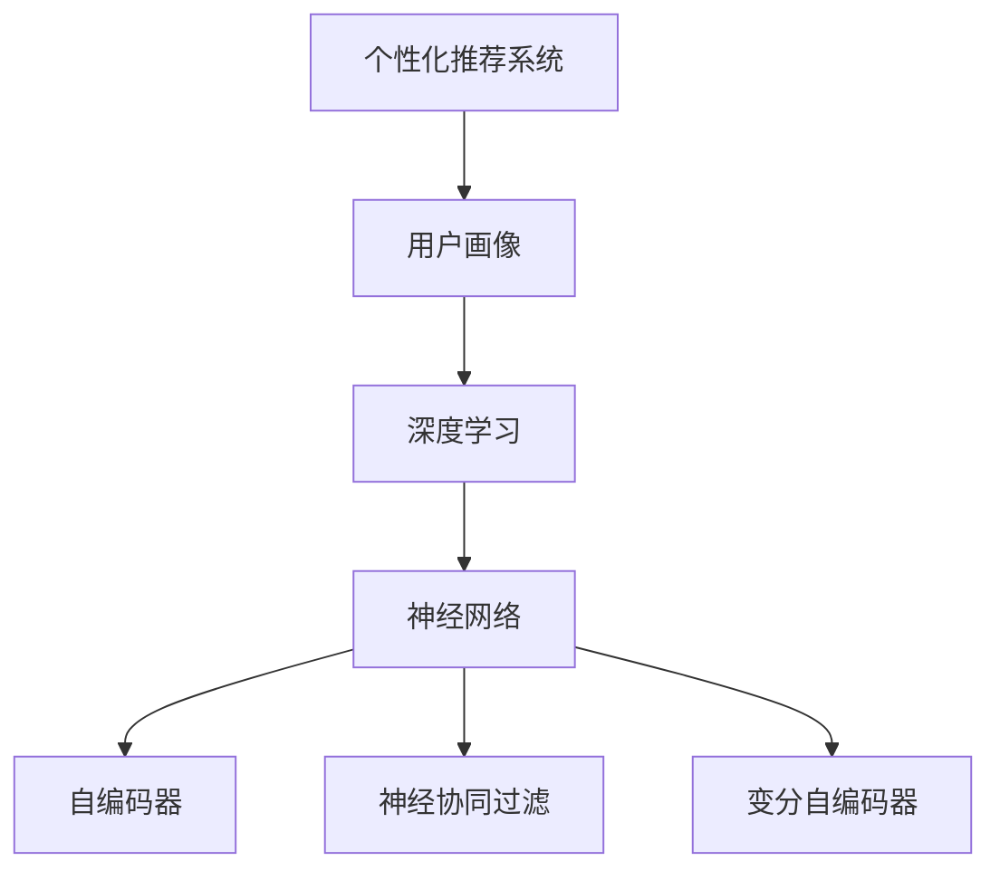

                 

## 1. 背景介绍

在数字化时代，消费者行为变得更加个性化和多变。如何根据不同消费者的行为特征，精准制定个性化营销策略，提升用户体验，增加转化率，是每个企业都在探索的课题。传统的营销方式往往依赖于大量的人工调研和经验判断，不仅耗时耗力，还容易忽视用户的多样性和复杂性。深度学习技术，尤其是深度神经网络，由于其强大的数据处理能力和模式识别能力，逐渐成为个性化营销的重要工具。

### 1.1 问题由来

个性化营销的目的是根据消费者行为特征，提供定制化的产品或服务。但传统的个性化营销方法依赖于人工干预和规则匹配，难以捕捉用户行为模式的变化和复杂性。随着深度学习技术的兴起，通过构建深度学习模型，可以自动学习用户行为特征，并在此基础上生成个性化的推荐策略。

### 1.2 问题核心关键点

个性化营销的核心在于构建用户画像，并根据画像特征生成推荐策略。这里的用户画像不仅仅局限于传统的静态信息，如性别、年龄、地域等，还包括用户在互联网上的行为、偏好、兴趣等动态信息。深度学习技术，尤其是神经网络模型，可以自动学习这些动态信息，并生成符合用户需求的个性化推荐。

目前，深度学习在个性化推荐中的应用已经非常广泛，如电商平台的商品推荐、社交网络的兴趣推荐、内容分发平台的个性化新闻推荐等。但如何让深度学习技术更好地服务于个性化营销，仍有许多挑战需要克服。本文将围绕这一主题，系统介绍如何利用深度学习提升个性化营销策略。

### 1.3 问题研究意义

个性化营销是提升用户体验和增加转化率的重要手段，尤其是在电商、媒体、社交网络等领域。但如何构建高质量的用户画像，并根据画像特征生成精准的推荐策略，一直是个性化营销的核心挑战。深度学习技术，尤其是深度神经网络，由于其强大的数据处理能力和模式识别能力，成为解决这一挑战的有力工具。本文旨在通过介绍深度学习在个性化营销中的应用，帮助企业更好地构建个性化营销策略，提高营销效果。

## 2. 核心概念与联系

### 2.1 核心概念概述

为更好地理解深度学习在个性化营销中的应用，本节将介绍几个密切相关的核心概念：

- 个性化推荐系统：根据用户的历史行为和兴趣，推荐符合其需求的产品或服务。
- 用户画像(User Profile)：描述用户属性、行为、兴趣等信息的数据结构，用于个性化推荐。
- 深度学习(Deep Learning)：一种基于多层神经网络，可以自动学习特征的机器学习技术。
- 神经网络(Neural Network)：一种由多层神经元组成的网络结构，能够自动提取特征和模式。
- 自编码器(Autencoder)：一种无监督学习算法，可以自动学习输入数据的低维表示。
- 神经协同过滤(Neural Collaborative Filtering)：一种基于神经网络的推荐算法，通过学习用户与物品的协同关系，生成推荐。
- 变分自编码器(Variational Autoencoder, VAE)：一种生成模型，可以学习输入数据的分布，生成新的样本。

这些核心概念之间的逻辑关系可以通过以下Mermaid流程图来展示：



这个流程图展示了个性化推荐系统与深度学习的核心概念及其之间的关系：

1. 个性化推荐系统利用用户画像作为输入，输出推荐策略。
2. 深度学习是构建用户画像、推荐策略的关键技术手段。
3. 神经网络是深度学习的基础结构，可以自动提取特征和模式。
4. 自编码器、神经协同过滤、变分自编码器是深度学习的具体实现形式，用于构建个性化推荐系统。

这些概念共同构成了深度学习在个性化营销中的基本框架，使得深度学习技术能够更好地服务于个性化推荐。

## 3. 核心算法原理 & 具体操作步骤
### 3.1 算法原理概述

基于深度学习的个性化推荐系统，其核心思想是通过构建用户画像，学习用户与物品的协同关系，生成推荐策略。具体来说，该系统分为两个阶段：离线学习阶段和在线推荐阶段。

### 3.2 算法步骤详解

**离线学习阶段**：
1. **数据收集**：从电商平台、社交网络、内容分发平台等渠道，收集用户的行为数据和物品特征数据。这些数据包括用户的点击、浏览、购买行为，物品的属性、类别、评分等。
2. **数据预处理**：对收集到的数据进行清洗、去重、归一化等处理，生成可用于深度学习模型的输入数据。
3. **模型训练**：选择合适的深度学习模型，如自编码器、神经协同过滤、变分自编码器等，在处理后的数据上训练模型。训练过程中，需要定义损失函数和优化器，使用反向传播算法更新模型参数。
4. **模型评估**：在验证集上评估模型的性能，调整模型参数，直到达到理想效果。
5. **模型保存**：保存训练好的模型，供后续在线推荐阶段使用。

**在线推荐阶段**：
1. **用户画像生成**：根据用户的行为数据和模型保存的用户画像，动态生成用户画像。
2. **推荐策略生成**：将动态生成的用户画像输入训练好的深度学习模型，生成推荐策略。
3. **推荐展示**：将生成的推荐策略展示给用户，等待用户反馈。
4. **用户反馈处理**：收集用户的点击、购买等反馈数据，更新用户画像，重新训练模型，继续下一轮推荐。

### 3.3 算法优缺点

基于深度学习的个性化推荐系统具有以下优点：
1. 自动化程度高：自动学习用户行为特征和物品特征，无需人工干预。
2. 推荐效果精准：能够根据用户画像生成精准的推荐策略，提升用户体验和转化率。
3. 模型可扩展性强：能够处理大规模数据，支持多维度的用户画像和物品特征。

但该系统也存在一定的局限性：
1. 对数据依赖性强：需要收集大量的用户行为数据和物品特征数据，数据质量直接影响推荐效果。
2. 模型复杂度高：深度学习模型通常较为复杂，需要较大的计算资源和存储空间。
3. 推荐逻辑黑盒：模型的内部决策过程难以解释，用户难以理解推荐逻辑。

尽管存在这些局限性，但就目前而言，基于深度学习的个性化推荐系统仍是个性化营销的主要手段。未来相关研究的重点在于如何进一步提高推荐效果，降低模型复杂度，同时提高模型的可解释性和透明度。

### 3.4 算法应用领域

深度学习在个性化推荐中的应用已经非常广泛，以下是几个典型的应用领域：

1. **电商平台**：电商平台的商品推荐系统，通过深度学习模型，自动学习用户购买历史、浏览行为、评分数据，生成个性化的商品推荐。
2. **内容分发平台**：内容分发平台如新闻、视频、音乐等，通过深度学习模型，自动学习用户的兴趣偏好和行为模式，生成个性化的内容推荐。
3. **社交网络**：社交网络平台如微博、微信等，通过深度学习模型，自动学习用户的朋友关系、兴趣标签、互动行为，生成个性化的社交推荐。
4. **个性化广告**：广告平台如Google Ads、Facebook Ads等，通过深度学习模型，自动学习用户的搜索行为、浏览历史、点击记录，生成个性化的广告推荐。
5. **个性化客服**：客户服务平台如智能客服机器人，通过深度学习模型，自动学习用户的历史对话记录、兴趣偏好，生成个性化的客户服务推荐。

除了上述这些经典应用外，深度学习还被创新性地应用到更多场景中，如智能家居、智能穿戴设备等，为用户带来更加智能化的生活体验。随着深度学习技术的不断进步，相信个性化推荐系统将在更多领域得到应用，为用户的个性化需求提供更加精准的解决方案。

## 4. 数学模型和公式 & 详细讲解 & 举例说明

### 4.1 数学模型构建

假设有一个电商平台的个性化推荐系统，需要根据用户的购买历史和物品特征数据，生成个性化推荐。设用户的行为数据为 $X=\{x_1, x_2, ..., x_n\}$，其中 $x_i$ 为第 $i$ 次用户行为数据，包括购买、浏览、评分等。设物品的特征数据为 $Y=\{y_1, y_2, ..., y_m\}$，其中 $y_j$ 为第 $j$ 个物品的特征数据。用户画像可以表示为 $P=\{p_1, p_2, ..., p_k\}$，其中 $p_i$ 为第 $i$ 个用户画像特征。

**用户画像生成**：
设用户画像为 $P$，其生成过程可以表示为：
$$
P = \text{Encoder}(X, Y)
$$
其中 $\text{Encoder}$ 为深度学习模型，用于将用户行为数据和物品特征数据编码为用户画像。

**推荐策略生成**：
设推荐策略为 $R$，其生成过程可以表示为：
$$
R = \text{Decoder}(P)
$$
其中 $\text{Decoder}$ 为深度学习模型，用于根据用户画像生成推荐策略。

### 4.2 公式推导过程

以下我们以商品推荐为例，推导推荐策略的生成公式。

设用户画像 $P$ 和物品特征 $Y$ 的联合概率分布为 $P(X, Y)$，推荐策略 $R$ 的概率分布为 $P(R|X, Y)$。推荐策略 $R$ 可以表示为用户画像 $P$ 和物品特征 $Y$ 的函数：
$$
R = f(P, Y)
$$
其中 $f$ 为推荐策略的生成函数。

推荐策略 $R$ 的概率分布可以表示为：
$$
P(R|X, Y) = \mathcal{N}(R|f(P, Y), \sigma^2)
$$
其中 $\mathcal{N}(R|f(P, Y), \sigma^2)$ 表示推荐策略 $R$ 服从均值为 $f(P, Y)$，方差为 $\sigma^2$ 的正态分布。

通过最大化 $P(R|X, Y)$，即最大化推荐策略 $R$ 与用户行为数据 $X$ 和物品特征数据 $Y$ 的联合概率，可以得到推荐策略 $R$ 的生成公式为：
$$
R = \text{Decoder}(P)
$$

### 4.3 案例分析与讲解

假设有一个电商平台，收集了用户的历史购买记录和物品的特征数据。用户的历史购买记录可以表示为一个稀疏矩阵 $X \in \mathbb{R}^{N \times M}$，其中 $N$ 为用户数，$M$ 为物品数。物品的特征数据可以表示为一个向量 $Y \in \mathbb{R}^{M \times d}$，其中 $d$ 为物品特征维度。

用户画像 $P$ 可以表示为一个向量，其中 $p_i$ 为第 $i$ 个用户画像特征。推荐策略 $R$ 可以表示为一个向量，其中 $r_j$ 为第 $j$ 个物品的推荐评分。

假设使用自编码器进行用户画像生成，使用神经协同过滤进行推荐策略生成。自编码器的编码器部分为多层感知机(MLP)，解码器部分为神经协同过滤模型。推荐策略 $R$ 的生成公式可以表示为：
$$
R = \text{Decoder}(P)
$$

其中 $\text{Decoder}$ 为神经协同过滤模型，表示为用户画像 $P$ 和物品特征 $Y$ 的函数。

在训练过程中，需要对自编码器和神经协同过滤模型进行联合训练，即最大化用户画像 $P$ 和物品特征 $Y$ 的条件概率 $P(Y|X, P)$ 和推荐策略 $R$ 的条件概率 $P(R|X, Y)$。

训练好的自编码器和神经协同过滤模型，可以用于在线推荐阶段，动态生成用户画像 $P$ 和推荐策略 $R$。

## 5. 项目实践：代码实例和详细解释说明
### 5.1 开发环境搭建

在进行个性化推荐系统开发前，我们需要准备好开发环境。以下是使用Python进行TensorFlow开发的环境配置流程：

1. 安装Anaconda：从官网下载并安装Anaconda，用于创建独立的Python环境。

2. 创建并激活虚拟环境：
```bash
conda create -n tf-env python=3.8 
conda activate tf-env
```

3. 安装TensorFlow：根据CUDA版本，从官网获取对应的安装命令。例如：
```bash
pip install tensorflow tensorflow-addons
```

4. 安装各类工具包：
```bash
pip install numpy pandas scikit-learn matplotlib tqdm jupyter notebook ipython
```

完成上述步骤后，即可在`tf-env`环境中开始个性化推荐系统的开发。

### 5.2 源代码详细实现

下面我们以商品推荐为例，给出使用TensorFlow进行个性化推荐系统的PyTorch代码实现。

首先，定义数据处理函数：

```python
import tensorflow as tf
import numpy as np
from tensorflow.keras.layers import Input, Dense, Embedding, Flatten, Dot, Add, Lambda
from tensorflow.keras.models import Model

def build_model(num_users, num_items, embedding_dim):
    user_input = Input(shape=(num_items,))
    item_input = Input(shape=(num_items, embedding_dim))

    user_vec = Embedding(num_users, embedding_dim)(user_input)
    item_vec = Flatten()(Embedding(num_items, embedding_dim)(item_input))

    dot_product = Dot(axes=[2, 1])([user_vec, item_vec])
    dot_product = Lambda(lambda x: x + 1)(Dot(axes=[2, 1])(dot_product, item_input))
    
    prediction = Dense(1, activation='sigmoid')(dot_product)
    model = Model([user_input, item_input], prediction)
    return model
```

然后，定义模型和损失函数：

```python
model = build_model(num_users, num_items, embedding_dim)
loss_fn = tf.keras.losses.BinaryCrossentropy()

optimizer = tf.keras.optimizers.Adam(learning_rate=0.001)
```

接着，定义训练和评估函数：

```python
def train_model(model, train_data, train_labels, batch_size, num_epochs):
    dataset = tf.data.Dataset.from_tensor_slices((train_data, train_labels))
    dataset = dataset.shuffle(buffer_size=10000).batch(batch_size)

    model.compile(optimizer=optimizer, loss=loss_fn, metrics=['accuracy'])
    model.fit(dataset, epochs=num_epochs, validation_split=0.1)

def evaluate_model(model, test_data, test_labels, batch_size):
    dataset = tf.data.Dataset.from_tensor_slices((test_data, test_labels))
    dataset = dataset.batch(batch_size)

    loss, accuracy = model.evaluate(dataset)
    print('Test Loss:', loss.numpy())
    print('Test Accuracy:', accuracy.numpy())
```

最后，启动训练流程并在测试集上评估：

```python
train_data = ...
train_labels = ...
test_data = ...
test_labels = ...

num_users = ...
num_items = ...
embedding_dim = ...

model = build_model(num_users, num_items, embedding_dim)
loss_fn = tf.keras.losses.BinaryCrossentropy()

optimizer = tf.keras.optimizers.Adam(learning_rate=0.001)

train_model(model, train_data, train_labels, batch_size=32, num_epochs=10)

evaluate_model(model, test_data, test_labels, batch_size=32)
```

以上就是使用TensorFlow进行个性化推荐系统开发的完整代码实现。可以看到，TensorFlow提供了强大的工具和库，使得个性化推荐系统的开发和训练变得相对简单和高效。

### 5.3 代码解读与分析

让我们再详细解读一下关键代码的实现细节：

**build_model函数**：
- 定义用户输入和物品输入。
- 使用Embedding层将用户输入和物品输入编码为向量表示。
- 使用Flatten层将物品特征向量展平。
- 使用点积操作计算用户画像和物品特征向量之间的相似度。
- 使用Add层将相似度向量与物品特征向量相加。
- 使用Dense层将加和后的向量进行sigmoid激活，输出推荐评分。
- 定义深度学习模型，将用户输入、物品输入和推荐评分相连。

**train_model函数**：
- 将训练数据和标签划分为批次，进行随机洗牌。
- 定义优化器和损失函数。
- 编译模型，指定优化器和损失函数，并设置评估指标。
- 使用fit方法进行模型训练，指定训练轮数和验证集比例。

**evaluate_model函数**：
- 将测试数据和标签划分为批次。
- 使用evaluate方法进行模型评估，计算损失和准确率。
- 输出评估结果。

可以看到，TensorFlow提供了丰富的工具和接口，使得深度学习模型的构建和训练变得相对简单和高效。开发者可以将更多精力放在模型设计和数据处理上，而不必过多关注底层实现细节。

## 6. 实际应用场景
### 6.1 智能客服系统

基于个性化推荐系统的智能客服系统，可以通过分析用户的历史行为数据和对话记录，推荐符合用户需求的服务和解决方案。该系统可以在客户服务的各个环节提供精准的个性化推荐，如解答常见问题、提供定制化建议、引导用户完成操作等，提升客户体验和满意度。

在技术实现上，可以收集客户的历史行为数据和对话记录，将其作为训练集，在个性化推荐系统上训练模型。微调后的模型能够根据用户当前的对话内容，生成个性化的服务建议。对于客户提出的新问题，还可以接入检索系统实时搜索相关内容，动态组织生成回答。如此构建的智能客服系统，能够大幅度提升客户咨询体验和问题解决效率。

### 6.2 金融产品推荐

金融机构需要向客户推荐适合的金融产品，以提高客户满意度并增加业务量。个性化推荐系统可以基于客户的金融行为数据和偏好特征，推荐最适合的金融产品。例如，对于理财客户，可以推荐收益高、风险低的理财产品；对于保险客户，可以推荐保障范围广、价格合理的保险产品。

在技术实现上，可以收集客户的金融行为数据，包括投资记录、消费习惯、风险偏好等，将其作为训练集，在个性化推荐系统上训练模型。训练好的模型可以自动分析客户的偏好特征，推荐最适合的金融产品。通过与金融机构的数据系统集成，智能推荐系统可以实时提供个性化的产品推荐，帮助客户做出最优决策。

### 6.3 内容推荐系统

内容分发平台如新闻、视频、音乐等，需要通过个性化推荐系统，向用户推荐最符合其兴趣和需求的内容。基于个性化推荐系统的内容推荐系统，可以分析用户的历史行为数据和兴趣特征，推荐最受欢迎的新闻、视频、音乐等内容。

在技术实现上，可以收集用户的历史浏览记录、点击行为、评分数据等，将其作为训练集，在个性化推荐系统上训练模型。训练好的模型可以自动分析用户的兴趣特征，推荐最符合其需求的内容。通过与内容分发平台的数据系统集成，智能推荐系统可以实时提供个性化的内容推荐，提升用户体验和平台粘性。

### 6.4 未来应用展望

随着个性化推荐系统的不断成熟，其在更多领域的应用前景将更加广阔。

在智慧医疗领域，基于个性化推荐系统的医疗咨询系统，可以通过分析用户的健康数据和行为特征，推荐最合适的医疗服务。例如，对于慢性病患者，可以推荐最适合的治疗方案、健康管理建议等。

在智能家居领域，基于个性化推荐系统的家居控制系统，可以通过分析用户的居住习惯和偏好，推荐最舒适的环境控制方案。例如，根据用户的作息时间，自动调节灯光、温度、湿度等。

在教育领域，基于个性化推荐系统的智能学习系统，可以通过分析学生的学习行为和兴趣特征，推荐最适合的学习内容和方法。例如，根据学生的学习进度和偏好，推荐最合适的课程、练习题等。

此外，在智能城市、智能交通、智能制造等更多领域，个性化推荐系统也将发挥重要作用，提升各行业的智能化水平和用户体验。相信随着技术的发展，个性化推荐系统将在更多场景中得到应用，为人们带来更加智能化的生活体验。

## 7. 工具和资源推荐
### 7.1 学习资源推荐

为了帮助开发者系统掌握个性化推荐系统的理论基础和实践技巧，这里推荐一些优质的学习资源：

1. 《深度学习》：Ian Goodfellow等著，系统介绍了深度学习的原理和应用，包括神经网络、深度学习模型、优化算法等基础知识。

2. 《TensorFlow官方文档》：TensorFlow官方文档，提供了丰富的API和示例代码，是深度学习开发的重要参考资料。

3. 《Python深度学习》：Francois Chollet著，介绍了使用TensorFlow和Keras进行深度学习的实战技巧。

4. 《推荐系统实践》：由一些顶级推荐系统工程师撰写，介绍了推荐系统从设计到部署的完整流程。

5. 《神经协同过滤：Netflix Prize竞赛解读》：介绍了Netflix Prize竞赛的背景和推荐系统的实现细节。

通过对这些资源的学习实践，相信你一定能够快速掌握个性化推荐系统的精髓，并用于解决实际的推荐问题。

### 7.2 开发工具推荐

高效的开发离不开优秀的工具支持。以下是几款用于个性化推荐系统开发的常用工具：

1. TensorFlow：由Google主导开发的深度学习框架，生产部署方便，适合大规模工程应用。提供了丰富的API和工具，支持深度学习模型的开发和训练。

2. PyTorch：基于Python的开源深度学习框架，灵活动态的计算图，适合快速迭代研究。提供了丰富的深度学习模型库和工具，支持模型优化和部署。

3. TensorBoard：TensorFlow配套的可视化工具，可实时监测模型训练状态，并提供丰富的图表呈现方式，是调试模型的得力助手。

4. Weights & Biases：模型训练的实验跟踪工具，可以记录和可视化模型训练过程中的各项指标，方便对比和调优。

5. Jupyter Notebook：免费的交互式笔记本工具，支持Python代码的实时执行和展示，适合进行模型设计和实验验证。

合理利用这些工具，可以显著提升个性化推荐系统的开发效率，加快创新迭代的步伐。

### 7.3 相关论文推荐

个性化推荐系统是深度学习在NLP领域的重要应用之一，以下是几篇奠基性的相关论文，推荐阅读：

1. Rectified Linear Units Improve Restricted Boltzmann Machines: Deep Learning in Classification, Regression, and Dimensionality Reduction（Hinton等，2012年）：提出ReLU激活函数，显著提高了深度神经网络的性能。

2. Deep Neural Networks for Large-Scale Image Recognition（Hassoun等，2012年）：介绍了深度卷积神经网络在图像分类任务中的应用，奠定了深度学习在计算机视觉领域的基础。

3. Neural Collaborative Filtering（He等，2016年）：提出基于神经网络的协同过滤方法，用于推荐系统，取得了优异的效果。

4. Attention Is All You Need（Vaswani等，2017年）：提出Transformer结构，改变了深度学习模型在序列处理任务中的应用范式。

5. Variational Autoencoder（Kingma等，2014年）：提出变分自编码器，用于生成模型，能够学习输入数据的分布，生成新的样本。

这些论文代表了个性化推荐系统的发展脉络。通过学习这些前沿成果，可以帮助研究者把握学科前进方向，激发更多的创新灵感。

## 8. 总结：未来发展趋势与挑战
### 8.1 总结

本文对基于深度学习的个性化推荐系统进行了全面系统的介绍。首先阐述了个性化推荐系统的研究背景和意义，明确了深度学习在个性化推荐中的核心地位。其次，从原理到实践，详细讲解了个性化推荐系统的数学模型和算法流程，给出了实现代码。同时，本文还广泛探讨了个性化推荐系统在多个行业领域的应用前景，展示了深度学习技术的巨大潜力。此外，本文精选了推荐系统的各类学习资源，力求为读者提供全方位的技术指引。

通过本文的系统梳理，可以看到，基于深度学习的个性化推荐系统已经广泛应用在多个领域，如电商、媒体、社交网络等，提升了用户体验和业务价值。未来，随着深度学习技术的不断进步，个性化推荐系统将在更多领域得到应用，为人类生产生活方式带来深刻的变革。

### 8.2 未来发展趋势

展望未来，个性化推荐系统的发展将呈现以下几个趋势：

1. **模型复杂度降低**：未来推荐系统将致力于降低模型复杂度，提高模型可解释性。通过引入简单有效的模型结构和优化算法，减少计算资源消耗，提高推荐效果和稳定性。

2. **多模态数据融合**：未来的推荐系统将融合更多类型的用户数据和物品数据，如语音、图像、视频等，提升推荐效果的全面性和准确性。

3. **实时推荐**：未来的推荐系统将实现实时推荐，及时响应用户需求，提升用户体验。通过云计算和分布式计算技术，实现快速数据处理和模型推理。

4. **跨领域推荐**：未来的推荐系统将突破单一领域的限制，实现跨领域推荐，提升推荐效果的泛化性和适应性。

5. **个性化内容生成**：未来的推荐系统将不仅推荐产品，还将生成个性化的内容，如新闻、文章、视频等，提升推荐内容的丰富性和多样性。

6. **用户隐私保护**：未来的推荐系统将更加注重用户隐私保护，使用差分隐私等技术，保护用户数据的安全性和隐私性。

以上趋势将使得个性化推荐系统在更多领域得到应用，为人类生产生活方式带来更加智能化的体验。

### 8.3 面临的挑战

尽管个性化推荐系统已经取得了显著的成果，但在实际应用中仍面临诸多挑战：

1. **数据质量问题**：推荐系统的性能高度依赖于数据的质量和多样性。如果数据存在偏差、缺失等问题，将直接影响推荐效果。如何获取高质量的数据，是推荐系统面临的重要挑战。

2. **计算资源限制**：深度学习模型通常较为复杂，需要大量的计算资源和存储空间。如何在有限的计算资源下，优化模型结构和算法，提高推荐效果，是推荐系统需要解决的问题。

3. **模型泛化性不足**：推荐系统需要处理海量的数据，模型泛化性不足将导致推荐效果不稳定。如何提升模型的泛化性，避免过拟合，是推荐系统需要面对的挑战。

4. **推荐逻辑透明性**：推荐系统的内部决策过程难以解释，用户难以理解推荐逻辑。如何在保证推荐效果的同时，提高模型的可解释性和透明度，是推荐系统需要解决的问题。

5. **推荐系统偏见**：推荐系统可能会学习到用户数据中的偏见，导致推荐结果不公平。如何在推荐过程中消除偏见，提升推荐系统的公平性，是推荐系统需要解决的问题。

6. **推荐系统安全性**：推荐系统可能会被恶意攻击，导致用户数据泄露和推荐结果不安全。如何在推荐过程中保障数据和模型的安全性，是推荐系统需要解决的问题。

正视推荐系统面临的这些挑战，积极应对并寻求突破，将是个性化推荐系统迈向成熟的必由之路。相信随着学界和产业界的共同努力，这些挑战终将一一被克服，个性化推荐系统必将在构建智能化的推荐服务中发挥更加重要的作用。

### 8.4 研究展望

面对个性化推荐系统所面临的挑战，未来的研究需要在以下几个方向寻求新的突破：

1. **无监督推荐**：探索无监督推荐方法，摆脱对大规模标注数据的依赖，利用自监督学习、主动学习等无监督范式，最大限度利用非结构化数据，实现更加灵活高效的推荐。

2. **多任务学习**：将推荐任务与其他任务（如用户行为预测、产品特征分析等）联合学习，提高推荐效果的多样性和准确性。

3. **元学习**：通过元学习技术，实现快速迁移学习，提高模型的泛化能力和适应性。

4. **多模态推荐**：融合视觉、语音、文本等多模态数据，提升推荐效果的全面性和准确性。

5. **因果推荐**：引入因果推断方法，提高推荐策略的可解释性和可信度。

6. **安全推荐**：在推荐过程中引入安全机制，如差分隐私、安全多方计算等，保障用户数据和模型的安全性。

这些研究方向将推动个性化推荐系统不断优化，提升推荐效果和用户体验，为更多领域提供智能化的推荐服务。

## 9. 附录：常见问题与解答

**Q1：如何构建高质量的用户画像？**

A: 构建高质量的用户画像需要收集和处理大量的用户数据，包括行为数据、兴趣数据、社交数据等。数据的质量和多样性直接影响用户画像的准确性和全面性。以下是一些构建高质量用户画像的实践建议：

1. **多渠道数据采集**：从多个渠道（如电商平台、社交网络、内容平台等）收集用户数据，覆盖用户的多个行为场景。

2. **数据清洗与处理**：对收集到的数据进行清洗、去重、归一化等处理，确保数据的质量和一致性。

3. **特征工程**：提取有用的用户特征，如浏览历史、购买记录、评分数据、点击行为等，用于描述用户的行为模式和兴趣偏好。

4. **用户聚类**：对用户特征进行聚类分析，发现不同用户群体的特征差异，为个性化的推荐策略提供依据。

5. **动态更新**：定期更新用户画像，保持用户数据的时效性和动态性，避免模型过拟合和数据漂移。

**Q2：推荐系统中的数据隐私问题如何解决？**

A: 推荐系统中的数据隐私问题可以通过以下方式解决：

1. **差分隐私**：使用差分隐私技术，在数据处理和模型训练过程中加入噪声，保护用户数据的隐私性。

2. **安全多方计算**：在多个数据方之间进行安全的数据交换和计算，确保数据不被泄露。

3. **联邦学习**：在多个数据方之间进行联邦学习，共同训练模型，避免数据集中存储。

4. **数据匿名化**：对用户数据进行匿名化处理，去除个人敏感信息，保护用户隐私。

5. **模型加密**：使用模型加密技术，在模型推理和存储过程中保护模型的隐私性。

这些方法可以有效保障推荐系统的数据隐私和安全，确保用户数据和模型不被泄露和滥用。

**Q3：推荐系统的评估指标有哪些？**

A: 推荐系统的评估指标主要包括以下几种：

1. **准确率（Accuracy）**：推荐系统预测正确的比例。

2. **召回率（Recall）**：真实正样本被推荐系统预测正确的比例。

3. **F1分数（F1 Score）**：准确率和召回率的调和平均数。

4. **平均绝对误差（MAE）**：预测值与真实值之间的绝对误差。

5. **均方误差（MSE）**：预测值与真实值之间的平方误差。

6. **ROC曲线和AUC值**：用于评估二分类推荐系统的效果。

7. **DCG和NDCG**：用于评估排序推荐系统的效果。

通过这些指标，可以全面评估推荐系统的性能和效果，指导模型优化和参数调整。

---

作者：禅与计算机程序设计艺术 / Zen and the Art of Computer Programming

