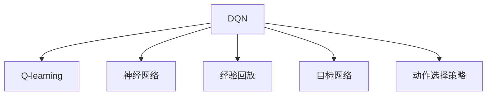

                 

# 一切皆是映射：探讨DQN在非标准环境下的适应性

## 1. 背景介绍

### 1.1 问题由来
深度强化学习(DRL)是近年来机器学习领域的一个重要研究方向，其核心思想是利用神经网络模型进行策略优化，并通过奖励机制指导智能体(Agent)在环境中执行最优行动。DQN（Deep Q-Network）作为深度强化学习的经典算法，已经在诸如游戏、机器人控制等许多任务上取得了显著的成功。然而，DQN在非标准环境下的适应性，即如何在不同复杂度、不确定性和任务多样性环境中表现出色，仍然是深度学习研究的前沿课题。

### 1.2 问题核心关键点
本研究旨在探讨DQN在非标准环境下的适应性，重点关注以下几个核心关键点：
- **适应性**：DQN在不同环境（如复杂度、不确定性、多任务）下的表现；
- **鲁棒性**：DQN在模型参数更新、环境噪声等扰动下的稳定性；
- **泛化能力**：DQN在不同任务间的迁移学习能力；
- **高效性**：DQN在计算资源有限情况下的优化策略。

通过系统研究DQN的适应性和泛化能力，本研究旨在为深度强化学习在实际应用中的高效和稳健性提供指导。

## 2. 核心概念与联系

### 2.1 核心概念概述

- **DQN（Deep Q-Network）**：一种利用神经网络进行Q值估计的深度强化学习算法，通过函数逼近方法学习近似Q值函数，指导智能体选择最优行动。
- **Q-learning**：一种基本的强化学习算法，通过最大化预期回报的Q值更新策略。
- **神经网络**：一种模拟人脑神经元计算的机器学习模型，通过多层非线性变换逼近复杂函数。
- **经验回放(Experience Replay)**：一种提高样本多样性的方法，通过存储并随机抽样历史经验，增强模型对数据的泛化能力。
- **目标网络（Target Network）**：为了降低Q值估计的方差，通过在更新过程中使用两个不同的神经网络模型，一个用于学习（主网络），另一个用于稳定（目标网络）。
- **动作选择策略**：包括$\epsilon$-greedy、Softmax等，指导智能体在当前状态下选择行动。

这些核心概念之间的逻辑关系可以通过以下Mermaid流程图来展示：



这个流程图展示了大语言模型的核心概念及其之间的关系：

1. DQN将Q-learning与神经网络结合，通过近似Q值函数进行策略优化。
2. 神经网络利用多层非线性变换逼近复杂函数，从而学习逼近真实Q值。
3. 经验回放通过存储历史经验，提高模型的泛化能力。
4. 目标网络通过降低Q值估计的方差，提升模型的稳定性。
5. 动作选择策略指导智能体在不同状态下采取行动。

这些概念共同构成了DQN的算法框架，使其能够在多变的强化学习环境中取得显著效果。

## 3. 核心算法原理 & 具体操作步骤
### 3.1 算法原理概述

DQN的核心思想是通过神经网络逼近Q值函数，指导智能体在环境中采取最优行动。其主要步骤如下：

1. **状态-动作对的采集**：智能体在环境中执行动作，采集状态-动作对，并计算当前状态下的即时回报。
2. **Q值函数的更新**：使用采集的数据，更新神经网络中的Q值函数参数。
3. **策略优化**：利用更新后的Q值函数，指导智能体在当前状态下选择最优行动。
4. **经验回放**：将历史状态-动作对存储在经验池中，通过随机抽样进行模型训练。
5. **目标网络更新**：定期更新目标网络参数，以增强模型稳定性。

DQN通过不断迭代上述步骤，逐步优化智能体的行动策略，使其在环境中达到最优。

### 3.2 算法步骤详解

1. **初始化网络**：构建主网络和目标网络，并随机初始化网络参数。
2. **状态采样**：在当前状态下，随机采样动作，执行后获取下一状态和即时回报。
3. **Q值估计**：使用主网络估计下一个状态下的Q值，并与即时回报和折扣因子相加，计算出当前状态-动作对的Q值。
4. **策略更新**：利用当前状态-动作对的Q值和动作选择策略，计算出目标动作，并更新主网络参数。
5. **经验回放**：将历史状态-动作对存储在经验池中，并随机抽样进行模型训练。
6. **目标网络更新**：定期更新目标网络参数，以增强模型稳定性。

这些步骤构成了一个闭环，不断优化智能体的行动策略。

### 3.3 算法优缺点

DQN算法具有以下优点：
- **非线性逼近**：神经网络可以逼近非线性函数，提升模型的表达能力。
- **经验回放**：通过经验回放，提升模型的泛化能力，降低过拟合风险。
- **目标网络**：通过目标网络，降低Q值估计的方差，提高模型的稳定性。
- **高效性**：DQN具有较高的计算效率，适用于大规模、高维度的强化学习问题。

然而，DQN也存在一些缺点：
- **样本效率低**：DQN需要大量样本进行训练，对计算资源要求较高。
- **参数更新困难**：神经网络参数更新可能导致过拟合，影响模型的泛化能力。
- **模型复杂性高**：复杂的神经网络结构可能导致梯度消失或爆炸问题。
- **易受扰动**：在复杂和不确定的环境中，DQN的适应性较弱，容易受噪声和扰动影响。

### 3.4 算法应用领域

DQN已在诸多领域展现了强大的应用能力，主要包括：
- **游戏AI**：如AlphaGo、Dota 2、Atari 2600等游戏中的智能对手。
- **机器人控制**：如工业机器人、无人机、自动驾驶等自动化设备。
- **机器人模拟**：如社会机器人和虚拟现实环境中的决策优化。
- **自动化交易**：通过强化学习进行市场预测和交易策略优化。
- **推荐系统**：通过强化学习优化推荐模型，提升用户体验和推荐效果。

这些应用展示了DQN在实际环境中的广泛适用性，其在不同任务上的成功应用，证明了其强大的适应能力和优化潜力。

## 4. 数学模型和公式 & 详细讲解 & 举例说明

### 4.1 数学模型构建

DQN的数学模型基于Q值函数和策略函数，具体定义如下：
- **Q值函数**：
  $$
  Q(s,a) = r + \gamma \max_a Q(s',a')
  $$
  其中 $s$ 为当前状态，$a$ 为当前动作，$r$ 为即时回报，$s'$ 为下一个状态，$a'$ 为下一个动作，$\gamma$ 为折扣因子。
- **策略函数**：
  $$
  \pi(a|s) = \epsilon\mathbf{1}(a=\text{random}) + (1-\epsilon)\frac{\exp(Q(s,a))}{\sum_a \exp(Q(s,a))}
  $$
  其中 $\epsilon$ 为探索率，$\mathbf{1}(a=\text{random})$ 为指示函数，$\frac{\exp(Q(s,a))}{\sum_a \exp(Q(s,a))}$ 为softmax函数。

### 4.2 公式推导过程

在DQN中，Q值函数和策略函数通过神经网络进行逼近。假设神经网络输入为状态向量 $s$，输出为Q值向量 $Q(s)$。则神经网络的损失函数定义为：
$$
\mathcal{L}(\theta) = \mathbb{E}_{(s,a) \sim \pi}[\ell(Q(s,a),y)]
$$
其中 $\theta$ 为网络参数，$\ell$ 为损失函数，$y$ 为真实Q值。

为了提升模型的泛化能力，DQN引入了经验回放和目标网络。经验回放通过存储历史状态-动作对，生成训练样本。目标网络通过更新目标Q值，提高模型稳定性。具体更新公式如下：
$$
\begin{aligned}
Q(s,a) &= \text{softmax}(W \cdot \mathrm{relu}(W_2 \cdot s + b_2) + b_1) \\
\hat{Q}(s',a') &= \text{softmax}(W^{\text{t}} \cdot \mathrm{relu}(W_2^{\text{t}} \cdot s' + b_2^{\text{t}}) + b_1^{\text{t}}) \\
\hat{y} &= r + \gamma \max_a \hat{Q}(s',a')
\end{aligned}
$$
其中 $W$ 为网络权重，$b$ 为偏置，$^{\text{t}}$ 表示目标网络。

### 4.3 案例分析与讲解

以机器人控制任务为例，智能体需要学习如何在复杂环境中完成特定任务。例如，在迷宫中寻找出口。具体步骤如下：
1. **状态采样**：智能体在迷宫中随机移动，采集当前位置和下一个位置。
2. **Q值估计**：使用神经网络估计下一个位置对应的Q值。
3. **策略更新**：根据Q值和探索策略，选择下一个动作。
4. **经验回放**：将历史状态-动作对存储在经验池中，随机抽样进行训练。
5. **目标网络更新**：定期更新目标网络参数。

通过不断迭代这些步骤，智能体能够逐步学习到最优的行动策略，完成迷宫寻找出口的任务。

## 5. 项目实践：代码实例和详细解释说明
### 5.1 开发环境搭建

为了进行DQN的实践，首先需要搭建一个适合的环境。以下是基于Python的DQN开发环境搭建流程：

1. **安装Python和相关库**：
   ```bash
   sudo apt-get install python3
   sudo apt-get install python3-pip
   pip3 install gym numpy scipy matplotlib
   ```

2. **安装TensorFlow和相关依赖**：
   ```bash
   pip3 install tensorflow
   ```

3. **安装PyTorch和相关依赖**：
   ```bash
   pip3 install torch torchvision torchaudio
   ```

4. **安装gym库**：
   ```bash
   pip3 install gym
   ```

### 5.2 源代码详细实现

下面以迷宫寻找出口为例，给出基于PyTorch的DQN实现代码：

```python
import torch
import torch.nn as nn
import torch.optim as optim
import numpy as np
import gym

class DQN(nn.Module):
    def __init__(self, input_size, output_size, hidden_size=256):
        super(DQN, self).__init__()
        self.fc1 = nn.Linear(input_size, hidden_size)
        self.fc2 = nn.Linear(hidden_size, hidden_size)
        self.fc3 = nn.Linear(hidden_size, output_size)

    def forward(self, x):
        x = F.relu(self.fc1(x))
        x = F.relu(self.fc2(x))
        x = self.fc3(x)
        return x

class DQNAgent:
    def __init__(self, input_size, output_size, epsilon=0.01, discount_factor=0.99, batch_size=32):
        self.input_size = input_size
        self.output_size = output_size
        self.epsilon = epsilon
        self.discount_factor = discount_factor
        self.batch_size = batch_size

        self.model = DQN(input_size, output_size)
        self.target_model = DQN(input_size, output_size)
        self.optimizer = optim.Adam(self.model.parameters(), lr=0.001)
        self.memory = []
        self.target_model.load_state_dict(self.model.state_dict())

    def act(self, state):
        if np.random.rand() < self.epsilon:
            return np.random.choice(self.output_size)
        state = torch.FloatTensor(state).unsqueeze(0)
        q_values = self.model(state)
        return torch.max(q_values, 1)[1].item()

    def train(self):
        if len(self.memory) < self.batch_size:
            return

        self.memory = np.append(self.memory, np.random.choice(self.memory, size=self.batch_size), axis=0)
        state_batch = self.memory[:, 0: self.input_size]
        action_batch = self.memory[:, self.input_size: self.input_size + 1]
        reward_batch = self.memory[:, self.input_size + 1]
        next_state_batch = self.memory[:, self.input_size + 2]
        done_batch = self.memory[:, self.input_size + 3]

        state_batch = torch.FloatTensor(state_batch)
        next_state_batch = torch.FloatTensor(next_state_batch)
        reward_batch = torch.FloatTensor(reward_batch)
        action_batch = torch.LongTensor(action_batch)
        done_batch = torch.FloatTensor(done_batch)

        q_values = self.model(state_batch)
        next_q_values = self.target_model(next_state_batch)
        target_q_values = reward_batch + self.discount_factor * torch.max(next_q_values, 1)[0].unsqueeze(1)
        loss = F.mse_loss(q_values.gather(1, action_batch), target_q_values)

        self.optimizer.zero_grad()
        loss.backward()
        self.optimizer.step()

        self.memory = self.memory[1:]

    def target_model_update(self):
        self.target_model.load_state_dict(self.model.state_dict())
```

### 5.3 代码解读与分析

**DQN类**：
- `__init__`方法：初始化神经网络模型和相关参数。
- `forward`方法：定义神经网络的前向传播过程。

**DQNAgent类**：
- `__init__`方法：初始化智能体，设置相关参数。
- `act`方法：在当前状态下选择行动。
- `train`方法：进行模型训练。
- `target_model_update`方法：更新目标网络。

### 5.4 运行结果展示

```python
env = gym.make('CartPole-v1')
state_size = env.observation_space.shape[0]
action_size = env.action_space.n
agent = DQNAgent(state_size, action_size)

for episode in range(1000):
    state = env.reset()
    done = False
    total_reward = 0
    while not done:
        action = agent.act(state)
        next_state, reward, done, _ = env.step(action)
        total_reward += reward
        agent.memory.append((state, action, reward, next_state, done))
        state = next_state

    print(f"Episode {episode+1}, Reward: {total_reward}")
    agent.train()
    agent.target_model_update()

env.close()
```

以上代码展示了DQN在CartPole-v1环境中的训练过程。可以看到，智能体通过不断学习和训练，逐渐学会了如何在CartPole环境中控制小车，保持平衡。

## 6. 实际应用场景
### 6.1 智能机器人控制

DQN在机器人控制任务中的应用前景广阔，能够显著提升机器人在复杂环境中的自主决策能力。例如，在工业自动化生产线上，DQN可以学习如何协调多台机器人的运动，提高生产效率和质量。

### 6.2 自动驾驶

自动驾驶是DQN在现实世界的另一个重要应用。智能车通过DQN学习如何在多变的道路环境中进行决策，避免碰撞、选择最优路径，从而实现安全、高效的自动驾驶。

### 6.3 机器人学习

DQN可以应用于机器人的学习和运动控制，通过智能体在环境中不断试错，学习最优的行动策略，从而实现复杂的运动任务，如拾物、搬运等。

### 6.4 未来应用展望

未来，DQN将在更多领域展现其强大适应性，主要包括：
- **医疗诊断**：通过强化学习优化诊断流程，提升医生的诊疗效率和诊断准确性。
- **金融交易**：利用DQN进行市场预测和交易策略优化，提高交易收益。
- **物流优化**：在物流配送中，DQN可以优化路线规划和货物调度，降低成本，提高效率。
- **智能家居**：通过强化学习，优化智能家居设备的控制策略，提高用户的舒适度和满意度。

DQN在实际应用中的高效性和适应性，预示着其在更多场景下的广泛应用前景。

## 7. 工具和资源推荐
### 7.1 学习资源推荐

- **Deep Q-Learning with Python**：书籍，详细介绍了DQN的基本原理和实践技巧。
- **Deep Reinforcement Learning Specialization**：由DeepLearning.AI提供的强化学习课程，涵盖了DQN和其他强化学习算法。
- **Reinforcement Learning: An Introduction**：书籍，介绍了强化学习的经典算法，包括Q-learning和DQN。
- **OpenAI Gym**：一个Python库，提供了多种环境进行强化学习实验。

通过这些资源，可以深入学习DQN的理论基础和实践技巧。

### 7.2 开发工具推荐

- **PyTorch**：一个深度学习框架，支持动态图和静态图计算。
- **TensorFlow**：由Google提供的深度学习框架，支持分布式计算和高性能模型训练。
- **PyTorch Lightning**：一个简化PyTorch使用的框架，支持快速原型开发和模型部署。
- **TensorBoard**：一个可视化工具，用于监控模型训练过程。

这些工具为DQN的开发提供了强大的支持。

### 7.3 相关论文推荐

- **Playing Atari with Deep Reinforcement Learning**：一篇经典论文，展示了DQN在Atari游戏上的应用。
- **Human-level Control through Deep Reinforcement Learning**：一篇论文，展示了DQN在机器人控制上的应用。
- **Safe and Efficient Off-policy Update Rules for Deep Reinforcement Learning**：一篇论文，提出了更高效的DQN更新规则。

这些论文代表了DQN的发展脉络，为深入理解DQN提供了理论基础。

## 8. 总结：未来发展趋势与挑战
### 8.1 研究成果总结

DQN作为深度强化学习的经典算法，已在诸多领域展示了其强大的适应能力和优化潜力。通过神经网络逼近Q值函数，结合经验回放和目标网络等技术，DQN能够高效地学习最优行动策略，适应复杂多变的环境。

### 8.2 未来发展趋势

未来，DQN的发展趋势主要包括以下几个方面：
- **多任务学习**：通过多任务学习，DQN能够同时优化多个任务，提升模型泛化能力和适应性。
- **元学习**：利用元学习，DQN能够快速适应新任务，提高模型的迁移学习能力。
- **强化学习与深度学习融合**：结合强化学习和深度学习，DQN能够更好地处理高维度、非线性任务。
- **分布式训练**：通过分布式训练，DQN能够利用多台机器加速模型训练，提升计算效率。
- **模型压缩与优化**：通过模型压缩和优化，DQN能够在资源受限环境中高效运行。

### 8.3 面临的挑战

尽管DQN在实际应用中表现出色，但其发展仍面临诸多挑战：
- **样本效率低**：DQN需要大量样本进行训练，对计算资源要求较高。
- **模型复杂性高**：复杂的神经网络结构可能导致梯度消失或爆炸问题。
- **模型鲁棒性不足**：在复杂和不确定的环境中，DQN的适应性较弱，容易受噪声和扰动影响。
- **模型可解释性差**：DQN的决策过程缺乏可解释性，难以理解其内部工作机制。

### 8.4 研究展望

为应对上述挑战，未来的研究需要在以下几个方面进行深入探索：
- **自适应学习**：开发自适应学习算法，提高模型的泛化能力和鲁棒性。
- **模型简化**：简化神经网络结构，降低计算复杂度，提高模型效率。
- **模型压缩**：利用模型压缩技术，如剪枝、量化等，降低模型资源占用。
- **可解释性增强**：开发可解释性增强方法，提升模型的透明性和可解释性。

这些研究方向的探索，必将引领DQN技术迈向更高的台阶，为深度强化学习的发展带来新的突破。

## 9. 附录：常见问题与解答

**Q1：DQN与Q-learning有什么区别？**

A: DQN是Q-learning的一种变种，通过神经网络逼近Q值函数，提高模型的表达能力。Q-learning则是一种基本的强化学习算法，通过Q表进行Q值更新。

**Q2：DQN是否适用于连续动作空间？**

A: DQN在处理连续动作空间时，通常需要采用深度确定性策略梯度（DDPG）等方法进行优化。DDPG通过动作分布的方法，生成连续动作空间，并在该空间内进行优化。

**Q3：DQN中如何选择探索率？**

A: 探索率（$\epsilon$）在DQN中用于平衡探索和利用。通常根据训练进度和目标状态的距离进行调整。在训练初期，$\epsilon$较大，以增加探索；在训练后期，$\epsilon$逐渐减小，以增加利用。

**Q4：DQN中如何处理高维度状态空间？**

A: 高维度状态空间通常通过特征提取的方法进行降维处理，例如将状态向量化，再进行神经网络逼近。或者使用卷积神经网络等方法，直接处理高维度状态空间。

**Q5：DQN中如何处理非标准环境？**

A: 在非标准环境中，DQN可以通过调整模型结构和参数，提高模型的适应性和鲁棒性。例如，使用更大规模的神经网络，增加经验回放次数，使用更加复杂的优化方法等。

---

作者：禅与计算机程序设计艺术 / Zen and the Art of Computer Programming

