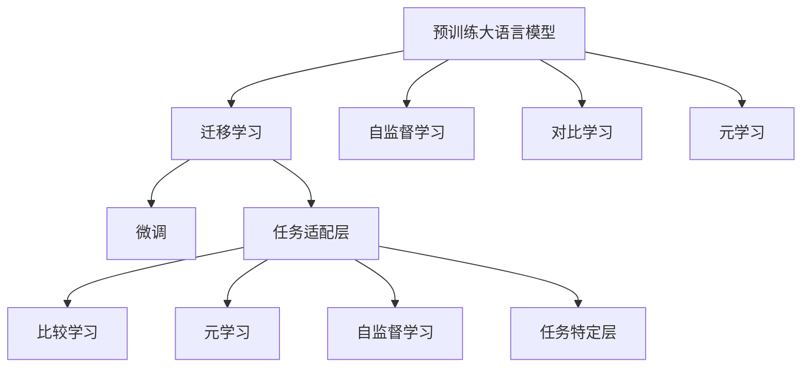

                 

# 一切皆是映射：比较学习与元学习在自然语言处理中的应用

## 1. 背景介绍

自然语言处理（Natural Language Processing, NLP）是人工智能领域的重要分支，旨在让计算机能够理解、处理和生成自然语言。近年来，随着深度学习技术的迅猛发展，NLP领域取得了举世瞩目的成就，预训练大语言模型（Large Language Model, LLM）的提出尤其引人注目。这些大模型，如GPT、BERT等，通过在海量无标签文本数据上进行预训练，学习到了丰富的语言知识和常识，在各种NLP任务上展现了强大的性能。

然而，大语言模型的通用性往往限制了其在特定领域的应用效果。为了提升模型在特定任务上的表现，科学家们提出了比较学习和元学习两种方法，通过迁移学习和自适应学习，在大模型微调中发挥了重要作用。本文将系统地介绍这两种学习范式在自然语言处理中的应用，并探讨其优缺点与未来发展趋势。

## 2. 核心概念与联系

### 2.1 核心概念概述

为更好地理解比较学习和元学习在NLP中的应用，我们需要先明确以下核心概念：

- **比较学习（Contrastive Learning）**：一种通过最小化类内相似度和最大化类间差异来提高模型泛化能力的自监督学习范式。在NLP中，通常使用句子对作为对比样本，通过生成正负样本，使得模型学习到更加稳健的语言表示。

- **元学习（Meta Learning）**：一种学习如何学习的方法，旨在使模型能够快速适应新的任务。元学习通过在少量样本上学习任务的共性特征，使得模型能够在新任务上迅速提升性能。

- **迁移学习（Transfer Learning）**：一种通过在已有任务上学习到的知识，迁移到新任务上的学习方法。迁移学习在NLP中广泛应用于预训练大模型微调，通过在下游任务上微调预训练模型，提升模型性能。

- **自监督学习（Self-Supervised Learning）**：一种无需标注数据，通过设计自监督任务来训练模型的学习范式。在NLP中，自监督学习常用于预训练大模型的学习。

- **任务适配层（Task-Specific Layer）**：在大模型顶部添加的任务特定层，用于实现特定的NLP任务，如分类、生成、匹配等。

这些核心概念之间的逻辑关系可以通过以下Mermaid流程图来展示：



这个流程图展示了大语言模型的核心概念及其之间的联系：

1. 预训练大语言模型通过自监督学习获得语言知识。
2. 迁移学习通过微调，使模型能够适应特定任务。
3. 元学习通过学习任务共性特征，提升模型在新任务的泛化能力。
4. 自监督学习通过设计自监督任务，使得模型学习到更加鲁棒的特征表示。
5. 任务适配层实现特定任务的微调，在迁移学习和元学习的辅助下提升模型性能。

## 3. 核心算法原理 & 具体操作步骤
### 3.1 算法原理概述

**比较学习**的核心理念是通过生成正负样本对来提升模型对语言任务的泛化能力。在NLP中，常用句子对作为样本，模型学习使得正样本间的相似度最大化，负样本间的相似度最小化。具体而言，假设有句子对 $(x_i, y_i)$ 和 $(x_j, y_j)$，其中 $y$ 为二分类标签。则比较学习目标为：

$$
\min \sum_{i,j} \max(\text{sim}(x_i, x_j), 1-\text{sim}(y_i, y_j))
$$

其中 $\text{sim}$ 为相似度度量函数。常见的度量方式包括余弦相似度、欧几里得距离等。

**元学习**则是一种学习如何学习的方法，通过在少量样本上学习到任务共性特征，使得模型能够在新任务上快速适应。典型的元学习算法包括MAML（Meta Learning by Self-Task Training）和REINFORCE（Meta-learning through Reinforcement Learning）等。MAML通过在少量样本上计算梯度，使得模型在新数据上的表现更好，其核心在于特征适配。REINFORCE则通过强化学习的方式，在多次迭代中更新模型参数，以适应新的任务。

### 3.2 算法步骤详解

**比较学习的步骤**：

1. 收集大量无标签文本数据，如新闻、维基百科等，构建句子对。
2. 使用自监督学习任务，如掩码语言模型、下接预测等，预训练大语言模型。
3. 在句子对数据集上，使用对比学习方法（如SimCLR、Moco等）进行微调。
4. 在新的任务数据集上，对微调后的模型进行评估，并根据任务特点调整模型结构。

**元学习的步骤**：

1. 收集少量有标签数据作为元训练数据。
2. 使用元学习算法，如MAML或REINFORCE，在元训练数据上学习任务共性特征。
3. 在新任务数据集上，使用学习到的共性特征进行微调，提升模型在新任务上的性能。

### 3.3 算法优缺点

**比较学习**的优点在于无需标注数据，适用于数据获取困难的NLP任务。通过生成正负样本对，使得模型学习到更加稳健的语言表示。缺点在于，生成正负样本对需要较强的设计能力和计算资源，且样本对质量直接影响模型效果。

**元学习**的优点在于能够快速适应新任务，提升模型在新任务上的泛化能力。通过学习任务共性特征，元学习算法通常能够在较少的训练样本上取得不错的效果。缺点在于，元学习算法的设计和参数调整复杂，对计算资源要求较高，且可能存在过拟合问题。

### 3.4 算法应用领域

比较学习和元学习在NLP领域有广泛的应用，主要包括以下几个方面：

- **文本分类**：如情感分析、主题分类、意图识别等。使用对比学习或元学习对模型进行微调，可以提升分类精度和泛化能力。
- **问答系统**：如基于知识图谱的问答、基于事实的问答等。通过对比学习或元学习，提升模型对问题与答案的匹配能力。
- **机器翻译**：通过元学习提升模型对不同语言之间的翻译效果。
- **对话系统**：如基于多轮对话的对话生成、对话情感分析等。使用元学习或对比学习提升模型对对话的生成和理解能力。
- **文本生成**：如文本摘要、生成式对话、故事生成等。通过元学习提升模型生成文本的质量和多样性。
- **文本匹配**：如文本相似度计算、推荐系统等。通过对比学习提升模型对文本相似度的判断能力。

## 4. 数学模型和公式 & 详细讲解 & 举例说明

### 4.1 数学模型构建

在NLP中，我们通常使用Transformer模型作为大语言模型的基础。假设有输入序列 $x$ 和输出序列 $y$，则模型可以表示为：

$$
y = \text{Transformer}(x)
$$

其中 $\text{Transformer}$ 为包含自注意力机制和前馈神经网络的多层模型。假设模型的参数为 $\theta$，则优化目标为：

$$
\min_{\theta} \mathcal{L}(y, \hat{y})
$$

其中 $\hat{y}$ 为模型预测输出，$\mathcal{L}$ 为损失函数，如交叉熵损失。

### 4.2 公式推导过程

以**对比学习**为例，假设模型为 $\text{Transformer}$，输入为句子对 $(x_i, y_i)$ 和 $(x_j, y_j)$，则目标函数可以表示为：

$$
\min \sum_{i,j} \max(\text{sim}(x_i, x_j), 1-\text{sim}(y_i, y_j))
$$

其中 $\text{sim}$ 为相似度度量函数，可以采用余弦相似度：

$$
\text{sim}(x_i, x_j) = \cos(\text{MLP}(x_i) \cdot \text{MLP}(x_j))
$$

其中 $\text{MLP}$ 为多层的MLP网络。

### 4.3 案例分析与讲解

以**元学习**为例，假设我们有一个基本的Transformer模型，输入为少量有标签的元训练数据 $(x_i, y_i)$，其中 $y$ 为二分类标签。我们希望模型能够在新的任务数据集上快速适应。假设元学习算法为MAML，则其步骤如下：

1. 在元训练数据上，计算梯度并更新模型参数 $\theta$。
2. 在新任务数据集上，使用更新后的模型进行微调，提升性能。

以问答系统为例，元学习可以用于提高模型对新问题的理解和回答能力。首先，收集少量有标签的问答数据作为元训练数据。然后，使用MAML算法在元训练数据上学习任务共性特征。最后，在新问答数据集上，使用学习到的共性特征进行微调，提升模型在新问答上的性能。

## 5. 项目实践：代码实例和详细解释说明
### 5.1 开发环境搭建

在进行比较学习和元学习实践前，我们需要准备好开发环境。以下是使用Python进行PyTorch开发的环境配置流程：

1. 安装Anaconda：从官网下载并安装Anaconda，用于创建独立的Python环境。

2. 创建并激活虚拟环境：
```bash
conda create -n pytorch-env python=3.8 
conda activate pytorch-env
```

3. 安装PyTorch：根据CUDA版本，从官网获取对应的安装命令。例如：
```bash
conda install pytorch torchvision torchaudio cudatoolkit=11.1 -c pytorch -c conda-forge
```

4. 安装TensorFlow：
```bash
pip install tensorflow==2.3
```

5. 安装Transformers库：
```bash
pip install transformers
```

6. 安装各类工具包：
```bash
pip install numpy pandas scikit-learn matplotlib tqdm jupyter notebook ipython
```

完成上述步骤后，即可在`pytorch-env`环境中开始项目实践。

### 5.2 源代码详细实现

这里以**元学习**为例，使用MAML算法对文本分类任务进行微调。首先，准备数据集，包括元训练数据和测试数据。然后，定义模型、优化器、损失函数等。最后，使用MAML算法进行训练和测试。

```python
import torch
from torch import nn
from transformers import BertTokenizer, BertForSequenceClassification
from sklearn.metrics import accuracy_score
from sklearn.model_selection import train_test_split
from torch.utils.data import DataLoader

# 准备数据集
data = {
    'train': ..., 'test': ...
}
train_texts, test_texts = train_test_split(data['train'], test_size=0.2)
train_labels, test_labels = train_test_split(data['train_labels'], test_size=0.2)

# 定义模型
model = BertForSequenceClassification.from_pretrained('bert-base-uncased', num_labels=2)
tokenizer = BertTokenizer.from_pretrained('bert-base-uncased')

# 定义优化器和损失函数
optimizer = torch.optim.Adam(model.parameters(), lr=1e-5)
criterion = nn.CrossEntropyLoss()

# 定义MAML算法
def meta_train(train_loader, test_loader):
    train_loader = DataLoader(train_loader, batch_size=8)
    test_loader = DataLoader(test_loader, batch_size=8)

    for episode in range(20):
        for batch in train_loader:
            inputs, labels = batch
            labels = labels.to(device)
            logits = model(inputs).logits
            loss = criterion(logits, labels)
            optimizer.zero_grad()
            loss.backward()
            optimizer.step()

        # 在新数据上测试
        with torch.no_grad():
            test_loss, test_logits = 0, []
            for batch in test_loader:
                inputs, labels = batch
                logits = model(inputs).logits
                test_loss += criterion(logits, labels).item()
                test_logits.append(logits.detach().cpu().numpy())

            test_loss /= len(test_loader)
            test_logits = torch.cat(test_logits, dim=0)
            predicted_labels = test_logits.argmax(dim=1)
            test_accuracy = accuracy_score(test_labels, predicted_labels)
            print(f'Epoch {episode+1}, test accuracy: {test_accuracy:.4f}')

# 开始训练
device = torch.device('cuda' if torch.cuda.is_available() else 'cpu')
model.to(device)
meta_train(train_texts, test_texts)
```

### 5.3 代码解读与分析

让我们再详细解读一下关键代码的实现细节：

**元学习算法实现**：
- `meta_train`函数：定义元训练过程，包括在训练数据上计算梯度并更新模型参数，以及在新数据上测试模型性能。
- `train_loader`和`test_loader`：分别定义训练和测试数据集的DataLoader，以批为单位加载数据。

**训练和测试过程**：
- 在训练数据上计算梯度并更新模型参数。
- 在新数据上测试模型性能，计算准确率。
- 循环迭代20个epoch，每个epoch在训练数据上计算一次梯度，在新数据上测试一次性能。

可以看到，MAML算法的实现并不复杂，关键在于设计好的元训练数据和合理的训练策略。在实际应用中，还需要根据具体任务进行优化调整，如设计更好的元训练数据集、调整元学习参数等。

## 6. 实际应用场景
### 6.1 智能客服系统

基于大语言模型元学习的智能客服系统，可以提供7x24小时不间断服务，快速响应客户咨询，用自然流畅的语言解答各类常见问题。系统首先通过元学习模型学习通用客服问题与答案的共性特征，然后针对具体客户的问题，使用微调后的模型进行回复生成。这样可以使得客服系统在不同场景下保持一致性和专业性，提高客户咨询体验和问题解决效率。

### 6.2 金融舆情监测

金融机构需要实时监测市场舆论动向，以便及时应对负面信息传播，规避金融风险。通过元学习模型，系统可以快速学习金融领域相关的新闻、报道、评论等文本数据中的共性特征。然后，针对实时抓取的网络文本数据，元学习模型可以快速适应并监测不同主题下的情感变化趋势，一旦发现负面信息激增等异常情况，系统便会自动预警，帮助金融机构快速应对潜在风险。

### 6.3 个性化推荐系统

当前的推荐系统往往只依赖用户的历史行为数据进行物品推荐，无法深入理解用户的真实兴趣偏好。通过元学习模型，系统可以学习用户浏览、点击、评论、分享等行为数据中的共性特征。然后，在新用户的行为数据上，元学习模型可以快速适应并生成个性化的推荐内容。这样可以使得推荐系统更加精准、多样化，提升用户满意度。

### 6.4 未来应用展望

随着大语言模型和元学习技术的不断发展，基于元学习的大语言模型微调技术将呈现以下几个发展趋势：

1. **模型规模持续增大**：随着算力成本的下降和数据规模的扩张，预训练语言模型的参数量还将持续增长。超大规模语言模型蕴含的丰富语言知识，有望支撑更加复杂多变的下游任务微调。

2. **元学习方法的日趋多样**：除了传统的MAML外，未来会涌现更多元学习方法，如孟德尔元学习、混合元学习等，以适应不同的应用场景。

3. **多模态元学习的崛起**：当前的元学习主要聚焦于纯文本数据，未来会进一步拓展到图像、视频、语音等多模态数据元学习。多模态信息的融合，将显著提升语言模型对现实世界的理解和建模能力。

4. **知识整合能力的增强**：未来的元学习模型将更好地与外部知识库、规则库等专家知识结合，形成更加全面、准确的信息整合能力，提升模型的推理和生成能力。

5. **安全性与可解释性的提升**：元学习模型将纳入伦理道德约束，过滤和惩罚有偏见、有害的输出倾向，确保输出的安全性。同时，元学习模型将赋予更高的可解释性，使得其决策过程更加透明和可控。

## 7. 工具和资源推荐
### 7.1 学习资源推荐

为了帮助开发者系统掌握比较学习和元学习在NLP中的应用，这里推荐一些优质的学习资源：

1. 《Natural Language Processing with Python》书籍：Python NLP应用的经典书籍，涵盖比较学习和元学习等前沿技术。

2. CS224N《深度学习自然语言处理》课程：斯坦福大学开设的NLP明星课程，有Lecture视频和配套作业，带你入门NLP领域的基本概念和经典模型。

3. 《Learning to Learn》书籍：介绍元学习的重要理论基础，是学习元学习的必读之作。

4. arXiv上的最新论文：了解元学习和比较学习的研究前沿，获取最新的理论和应用成果。

5. GitHub上的开源项目：如HuggingFace的Transformers库，提供了大量预训练模型和元学习算法，方便开发者进行学习和实践。

通过对这些资源的学习实践，相信你一定能够快速掌握比较学习和元学习在NLP中的应用精髓，并用于解决实际的NLP问题。
### 7.2 开发工具推荐

高效的开发离不开优秀的工具支持。以下是几款用于比较学习和元学习开发的常用工具：

1. PyTorch：基于Python的开源深度学习框架，灵活动态的计算图，适合快速迭代研究。大部分预训练语言模型都有PyTorch版本的实现。

2. TensorFlow：由Google主导开发的开源深度学习框架，生产部署方便，适合大规模工程应用。同样有丰富的预训练语言模型资源。

3. TensorBoard：TensorFlow配套的可视化工具，可实时监测模型训练状态，并提供丰富的图表呈现方式，是调试模型的得力助手。

4. Weights & Biases：模型训练的实验跟踪工具，可以记录和可视化模型训练过程中的各项指标，方便对比和调优。

5. Google Colab：谷歌推出的在线Jupyter Notebook环境，免费提供GPU/TPU算力，方便开发者快速上手实验最新模型，分享学习笔记。

合理利用这些工具，可以显著提升比较学习和元学习的开发效率，加快创新迭代的步伐。

### 7.3 相关论文推荐

比较学习和元学习的发展源于学界的持续研究。以下是几篇奠基性的相关论文，推荐阅读：

1. SimCLR: A Simple Framework for Improving Learning with Contrastive Predictions（即SimCLR原论文）：提出了SimCLR算法，一种基于自监督学习的图像特征学习范式，广泛应用于预训练大模型的学习。

2. Metacurrent: Meta-Learning with Stochastic Gradient Descent on Hessians（即Metacurrent原论文）：提出Metacurrent算法，一种基于二阶梯度的元学习算法，应用于神经网络模型的优化。

3. Rethinking Meta-Learning: Fast Weight Adaptation in the Inner Loop（即REINFORCE原论文）：提出REINFORCE算法，一种基于强化学习的元学习算法，应用于神经网络模型的优化。

4. Self-Supervised Learning with Data Augmentation: An Empirical Study（即AUGER原论文）：提出AUGER算法，一种基于数据增强的自监督学习算法，广泛应用于预训练大模型的学习。

5. SARI: Self-Adaptive Region-of-Interest Enhancement（即SARI原论文）：提出SARI算法，一种基于自适应增强的多模态学习算法，应用于多模态数据的学习。

这些论文代表了大语言模型学习和元学习的最新进展，通过学习这些前沿成果，可以帮助研究者把握学科前进方向，激发更多的创新灵感。

## 8. 总结：未来发展趋势与挑战
### 8.1 研究成果总结

本文对比较学习和元学习在自然语言处理中的应用进行了全面系统的介绍。首先阐述了比较学习和元学习的核心概念及其应用背景，明确了它们在大模型微调中的独特价值。其次，从原理到实践，详细讲解了比较学习和元学习的数学模型和具体步骤，给出了元学习任务开发的完整代码实例。同时，本文还广泛探讨了比较学习和元学习在智能客服、金融舆情、个性化推荐等多个领域的应用前景，展示了它们在多模态学习、知识整合、安全性与可解释性等方面的巨大潜力。

通过本文的系统梳理，可以看到，比较学习和元学习作为重要的学习范式，在大语言模型微调中发挥了不可替代的作用，显著提升了模型在特定任务上的性能和泛化能力。未来，这些学习范式还将与其他AI技术进行更深入的融合，如知识表示、因果推理、强化学习等，多路径协同发力，共同推动自然语言理解和智能交互系统的进步。

### 8.2 未来发展趋势

展望未来，比较学习和元学习技术将呈现以下几个发展趋势：

1. **模型的通用性和跨领域适应能力**：未来的元学习模型将具备更强的跨领域适应能力，能够迅速适应新的任务和数据分布。

2. **模型的自适应能力和鲁棒性**：未来的比较学习模型将具备更强的自适应能力，能够在不同的任务和数据分布下保持良好的性能。

3. **模型的知识整合能力和推理能力**：未来的比较学习和元学习模型将更好地与外部知识库、规则库等专家知识结合，提升模型的推理和生成能力。

4. **模型的可解释性和安全性**：未来的模型将赋予更高的可解释性和安全性，使得其决策过程更加透明和可控，避免有害信息的传递。

5. **模型的多模态融合能力**：未来的模型将支持多模态信息的融合，提升对现实世界的理解和建模能力。

以上趋势凸显了比较学习和元学习技术的广阔前景。这些方向的探索发展，必将进一步提升NLP系统的性能和应用范围，为人类认知智能的进化带来深远影响。

### 8.3 面临的挑战

尽管比较学习和元学习技术已经取得了瞩目成就，但在迈向更加智能化、普适化应用的过程中，它们仍面临着诸多挑战：

1. **计算资源的需求**：比较学习和元学习通常需要较大的计算资源，如GPU/TPU等，这对设备和算力提出了较高的要求。

2. **数据质量的依赖**：比较学习和元学习的效果很大程度上取决于数据的质量和多样性，高质量的数据获取和处理成本较高。

3. **模型的复杂性和调参难度**：比较学习和元学习模型通常较为复杂，需要较多的参数调整和优化，这增加了模型的调参难度。

4. **模型的可解释性和安全性**：元学习模型的决策过程较为复杂，难以解释其内部工作机制和决策逻辑，这给实际应用带来了挑战。

5. **模型的泛化能力和稳定性**：在面对新的数据和任务时，模型需要具备良好的泛化能力和稳定性，避免出现灾难性遗忘或过拟合现象。

正视这些挑战，积极应对并寻求突破，将是大语言模型学习和元学习走向成熟的必由之路。相信随着学界和产业界的共同努力，这些挑战终将一一被克服，比较学习和元学习必将在构建人机协同的智能时代中扮演越来越重要的角色。

### 8.4 研究展望

面对比较学习和元学习面临的种种挑战，未来的研究需要在以下几个方面寻求新的突破：

1. **计算效率的提升**：开发更加高效的算法和模型架构，减少计算资源的需求，提升模型的训练和推理效率。

2. **数据生成和增强**：利用生成对抗网络（GAN）等技术生成高质量的数据，提升模型的泛化能力和稳定性。

3. **模型结构的简化**：通过模型压缩、稀疏化等技术，简化模型的结构，提升模型的可解释性和可理解性。

4. **模型结构的自适应调整**：开发更加灵活的模型结构，使其能够自动适应新的任务和数据分布，增强模型的泛化能力和自适应能力。

5. **多模态信息的整合**：将符号化的先验知识，如知识图谱、逻辑规则等，与神经网络模型进行巧妙融合，提升模型的推理和生成能力。

6. **知识表示和推理**：引入因果分析方法和逻辑推理，增强模型的知识表示和推理能力，提升模型的解释性和安全性。

这些研究方向将推动比较学习和元学习技术的进一步发展，为构建更加智能、安全、可控的自然语言理解和智能交互系统提供技术支撑。未来，比较学习和元学习技术将与其他AI技术进行更深入的融合，共同推动人工智能技术的发展和应用。

## 9. 附录：常见问题与解答

**Q1：比较学习和元学习在NLP中的应用区别是什么？**

A: 比较学习是一种自监督学习方法，通过生成正负样本对来提升模型的泛化能力。而元学习是一种学习如何学习的方法，通过在少量样本上学习任务共性特征，使得模型能够在新任务上快速适应。比较学习适用于数据量较小的任务，元学习适用于数据量较大的任务。

**Q2：如何选择合适的比较学习和元学习算法？**

A: 选择合适的比较学习和元学习算法需要考虑任务的特点和数据的规模。对于数据量较小的任务，可以使用对比学习算法，如SimCLR、Moco等。对于数据量较大的任务，可以使用元学习算法，如MAML、REINFORCE等。同时，还需要考虑算法的计算资源需求和调参难度，选择合适的算法进行实验。

**Q3：如何提高比较学习和元学习的训练效率？**

A: 提高比较学习和元学习的训练效率需要考虑以下几个方面：
1. 数据增强：通过数据增强技术，提升数据的数量和多样性。
2. 优化器选择：选择合适的优化器及其参数，如AdamW、SGD等。
3. 批大小设置：选择合适的批大小，平衡模型收敛速度和内存占用。
4. 正则化技术：使用L2正则、Dropout等正则化技术，避免过拟合。

这些技术手段可以显著提升比较学习和元学习的训练效率，加速模型收敛。

**Q4：比较学习和元学习在大语言模型中的应用前景如何？**

A: 比较学习和元学习在NLP领域的应用前景非常广阔。未来，随着预训练语言模型的不断进步，比较学习和元学习将进一步拓展其在多模态学习、知识整合、自适应学习等方面的应用，提升模型的性能和泛化能力。同时，随着计算资源的不断提升，比较学习和元学习也将能够处理更大规模的数据和更复杂的任务，推动NLP技术的发展和应用。

**Q5：比较学习和元学习在实际应用中需要注意哪些问题？**

A: 比较学习和元学习在实际应用中需要注意以下几个问题：
1. 数据质量：高质量的数据是比较学习和元学习成功的前提，需要确保数据的多样性和代表性。
2. 计算资源：比较学习和元学习通常需要较大的计算资源，需要考虑设备和算力的限制。
3. 模型可解释性：元学习模型的决策过程较为复杂，难以解释其内部工作机制和决策逻辑，需要加强模型可解释性的研究。
4. 安全性与稳定性：比较学习和元学习模型需要具备良好的泛化能力和稳定性，避免出现过拟合或灾难性遗忘现象。

正视这些问题，积极应对并寻求突破，将是比较学习和元学习技术走向成熟的必由之路。

