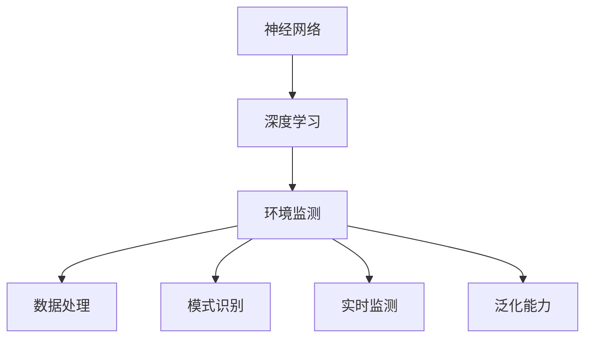

                 

# 一切皆是映射：环境监测中的神经网络算法应用

> 关键词：环境监测,神经网络,算法应用,机器学习,数据处理,实时监测,环境模型,深度学习

## 1. 背景介绍

### 1.1 问题由来

随着工业化进程的加速，环境问题已成为全球性挑战。空气污染、水质恶化、噪音干扰等环境问题，严重威胁着人类健康和生态平衡。及时、准确的环境监测成为应对这些问题的关键手段。

环境监测涉及面广、数据量大、监测手段多样，且对监测结果的时效性、精度要求高。传统的基于规则、固定设备监测的方法，无法满足这些要求。为此，越来越多的环境监测系统开始采用先进的数据采集和分析技术，其中神经网络算法成为热点。

### 1.2 问题核心关键点

神经网络在环境监测中的应用主要体现在以下几个方面：

- **数据处理**：神经网络能够高效地处理大量复杂的非结构化数据，如卫星遥感图像、空气质量传感器数据等，提取高层次的环境特征。
- **模式识别**：通过训练模型，神经网络可以自动识别环境中的复杂模式，如异常行为、污染物分布等。
- **实时监测**：神经网络可以实时处理和分析大量实时数据，提供动态的环境监测结果。
- **泛化能力**：神经网络可以从少量标注数据中学习通用环境特征，适用于多种环境监测任务。

本文将围绕神经网络在环境监测中的应用展开讨论，重点介绍其在数据处理、模式识别、实时监测和泛化能力方面的算法原理和操作步骤。

## 2. 核心概念与联系

### 2.1 核心概念概述

神经网络在环境监测中的应用涉及多个核心概念：

- **神经网络(Neural Network, NN)**：由大量人工神经元组成的非线性模型，能够处理非线性关系，进行复杂的模式识别和分类。
- **深度学习(Deep Learning, DL)**：一类基于神经网络的机器学习方法，能够自动学习输入数据的表示，适用于大规模数据处理和复杂模式识别。
- **环境监测(Environment Monitoring)**：通过实时或历史数据监测环境状态，预测环境变化趋势，采取措施改善环境质量。
- **数据处理(Data Processing)**：从原始数据中提取有用信息，处理缺失、异常值等问题，确保数据质量。
- **模式识别(Pattern Recognition)**：通过训练神经网络，自动识别数据中的复杂模式，如污染物分布、异常行为等。
- **实时监测(Real-time Monitoring)**：利用神经网络对实时数据进行快速处理和分析，提供动态监测结果。
- **泛化能力(Generalization)**：神经网络能够从少量标注数据中学习通用环境特征，适用于多种环境监测任务。

这些概念之间的逻辑关系可以通过以下Mermaid流程图来展示：



这个流程图展示了神经网络在环境监测中的核心作用，及其与深度学习、数据处理、模式识别、实时监测和泛化能力之间的联系。

## 3. 核心算法原理 & 具体操作步骤
### 3.1 算法原理概述

神经网络在环境监测中的应用主要基于以下原理：

- **数据表示学习**：通过神经网络自动学习输入数据的表示，提取环境特征。
- **模式识别与分类**：利用训练好的神经网络，自动识别和分类环境中的复杂模式，如污染物分布、异常行为等。
- **实时处理与分析**：神经网络能够实时处理和分析大量实时数据，提供动态的环境监测结果。
- **泛化能力**：神经网络可以从少量标注数据中学习通用环境特征，适用于多种环境监测任务。

### 3.2 算法步骤详解

神经网络在环境监测中的应用主要包括以下几个关键步骤：

**Step 1: 数据准备**

- 收集环境监测数据，包括卫星遥感图像、空气质量传感器数据、水质监测数据等。
- 对数据进行清洗和预处理，去除噪声和异常值，确保数据质量。
- 将数据标准化和归一化，适应神经网络的输入范围。

**Step 2: 模型选择与训练**

- 选择合适的神经网络模型，如卷积神经网络(CNN)、循环神经网络(RNN)、长短期记忆网络(LSTM)等。
- 设计训练流程，包括数据划分、损失函数、优化器、正则化技术等。
- 使用训练数据集对模型进行训练，优化模型参数，提升模型性能。

**Step 3: 模型评估与验证**

- 使用验证数据集对模型进行评估，计算准确率、召回率、F1值等指标。
- 进行模型调参，选择最优的超参数组合，提高模型性能。
- 利用测试数据集对模型进行测试，验证其泛化能力。

**Step 4: 实时监测与预测**

- 将训练好的模型部署到实际环境监测系统中。
- 实时处理和分析传感器数据，生成动态的环境监测结果。
- 利用模型进行预测，识别污染物分布、异常行为等。

### 3.3 算法优缺点

神经网络在环境监测中的应用具有以下优点：

- **高效处理大量数据**：神经网络能够高效地处理和分析大量复杂的非结构化数据，提取环境特征。
- **模式识别能力强**：通过训练模型，神经网络可以自动识别环境中的复杂模式，如污染物分布、异常行为等。
- **实时处理与分析**：神经网络能够实时处理和分析大量实时数据，提供动态监测结果。
- **泛化能力强**：神经网络可以从少量标注数据中学习通用环境特征，适用于多种环境监测任务。

同时，神经网络在环境监测中也存在一些缺点：

- **计算资源需求高**：神经网络通常需要较大的计算资源进行训练和推理。
- **模型复杂度高**：神经网络模型复杂度高，需要大量的数据和计算资源进行训练和优化。
- **可解释性不足**：神经网络往往是"黑盒"模型，难以解释其内部工作机制和决策逻辑。

### 3.4 算法应用领域

神经网络在环境监测中的应用广泛，主要包括以下几个领域：

- **空气质量监测**：利用卫星遥感数据和地面传感器数据，监测空气质量变化，预测污染趋势。
- **水质监测**：通过分析水质监测数据，识别污染物分布，预测水质变化。
- **噪音监测**：利用麦克风阵列和传感器数据，监测噪音分布，识别异常噪音。
- **土壤监测**：分析土壤样品数据，识别土壤污染类型和分布，评估土壤质量。
- **生态系统监测**：利用无人机和卫星数据，监测生态系统健康状况，预测生态变化。

## 4. 数学模型和公式 & 详细讲解  
### 4.1 数学模型构建

神经网络在环境监测中的应用主要基于以下数学模型：

- **输入层**：接收环境监测数据，进行数据标准化和归一化。
- **隐藏层**：通过神经元对输入数据进行表示学习，提取环境特征。
- **输出层**：根据任务需求，设计输出层结构，进行模式识别或分类。

### 4.2 公式推导过程

以空气质量监测为例，假设输入数据为 $x$，输出为 $y$，神经网络的数学模型可以表示为：

$$
y = \sigma(W_2 \sigma(W_1 x + b_1) + b_2)
$$

其中，$W_1$、$W_2$ 为权重矩阵，$b_1$、$b_2$ 为偏置项，$\sigma$ 为激活函数，通常采用ReLU函数。

### 4.3 案例分析与讲解

假设我们希望利用神经网络对空气质量进行监测，其输入数据为空气质量传感器数据 $x$，输出为空气质量指数 $y$，数学模型可以表示为：

$$
y = \sigma(W_2 \sigma(W_1 x + b_1) + b_2)
$$

其中，输入层 $x$ 包含PM2.5、SO2、NOx等传感器数据，输出层 $y$ 包含空气质量指数。

在训练过程中，我们使用均方误差损失函数进行优化：

$$
L = \frac{1}{N} \sum_{i=1}^N (y_i - \hat{y}_i)^2
$$

其中，$y_i$ 为真实标签，$\hat{y}_i$ 为模型预测值。

通过梯度下降等优化算法，最小化损失函数，更新模型参数，得到最优模型：

$$
\theta^* = \mathop{\arg\min}_{\theta} \mathcal{L}(\theta)
$$

其中，$\theta$ 为模型参数。

## 5. 项目实践：代码实例和详细解释说明
### 5.1 开发环境搭建

在进行神经网络在环境监测中的应用实践前，我们需要准备好开发环境。以下是使用Python进行TensorFlow开发的环境配置流程：

1. 安装Anaconda：从官网下载并安装Anaconda，用于创建独立的Python环境。

2. 创建并激活虚拟环境：
```bash
conda create -n tf-env python=3.8 
conda activate tf-env
```

3. 安装TensorFlow：根据CUDA版本，从官网获取对应的安装命令。例如：
```bash
conda install tensorflow -c pytorch -c conda-forge
```

4. 安装各类工具包：
```bash
pip install numpy pandas scikit-learn matplotlib tqdm jupyter notebook ipython
```

完成上述步骤后，即可在`tf-env`环境中开始神经网络在环境监测中的应用实践。

### 5.2 源代码详细实现

下面我们以空气质量监测为例，给出使用TensorFlow对神经网络模型进行训练的PyTorch代码实现。

首先，定义空气质量监测数据处理函数：

```python
import tensorflow as tf
import numpy as np
from tensorflow.keras import layers, models

def preprocess_data(data, label):
    # 数据标准化和归一化
    data = (data - data.mean()) / data.std()
    # 数据转换为一维数组
    data = data.reshape(-1)
    label = label.reshape(-1)
    return data, label
```

然后，定义神经网络模型：

```python
model = models.Sequential([
    layers.Dense(64, activation='relu', input_shape=(1,)),
    layers.Dense(1)
])
```

接着，定义训练和评估函数：

```python
def train_model(model, data, label, batch_size, epochs):
    model.compile(optimizer=tf.keras.optimizers.Adam(0.001),
                  loss='mse')
    model.fit(data, label, epochs=epochs, batch_size=batch_size, validation_split=0.2)

def evaluate_model(model, test_data, test_label):
    test_loss = model.evaluate(test_data, test_label)
    print(f'Test Loss: {test_loss:.4f}')
```

最后，启动训练流程并在测试集上评估：

```python
# 准备数据
train_data = ...
train_label = ...
test_data = ...
test_label = ...

# 数据预处理
train_data, train_label = preprocess_data(train_data, train_label)
test_data, test_label = preprocess_data(test_data, test_label)

# 模型训练
train_model(model, train_data, train_label, batch_size=32, epochs=100)

# 模型评估
evaluate_model(model, test_data, test_label)
```

以上就是使用TensorFlow对神经网络模型进行空气质量监测任务训练的完整代码实现。可以看到，TensorFlow提供了丰富的API和工具，使得神经网络的构建和训练变得简洁高效。

### 5.3 代码解读与分析

让我们再详细解读一下关键代码的实现细节：

**preprocess_data函数**：
- 对输入数据进行标准化和归一化，将数据转换为一维数组。

**model定义**：
- 使用Sequential模型定义一个包含两个全连接层的神经网络，第一层为64个神经元的ReLU激活函数，第二层为1个神经元的输出层。

**train_model函数**：
- 编译模型，指定优化器和损失函数。
- 使用fit方法进行模型训练，指定批大小和训练轮数，保留20%的数据作为验证集。

**evaluate_model函数**：
- 使用evaluate方法计算模型在测试集上的损失，输出结果。

**训练流程**：
- 准备训练数据和标签。
- 对数据进行预处理。
- 调用train_model函数进行模型训练，指定批大小和训练轮数。
- 调用evaluate_model函数在测试集上评估模型性能。

可以看出，TensorFlow的API使得神经网络模型的构建和训练过程变得简洁高效，开发者可以更多地关注数据预处理和模型优化等高层逻辑。

当然，工业级的系统实现还需考虑更多因素，如模型的保存和部署、超参数的自动搜索、更灵活的任务适配层等。但核心的神经网络模型构建和训练步骤基本与此类似。

## 6. 实际应用场景
### 6.1 智慧城市监测

智慧城市监测是神经网络在环境监测中的重要应用场景之一。通过集成各种传感器数据，如空气质量监测、噪音监测、交通流量监测等，神经网络可以实时监测城市运行状态，预测未来趋势，辅助城市管理。

在技术实现上，可以构建智慧城市数据中心，实时采集各类传感器数据，利用神经网络模型进行分析和预测。例如，在空气质量监测中，神经网络模型可以识别污染物来源，预测污染扩散趋势；在噪音监测中，神经网络模型可以识别异常噪音，定位噪音源；在交通流量监测中，神经网络模型可以预测交通拥堵情况，优化交通管理。

### 6.2 智能农业

智能农业利用神经网络对农田环境进行监测，提高农业生产效率和环境质量。神经网络可以监测土壤湿度、温度、养分等数据，预测作物生长状况，优化灌溉、施肥等农业操作。

在技术实现上，可以构建农田监测系统，实时采集土壤数据，利用神经网络模型进行分析和预测。例如，在土壤监测中，神经网络模型可以识别土壤污染类型和分布，评估土壤质量；在农作物监测中，神经网络模型可以预测作物生长状态，优化农业操作。

### 6.3 生态环境保护

神经网络在生态环境保护中的应用，主要体现在以下几个方面：

- **生态系统监测**：利用无人机和卫星数据，监测生态系统健康状况，预测生态变化。
- **生物多样性监测**：通过分析生物多样性数据，识别濒危物种分布，保护生物多样性。
- **水质监测**：利用传感器数据，监测水质变化，评估水体健康状况。

在技术实现上，可以构建生态环境监测系统，实时采集各类环境数据，利用神经网络模型进行分析和预测。例如，在生态系统监测中，神经网络模型可以识别生态系统健康状况，预测生态变化趋势；在生物多样性监测中，神经网络模型可以识别濒危物种分布，评估生物多样性；在水质监测中，神经网络模型可以识别水质变化，评估水体健康状况。

### 6.4 未来应用展望

随着神经网络在环境监测中的应用不断深入，未来的发展趋势包括以下几个方面：

- **多模态数据融合**：神经网络可以融合视觉、声音、文本等多模态数据，提供更全面、准确的环境监测结果。
- **智能预警与决策**：神经网络可以实时监测环境变化，自动预警潜在风险，辅助人类进行决策。
- **实时动态监测**：神经网络可以实时处理和分析大量实时数据，提供动态监测结果，支持实时决策。
- **泛化能力强**：神经网络可以从少量标注数据中学习通用环境特征，适用于多种环境监测任务。

这些趋势展示了神经网络在环境监测中的广阔前景，将进一步推动环境监测技术的发展，为环境保护和可持续发展提供有力支持。

## 7. 工具和资源推荐
### 7.1 学习资源推荐

为了帮助开发者系统掌握神经网络在环境监测中的应用，这里推荐一些优质的学习资源：

1. 《深度学习》课程（Coursera）：由斯坦福大学Andrew Ng教授主讲，全面介绍深度学习的原理和应用，适合初学者入门。

2. TensorFlow官方文档：TensorFlow的官方文档，提供了丰富的API和工具，是神经网络开发的必备资料。

3. Keras官方文档：Keras的官方文档，提供了简洁易用的API，适合快速开发和调试。

4. GitHub上的开源项目：如AirQualityPrediction、SoilMonitoring等，提供了多种环境监测任务的神经网络实现，可以作为学习参考。

通过对这些资源的学习实践，相信你一定能够快速掌握神经网络在环境监测中的应用技巧，并用于解决实际的NLP问题。

### 7.2 开发工具推荐

高效的开发离不开优秀的工具支持。以下是几款用于神经网络在环境监测中的应用开发的常用工具：

1. TensorFlow：由Google主导开发的深度学习框架，生产部署方便，适合大规模工程应用。

2. PyTorch：基于Python的开源深度学习框架，灵活动态的计算图，适合快速迭代研究。

3. Keras：由François Chollet开发的高级神经网络API，简洁易用，适合快速开发和调试。

4. Weights & Biases：模型训练的实验跟踪工具，可以记录和可视化模型训练过程中的各项指标，方便对比和调优。

5. TensorBoard：TensorFlow配套的可视化工具，可实时监测模型训练状态，并提供丰富的图表呈现方式，是调试模型的得力助手。

6. Jupyter Notebook：基于Web的交互式编程环境，支持多种编程语言，适合代码开发和数据处理。

合理利用这些工具，可以显著提升神经网络在环境监测中的应用开发效率，加快创新迭代的步伐。

### 7.3 相关论文推荐

神经网络在环境监测中的应用源于学界的持续研究。以下是几篇奠基性的相关论文，推荐阅读：

1. AlexNet: ImageNet Classification with Deep Convolutional Neural Networks：提出卷积神经网络，开启深度学习在计算机视觉中的应用。

2. RNNs for Sequence Prediction：提出循环神经网络，适用于时间序列数据预测。

3. Long Short-Term Memory（LSTM）Networks for Language Modeling：提出长短期记忆网络，适用于文本序列预测。

4. Deep Neural Networks for Earthquake Prediction：利用深度学习预测地震，展示神经网络在地质领域的应用。

5. Convolutional Neural Networks for Earth Observation：利用卷积神经网络分析遥感数据，展示神经网络在地球科学领域的应用。

这些论文代表了大模型微调技术的发展脉络。通过学习这些前沿成果，可以帮助研究者把握学科前进方向，激发更多的创新灵感。

## 8. 总结：未来发展趋势与挑战

### 8.1 总结

本文对神经网络在环境监测中的应用进行了全面系统的介绍。首先阐述了神经网络在环境监测中的应用背景和重要性，明确了神经网络在数据处理、模式识别、实时监测和泛化能力方面的独特价值。其次，从原理到实践，详细讲解了神经网络在环境监测中的应用算法原理和具体操作步骤，给出了神经网络在环境监测中的代码实现。同时，本文还广泛探讨了神经网络在智慧城市监测、智能农业、生态环境保护等多个领域的应用前景，展示了神经网络在环境监测中的广阔应用前景。

通过本文的系统梳理，可以看到，神经网络在环境监测中的应用技术在不断地发展，正在深刻地影响着环境监测技术的进步和应用场景的拓展。未来，伴随神经网络技术的发展和优化，相信环境监测技术将迎来新的突破，为环境保护和可持续发展提供更加有力的支持。

### 8.2 未来发展趋势

展望未来，神经网络在环境监测中的应用将呈现以下几个发展趋势：

- **多模态数据融合**：神经网络可以融合视觉、声音、文本等多模态数据，提供更全面、准确的环境监测结果。
- **智能预警与决策**：神经网络可以实时监测环境变化，自动预警潜在风险，辅助人类进行决策。
- **实时动态监测**：神经网络可以实时处理和分析大量实时数据，提供动态监测结果，支持实时决策。
- **泛化能力强**：神经网络可以从少量标注数据中学习通用环境特征，适用于多种环境监测任务。

这些趋势展示了神经网络在环境监测中的广阔前景，将进一步推动环境监测技术的发展，为环境保护和可持续发展提供有力支持。

### 8.3 面临的挑战

尽管神经网络在环境监测中的应用已经取得了显著成效，但在迈向更加智能化、普适化应用的过程中，它仍面临着诸多挑战：

- **数据质量与多样性**：神经网络对数据质量要求高，需要大量高精度的数据。数据采集和处理的复杂性也带来了挑战。
- **模型复杂度**：神经网络模型复杂度高，需要大量的数据和计算资源进行训练和优化。
- **计算资源需求高**：神经网络通常需要较大的计算资源进行训练和推理，对硬件资源提出了高要求。
- **模型可解释性不足**：神经网络往往是"黑盒"模型，难以解释其内部工作机制和决策逻辑。

### 8.4 研究展望

面对神经网络在环境监测中所面临的挑战，未来的研究需要在以下几个方面寻求新的突破：

- **数据增强与数据预处理**：提高数据采集和处理的质量，增强数据多样性，减少数据偏见。
- **模型简化与优化**：开发更加轻量级、高效的神经网络模型，优化模型结构和训练过程，减少计算资源需求。
- **可解释性研究**：开发可解释性强的神经网络模型，解释其内部工作机制和决策逻辑。
- **多模态融合技术**：研究多模态数据的融合方法，提高神经网络对多模态数据的处理能力。

这些研究方向的探索，必将引领神经网络在环境监测技术迈向更高的台阶，为环境保护和可持续发展提供更加有力支持。面向未来，神经网络在环境监测中的应用还需要与其他人工智能技术进行更深入的融合，如知识表示、因果推理、强化学习等，多路径协同发力，共同推动环境监测技术的进步。只有勇于创新、敢于突破，才能不断拓展神经网络的应用边界，让智能技术更好地造福人类社会。

## 9. 附录：常见问题与解答

**Q1：神经网络在环境监测中的应用效果如何？**

A: 神经网络在环境监测中的应用效果显著。通过训练神经网络模型，可以实现对环境数据的自动分析和预测，提供动态监测结果。例如，在空气质量监测中，神经网络可以识别污染物来源，预测污染扩散趋势；在噪音监测中，神经网络可以识别异常噪音，定位噪音源；在交通流量监测中，神经网络可以预测交通拥堵情况，优化交通管理。

**Q2：神经网络在环境监测中如何处理大规模数据？**

A: 神经网络在环境监测中处理大规模数据的关键在于数据预处理和模型优化。首先，需要对数据进行标准化和归一化，去除噪声和异常值，确保数据质量。其次，需要设计合理的神经网络结构和优化器，减少模型复杂度，提高训练效率。同时，可以采用数据增强和模型压缩等技术，减少数据和计算资源的消耗。

**Q3：神经网络在环境监测中的模型可解释性不足如何解决？**

A: 神经网络在环境监测中的模型可解释性不足可以通过以下方法解决：
1. 引入可解释性模块，如LIME、SHAP等，分析模型的关键特征和决策路径。
2. 开发可解释性强的神经网络模型，如决策树、逻辑回归等，提高模型的可解释性。
3. 结合领域知识，进行模型解释和分析，提高模型的可解释性。

**Q4：神经网络在环境监测中如何实现实时监测与预测？**

A: 神经网络在环境监测中实现实时监测与预测的关键在于设计实时数据处理和分析系统。首先，需要构建实时数据采集系统，确保数据实时性。其次，需要设计高效的神经网络模型，进行实时数据处理和分析。同时，可以采用分布式计算和GPU加速等技术，提高数据处理效率。

**Q5：神经网络在环境监测中的应用前景如何？**

A: 神经网络在环境监测中的应用前景广阔。通过训练神经网络模型，可以实现对环境数据的自动分析和预测，提供动态监测结果。例如，在空气质量监测中，神经网络可以识别污染物来源，预测污染扩散趋势；在噪音监测中，神经网络可以识别异常噪音，定位噪音源；在交通流量监测中，神经网络可以预测交通拥堵情况，优化交通管理。同时，神经网络还可以应用于智能城市管理、智能农业、生态环境保护等多个领域，为环境保护和可持续发展提供有力支持。

---

作者：禅与计算机程序设计艺术 / Zen and the Art of Computer Programming

