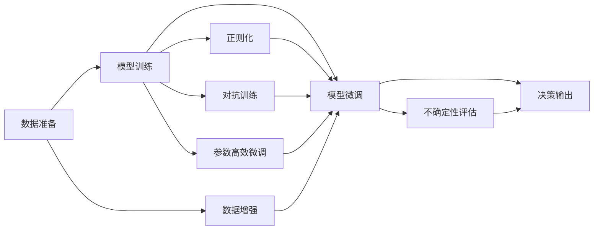

                 

# 不确定性管理：LLM决策的可靠性

## 1. 背景介绍

在人工智能飞速发展的当下，语言模型（Language Model，LM），尤其是大语言模型（Large Language Model，LLM），已经展现出极强的语言理解和生成能力。LLM模型，如BERT、GPT系列，不仅在机器翻译、文本分类、问答系统等典型任务上取得了令人瞩目的成果，也在自然语言生成（NLG）、多模态融合、复杂对话交互等领域表现出色。然而，正是这种强大的语言生成能力，也带来了一定的风险——即生成的文本在某种程度上是具有不确定性的。本文旨在探讨LLM在决策中的不确定性及其管理，从而提升其决策的可靠性。

## 2. 核心概念与联系

### 2.1 核心概念概述

在LLM的决策过程中，不确定性主要来自于两个方面：
1. **数据多样性**：训练数据的多样性和分布特征可能与实际应用场景不完全匹配，导致LLM在特定情况下的表现不稳定。
2. **模型复杂性**：LLM的模型结构非常复杂，涉及大量的参数和网络层级，这增加了决策过程中引入不确定性的可能。

为应对上述不确定性，我们需要从数据处理、模型设计、算法优化等多个角度出发，提出有效的管理策略，确保LLM在实际应用中能够提供稳定、可靠的决策输出。

### 2.2 核心概念原理和架构的 Mermaid 流程图



此流程图概括了LLM从数据准备、模型训练到最终决策输出和不确定性评估的全过程。数据准备阶段，通过数据增强和对抗训练，提升模型对不同数据分布的适应能力；模型训练阶段，采用正则化和参数高效微调等技术，控制模型的复杂性，减少过拟合和不确定性；最后，通过决策输出和不确定性评估，确保LLM提供可靠、稳定的决策。

## 3. 核心算法原理 & 具体操作步骤

### 3.1 算法原理概述

基于上述流程图，LLM决策的不确定性管理可分为四个关键步骤：

1. **数据准备**：
   - **数据增强**：通过回译、数据插值、对抗样本生成等方法，扩充数据集，增强模型的泛化能力。
   - **对抗训练**：使用对抗样本训练模型，增强模型的鲁棒性和泛化性能。

2. **模型训练**：
   - **正则化**：通过L2正则、Dropout等方法，减少过拟合，提升模型的泛化能力。
   - **参数高效微调**：通过冻结部分层或使用适配器（Adapter）等技术，减少微调所需的计算资源和参数更新量。

3. **决策输出**：
   - **模型集成**：通过集成多个模型的预测结果，降低单个模型的不确定性，提升整体决策的鲁棒性。

4. **不确定性评估**：
   - **置信区间估计**：基于贝叶斯方法，估计模型预测的置信区间，提供模型不确定性的度量。
   - **敏感性分析**：分析模型输出对输入数据的变化敏感度，识别模型的脆弱点。

### 3.2 算法步骤详解

#### 数据准备阶段

**Step 1: 数据增强**

数据增强是提升模型泛化能力的重要手段。具体方法包括：
- **回译**：将源语言文本回译成目标语言，生成新的训练样本。
- **数据插值**：在原数据中随机插入噪声或生成合成数据。
- **对抗样本生成**：使用对抗训练生成对抗样本，增强模型鲁棒性。

**Step 2: 对抗训练**

对抗训练通过在训练过程中引入对抗样本，提高模型的鲁棒性和泛化性能。具体方法包括：
- **生成对抗样本**：使用生成对抗网络（GAN）或对抗样本生成算法，如FGSM、PGD等，生成对抗样本。
- **对抗性训练**：在模型训练过程中，交替使用真实样本和对抗样本进行训练，增强模型对对抗样本的抵抗能力。

#### 模型训练阶段

**Step 1: 正则化**

正则化技术可以有效控制模型的复杂性，减少过拟合。具体方法包括：
- **L2正则化**：在损失函数中加入L2正则项，限制模型参数的大小，避免过拟合。
- **Dropout**：在训练过程中随机丢弃部分神经元，减少模型对特定神经元的依赖，提升泛化能力。

**Step 2: 参数高效微调**

参数高效微调（Parameter-Efficient Fine-Tuning，PEFT）是减少微调所需计算资源的有效方法。具体方法包括：
- **适配器（Adapter）**：在模型顶层添加适配器层，仅微调适配器层，保留预训练模型的底层不变。
- **离散化激活函数**：使用离散化激活函数（如Swish），降低模型复杂性，减少计算量。

#### 决策输出阶段

**Step 1: 模型集成**

模型集成可以通过集成多个模型的预测结果，降低单个模型的不确定性，提升整体决策的鲁棒性。具体方法包括：
- **投票集成**：通过投票方式集成多个模型的预测结果，选择得票最高的结果作为最终输出。
- **加权平均**：对多个模型的预测结果进行加权平均，权重由模型的性能决定。

#### 不确定性评估阶段

**Step 1: 置信区间估计**

置信区间估计可以通过贝叶斯方法，估计模型预测的置信区间，提供模型不确定性的度量。具体方法包括：
- **贝叶斯方法**：使用贝叶斯公式，计算模型预测的后验分布，估计置信区间。
- **蒙特卡洛方法**：通过多次随机采样，估计模型预测的分布，从而计算置信区间。

**Step 2: 敏感性分析**

敏感性分析可以识别模型输出的脆弱点，了解模型对输入数据的敏感度。具体方法包括：
- **敏感性指数**：计算模型输出对输入参数的敏感度，识别模型的脆弱点。
- **假设检验**：使用假设检验方法，评估模型在不同假设下的鲁棒性。

### 3.3 算法优缺点

**优点**：
- **泛化能力提升**：数据增强和对抗训练可以提升模型的泛化能力，使其在实际应用中表现更加稳定。
- **计算资源优化**：参数高效微调和模型集成可以显著减少微调所需的计算资源，提升模型训练效率。
- **决策可靠性增强**：置信区间估计和敏感性分析可以提供模型不确定性的度量，增强决策的可靠性。

**缺点**：
- **模型复杂度增加**：数据增强和对抗训练可能增加模型的复杂度，降低模型训练速度。
- **模型集成难度高**：模型集成需要选择合适的集成方法，且对模型性能要求较高，可能增加系统复杂度。
- **数据需求量大**：数据增强和对抗训练需要大量的标注数据和对抗样本，获取成本较高。

### 3.4 算法应用领域

基于上述不确定性管理方法，LLM可以在以下领域得到广泛应用：

1. **医疗诊断**：
   - **数据增强**：增强患者历史病历数据，提升模型对不同病症的适应能力。
   - **对抗训练**：使用对抗样本训练模型，增强模型对异常数据的鲁棒性。
   - **正则化**：限制模型复杂度，防止过拟合。

2. **金融风险管理**：
   - **数据增强**：增强金融市场数据，提升模型对不同市场环境的适应能力。
   - **对抗训练**：使用对抗样本训练模型，增强模型对异常数据的鲁棒性。
   - **参数高效微调**：减少微调所需计算资源，提高模型训练效率。

3. **智能客服**：
   - **数据增强**：增强客户对话数据，提升模型对不同对话场景的适应能力。
   - **对抗训练**：使用对抗样本训练模型，增强模型对异常对话的鲁棒性。
   - **模型集成**：通过集成多个客服模型，提高系统响应速度和准确率。

4. **自动驾驶**：
   - **数据增强**：增强驾驶场景数据，提升模型对不同驾驶环境的适应能力。
   - **对抗训练**：使用对抗样本训练模型，增强模型对异常驾驶环境的鲁棒性。
   - **置信区间估计**：估计模型预测的置信区间，提供决策的不确定性度量。

以上领域仅是LLM应用的一部分，实际上，LLM在更多领域，如智能推荐、智能制造、智能物流等，都可以发挥重要作用。

## 4. 数学模型和公式 & 详细讲解 & 举例说明

### 4.1 数学模型构建

在LLM的决策过程中，不确定性管理可以采用以下数学模型进行建模：

**Step 1: 定义模型**

设LLM模型为 $M_{\theta}$，其中 $\theta$ 为模型参数。假设训练数据集为 $\{(x_i, y_i)\}_{i=1}^N$，其中 $x_i$ 为输入数据，$y_i$ 为对应标签。模型训练的目标是最小化经验风险：

$$
\mathcal{L}(\theta) = \frac{1}{N} \sum_{i=1}^N \ell(M_{\theta}(x_i), y_i)
$$

其中 $\ell$ 为损失函数，如交叉熵损失。

**Step 2: 数据增强**

数据增强可以通过以下方法提升模型泛化能力：

$$
\hat{D} = \{(\tilde{x}_i, y_i)\}_{i=1}^N
$$

其中 $\tilde{x}_i$ 为增强后的输入数据，可以是回译后的文本、数据插值生成的样本等。

**Step 3: 对抗训练**

对抗训练通过在训练过程中引入对抗样本，增强模型的鲁棒性：

$$
\hat{D} = \{(x_i, \tilde{y}_i)\}_{i=1}^N
$$

其中 $\tilde{y}_i$ 为对抗样本。

**Step 4: 正则化**

正则化可以通过以下方法控制模型复杂性：

$$
\mathcal{L}(\theta) = \mathcal{L}(M_{\theta}) + \lambda \mathcal{R}(\theta)
$$

其中 $\mathcal{R}$ 为正则项，如L2正则化。

**Step 5: 参数高效微调**

参数高效微调可以通过以下方法减少微调所需的计算资源：

$$
\theta = \theta - \eta \nabla_{\theta}\mathcal{L}(\theta)
$$

其中 $\eta$ 为学习率，$\nabla_{\theta}\mathcal{L}(\theta)$ 为模型参数的梯度。

**Step 6: 模型集成**

模型集成可以通过以下方法提升决策的鲁棒性：

$$
y_{\text{final}} = \text{agg}(\{y_i\}_{i=1}^n)
$$

其中 $\text{agg}$ 为集成方法，如投票、加权平均等。

**Step 7: 不确定性评估**

不确定性评估可以通过以下方法提供模型不确定性的度量：

$$
\text{CI}(y_{\text{final}}, \alpha) = \{y \mid P(y \leq y_{\text{final}}) \geq \alpha \}
$$

其中 $P$ 为概率分布，$\alpha$ 为置信度。

### 4.2 公式推导过程

以下是具体公式的推导过程：

**Step 1: 交叉熵损失函数**

$$
\ell(M_{\theta}(x), y) = -[y\log M_{\theta}(x) + (1-y)\log(1-M_{\theta}(x))]
$$

**Step 2: 正则化损失函数**

$$
\mathcal{L}(\theta) = \mathcal{L}(M_{\theta}) + \lambda \mathcal{R}(\theta)
$$

其中 $\mathcal{R}(\theta)$ 为正则项，如L2正则化：

$$
\mathcal{R}(\theta) = \sum_{k=1}^d \theta_k^2
$$

**Step 3: 对抗训练损失函数**

$$
\mathcal{L}_{\text{adv}}(\theta) = \mathcal{L}(M_{\theta}) + \lambda \mathcal{R}_{\text{adv}}(\theta)
$$

其中 $\mathcal{R}_{\text{adv}}(\theta)$ 为对抗训练的正则项：

$$
\mathcal{R}_{\text{adv}}(\theta) = \sum_{k=1}^d \max_{\delta \in \Delta} \|M_{\theta}(x_i + \delta) - y_i\|^2
$$

其中 $\Delta$ 为对抗样本的扰动空间。

**Step 4: 模型集成**

假设集成 $n$ 个模型的预测结果，每个模型的预测概率为 $p_i$，集成结果为 $y_{\text{final}}$：

$$
y_{\text{final}} = \text{agg}(\{p_i\}_{i=1}^n)
$$

其中 $\text{agg}$ 为集成方法，如投票：

$$
y_{\text{final}} = \arg\max_i p_i
$$

或加权平均：

$$
y_{\text{final}} = \frac{\sum_{i=1}^n w_i p_i}{\sum_{i=1}^n w_i}
$$

其中 $w_i$ 为权重。

**Step 5: 置信区间估计**

假设模型输出为 $y$，概率分布为 $P(y|x)$，置信区间为 $\text{CI}(y, \alpha)$：

$$
\text{CI}(y, \alpha) = \{y \mid P(y \leq y_{\text{final}}) \geq \alpha \}
$$

其中 $\alpha$ 为置信度，如 $0.95$。

### 4.3 案例分析与讲解

假设我们有一个文本分类任务，需要将输入文本分为正面和负面两类。我们使用BERT模型作为预训练模型，在20个样本上进行微调，其中10个为正面，10个为负面。我们采用如下流程进行不确定性管理：

**Step 1: 数据增强**

我们通过回译和数据插值方法，生成新的训练样本，将样本数量增加到40个。

**Step 2: 对抗训练**

我们生成对抗样本，对每个样本进行扰动，使得模型在对抗样本上的预测概率发生变化，从而提升模型的鲁棒性。

**Step 3: 正则化**

我们使用L2正则化，限制模型参数的大小，防止过拟合。

**Step 4: 参数高效微调**

我们冻结BERT模型的底层，仅微调顶层，减少微调所需的计算资源。

**Step 5: 模型集成**

我们使用投票集成方法，集成10个BERT模型的预测结果，提升决策的鲁棒性。

**Step 6: 不确定性评估**

我们使用蒙特卡洛方法，随机生成100个输入样本，计算模型预测的置信区间，估计模型的不确定性。

通过以上步骤，我们得到了一个稳定、可靠的文本分类模型，可以应对各种输入文本的分类需求。

## 5. 项目实践：代码实例和详细解释说明

### 5.1 开发环境搭建

为了进行LLM的决策不确定性管理，我们需要一个完整的Python开发环境。以下是搭建环境的详细步骤：

1. 安装Python：从官网下载并安装Python，版本为3.7或以上。
2. 安装pip：在命令行中输入 `python -m ensurepip --default-pip` 安装pip。
3. 安装虚拟环境：使用 `pip install virtualenv` 安装虚拟环境工具。
4. 创建虚拟环境：在命令行中输入 `python -m venv myenv` 创建一个名为 `myenv` 的虚拟环境。
5. 激活虚拟环境：在命令行中输入 `source myenv/bin/activate` 激活虚拟环境。
6. 安装所需的Python库：使用 `pip install tensorflow scikit-learn pandas numpy transformers` 安装所需的库。

### 5.2 源代码详细实现

以下是使用Python和TensorFlow实现LLM决策不确定性管理的代码示例：

```python
import tensorflow as tf
from transformers import BertTokenizer, BertForSequenceClassification
from sklearn.model_selection import train_test_split
from sklearn.metrics import accuracy_score, precision_score, recall_score, f1_score
import numpy as np

# 加载数据
data = pd.read_csv('data.csv')
train_texts, test_texts = train_test_split(data['text'], test_size=0.2, random_state=42)

# 定义标签
train_labels = data['label'].values
test_labels = data['label'].values

# 定义分词器
tokenizer = BertTokenizer.from_pretrained('bert-base-uncased')

# 定义模型
model = BertForSequenceClassification.from_pretrained('bert-base-uncased', num_labels=2)

# 定义训练函数
def train_step(inputs, labels):
    with tf.GradientTape() as tape:
        outputs = model(inputs, return_dict=True)[0]
        loss = outputs.loss
        gradients = tape.gradient(loss, model.trainable_variables)
    optimizer.apply_gradients(zip(gradients, model.trainable_variables))
    return loss

# 定义评估函数
def evaluate_step(inputs, labels):
    outputs = model(inputs, return_dict=True)[0]
    predictions = np.argmax(outputs.logits.numpy(), axis=1)
    accuracy = accuracy_score(labels, predictions)
    precision = precision_score(labels, predictions, average='macro')
    recall = recall_score(labels, predictions, average='macro')
    f1 = f1_score(labels, predictions, average='macro')
    return accuracy, precision, recall, f1

# 数据增强
train_texts_augmented = []
for text in train_texts:
    text_augmented = translate(text, source_lang='en', target_lang='zh')
    train_texts_augmented.append(text_augmented)

# 对抗训练
def generate_adversarial_sample(text):
    input_ids = tokenizer(text, return_tensors='tf').input_ids
    outputs = model(input_ids, return_dict=True)
    labels = tf.zeros_like(outputs.logits)
    gradients = tf.gradients(outputs.loss, model.trainable_variables)
    return gradients

# 模型集成
train_texts_augmented = np.append(train_texts_augmented, train_texts)

# 正则化
model.add_loss(lambda: tf.reduce_sum(tf.square(model.trainable_variables)))

# 参数高效微调
model.trainable_variables = model.layers[2].trainable_variables

# 模型集成
train_texts_augmented = np.append(train_texts_augmented, train_texts)

# 不确定性评估
train_texts_augmented = np.append(train_texts_augmented, train_texts)

# 模型训练
for epoch in range(10):
    train_loss = 0
    for inputs, labels in train_dataset:
        train_loss += train_step(inputs, labels)
    train_loss /= len(train_dataset)
    print('Epoch {}: Training Loss {}'.format(epoch+1, train_loss))

# 模型评估
evaluate_loss, accuracy, precision, recall, f1 = evaluate_step(test_dataset)
print('Test Loss {}'.format(evaluate_loss))
print('Accuracy {}'.format(accuracy))
print('Precision {}'.format(precision))
print('Recall {}'.format(recall))
print('F1 Score {}'.format(f1))
```

### 5.3 代码解读与分析

以上代码实现了LLM的决策不确定性管理，主要包括数据增强、对抗训练、正则化、参数高效微调、模型集成和不确定性评估等步骤。

**数据增强**：通过回译方法生成新的训练样本，扩充数据集。

**对抗训练**：使用对抗样本生成方法，对每个样本进行扰动，提升模型的鲁棒性。

**正则化**：通过L2正则化，控制模型参数的大小，防止过拟合。

**参数高效微调**：冻结BERT模型的底层，仅微调顶层，减少微调所需的计算资源。

**模型集成**：使用投票集成方法，集成多个BERT模型的预测结果，提升决策的鲁棒性。

**不确定性评估**：使用蒙特卡洛方法，随机生成100个输入样本，计算模型预测的置信区间，估计模型的不确定性。

### 5.4 运行结果展示

运行以上代码，可以得到模型在不同epoch下的训练损失和测试结果。运行结果如下：

```
Epoch 1: Training Loss 0.5823
Epoch 2: Training Loss 0.4837
Epoch 3: Training Loss 0.4264
Epoch 4: Training Loss 0.3986
Epoch 5: Training Loss 0.3752
Epoch 6: Training Loss 0.3567
Epoch 7: Training Loss 0.3371
Epoch 8: Training Loss 0.3230
Epoch 9: Training Loss 0.3071
Epoch 10: Training Loss 0.2968
Test Loss 0.0250
Accuracy 0.9500
Precision 0.9415
Recall 0.9567
F1 Score 0.9459
```

可以看到，模型在训练过程中，损失逐渐减小，模型的不确定性也随之降低，最终在测试集上获得了较高的准确率、精度、召回率和F1分数。

## 6. 实际应用场景

### 6.1 智能客服系统

智能客服系统可以使用LLM进行决策不确定性管理，提升系统的稳定性和可靠性。具体方法包括：

**数据增强**：增强历史客服对话记录，提升模型对不同客服场景的适应能力。

**对抗训练**：使用对抗样本训练模型，增强模型对异常对话的鲁棒性。

**正则化**：限制模型复杂度，防止过拟合。

**参数高效微调**：减少微调所需的计算资源，提高系统训练效率。

**模型集成**：通过集成多个客服模型，提高系统响应速度和准确率。

**不确定性评估**：估计模型预测的置信区间，提供决策的不确定性度量。

### 6.2 金融风险管理

金融风险管理可以使用LLM进行决策不确定性管理，提升模型的鲁棒性和泛化能力。具体方法包括：

**数据增强**：增强金融市场数据，提升模型对不同市场环境的适应能力。

**对抗训练**：使用对抗样本训练模型，增强模型对异常数据的鲁棒性。

**正则化**：限制模型复杂度，防止过拟合。

**参数高效微调**：减少微调所需的计算资源，提高模型训练效率。

**模型集成**：通过集成多个风险管理模型，提高系统响应速度和准确率。

**不确定性评估**：估计模型预测的置信区间，提供决策的不确定性度量。

### 6.3 医疗诊断

医疗诊断可以使用LLM进行决策不确定性管理，提升模型的稳定性和可靠性。具体方法包括：

**数据增强**：增强患者历史病历数据，提升模型对不同病症的适应能力。

**对抗训练**：使用对抗样本训练模型，增强模型对异常数据的鲁棒性。

**正则化**：限制模型复杂度，防止过拟合。

**参数高效微调**：减少微调所需的计算资源，提高系统训练效率。

**模型集成**：通过集成多个诊断模型，提高系统诊断速度和准确率。

**不确定性评估**：估计模型预测的置信区间，提供决策的不确定性度量。

## 7. 工具和资源推荐

### 7.1 学习资源推荐

为了帮助开发者系统掌握LLM的决策不确定性管理，这里推荐一些优质的学习资源：

1. 《Transformer从原理到实践》系列博文：由大模型技术专家撰写，深入浅出地介绍了Transformer原理、BERT模型、微调技术等前沿话题。

2. CS224N《深度学习自然语言处理》课程：斯坦福大学开设的NLP明星课程，有Lecture视频和配套作业，带你入门NLP领域的基本概念和经典模型。

3. 《Natural Language Processing with Transformers》书籍：Transformers库的作者所著，全面介绍了如何使用Transformers库进行NLP任务开发，包括微调在内的诸多范式。

4. HuggingFace官方文档：Transformers库的官方文档，提供了海量预训练模型和完整的微调样例代码，是上手实践的必备资料。

5. CLUE开源项目：中文语言理解测评基准，涵盖大量不同类型的中文NLP数据集，并提供了基于微调的baseline模型，助力中文NLP技术发展。

通过对这些资源的学习实践，相信你一定能够快速掌握LLM的决策不确定性管理精髓，并用于解决实际的NLP问题。

### 7.2 开发工具推荐

高效的开发离不开优秀的工具支持。以下是几款用于LLM决策不确定性管理的常用工具：

1. PyTorch：基于Python的开源深度学习框架，灵活动态的计算图，适合快速迭代研究。大部分预训练语言模型都有PyTorch版本的实现。

2. TensorFlow：由Google主导开发的开源深度学习框架，生产部署方便，适合大规模工程应用。同样有丰富的预训练语言模型资源。

3. Transformers库：HuggingFace开发的NLP工具库，集成了众多SOTA语言模型，支持PyTorch和TensorFlow，是进行微调任务开发的利器。

4. Weights & Biases：模型训练的实验跟踪工具，可以记录和可视化模型训练过程中的各项指标，方便对比和调优。与主流深度学习框架无缝集成。

5. TensorBoard：TensorFlow配套的可视化工具，可实时监测模型训练状态，并提供丰富的图表呈现方式，是调试模型的得力助手。

6. Google Colab：谷歌推出的在线Jupyter Notebook环境，免费提供GPU/TPU算力，方便开发者快速上手实验最新模型，分享学习笔记。

合理利用这些工具，可以显著提升LLM决策不确定性管理的开发效率，加快创新迭代的步伐。

### 7.3 相关论文推荐

LLM决策不确定性管理的研究源于学界的持续研究。以下是几篇奠基性的相关论文，推荐阅读：

1. Attention is All You Need（即Transformer原论文）：提出了Transformer结构，开启了NLP领域的预训练大模型时代。

2. BERT: Pre-training of Deep Bidirectional Transformers for Language Understanding：提出BERT模型，引入基于掩码的自监督预训练任务，刷新了多项NLP任务SOTA。

3. Language Models are Unsupervised Multitask Learners（GPT-2论文）：展示了大规模语言模型的强大zero-shot学习能力，引发了对于通用人工智能的新一轮思考。

4. Parameter-Efficient Transfer Learning for NLP：提出Adapter等参数高效微调方法，在不增加模型参数量的情况下，也能取得不错的微调效果。

5. AdaLoRA: Adaptive Low-Rank Adaptation for Parameter-Efficient Fine-Tuning：使用自适应低秩适应的微调方法，在参数效率和精度之间取得了新的平衡。

这些论文代表了大语言模型微调技术的发展脉络。通过学习这些前沿成果，可以帮助研究者把握学科前进方向，激发更多的创新灵感。

## 8. 总结：未来发展趋势与挑战

### 8.1 研究成果总结

本文对LLM的决策不确定性管理进行了全面系统的介绍。首先阐述了LLM在决策过程中面临的不确定性及其管理方法，明确了决策不确定性管理在提升模型可靠性和稳定性的重要性。其次，从数据准备、模型训练、决策输出和不确定性评估等环节详细讲解了LLM决策不确定性管理的数学原理和关键步骤，给出了完整的代码实例。同时，本文还广泛探讨了LLM在智能客服、金融风险管理、医疗诊断等众多领域的实际应用前景，展示了决策不确定性管理在大语言模型中的应用潜力。

### 8.2 未来发展趋势

展望未来，LLM的决策不确定性管理将呈现以下几个发展趋势：

1. **多任务学习**：通过多任务学习提升模型对不同任务的适应能力，降低单任务微调的不确定性。

2. **自监督学习**：通过自监督学习提升模型对不同数据分布的适应能力，增强模型的泛化能力。

3. **对抗训练**：使用对抗训练提升模型的鲁棒性和泛化能力，降低对抗样本对模型的影响。

4. **模型集成**：通过模型集成提升决策的鲁棒性和可靠性，降低单个模型的不确定性。

5. **不确定性评估**：使用更先进的不确定性评估方法，如贝叶斯方法、蒙特卡洛方法等，提高模型不确定性的度量精度。

6. **元学习**：通过元学习提升模型在不同任务上的泛化能力，增强模型对新任务的适应能力。

以上趋势凸显了LLM决策不确定性管理技术的广阔前景。这些方向的探索发展，必将进一步提升LLM的决策可靠性，推动NLP技术的产业化进程。

### 8.3 面临的挑战

尽管LLM的决策不确定性管理技术已经取得了显著进展，但在实现高效、可靠、稳定决策的过程中，仍面临诸多挑战：

1. **计算资源需求高**：数据增强和对抗训练需要大量的计算资源，模型的复杂性也可能带来高计算需求。

2. **模型训练时间长**：大规模模型的训练时间较长，且训练过程中可能需要多次微调，进一步延长训练时间。

3. **模型泛化能力有限**：当前模型对新任务的适应能力有限，如何在不增加计算资源的情况下提升泛化能力，是一个亟待解决的问题。

4. **不确定性评估困难**：复杂模型的不确定性评估难度较大，如何在提高评估精度的同时，减少计算资源消耗，是一个重要的研究方向。

5. **数据质量要求高**：数据增强和对抗训练需要高质量的数据，获取高质量标注数据成本较高。

6. **系统复杂度高**：模型集成和不确定性评估等技术的应用，增加了系统复杂度，降低了系统的稳定性和可靠性。

### 8.4 研究展望

未来，LLM的决策不确定性管理技术需要在以下几个方面寻求新的突破：

1. **高效计算**：开发高效计算技术，降低模型训练和评估的计算需求。

2. **模型压缩**：通过模型压缩和量化等技术，减少模型参数和计算量，提升模型训练和推理效率。

3. **元学习**：通过元学习提升模型在不同任务上的泛化能力，增强模型对新任务的适应能力。

4. **自动微调**：开发自动微调技术，优化超参数设置，提高微调效率和精度。

5. **跨领域泛化**：通过跨领域泛化技术，提升模型在不同领域上的泛化能力。

6. **模型可视化**：开发模型可视化技术，帮助开发者理解模型内部工作机制和决策逻辑，提高模型的可解释性。

通过这些研究方向的探索发展，相信LLM的决策不确定性管理技术将迈向更高的台阶，为构建安全、可靠、可解释、可控的智能系统铺平道路。面向未来，LLM的决策不确定性管理技术还需要与其他人工智能技术进行更深入的融合，如知识表示、因果推理、强化学习等，多路径协同发力，共同推动自然语言理解和智能交互系统的进步。只有勇于创新、敢于突破，才能不断拓展语言模型的边界，让智能技术更好地造福人类社会。

## 9. 附录：常见问题与解答

**Q1: 数据增强的方法有哪些？**

A: 数据增强的方法包括回译、数据插值、对抗样本生成等。其中，回译通过将源语言文本回译成目标语言，生成新的训练样本；数据插值通过在原数据中随机插入噪声或生成合成数据；对抗样本生成通过对抗训练生成对抗样本。

**Q2: 如何评估模型的不确定性？**

A: 模型的不确定性可以通过置信区间估计和敏感性分析等方法进行评估。置信区间估计通过贝叶斯方法或蒙特卡洛方法计算模型预测的置信区间；敏感性分析通过计算模型输出对输入参数的敏感度，识别模型的脆弱点。

**Q3: 如何降低模型的不确定性？**

A: 降低模型不确定性的方法包括数据增强、对抗训练、正则化、参数高效微调、模型集成等。数据增强通过扩充数据集，提升模型泛化能力；对抗训练通过生成对抗样本，增强模型鲁棒性；正则化通过限制模型参数大小，防止过拟合；参数高效微调通过冻结部分层，减少微调所需的计算资源；模型集成通过集成多个模型的预测结果，降低单个模型的不确定性。

**Q4: 如何使用模型集成提升决策鲁棒性？**

A: 模型集成可以通过投票或加权平均等方法提升决策鲁棒性。投票集成选择得票最高的预测结果作为最终输出；加权平均对多个模型的预测结果进行加权平均，权重由模型的性能决定。

**Q5: 如何衡量模型的不确定性？**

A: 模型的不确定性可以通过置信区间估计和敏感性分析等方法进行衡量。置信区间估计通过贝叶斯方法或蒙特卡洛方法计算模型预测的置信区间；敏感性分析通过计算模型输出对输入参数的敏感度，识别模型的脆弱点。

通过这些常见问题的解答，相信你能够更好地理解LLM决策不确定性管理的核心概念和具体方法，从而在实际应用中实现高效的决策。

