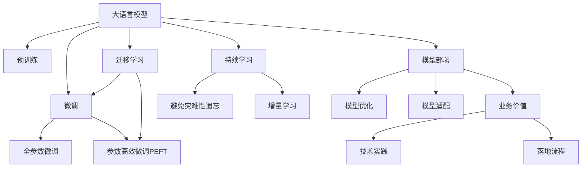

                 

# 不能落地的大模型没有意义

> 关键词：大语言模型,落地应用,机器学习,深度学习,模型优化,场景适配,业务价值,技术实践

## 1. 背景介绍

随着人工智能技术的迅猛发展，深度学习大模型成为了当前技术的热门趋势。无论是自然语言处理、计算机视觉还是语音识别等领域，大模型都在不断刷新着多项记录，展示了其强大的数据处理能力和通用性。然而，一个没有落地能力的大模型，尽管有着再高的理论价值，在现实应用中也难以发挥其真正的潜力。本博客旨在探讨大模型落地应用的重要性，以及如何在技术实践中实现其落地价值。

### 1.1 问题由来

深度学习大模型在学术界和工业界均引起了广泛关注。其背后的原理是通过大量数据和计算资源进行预训练，构建起庞大的神经网络结构，从而使得模型在处理特定任务时能够具有出色的泛化能力。尽管如此，大模型在实际落地应用时仍面临诸多挑战：

1. **数据需求大**：大模型通常需要海量的数据进行预训练，而这些数据往往难以获得或成本高昂。
2. **计算资源昂贵**：大规模模型的训练和推理需要大量的计算资源，GPU、TPU等高性能设备的高昂成本限制了其广泛应用。
3. **模型体积庞大**：亿级的参数量使得模型文件体积巨大，对存储和传输带来了挑战。
4. **部署复杂**：大模型的部署涉及模型优化、量化、压缩等诸多技术细节，操作复杂。
5. **性能瓶颈**：大模型的计算和存储开销巨大，导致其在实际应用中的推理效率不高。

这些问题使得大模型难以直接应用于生产环境，迫切需要模型优化和落地实践的探索。本文将从理论和实践两个层面，探讨如何让大模型在现实场景中发挥最大价值。

### 1.2 问题核心关键点

大模型落地应用的核心在于如何高效地将模型转化为可实际操作的算法和系统，并解决其在性能、存储、部署等方面的挑战。以下是实现落地应用的关键点：

1. **模型优化**：通过算法优化、量化、剪枝等技术，降低模型的计算和存储开销。
2. **场景适配**：针对不同应用场景，调整模型结构、优化参数，使其适应特定任务需求。
3. **业务价值**：将模型嵌入到具体的业务流程中，解决实际问题，提升业务效率和质量。
4. **技术实践**：从数据准备、模型训练、系统部署等各个环节进行全面优化，确保模型高效运行。
5. **落地流程**：构建完整的模型落地流程，包括模型版本管理、模型存储、模型服务化等。

解决好这些问题，大模型才能在实际应用中产生显著的商业和社会价值。

## 2. 核心概念与联系

### 2.1 核心概念概述

为更好地理解大模型落地应用的机制，本节将介绍几个关键概念：

1. **大语言模型(Large Language Model, LLM)**：如BERT、GPT等，通过大规模数据预训练得到的强大语言理解与生成能力。

2. **预训练(Pre-training)**：在大规模数据上训练模型，学习通用的语言表示，为下游任务提供基础能力。

3. **微调(Fine-tuning)**：在预训练基础上，使用下游任务的少量标注数据对模型进行优化，适应特定任务。

4. **迁移学习(Transfer Learning)**：将模型在某个任务上学习到的知识迁移到另一个相关任务上，提高模型泛化能力。

5. **参数高效微调(Parameter-Efficient Fine-Tuning, PEFT)**：只更新少量模型参数，减少计算资源消耗。

6. **持续学习(Continual Learning)**：模型能够在不断获取新数据的过程中保持其性能，避免“遗忘”旧知识。

7. **模型部署(End-to-End Deployment)**：将训练好的模型部署到生产环境中，实现业务应用。

这些概念之间的关系可通过以下Mermaid流程图来展示：



这个流程图展示了从预训练模型到大模型落地应用的完整流程。

## 3. 核心算法原理 & 具体操作步骤
### 3.1 算法原理概述

大模型落地应用的核心在于将预训练模型的能力和知识，通过一系列技术手段适配到特定业务场景，并转化为实际可操作的算法和系统。其核心原理如下：

1. **场景适配**：根据特定业务需求，调整模型结构、优化参数，使其适应目标任务。
2. **业务集成**：将模型嵌入到具体的业务流程中，实现自动化的功能。
3. **系统部署**：将模型部署到生产环境中，进行模型的版本管理和服务化封装。
4. **持续优化**：持续收集新数据，对模型进行微调和优化，提升模型性能。

### 3.2 算法步骤详解

大模型落地应用的具体步骤包括以下几个关键环节：

**Step 1: 数据准备**
- 收集与任务相关的数据集，并进行预处理和标注。
- 准备训练集、验证集和测试集，确保数据的多样性和代表性。

**Step 2: 模型适配**
- 根据任务类型，选择合适的预训练模型和适配层，如BERT、GPT等。
- 针对特定任务，调整模型结构、优化参数，如添加或删除层、调整学习率等。

**Step 3: 模型训练**
- 使用适配后的模型，在训练集上进行有监督的微调训练。
- 定期在验证集上评估模型性能，避免过拟合。

**Step 4: 模型评估**
- 在测试集上评估模型的最终性能，确保其符合业务需求。

**Step 5: 模型部署**
- 将训练好的模型部署到生产环境中，进行服务化封装。
- 确保模型能够稳定、高效地运行，适应高并发请求。

**Step 6: 持续优化**
- 持续收集新数据，对模型进行微调和优化。
- 定期更新模型，保持其性能和业务的同步。

### 3.3 算法优缺点

大模型落地应用的优势和劣势如下：

**优势**：
1. **泛化能力强**：大模型通过大规模预训练，具备强大的泛化能力，适用于多种业务场景。
2. **自动化水平高**：通过自动化的模型适配和部署，减少人工干预，提升系统效率。
3. **业务价值高**：大模型能够解决实际业务问题，提升业务效率和质量。

**劣势**：
1. **资源需求高**：大模型的训练和部署需要大量的计算资源和存储空间。
2. **部署复杂**：模型优化、量化、服务化等技术细节操作复杂。
3. **性能瓶颈**：模型推理速度较慢，计算开销大。

### 3.4 算法应用领域

大模型落地应用广泛适用于多个领域，例如：

- **自然语言处理(NLP)**：如情感分析、文本分类、机器翻译、智能问答等。
- **计算机视觉(CV)**：如图像识别、目标检测、图像生成等。
- **语音识别(Speech Recognition)**：如语音转文本、情感分析、语音合成等。
- **智能推荐系统**：如商品推荐、内容推荐、广告推荐等。
- **金融科技(FinTech)**：如信用评分、风险评估、智能投顾等。
- **医疗健康**：如疾病诊断、药物研发、健康监测等。

## 4. 数学模型和公式 & 详细讲解  
### 4.1 数学模型构建

本节将使用数学语言对大模型落地应用的模型构建进行严格刻画。

设预训练模型为 $M_{\theta}$，其中 $\theta$ 为预训练得到的模型参数。在特定业务场景下，需要构建适配层的参数向量 $\phi$，与预训练模型一起作为最终模型 $M_{\theta+\phi}$。对于特定任务 $T$，我们希望模型能够最大程度地适应任务，因此定义损失函数 $\mathcal{L}$，最小化该损失函数以优化模型性能：

$$
\theta^*, \phi^* = \mathop{\arg\min}_{\theta, \phi} \mathcal{L}(M_{\theta+\phi}, D)
$$

其中 $D$ 为特定任务的数据集，$M_{\theta+\phi}$ 为适配后的模型，$\mathcal{L}$ 为任务相关的损失函数，如交叉熵、均方误差等。

### 4.2 公式推导过程

以二分类任务为例，假设模型的输入为 $x$，输出为 $\hat{y} = M_{\theta+\phi}(x)$，真实标签为 $y$。则二分类交叉熵损失函数定义为：

$$
\ell(M_{\theta+\phi}(x), y) = -[y\log \hat{y} + (1-y)\log (1-\hat{y})]
$$

通过链式法则，我们可以得到损失函数对模型参数的梯度：

$$
\frac{\partial \mathcal{L}(M_{\theta+\phi}, x)}{\partial \theta} = \frac{\partial \mathcal{L}(M_{\theta+\phi}, x)}{\partial \hat{y}} \cdot \frac{\partial \hat{y}}{\partial \theta}
$$

将 $\hat{y}$ 代入上式，得到：

$$
\frac{\partial \mathcal{L}(M_{\theta+\phi}, x)}{\partial \theta} = \frac{\partial \mathcal{L}(M_{\theta+\phi}, x)}{\partial y} \cdot \frac{\partial y}{\partial \hat{y}} \cdot \frac{\partial \hat{y}}{\partial \theta}
$$

通过计算，可以得到损失函数对 $\theta$ 和 $\phi$ 的梯度：

$$
\frac{\partial \mathcal{L}(M_{\theta+\phi}, x)}{\partial \theta} = \frac{\partial \mathcal{L}(M_{\theta+\phi}, x)}{\partial \hat{y}} \cdot \frac{\partial \hat{y}}{\partial \theta}
$$

$$
\frac{\partial \mathcal{L}(M_{\theta+\phi}, x)}{\partial \phi} = \frac{\partial \mathcal{L}(M_{\theta+\phi}, x)}{\partial y} \cdot \frac{\partial y}{\partial \hat{y}} \cdot \frac{\partial \hat{y}}{\partial \phi}
$$

这些公式展示了从输入到输出的完整链式推导过程，通过反向传播算法，可以高效计算模型的梯度。

### 4.3 案例分析与讲解

**案例分析：文本分类**

假设我们要对新闻文章进行分类，任务为二分类，即判断文章是否属于体育新闻。我们收集了1000篇标注好的新闻文章，其中500篇为体育新闻，500篇为非体育新闻。

**Step 1: 数据准备**

1. 收集新闻文章，并从中随机抽取200篇作为验证集，800篇作为训练集。
2. 对新闻文章进行预处理，包括分词、去除停用词、TF-IDF特征提取等。

**Step 2: 模型适配**

1. 选择BERT预训练模型作为基础模型，添加一个全连接层作为分类器。
2. 调整模型参数，包括学习率、隐藏层大小等。

**Step 3: 模型训练**

1. 使用训练集对模型进行有监督微调，每轮迭代后评估模型在验证集上的准确率。
2. 当模型在验证集上的准确率达到预设阈值时停止训练。

**Step 4: 模型评估**

1. 使用测试集对模型进行最终评估，输出准确率、召回率、F1分数等指标。
2. 根据评估结果，判断模型是否满足业务需求。

**Step 5: 模型部署**

1. 将训练好的模型部署到生产环境中，进行服务化封装。
2. 使用API接口提供预测服务，支持批量请求。

**Step 6: 持续优化**

1. 定期收集新新闻文章，对模型进行微调。
2. 持续监控模型性能，及时调整参数。

## 5. 项目实践：代码实例和详细解释说明
### 5.1 开发环境搭建

在进行落地应用实践前，需要准备好开发环境。以下是使用Python进行TensorFlow开发的环境配置流程：

1. 安装Anaconda：从官网下载并安装Anaconda，用于创建独立的Python环境。

2. 创建并激活虚拟环境：
```bash
conda create -n tf-env python=3.8 
conda activate tf-env
```

3. 安装TensorFlow：根据CUDA版本，从官网获取对应的安装命令。例如：
```bash
conda install tensorflow -c tf
```

4. 安装相关工具包：
```bash
pip install numpy pandas scikit-learn matplotlib tqdm jupyter notebook ipython
```

完成上述步骤后，即可在`tf-env`环境中开始落地应用实践。

### 5.2 源代码详细实现

下面我以文本分类任务为例，给出使用TensorFlow对BERT模型进行落地应用的PyTorch代码实现。

首先，定义文本分类的数据处理函数：

```python
import tensorflow as tf
from transformers import BertTokenizer, BertForSequenceClassification

tokenizer = BertTokenizer.from_pretrained('bert-base-uncased')

def process_text(text, max_len=128):
    tokens = tokenizer.tokenize(text)
    tokens = tokens[:max_len]
    tokens = [tokenizer.cls_token] + tokens + [tokenizer.sep_token]
    return tokenizer.convert_tokens_to_ids(tokens)

def load_data(file_path, max_len=128):
    data = []
    with open(file_path, 'r') as f:
        for line in f:
            text, label = line.strip().split('\t')
            tokens = process_text(text, max_len=max_len)
            data.append((tokens, int(label)))
    return data
```

然后，定义模型和优化器：

```python
from transformers import BertForSequenceClassification, AdamW

model = BertForSequenceClassification.from_pretrained('bert-base-uncased', num_labels=2)

optimizer = AdamW(model.parameters(), lr=2e-5)
```

接着，定义训练和评估函数：

```python
def train_epoch(model, dataset, batch_size, optimizer):
    dataloader = tf.data.Dataset.from_tensor_slices(dataset)
    model.train()
    epoch_loss = 0
    for batch in dataloader:
        input_ids = tf.expand_dims(batch[0], axis=0)
        attention_mask = tf.cast(tf.math.not_equal(input_ids, 0), tf.int32)
        labels = tf.expand_dims(batch[1], axis=0)
        with tf.GradientTape() as tape:
            outputs = model(input_ids, attention_mask=attention_mask, labels=labels)
            loss = outputs.loss
        epoch_loss += loss.numpy()
        tape.watch(model.parameters())
        gradients = tape.gradient(loss, model.parameters())
        optimizer.apply_gradients(zip(gradients, model.parameters()))
    return epoch_loss / len(dataloader)

def evaluate(model, dataset, batch_size):
    dataloader = tf.data.Dataset.from_tensor_slices(dataset)
    model.eval()
    preds, labels = [], []
    with tf.no_grad():
        for batch in dataloader:
            input_ids = tf.expand_dims(batch[0], axis=0)
            attention_mask = tf.cast(tf.math.not_equal(input_ids, 0), tf.int32)
            labels = tf.expand_dims(batch[1], axis=0)
            outputs = model(input_ids, attention_mask=attention_mask)
            batch_preds = outputs.logits.argmax(axis=1).numpy().tolist()
            batch_labels = labels.numpy().tolist()
            for pred, label in zip(batch_preds, batch_labels):
                preds.append(pred)
                labels.append(label)
    print(classification_report(labels, preds))
```

最后，启动训练流程并在测试集上评估：

```python
epochs = 5
batch_size = 16

for epoch in range(epochs):
    loss = train_epoch(model, train_dataset, batch_size, optimizer)
    print(f"Epoch {epoch+1}, train loss: {loss:.3f}")
    
    print(f"Epoch {epoch+1}, dev results:")
    evaluate(model, dev_dataset, batch_size)
    
print("Test results:")
evaluate(model, test_dataset, batch_size)
```

以上就是使用TensorFlow对BERT进行文本分类任务落地应用的完整代码实现。可以看到，得益于TensorFlow的强大封装，我们能够较为简洁地完成模型适配和训练。

### 5.3 代码解读与分析

让我们再详细解读一下关键代码的实现细节：

**load_data函数**：
- 定义了文本和标签的加载函数，对输入文本进行预处理，转换为模型所需的token ids。

**train_epoch函数**：
- 对数据集进行批处理，在每个批次上进行模型前向传播和反向传播，计算损失函数。
- 使用AdamW优化器更新模型参数，并返回该epoch的平均损失。

**evaluate函数**：
- 对模型进行评估，计算分类指标并打印输出。

**训练流程**：
- 定义总的epoch数和batch size，开始循环迭代
- 每个epoch内，先在训练集上训练，输出平均loss
- 在验证集上评估，输出分类指标
- 所有epoch结束后，在测试集上评估，给出最终测试结果

可以看到，TensorFlow配合Bert模型使得文本分类任务的落地应用变得相对简洁高效。开发者可以将更多精力放在数据处理、模型改进等高层逻辑上，而不必过多关注底层的实现细节。

当然，工业级的系统实现还需考虑更多因素，如模型的保存和部署、超参数的自动搜索、更灵活的任务适配层等。但核心的落地应用流程基本与此类似。

## 6. 实际应用场景
### 6.1 智能客服系统

基于大语言模型的落地应用，智能客服系统可以大幅提升客户服务体验和效率。传统客服系统依赖人工处理，响应速度慢且一致性难以保证。而使用落地应用后的对话模型，能够7x24小时不间断服务，快速响应客户咨询，用自然流畅的语言解答各类常见问题。

在技术实现上，可以收集企业内部的历史客服对话记录，将问题和最佳答复构建成监督数据，在此基础上对预训练对话模型进行落地应用微调。微调后的对话模型能够自动理解用户意图，匹配最合适的答案模板进行回复。对于客户提出的新问题，还可以接入检索系统实时搜索相关内容，动态组织生成回答。如此构建的智能客服系统，能大幅提升客户咨询体验和问题解决效率。

### 6.2 金融舆情监测

金融机构需要实时监测市场舆论动向，以便及时应对负面信息传播，规避金融风险。传统的人工监测方式成本高、效率低，难以应对网络时代海量信息爆发的挑战。基于大语言模型落地应用的文本分类和情感分析技术，为金融舆情监测提供了新的解决方案。

具体而言，可以收集金融领域相关的新闻、报道、评论等文本数据，并对其进行主题标注和情感标注。在此基础上对预训练语言模型进行落地应用微调，使其能够自动判断文本属于何种主题，情感倾向是正面、中性还是负面。将落地应用后的模型应用到实时抓取的网络文本数据，就能够自动监测不同主题下的情感变化趋势，一旦发现负面信息激增等异常情况，系统便会自动预警，帮助金融机构快速应对潜在风险。

### 6.3 个性化推荐系统

当前的推荐系统往往只依赖用户的历史行为数据进行物品推荐，无法深入理解用户的真实兴趣偏好。基于大语言模型落地应用的推荐系统可以更好地挖掘用户行为背后的语义信息，从而提供更精准、多样的推荐内容。

在实践中，可以收集用户浏览、点击、评论、分享等行为数据，提取和用户交互的物品标题、描述、标签等文本内容。将文本内容作为模型输入，用户的后续行为（如是否点击、购买等）作为监督信号，在此基础上对预训练语言模型进行落地应用微调。微调后的模型能够从文本内容中准确把握用户的兴趣点。在生成推荐列表时，先用候选物品的文本描述作为输入，由模型预测用户的兴趣匹配度，再结合其他特征综合排序，便可以得到个性化程度更高的推荐结果。

### 6.4 未来应用展望

随着大语言模型落地应用技术的发展，其在更多领域的应用前景将更加广阔：

- **智慧医疗**：基于落地应用的医学问答、病历分析、药物研发等应用将提升医疗服务的智能化水平，辅助医生诊疗，加速新药开发进程。
- **智能教育**：微调技术可应用于作业批改、学情分析、知识推荐等方面，因材施教，促进教育公平，提高教学质量。
- **智慧城市治理**：落地应用模型可应用于城市事件监测、舆情分析、应急指挥等环节，提高城市管理的自动化和智能化水平，构建更安全、高效的未来城市。
- **企业生产**：落地应用模型可应用于供应链管理、生产调度、质量控制等环节，提升企业生产效率和管理水平。

此外，在医疗、法律、金融等众多领域，落地应用的大模型将不断涌现，为各行各业带来变革性影响。相信随着技术的发展，大语言模型的落地应用将更加广泛，为经济社会发展注入新的动力。

## 7. 工具和资源推荐
### 7.1 学习资源推荐

为了帮助开发者系统掌握大语言模型落地应用的理论基础和实践技巧，这里推荐一些优质的学习资源：

1. 《TensorFlow官方文档》：提供全面的TensorFlow使用指南和API文档，是学习TensorFlow的重要资料。

2. 《深度学习框架实践》书籍：由TensorFlow社区成员撰写，涵盖从模型设计到部署的全面实践经验。

3. 《深度学习与自然语言处理》课程：斯坦福大学开设的自然语言处理课程，涵盖从预训练到微调的全流程，是学习NLP的必备资源。

4. TensorFlow官方博客：分享TensorFlow的最新技术进展、案例分析和实践经验，是了解TensorFlow动态的绝佳途径。

5. HuggingFace官方文档：提供丰富的预训练语言模型和落地应用样例代码，是学习落地应用的必备资料。

通过对这些资源的学习实践，相信你一定能够快速掌握大语言模型落地应用的精髓，并用于解决实际的NLP问题。

### 7.2 开发工具推荐

高效的开发离不开优秀的工具支持。以下是几款用于大语言模型落地应用开发的常用工具：

1. TensorFlow：开源的深度学习框架，提供了丰富的API和工具支持，适合进行模型训练和部署。

2. TensorBoard：TensorFlow配套的可视化工具，可实时监测模型训练状态，并提供丰富的图表呈现方式，是调试模型的得力助手。

3. Weights & Biases：模型训练的实验跟踪工具，可以记录和可视化模型训练过程中的各项指标，方便对比和调优。

4. TensorFlow Serving：TensorFlow的模型服务化工具，提供高可扩展、高性能的模型部署方案。

5. TensorFlow Lite：将模型转化为轻量级移动端部署模型，支持iOS、Android等平台。

合理利用这些工具，可以显著提升大语言模型落地应用的开发效率，加快创新迭代的步伐。

### 7.3 相关论文推荐

大语言模型落地应用的研究源于学界的持续研究。以下是几篇奠基性的相关论文，推荐阅读：

1. 《TensorFlow: A System for Large-Scale Machine Learning》：介绍TensorFlow框架的设计理念和核心技术。

2. 《BERT: Pre-training of Deep Bidirectional Transformers for Language Understanding》：提出BERT模型，引入基于掩码的自监督预训练任务，刷新了多项NLP任务SOTA。

3. 《Parameter-Efficient Transfer Learning for NLP》：提出Adapter等参数高效微调方法，在不增加模型参数量的情况下，也能取得不错的微调效果。

4. 《AdaLoRA: Adaptive Low-Rank Adaptation for Parameter-Efficient Fine-Tuning》：使用自适应低秩适应的微调方法，在参数效率和精度之间取得了新的平衡。

这些论文代表了大语言模型落地应用的发展脉络。通过学习这些前沿成果，可以帮助研究者把握学科前进方向，激发更多的创新灵感。

## 8. 总结：未来发展趋势与挑战
### 8.1 研究成果总结

本文对大语言模型落地应用进行了全面系统的介绍。首先阐述了落地应用的重要性，明确了模型优化、场景适配、业务价值、技术实践、落地流程等关键环节。其次，从理论到实践，详细讲解了大模型落地应用的数学原理和关键步骤，给出了落地应用任务开发的完整代码实例。同时，本文还广泛探讨了落地应用模型在智能客服、金融舆情、个性化推荐等多个行业领域的应用前景，展示了落地应用范式的巨大潜力。此外，本文精选了落地应用技术的各类学习资源，力求为读者提供全方位的技术指引。

通过本文的系统梳理，可以看到，大语言模型落地应用在NLP领域已经取得了显著成果，将强大的性能转化为实际业务价值。未来，伴随技术的发展，落地应用还将进一步拓展其应用边界，为各行各业带来变革性影响。

### 8.2 未来发展趋势

展望未来，大语言模型落地应用技术将呈现以下几个发展趋势：

1. **模型规模持续增大**：随着算力成本的下降和数据规模的扩张，大模型参数量还将持续增长。超大规模语言模型蕴含的丰富语言知识，有望支撑更加复杂多变的下游任务落地应用。

2. **落地方法多样化**：除了传统的全参数微调外，未来会涌现更多参数高效的微调方法，如Adapter、Prefix等，在节省计算资源的同时也能取得不错的落地效果。

3. **部署形式更加灵活**：未来的大模型将支持多种部署形式，如服务器端部署、边缘计算、移动端部署等，更加灵活方便。

4. **业务融合加深**：大模型将与更多业务系统深度融合，实现自动化的业务流程优化和决策支持。

5. **模型压缩与量化**：通过模型压缩、量化等技术，进一步降低模型大小和计算开销，提高部署效率。

6. **模型自治化**：未来的大模型将具备更强的自适应能力和自主学习能力，能够动态调整参数和结构以适应新的数据和任务。

以上趋势凸显了大语言模型落地应用的广阔前景。这些方向的探索发展，必将进一步提升模型的性能和业务价值，为NLP技术落地应用提供更全面的解决方案。

### 8.3 面临的挑战

尽管大语言模型落地应用技术已经取得了显著成果，但在迈向更加智能化、普适化应用的过程中，仍面临诸多挑战：

1. **数据需求瓶颈**：尽管微调技术降低了对标注数据的需求，但对于长尾应用场景，难以获得充足的高质量标注数据，成为制约落地应用的瓶颈。

2. **资源瓶颈**：大模型的训练和部署需要大量的计算资源和存储空间，成本高昂。

3. **性能瓶颈**：模型推理速度较慢，计算开销大，难以满足高并发请求的需求。

4. **安全与隐私**：模型的输出需要严格控制，避免误导性、歧视性信息。同时，需要保护用户隐私，确保数据安全。

5. **可解释性与公平性**：模型的决策过程需要具备可解释性，确保其输出符合人类价值观和伦理道德。

6. **模型鲁棒性**：模型在面对异常输入或噪声数据时，容易出现误判，需要增强模型的鲁棒性。

这些挑战需要在未来研究中不断探索突破，才能将大语言模型落地应用技术推向更高的台阶。

### 8.4 研究展望

面对大语言模型落地应用所面临的挑战，未来的研究需要在以下几个方面寻求新的突破：

1. **多模态融合**：将视觉、语音、文本等多种模态信息融合，提升模型对现实世界的理解和建模能力。

2. **跨领域迁移学习**：探索跨领域知识迁移的方法，提高模型在多个领域的泛化能力。

3. **自动化模型优化**：开发自动化模型优化工具，提高模型训练和部署的效率。

4. **模型压缩与加速**：进一步研究模型压缩、量化、剪枝等技术，提升模型的性能和部署效率。

5. **模型自治与自适应**：开发自适应模型，使其能够动态调整参数和结构以适应新的数据和任务。

6. **伦理与隐私保护**：研究模型决策的伦理导向和隐私保护技术，确保模型输出符合人类价值观和伦理道德。

这些研究方向的探索，必将引领大语言模型落地应用技术的进一步发展，为构建安全、可靠、可解释、可控的智能系统铺平道路。面向未来，大语言模型落地应用技术还需要与其他人工智能技术进行更深入的融合，如知识表示、因果推理、强化学习等，多路径协同发力，共同推动自然语言理解和智能交互系统的进步。只有勇于创新、敢于突破，才能不断拓展语言模型的边界，让智能技术更好地造福人类社会。

## 9. 附录：常见问题与解答

**Q1：落地应用是否只能使用预训练模型？**

A: 落地应用不一定要使用预训练模型，但预训练模型无疑是一个好的起点。若数据量较小或任务特定性强，可以考虑从头开始训练模型。然而，从头训练需要大量的计算资源和标注数据，且训练时间较长，效率较低。因此，在大多数场景下，使用预训练模型进行落地应用，可以显著提高训练效率和模型性能。

**Q2：落地应用是否需要重新训练模型？**

A: 落地应用不一定需要重新训练模型，很多情况下可以通过微调（fine-tuning）或迁移学习（transfer learning）的方式，将预训练模型适配到特定任务。微调和迁移学习可以通过少量标注数据，快速提升模型在特定任务上的性能。但当任务与预训练模型分布差异较大时，可能需要重新训练模型，以避免过拟合和性能不足。

**Q3：落地应用是否需要优化模型结构？**

A: 落地应用需要对模型结构进行优化，以适应特定的业务场景和应用需求。例如，对于文本分类任务，可以增加或减少层数，调整隐藏层大小，调整激活函数等。对于图像识别任务，可以使用卷积层、池化层等视觉特征提取结构。模型结构的优化可以显著提升模型性能和推理效率。

**Q4：落地应用是否需要优化模型参数？**

A: 落地应用通常需要优化模型参数，以适应特定任务的需求。例如，对于情感分析任务，可以增加或减少神经元个数，调整学习率，调整正则化系数等。对于图像分类任务，可以使用批量归一化、残差连接等优化技术。参数的优化可以提升模型的泛化能力和预测精度。

**Q5：落地应用是否需要调整学习率？**

A: 落地应用通常需要调整学习率，以适应特定的训练集和数据分布。例如，对于小型数据集，可以使用较小的学习率，避免模型过拟合；对于复杂模型，可以使用较小的学习率，避免模型欠拟合。学习率的调整需要根据实际训练情况进行灵活调整。

通过本文的系统梳理，可以看到，大语言模型落地应用在大规模NLP任务的实际应用中，具有重要的理论意义和实用价值。未来，随着技术的不断发展，落地应用将进一步拓展其应用边界，为NLP技术落地应用提供更全面的解决方案。然而，面对实际落地应用中的诸多挑战，研究者需要不断探索和创新，以确保大语言模型落地应用技术能够真正实现其在各行各业的落地应用价值。

