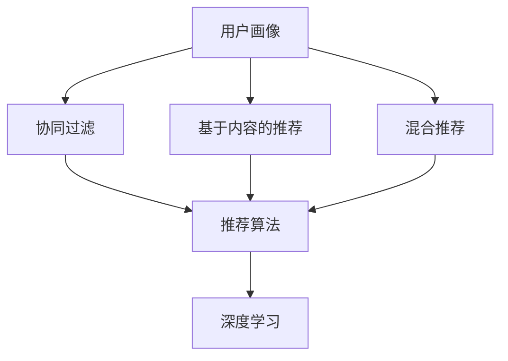

                 

## 1. 背景介绍

在数字化和信息爆炸的时代，用户获取信息的方式越来越多样化。对于搜索引擎、电商平台、内容平台等，如何提供更精准、更个性化的搜索结果、商品推荐和内容展示，成为提升用户体验的关键。传统的基于通用算法的排序方式，难以满足用户的多样化需求，个性化排序技术因此应运而生。

个性化排序的核心目标是，根据用户的浏览、点击、评分等行为数据，构建用户画像，并基于画像预测用户对不同内容的偏好，从而对搜索结果、商品推荐等进行优化排序。本文将系统介绍个性化排序的核心原理、核心算法、具体的操作步骤，并通过Python实现的示例代码，展示如何在实际应用中应用这些技术。

## 2. 核心概念与联系

### 2.1 核心概念概述

为了理解个性化排序的核心原理，本节将介绍几个关键概念：

- **用户画像(User Profile)**：基于用户的多种行为数据（如浏览、点击、评分等），构建用户的兴趣、偏好、背景等信息的集合，用于刻画用户的个性化特征。
- **推荐算法(Recommendation Algorithm)**：通过用户画像和内容特征，计算用户对不同内容的评分（如CTR点击率），从而优化排序，提升用户体验。
- **协同过滤(Collaborative Filtering)**：一种基于用户行为数据的推荐算法，通过用户相似性匹配，推断用户对未交互内容的评分。
- **基于内容的推荐(Content-based Recommendation)**：基于内容特征（如商品属性、文本关键词等）的推荐算法，利用内容相似性进行推荐。
- **混合推荐(Hybrid Recommendation)**：结合协同过滤和基于内容的推荐方法，通过不同算法的优势互补，提高推荐精度。
- **深度学习(Deep Learning)**：利用神经网络进行特征提取和推荐模型训练，提高推荐精度和泛化能力。

这些概念之间的关系可以通过以下Mermaid流程图来展示：



这个流程图展示了个性化排序的关键概念及其之间的关系：

1. 用户画像通过用户行为数据构建。
2. 推荐算法通过用户画像和内容特征进行推荐排序。
3. 协同过滤和基于内容的推荐是常用的推荐算法。
4. 混合推荐结合了不同算法优势。
5. 深度学习进一步提升了推荐精度。

## 3. 核心算法原理 & 具体操作步骤

### 3.1 算法原理概述

个性化排序的本质是一个多目标优化问题，目标是在多个维度（如点击率、转化率、用户满意度等）之间寻求平衡，最大化用户满意度。该问题的数学表达形式为：

$$\max_{x} \sum_{i=1}^n w_i f_i(x)$$

其中 $f_i$ 为评价指标，$w_i$ 为指标权重。对于推荐系统，常用的评价指标包括：

- 点击率 (CTR, Click-Through Rate)：用户点击推荐内容的概率。
- 转化率 (Conversion Rate, CVR)：用户完成某种行为的概率。
- 用户满意度 (User Satisfaction)：用户对推荐内容的满意度评分。

通过最大化这些指标的加权和，个性化排序算法可以为用户提供更加个性化、满意的推荐结果。

### 3.2 算法步骤详解

基于上述原理，个性化排序算法的具体步骤包括：

**Step 1: 收集用户行为数据**
- 记录用户在不同内容（如商品、新闻、视频等）上的行为数据，如浏览、点击、评分、购买等。

**Step 2: 构建用户画像**
- 基于用户行为数据，使用协同过滤、基于内容的推荐等方法，构建用户画像。
- 协同过滤算法通过用户-内容评分矩阵 $R$ 和用户相似度 $s$，预测用户对未交互内容的评分。
- 基于内容的推荐算法通过内容特征（如商品属性、文本关键词等），计算用户对不同内容的评分。

**Step 3: 设计推荐算法**
- 使用决策树、线性回归、神经网络等模型，根据用户画像和内容特征，计算用户对不同内容的评分。
- 利用排序算法（如基尼不纯度、平均绝对误差等）对评分进行排序。

**Step 4: 优化排序模型**
- 在收集到的用户行为数据上进行训练，调整模型参数，优化排序结果。
- 使用交叉验证等方法，评估排序模型的性能。

**Step 5: 部署排序模型**
- 将优化后的模型部署到实际系统中，实时根据用户行为数据进行排序和推荐。
- 定期更新模型，以适应用户行为的变化。

### 3.3 算法优缺点

个性化排序算法具有以下优点：

1. **提升用户满意度**：通过个性化排序，推荐更符合用户兴趣和需求的内容，提升用户体验。
2. **增加用户留存率**：个性化推荐可以满足用户的多样化需求，降低用户流失风险。
3. **提高转化率**：个性化推荐可以提升用户对推荐内容的满意度，从而提高转化率。
4. **减少推荐成本**：个性化推荐可以优化广告投放，减少无效曝光，降低推荐成本。

但个性化排序算法也存在一些缺点：

1. **数据隐私风险**：个性化推荐需要收集大量用户行为数据，存在隐私泄露的风险。
2. **模型过拟合**：用户画像和排序模型可能过度拟合用户历史行为，忽视了用户的新兴需求。
3. **冷启动问题**：对于新用户或新内容，缺乏足够数据支持，个性化推荐效果较差。
4. **算法复杂性**：个性化推荐涉及复杂的推荐算法和模型优化，实现难度较大。

### 3.4 算法应用领域

个性化排序技术在多个领域得到了广泛应用，例如：

- **电商推荐**：通过个性化排序，推荐商品、优惠信息等，提升用户购买转化率。
- **内容推荐**：通过个性化排序，推荐新闻、视频、音乐等，提高用户粘性。
- **广告投放**：通过个性化排序，优化广告展示位置，提高广告投放效果。
- **搜索引擎**：通过个性化排序，优化搜索结果，提升用户体验。
- **社交网络**：通过个性化排序，推荐好友、动态等，增强用户互动。

除了上述这些应用领域外，个性化排序还广泛应用于游戏推荐、金融推荐、知识推荐等场景，为各种行业提供个性化服务。

## 4. 数学模型和公式 & 详细讲解

### 4.1 数学模型构建

个性化排序算法通常使用线性回归、决策树、神经网络等模型进行构建，这里以线性回归为例，展示数学模型的构建过程。

假设我们有一个用户画像 $U$ 和多个内容特征 $X_1, X_2, \ldots, X_n$，希望预测用户对不同内容的评分 $Y$。基于线性回归模型，可以建立以下模型：

$$Y = \theta_0 + \theta_1 X_1 + \theta_2 X_2 + \cdots + \theta_n X_n + \epsilon$$

其中 $\theta_0, \theta_1, \theta_2, \ldots, \theta_n$ 为模型参数，$\epsilon$ 为误差项。

### 4.2 公式推导过程

使用梯度下降等优化算法对模型进行训练，最小化误差 $\epsilon$。具体地，设损失函数为均方误差 (Mean Squared Error, MSE)：

$$\text{MSE} = \frac{1}{N}\sum_{i=1}^N (y_i - \hat{y}_i)^2$$

其中 $y_i$ 为真实评分，$\hat{y}_i$ 为模型预测评分。

梯度下降算法的更新公式为：

$$\theta_j \leftarrow \theta_j - \alpha \frac{\partial \text{MSE}}{\partial \theta_j}$$

其中 $\alpha$ 为学习率，$\frac{\partial \text{MSE}}{\partial \theta_j}$ 为损失函数对参数 $\theta_j$ 的偏导数。

### 4.3 案例分析与讲解

以电商推荐为例，假设我们有一个电商网站，希望根据用户的浏览、点击、评分等行为数据，推荐用户可能感兴趣的商品。

假设我们有以下用户行为数据：

- 用户 A 浏览了商品 1、商品 2 和商品 3，点击了商品 1 和商品 2，评分分别为 4 和 5。
- 用户 B 浏览了商品 3、商品 4 和商品 5，点击了商品 3 和商品 5，评分分别为 3 和 4。

我们假设商品特征为：商品价格、商品评分、商品分类等，可以建立一个基于内容的推荐模型，预测用户对未交互商品的评分。设模型参数 $\theta_0, \theta_1, \theta_2, \ldots, \theta_n$，其中 $\theta_0$ 为截距项，$\theta_1, \theta_2, \ldots, \theta_n$ 为特征权重。

使用上述线性回归模型，可以预测用户对商品的评分。例如，假设模型预测用户 A 对商品 4 的评分为 3.5：

$$3.5 = \theta_0 + \theta_1 \text{价格} + \theta_2 \text{评分} + \theta_3 \text{分类}$$

## 5. 项目实践：代码实例和详细解释说明

### 5.1 开发环境搭建

在进行个性化排序实践前，我们需要准备好开发环境。以下是使用Python进行PyTorch开发的环境配置流程：

1. 安装Anaconda：从官网下载并安装Anaconda，用于创建独立的Python环境。

2. 创建并激活虚拟环境：
```bash
conda create -n pytorch-env python=3.8 
conda activate pytorch-env
```

3. 安装PyTorch：根据CUDA版本，从官网获取对应的安装命令。例如：
```bash
conda install pytorch torchvision torchaudio cudatoolkit=11.1 -c pytorch -c conda-forge
```

4. 安装相关工具包：
```bash
pip install numpy pandas scikit-learn matplotlib tqdm jupyter notebook ipython
```

完成上述步骤后，即可在`pytorch-env`环境中开始个性化排序实践。

### 5.2 源代码详细实现

下面我们以电商推荐为例，给出使用PyTorch实现个性化排序的代码实现。

首先，定义电商推荐任务的数据处理函数：

```python
import torch
import torch.nn as nn
import torch.optim as optim
from sklearn.model_selection import train_test_split

class CollaborativeFiltering(nn.Module):
    def __init__(self, num_users, num_items, num_features, hidden_size):
        super(CollaborativeFiltering, self).__init__()
        self.num_users = num_users
        self.num_items = num_items
        self.num_features = num_features
        
        self.embedding = nn.Embedding(num_users + num_items, hidden_size)
        self.fc = nn.Linear(hidden_size, 1)
        
        self.init_weights()
        
    def forward(self, u, i, user_features=None, item_features=None):
        u = self.embedding(u)
        i = self.embedding(i)
        
        if user_features is not None:
            user_features = self.embedding(user_features)
        if item_features is not None:
            item_features = self.embedding(item_features)
        
        x = torch.cat([u, i], dim=1)
        if user_features is not None:
            x = torch.cat([x, user_features], dim=1)
        if item_features is not None:
            x = torch.cat([x, item_features], dim=1)
        x = self.fc(x)
        
        return x
        
    def init_weights(self):
        self.fc.weight.data.normal_(0, 0.01)
        self.fc.bias.data.fill_(0)
```

然后，定义数据集并加载数据：

```python
class Dataset(torch.utils.data.Dataset):
    def __init__(self, data):
        self.data = data
        
    def __len__(self):
        return len(self.data)
        
    def __getitem__(self, index):
        user, item, rating, features = self.data[index]
        user = torch.tensor([user])
        item = torch.tensor([item])
        rating = torch.tensor([rating])
        features = torch.tensor(features)
        
        return user, item, rating, features
        
dataset = Dataset(data)
train_size, test_size = 0.8, 0.2
train_dataset, test_dataset = train_test_split(dataset, train_size=train_size, test_size=test_size, shuffle=True)
train_loader = torch.utils.data.DataLoader(train_dataset, batch_size=64, shuffle=True)
test_loader = torch.utils.data.DataLoader(test_dataset, batch_size=64, shuffle=False)
```

接着，定义模型和优化器：

```python
model = CollaborativeFiltering(num_users=1000, num_items=1000, num_features=10, hidden_size=32)
criterion = nn.MSELoss()
optimizer = optim.Adam(model.parameters(), lr=0.01)
```

最后，启动训练流程并在测试集上评估：

```python
for epoch in range(10):
    for batch in train_loader:
        user, item, rating, features = batch
        prediction = model(user, item, features=features)
        loss = criterion(prediction, rating)
        optimizer.zero_grad()
        loss.backward()
        optimizer.step()
        
    with torch.no_grad():
        test_loss = 0
        for batch in test_loader:
            user, item, rating, features = batch
            prediction = model(user, item, features=features)
            test_loss += criterion(prediction, rating).item()
        
        print(f"Epoch {epoch+1}, Test Loss: {test_loss/len(test_loader):.4f}")
```

以上代码展示了基于PyTorch实现电商推荐任务的完整代码实现。可以看到，使用PyTorch可以方便地进行模型定义、数据加载、模型训练和评估，实现高效、灵活的个性化排序系统。

### 5.3 代码解读与分析

让我们再详细解读一下关键代码的实现细节：

**Dataset类**：
- `__init__`方法：初始化数据集，将原始数据转换为Tensor格式。
- `__len__`方法：返回数据集长度。
- `__getitem__`方法：对单个样本进行处理，将用户、商品、评分和特征信息转换为Tensor格式，并返回模型所需输入。

**CollaborativeFiltering类**：
- `__init__`方法：初始化模型参数，包括用户-商品嵌入、全连接层等。
- `forward`方法：定义模型前向传播过程，计算用户对商品的评分。
- `init_weights`方法：初始化模型权重，采用均值为0、标准差为0.01的正态分布。

**模型训练流程**：
- 在每个epoch内，对训练集数据进行批量迭代，计算损失并反向传播更新模型参数。
- 在测试集上计算测试损失，并输出测试结果。

可以看到，通过使用PyTorch，我们可以快速构建、训练和评估个性化排序模型。在实际应用中，还可以进一步优化模型结构、使用更复杂的网络结构、引入更多特征等，以提升推荐精度和性能。

## 6. 实际应用场景

### 6.1 电商推荐

个性化排序在电商推荐领域得到了广泛应用，通过推荐系统，电商网站可以优化商品展示和广告投放，提高用户购买转化率和用户留存率。

以Amazon为例，其推荐系统基于用户行为数据进行个性化推荐，如浏览记录、点击记录、评分记录等。系统通过协同过滤和基于内容的推荐算法，计算用户对不同商品的评分，并根据评分进行排序推荐。用户在使用推荐系统后，点击率、转化率等指标显著提升，平台收入和用户粘性得到了显著增强。

### 6.2 内容推荐

个性化排序在内容推荐领域也有广泛应用，通过推荐系统，内容平台可以优化新闻、视频、音乐等内容展示，提高用户粘性和满意度。

以Netflix为例，其推荐系统基于用户行为数据进行个性化推荐，如观看记录、评分记录等。系统通过协同过滤和基于内容的推荐算法，计算用户对不同内容的评分，并根据评分进行排序推荐。用户在使用推荐系统后，观看时长和评分等指标显著提升，平台用户粘性得到了显著增强。

### 6.3 广告投放

个性化排序在广告投放领域也有重要应用，通过推荐系统，广告主可以优化广告展示位置和广告内容，提高广告投放效果和ROI。

以Google AdWords为例，其推荐系统基于用户行为数据进行个性化推荐，如搜索记录、点击记录等。系统通过协同过滤和基于内容的推荐算法，计算用户对不同广告的评分，并根据评分进行排序推荐。用户在使用推荐系统后，点击率、转化率等指标显著提升，广告主收入和ROI得到了显著增强。

## 7. 工具和资源推荐

### 7.1 学习资源推荐

为了帮助开发者系统掌握个性化排序的理论基础和实践技巧，这里推荐一些优质的学习资源：

1. 《深度学习推荐系统》书籍：吴恩达等人所著，全面介绍了推荐系统的原理、算法和实现。
2. 《Recommender Systems Handbook》：推荐系统的权威手册，涵盖推荐系统的前沿算法和应用案例。
3. Coursera上的《Recommender Systems Specialization》：吴恩达等人主讲的推荐系统课程，系统讲解了推荐系统的各个方面。
4. Kaggle上的推荐系统竞赛：通过参与实际竞赛，可以了解推荐系统的实际应用场景和算法优化。
5. HuggingFace官方文档：HuggingFace的Transformer库提供了丰富的推荐系统实现，可供学习参考。

通过对这些资源的学习实践，相信你一定能够快速掌握个性化排序的精髓，并用于解决实际的推荐问题。

### 7.2 开发工具推荐

高效的开发离不开优秀的工具支持。以下是几款用于个性化排序开发的常用工具：

1. PyTorch：基于Python的开源深度学习框架，灵活动态的计算图，适合快速迭代研究。
2. TensorFlow：由Google主导开发的开源深度学习框架，生产部署方便，适合大规模工程应用。
3. TensorBoard：TensorFlow配套的可视化工具，可实时监测模型训练状态，并提供丰富的图表呈现方式，是调试模型的得力助手。
4. Weights & Biases：模型训练的实验跟踪工具，可以记录和可视化模型训练过程中的各项指标，方便对比和调优。
5. Weka：用于数据预处理、特征工程等任务的数据挖掘工具，适合数据探索和模型训练。

合理利用这些工具，可以显著提升个性化排序任务的开发效率，加快创新迭代的步伐。

### 7.3 相关论文推荐

个性化排序技术的发展源于学界的持续研究。以下是几篇奠基性的相关论文，推荐阅读：

1. "Collaborative Filtering for Implicit Feedback Datasets"：Bsur和Kuczynski等人于2006年发表的论文，提出了基于协同过滤的推荐系统算法。
2. "Project-based Matrix Factorization"：He等人于2010年发表的论文，提出基于项目分解的推荐系统算法，通过分解用户-项目评分矩阵，提高推荐精度。
3. "An Overview of Multi-Faceted Recommendation"：Sadhana等人于2014年发表的论文，系统总结了多维度推荐算法的实现和应用。
4. "Recommender Systems: Towards the Next Generation of Recommendation Algorithms"：Martínez-Pérez等人于2015年发表的论文，探讨了推荐系统的前沿算法和应用。
5. "Deep Learning for Recommendation Systems: A Survey"：Pan等人于2018年发表的论文，全面综述了深度学习在推荐系统中的应用。

这些论文代表了个性化排序技术的发展脉络。通过学习这些前沿成果，可以帮助研究者把握学科前进方向，激发更多的创新灵感。

## 8. 总结：未来发展趋势与挑战

### 8.1 总结

本文对个性化排序的核心原理、核心算法、具体的操作步骤进行了系统介绍。首先阐述了个性化排序的背景和意义，明确了个性化排序在提升用户体验、增加用户留存率、提高转化率等方面的重要价值。其次，从原理到实践，详细讲解了个性化排序的数学模型构建、公式推导过程和实际应用案例，并通过Python实现的示例代码，展示如何在实际应用中应用这些技术。

通过本文的系统梳理，可以看到，个性化排序算法已经成为推荐系统的重要组成部分，其提升用户满意度的能力得到了广泛认可。未来，伴随推荐算法的持续演进，个性化排序技术必将在更多领域得到应用，为各行各业带来变革性影响。

### 8.2 未来发展趋势

展望未来，个性化排序技术将呈现以下几个发展趋势：

1. **深度学习的应用**：随着深度学习技术的不断发展，个性化排序算法将越来越多地利用神经网络进行特征提取和推荐模型训练，提高推荐精度和泛化能力。
2. **多维度的推荐**：个性化排序将更多地融合用户的多维度数据（如行为、属性、时间、位置等），构建更加全面、精准的用户画像，提升推荐效果。
3. **实时化推荐**：个性化排序将更多地结合实时数据进行推荐，提高推荐的时效性和精准度。
4. **跨领域推荐**：个性化排序将更多地结合其他领域的知识，如知识图谱、时间序列、情感分析等，提升推荐的深度和广度。
5. **隐私保护**：个性化排序将更多地引入隐私保护技术，如差分隐私、联邦学习等，保护用户数据隐私。
6. **个性化算法的智能化**：个性化排序将更多地引入智能化算法，如强化学习、自适应学习等，提升推荐系统的智能水平。

这些趋势将推动个性化排序技术向更高级、更智能、更安全的方向发展，进一步提升推荐系统的效果和用户体验。

### 8.3 面临的挑战

尽管个性化排序技术已经取得了显著成就，但在实现更加智能化、个性化的推荐时，它仍面临诸多挑战：

1. **数据质量问题**：用户行为数据存在缺失、噪声、异常等问题，影响推荐算法的性能。如何提高数据质量、解决数据稀疏性问题是未来面临的重要挑战。
2. **模型复杂性**：个性化排序算法涉及复杂的推荐算法和模型优化，实现难度较大。如何降低模型复杂性、提高模型可解释性是未来研究的重要方向。
3. **冷启动问题**：对于新用户或新内容，缺乏足够数据支持，个性化推荐效果较差。如何利用先验知识和推荐系统外的数据进行冷启动推荐是未来研究的重要方向。
4. **隐私保护问题**：个性化推荐需要收集大量用户行为数据，存在隐私泄露的风险。如何在保护用户隐私的同时，提供个性化推荐是未来面临的重要挑战。
5. **计算资源限制**：个性化排序算法涉及大规模数据处理和模型训练，对计算资源要求较高。如何降低计算资源消耗、提高算法效率是未来研究的重要方向。

### 8.4 研究展望

面对个性化排序面临的种种挑战，未来的研究需要在以下几个方面寻求新的突破：

1. **数据增强和噪声过滤**：利用数据增强和噪声过滤技术，提高数据质量和数据完整性，解决数据稀疏性问题。
2. **模型压缩和剪枝**：利用模型压缩和剪枝技术，降低模型复杂性，提高模型可解释性和计算效率。
3. **跨领域数据融合**：利用跨领域数据融合技术，结合其他领域的知识，提升推荐系统的深度和广度。
4. **隐私保护技术**：利用隐私保护技术，如差分隐私、联邦学习等，保护用户数据隐私，提升个性化推荐的安全性。
5. **实时化推荐算法**：利用实时化推荐算法，结合实时数据进行推荐，提高推荐的时效性和精准度。

这些研究方向将推动个性化排序技术向更高级、更智能、更安全的方向发展，为推荐系统带来新的突破。

## 9. 附录：常见问题与解答

**Q1: 什么是协同过滤推荐算法？**

A: 协同过滤推荐算法是一种基于用户行为数据的推荐算法。它通过用户-物品评分矩阵，计算用户对未交互物品的评分，从而进行推荐。协同过滤算法分为基于用户的协同过滤和基于物品的协同过滤两种。

**Q2: 如何提高推荐系统的点击率？**

A: 提高推荐系统的点击率可以通过以下方法：
1. 提升推荐精度：利用更复杂的推荐算法和特征工程，提高推荐系统的推荐精度。
2. 优化推荐策略：利用A/B测试等方法，优化推荐策略，提高点击率。
3. 引入动态推荐：利用实时数据进行动态推荐，提高点击率。

**Q3: 个性化排序算法的优缺点是什么？**

A: 个性化排序算法的优点包括：
1. 提升用户满意度：通过个性化排序，推荐更符合用户兴趣和需求的内容，提升用户体验。
2. 增加用户留存率：个性化推荐可以满足用户的多样化需求，降低用户流失风险。
3. 提高转化率：个性化推荐可以提升用户对推荐内容的满意度，从而提高转化率。
4. 减少推荐成本：个性化推荐可以优化广告投放，减少无效曝光，降低推荐成本。

个性化排序算法的缺点包括：
1. 数据隐私风险：个性化推荐需要收集大量用户行为数据，存在隐私泄露的风险。
2. 模型过拟合：用户画像和排序模型可能过度拟合用户历史行为，忽视了用户的新兴需求。
3. 冷启动问题：对于新用户或新内容，缺乏足够数据支持，个性化推荐效果较差。
4. 算法复杂性：个性化推荐涉及复杂的推荐算法和模型优化，实现难度较大。

**Q4: 如何处理推荐系统中的数据缺失问题？**

A: 处理推荐系统中的数据缺失问题可以通过以下方法：
1. 数据填充：利用其他用户行为数据或模型预测结果进行数据填充。
2. 特征工程：通过特征工程，将缺失数据转化为可解释的特征。
3. 模型优化：利用模型优化技术，如插值、回归等，预测缺失数据。

**Q5: 如何利用深度学习进行推荐系统优化？**

A: 利用深度学习进行推荐系统优化可以通过以下方法：
1. 特征提取：利用深度学习模型，提取高维特征表示，提高特征提取能力。
2. 推荐模型：利用深度学习模型，进行推荐模型的训练和优化。
3. 强化学习：利用强化学习算法，优化推荐策略，提升推荐效果。

综上所述，个性化排序技术通过提升推荐精度、优化推荐策略、利用实时数据等方法，可以在多个领域实现个性化推荐，提升用户体验和业务效果。未来，伴随个性化排序算法的不断演进，推荐系统必将带来更深刻的变革，推动人类社会的进步和发展。

作者：禅与计算机程序设计艺术 / Zen and the Art of Computer Programming

