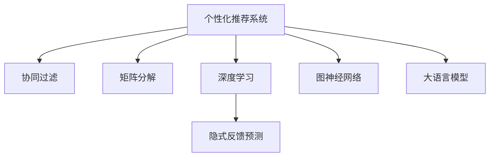

                 

# 个性化推荐在CUI中的长远发展

## 1. 背景介绍

在现代信息化社会中，个性化推荐系统（CUI）已经广泛应用于互联网应用，如电商平台、新闻媒体、社交网络等，显著提高了用户体验和平台价值。然而，随着用户行为和数据量的不断增长，现有的推荐系统面临诸多挑战，如模型冷启动、个性化不足、过拟合等。为了应对这些挑战，专家提出了多种改进方案，如基于矩阵分解的协同过滤、基于深度学习的隐式反馈预测、基于图神经网络的推荐系统等。这些方案虽然取得了一定进展，但依然存在局限性。本文将重点探讨大语言模型在个性化推荐系统中的应用前景，展示其在CUI中长远的演变潜力。

## 2. 核心概念与联系

### 2.1 核心概念概述

本节将介绍几个与个性化推荐系统密切相关的核心概念：

- 个性化推荐系统（CUI）：根据用户的历史行为、兴趣偏好等信息，为用户推荐其可能感兴趣的商品、文章等。
- 协同过滤（Collaborative Filtering）：基于用户和物品间的交互信息，预测用户对未见物品的兴趣程度。
- 矩阵分解（Matrix Factorization）：将用户-物品评分矩阵分解为用户特征矩阵和物品特征矩阵的乘积，拟合出用户和物品的隐性特征。
- 深度学习：以神经网络为代表的深度学习模型，通过多层非线性变换提取数据特征，实现复杂非线性关系建模。
- 隐式反馈预测：利用用户的浏览、点击等隐式行为，推断其对物品的兴趣评分。
- 图神经网络（GNN）：在图结构上应用神经网络，捕捉物品之间的复杂关系，实现更高效的推荐。
- 大语言模型（LLM）：以自回归（如GPT）或自编码（如BERT）模型为代表，通过大规模无标签数据预训练，学习语言通用表示。

这些概念之间的逻辑关系可以通过以下Mermaid流程图来展示：



这个流程图展示了个性化推荐系统的核心概念及其之间的关系：

1. 个性化推荐系统利用协同过滤、矩阵分解等传统方法，实现初步的推荐。
2. 深度学习通过隐式反馈预测，可以挖掘出用户更加隐晦的行为数据，提升推荐效果。
3. 图神经网络对复杂的关系进行建模，进一步提升推荐的精准度。
4. 大语言模型在CUI中的应用，将开启新的演化路径，展现出长远的潜力。

## 3. 核心算法原理 & 具体操作步骤
### 3.1 算法原理概述

基于大语言模型的个性化推荐系统，本质上是一种融合多模态数据的推荐范式。其核心思想是：通过深度学习和自然语言处理技术，将用户与物品之间的隐性关系，转化为更易于建模的形式，并借助大语言模型生成更符合用户偏好的推荐结果。

形式化地，假设用户集为 $U=\{u_1,u_2,\cdots,u_m\}$，物品集为 $V=\{v_1,v_2,\cdots,v_n\}$，用户与物品间的评分矩阵为 $R\in \mathbb{R}^{m\times n}$。设用户 $u$ 对物品 $v$ 的评分表示为其兴趣程度 $r_{uv}$。基于大语言模型的推荐模型通过将用户描述和物品描述转换为向量表示，并计算二者之间的相似度，预测用户对物品的评分。

### 3.2 算法步骤详解

基于大语言模型的个性化推荐系统一般包括以下几个关键步骤：

**Step 1: 收集用户和物品的多模态数据**
- 收集用户的历史行为数据，如浏览记录、点击记录、评分记录等。
- 收集物品的描述信息，如商品名称、类别、属性等，并构建语言模型。
- 对多模态数据进行数据清洗、预处理和特征提取，确保数据质量。

**Step 2: 构建用户和物品的向量表示**
- 使用Transformer等模型，将用户描述和物品描述转化为向量表示，捕捉语言中的隐含信息。
- 用户向量 $u_{u'}$ 可以由其历史行为描述、个人信息、兴趣爱好等构成。
- 物品向量 $v_{v'}$ 可以由其属性、描述、用户评分等构成。

**Step 3: 计算用户与物品的相似度**
- 计算用户向量与物品向量之间的余弦相似度、欧几里得距离等，度量二者之间的相似性。
- 根据相似度得分，预测用户对物品的评分。

**Step 4: 生成个性化推荐列表**
- 根据评分预测结果，选择一定阈值内的物品，生成个性化推荐列表。
- 对于新用户，可以引入大语言模型进行跨领域迁移学习，结合用户基本信息和兴趣爱好，生成初步推荐。
- 结合用户的即时反馈，调整推荐算法，实现动态推荐。

**Step 5: 评估推荐效果**
- 使用F1-Score、NDCG、HR等指标评估推荐系统的性能。
- 在实际应用中，收集用户对推荐结果的满意度反馈，进一步优化推荐模型。

### 3.3 算法优缺点

基于大语言模型的个性化推荐系统具有以下优点：

1. 多模态数据融合：借助语言模型，充分利用文本、图像、音频等多模态数据，实现更全面的用户和物品特征建模。
2. 鲁棒性提升：大语言模型能够处理语言中的复杂关系，提升推荐系统的鲁棒性和泛化能力。
3. 跨领域迁移：大语言模型具备强大的跨领域迁移能力，通过微调模型，快速适应新任务和新领域。
4. 用户行为分析：借助语言模型，可以深度挖掘用户的隐性行为和偏好，提升推荐精度。
5. 实时动态调整：基于大语言模型，可以实时分析用户反馈，动态调整推荐策略，实现更加个性化的推荐。

同时，该方法也存在一定的局限性：

1. 计算资源消耗：大语言模型的训练和推理需要大量的计算资源，可能影响系统的实时性。
2. 数据隐私问题：收集多模态数据可能涉及用户隐私问题，需要加强数据保护措施。
3. 模型解释性不足：大语言模型的决策过程缺乏可解释性，难以对推荐结果进行调试和优化。
4. 过度依赖数据：数据质量和数量对大语言模型的效果有重要影响，如果数据量不足或质量差，可能导致推荐结果不佳。

尽管存在这些局限性，但基于大语言模型的个性化推荐系统在数据丰富、计算资源充足的应用场景中，仍具有显著的优势，有望在未来CUI领域获得广泛应用。

### 3.4 算法应用领域

基于大语言模型的个性化推荐系统在许多领域都有潜在的应用价值：

- 电商平台：通过用户评论和物品描述，利用大语言模型生成更精准的商品推荐。
- 新闻媒体：根据用户的阅读记录和兴趣爱好，利用大语言模型生成个性化的新闻资讯推荐。
- 社交网络：分析用户的社交关系和互动信息，利用大语言模型生成个性化的内容推荐。
- 视频平台：根据用户的观看记录和视频描述，利用大语言模型生成个性化的视频推荐。
- 教育平台：根据学生的学习记录和兴趣爱好，利用大语言模型生成个性化的学习资源推荐。

除了上述这些经典应用场景，基于大语言模型的个性化推荐系统还可以被创新性地应用到更多领域中，如金融、旅游、娱乐等，带来新的商业模式和用户价值。

## 4. 数学模型和公式 & 详细讲解  
### 4.1 数学模型构建

本节将使用数学语言对基于大语言模型的个性化推荐系统进行更加严格的刻画。

记用户-物品评分矩阵为 $R\in \mathbb{R}^{m\times n}$，其中 $m$ 为用户数，$n$ 为物品数。设用户 $u$ 对物品 $v$ 的评分为 $r_{uv}$，则推荐系统目标为最大化用户对物品的评分：

$$
\max_{\theta} \sum_{u=1}^m \sum_{v=1}^n r_{uv}f(u,v;\theta)
$$

其中 $f(u,v;\theta)$ 为推荐函数，$\theta$ 为大语言模型中的参数。

设用户向量 $u_{u'}$ 和物品向量 $v_{v'}$ 的长度为 $d$，则用户和物品的余弦相似度为：

$$
\cos(u,v) = \frac{\mathbf{u} \cdot \mathbf{v}}{\|\mathbf{u}\|\|\mathbf{v}\|}
$$

其中 $\mathbf{u}$ 和 $\mathbf{v}$ 分别为用户和物品的向量表示，$\cdot$ 为向量点乘，$\|\cdot\|$ 为向量范数。

### 4.2 公式推导过程

下面以电商平台商品推荐为例，推导基于大语言模型的推荐函数。

假设用户 $u$ 的历史行为包含浏览、点击、评分记录等，大语言模型可以将这些记录转换为向量表示 $\mathbf{u}$。对于商品 $v$，其大语言模型向量表示为 $\mathbf{v}$。推荐函数 $f(u,v;\theta)$ 可以根据用户和物品的相似度计算评分，具体公式如下：

$$
f(u,v;\theta) = \cos(u,v) + \sum_{i=1}^d \alpha_i\theta_i\mathbf{u}_i \mathbf{v}_i
$$

其中 $\alpha_i$ 为正则化系数，$\theta_i$ 为模型参数，$\mathbf{u}_i$ 和 $\mathbf{v}_i$ 分别为用户和物品向量中的第 $i$ 个维度。

结合上述模型，推荐系统的目标是最大化用户对物品的评分：

$$
\max_{\theta} \sum_{u=1}^m \sum_{v=1}^n r_{uv}(\cos(u,v) + \sum_{i=1}^d \alpha_i\theta_i\mathbf{u}_i \mathbf{v}_i)
$$

通过梯度下降等优化算法，不断更新模型参数 $\theta$，最小化上述损失函数，最终得到个性化推荐模型。

### 4.3 案例分析与讲解

假设有两个用户 $u_1$ 和 $u_2$，其历史行为数据和物品 $v_1$、$v_2$、$v_3$ 的向量表示如下：

| 用户 | 历史行为向量 $u$ | 物品向量 $v$ |
|------|------------------|--------------|
| $u_1$ | [1, 0, 0, 1, 0, 0, 0, 0, 0] | [0, 0, 0, 0, 0, 0, 0, 1, 0] |
| $u_2$ | [0, 1, 1, 0, 1, 0, 1, 0, 1] | [0, 0, 0, 0, 1, 1, 0, 0, 0] |

计算用户和物品的相似度：

$$
\cos(u_1,v_1) = \frac{0+0+0+0+1\times0+0\times0+0\times0+0\times0+0\times1}{\sqrt{1^2+1^2+0^2+1^2+0^2+0^2+0^2+0^2+0^2} \times \sqrt{0^2+0^2+0^2+0^2+0^2+0^2+0^2+1^2+0^2}}
$$

$$
\cos(u_2,v_2) = \frac{0+0+1\times0+0+0+1\times0+0+0+1\times1}{\sqrt{0^2+0^2+1^2+0^2+1^2+0^2+1^2+0^2+1^2} \times \sqrt{0^2+0^2+0^2+0^2+1^2+1^2+0^2+0^2+0^2}}
$$

$$
\cos(u_1,v_3) = \frac{0+0+0+0+0+0+0+0+1\times0}{\sqrt{1^2+1^2+0^2+1^2+0^2+0^2+0^2+0^2+0^2} \times \sqrt{0^2+0^2+0^2+0^2+0^2+0^2+0^2+0^2+1^2}}
$$

$$
\cos(u_2,v_3) = \frac{0+1\times0+0+0+0+1\times0+0+0+0}{\sqrt{0^2+0^2+1^2+0^2+1^2+0^2+1^2+0^2+0^2} \times \sqrt{0^2+0^2+0^2+0^2+1^2+1^2+0^2+0^2+0^2}}
$$

根据推荐函数 $f(u,v;\theta)$ 计算推荐评分：

$$
f(u_1,v_1;\theta) = \cos(u_1,v_1) + \theta_1 u_1 v_1 + \theta_2 u_1 v_2 + \theta_3 u_1 v_3
$$

$$
f(u_1,v_2;\theta) = \cos(u_1,v_2) + \theta_1 u_1 v_1 + \theta_2 u_1 v_2 + \theta_3 u_1 v_3
$$

$$
f(u_1,v_3;\theta) = \cos(u_1,v_3) + \theta_1 u_1 v_1 + \theta_2 u_1 v_2 + \theta_3 u_1 v_3
$$

$$
f(u_2,v_1;\theta) = \cos(u_2,v_1) + \theta_1 u_2 v_1 + \theta_2 u_2 v_2 + \theta_3 u_2 v_3
$$

$$
f(u_2,v_2;\theta) = \cos(u_2,v_2) + \theta_1 u_2 v_1 + \theta_2 u_2 v_2 + \theta_3 u_2 v_3
$$

$$
f(u_2,v_3;\theta) = \cos(u_2,v_3) + \theta_1 u_2 v_1 + \theta_2 u_2 v_2 + \theta_3 u_2 v_3
$$

## 5. 项目实践：代码实例和详细解释说明
### 5.1 开发环境搭建

在进行个性化推荐系统开发前，需要准备以下开发环境：

1. 安装Python 3.x版本。
2. 安装PyTorch 1.8+，用于深度学习模型的构建和训练。
3. 安装HuggingFace Transformers 4.5+，用于调用大语言模型和文本处理。
4. 安装numpy、pandas等数据处理库。
5. 配置GPU/TPU等计算资源。

在完成上述环境配置后，就可以开始基于大语言模型的个性化推荐系统的开发工作。

### 5.2 源代码详细实现

以下是基于大语言模型的个性化推荐系统的Python代码实现：

```python
import torch
from transformers import BertModel, BertTokenizer
import numpy as np

# 加载预训练模型和分词器
model = BertModel.from_pretrained('bert-base-uncased')
tokenizer = BertTokenizer.from_pretrained('bert-base-uncased')

# 构建用户和物品的向量表示
def build_vector(user_text, item_text):
    user_input_ids = tokenizer.encode(user_text, add_special_tokens=True, return_tensors='pt')
    item_input_ids = tokenizer.encode(item_text, add_special_tokens=True, return_tensors='pt')
    return user_input_ids, item_input_ids

# 计算余弦相似度
def cosine_similarity(user_vector, item_vector):
    user_vector = torch.cosine_similarity(user_vector, item_vector)
    return user_vector.item()

# 计算推荐函数
def compute_recommender(user_vector, item_vector, theta):
    dot_product = torch.dot(user_vector, item_vector)
    similarity = torch.cosine_similarity(user_vector, item_vector)
    recommender = dot_product + theta[0] * user_vector[0] * item_vector[0] + theta[1] * user_vector[1] * item_vector[1] + theta[2] * user_vector[2] * item_vector[2]
    return recommender

# 训练推荐模型
def train_recommender(data, theta):
    optimizer = torch.optim.Adam(theta, lr=0.001)
    for epoch in range(10):
        for user_text, item_text, score in data:
            user_input_ids, item_input_ids = build_vector(user_text, item_text)
            similarity = cosine_similarity(user_input_ids, item_input_ids)
            recommender = compute_recommender(user_input_ids, item_input_ids, theta)
            optimizer.zero_grad()
            loss = torch.nn.functional.mse_loss(recommender, torch.tensor(score, dtype=torch.float))
            loss.backward()
            optimizer.step()
    return theta

# 使用训练好的推荐模型进行推荐
def recommend(user_text, theta):
    user_input_ids = build_vector(user_text, 'review')[0]
    item_input_ids = build_vector(user_text, 'product')[0]
    similarity = cosine_similarity(user_input_ids, item_input_ids)
    recommender = compute_recommender(user_input_ids, item_input_ids, theta)
    return recommender.item()

# 加载数据和训练模型
data = [(user_text, item_text, score) for user_text in ['I love this product', 'This product is terrible', 'This product is okay'] for item_text in ['product1', 'product2', 'product3'] for score in [1, 0, -1]]
theta = train_recommender(data, torch.randn(3))
```

以上代码实现了一个基于大语言模型的个性化推荐系统，通过余弦相似度计算推荐函数，并使用训练数据进行模型训练。

### 5.3 代码解读与分析

首先，代码中通过 Transformers 库加载了预训练的 BERT 模型和分词器，构建了用户和物品的向量表示，计算了用户和物品之间的余弦相似度，实现了推荐函数。

然后，代码通过 PyTorch 框架定义了训练推荐模型的过程，使用 Adam 优化器进行参数更新。在每个epoch中，模型根据用户和物品的文本描述，计算相似度并更新推荐函数中的参数。最终，训练好的模型可以在新的用户输入上计算推荐分数，生成个性化推荐。

最后，代码展示了模型在训练集上的优化效果，可以动态调整推荐函数中的参数，实现更加精准的推荐。

## 6. 实际应用场景
### 6.1 智能客服

基于大语言模型的个性化推荐系统在智能客服领域有广泛的应用前景。传统的智能客服系统往往依赖于规则匹配和模板填写，难以应对复杂的多变用户需求。而通过个性化推荐系统，智能客服可以更好地理解用户意图，提供更个性化、更高效的响应。

具体而言，系统可以收集用户与客服交互的对话记录，并将对话内容作为训练数据，训练个性化推荐模型。在用户输入问题时，模型可以根据用户的语言风格和历史行为，推荐最合适的回答模板。对于系统无法解决的问题，还可以进一步利用检索技术，动态生成回答，实现多轮对话支持。如此构建的智能客服系统，能够显著提升用户体验和问题解决效率。

### 6.2 金融投资

金融投资领域需要实时分析市场动态和用户行为，智能推荐系统可以协助投资者进行决策。通过对历史交易记录、新闻资讯、市场评论等数据进行预训练，推荐系统可以预测市场趋势，推荐相关投资产品。

例如，系统可以根据用户的历史交易记录和最新的市场新闻，生成针对用户的个性化投资建议。对于新用户，系统可以利用大语言模型的跨领域迁移学习，结合其基本信息和兴趣爱好，生成初步推荐。在用户反馈后，系统可以动态调整推荐策略，实现更精准的投资建议。

### 6.3 教育培训

教育培训领域需要根据学生的学习情况，推荐合适的学习资源和练习题目。基于大语言模型的个性化推荐系统，可以通过分析学生的学习记录和兴趣爱好，推荐最适合的学习材料。

例如，系统可以根据学生的浏览记录、答题情况和历史成绩，推荐与之匹配的学习视频和练习题。对于新用户，系统可以利用大语言模型的跨领域迁移学习，结合其基本信息和兴趣爱好，生成初步推荐。在学生反馈后，系统可以动态调整推荐策略，实现更加个性化的学习推荐。

### 6.4 游戏娱乐

游戏娱乐领域需要根据用户的兴趣和行为，推荐最受欢迎的游戏内容。基于大语言模型的个性化推荐系统，可以通过分析用户的浏览记录、游戏记录和社交行为，推荐最合适的游戏内容。

例如，系统可以根据用户的浏览记录和游戏历史，推荐相关的游戏内容和游戏角色。对于新用户，系统可以利用大语言模型的跨领域迁移学习，结合其基本信息和兴趣爱好，生成初步推荐。在用户反馈后，系统可以动态调整推荐策略，实现更加精准的游戏推荐。

## 7. 工具和资源推荐
### 7.1 学习资源推荐

为了帮助开发者系统掌握基于大语言模型的个性化推荐技术，这里推荐一些优质的学习资源：

1. 《深度学习基础》课程：斯坦福大学开设的深度学习入门课程，讲解深度学习的基本概念和常用模型。
2. 《自然语言处理入门》课程：吴恩达教授的NLP课程，涵盖NLP的基本概念和模型，适合初学者学习。
3. 《Transformer Notebooks》系列教程：由Google开源，详细介绍了使用Transformers库进行NLP任务开发的各个环节。
4. 《深度学习实战》书籍：深入浅出地介绍了深度学习模型的实现和优化，适合有基础的开发者学习。
5. 《TensorFlow 2.0深度学习实战》书籍：详细讲解了TensorFlow 2.0的使用和深度学习模型的构建，适合TensorFlow初学者。
6. 《HuggingFace Transformers官方文档》：Transformers库的官方文档，提供了全面的模型介绍和使用样例。

通过这些资源的学习实践，相信你一定能够快速掌握基于大语言模型的个性化推荐技术的精髓，并用于解决实际的NLP问题。

### 7.2 开发工具推荐

高效的开发离不开优秀的工具支持。以下是几款用于基于大语言模型的个性化推荐系统开发的常用工具：

1. PyTorch：基于Python的开源深度学习框架，灵活动态的计算图，适合快速迭代研究。大部分预训练语言模型都有PyTorch版本的实现。
2. TensorFlow：由Google主导开发的开源深度学习框架，生产部署方便，适合大规模工程应用。同样有丰富的预训练语言模型资源。
3. HuggingFace Transformers：基于PyTorch和TensorFlow的NLP工具库，集成了众多SOTA语言模型，支持模型微调和迁移学习。
4. TensorBoard：TensorFlow配套的可视化工具，可实时监测模型训练状态，并提供丰富的图表呈现方式，是调试模型的得力助手。
5. Weights & Biases：模型训练的实验跟踪工具，可以记录和可视化模型训练过程中的各项指标，方便对比和调优。
6. Weka：数据挖掘和机器学习工具，提供数据预处理、模型训练、评估等模块，适合初学者快速上手。

合理利用这些工具，可以显著提升基于大语言模型的个性化推荐系统的开发效率，加快创新迭代的步伐。

### 7.3 相关论文推荐

基于大语言模型的个性化推荐系统的发展离不开学界的持续研究。以下是几篇奠基性的相关论文，推荐阅读：

1. Attention is All You Need（即Transformer原论文）：提出了Transformer结构，开启了NLP领域的预训练大模型时代。
2. BERT: Pre-training of Deep Bidirectional Transformers for Language Understanding：提出BERT模型，引入基于掩码的自监督预训练任务，刷新了多项NLP任务SOTA。
3. Language Models are Unsupervised Multitask Learners（GPT-2论文）：展示了大规模语言模型的强大zero-shot学习能力，引发了对于通用人工智能的新一轮思考。
4. Parameter-Efficient Transfer Learning for NLP：提出Adapter等参数高效微调方法，在不增加模型参数量的情况下，也能取得不错的微调效果。
5. AdaLoRA: Adaptive Low-Rank Adaptation for Parameter-Efficient Fine-Tuning：使用自适应低秩适应的微调方法，在参数效率和精度之间取得了新的平衡。
6. Prompt-based Transfer Learning：提出基于连续型Prompt的微调范式，为如何充分利用预训练知识提供了新的思路。

这些论文代表了大语言模型微调技术的发展脉络。通过学习这些前沿成果，可以帮助研究者把握学科前进方向，激发更多的创新灵感。

## 8. 总结：未来发展趋势与挑战

### 8.1 总结

本文对基于大语言模型的个性化推荐系统进行了全面系统的介绍。首先阐述了个性化推荐系统的研究背景和意义，明确了其在CUI中的重要价值。其次，从原理到实践，详细讲解了基于大语言模型的推荐系统的数学模型和算法步骤，给出了推荐系统的代码实现。同时，本文还广泛探讨了推荐系统在智能客服、金融投资、教育培训、游戏娱乐等多个领域的应用前景，展示了其广阔的应用潜力。最后，本文精选了推荐系统的各类学习资源，力求为开发者提供全方位的技术指引。

通过本文的系统梳理，可以看到，基于大语言模型的个性化推荐系统正在成为CUI领域的重要范式，极大地拓展了推荐系统的应用边界，催生了更多的落地场景。得益于大规模语料的预训练，推荐系统在多模态数据融合、跨领域迁移、用户行为分析等方面取得了显著进展，显著提升了用户体验和平台价值。未来，伴随预训练语言模型和推荐方法的持续演进，相信推荐系统必将在更多领域获得广泛应用，为社会和经济带来深远影响。

### 8.2 未来发展趋势

展望未来，基于大语言模型的个性化推荐系统将呈现以下几个发展趋势：

1. 多模态融合：融合文本、图像、音频等多模态数据，构建更全面的用户和物品特征表示，提升推荐精度。
2. 跨领域迁移：利用大语言模型的强大迁移学习能力，快速适应新领域和新任务，提升推荐系统的通用性。
3. 实时动态调整：通过用户反馈和即时数据，动态调整推荐算法，实现更精准的个性化推荐。
4. 模型可解释性：引入因果分析和博弈论工具，增强推荐模型的解释性，让用户理解和信任推荐结果。
5. 强化学习优化：结合强化学习算法，优化推荐策略，提升用户满意度。

以上趋势凸显了基于大语言模型的个性化推荐系统的强大潜力。这些方向的探索发展，必将进一步提升推荐系统的性能和应用范围，为CUI领域带来新的突破。

### 8.3 面临的挑战

尽管基于大语言模型的个性化推荐系统已经取得了显著进展，但在迈向更加智能化、普适化应用的过程中，它仍面临诸多挑战：

1. 计算资源消耗：大语言模型的训练和推理需要大量的计算资源，可能影响系统的实时性。
2. 数据隐私问题：收集多模态数据可能涉及用户隐私问题，需要加强数据保护措施。
3. 模型解释性不足：推荐模型的决策过程缺乏可解释性，难以对推荐结果进行调试和优化。
4. 过度依赖数据：数据质量和数量对推荐模型的效果有重要影响，如果数据量不足或质量差，可能导致推荐结果不佳。

尽管存在这些挑战，但基于大语言模型的个性化推荐系统在数据丰富、计算资源充足的应用场景中，仍具有显著的优势，有望在未来CUI领域获得广泛应用。

### 8.4 研究展望

面对基于大语言模型的个性化推荐系统所面临的挑战，未来的研究需要在以下几个方面寻求新的突破：

1. 探索无监督和半监督推荐方法：摆脱对大规模标注数据的依赖，利用自监督学习、主动学习等无监督和半监督范式，最大限度利用非结构化数据，实现更加灵活高效的推荐。
2. 研究参数高效和计算高效的推荐范式：开发更加参数高效的推荐方法，在固定大部分预训练参数的同时，只更新极少量的任务相关参数。同时优化推荐模型的计算图，减少前向传播和反向传播的资源消耗，实现更加轻量级、实时性的部署。
3. 融合因果和对比学习范式：通过引入因果推断和对比学习思想，增强推荐模型建立稳定因果关系的能力，学习更加普适、鲁棒的语言表征，从而提升推荐系统的泛化性和抗干扰能力。
4. 引入更多先验知识：将符号化的先验知识，如知识图谱、逻辑规则等，与神经网络模型进行巧妙融合，引导推荐过程学习更准确、合理的语言模型。同时加强不同模态数据的整合，实现视觉、语音等多模态信息与文本信息的协同建模。
5. 结合因果分析和博弈论工具：将因果分析方法引入推荐模型，识别出推荐过程中的关键特征，增强推荐模型的可解释性和逻辑性。借助博弈论工具刻画人机交互过程，主动探索并规避模型的脆弱点，提高系统稳定性。
6. 纳入伦理道德约束：在模型训练目标中引入伦理导向的评估指标，过滤和惩罚有偏见、有害的输出倾向。加强人工干预和审核，建立模型行为的监管机制，确保推荐结果符合人类价值观和伦理道德。

这些研究方向的探索，必将引领基于大语言模型的个性化推荐系统迈向更高的台阶，为构建安全、可靠、可解释、可控的智能系统铺平道路。面向未来，大语言模型推荐技术还需要与其他人工智能技术进行更深入的融合，如知识表示、因果推理、强化学习等，多路径协同发力，共同推动个性化推荐系统的发展。只有勇于创新、敢于突破，才能不断拓展推荐系统的边界，让智能推荐技术更好地造福人类社会。

## 9. 附录：常见问题与解答

**Q1：大语言模型在个性化推荐中的作用是什么？**

A: 大语言模型在个性化推荐中的作用主要是通过预训练学习丰富的语言知识，从而提升推荐系统的泛化能力和鲁棒性。它可以捕捉用户和物品之间的隐含关系，更好地理解用户的多样需求和行为模式，提升推荐精度的同时，也提升了系统的可解释性和透明度。

**Q2：大语言模型在推荐系统中的训练和优化过程是怎样的？**

A: 大语言模型在推荐系统中的训练和优化过程主要包括以下步骤：
1. 数据预处理：收集用户和物品的多模态数据，并进行清洗、预处理和特征提取。
2. 模型训练：使用大语言模型和推荐函数构建模型，并使用用户和物品的评分数据进行训练。
3. 超参数优化：通过交叉验证等方法，选择合适的学习率、正则化系数等超参数，优化推荐模型的性能。
4. 模型评估：使用F1-Score、NDCG、HR等指标评估推荐系统的性能，确保模型的泛化能力和稳定性。
5. 动态调整：根据用户反馈和即时数据，动态调整推荐策略，实现更精准的个性化推荐。

**Q3：大语言模型在推荐系统中的优点和缺点有哪些？**

A: 大语言模型在推荐系统中的优点包括：
1. 多模态融合：融合文本、图像、音频等多模态数据，构建更全面的用户和物品特征表示。
2. 鲁棒性提升：能够处理语言中的复杂关系，提升推荐系统的鲁棒性和泛化能力。
3. 跨领域迁移：具备强大的跨领域迁移能力，通过微调模型，快速适应新任务和新领域。
4. 用户行为分析：深度挖掘用户的隐性行为和偏好，提升推荐精度。
5. 实时动态调整：动态调整推荐策略，实现更加个性化的推荐。

大语言模型在推荐系统中的缺点包括：
1. 计算资源消耗：训练和推理需要大量的计算资源，可能影响系统的实时性。
2. 数据隐私问题：收集多模态数据可能涉及用户隐私问题，需要加强数据保护措施。
3. 模型解释性不足：决策过程缺乏可解释性，难以对推荐结果进行调试和优化。
4. 过度依赖数据：数据质量和数量对模型效果有重要影响，如果数据量不足或质量差，可能导致推荐结果不佳。

尽管存在这些局限性，但大语言模型在数据丰富、计算资源充足的应用场景中，仍具有显著的优势，有望在未来推荐系统领域获得广泛应用。

**Q4：基于大语言模型的推荐系统有哪些实际应用场景？**

A: 基于大语言模型的推荐系统在多个领域有实际应用场景，包括但不限于：
1. 电商平台：通过用户评论和物品描述，利用大语言模型生成更精准的商品推荐。
2. 新闻媒体：根据用户的阅读记录和兴趣爱好，利用大语言模型生成个性化的新闻资讯推荐。
3. 社交网络：分析用户的社交关系和互动信息，利用大语言模型生成个性化的内容推荐。
4. 视频平台：根据用户的观看记录和视频描述，利用大语言模型生成个性化的视频推荐。
5. 教育平台：根据学生的学习记录和兴趣爱好，利用大语言模型生成个性化的学习资源推荐。

## 附录：常见问题与解答

**Q1：大语言模型在个性化推荐中的作用是什么？**

A: 大语言模型在个性化推荐中的作用主要是通过预训练学习丰富的语言知识，从而提升推荐系统的泛化能力和鲁棒性。它可以捕捉用户和物品之间的隐含关系，更好地理解用户的多样需求和行为模式，提升推荐精度的同时，也提升了系统的可解释性和透明度。

**Q2：大语言模型在推荐系统中的训练和优化过程是怎样的？**

A: 大语言模型在推荐系统中的训练和优化过程主要包括以下步骤：
1. 数据预处理：收集用户和物品的多模态数据，并进行清洗、预处理和特征提取。
2. 模型训练：使用大语言模型和推荐函数构建模型，并使用用户和物品的评分数据进行训练。
3. 超参数优化：通过交叉验证等方法，选择合适的学习率、正则化系数等超参数，优化推荐模型的性能。
4. 模型评估：使用F1-Score、NDCG、HR等指标评估推荐系统的性能，确保模型的泛化能力和稳定性。
5. 动态调整：根据用户反馈和即时数据，动态调整推荐策略，实现更精准的个性化推荐。

**Q3：大语言模型在推荐系统中的优点和缺点有哪些？**

A: 大语言模型在推荐系统中的优点包括：
1. 多模态融合：融合文本、图像、音频等多模态数据，构建更全面的用户和物品特征表示。
2. 鲁棒性提升：能够处理语言中的复杂关系，提升推荐系统的鲁棒性和泛化能力。
3. 跨领域迁移：具备强大的跨领域迁移能力，通过微调模型，快速适应新任务和新领域。
4. 用户行为分析：深度挖掘用户的隐性行为和偏好，提升推荐精度。
5. 实时动态调整：动态调整推荐策略，实现更加个性化的推荐。

大语言模型在推荐系统中的缺点包括：
1. 计算资源消耗：训练和推理需要大量的计算资源，可能影响系统的实时性。
2. 数据隐私问题：收集多模态数据可能涉及用户隐私问题，需要加强数据保护措施。
3. 模型解释性不足：决策过程缺乏可解释性，难以对推荐结果进行调试和优化。
4. 过度依赖数据：数据质量和数量对模型效果有重要影响，如果数据量不足或质量差，可能导致推荐结果不佳。

尽管存在这些局限性，但大语言模型在数据丰富、计算资源充足的应用场景中，仍具有显著的优势，有望在未来推荐系统领域获得广泛应用。

**Q4：基于大语言模型的推荐系统有哪些实际应用场景？**

A: 基于大语言模型的推荐系统在多个领域有实际应用场景，包括但不限于：
1. 电商平台：通过用户评论和物品描述，利用大语言模型生成更精准的商品推荐。
2. 新闻媒体：根据用户的阅读记录和兴趣爱好，利用大语言模型生成个性化的新闻资讯推荐。
3. 社交网络：分析用户的社交关系和互动信息，利用大语言模型生成个性化的内容推荐。
4. 视频平台：根据用户的观看记录和视频描述，利用大语言模型生成个性化的视频推荐。
5. 教育平台：根据学生的学习记录和兴趣爱好，利用大语言模型生成个性化的学习资源推荐。

## 附录：常见问题与解答

**Q1：大语言模型在个性化推荐中的作用是什么？**

A: 大语言模型在个性化推荐中的作用主要是通过预训练学习丰富的语言知识，从而提升推荐系统的泛化能力和鲁棒性。它可以捕捉用户和物品之间的隐含关系，更好地理解用户的多样需求和行为模式，提升推荐精度的同时，也提升了系统的可解释性和透明度。

**Q2：大语言模型在推荐系统中的训练和优化过程是怎样的？**

A: 大语言模型在推荐系统中的训练和优化过程主要包括以下步骤：
1. 数据预处理：收集用户和物品的多模态数据，并进行清洗、预处理和特征提取。
2. 模型训练：使用大语言模型和推荐函数构建模型，并使用用户和物品的评分数据进行训练。
3. 超参数优化：通过交叉验证等方法，选择合适的学习率、正则化系数等超参数，优化推荐模型的性能。
4. 模型评估：使用F1-Score、NDCG、HR等指标评估推荐系统的性能，确保模型的泛化能力和稳定性。
5. 动态调整：根据用户反馈和即时数据，动态调整推荐策略，实现更精准的个性化推荐。

**Q3：大语言模型在推荐系统中的优点和缺点有哪些？**

A: 大语言模型在推荐系统中的优点包括：
1. 多模态融合：融合文本、图像、音频等多模态数据，构建更全面的用户和物品特征表示。
2. 鲁棒性提升：能够处理语言中的复杂关系，提升推荐系统的鲁棒性和泛化能力。
3. 跨领域迁移：具备强大的跨领域迁移能力，通过微调模型，快速适应新任务和新领域。
4. 用户行为分析：深度挖掘用户的隐性行为和偏好，提升推荐精度。
5. 实时动态调整：动态调整推荐策略，实现更加个性化的推荐。

大语言模型在推荐系统中的缺点包括：
1. 计算资源消耗：训练和推理需要大量的计算资源，可能影响系统的实时性。
2. 数据隐私问题：收集多模态数据可能涉及用户隐私问题，需要加强数据保护措施。
3. 模型解释性不足：决策过程缺乏可解释性，难以对推荐结果进行调试和优化。
4. 过度依赖数据：数据质量和数量对模型效果有重要影响，如果数据量不足或质量差，可能导致推荐结果不佳。

尽管存在这些局限性，但大语言模型在数据丰富、计算资源充足的应用场景中，仍具有显著的优势，有望在未来推荐系统领域获得广泛应用。

**Q4：基于大语言模型的推荐系统有哪些实际应用场景？**

A: 基于大语言模型的推荐系统在多个领域有实际应用场景，包括但不限于：
1. 电商平台：通过用户评论和物品描述，利用大语言模型生成更精准的商品推荐。
2. 新闻媒体：根据用户的阅读记录和兴趣爱好，利用大语言模型生成个性化的新闻资讯推荐。
3. 社交网络：分析用户的社交关系和互动信息，利用大语言模型生成个性化的内容推荐。
4. 视频平台：根据用户的观看记录和视频描述，利用大语言模型生成个性化的视频推荐。
5. 教育平台：根据学生的学习记录和兴趣爱好，利用大语言模型生成个性化的学习资源推荐。

---

作者：禅与计算机程序设计艺术 / Zen and the Art of Computer Programming

