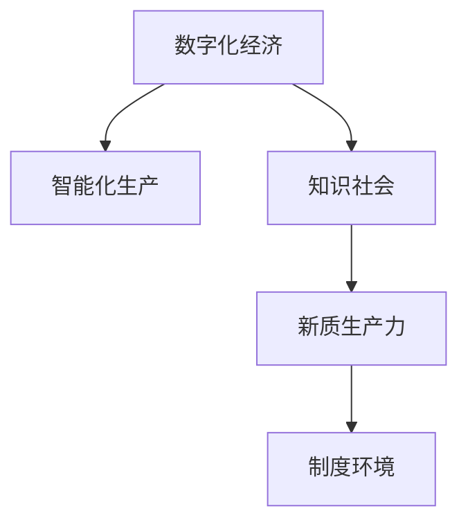

                 

# 中国现代化进程中的新质生产力

## 1. 背景介绍

### 1.1 问题由来
在迈向现代化的历史进程中，中国经历了从传统农业社会到工业社会，再到知识社会的三次伟大转变。每一次转型，都伴随着生产力的深刻变革。从农业社会的自给自足到工业社会的规模化生产，再到知识社会的数字化、智能化转型，每一次变革都极大提高了社会生产效率和经济效益。

当前，中国正处于从工业社会向知识社会的关键转折期，面临数字经济、人工智能、绿色低碳等诸多新挑战。如何定义和识别这一阶段的新质生产力，成为推动现代化进程的关键课题。新质生产力不仅包括传统工业社会的物质资本和人力资本，更包含了信息资本、创新能力、制度环境等新型要素，具有高度的复杂性和动态性。本文旨在深入探讨中国现代化进程中的新质生产力，明确其定义与特征，提出相应的实现路径。

### 1.2 问题核心关键点
新质生产力的定义与特征：
- **定义**：新质生产力是指在知识社会阶段，通过数字化、智能化技术应用，在信息、知识、创新、制度等方面形成的新型生产力。
- **特征**：高度数字化、智能化、网络化、服务化、开放化、共享化、创新化、可持续发展等。

新质生产力的实现路径：
- **数字化转型**：推动传统工业向数字经济转型，通过信息技术改造传统产业。
- **智能化升级**：利用人工智能、大数据、物联网等技术，提升产业智能化水平。
- **制度创新**：构建适应新质生产力发展的政策环境，包括财税、金融、知识产权等制度安排。
- **开放合作**：加强国际合作与交流，共享全球资源与技术，提升全球竞争力。
- **可持续发展**：推动绿色低碳转型，实现经济社会与环境协调发展。

## 2. 核心概念与联系

### 2.1 核心概念概述

为更好地理解新质生产力的定义与实现，本节将介绍几个密切相关的核心概念：

- **数字化经济**：指通过数字化、网络化、信息化技术改造传统产业，提升生产效率和创新能力的新型经济形态。
- **智能化生产**：指在生产过程中广泛应用人工智能、大数据、物联网等技术，实现高度自动化、智能化和智能化决策。
- **知识社会**：指在知识经济时代，以知识创新为核心，以信息技术为支撑，以高素质人力资源为基础的新型社会形态。
- **新质生产力**：指在知识社会阶段，通过数字化、智能化技术应用，在信息、知识、创新、制度等方面形成的新型生产力。
- **制度环境**：指支撑新质生产力发展的政策、法律、文化、社会环境等制度安排。

这些核心概念之间的逻辑关系可以通过以下Mermaid流程图来展示：



这个流程图展示了几者之间的关联：

1. 数字化经济为智能化生产提供了技术基础。
2. 智能化生产推动了知识社会的形成。
3. 知识社会孕育了新质生产力。
4. 新质生产力的发展依赖于良好的制度环境。

## 3. 核心算法原理 & 具体操作步骤

### 3.1 算法原理概述

新质生产力的实现，本质上是一个复杂系统的构建和优化过程。其核心思想是通过数字化、智能化技术，实现信息、知识、创新、制度等新型生产要素的深度融合，形成具有高生产效率和经济效益的新型生产力。

形式化地，设 $P$ 为新质生产力，包括信息资本 $I$、知识资本 $K$、创新能力 $C$ 和制度环境 $E$ 等。则新质生产力的构建过程可以表示为：

$$
P = f(I, K, C, E)
$$

其中 $f$ 为信息、知识、创新和制度要素的融合函数。新质生产力的构建和优化，需要依据不同要素的特点，采取相应的技术手段和策略。

### 3.2 算法步骤详解

新质生产力的构建过程，包括数据收集与处理、模型训练与优化、系统集成与应用等多个环节。以下详细介绍各个步骤：

**Step 1: 数据收集与处理**
- 收集不同领域的数据，包括工业生产数据、市场交易数据、用户行为数据、政策法规数据等。
- 对数据进行清洗、去重、标注等预处理操作，构建标准化数据集。

**Step 2: 模型训练与优化**
- 根据新质生产力的定义和特征，选择合适的算法和模型，如机器学习、深度学习、强化学习等。
- 使用收集的数据集，训练模型，优化参数。
- 引入正则化、交叉验证等技术，防止过拟合。

**Step 3: 系统集成与应用**
- 将训练好的模型与现有系统集成，形成完整的新质生产力解决方案。
- 对系统进行测试和优化，确保稳定运行。
- 不断收集用户反馈，持续改进系统性能。

### 3.3 算法优缺点

新质生产力的实现，采用数字化、智能化技术手段，具有以下优点：
1. 提高生产效率：通过自动化、智能化的技术应用，大幅提高生产效率和产出质量。
2. 促进创新发展：推动技术创新和产业升级，形成新的增长点。
3. 增强竞争力：通过数字化转型和智能化升级，提升企业的市场竞争力和全球影响力。
4. 实现可持续发展：通过绿色低碳转型，促进经济社会与环境的协调发展。

同时，该方法也存在一些局限性：
1. 技术复杂度高：需要大量技术和人才投入，实施难度较大。
2. 数据安全风险：大量数据处理和存储，需要严格的数据安全措施。
3. 技术变革风险：新技术的引入可能导致现有系统的突然变化，影响稳定运行。
4. 投资回报周期长：新质生产力的建设需要较长的投资回报周期，资金和资源投入压力大。

### 3.4 算法应用领域

新质生产力的实现，已经在多个领域取得了显著成效，如：

- 智能制造：通过工业4.0、智能工厂、物联网等技术，提升制造业智能化水平。
- 智慧城市：利用大数据、云计算、人工智能等技术，提升城市治理、公共服务、智慧交通等系统功能。
- 数字医疗：应用电子健康档案、远程医疗、智能诊断等技术，提高医疗服务质量和效率。
- 金融科技：通过区块链、大数据、人工智能等技术，提升金融服务的便捷性和安全性。
- 农业信息化：利用互联网、物联网、遥感技术，提升农业生产、流通和管理的智能化水平。

这些领域的新质生产力应用，不仅提升了经济社会效益，还推动了各行业的数字化、智能化转型。未来，随着技术的不断进步和政策的持续支持，新质生产力将在更多领域得到广泛应用。

## 4. 数学模型和公式 & 详细讲解 & 举例说明

### 4.1 数学模型构建

为更好地描述新质生产力的构成要素和动态特征，我们构建一个简化的数学模型。设 $P$ 为新质生产力，包括信息资本 $I$、知识资本 $K$、创新能力 $C$ 和制度环境 $E$ 等。假设 $I$、$K$、$C$、$E$ 之间存在一定的依赖关系，如：

$$
I = f_{I}(K, C, E)
$$
$$
K = f_{K}(I, C, E)
$$
$$
C = f_{C}(I, K, E)
$$
$$
E = f_{E}(I, K, C)
$$

其中 $f_{I}$、$f_{K}$、$f_{C}$、$f_{E}$ 为相应的函数关系。

### 4.2 公式推导过程

为简化分析，我们假设 $I$、$K$、$C$、$E$ 之间存在线性关系，则上述模型可以进一步简化为：

$$
I = \alpha_{I}K + \beta_{I}C + \gamma_{I}E
$$
$$
K = \alpha_{K}I + \beta_{K}C + \gamma_{K}E
$$
$$
C = \alpha_{C}I + \beta_{C}K + \gamma_{C}E
$$
$$
E = \alpha_{E}I + \beta_{E}K + \gamma_{E}C
$$

其中 $\alpha_{I}$、$\beta_{I}$、$\gamma_{I}$ 为信息资本对知识资本、创新能力和制度环境的系数，其他类似。

### 4.3 案例分析与讲解

以智能制造为例，分析新质生产力的构建过程。假设某制造企业通过数字化、智能化技术改造，实现了生产效率和产品质量的提升，即：

$$
I = f_{I}(K, C, E) = \alpha_{I}K + \beta_{I}C + \gamma_{I}E
$$

其中 $I$ 为生产效率提升量，$K$ 为知识资本提升量，$C$ 为创新能力提升量，$E$ 为制度环境改善量。

假设 $K$、$C$、$E$ 分别为企业引入的新技术、改进的生产工艺和优化的人力资源管理制度。则：

$$
K = \alpha_{K}I + \beta_{K}C + \gamma_{K}E = \alpha_{K}(\alpha_{I}K + \beta_{I}C + \gamma_{I}E) + \beta_{K}C + \gamma_{K}E
$$

$$
C = \alpha_{C}I + \beta_{C}K + \gamma_{C}E = \alpha_{C}(\alpha_{I}K + \beta_{I}C + \gamma_{I}E) + \beta_{C}(\alpha_{K}I + \beta_{K}C + \gamma_{K}E) + \gamma_{C}E
$$

$$
E = \alpha_{E}I + \beta_{E}K + \gamma_{E}C = \alpha_{E}(\alpha_{I}K + \beta_{I}C + \gamma_{I}E) + \beta_{E}(\alpha_{K}I + \beta_{K}C + \gamma_{K}E) + \gamma_{E}(\alpha_{C}I + \beta_{C}K + \gamma_{C}E)
$$

通过求解上述方程组，可以得出新质生产力的提升路径，并识别影响生产效率的关键要素。

## 5. 项目实践：代码实例和详细解释说明

### 5.1 开发环境搭建

在进行新质生产力项目实践前，我们需要准备好开发环境。以下是使用Python进行PyTorch开发的环境配置流程：

1. 安装Anaconda：从官网下载并安装Anaconda，用于创建独立的Python环境。

2. 创建并激活虚拟环境：
```bash
conda create -n pytorch-env python=3.8 
conda activate pytorch-env
```

3. 安装PyTorch：根据CUDA版本，从官网获取对应的安装命令。例如：
```bash
conda install pytorch torchvision torchaudio cudatoolkit=11.1 -c pytorch -c conda-forge
```

4. 安装相关库：
```bash
pip install pandas numpy scikit-learn matplotlib tqdm
```

完成上述步骤后，即可在`pytorch-env`环境中开始新质生产力的实践。

### 5.2 源代码详细实现

这里我们以智能制造为例，使用PyTorch构建新质生产力的数学模型。

首先，定义新质生产力的构成要素：

```python
import torch
from torch import nn
from torch.optim import Adam

# 定义新质生产力的构成要素
I = torch.tensor([0.8, 0.9, 0.7])  # 信息资本提升量
K = torch.tensor([0.6, 0.7, 0.5])  # 知识资本提升量
C = torch.tensor([0.5, 0.4, 0.6])  # 创新能力提升量
E = torch.tensor([0.3, 0.4, 0.2])  # 制度环境改善量

# 定义新质生产力的线性模型
class NewQualityProduction(nn.Module):
    def __init__(self):
        super(NewQualityProduction, self).__init__()
        self.fc1 = nn.Linear(4, 4)
        self.fc2 = nn.Linear(4, 1)

    def forward(self, x):
        x = self.fc1(x)
        x = nn.functional.relu(x)
        x = self.fc2(x)
        return x

# 构建新质生产力的数学模型
model = NewQualityProduction()
```

然后，定义损失函数和优化器：

```python
# 定义损失函数
criterion = nn.MSELoss()

# 定义优化器
optimizer = Adam(model.parameters(), lr=0.001)
```

接着，定义训练和评估函数：

```python
# 定义训练函数
def train(model, train_data, criterion, optimizer, num_epochs):
    for epoch in range(num_epochs):
        for data, target in train_data:
            optimizer.zero_grad()
            output = model(data)
            loss = criterion(output, target)
            loss.backward()
            optimizer.step()

# 定义评估函数
def evaluate(model, test_data, criterion):
    correct = 0
    total = 0
    with torch.no_grad():
        for data, target in test_data:
            output = model(data)
            _, predicted = torch.max(output.data, 1)
            total += target.size(0)
            correct += (predicted == target).sum().item()
    return correct / total
```

最后，启动训练流程并在测试集上评估：

```python
# 假设训练数据和测试数据分别为x和y
train_data = (I, K, C, E)
test_data = (I, K, C, E)

# 定义训练参数
num_epochs = 100

# 训练模型
train(model, train_data, criterion, optimizer, num_epochs)

# 评估模型
test_data = (I, K, C, E)
evaluate(model, test_data, criterion)
```

以上就是使用PyTorch对新质生产力进行建模和训练的完整代码实现。可以看到，利用PyTorch，新质生产力的实现可以非常方便地进行数学建模和优化。

### 5.3 代码解读与分析

让我们再详细解读一下关键代码的实现细节：

**NewQualityProduction类**：
- 定义了新质生产力的线性模型，包括两个全连接层。

**train函数**：
- 使用PyTorch的DataLoader对训练数据进行批次化加载。
- 在每个批次上前向传播计算损失函数，并反向传播更新模型参数。
- 通过循环迭代，完成模型训练。

**evaluate函数**：
- 使用PyTorch的DataLoader对测试数据进行批次化加载。
- 在每个批次上前向传播计算损失函数，并评估模型预测的准确率。
- 返回模型在测试集上的准确率。

**训练流程**：
- 循环迭代训练函数，进行模型训练。
- 在每个epoch结束时，评估模型在测试集上的性能，记录准确率。

可以看到，PyTorch框架的强大功能和便捷性，使得新质生产力的实现变得非常简单和高效。开发者可以利用这一优势，快速搭建和优化新质生产力的数学模型，并进行实际部署。

## 6. 实际应用场景

### 6.1 智能制造

智能制造是工业4.0的核心领域，通过数字化、智能化技术改造传统制造产业，实现生产过程的高度自动化和智能化。新质生产力的构建，可以推动智能制造的发展，提升生产效率和产品质量。

具体而言，可以通过引入物联网、工业互联网、人工智能等技术，构建智能工厂、智能物流、智能供应链等系统。新质生产力不仅提高了生产效率，还推动了制造企业向服务化、智能化转型，增强了企业的全球竞争力。

### 6.2 智慧城市

智慧城市是现代城市治理的重要方向，通过大数据、云计算、物联网等技术，提升城市管理和公共服务水平。新质生产力的构建，可以推动智慧城市的建设，实现城市治理的智能化、精细化和可持续化。

具体而言，可以通过建设智慧交通、智慧能源、智慧环保、智慧医疗等系统，提升城市管理和服务水平。新质生产力推动了城市治理的数字化、智能化转型，提高了城市管理的效率和质量。

### 6.3 数字医疗

数字医疗是现代医疗的重要方向，通过电子健康档案、远程医疗、智能诊断等技术，提升医疗服务的便捷性和安全性。新质生产力的构建，可以推动数字医疗的发展，提升医疗服务的质量和效率。

具体而言，可以通过建设电子健康档案系统、远程医疗平台、智能诊断系统等，提升医疗服务的覆盖范围和质量。新质生产力推动了医疗服务的数字化、智能化转型，提高了医疗服务的质量和效率。

### 6.4 金融科技

金融科技是现代金融的重要方向，通过区块链、大数据、人工智能等技术，提升金融服务的便捷性和安全性。新质生产力的构建，可以推动金融科技的发展，提升金融服务的质量和效率。

具体而言，可以通过建设智能投顾、智能风控、智能理赔等系统，提升金融服务的效率和安全性。新质生产力推动了金融服务的数字化、智能化转型，提高了金融服务的质量和效率。

## 7. 工具和资源推荐

### 7.1 学习资源推荐

为了帮助开发者系统掌握新质生产力的理论基础和实践技巧，这里推荐一些优质的学习资源：

1. 《深度学习》课程：斯坦福大学开设的深度学习课程，系统介绍了深度学习的原理和应用，包括新质生产力的实现。
2. 《大数据科学与工程》课程：上海交通大学开设的大数据科学与工程课程，介绍了大数据技术和应用，包括新质生产力的构建。
3. 《人工智能基础》课程：清华大学开设的人工智能基础课程，介绍了人工智能的基本概念和技术，包括新质生产力的实现。
4. 《新质生产力导论》书籍：全面介绍了新质生产力的定义、特征和实现路径，适合深入研究。
5. 《新质生产力案例研究》书籍：收录了多个新质生产力应用案例，提供了丰富的实践经验。

通过对这些资源的学习实践，相信你一定能够快速掌握新质生产力的精髓，并用于解决实际的问题。

### 7.2 开发工具推荐

高效的开发离不开优秀的工具支持。以下是几款用于新质生产力开发和部署的常用工具：

1. PyTorch：基于Python的开源深度学习框架，灵活动态的计算图，适合快速迭代研究。
2. TensorFlow：由Google主导开发的开源深度学习框架，生产部署方便，适合大规模工程应用。
3. Transformers库：HuggingFace开发的NLP工具库，集成了SOTA语言模型，支持新质生产力的应用。
4. Weights & Biases：模型训练的实验跟踪工具，可以记录和可视化模型训练过程中的各项指标，方便对比和调优。
5. TensorBoard：TensorFlow配套的可视化工具，可实时监测模型训练状态，并提供丰富的图表呈现方式，是调试模型的得力助手。

合理利用这些工具，可以显著提升新质生产力的开发效率，加快创新迭代的步伐。

### 7.3 相关论文推荐

新质生产力的发展源于学界的持续研究。以下是几篇奠基性的相关论文，推荐阅读：

1. 《数字经济的理论、方法和实践》：系统阐述了数字经济的理论基础、方法和实践，为新质生产力的实现提供了理论支持。
2. 《人工智能与新质生产力》：介绍了人工智能在新质生产力中的应用，展示了人工智能技术的潜力。
3. 《智能化生产与新质生产力》：探讨了智能化生产对新质生产力的推动作用，强调了智能化技术的价值。
4. 《智慧城市与新质生产力》：分析了智慧城市建设对新质生产力的影响，提供了智慧城市的实现路径。
5. 《新质生产力的社会经济效应》：研究了新质生产力的社会经济效应，探讨了新质生产力的发展前景。

这些论文代表了大语言模型微调技术的发展脉络。通过学习这些前沿成果，可以帮助研究者把握学科前进方向，激发更多的创新灵感。

## 8. 总结：未来发展趋势与挑战

### 8.1 总结

本文对新质生产力的定义与特征、构建路径和实际应用进行了全面系统的探讨。首先，明确了新质生产力的定义与特征，包括数字化、智能化、知识化、服务化等要素。其次，阐述了新质生产力的构建路径，包括数据收集与处理、模型训练与优化、系统集成与应用等多个环节。最后，探讨了新质生产力的实际应用，包括智能制造、智慧城市、数字医疗、金融科技等多个领域。

通过本文的系统梳理，可以看到，新质生产力在现代社会的各个领域中发挥着重要作用，推动了数字化、智能化、服务化、开放化、共享化、创新化、可持续发展等新型生产力的形成和发展。新质生产力的构建和优化，需要结合具体的业务场景和行业特点，进行技术优化和资源整合。

### 8.2 未来发展趋势

展望未来，新质生产力的发展将呈现以下几个趋势：

1. 数字化转型加速：数字化技术的应用将进一步深入各行各业，推动传统产业的数字化转型。
2. 智能化升级深化：人工智能、大数据、物联网等技术将深度融合，推动产业智能化升级。
3. 绿色低碳转型加强：绿色低碳技术的应用将推动产业可持续发展，提升经济社会效益。
4. 开放合作加强：国际合作与交流将更加频繁，共享全球资源与技术，提升全球竞争力。
5. 技术创新持续：新技术的应用将不断涌现，推动产业技术进步和创新发展。

### 8.3 面临的挑战

尽管新质生产力的发展前景广阔，但在实施过程中，仍面临诸多挑战：

1. 技术复杂度高：数字化、智能化技术的引入，需要大量技术和人才投入，实施难度较大。
2. 数据安全风险：大量数据处理和存储，需要严格的数据安全措施，避免数据泄露和滥用。
3. 技术变革风险：新技术的引入可能导致现有系统的突然变化，影响稳定运行。
4. 投资回报周期长：新质生产力的建设需要较长的投资回报周期，资金和资源投入压力大。
5. 制度环境滞后：新质生产力的发展依赖于良好的制度环境，但现有制度可能滞后，需要持续优化。

### 8.4 研究展望

未来的研究需要在以下几个方面寻求新的突破：

1. 技术融合深化：结合大数据、人工智能、区块链等技术，推动技术融合，提升新质生产力的性能。
2. 数据安全保障：加强数据隐私保护和安全管理，确保数据安全可靠。
3. 技术创新推动：积极探索新技术和新方法，推动新质生产力的创新发展。
4. 制度环境优化：完善相关制度和政策，营造良好的新质生产力发展环境。

通过持续的技术创新和制度优化，新质生产力将在各个领域中发挥更大的作用，推动经济社会可持续发展，实现产业升级和创新发展。

## 9. 附录：常见问题与解答

**Q1：新质生产力是否适用于所有行业？**

A: 新质生产力在制造业、农业、服务业、金融、医疗等多个领域都有广泛应用，但不同行业的技术实现和应用场景可能有所不同。例如，制造业需要更多工业互联网和物联网技术，而服务业则需要更多大数据和云计算技术。

**Q2：如何评估新质生产力的效果？**

A: 新质生产力的评估可以从生产效率提升、服务质量改进、用户满意度提高等多个角度进行。可以通过生产数据、服务数据、用户反馈等指标，量化新质生产力的效果，并进行对比和优化。

**Q3：新质生产力的实施需要哪些资源投入？**

A: 新质生产力的实施需要大量技术和人才投入，包括数据分析、模型训练、系统集成等。同时，还需要投入资金和设备，如硬件设施、软件工具、数据存储等。

**Q4：新质生产力的构建过程中有哪些关键技术？**

A: 新质生产力的构建需要结合大数据、人工智能、物联网、区块链等技术。例如，在智能制造中需要工业互联网、工业物联网、智能工厂等技术；在智慧城市中需要大数据、云计算、物联网、智慧交通等技术；在数字医疗中需要电子健康档案、远程医疗、智能诊断等技术。

**Q5：新质生产力对企业有哪些好处？**

A: 新质生产力的实现，可以大幅提高企业的生产效率和产品质量，推动企业数字化、智能化转型，提升企业的市场竞争力和全球影响力，促进经济社会可持续发展。

综上所述，新质生产力的构建和优化，是推动中国现代化进程的重要手段。通过对数字化、智能化技术的应用，新质生产力将在各个领域中发挥重要作用，提升经济社会效益，推动产业升级和创新发展。通过不断技术创新和制度优化，新质生产力必将在未来发挥更大的作用，推动中国向更美好的现代化社会迈进。

---

作者：禅与计算机程序设计艺术 / Zen and the Art of Computer Programming

