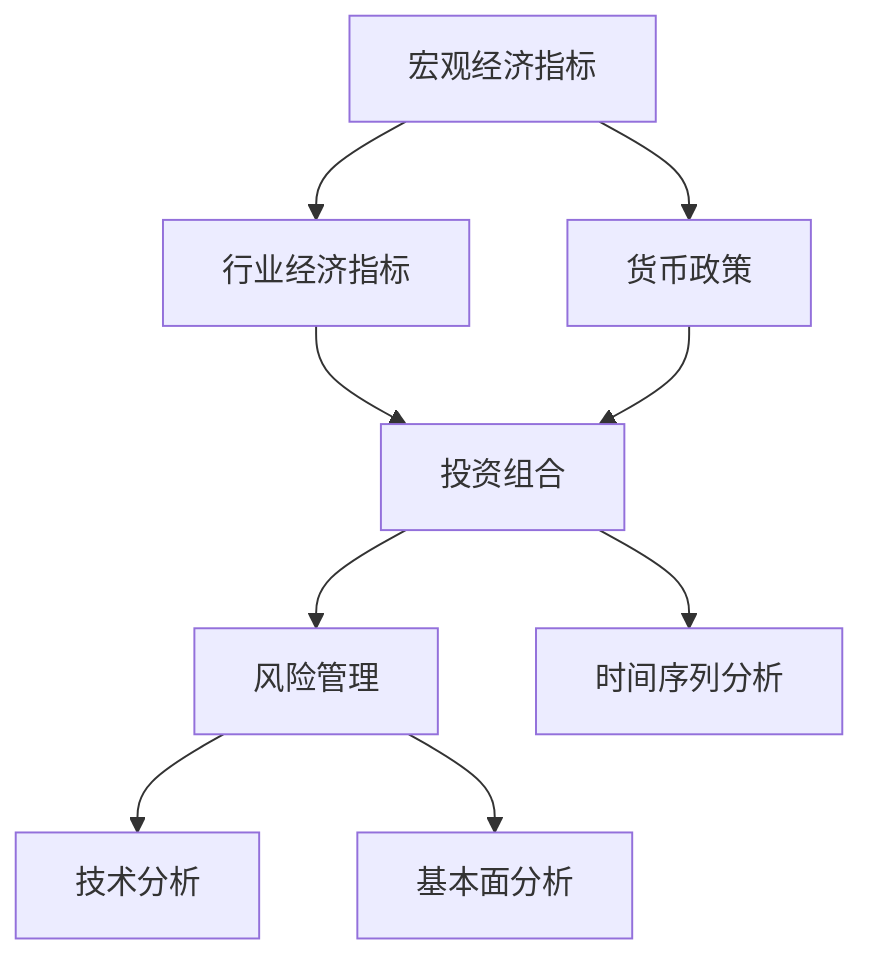

                 

# 中观层面的投资收益变化趋势

## 1. 背景介绍

### 1.1 问题由来
随着金融市场的日趋复杂化和全球化的发展，投资者需要分析的维度越来越多。传统的金融分析往往局限于微观个体层面，例如股票、债券、期货等单一资产。而现代金融市场面临的风险更多来源于系统性的经济环境变化，因此中观层面（包括行业、地区、货币等维度）的分析和预测显得尤为重要。

金融分析师和投资者越来越关注于对中观层面的风险管理和收益分析，以更好地理解宏观经济变化对各类资产价格的影响，并作出合理投资决策。中观层面的分析需要综合运用多种模型和方法，涵盖统计、计量经济学、机器学习等交叉学科。

### 1.2 问题核心关键点
中观层面的投资收益变化趋势涉及多个维度，如行业表现、地区经济状况、货币政策变化等。深入了解和预测这些变化趋势，需要投资者具备全面的市场知识、数据处理能力以及有效的分析工具。

中观分析的核心关键点包括：
- 数据获取：获取各类宏观经济数据、行业数据、公司财报等。
- 数据处理：数据清洗、归一化处理、异常值检测等。
- 模型选择：选择合适的分析模型，如时间序列分析、回归分析、机器学习模型等。
- 模型应用：应用模型进行预测和风险评估。
- 结果解读：理解模型结果，结合实际情况作出投资决策。

## 2. 核心概念与联系

### 2.1 核心概念概述

为更好地理解中观层面的投资收益变化趋势，本节将介绍几个密切相关的核心概念：

- **宏观经济指标（Macroeconomic Indicators）**：如GDP增长率、失业率、通货膨胀率、利率等，这些指标能够反映宏观经济运行状况。
- **行业经济指标（Industry Economic Indicators）**：如行业收入、利润、投资回报率等，这些指标可以衡量特定行业的经济表现。
- **货币政策（Monetary Policy）**：如利率、货币供应量、通货膨胀目标等，这些政策对经济活动和金融市场有重要影响。
- **投资组合（Portfolio）**：由多种资产组成的投资集合，通过对组合的分散化，降低风险，增加收益。
- **风险管理（Risk Management）**：通过评估和控制风险，使投资收益最大化。
- **技术分析（Technical Analysis）**：通过历史价格图表和指标，预测未来价格趋势。
- **基本面分析（Fundamental Analysis）**：通过公司基本面数据，分析其内在价值，做出投资决策。
- **时间序列分析（Time Series Analysis）**：通过分析时间序列数据，预测未来的趋势和周期性。

这些核心概念之间的逻辑关系可以通过以下Mermaid流程图来展示：



这个流程图展示了大语言模型的核心概念及其之间的关系：

1. 宏观经济指标与行业经济指标密切相关，共同影响货币政策。
2. 货币政策和经济指标共同影响投资组合，影响风险管理。
3. 风险管理、技术分析和基本面分析相互配合，用于指导投资决策。
4. 时间序列分析可以单独用于分析趋势和周期性。

## 3. 核心算法原理 & 具体操作步骤
### 3.1 算法原理概述

中观层面的投资收益变化趋势分析涉及多种模型，包括但不限于时间序列分析、回归分析、机器学习模型等。

### 3.2 算法步骤详解

以时间序列分析为例，介绍具体的分析和预测步骤：

**Step 1: 数据收集与预处理**
- 收集历史宏观经济数据、行业数据、货币政策数据等。
- 对数据进行清洗、归一化、异常值检测等预处理。

**Step 2: 模型选择与训练**
- 选择合适的时间序列模型，如ARIMA、LSTM等。
- 划分训练集和测试集，使用训练集数据拟合模型参数。

**Step 3: 模型评估与验证**
- 使用测试集数据评估模型性能。
- 进行交叉验证，避免过拟合。

**Step 4: 结果应用与调整**
- 根据模型预测结果，结合其他分析手段，调整投资策略。
- 定期更新模型参数，适应新数据变化。

**Step 5: 模型迭代与优化**
- 持续优化模型，提高预测准确性。
- 结合最新经济数据，动态调整模型参数。

### 3.3 算法优缺点

时间序列分析的优点包括：
- 可以捕捉历史数据中的趋势和周期性。
- 适用于多种时间序列数据类型，包括非平稳数据。
- 模型简单易懂，易于理解和实现。

时间序列分析的缺点包括：
- 对于复杂的非线性关系，预测效果可能不够理想。
- 数据需求量大，数据收集和处理可能成本较高。
- 模型的选择和参数设置可能较为主观。

### 3.4 算法应用领域

时间序列分析广泛应用于多个领域，包括：
- 金融市场预测：预测股票、债券、期货等资产价格变化。
- 宏观经济预测：预测GDP增长率、通货膨胀率等宏观经济指标。
- 行业分析：分析行业收入、利润等指标变化趋势。
- 风险管理：预测和控制金融风险，优化投资组合。

## 4. 数学模型和公式 & 详细讲解 & 举例说明

### 4.1 数学模型构建

假设收集了从时间$t=1$到$t=n$的宏观经济指标$Y_t$的时间序列数据，构建时间序列模型来预测未来$t=n+1$的$Y_{n+1}$值。

常见的模型包括自回归模型（AR）、移动平均模型（MA）、自回归-移动平均模型（ARMA）以及自回归-移动平均-季节性模型（ARIMA）。

### 4.2 公式推导过程

以ARIMA模型为例，推导时间序列分析的基本公式。

**自回归模型（AR）**
$$ Y_t = \sum_{i=0}^p \phi_i Y_{t-i} + \epsilon_t $$
其中$\phi_i$为自回归系数，$\epsilon_t$为随机误差项。

**移动平均模型（MA）**
$$ Y_t = \mu + \sum_{i=1}^q \theta_i \epsilon_{t-i} $$
其中$\theta_i$为移动平均系数，$\mu$为均值，$\epsilon_t$为随机误差项。

**自回归-移动平均模型（ARMA）**
$$ Y_t = \sum_{i=0}^p \phi_i Y_{t-i} + \sum_{i=1}^q \theta_i \epsilon_{t-i} $$
结合AR和MA模型，能够更全面地描述时间序列的趋势和噪声。

**自回归-移动平均-季节性模型（ARIMA）**
$$ Y_t = \sum_{i=0}^p \phi_i Y_{t-i} + \sum_{i=1}^q \theta_i \epsilon_{t-i} + \theta_s Y_{t-s} $$
其中$s$为季节性周期，$\phi_i$、$\theta_i$、$\theta_s$分别为AR、MA和季节性MA的系数。

### 4.3 案例分析与讲解

以美国GDP增长率的时间序列数据为例，构建ARIMA模型进行分析和预测。

首先，对GDP增长率数据进行平稳性检验，发现存在明显的时间趋势，通过差分处理使其变得平稳：
$$ Y_t - Y_{t-1} = \Delta Y_t $$

然后，构建ARIMA模型，假设使用ARIMA(1,1,1)模型：
$$ \Delta Y_t = \phi_1 \Delta Y_{t-1} + \theta_1 \epsilon_t $$
$$ Y_t = Y_{t-1} + \phi_1(Y_{t-1} - Y_{t-2}) + \theta_1 \epsilon_t $$

使用最小二乘法求解模型参数$\phi_1$和$\theta_1$，得到模型预测公式：
$$ Y_{n+1} = Y_n + \phi_1(Y_n - Y_{n-1}) + \theta_1 \epsilon_n $$

通过历史数据拟合模型参数，得到预测公式，即可进行未来GDP增长率的预测。

## 5. 项目实践：代码实例和详细解释说明

### 5.1 开发环境搭建

在Python中进行时间序列分析，需要先安装pandas、numpy、matplotlib等常用库。

```python
pip install pandas numpy matplotlib statsmodels pyflux
```

### 5.2 源代码详细实现

以下是一个简单的ARIMA模型实现示例，使用pandas和statsmodels库进行数据处理和模型拟合。

```python
import pandas as pd
import numpy as np
import matplotlib.pyplot as plt
from statsmodels.tsa.arima_model import ARIMA

# 读取数据
data = pd.read_csv('gdp_growth.csv', index_col='date', parse_dates=True)

# 平稳性检验
diff_data = data.diff(1).dropna()

# 模型拟合
model = ARIMA(diff_data, order=(1, 1, 1))
results = model.fit()

# 模型预测
forecast = results.forecast(steps=12)
```

### 5.3 代码解读与分析

**读取数据**
- `pd.read_csv`函数用于读取CSV格式的数据文件。
- `index_col='date'`表示将时间列`date`作为行索引。
- `parse_dates=True`表示自动识别并解析时间格式。

**平稳性检验**
- 对GDP增长率数据进行一阶差分，得到平稳的时间序列`diff_data`。
- 使用`pd.diff`函数进行差分处理。
- 使用`dropna`函数删除差分过程中的NaN值。

**模型拟合**
- 使用`statsmodels`库中的`ARIMA`类，构建ARIMA模型。
- 通过`order=(1, 1, 1)`指定模型的AR、MA和季节性MA参数。
- 使用`fit`方法拟合模型，得到模型结果。

**模型预测**
- 使用`forecast`方法进行未来12个月GDP增长率的预测。
- 预测结果保存在`forecast`变量中。

### 5.4 运行结果展示

以下是预测结果的可视化展示，使用matplotlib库绘制预测值和真实值的对比图。

```python
plt.plot(data, label='True Data')
plt.plot(forecast, label='Predicted Data')
plt.legend()
plt.show()
```

## 6. 实际应用场景

### 6.1 宏观经济预测
- 使用ARIMA模型预测GDP增长率、通货膨胀率等宏观经济指标。
- 结合利率变化等货币政策信息，进行宏观经济趋势分析。
- 提供投资者和政策制定者决策支持。

### 6.2 行业分析
- 分析各行业收入、利润、投资回报率等指标变化趋势。
- 预测行业前景和风险，优化投资组合。
- 提供行业选择和配置建议。

### 6.3 风险管理
- 通过时间序列分析，预测金融市场的波动性。
- 利用模型结果进行风险对冲和资产配置。
- 构建动态风险管理策略，提升投资收益。

## 7. 工具和资源推荐

### 7.1 学习资源推荐

- **《金融时间序列分析》**：Christopher M. Jones著，详细介绍时间序列分析在金融领域的应用。
- **Coursera《金融市场分析》课程**：耶鲁大学提供的金融市场分析课程，涵盖时间序列分析、基本面分析等。
- **Kaggle《时间序列分析竞赛》**：通过参加时间序列预测竞赛，学习时间序列分析的实践技能。

### 7.2 开发工具推荐

- **Jupyter Notebook**：强大的交互式编程环境，支持代码展示、可视化等。
- **Python**：丰富的金融分析库，如pandas、numpy、statsmodels等。
- **R语言**：提供强大的统计分析能力，如ggplot2、forecast等。

### 7.3 相关论文推荐

- **《ARIMA模型在金融时间序列预测中的应用》**：陈建新等，详细介绍了ARIMA模型在金融领域的应用。
- **《GARCH模型在股票市场波动性预测中的应用》**：陈春辉等，讨论了GARCH模型在股票市场波动性预测中的应用。
- **《深度学习在金融领域的应用》**：Kalman J. D. & Maas A. C.，介绍了深度学习在金融领域的应用和潜力。

## 8. 总结：未来发展趋势与挑战

### 8.1 总结

本文对中观层面的投资收益变化趋势分析方法进行了全面系统的介绍。首先阐述了中观分析的背景和重要性，明确了分析过程中涉及的关键维度和步骤。其次，从原理到实践，详细讲解了时间序列分析的数学模型和具体实现。同时，本文还广泛探讨了中观分析在宏观经济预测、行业分析、风险管理等多个领域的应用前景，展示了中观分析的巨大潜力。此外，本文精选了中观分析的学习资源和开发工具，力求为读者提供全方位的技术指引。

通过本文的系统梳理，可以看到，中观层面的分析方法在中观层面的投资收益变化趋势分析中扮演了重要的角色。这些方法不仅能够帮助投资者更好地理解市场变化，还能够提供有效的投资策略支持。未来，随着金融市场的复杂化和全球化进程的加快，中观层面的分析方法将得到更广泛的应用，为金融市场带来更多机会和挑战。

### 8.2 未来发展趋势

展望未来，中观层面的投资收益变化趋势分析技术将呈现以下几个发展趋势：

1. **多维度融合分析**：结合宏观经济指标、行业数据、货币政策等多种维度，进行全面综合分析。
2. **动态调整模型**：根据市场变化动态更新模型参数，提高预测准确性。
3. **深度学习应用**：引入深度学习技术，提升模型的非线性拟合能力。
4. **大数据分析**：利用大数据分析技术，挖掘更多隐含的市场信息和趋势。
5. **区块链和智能合约**：结合区块链和智能合约技术，提升交易和风险管理的安全性和透明度。
6. **人工智能集成**：通过与人工智能技术的深度融合，实现更智能的投资决策。

这些趋势凸显了中观层面分析技术的广阔前景。这些方向的探索发展，必将进一步提升中观层面的分析能力，为投资者提供更加精准和高效的投资策略支持。

### 8.3 面临的挑战

尽管中观层面的分析技术已经取得了一定的进展，但在迈向更加智能化和自动化应用的过程中，仍面临诸多挑战：

1. **数据获取和处理**：大量高质量的宏观经济和行业数据难以获取，数据处理复杂且耗时。
2. **模型选择和参数优化**：模型选择和参数设置需要丰富的经验和专业知识。
3. **预测准确性和鲁棒性**：市场波动和数据变化可能导致模型预测不准确或鲁棒性不足。
4. **交易和风险管理**：动态调整投资策略和风险管理需综合考虑多方面因素。
5. **安全和隐私**：数据的获取和使用需确保安全和隐私，防止数据泄露和滥用。

这些挑战需要在技术、方法和实践层面不断改进和优化，才能更好地发挥中观层面分析技术的优势，提升金融市场的决策效率和透明度。

### 8.4 研究展望

面对中观层面分析面临的种种挑战，未来的研究需要在以下几个方面寻求新的突破：

1. **大数据和机器学习**：利用大数据和机器学习技术，提升数据获取和处理效率，提高模型预测准确性。
2. **跨学科融合**：结合经济学、金融学、计算机科学等多学科知识，形成更加全面和系统的分析框架。
3. **实时分析和反馈**：引入实时数据分析和反馈机制，及时调整投资策略和风险管理。
4. **人工智能和自然语言处理**：结合人工智能和自然语言处理技术，提升分析模型的智能性和自然语言理解能力。
5. **区块链和分布式技术**：利用区块链和分布式技术，提高交易和数据处理的透明度和安全性。

这些研究方向的探索，必将引领中观层面分析技术的进一步发展和应用，为金融市场的智能化和高效化提供更多技术支持。

## 9. 附录：常见问题与解答

**Q1: 什么是ARIMA模型？**

A: ARIMA（AutoRegressive Integrated Moving Average）模型是一种常用的时间序列分析模型，用于对非平稳时间序列进行预测。ARIMA模型包括AR（自回归）、I（差分）和MA（移动平均）三个部分，用于捕捉时间序列中的趋势、季节性和噪声。

**Q2: 如何使用ARIMA模型进行金融市场预测？**

A: 1. 收集历史金融市场数据。
2. 对数据进行平稳性检验，必要时进行差分处理。
3. 使用ARIMA模型拟合数据，得到模型参数。
4. 使用模型进行未来市场预测，得到预测结果。
5. 结合实际市场情况，调整投资策略。

**Q3: 时间序列分析有哪些常见问题？**

A: 1. 数据收集和处理复杂，可能存在数据缺失或异常值。
2. 模型选择和参数设置需要专业知识，可能会影响预测结果。
3. 市场波动和数据变化可能导致模型预测不准确或鲁棒性不足。
4. 预测结果需要结合实际市场情况进行调整，需要投资者具备丰富的经验和知识。

**Q4: 如何提升时间序列分析的预测准确性？**

A: 1. 收集更多高质量的数据，进行全面综合分析。
2. 引入深度学习技术，提升模型的非线性拟合能力。
3. 结合大数据分析技术，挖掘更多隐含的市场信息和趋势。
4. 使用动态调整模型，根据市场变化及时更新模型参数。

**Q5: 时间序列分析在金融领域有哪些应用？**

A: 1. 宏观经济预测：预测GDP增长率、通货膨胀率等宏观经济指标。
2. 行业分析：分析各行业收入、利润、投资回报率等指标变化趋势。
3. 风险管理：预测金融市场的波动性，进行风险对冲和资产配置。
4. 投资策略：提供投资组合配置和风险管理建议。

通过以上讨论，我们看到了中观层面投资收益变化趋势分析的重要性和方法论，以及未来可能的发展方向和面临的挑战。这为我们理解中观层面的投资收益变化趋势分析提供了全面的视角，为进一步的研究和应用奠定了基础。

