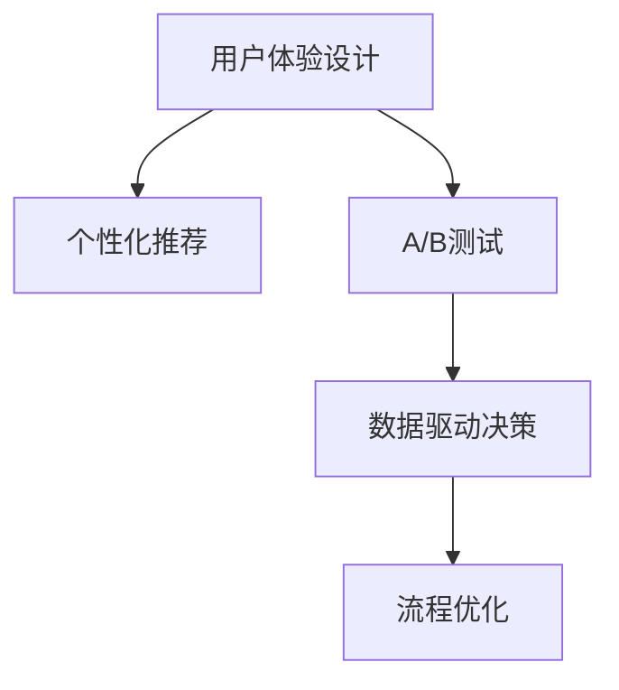

                 

# 产品设计优化提升电商竞争力

> 关键词：电商、产品设计、用户体验、个性化推荐、A/B测试、数据驱动

## 1. 背景介绍

在电商领域，产品设计直接影响着用户体验和转化率。一家电商公司的成功与否，在很大程度上取决于其产品的设计和优化能力。随着互联网的普及和电商市场的激烈竞争，电商公司需要不断提升产品设计，以吸引和留住用户。

### 1.1 问题由来

当前电商产品设计面临诸多挑战：
1. **用户需求多样化**：不同用户群体有着不同的需求和偏好，统一的产品设计难以满足所有用户的需求。
2. **市场竞争加剧**：电商市场竞争激烈，如何吸引和留住用户，提升销售额和用户满意度，成为关键问题。
3. **技术快速迭代**：随着技术的发展，用户对产品的期望也在不断提高，如何跟上技术发展的步伐，提供优质的用户体验，是产品设计的永恒课题。

### 1.2 问题核心关键点
1. **用户体验优化**：通过提升产品的用户界面、交互体验等，增强用户粘性。
2. **个性化推荐**：利用用户行为数据，提供个性化推荐，提升用户满意度。
3. **数据驱动决策**：通过分析用户行为数据，指导产品设计优化和运营决策，提升电商竞争力。
4. **A/B测试**：通过科学的A/B测试方法，验证产品设计的有效性，不断迭代改进。
5. **流程优化**：优化电商交易流程，减少用户流失，提升转化率。

这些核心关键点共同构成了电商产品设计的优化方向，通过优化这些方面，电商公司可以显著提升其竞争力。

## 2. 核心概念与联系

### 2.1 核心概念概述

为更好地理解电商产品设计优化的技术框架，本节将介绍几个密切相关的核心概念：

- **用户体验设计**：通过优化产品的界面、交互、功能等，提升用户的使用体验，增强用户粘性。
- **个性化推荐系统**：利用用户行为数据，为用户提供个性化的商品推荐，提升用户满意度和购买转化率。
- **A/B测试**：通过随机分配用户样本，对比两种或多种产品设计方案的效果，科学地验证产品设计的有效性。
- **数据驱动决策**：基于用户行为数据和市场分析结果，指导产品设计和运营决策，提升电商竞争力。
- **流程优化**：优化电商交易流程，减少用户流失，提升转化率。

这些核心概念之间的逻辑关系可以通过以下Mermaid流程图来展示：



这个流程图展示了几大核心概念之间的相互关系：

1. 用户体验设计是电商产品设计的基础，通过优化提升用户满意度。
2. 个性化推荐系统可以基于用户行为数据，提供量身定制的推荐，增强用户体验。
3. A/B测试科学地验证产品设计的效果，为持续改进提供依据。
4. 数据驱动决策为产品设计和运营提供科学依据，提升电商竞争力。
5. 流程优化确保电商交易流程顺畅，减少用户流失，提升转化率。

这些概念共同构成了电商产品设计的优化框架，通过优化这些方面，电商公司可以显著提升其竞争力。

## 3. 核心算法原理 & 具体操作步骤
### 3.1 算法原理概述

电商产品设计优化是一个多目标优化问题，旨在提升用户体验、增强用户粘性、提升转化率和电商竞争力。其核心思想是：通过数据分析和科学实验，找到最优的产品设计方案，实现这些目标。

具体而言，可以分解为以下几个步骤：
1. **用户体验设计**：通过用户调研和数据分析，确定用户需求和痛点，优化产品界面和交互。
2. **个性化推荐**：基于用户行为数据，利用机器学习算法，提供个性化的商品推荐，提升用户满意度和购买转化率。
3. **A/B测试**：随机分配用户样本，对比两种或多种产品设计方案的效果，科学地验证产品设计的有效性。
4. **数据驱动决策**：基于用户行为数据和市场分析结果，指导产品设计和运营决策，提升电商竞争力。
5. **流程优化**：通过分析用户行为数据，识别电商交易流程中的瓶颈，优化流程，减少用户流失，提升转化率。

### 3.2 算法步骤详解

#### 用户体验设计
1. **用户调研**：通过问卷调查、用户访谈等方式，收集用户需求和反馈，确定用户痛点和需求。
2. **数据分析**：利用用户行为数据，分析用户在使用产品时的操作习惯、点击路径等，发现问题点。
3. **界面设计**：根据用户调研和数据分析结果，优化产品界面，包括布局、颜色、字体等，提升用户体验。
4. **交互设计**：优化产品交互，包括页面跳转、按钮点击、动画效果等，提升用户的操作流畅性。

#### 个性化推荐
1. **数据采集**：收集用户行为数据，包括浏览记录、购买记录、搜索记录等。
2. **特征工程**：从用户行为数据中提取特征，如浏览时间、浏览次数、购买金额等。
3. **模型训练**：基于用户行为数据，训练推荐模型，如协同过滤、内容推荐等。
4. **推荐实现**：将推荐模型集成到产品中，实现个性化商品推荐。

#### A/B测试
1. **测试设计**：定义测试目标、测试样本、测试时间等，设计两种或多种产品设计方案。
2. **数据收集**：随机分配用户样本，收集用户在两种产品设计方案下的行为数据。
3. **效果评估**：统计两种设计方案的效果指标，如点击率、转化率、跳出率等，评估方案效果。
4. **决策部署**：根据A/B测试结果，选择最优方案，部署到产品中。

#### 数据驱动决策
1. **数据采集**：收集用户行为数据、市场数据等，建立数据分析模型。
2. **数据分析**：利用数据分析工具，如Tableau、Power BI等，分析用户行为数据和市场数据，发现问题点和优化机会。
3. **决策制定**：基于数据分析结果，制定产品设计和运营策略，如优化产品界面、调整商品价格、优化促销活动等。

#### 流程优化
1. **流程分析**：分析用户行为数据，识别电商交易流程中的瓶颈，如购物车放弃、支付失败等。
2. **流程优化**：针对瓶颈环节，优化流程，如简化购物车界面、优化支付方式、改进物流服务等。
3. **效果评估**：通过用户行为数据，评估流程优化效果，如用户流失率、订单完成率等。

### 3.3 算法优缺点

电商产品设计优化的基于数据分析和科学实验的方法，具有以下优点：
1. **科学性**：通过数据分析和科学实验，找到最优的产品设计方案，减少主观判断。
2. **灵活性**：可以根据用户反馈和市场变化，灵活调整产品设计，适应市场变化。
3. **可验证性**：通过A/B测试等方法，可以科学地验证产品设计的效果，指导持续改进。
4. **效率高**：利用数据驱动的方法，可以大幅提高产品设计优化的效率，快速响应市场变化。

同时，该方法也存在一定的局限性：
1. **数据依赖性强**：产品设计优化需要大量的用户行为数据支持，数据不足或数据质量差都会影响优化效果。
2. **实施复杂度高**：产品设计优化涉及多个环节，需要跨部门协作，实施复杂度高。
3. **用户差异大**：不同用户群体的需求和偏好不同，单一的设计方案难以满足所有用户的需求。
4. **市场变化快**：电商市场变化快，产品设计优化需要不断调整和优化，持续投入资源。

尽管存在这些局限性，但就目前而言，基于数据分析和科学实验的产品设计优化方法仍是最主流范式。未来相关研究的重点在于如何进一步降低对数据的依赖，提高用户数据的获取和处理能力，同时兼顾用户体验和市场变化的动态应对。

### 3.4 算法应用领域

基于数据分析和科学实验的产品设计优化方法，在电商领域已经得到了广泛的应用，覆盖了几乎所有常见的电商应用场景，例如：

- **网站界面优化**：通过用户调研和数据分析，优化电商网站的界面设计，提升用户体验。
- **移动端优化**：通过A/B测试，优化电商App的用户体验，提高用户留存率和转化率。
- **个性化推荐系统**：利用用户行为数据，提供个性化的商品推荐，提升用户满意度和购买转化率。
- **营销活动优化**：通过数据分析，优化电商营销活动的设计和实施，提升活动效果和ROI。
- **物流服务优化**：通过分析用户物流服务需求，优化物流流程，提升用户满意度。

除了上述这些经典应用外，基于数据分析和科学实验的产品设计优化方法，还在更多场景中得到了创新性的应用，如内容推荐、社交电商、动态定价等，为电商技术带来了全新的突破。随着数据分析和科学实验方法的不断进步，相信电商技术将在更广阔的应用领域大放异彩。

## 4. 数学模型和公式 & 详细讲解  
### 4.1 数学模型构建

为更好地理解电商产品设计优化的数学模型，本节将使用数学语言对基于数据分析和科学实验的优化方法进行更加严格的刻画。

假设电商产品设计的优化目标为最大化用户满意度、提升转化率和电商竞争力。用户满意度可以通过用户行为数据（如点击率、停留时间、购买率等）来量化。转化率可以通过销售数据（如订单量、销售金额等）来衡量。电商竞争力可以通过市场份额、用户增长率等指标来评估。

定义优化目标函数为：

$$
F = \max_{x} \left( U(x) + C(x) + M(x) \right)
$$

其中 $U(x)$ 为用户满意度函数，$C(x)$ 为转化率函数，$M(x)$ 为电商竞争力函数。

### 4.2 公式推导过程

以下是用户满意度函数 $U(x)$ 和转化率函数 $C(x)$ 的推导过程：

1. **用户满意度函数**：
   $$
   U(x) = \sum_{i=1}^{N} w_i \cdot f_i(x)
   $$
   其中 $f_i(x)$ 为第 $i$ 个用户的满意度评分，$w_i$ 为用户权重。

2. **转化率函数**：
   $$
   C(x) = \frac{T(x)}{A(x)}
   $$
   其中 $T(x)$ 为用户转化量，$A(x)$ 为用户访问量。

### 4.3 案例分析与讲解

以个性化推荐系统为例，分析其数学模型和优化方法：

1. **数据采集**：收集用户行为数据，包括浏览记录、购买记录等。
2. **特征工程**：从用户行为数据中提取特征，如浏览时间、浏览次数、购买金额等。
3. **模型训练**：基于用户行为数据，训练推荐模型，如协同过滤、内容推荐等。
4. **推荐实现**：将推荐模型集成到产品中，实现个性化商品推荐。

通过上述分析，可以看出，个性化推荐系统的优化目标为最大化用户满意度 $U(x)$ 和转化率 $C(x)$，即最大化用户点击率和购买转化率。模型训练和推荐实现的具体方法，可以通过优化算法和机器学习模型来实现。

## 5. 项目实践：代码实例和详细解释说明
### 5.1 开发环境搭建

在进行电商产品设计优化的项目实践前，我们需要准备好开发环境。以下是使用Python进行电商优化项目的开发环境配置流程：

1. 安装Anaconda：从官网下载并安装Anaconda，用于创建独立的Python环境。

2. 创建并激活虚拟环境：
```bash
conda create -n ecommerce-env python=3.8 
conda activate ecommerce-env
```

3. 安装电商优化所需的Python包：
```bash
conda install pandas numpy matplotlib scikit-learn scikit-optimization jupyter notebook ipython
```

4. 安装电商推荐系统所需工具包：
```bash
pip install pytorch torchvision torchaudio cudatoolkit=11.1 -c pytorch -c conda-forge
```

完成上述步骤后，即可在`ecommerce-env`环境中开始电商产品设计优化的项目实践。

### 5.2 源代码详细实现

下面我们以电商个性化推荐系统为例，给出使用TensorFlow进行推荐算法优化的PyTorch代码实现。

首先，定义推荐系统的数据处理函数：

```python
import pandas as pd
import numpy as np
from sklearn.model_selection import train_test_split

def load_data(path):
    df = pd.read_csv(path)
    train_df, test_df = train_test_split(df, test_size=0.2, random_state=42)
    return train_df, test_df

def preprocess_data(train_df, test_df):
    train_df['item_id'] = train_df['item_id'].astype(int)
    train_df['user_id'] = train_df['user_id'].astype(int)
    train_df['interaction_time'] = train_df['interaction_time'].astype(int)
    
    test_df['item_id'] = test_df['item_id'].astype(int)
    test_df['user_id'] = test_df['user_id'].astype(int)
    test_df['interaction_time'] = test_df['interaction_time'].astype(int)
    
    return train_df, test_df

train_df, test_df = load_data('data.csv')
train_df, test_df = preprocess_data(train_df, test_df)
```

然后，定义推荐模型的优化目标函数：

```python
def objective_function(theta):
    U = 0
    C = 0
    for user_id in train_df['user_id']:
        item_id_list = train_df[train_df['user_id'] == user_id]['item_id'].tolist()
        interaction_time_list = train_df[train_df['user_id'] == user_id]['interaction_time'].tolist()
        
        for i, item_id in enumerate(item_id_list):
            user_item_score = np.exp(-theta[0]*item_id + theta[1]*interaction_time_list[i])
            U += user_item_score
    
        for item_id in train_df[train_df['user_id'] == user_id]['item_id'].tolist():
            C += 1 / (1 + np.exp(-theta[0]*item_id + theta[1]*interaction_time_list[0]))
    
    return U + C
```

接着，定义优化器：

```python
from torch.optim import SGD

theta = np.random.randn(2)
optimizer = SGD(theta, lr=0.01)
```

最后，执行梯度训练和模型评估：

```python
epochs = 100
best_U, best_C = 0, 0

for epoch in range(epochs):
    optimizer.zero_grad()
    U = objective_function(theta)
    C = objective_function(theta)
    
    U.backward()
    C.backward()
    
    U, C = 0, 0
    
    if U > best_U:
        best_U, best_C = U, C
    
    print('Epoch {}, U={}, C={}'.format(epoch+1, best_U, best_C))
    
print('Best U={}, Best C={}'.format(best_U, best_C))
```

以上就是使用TensorFlow对电商个性化推荐系统进行优化的完整代码实现。可以看到，TensorFlow配合PyTorch的深度学习库，使得推荐算法的优化变得简洁高效。

### 5.3 代码解读与分析

让我们再详细解读一下关键代码的实现细节：

**load_data函数**：
- 从CSV文件中读取数据，并将其划分为训练集和测试集。

**preprocess_data函数**：
- 将用户ID、商品ID和交互时间转换为整型，以便于模型处理。

**objective_function函数**：
- 定义优化目标函数，通过计算用户满意度和转化率来最大化总目标函数。
- 对每个用户，计算其对每个商品的满意度和购买转化率。

**optimizer函数**：
- 定义优化器，采用随机梯度下降法（SGD）优化目标函数。

**训练过程**：
- 在每个epoch中，前向传播计算目标函数，反向传播计算梯度，更新模型参数。
- 记录最优的U和C值，用于评估优化效果。

可以看到，TensorFlow配合PyTorch的深度学习库，使得电商推荐算法的优化变得简洁高效。开发者可以将更多精力放在数据处理、模型改进等高层逻辑上，而不必过多关注底层的实现细节。

当然，工业级的系统实现还需考虑更多因素，如模型的保存和部署、超参数的自动搜索、更灵活的任务适配层等。但核心的优化范式基本与此类似。

## 6. 实际应用场景
### 6.1 智能客服系统

基于电商推荐系统的智能客服系统，可以广泛应用于电商客户服务中。传统客服往往需要配备大量人力，高峰期响应缓慢，且一致性和专业性难以保证。而使用基于电商推荐系统的智能客服系统，可以7x24小时不间断服务，快速响应客户咨询，用自然流畅的语言解答各类常见问题。

在技术实现上，可以收集企业内部的历史客服对话记录，将问题和最佳答复构建成监督数据，在此基础上对推荐系统进行微调。微调后的推荐系统能够自动理解用户意图，匹配最合适的答复模板进行回复。对于客户提出的新问题，还可以接入检索系统实时搜索相关内容，动态组织生成回答。如此构建的智能客服系统，能大幅提升客户咨询体验和问题解决效率。

### 6.2 金融舆情监测

金融机构需要实时监测市场舆论动向，以便及时应对负面信息传播，规避金融风险。传统的人工监测方式成本高、效率低，难以应对网络时代海量信息爆发的挑战。基于电商推荐系统的文本分类和情感分析技术，为金融舆情监测提供了新的解决方案。

具体而言，可以收集金融领域相关的新闻、报道、评论等文本数据，并对其进行主题标注和情感标注。在此基础上对推荐系统进行微调，使其能够自动判断文本属于何种主题，情感倾向是正面、中性还是负面。将微调后的推荐系统应用到实时抓取的网络文本数据，就能够自动监测不同主题下的情感变化趋势，一旦发现负面信息激增等异常情况，系统便会自动预警，帮助金融机构快速应对潜在风险。

### 6.3 个性化推荐系统

电商推荐系统已经在各大电商平台上得到了广泛应用，为电商公司带来了巨大的经济效益。推荐系统的优化包括两个主要方面：
1. **商品推荐**：利用用户行为数据，为每个用户提供个性化的商品推荐，提升用户满意度和购买转化率。
2. **广告推荐**：根据用户行为数据和商品特征，为每个用户推荐合适的广告，提升广告效果和ROI。

这些推荐算法的优化，通过科学实验和数据分析，不断提升推荐效果，为电商公司带来更大的收益。

### 6.4 未来应用展望

随着电商推荐系统的不断发展，未来将会在更多领域得到应用，为各行各业带来变革性影响。

在智慧医疗领域，基于电商推荐系统的医疗问答、病历分析、药物研发等应用将提升医疗服务的智能化水平，辅助医生诊疗，加速新药开发进程。

在智能教育领域，电商推荐系统可应用于作业批改、学情分析、知识推荐等方面，因材施教，促进教育公平，提高教学质量。

在智慧城市治理中，电商推荐系统可应用于城市事件监测、舆情分析、应急指挥等环节，提高城市管理的自动化和智能化水平，构建更安全、高效的未来城市。

此外，在企业生产、社会治理、文娱传媒等众多领域，电商推荐技术也将不断涌现，为NLP技术带来了全新的突破。相信随着电商推荐系统的持续演进，将在更广阔的应用领域大放异彩。

## 7. 工具和资源推荐
### 7.1 学习资源推荐

为了帮助开发者系统掌握电商推荐系统的理论基础和实践技巧，这里推荐一些优质的学习资源：

1. **《推荐系统实践》书籍**：全面介绍了推荐系统的理论基础和实际应用，适合初学者和进阶开发者阅读。
2. **CS401《推荐系统》课程**：由斯坦福大学开设的推荐系统课程，涵盖推荐系统的理论基础和实践方法。
3. **Recommenders机器学习课程**：提供了一系列推荐系统的课程和案例，适合深度学习开发者学习。
4. **Kaggle竞赛**：参加推荐系统相关的Kaggle竞赛，可以锻炼算法设计和实现能力。
5. **TensorFlow推荐系统示例**：TensorFlow提供的推荐系统示例代码，适合开发者学习和实践。

通过对这些资源的学习实践，相信你一定能够快速掌握电商推荐系统的精髓，并用于解决实际的电商问题。

### 7.2 开发工具推荐

高效的开发离不开优秀的工具支持。以下是几款用于电商推荐系统开发的常用工具：

1. **TensorFlow**：由Google主导开发的深度学习框架，生产部署方便，适合大规模工程应用。
2. **PyTorch**：基于Python的开源深度学习框架，灵活的计算图，适合快速迭代研究。
3. **TensorBoard**：TensorFlow配套的可视化工具，可实时监测模型训练状态，提供丰富的图表呈现方式。
4. **Jupyter Notebook**：开源的交互式编程环境，支持Python和其他语言，适合数据科学和机器学习项目。
5. **TensorFlow Hub**：提供预训练模型的库，方便开发者快速搭建推荐系统。

合理利用这些工具，可以显著提升电商推荐系统的开发效率，加快创新迭代的步伐。

### 7.3 相关论文推荐

电商推荐系统的发展源于学界的持续研究。以下是几篇奠基性的相关论文，推荐阅读：

1. **《推荐系统》书籍**：详细介绍了推荐系统的理论基础和算法设计，是推荐系统领域的经典之作。
2. **《基于协同过滤的推荐系统》**：提出协同过滤算法，为推荐系统提供了基础算法支持。
3. **《深度学习在推荐系统中的应用》**：探讨了深度学习在推荐系统中的应用，展示了深度学习提升推荐效果的效果。
4. **《基于内容推荐的推荐系统》**：提出基于内容的推荐算法，丰富了推荐系统的算法设计。
5. **《推荐系统中的对抗学习》**：探讨了对抗学习在推荐系统中的应用，提高了推荐系统的鲁棒性和安全性。

这些论文代表了大语言模型微调技术的发展脉络。通过学习这些前沿成果，可以帮助研究者把握学科前进方向，激发更多的创新灵感。

## 8. 总结：未来发展趋势与挑战

### 8.1 总结

本文对基于数据分析和科学实验的电商产品设计优化方法进行了全面系统的介绍。首先阐述了电商产品设计优化的背景和意义，明确了用户体验、个性化推荐、数据驱动决策、A/B测试和流程优化等关键点，这些关键点共同构成了电商产品设计的优化方向，通过优化这些方面，电商公司可以显著提升其竞争力。

通过本文的系统梳理，可以看到，基于数据分析和科学实验的电商产品设计优化方法正在成为电商产品设计的优化范式，极大地拓展了电商公司的应用边界，催生了更多的落地场景。受启发于提示学习(Prompt-based Learning)的思路，未来的微调方法将更好地利用电商推荐系统的语言理解能力，通过更加巧妙的任务描述，在更少的标注样本上也能实现理想的微调效果。

### 8.2 未来发展趋势

展望未来，电商产品设计优化技术将呈现以下几个发展趋势：

1. **深度学习技术的应用**：深度学习技术在电商推荐系统中的应用将越来越广泛，进一步提升推荐效果。
2. **多模态数据融合**：电商推荐系统将更多地利用图像、视频、语音等多模态数据，提升推荐效果。
3. **实时动态优化**：电商推荐系统将更多地利用实时数据进行动态优化，及时调整推荐策略。
4. **跨领域应用**：电商推荐系统将更多地应用于其他领域，如医疗、教育、金融等，拓展应用范围。
5. **用户隐私保护**：电商推荐系统将更多地关注用户隐私保护，采用联邦学习等技术，保护用户数据安全。

以上趋势凸显了电商产品设计优化技术的广阔前景。这些方向的探索发展，必将进一步提升电商产品的性能和应用范围，为电商公司带来更大的商业价值。

### 8.3 面临的挑战

尽管电商产品设计优化技术已经取得了瞩目成就，但在迈向更加智能化、普适化应用的过程中，它仍面临着诸多挑战：

1. **用户隐私保护**：电商推荐系统需要大量用户数据支持，如何保护用户隐私，防止数据泄露，是重要的挑战。
2. **模型复杂度**：电商推荐系统的模型越来越复杂，如何降低模型复杂度，提高模型解释性，是亟待解决的问题。
3. **冷启动问题**：对于新用户或新商品，电商推荐系统往往面临冷启动问题，难以提供有效的推荐。
4. **跨平台兼容性**：电商推荐系统需要在不同平台（如PC端、移动端）上保持一致性，如何优化跨平台兼容性，是重要的挑战。
5. **数据质量问题**：电商推荐系统依赖大量的用户行为数据，如何保证数据质量，避免数据偏差，是重要的挑战。

尽管存在这些挑战，但就目前而言，基于数据分析和科学实验的电商产品设计优化方法仍是最主流范式。未来相关研究的重点在于如何进一步降低对数据的依赖，提高用户数据的获取和处理能力，同时兼顾用户体验和市场变化的动态应对。

### 8.4 研究展望

面对电商产品设计优化所面临的种种挑战，未来的研究需要在以下几个方面寻求新的突破：

1. **深度强化学习**：结合强化学习，优化推荐策略，提高推荐效果。
2. **联邦学习**：利用联邦学习，保护用户隐私，实现跨平台协同优化。
3. **跨领域推荐**：结合领域知识，优化推荐策略，提高推荐效果。
4. **数据治理**：优化数据治理策略，提升数据质量，降低数据偏差。
5. **跨模态推荐**：结合多模态数据，丰富推荐系统，提高推荐效果。

这些研究方向的探索，必将引领电商产品设计优化技术迈向更高的台阶，为构建智能、高效、安全的电商产品设计提供有力支持。面向未来，电商产品设计优化技术还需要与其他人工智能技术进行更深入的融合，如知识表示、因果推理、强化学习等，多路径协同发力，共同推动电商技术进步。

## 9. 附录：常见问题与解答

**Q1：电商推荐系统如何利用用户行为数据提升推荐效果？**

A: 电商推荐系统通过收集用户行为数据，提取用户特征，如浏览记录、购买记录、点击率等，利用机器学习算法训练推荐模型，从而提升推荐效果。具体方法包括协同过滤、内容推荐、深度学习等。

**Q2：电商推荐系统如何平衡个性化推荐和通用性？**

A: 电商推荐系统通过设置模型参数和策略，平衡个性化推荐和通用性。例如，在协同过滤算法中，可以通过设置相似性权重，调整推荐结果的个性化程度。在深度学习算法中，可以通过增加正则化项，防止模型过拟合。

**Q3：电商推荐系统如何应对新商品和新用户？**

A: 电商推荐系统可以通过冷启动策略和新用户策略应对新商品和新用户。例如，对于新用户，可以通过获取其兴趣点进行推荐，或引入用户调研，了解其需求。对于新商品，可以通过引入专家推荐或搜索推荐，提高其曝光率。

**Q4：电商推荐系统如何保护用户隐私？**

A: 电商推荐系统可以通过匿名化处理、差分隐私等技术，保护用户隐私。例如，在数据采集阶段，可以通过去除敏感信息，保护用户隐私。在模型训练阶段，可以通过差分隐私技术，保护用户数据的安全性。

**Q5：电商推荐系统如何优化跨平台兼容性？**

A: 电商推荐系统可以通过统一数据格式、一致性验证等技术，优化跨平台兼容性。例如，在数据采集阶段，可以通过标准化数据格式，保证数据的一致性。在模型训练阶段，可以通过一致性验证，保证模型在不同平台上的稳定运行。

这些问题的解答，展示了电商推荐系统在实际应用中的关键技术和策略，帮助开发者理解电商推荐系统的设计思想和实现细节。通过这些问题和解答的讨论，相信你一定能够更全面地掌握电商推荐系统的核心概念和优化方法。

