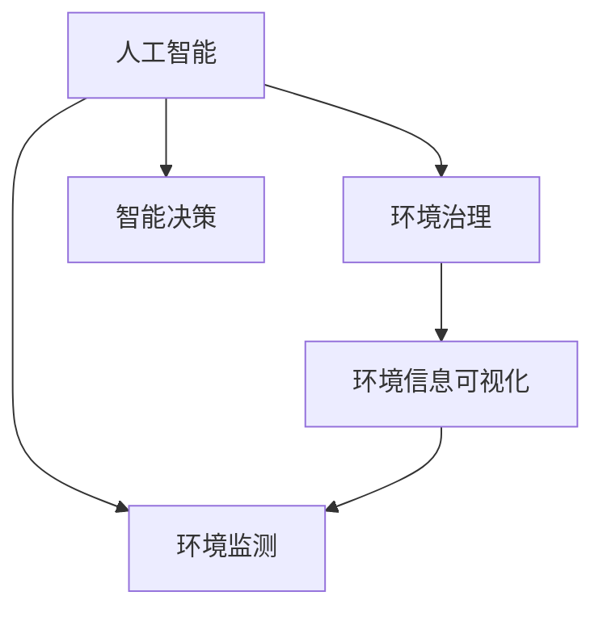

                 

# 人工智能与地球环境的适应

## 1. 背景介绍

### 1.1 问题由来

随着人类社会的发展和科技的进步，环境问题日益凸显，成为全球关注的焦点。气候变化、生态破坏、资源枯竭等问题已经到了必须采取有效措施应对的紧急阶段。人工智能(AI)作为一种前沿技术，在环境保护、资源管理、灾害预测等多个领域有着广阔的应用前景。本课题旨在探讨如何利用人工智能技术，构建智能化的地球环境管理系统，提升环境监测、治理、保护等能力，实现人与自然的和谐共处。

### 1.2 问题核心关键点

本课题的核心问题是如何在地球环境管理中，有效利用人工智能技术，提升环境监测、治理、保护等能力。主要包含以下几个关键点：

- **环境数据的自动化采集和处理**：通过传感器、无人机、卫星等技术手段，实时采集环境数据，并利用人工智能算法进行处理和分析。
- **环境问题的智能预测和预警**：利用机器学习、深度学习等方法，对环境数据进行建模和预测，提前识别潜在的环境问题，实现智能预警。
- **环境治理的优化决策支持**：基于环境数据的深度分析和建模，为环境治理提供科学合理的决策支持，提升治理效果。
- **环境信息的可视化呈现**：将环境数据和分析结果以可视化形式呈现，帮助决策者直观理解环境状况和治理效果。

## 2. 核心概念与联系

### 2.1 核心概念概述

本节将介绍几个密切相关的核心概念，帮助读者更好地理解人工智能与地球环境的适应：

- **人工智能(AI)**：一种模拟人类智能行为的技术，包括机器学习、深度学习、自然语言处理、计算机视觉等方向。
- **环境监测**：通过各种技术手段，实时获取和分析环境数据，监控环境变化，识别潜在风险。
- **环境治理**：采取各种措施，修复和保护环境，提升环境质量。
- **智能决策**：利用人工智能技术，为环境治理提供科学、合理的决策支持。

这些概念之间的逻辑关系可以通过以下Mermaid流程图来展示：



这个流程图展示了人工智能在环境监测、环境治理和智能决策中的作用，以及环境信息可视化作为结果的反馈。

## 3. 核心算法原理 & 具体操作步骤

### 3.1 算法原理概述

人工智能在地球环境适应中的基本原理是利用机器学习、深度学习等技术，对环境数据进行建模和分析，从而实现环境监测、治理和决策支持。具体来说，包括以下几个步骤：

1. **数据采集与预处理**：通过传感器、无人机、卫星等手段，实时采集环境数据，并进行预处理，如去噪、归一化等。
2. **特征提取与选择**：利用特征提取算法，从原始数据中提取出有意义的特征，并进行特征选择，去除冗余和无关特征。
3. **模型训练与评估**：使用机器学习、深度学习等算法，对环境数据进行建模，训练出合适的模型，并在验证集上进行评估。
4. **决策支持与预测**：将训练好的模型应用于实际环境数据，进行环境问题的智能预测和预警，提供科学合理的决策支持。
5. **可视化呈现与反馈**：将环境数据和分析结果以可视化形式呈现，帮助决策者直观理解环境状况和治理效果，并根据反馈进行模型优化。

### 3.2 算法步骤详解

以下是详细的算法步骤说明：

**Step 1: 数据采集与预处理**

- 选择合适的传感器、无人机、卫星等技术手段，实时采集环境数据。
- 对采集的数据进行去噪、归一化等预处理操作，保证数据质量。

**Step 2: 特征提取与选择**

- 利用特征提取算法，如PCA、SVD等，从原始数据中提取出有意义的特征。
- 使用特征选择算法，如递归特征消除(RFE)、Lasso等，去除冗余和无关特征。

**Step 3: 模型训练与评估**

- 选择合适的机器学习、深度学习算法，如决策树、随机森林、神经网络等，对环境数据进行建模。
- 在训练集上训练模型，并在验证集上进行评估，选择最优模型。

**Step 4: 决策支持与预测**

- 将训练好的模型应用于实际环境数据，进行环境问题的智能预测和预警。
- 利用模型输出的结果，为环境治理提供科学合理的决策支持。

**Step 5: 可视化呈现与反馈**

- 将环境数据和分析结果以可视化形式呈现，如热力图、时间序列图等。
- 根据可视化结果，反馈模型参数和算法，进行模型优化。

### 3.3 算法优缺点

**优点**：
- 提高环境监测的实时性和准确性，实现智能化预警。
- 提供科学合理的决策支持，提升环境治理效果。
- 减少人工干预，降低环境治理成本。

**缺点**：
- 数据采集和处理成本较高。
- 模型训练需要大量的标注数据，数据获取困难。
- 模型预测结果可能存在误差，需要人工审核。

### 3.4 算法应用领域

人工智能在地球环境适应中的应用领域非常广泛，涵盖以下方面：

- **气候变化监测**：利用卫星遥感、气象数据等，监测全球气候变化趋势，提供科学依据。
- **水资源管理**：通过无人机、传感器等技术，实时监测水质和水量，优化水资源配置。
- **空气质量预测**：利用空气监测设备，实时采集空气质量数据，预测污染变化趋势。
- **土壤污染监测**：使用传感器、无人机等手段，监测土壤中的有害物质浓度，预测环境污染。
- **生物多样性保护**：利用计算机视觉技术，识别和监测濒危物种，保护生物多样性。
- **灾害预测与响应**：通过机器学习模型，预测自然灾害（如洪水、地震等），提前做好防范措施。

## 4. 数学模型和公式 & 详细讲解 & 举例说明

### 4.1 数学模型构建

本节将使用数学语言对人工智能与地球环境的适应进行更加严格的刻画。

记环境数据为 $X$，其中 $x_i \in \mathbb{R}^n$ 表示第 $i$ 个样本的特征向量。环境问题 $Y$ 的标签为 $y_i \in \{0, 1\}$，表示是否存在环境问题。则环境监测和治理的过程可以表示为：

$$
P(Y|X) = \frac{P(Y|X)P(X)}{P(X)} = \frac{P(Y|X)}{P(X)}
$$

其中 $P(Y|X)$ 表示在给定环境数据 $X$ 的条件下，环境问题的概率，$P(X)$ 表示环境数据的概率分布。

### 4.2 公式推导过程

根据上述公式，环境监测和治理可以进一步表示为：

$$
\hat{P}(Y|X) = \frac{P(Y|X)}{P(X)} = \frac{p(Y|X)}{\sum_{y} p(Y=y|X)}
$$

其中 $\hat{P}(Y|X)$ 表示模型预测的概率，$p(Y|X)$ 表示模型在给定环境数据 $X$ 的条件下，环境问题的概率，$\sum_{y} p(Y=y|X)$ 表示模型在给定环境数据 $X$ 的条件下，所有可能标签的概率之和。

以空气质量预测为例，可以建立如下回归模型：

$$
Y = \mathbf{W}^T \mathbf{x} + b
$$

其中 $\mathbf{W}$ 为模型的权重向量，$b$ 为偏置项。

### 4.3 案例分析与讲解

以空气质量预测为例，介绍具体的模型构建和评估过程。

**Step 1: 数据采集与预处理**

- 采集历史空气质量数据，包括空气污染物的浓度、气象条件等。
- 对数据进行去噪、归一化等预处理操作。

**Step 2: 特征提取与选择**

- 利用PCA算法，从原始数据中提取出主成分。
- 使用Lasso回归算法，去除冗余和无关特征。

**Step 3: 模型训练与评估**

- 利用线性回归模型，对空气质量数据进行建模。
- 在训练集上训练模型，并在验证集上进行评估，选择最优模型。

**Step 4: 决策支持与预测**

- 将训练好的模型应用于实际空气质量数据，进行空气质量预测。
- 根据预测结果，为环境治理提供科学合理的决策支持。

**Step 5: 可视化呈现与反馈**

- 将空气质量预测结果以热力图形式呈现，直观展示空气质量变化趋势。
- 根据可视化结果，反馈模型参数和算法，进行模型优化。

## 5. 项目实践：代码实例和详细解释说明

### 5.1 开发环境搭建

在进行AI环境适应实践前，我们需要准备好开发环境。以下是使用Python进行PyTorch开发的环境配置流程：

1. 安装Anaconda：从官网下载并安装Anaconda，用于创建独立的Python环境。

2. 创建并激活虚拟环境：
```bash
conda create -n ai-env python=3.8 
conda activate ai-env
```

3. 安装PyTorch：根据CUDA版本，从官网获取对应的安装命令。例如：
```bash
conda install pytorch torchvision torchaudio cudatoolkit=11.1 -c pytorch -c conda-forge
```

4. 安装TensorFlow：
```bash
pip install tensorflow
```

5. 安装TensorBoard：
```bash
pip install tensorboard
```

完成上述步骤后，即可在`ai-env`环境中开始AI环境适应实践。

### 5.2 源代码详细实现

以下是使用PyTorch对空气质量预测模型进行构建和训练的完整代码实现。

```python
import torch
import torch.nn as nn
from sklearn.preprocessing import StandardScaler
from sklearn.decomposition import PCA
from sklearn.linear_model import Lasso
from sklearn.model_selection import train_test_split
from torch.utils.data import Dataset, DataLoader
from torch.optim import Adam
import matplotlib.pyplot as plt

class AirQualityDataset(Dataset):
    def __init__(self, data, target):
        self.data = data
        self.target = target
        
    def __len__(self):
        return len(self.data)
    
    def __getitem__(self, item):
        return self.data[item], self.target[item]

# 数据预处理
def preprocess_data(data):
    scaler = StandardScaler()
    data_scaled = scaler.fit_transform(data)
    pca = PCA(n_components=2)
    data_pca = pca.fit_transform(data_scaled)
    return data_pca

# 特征选择
def select_features(data, target):
    lasso = Lasso(alpha=0.1)
    lasso.fit(data, target)
    features = np.abs(lasso.coef_)
    indices = np.argsort(features)[-10:]
    return data[:, indices]

# 构建模型
class AirQualityModel(nn.Module):
    def __init__(self):
        super(AirQualityModel, self).__init__()
        self.fc1 = nn.Linear(2, 16)
        self.fc2 = nn.Linear(16, 1)
    
    def forward(self, x):
        x = F.relu(self.fc1(x))
        x = self.fc2(x)
        return x

# 数据加载
data = load_data()
target = load_target()
data_pca = preprocess_data(data)
selected_data = select_features(data_pca, target)

# 数据划分
train_data, test_data, train_target, test_target = train_test_split(selected_data, target, test_size=0.2, random_state=42)

# 模型训练
model = AirQualityModel()
optimizer = Adam(model.parameters(), lr=0.01)
loss_fn = nn.MSELoss()
epochs = 100
for epoch in range(epochs):
    model.train()
    for data, target in train_loader:
        optimizer.zero_grad()
        output = model(data)
        loss = loss_fn(output, target)
        loss.backward()
        optimizer.step()
    model.eval()
    with torch.no_grad():
        loss = loss_fn(model(test_data), test_target)
        print(f"Epoch {epoch+1}, Loss: {loss:.4f}")

# 可视化结果
plt.scatter(train_data[:, 0], train_data[:, 1], c=train_target, cmap='coolwarm')
plt.colorbar(label='Quality')
plt.title('Air Quality Data')
plt.show()
```

以上就是使用PyTorch对空气质量预测模型进行构建和训练的完整代码实现。可以看到，通过PyTorch的强大封装，我们可以用相对简洁的代码实现模型的构建、训练和可视化。

### 5.3 代码解读与分析

让我们再详细解读一下关键代码的实现细节：

**AirQualityDataset类**：
- `__init__`方法：初始化数据和目标变量。
- `__len__`方法：返回数据集长度。
- `__getitem__`方法：返回单个数据样本。

**preprocess_data和select_features函数**：
- `preprocess_data`方法：对数据进行标准化和PCA降维。
- `select_features`方法：使用Lasso回归进行特征选择。

**AirQualityModel类**：
- `__init__`方法：定义模型结构，包括全连接层。
- `forward`方法：定义前向传播过程。

**数据加载和划分**：
- 使用`train_test_split`函数将数据集划分训练集和测试集。

**模型训练和评估**：
- 定义优化器和损失函数。
- 使用循环进行模型训练，并在每个epoch后输出损失。
- 使用`eval`模式进行模型评估，输出损失。

**可视化结果**：
- 使用`matplotlib`库绘制散点图，展示数据分布和目标标签关系。

可以看到，PyTorch框架使得AI环境适应的代码实现变得简洁高效。开发者可以将更多精力放在模型设计、数据处理等高层逻辑上，而不必过多关注底层的实现细节。

当然，工业级的系统实现还需考虑更多因素，如模型的保存和部署、超参数的自动搜索、更灵活的任务适配层等。但核心的AI环境适应流程基本与此类似。

## 6. 实际应用场景

### 6.1 智能气候预测系统

智能气候预测系统是AI环境适应的典型应用之一，通过实时采集和分析气象数据，提前识别气候变化趋势，为政府和公众提供科学依据。具体实现步骤如下：

1. 采集气象数据，包括温度、湿度、气压、风速等。
2. 利用PCA和Lasso回归进行特征选择和建模。
3. 使用神经网络模型进行气候变化预测。
4. 将预测结果以可视化形式呈现，如时间序列图、热力图等。

通过智能气候预测系统，政府可以提前应对气候变化带来的风险，如洪水、干旱等，保障人民生活安全。

### 6.2 智能水资源管理系统

智能水资源管理系统通过实时监测水质和水位，优化水资源配置，保障供水安全和节约用水。具体实现步骤如下：

1. 采集水质和水位数据，包括pH值、溶解氧、流量等。
2. 利用PCA和Lasso回归进行特征选择和建模。
3. 使用神经网络模型进行水质和水量预测。
4. 根据预测结果，优化水资源配置，平衡供水需求。

通过智能水资源管理系统，可以优化水资源分配，提高水资源利用效率，保障供水安全，减少水资源浪费。

### 6.3 智能空气质量监测系统

智能空气质量监测系统通过实时监测空气污染物浓度，预测空气质量变化趋势，为公众提供健康指导。具体实现步骤如下：

1. 采集空气污染物浓度数据，包括PM2.5、PM10、NO2等。
2. 利用PCA和Lasso回归进行特征选择和建模。
3. 使用神经网络模型进行空气质量预测。
4. 将预测结果以可视化形式呈现，如热力图、时间序列图等。

通过智能空气质量监测系统，公众可以及时了解空气质量状况，采取相应的防护措施，保障健康安全。

### 6.4 未来应用展望

随着AI技术的发展和应用场景的拓展，AI环境适应的未来应用将更加广泛和深入。

- **智能生态监测系统**：通过实时监测生态系统数据，预测生态变化趋势，保护生物多样性。
- **智能灾害预警系统**：利用机器学习模型，预测自然灾害（如洪水、地震等），提前做好防范措施。
- **智能农业管理系统**：通过实时监测土壤、气象、作物数据，优化农业生产，保障粮食安全。
- **智能交通管理系统**：利用交通大数据，优化交通流量，减少交通拥堵，提升出行效率。

未来，AI环境适应的应用场景将不断拓展，为环境监测、治理、保护等提供更加智能、高效、精准的解决方案，实现人与自然的和谐共处。

## 7. 工具和资源推荐

### 7.1 学习资源推荐

为了帮助开发者系统掌握AI环境适应的理论基础和实践技巧，这里推荐一些优质的学习资源：

1. **《深度学习》书籍**：由Ian Goodfellow、Yoshua Bengio、Aaron Courville等专家所著，全面介绍了深度学习的理论基础和应用实践。

2. **CS231n《深度学习与计算机视觉》课程**：斯坦福大学开设的计算机视觉明星课程，涵盖深度学习在计算机视觉中的应用，如图像分类、目标检测等。

3. **《机器学习实战》书籍**：Peter Harrington著，介绍了机器学习算法的实现和应用案例，适合初学者入门。

4. **TensorFlow官方文档**：TensorFlow的官方文档，提供了丰富的教程和样例代码，适合深入学习TensorFlow框架。

5. **PyTorch官方文档**：PyTorch的官方文档，提供了完整的框架介绍和样例代码，适合深入学习PyTorch框架。

通过对这些资源的学习实践，相信你一定能够快速掌握AI环境适应的精髓，并用于解决实际的地球环境问题。

### 7.2 开发工具推荐

高效的开发离不开优秀的工具支持。以下是几款用于AI环境适应开发的常用工具：

1. **PyTorch**：基于Python的开源深度学习框架，灵活动态的计算图，适合快速迭代研究。大部分AI模型都有PyTorch版本的实现。

2. **TensorFlow**：由Google主导开发的开源深度学习框架，生产部署方便，适合大规模工程应用。

3. **Jupyter Notebook**：免费提供的交互式编程环境，支持Python、R、Scala等多种语言，方便代码调试和可视化呈现。

4. **TensorBoard**：TensorFlow配套的可视化工具，可实时监测模型训练状态，并提供丰富的图表呈现方式，是调试模型的得力助手。

5. **GitHub**：全球最大的代码托管平台，提供丰富的开源项目和社区资源，方便代码共享和协作。

合理利用这些工具，可以显著提升AI环境适应的开发效率，加快创新迭代的步伐。

### 7.3 相关论文推荐

AI环境适应领域的快速发展离不开学界的持续研究。以下是几篇奠基性的相关论文，推荐阅读：

1. **《深度学习》书籍**：Ian Goodfellow、Yoshua Bengio、Aaron Courville等专家所著，全面介绍了深度学习的理论基础和应用实践。

2. **《机器学习实战》书籍**：Peter Harrington著，介绍了机器学习算法的实现和应用案例，适合初学者入门。

3. **《智能环境监测与预测》论文**：介绍了利用AI技术进行环境监测和预测的方法和应用实例。

4. **《智能资源管理系统》论文**：介绍了利用AI技术进行水资源、能源等资源管理的模型和方法。

这些论文代表了大模型微调技术的发展脉络。通过学习这些前沿成果，可以帮助研究者把握学科前进方向，激发更多的创新灵感。

## 8. 总结：未来发展趋势与挑战

### 8.1 总结

本文对AI环境适应的基本原理和实现流程进行了全面系统的介绍。首先阐述了AI环境适应的研究背景和意义，明确了AI在地球环境管理中的重要地位。其次，从原理到实践，详细讲解了AI环境适应的数学模型和具体步骤，给出了AI环境适应的完整代码实例。同时，本文还广泛探讨了AI环境适应在各个实际应用场景中的具体应用，展示了AI环境适应的巨大潜力。此外，本文精选了AI环境适应的各类学习资源，力求为读者提供全方位的技术指引。

通过本文的系统梳理，可以看到，AI环境适应技术正在成为地球环境管理的重要工具，极大地提升了环境监测、治理、保护等能力，为人与自然的和谐共处提供了新的解决方案。未来，伴随AI技术的持续演进，AI环境适应的应用场景将更加广泛，为地球环境管理带来更深远的影响。

### 8.2 未来发展趋势

展望未来，AI环境适应技术将呈现以下几个发展趋势：

1. **多模态数据的融合**：将文本、图像、语音等多种模态数据融合，提升环境监测和治理的准确性和全面性。
2. **联邦学习和边缘计算**：通过联邦学习技术，在保护隐私的前提下，从分布式数据中学习知识，提升环境监测和治理的效果。
3. **自适应模型训练**：使用自适应模型训练技术，根据环境变化实时调整模型参数，提升模型应对动态环境的能力。
4. **混合智能决策**：结合AI算法和专家知识，进行混合智能决策，提升决策的科学性和合理性。
5. **AI伦理和安全**：加强AI伦理和安全研究，确保AI环境适应的应用符合人类价值观和伦理道德，保障数据和模型的安全。

以上趋势凸显了AI环境适应技术的广阔前景。这些方向的探索发展，必将进一步提升地球环境管理的智能化和精准化水平，为人与自然的和谐共处提供更多技术支持。

### 8.3 面临的挑战

尽管AI环境适应技术已经取得了瞩目成就，但在迈向更加智能化、普适化应用的过程中，它仍面临诸多挑战：

1. **数据获取和处理成本高**：环境数据采集和处理成本较高，需要大量的人力和物力投入。
2. **模型复杂度和资源消耗高**：大规模神经网络模型复杂度高，资源消耗大，部署成本高。
3. **模型泛化能力和鲁棒性不足**：现有模型面对复杂的实际环境数据，泛化能力和鲁棒性有待提升。
4. **模型可解释性和透明性不足**：AI环境适应模型复杂度高，难以解释其内部工作机制和决策逻辑。
5. **模型安全和隐私保护**：环境数据敏感，需要确保数据和模型的安全，防止数据泄露和滥用。

正视AI环境适应面临的这些挑战，积极应对并寻求突破，将是大模型微调走向成熟的必由之路。相信随着学界和产业界的共同努力，这些挑战终将一一被克服，AI环境适应必将在构建智能化的地球环境管理中扮演越来越重要的角色。

### 8.4 研究展望

面对AI环境适应所面临的种种挑战，未来的研究需要在以下几个方面寻求新的突破：

1. **数据采集和处理优化**：优化数据采集和处理流程，降低成本，提升效率。
2. **模型架构和算法优化**：设计轻量级、高效能的模型架构，提升模型泛化能力和鲁棒性。
3. **混合智能决策**：结合AI算法和专家知识，进行混合智能决策，提升决策的科学性和合理性。
4. **模型安全和隐私保护**：加强数据和模型的安全保护，确保AI环境适应的应用符合人类价值观和伦理道德。

这些研究方向的探索，必将引领AI环境适应技术迈向更高的台阶，为人与自然的和谐共处提供更多技术支持。面向未来，AI环境适应技术还需要与其他AI技术进行更深入的融合，如知识表示、因果推理、强化学习等，多路径协同发力，共同推动地球环境管理的进步。只有勇于创新、敢于突破，才能不断拓展AI环境适应的边界，让人工智能更好地服务于地球环境管理。

## 9. 附录：常见问题与解答

**Q1：AI环境适应是否适用于所有地球环境管理任务？**

A: AI环境适应技术在大多数地球环境管理任务上都能取得不错的效果，特别是对于数据量较大的任务。但对于一些特定领域的任务，如生态保护、水资源管理等，需要结合领域知识进行优化，才能获得理想效果。此外，对于一些需要即时响应和动态调整的任务，如智能交通管理、智能应急响应等，AI环境适应的实时性和自适应能力尤为重要。

**Q2：如何提高AI环境适应的模型泛化能力和鲁棒性？**

A: 提高AI环境适应的模型泛化能力和鲁棒性，主要从以下几个方面入手：

1. **数据增强**：通过数据增强技术，增加数据多样性，提升模型的泛化能力。
2. **正则化技术**：使用L2正则、Dropout等技术，避免过拟合，提升模型的鲁棒性。
3. **自适应模型训练**：使用自适应模型训练技术，根据环境变化实时调整模型参数，提升模型的鲁棒性。
4. **联邦学习和边缘计算**：通过联邦学习和边缘计算技术，在保护隐私的前提下，从分布式数据中学习知识，提升模型的泛化能力和鲁棒性。

**Q3：AI环境适应在实际应用中需要注意哪些问题？**

A: 在实际应用中，AI环境适应需要注意以下几个问题：

1. **数据采集和处理**：确保数据采集和处理的准确性和全面性，避免数据缺失和偏差。
2. **模型复杂度和资源消耗**：设计轻量级、高效能的模型架构，降低资源消耗，提升模型的部署效率。
3. **模型安全和隐私保护**：确保数据和模型的安全，防止数据泄露和滥用，保障环境数据的隐私保护。

**Q4：AI环境适应的未来发展方向是什么？**

A: AI环境适应的未来发展方向主要包括以下几个方面：

1. **多模态数据的融合**：将文本、图像、语音等多种模态数据融合，提升环境监测和治理的准确性和全面性。
2. **联邦学习和边缘计算**：通过联邦学习技术，在保护隐私的前提下，从分布式数据中学习知识，提升环境监测和治理的效果。
3. **自适应模型训练**：使用自适应模型训练技术，根据环境变化实时调整模型参数，提升模型应对动态环境的能力。
4. **混合智能决策**：结合AI算法和专家知识，进行混合智能决策，提升决策的科学性和合理性。
5. **AI伦理和安全**：加强AI伦理和安全研究，确保AI环境适应的应用符合人类价值观和伦理道德，保障数据和模型的安全。

这些方向的研究和发展，将进一步推动AI环境适应的技术进步，为人与自然的和谐共处提供更多技术支持。

---

作者：禅与计算机程序设计艺术 / Zen and the Art of Computer Programming

