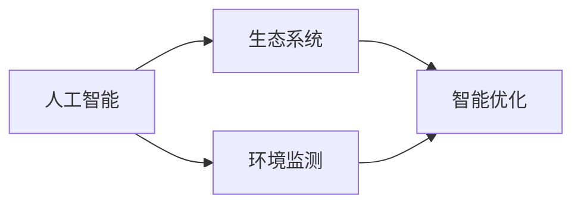

                 

# 人工智能与地球环境的适应

## 1. 背景介绍

在科技迅猛发展的今天，人工智能（AI）已经成为了推动人类社会进步的重要力量。然而，当人工智能与地球环境相互作用时，它所面临的挑战和机遇并存。这一领域的探索不仅需要深入的技术研究，还需要跨学科的合作与知识交流。本文将围绕人工智能在地球环境适应方面的应用进行全面深入的探讨，帮助读者更好地理解这一前沿领域的核心概念与技术。

## 2. 核心概念与联系

### 2.1 核心概念概述

为了全面理解人工智能与地球环境的适应，我们将介绍以下几个核心概念：

- **人工智能（Artificial Intelligence, AI）**：利用计算机模拟人类智能的技术，能够处理语言、视觉、语音等多种信息。
- **地球环境**：指地球上的自然环境，包括大气、水体、生物多样性等，是影响人类生存和发展的关键因素。
- **生态系统**：由生物群落与非生物环境组成的自然系统，具有能量流动、物质循环和信息传递的功能。
- **环境监测**：通过各种传感器、遥感技术等手段，实时监测环境中的各种参数，如温度、湿度、空气质量等。
- **智能优化**：利用人工智能技术对环境监测数据进行分析和优化，实现资源的最优配置和环境保护。

这些概念之间的联系通过以下Mermaid流程图得以展现：



这个流程图表明，人工智能可以通过环境监测获取数据，进而对生态系统进行智能优化，最终实现环境保护和资源管理的目标。

## 3. 核心算法原理 & 具体操作步骤

### 3.1 算法原理概述

人工智能与地球环境的适应主要通过环境监测数据的学习和分析来实现。这一过程通常包括以下步骤：

1. **数据收集**：通过传感器、卫星等技术手段收集环境数据，包括温度、湿度、二氧化碳浓度、水质监测等。
2. **数据预处理**：对原始数据进行清洗、转换和标准化，去除噪声和异常值，确保数据质量。
3. **模型训练**：使用机器学习或深度学习算法，对处理后的数据进行训练，构建环境预测模型。
4. **模型评估**：通过交叉验证等方法，评估模型的性能和泛化能力，确保其在不同环境下的适应性。
5. **智能优化**：利用训练好的模型进行实时监测和预测，对生态系统进行智能调控，如水资源管理、污染控制等。

### 3.2 算法步骤详解

#### 3.2.1 数据收集与预处理

数据收集是整个系统的基础。以水质监测为例，需要收集河流、湖泊中的水质参数，如pH值、溶解氧、氮、磷等。数据预处理包括：

- **清洗**：去除数据中的缺失值、异常值和噪声，确保数据的完整性和准确性。
- **转换**：将不同来源的数据格式和单位统一，便于后续处理。
- **标准化**：对数据进行归一化处理，确保模型训练的稳定性和效率。

#### 3.2.2 模型训练与选择

选择合适的模型是至关重要的。以水质预测为例，常用的模型包括线性回归、支持向量机（SVM）、随机森林（Random Forest）等。以线性回归为例，模型的训练过程包括：

- **特征选择**：从众多环境参数中选取对水质影响最大的特征。
- **模型训练**：使用历史水质数据对模型进行训练，确保模型能够准确预测未来的水质变化。
- **参数调优**：通过交叉验证等方法，调整模型参数，提高模型的预测精度和泛化能力。

#### 3.2.3 模型评估与优化

模型评估是确保模型性能的重要环节。常用的评估指标包括均方误差（Mean Squared Error, MSE）、决定系数（R-squared）等。以MSE为例，其计算公式为：

$$
MSE = \frac{1}{n} \sum_{i=1}^{n} (y_i - \hat{y}_i)^2
$$

其中，$y_i$为真实值，$\hat{y}_i$为模型预测值，$n$为样本数量。

为了优化模型，可以引入以下方法：

- **交叉验证**：将数据分为训练集和验证集，通过交叉验证评估模型性能。
- **集成学习**：将多个模型进行集成，如Adaboost、Bagging、Stacking等，提高模型的预测精度和稳定性。
- **参数微调**：通过网格搜索、随机搜索等方法，调整模型参数，优化模型性能。

#### 3.2.4 智能优化与部署

模型训练完成后，需要将其部署到实际应用中，进行实时监测和智能优化。以智能灌溉为例，通过环境监测数据，预测土壤湿度和温度，自动调整灌溉量，实现节水灌溉。智能优化过程包括：

- **实时监测**：通过传感器实时监测环境参数，如土壤湿度、温度、光照等。
- **数据融合**：将实时监测数据与历史数据进行融合，提高预测精度。
- **智能决策**：基于融合后的数据，利用训练好的模型进行智能决策，自动调整灌溉量，优化水资源利用。

### 3.3 算法优缺点

#### 3.3.1 优点

1. **高效准确**：人工智能技术能够快速处理大量环境数据，提供高效、准确的预测和优化方案。
2. **实时监测**：利用实时监测数据，能够及时发现环境变化，快速采取措施。
3. **智能决策**：通过训练好的模型进行智能决策，实现资源的优化配置和环境保护。

#### 3.3.2 缺点

1. **数据依赖**：模型的性能高度依赖于数据的质量和完整性，数据缺失或不准确会影响模型效果。
2. **模型复杂**：深度学习模型训练复杂，计算资源消耗较大，需要高性能计算设备和大量时间。
3. **解释性不足**：一些深度学习模型（如神经网络）通常是“黑盒”模型，难以解释其内部决策过程，缺乏透明度。

### 3.4 算法应用领域

人工智能在地球环境适应方面的应用广泛，包括但不限于以下几个领域：

- **水质监测**：通过传感器和遥感技术，实时监测水质参数，预测水质变化趋势，进行智能调控。
- **智能灌溉**：利用环境监测数据，预测土壤湿度和温度，自动调整灌溉量，实现节水灌溉。
- **空气质量监测**：通过传感器实时监测空气质量参数，如PM2.5、CO2、NOx等，预测污染趋势，进行智能调控。
- **气候预测**：利用历史气象数据，构建气候预测模型，预测未来的天气变化，进行灾害预警和资源管理。
- **森林火灾监测**：通过卫星遥感技术，实时监测森林火点，预测火灾扩散趋势，进行智能预警和灭火。

## 4. 数学模型和公式 & 详细讲解 & 举例说明

### 4.1 数学模型构建

为了更深入地理解人工智能与地球环境适应的数学模型，我们将构建一个简单的水质预测模型。假设有一个线性回归模型：

$$
y = \beta_0 + \beta_1x_1 + \beta_2x_2 + ... + \beta_nx_n + \epsilon
$$

其中，$y$为水质参数，$x_1, x_2, ..., x_n$为环境参数，$\beta_0, \beta_1, ..., \beta_n$为模型系数，$\epsilon$为误差项。

### 4.2 公式推导过程

假设我们有n个样本，每个样本包含p个特征和一个水质参数。线性回归模型的目标是最小化均方误差：

$$
\min_{\beta_0, \beta_1, ..., \beta_n} \frac{1}{n} \sum_{i=1}^{n} (y_i - \hat{y}_i)^2
$$

其中，$\hat{y}_i$为模型预测值，$y_i$为真实值。

为了求解最小化问题，我们可以使用梯度下降算法：

$$
\beta_j = \beta_j - \alpha \frac{1}{n} \sum_{i=1}^{n} (y_i - \hat{y}_i) \frac{\partial \hat{y}_i}{\partial x_j}
$$

其中，$\alpha$为学习率，$\frac{\partial \hat{y}_i}{\partial x_j}$为模型对$x_j$的偏导数。

### 4.3 案例分析与讲解

假设我们有一个包含p=3个特征的水质监测数据集，特征分别为温度（T）、pH值（pH）、溶解氧（DO），水质参数为氨氮（NH3）。

- **数据准备**：将数据集分为训练集和测试集，分别计算特征和目标变量的均值和标准差，进行标准化处理。
- **模型训练**：使用训练集数据对线性回归模型进行训练，求解模型系数$\beta_0, \beta_1, \beta_2$。
- **模型评估**：在测试集数据上评估模型性能，计算均方误差（MSE）和决定系数（R-squared）。
- **智能优化**：利用训练好的模型对新数据进行预测，实现智能监测和调控。

## 5. 项目实践：代码实例和详细解释说明

### 5.1 开发环境搭建

在进行项目实践前，需要搭建开发环境。以下是Python开发环境的配置步骤：

1. 安装Anaconda：从官网下载并安装Anaconda，用于创建独立的Python环境。

2. 创建并激活虚拟环境：

   ```bash
   conda create -n water-quality python=3.8 
   conda activate water-quality
   ```

3. 安装相关库：

   ```bash
   conda install numpy pandas scikit-learn matplotlib
   pip install tensorflow-gpu
   ```

4. 设置环境变量：

   ```bash
   export PYTHONPATH=/path/to/your/lib:$PYTHONPATH
   ```

### 5.2 源代码详细实现

以下是使用TensorFlow进行水质预测的Python代码实现：

```python
import tensorflow as tf
from tensorflow.keras import layers
from sklearn.model_selection import train_test_split
import numpy as np
import pandas as pd

# 读取数据集
data = pd.read_csv('water_quality.csv')

# 划分数据集
X = data.drop('NH3', axis=1)
y = data['NH3']
X_train, X_test, y_train, y_test = train_test_split(X, y, test_size=0.2, random_state=42)

# 标准化处理
X_train = (X_train - X_train.mean()) / X_train.std()
X_test = (X_test - X_test.mean()) / X_test.std()

# 构建模型
model = tf.keras.Sequential([
    layers.Dense(64, activation='relu', input_shape=(X_train.shape[1],)),
    layers.Dense(64, activation='relu'),
    layers.Dense(1)
])

# 编译模型
model.compile(optimizer='adam', loss='mse', metrics=['mae'])

# 训练模型
model.fit(X_train, y_train, epochs=100, batch_size=32, validation_split=0.2)

# 评估模型
mse = model.evaluate(X_test, y_test)

# 输出结果
print('均方误差:', mse[0])
```

### 5.3 代码解读与分析

让我们详细解读一下关键代码的实现细节：

- **数据准备**：读取数据集，并使用`train_test_split`方法将其划分为训练集和测试集。
- **标准化处理**：对特征进行标准化处理，确保数据符合模型的要求。
- **模型构建**：使用`Sequential`模型构建线性回归模型，包含两个全连接层和一个输出层。
- **模型编译**：使用`compile`方法编译模型，指定优化器、损失函数和评价指标。
- **模型训练**：使用`fit`方法对模型进行训练，指定训练轮数和批次大小。
- **模型评估**：使用`evaluate`方法在测试集上评估模型性能，返回均方误差。

## 6. 实际应用场景

### 6.1 水质监测

水质监测是人工智能与地球环境适应的典型应用之一。通过构建水质预测模型，可以对水质参数进行实时监测和预测，及时发现水质变化趋势，采取相应措施，保护水资源。

#### 6.1.1 数据收集

水质监测主要通过传感器和遥感技术收集数据。例如，在水质监测站安装pH值、溶解氧、氨氮等水质传感器，实时监测水质参数。

#### 6.1.2 数据预处理

收集到的数据需要进行预处理，包括清洗、转换和标准化。使用Python编写数据预处理脚本，对数据进行清洗和标准化处理，确保数据质量。

#### 6.1.3 模型训练

利用预处理后的数据，训练水质预测模型。以线性回归模型为例，使用训练集数据进行模型训练，求解模型系数。

#### 6.1.4 智能优化

利用训练好的模型进行实时监测和预测，自动调整供水、排污等措施，实现智能水资源管理。

### 6.2 智能灌溉

智能灌溉是另一个典型应用场景。通过环境监测数据，预测土壤湿度和温度，自动调整灌溉量，实现节水灌溉。

#### 6.2.1 数据收集

智能灌溉主要通过土壤湿度传感器和温度传感器收集数据。在农田安装传感器，实时监测土壤湿度和温度。

#### 6.2.2 数据预处理

收集到的数据需要进行预处理，包括清洗、转换和标准化。使用Python编写数据预处理脚本，对数据进行清洗和标准化处理，确保数据质量。

#### 6.2.3 模型训练

利用预处理后的数据，训练灌溉量预测模型。以线性回归模型为例，使用训练集数据进行模型训练，求解模型系数。

#### 6.2.4 智能优化

利用训练好的模型进行实时监测和预测，自动调整灌溉量，优化水资源利用。

### 6.3 空气质量监测

空气质量监测是另一个重要应用场景。通过构建空气质量预测模型，可以对空气污染参数进行实时监测和预测，及时发现污染趋势，采取相应措施，保护空气质量。

#### 6.3.1 数据收集

空气质量监测主要通过传感器和遥感技术收集数据。例如，在城市安装PM2.5、CO2、NOx等空气质量传感器，实时监测空气污染参数。

#### 6.3.2 数据预处理

收集到的数据需要进行预处理，包括清洗、转换和标准化。使用Python编写数据预处理脚本，对数据进行清洗和标准化处理，确保数据质量。

#### 6.3.3 模型训练

利用预处理后的数据，训练空气质量预测模型。以线性回归模型为例，使用训练集数据进行模型训练，求解模型系数。

#### 6.3.4 智能优化

利用训练好的模型进行实时监测和预测，自动调整环保措施，优化空气质量管理。

## 7. 工具和资源推荐

### 7.1 学习资源推荐

为了帮助开发者系统掌握人工智能与地球环境适应的理论基础和实践技巧，这里推荐一些优质的学习资源：

1. 《Python机器学习》（Python Machine Learning）：由Sebastian Raschka撰写，全面介绍了机器学习的基本概念和实现方法，是机器学习入门的不二之选。
2. 《深度学习》（Deep Learning）：由Ian Goodfellow、Yoshua Bengio和Aaron Courville合著，全面介绍了深度学习的基本原理和实现技术，是深度学习领域的经典教材。
3. 《机器学习实战》（Machine Learning in Action）：由Peter Harrington撰写，通过实际项目展示了机器学习的实用技能，适合初学者快速上手。
4. 《TensorFlow官方文档》：TensorFlow的官方文档，提供了丰富的教程、示例和API文档，是TensorFlow学习的必备资源。
5. 《Keras官方文档》：Keras的官方文档，提供了易于理解的API文档和示例代码，是Keras学习的最佳途径。

通过对这些资源的学习实践，相信你一定能够快速掌握人工智能与地球环境适应的精髓，并用于解决实际的环境问题。

### 7.2 开发工具推荐

高效的开发离不开优秀的工具支持。以下是几款用于人工智能与地球环境适应开发的常用工具：

1. Python：Python是人工智能领域的主流语言，支持丰富的第三方库和框架，适合快速迭代研究。
2. TensorFlow：由Google主导开发的开源深度学习框架，生产部署方便，适合大规模工程应用。
3. PyTorch：由Facebook主导开发的开源深度学习框架，灵活性高，适合研究领域。
4. Scikit-learn：Python数据科学库，提供丰富的机器学习算法和工具，适合初学者和中级开发者。
5. Jupyter Notebook：Python的交互式开发环境，支持实时计算和数据可视化，适合快速迭代研究。
6. Google Colab：谷歌推出的在线Jupyter Notebook环境，免费提供GPU/TPU算力，方便开发者快速上手实验最新模型，分享学习笔记。

合理利用这些工具，可以显著提升人工智能与地球环境适应任务的开发效率，加快创新迭代的步伐。

### 7.3 相关论文推荐

人工智能与地球环境适应的研究源于学界的持续研究。以下是几篇奠基性的相关论文，推荐阅读：

1. 《基于机器学习的空气质量预测模型》（Machine Learning Approaches for Air Quality Prediction）：提出了一系列基于机器学习的空气质量预测模型，包括线性回归、随机森林、神经网络等，评估了各种模型的性能。
2. 《智能灌溉系统的水质预测与优化》（Water Quality Prediction and Optimization in Smart Irrigation Systems）：提出了一种基于机器学习的智能灌溉系统，利用水质监测数据进行预测和优化，提高了水资源利用效率。
3. 《基于深度学习的气候预测模型》（Deep Learning Models for Climate Prediction）：提出了一种基于深度学习的气候预测模型，利用历史气象数据进行预测，提高了气候预测的准确性和稳定性。
4. 《环境监测中的数据预处理与特征选择》（Data Preprocessing and Feature Selection in Environmental Monitoring）：探讨了数据预处理和特征选择的重要性，提出了一些实用的方法，提高了环境监测数据的质量和预测性能。
5. 《智能优化中的数据融合与算法优化》（Data Fusion and Algorithm Optimization in Smart Optimization）：介绍了智能优化中的数据融合和算法优化方法，提高了智能优化系统的稳定性和性能。

这些论文代表了大语言模型微调技术的发展脉络。通过学习这些前沿成果，可以帮助研究者把握学科前进方向，激发更多的创新灵感。

## 8. 总结：未来发展趋势与挑战

### 8.1 研究成果总结

人工智能与地球环境的适应是一个跨学科的研究领域，涉及环境科学、计算机科学、数据科学等多个学科。近年来，随着技术的不断发展，人工智能在地球环境适应方面的应用取得了显著进展，形成了多个热门研究方向和应用场景。

### 8.2 未来发展趋势

展望未来，人工智能与地球环境的适应将呈现以下几个发展趋势：

1. **数据智能化**：随着物联网技术的发展，越来越多的环境数据被收集和存储，数据质量和安全问题将受到更多关注。未来的研究将进一步提升数据智能化水平，确保数据的高质量和可靠性。
2. **模型多样化**：未来的模型将更加多样化，不仅包括传统的线性回归、神经网络等，还包括深度强化学习、因果推理等新型模型。多样化的模型将带来更广泛的应用场景和更好的预测效果。
3. **计算高效化**：随着计算资源的不断提升，计算效率将成为重要研究方向。未来的研究将致力于提升模型的计算效率，降低计算资源消耗。
4. **智能协同化**：未来的研究将更加注重智能系统的协同化设计，通过跨领域的知识融合，提升系统的智能化水平和适应能力。

### 8.3 面临的挑战

尽管人工智能与地球环境的适应取得了显著进展，但在迈向更加智能化、普适化应用的过程中，仍面临诸多挑战：

1. **数据隐私与安全**：环境监测数据涉及敏感信息，数据隐私和安全问题亟需解决。如何在确保数据安全的前提下，实现数据的共享和利用，是一个重要研究方向。
2. **模型复杂性**：深度学习模型通常比较复杂，计算资源消耗较大，难以进行实时处理和优化。如何简化模型结构，提高模型的计算效率和稳定性，是一个重要挑战。
3. **环境变化**：环境系统具有复杂性，数据和模型的适应性问题亟需解决。如何在环境变化的情况下，持续优化模型，保持其稳定性和鲁棒性，是一个重要挑战。
4. **跨学科合作**：人工智能与地球环境适应的研究需要跨学科合作，不同领域之间的知识交流和整合问题亟需解决。如何在多学科背景下，实现知识融合和协同创新，是一个重要挑战。

### 8.4 研究展望

面对人工智能与地球环境适应所面临的挑战，未来的研究需要在以下几个方面寻求新的突破：

1. **数据预处理与清洗**：进一步提升数据智能化水平，确保数据的高质量和可靠性。引入更多数据清洗和预处理方法，去除噪声和异常值，确保数据完整性和准确性。
2. **模型优化与高效化**：致力于提升模型的计算效率，降低计算资源消耗。引入更多高效算法和优化方法，简化模型结构，提升计算速度和稳定性。
3. **智能协同与融合**：注重智能系统的协同化设计，通过跨领域的知识融合，提升系统的智能化水平和适应能力。引入更多智能融合和协同设计方法，实现多模态数据和知识的有效整合。
4. **安全与隐私保护**：在确保数据安全的前提下，实现数据的共享和利用。引入更多数据安全和隐私保护方法，确保数据隐私和安全。

## 9. 附录：常见问题与解答

**Q1：人工智能在环境监测中的作用是什么？**

A: 人工智能在环境监测中的作用是利用机器学习或深度学习算法，对环境数据进行分析和预测，实现资源的优化配置和环境保护。通过实时监测和预测，可以及时发现环境变化趋势，采取相应措施，保护环境资源。

**Q2：如何评估人工智能在环境监测中的性能？**

A: 评估人工智能在环境监测中的性能，通常使用均方误差（MSE）、决定系数（R-squared）等指标。均方误差表示模型预测值与真实值之间的平均差异，决定系数表示模型对数据变化的解释能力。

**Q3：人工智能在环境监测中面临的主要挑战是什么？**

A: 人工智能在环境监测中面临的主要挑战包括数据隐私与安全、模型复杂性、环境变化等。如何确保数据安全，如何在复杂环境下保持模型稳定性和鲁棒性，是一个重要研究方向。

**Q4：未来人工智能在环境监测中可能的应用场景有哪些？**

A: 未来人工智能在环境监测中可能的应用场景包括水质监测、智能灌溉、空气质量监测、气候预测、森林火灾监测等。通过人工智能技术，可以实时监测和预测环境参数，及时采取相应措施，保护环境资源。

---

作者：禅与计算机程序设计艺术 / Zen and the Art of Computer Programming

