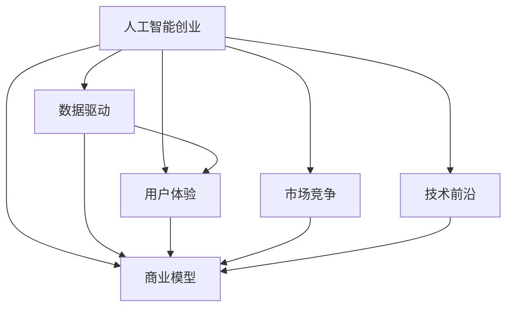

                 

# 人工智能创业：成功的秘诀

> 关键词：人工智能创业, 数据驱动, 用户体验, 商业模型, 市场竞争, 技术前沿

## 1. 背景介绍

### 1.1 问题由来
随着科技的飞速发展和人工智能(AI)技术的逐步成熟，人工智能创业公司如雨后春笋般涌现。但与此同时，成功的人工智能创业公司却少之又少。许多AI初创企业资金耗尽，产品未能达到预期，最终以失败告终。这引发了我们对人工智能创业成功与否的思考：成功的AI企业究竟有哪些秘诀？

### 1.2 问题核心关键点
本文旨在深入探讨人工智能创业成功的重要因素，并提出关键建议。核心关键点包括：

- **数据驱动**：收集和利用高价值的数据，是构建成功AI模型的基石。
- **用户体验**：打造优秀的产品体验，能够吸引并留住用户。
- **商业模型**：构建可行的商业模型，保证企业可持续运营。
- **市场竞争**：在激烈的市场竞争中保持竞争力，是企业长期发展的关键。
- **技术前沿**：持续跟踪技术动态，保持技术领先。

## 2. 核心概念与联系

### 2.1 核心概念概述

为更好地理解人工智能创业的关键要素，本节将介绍几个核心概念及其联系：

- **人工智能创业**：指创建以人工智能技术为基础的初创公司，通过AI模型解决实际问题，获取商业收益。
- **数据驱动**：指依靠大数据和机器学习技术进行决策和产品开发，使公司具备更强的市场竞争力。
- **用户体验**：指从用户角度出发，设计满足用户需求的产品和服务。
- **商业模型**：指企业实现收入和利润的商业模式，包括产品、客户、渠道等要素。
- **市场竞争**：指在市场中与竞争对手进行竞争，保持自身优势。
- **技术前沿**：指关注和掌握最新的人工智能技术动态，保持技术领先地位。

这些概念之间的逻辑关系可以通过以下Mermaid流程图来展示：



这个流程图展示了人工智能创业中各个要素之间的相互作用和影响：

1. **数据驱动**和**用户体验**直接支撑企业的产品和服务质量。
2. **商业模型**和**市场竞争**关注企业的收入和市场地位。
3. **技术前沿**则决定企业是否能够持续创新，保持领先。

## 3. 核心算法原理 & 具体操作步骤
### 3.1 算法原理概述

人工智能创业成功依赖于多个方面的综合考量，包括产品设计、市场推广、用户获取与留存、商业模式构建等。下面将从算法原理的角度，对人工智能创业进行深入分析。

**3.1.1 数据驱动**
数据驱动是人工智能创业的核心要素。通过大数据和机器学习技术，企业能够更准确地理解市场需求、用户行为和竞争态势，从而做出更科学的决策。

**3.1.2 用户体验**
用户体验是衡量产品是否成功的关键指标。优秀的用户体验能够提高用户满意度和留存率，降低用户流失。

**3.1.3 商业模型**
商业模型决定了企业如何盈利，是企业能否长期生存和发展的关键。良好的商业模型能够确保企业的收入和利润，从而支持技术的研发和市场的扩展。

**3.1.4 市场竞争**
在激烈的市场竞争中，企业需要不断提升自身的市场份额和竞争力。这不仅依赖于产品和技术，还需要优秀的市场策略和品牌建设。

**3.1.5 技术前沿**
持续关注和掌握人工智能技术的前沿动态，能够使企业保持技术领先，从而在市场上具有竞争优势。

### 3.2 算法步骤详解

基于上述核心要素，人工智能创业的成功可以通过以下算法步骤来具体操作：

**Step 1: 数据采集与处理**
- 收集用户行为数据、市场数据和竞争态势数据。
- 对数据进行清洗和预处理，确保数据的质量和一致性。

**Step 2: 模型构建与训练**
- 根据业务需求选择合适的机器学习模型，如回归模型、分类模型、聚类模型等。
- 利用历史数据进行模型训练，优化模型参数。

**Step 3: 产品设计与优化**
- 基于用户需求和数据驱动的洞察，设计符合用户期望的产品。
- 通过用户反馈和A/B测试不断优化产品。

**Step 4: 市场推广与用户获取**
- 利用SEO、SEM、社交媒体等渠道进行市场推广。
- 通过用户获取策略，如优惠活动、推荐机制等，吸引用户注册和使用产品。

**Step 5: 用户留存与转化**
- 设计用户留存策略，如定期推送、个性化推荐等，提高用户留存率。
- 优化产品功能和使用体验，促进用户转化和价值提升。

**Step 6: 商业模型设计**
- 根据产品特点和市场需求，设计适合的商业模式，如订阅模式、免费模式、付费模式等。
- 通过业务分析，不断调整商业模型以适应市场变化。

**Step 7: 持续迭代与创新**
- 持续关注人工智能技术的发展，保持技术领先。
- 通过不断迭代和创新，保持产品的竞争力和市场地位。

### 3.3 算法优缺点

人工智能创业中数据驱动、用户体验、商业模型、市场竞争和技术前沿的算法，具有以下优缺点：

**优点：**
- 数据驱动能够提供更科学和客观的决策依据，减少人为失误。
- 优秀的用户体验能够提升用户满意度和留存率。
- 良好的商业模型能够确保企业的可持续运营和盈利。
- 持续的技术创新能够保持企业的市场竞争力和技术领先地位。

**缺点：**
- 数据采集和处理需要大量时间和资源，初期投入较高。
- 用户体验设计和优化需要不断测试和改进，过程复杂。
- 商业模型设计需要深入市场调研和分析，难度较大。
- 市场竞争激烈，需要不断调整策略和创新。

## 4. 数学模型和公式 & 详细讲解 & 举例说明

### 4.1 数学模型构建

人工智能创业的算法模型通常包括数据模型、用户模型、市场模型和技术模型。这些模型通过数学公式和算法来描述和预测企业行为和市场动态。

**4.1.1 数据模型**
数据模型用于描述和预测用户行为和市场趋势。常见的数据模型包括线性回归模型、逻辑回归模型、决策树模型等。

**4.1.2 用户模型**
用户模型用于描述用户特征和行为，从而更好地设计产品和服务。用户模型可以基于用户历史数据和行为数据进行建模，常见的模型包括K-Means聚类模型、协同过滤模型等。

**4.1.3 市场模型**
市场模型用于描述和预测市场规模、竞争态势和用户需求。市场模型可以基于市场数据和竞争数据进行建模，常见的模型包括回归模型、时间序列模型等。

**4.1.4 技术模型**
技术模型用于描述和预测人工智能技术的发展趋势。技术模型可以基于技术论文、专利数据等进行建模，常见的模型包括神经网络模型、深度学习模型等。

### 4.2 公式推导过程

以用户模型为例，介绍如何构建用户行为预测模型。假设用户i在时间t的行为数据为$(x_{ti},y_{ti})$，其中$x_{ti}$为特征向量，$y_{ti}$为目标变量。通过历史数据构建用户行为预测模型$f(x_{ti},\theta)=y_{ti}$，其中$\theta$为模型参数。

设模型采用线性回归模型，则预测公式为：
$$
f(x_{ti},\theta)=\theta_0+\theta_1x_{ti1}+\theta_2x_{ti2}+\ldots+\theta_nx_{ti_n}
$$

### 4.3 案例分析与讲解

以某电商公司为例，介绍如何利用数据驱动和用户体验构建成功的商业模型。假设该电商公司收集了用户的浏览记录、购买记录、评价记录等数据，并构建了用户行为预测模型。通过对用户行为进行预测，公司可以设计符合用户期望的产品，提高用户满意度和留存率。

同时，公司通过A/B测试和用户反馈，不断优化产品功能和用户体验，从而提升用户转化率和价值。此外，公司还通过市场调研和竞争分析，设计了合理的商业模型，确保企业的可持续运营和盈利。

## 5. 项目实践：代码实例和详细解释说明

### 5.1 开发环境搭建

在进行人工智能创业项目开发前，我们需要准备好开发环境。以下是使用Python进行项目开发的详细环境配置流程：

1. 安装Anaconda：从官网下载并安装Anaconda，用于创建独立的Python环境。

2. 创建并激活虚拟环境：
```bash
conda create -n pytorch-env python=3.8 
conda activate pytorch-env
```

3. 安装PyTorch：根据CUDA版本，从官网获取对应的安装命令。例如：
```bash
conda install pytorch torchvision torchaudio cudatoolkit=11.1 -c pytorch -c conda-forge
```

4. 安装TensorFlow：如果项目需要使用TensorFlow，可以使用以下命令安装：
```bash
pip install tensorflow
```

5. 安装相关依赖库：
```bash
pip install numpy pandas scikit-learn torch
```

完成上述步骤后，即可在`pytorch-env`环境中开始项目开发。

### 5.2 源代码详细实现

以某电商公司为例，介绍如何使用Python和PyTorch进行用户行为预测和商业模型设计。

**Step 1: 数据采集与处理**
- 使用Python的pandas库，读取用户行为数据和市场数据，并进行数据清洗和预处理。

```python
import pandas as pd

# 读取用户数据
user_data = pd.read_csv('user_data.csv')
# 数据清洗和预处理
user_data = user_data.dropna().drop_duplicates().reset_index(drop=True)
```

**Step 2: 模型构建与训练**
- 使用PyTorch库，构建用户行为预测模型，并进行训练。

```python
import torch
import torch.nn as nn
from torch.utils.data import DataLoader
from torch.optim import Adam

# 定义模型
class UserBehaviorModel(nn.Module):
    def __init__(self):
        super(UserBehaviorModel, self).__init__()
        self.fc1 = nn.Linear(10, 10)
        self.fc2 = nn.Linear(10, 1)

    def forward(self, x):
        x = self.fc1(x)
        x = torch.sigmoid(self.fc2(x))
        return x

# 训练模型
model = UserBehaviorModel()
criterion = nn.BCELoss()
optimizer = Adam(model.parameters(), lr=0.01)
train_loader = DataLoader(user_data, batch_size=32, shuffle=True)
for epoch in range(100):
    for batch_idx, (data, target) in enumerate(train_loader):
        optimizer.zero_grad()
        output = model(data)
        loss = criterion(output, target)
        loss.backward()
        optimizer.step()
```

**Step 3: 产品设计与优化**
- 基于用户行为预测模型，设计符合用户期望的产品，并通过用户反馈不断优化产品。

**Step 4: 市场推广与用户获取**
- 利用SEO、SEM、社交媒体等渠道进行市场推广。
- 通过用户获取策略，如优惠活动、推荐机制等，吸引用户注册和使用产品。

**Step 5: 用户留存与转化**
- 设计用户留存策略，如定期推送、个性化推荐等，提高用户留存率。
- 优化产品功能和使用体验，促进用户转化和价值提升。

**Step 6: 商业模型设计**
- 根据产品特点和市场需求，设计适合的商业模式，如订阅模式、免费模式、付费模式等。
- 通过业务分析，不断调整商业模型以适应市场变化。

**Step 7: 持续迭代与创新**
- 持续关注人工智能技术的发展，保持技术领先。
- 通过不断迭代和创新，保持产品的竞争力和市场地位。

### 5.3 代码解读与分析

让我们再详细解读一下关键代码的实现细节：

**Step 1: 数据采集与处理**
- 使用pandas库，读取和清洗用户行为数据和市场数据，确保数据质量。

**Step 2: 模型构建与训练**
- 定义用户行为预测模型，并使用PyTorch进行训练。通过定义模型结构、损失函数和优化器，进行模型训练。

**Step 3: 产品设计与优化**
- 根据用户行为预测模型，设计符合用户期望的产品，并通过A/B测试和用户反馈不断优化产品。

**Step 4: 市场推广与用户获取**
- 利用SEO、SEM、社交媒体等渠道进行市场推广，吸引用户注册和使用产品。

**Step 5: 用户留存与转化**
- 设计用户留存策略，如定期推送、个性化推荐等，提高用户留存率。
- 优化产品功能和使用体验，促进用户转化和价值提升。

**Step 6: 商业模型设计**
- 根据产品特点和市场需求，设计适合的商业模式，如订阅模式、免费模式、付费模式等。
- 通过业务分析，不断调整商业模型以适应市场变化。

**Step 7: 持续迭代与创新**
- 持续关注人工智能技术的发展，保持技术领先。
- 通过不断迭代和创新，保持产品的竞争力和市场地位。

## 6. 实际应用场景

### 6.1 智能客服系统

基于人工智能创业的成功秘诀，智能客服系统能够实现7x24小时不间断服务，快速响应客户咨询，用自然流畅的语言解答各类常见问题。在技术实现上，可以收集企业内部的历史客服对话记录，将问题和最佳答复构建成监督数据，在此基础上对预训练对话模型进行微调。微调后的对话模型能够自动理解用户意图，匹配最合适的答案模板进行回复。对于客户提出的新问题，还可以接入检索系统实时搜索相关内容，动态组织生成回答。

### 6.2 金融舆情监测

金融机构需要实时监测市场舆论动向，以便及时应对负面信息传播，规避金融风险。传统的人工监测方式成本高、效率低，难以应对网络时代海量信息爆发的挑战。基于人工智能创业的成功秘诀，微调技术可应用于金融舆情监测，收集金融领域相关的新闻、报道、评论等文本数据，并对其进行主题标注和情感标注。在此基础上对预训练语言模型进行微调，使其能够自动判断文本属于何种主题，情感倾向是正面、中性还是负面。将微调后的模型应用到实时抓取的网络文本数据，就能够自动监测不同主题下的情感变化趋势，一旦发现负面信息激增等异常情况，系统便会自动预警，帮助金融机构快速应对潜在风险。

### 6.3 个性化推荐系统

当前的推荐系统往往只依赖用户的历史行为数据进行物品推荐，无法深入理解用户的真实兴趣偏好。基于人工智能创业的成功秘诀，个性化推荐系统可以更好地挖掘用户行为背后的语义信息，从而提供更精准、多样的推荐内容。在实践中，可以收集用户浏览、点击、评论、分享等行为数据，提取和用户交互的物品标题、描述、标签等文本内容。将文本内容作为模型输入，用户的后续行为（如是否点击、购买等）作为监督信号，在此基础上微调预训练语言模型。微调后的模型能够从文本内容中准确把握用户的兴趣点。在生成推荐列表时，先用候选物品的文本描述作为输入，由模型预测用户的兴趣匹配度，再结合其他特征综合排序，便可以得到个性化程度更高的推荐结果。

### 6.4 未来应用展望

随着人工智能创业成功秘诀的不断发展，未来人工智能技术将在更多领域得到应用，为传统行业带来变革性影响。在智慧医疗领域，基于人工智能创业的成功秘诀，构建智能诊疗系统，实现智能诊断、个性化治疗等，提升医疗服务的智能化水平。在智能教育领域，通过收集和分析学生的学习行为数据，提供个性化的学习建议和辅导，因材施教，促进教育公平，提高教学质量。在智慧城市治理中，利用人工智能技术进行城市事件监测、舆情分析、应急指挥等，提高城市管理的自动化和智能化水平，构建更安全、高效的未来城市。此外，在企业生产、社会治理、文娱传媒等众多领域，基于人工智能创业的成功秘诀的人工智能应用也将不断涌现，为经济社会发展注入新的动力。

## 7. 工具和资源推荐

### 7.1 学习资源推荐

为了帮助开发者系统掌握人工智能创业的成功秘诀，这里推荐一些优质的学习资源：

1. 《人工智能创业实战指南》系列书籍：由知名AI创业专家撰写，涵盖从产品设计到商业模式构建的全流程实战经验。

2. Coursera《人工智能创业》课程：斯坦福大学开设的创业课程，结合实际案例，讲解人工智能创业的关键要素。

3. 《人工智能创业案例分析》一书：收集了大量成功的AI创业案例，提供丰富的学习和借鉴素材。

4. HuggingFace官方博客：HuggingFace官方博客，定期发布最新的AI创业和技术动态，是了解前沿信息的重要渠道。

5. Kaggle竞赛平台：Kaggle数据科学竞赛平台，提供丰富的数据集和挑战题目，实践机器学习算法和产品设计。

通过对这些资源的学习实践，相信你一定能够快速掌握人工智能创业的成功秘诀，并用于解决实际的AI问题。

### 7.2 开发工具推荐

高效的开发离不开优秀的工具支持。以下是几款用于人工智能创业开发的常用工具：

1. Jupyter Notebook：免费的交互式编程环境，支持Python、R等多种语言，非常适合AI项目的开发和调试。

2. VS Code：功能强大的IDE，支持丰富的扩展和插件，支持多种语言开发。

3. Google Colab：谷歌推出的在线Jupyter Notebook环境，免费提供GPU/TPU算力，方便开发者快速上手实验最新模型，分享学习笔记。

4. PyTorch Lightning：基于PyTorch的快速原型开发和模型训练框架，适合快速迭代研究。

5. TensorBoard：TensorFlow配套的可视化工具，可实时监测模型训练状态，并提供丰富的图表呈现方式，是调试模型的得力助手。

6. Weights & Biases：模型训练的实验跟踪工具，可以记录和可视化模型训练过程中的各项指标，方便对比和调优。

合理利用这些工具，可以显著提升人工智能创业项目的开发效率，加快创新迭代的步伐。

### 7.3 相关论文推荐

人工智能创业成功秘诀的研究源于学界的持续研究。以下是几篇奠基性的相关论文，推荐阅读：

1. "The Startup Journey: From Idea to IPO"：由知名的创业教练乔纳森·特鲁尔(Jonathan Truelove)撰写，详细讲解了从创意产生到IPO的全流程。

2. "AI Ventures: The New Frontier of Innovation"：谷歌的创始投资人提供的新兴技术创业指南，探讨了AI在商业中的巨大潜力。

3. "How to Build a Startup That Changes the World"：著名创业家布兰登·费舍尔(Brandon Fish)的创业实战经验分享，提供实用的创业建议和案例分析。

4. "Machine Learning Yearning"：谷歌人工智能负责人Andrew Ng教授的机器学习实战指南，涵盖从数据收集到模型部署的全流程。

5. "The Lean Startup"：Eric Ries的创业经典著作，介绍了精益创业的理念和方法，是创业者和产品经理必读之作。

这些论文代表了大规模人工智能创业成功秘诀的研究脉络。通过学习这些前沿成果，可以帮助研究者把握学科前进方向，激发更多的创新灵感。

## 8. 总结：未来发展趋势与挑战

### 8.1 总结

本文对人工智能创业成功秘诀进行了全面系统的介绍。首先阐述了数据驱动、用户体验、商业模型、市场竞争和技术前沿的重要作用，明确了这些要素在人工智能创业中的核心地位。其次，从算法原理和操作步骤的角度，详细讲解了人工智能创业的数学模型和公式，提供了详细的代码实例和解读分析。最后，我们探讨了人工智能创业在未来各领域的应用前景，并推荐了相关的学习资源和开发工具。

通过本文的系统梳理，可以看到，人工智能创业的成功秘诀需要在数据、产品、市场、技术等多个维度进行全面优化，才能实现长久的成功。未来，伴随人工智能技术的不断演进和创新，人工智能创业将迎来更加广阔的发展空间，为各行各业带来深刻变革。

### 8.2 未来发展趋势

展望未来，人工智能创业的发展趋势包括以下几个方面：

1. **数据驱动的深度学习**：数据驱动的深度学习技术将不断优化，提升企业的决策能力和产品竞争力。

2. **用户中心的体验设计**：更加注重用户体验，通过迭代优化，提高用户满意度和留存率。

3. **商业模式的创新**：不断探索和创新商业模式，寻找新的盈利点和增长点。

4. **市场竞争的激烈**：市场竞争将更加激烈，企业需要不断提升自身的市场份额和竞争力。

5. **技术的持续创新**：持续关注和掌握人工智能技术的前沿动态，保持技术领先。

6. **多学科融合**：人工智能创业将与其他学科进行更深层次的融合，推动跨领域的创新应用。

这些趋势凸显了人工智能创业的广阔前景。这些方向的探索发展，必将进一步提升人工智能系统的性能和应用范围，为人工智能技术带来新的突破。

### 8.3 面临的挑战

尽管人工智能创业成功秘诀已经取得了一定的成就，但在迈向更加智能化、普适化应用的过程中，仍面临诸多挑战：

1. **数据获取的难度**：高质量数据的获取和处理需要大量时间和资源，初期投入较高。

2. **用户体验设计的复杂性**：用户体验设计需要不断测试和改进，过程复杂。

3. **商业模式的探索**：商业模式设计需要深入市场调研和分析，难度较大。

4. **市场竞争的激烈**：市场竞争激烈，需要不断调整策略和创新。

5. **技术的持续迭代**：持续关注和掌握人工智能技术的前沿动态，保持技术领先。

6. **多学科融合的难度**：多学科融合需要跨领域的知识和技能，难度较大。

正视人工智能创业面临的这些挑战，积极应对并寻求突破，将是大规模人工智能创业走向成熟的必由之路。相信随着学界和产业界的共同努力，这些挑战终将一一被克服，人工智能创业必将在构建人机协同的智能时代中扮演越来越重要的角色。

### 8.4 研究展望

未来，人工智能创业的成功秘诀将在以下几个方面寻求新的突破：

1. **数据驱动的自动化**：自动化数据采集和预处理技术，降低初期投入，提高效率。

2. **用户体验的智能化**：利用AI技术进行个性化推荐和智能推送，提升用户体验。

3. **商业模式的智能化**：通过AI技术优化商业决策和流程，实现智能化商业模式。

4. **市场竞争的智能化**：利用AI技术进行市场预测和策略优化，提升市场竞争力。

5. **技术的智能化**：引入更多前沿AI技术，如因果推断、强化学习等，提升系统智能水平。

6. **多学科融合的智能化**：实现多学科融合，推动跨领域的创新应用。

这些研究方向的探索，必将引领人工智能创业走向更高的台阶，为构建安全、可靠、可解释、可控的智能系统铺平道路。面向未来，大规模人工智能创业需要从数据、产品、市场、技术等多个维度协同发力，共同推动人工智能技术在各领域的落地应用，实现社会的数字化、智能化和可持续发展。

## 9. 附录：常见问题与解答

**Q1：人工智能创业的第一步是什么？**

A: 人工智能创业的第一步是确定项目的商业目标和市场定位。明确产品的目标用户、需求、功能和特点，进行市场调研和需求分析，制定详细的商业计划和市场策略。

**Q2：数据驱动在人工智能创业中扮演什么角色？**

A: 数据驱动在人工智能创业中扮演着至关重要的角色。通过收集和利用高价值的数据，企业能够更准确地理解市场需求、用户行为和竞争态势，从而做出更科学的决策，提升产品和服务的质量。

**Q3：如何选择合适的用户体验设计方法？**

A: 选择合适的用户体验设计方法需要考虑用户需求和产品特点。可以采用用户访谈、用户调查、用户测试等方法，了解用户需求，通过迭代优化，不断提升用户体验。

**Q4：如何设计合理的商业模型？**

A: 设计合理的商业模型需要深入市场调研和分析，考虑用户需求、市场规模和竞争态势。可以采用订阅模式、免费模式、付费模式等，结合产品特点和市场需求，找到最适合的商业模式。

**Q5：如何应对市场竞争？**

A: 应对市场竞争需要不断提升产品和服务的质量，同时进行有效的市场推广和品牌建设。可以通过优惠活动、推荐机制等吸引用户，同时加强用户留存和转化策略，提升用户满意度和留存率。

以上问题及解答，希望能够帮助你对人工智能创业有更深入的理解和认识。希望通过本文的系统梳理和分析，能够为你的人工智能创业之旅提供有价值的参考和指导。祝你在人工智能创业的征程上，勇攀高峰，开创辉煌！

---

作者：禅与计算机程序设计艺术 / Zen and the Art of Computer Programming

