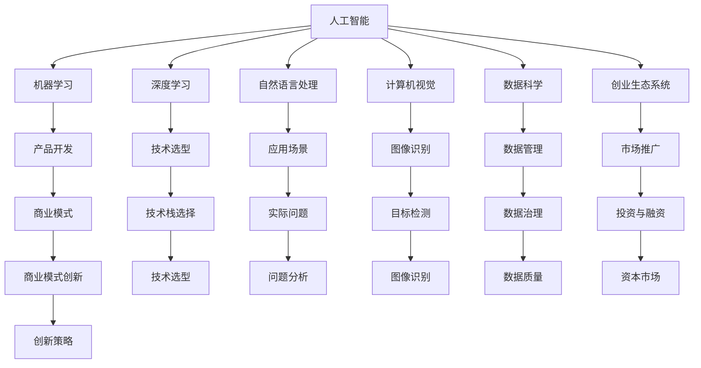

                 

# 人工智能创业：技术创新指南

> 关键词：人工智能,技术创新,创业指南,市场分析,策略制定

## 1. 背景介绍

### 1.1 问题由来
在过去的十年里，人工智能（AI）技术迅猛发展，从机器学习、深度学习到自然语言处理（NLP）、计算机视觉等，各种技术的进步为各行各业带来了巨大的变革。同时，越来越多的创业者和投资机构开始关注AI技术，希望借助AI技术打造新的商业生态系统，实现科技创新和商业模式的突破。

然而，AI创业并非易事。尽管技术层面已经相对成熟，但如何将AI技术转化为可行的商业产品，解决实际问题，仍是一个巨大的挑战。因此，本指南旨在为AI创业者提供全面的技术创新方向和策略制定建议，帮助他们在激烈的市场竞争中脱颖而出。

### 1.2 问题核心关键点
AI创业的核心在于如何利用AI技术解决实际问题，并实现商业化。本指南将围绕以下几个核心问题进行探讨：
1. AI技术的选择与应用场景分析
2. 产品开发流程与团队构建
3. 市场推广与商业模式设计
4. 风险管理与可持续发展策略
5. AI技术创新与未来趋势展望

这些问题紧密联系，共同构成了AI创业的完整路径。通过理解这些核心问题，可以帮助AI创业者更好地规划和实施他们的商业计划。

## 2. 核心概念与联系

### 2.1 核心概念概述

为更好地理解AI创业的技术创新过程，本节将介绍几个密切相关的核心概念：

- **人工智能（AI）**：利用算法和数据，模拟人类智能过程的技术，包括机器学习、深度学习、计算机视觉等。
- **机器学习（ML）**：通过数据训练模型，让模型自动从数据中提取规律和知识，应用于实际问题的解决。
- **深度学习（DL）**：一种特殊的机器学习，通过多层神经网络进行特征提取和模式识别，实现更强的模型表达能力。
- **自然语言处理（NLP）**：处理人类语言的技术，包括文本分类、情感分析、机器翻译等。
- **计算机视觉（CV）**：处理图像和视频数据的AI技术，包括目标检测、图像分割、物体识别等。
- **数据科学（Data Science）**：涵盖数据收集、清洗、分析和建模的全流程，是AI技术的重要支撑。
- **创业生态系统（Ecosystem）**：包括技术、产品、市场、资本等多方面因素构成的综合环境，支持AI创业的健康发展。

这些核心概念之间的逻辑关系可以通过以下Mermaid流程图来展示：



这个流程图展示了AI技术的各个分支及其相互关联，同时强调了产品开发、市场推广、商业模式设计等多个环节的协同作用。

## 3. 核心算法原理 & 具体操作步骤
### 3.1 算法原理概述

AI创业的技术创新过程，本质上是从实际问题出发，利用AI技术进行数据建模和模型训练，最终形成可行的商业产品。这一过程通常包括以下几个步骤：

1. **需求分析**：识别并明确用户需求和实际问题，如提高客户满意度、降低运营成本、提升产品质量等。
2. **技术选型**：根据需求选择合适的AI技术，如机器学习、深度学习、自然语言处理等。
3. **数据准备**：收集、清洗和预处理数据，确保数据质量和可用性。
4. **模型构建**：使用选定的AI技术，构建数据模型并进行训练和优化。
5. **产品开发**：将训练好的模型封装为产品或服务，实现用户需求。
6. **市场推广**：通过营销和销售活动，将产品推向市场，获得用户认可。
7. **商业模式设计**：设计并实施商业策略，确保产品的可持续发展和盈利。

### 3.2 算法步骤详解

以下是对AI创业技术创新过程的详细说明，每个步骤将结合具体案例进行讲解：

**Step 1: 需求分析**
- **目标**：明确用户需求和实际问题，确保产品能够解决用户的痛点。
- **方法**：进行市场调研、用户访谈、需求分析等，获取全面的需求信息。

**Step 2: 技术选型**
- **目标**：根据需求选择合适的AI技术，如机器学习、深度学习、自然语言处理等。
- **方法**：分析各技术的特点、优缺点和适用场景，选择最适合的技术方案。

**Step 3: 数据准备**
- **目标**：收集、清洗和预处理数据，确保数据质量和可用性。
- **方法**：使用数据治理工具进行数据清洗和特征工程，提升数据质量。

**Step 4: 模型构建**
- **目标**：使用选定的AI技术，构建数据模型并进行训练和优化。
- **方法**：设计模型架构，选择合适的算法和优化方法，使用机器学习框架进行模型训练。

**Step 5: 产品开发**
- **目标**：将训练好的模型封装为产品或服务，实现用户需求。
- **方法**：使用API接口、Web应用、移动应用等方式，将模型功能封装成易于使用的产品或服务。

**Step 6: 市场推广**
- **目标**：通过营销和销售活动，将产品推向市场，获得用户认可。
- **方法**：制定市场推广计划，使用SEO、SEM、社交媒体等渠道进行推广。

**Step 7: 商业模式设计**
- **目标**：设计并实施商业策略，确保产品的可持续发展和盈利。
- **方法**：设计定价策略、销售渠道、客户服务等方式，确保产品能够长期稳定运营。

### 3.3 算法优缺点

AI创业的技术创新过程具有以下优点：
1. 数据驱动：利用AI技术对大量数据进行分析和建模，可以准确把握用户需求和市场趋势。
2. 迭代优化：通过不断迭代和优化模型，可以逐步提升产品性能，满足用户期望。
3. 灵活性强：AI技术可以适应多种业务场景，快速响应市场需求变化。
4. 自动化程度高：AI技术可以自动化处理大量数据，减少人工干预和错误。

同时，这一过程也存在以下缺点：
1. 数据依赖：对数据的依赖性强，需要高质量的数据支撑，才能实现较好的效果。
2. 技术门槛高：需要具备一定的AI技术知识和经验，才能设计和实施AI系统。
3. 开发周期长：AI产品的开发周期较长，需要经历需求分析、模型构建、产品开发等多个阶段。
4. 成本投入大：初期需要较大的研发投入和数据积累，才能取得较好的效果。

### 3.4 算法应用领域

AI创业的技术创新过程广泛适用于多个领域，包括但不限于：

1. **智能客服**：利用自然语言处理和机器学习技术，构建智能客服系统，提供24小时不间断服务。
2. **智能推荐系统**：使用机器学习和深度学习技术，分析用户行为和偏好，提供个性化的推荐服务。
3. **智能安防**：采用计算机视觉和机器学习技术，实现人脸识别、视频监控等安全管理功能。
4. **智能医疗**：利用自然语言处理和机器学习技术，进行病历分析、疾病预测等医疗服务。
5. **智能交通**：使用计算机视觉和深度学习技术，进行交通流量分析、事故预测等交通管理。
6. **智能制造**：采用机器学习和物联网技术，优化生产流程，提高生产效率和质量。

这些领域的应用展示了AI技术的多样性和广泛性，为AI创业者提供了丰富的选择。

## 4. 数学模型和公式 & 详细讲解  
### 4.1 数学模型构建

在本节中，我们将使用数学语言对AI创业的技术创新过程进行更严格的刻画。

假设市场需求为 $D$，用户需求为 $U$，AI技术对 $U$ 的影响为 $F$。则AI创业的目标函数可以表示为：

$$
\max_{F} \int_U \left( \frac{D \cdot F}{U} \right) dU
$$

其中，$D$ 和 $U$ 分别表示市场需求和用户需求，$F$ 表示AI技术对用户需求的影响，积分符号表示对用户需求的平均化处理。

### 4.2 公式推导过程

以下我们将以智能推荐系统为例，推导模型训练和优化的公式。

假设系统接收用户历史行为数据 $X$，使用机器学习模型 $M$ 进行预测，预测结果为 $Y$。则模型的损失函数可以表示为：

$$
\mathcal{L}(M) = \frac{1}{N} \sum_{i=1}^N \ell(Y_i, M(X_i))
$$

其中，$N$ 为样本数量，$\ell$ 为损失函数，通常使用均方误差（MSE）或交叉熵（CE）等。模型训练的目标是最小化损失函数：

$$
\min_{M} \mathcal{L}(M)
$$

通过反向传播算法，计算损失函数对模型参数 $\theta$ 的梯度，使用优化算法（如梯度下降、Adam等）进行参数更新：

$$
\theta \leftarrow \theta - \eta \nabla_{\theta}\mathcal{L}(\theta)
$$

其中，$\eta$ 为学习率。

### 4.3 案例分析与讲解

以智能推荐系统为例，分析模型的构建和训练过程。

假设我们有一个电商平台的推荐系统，需要根据用户的历史购买记录和浏览行为，推荐用户可能感兴趣的商品。

**Step 1: 数据准备**
- 收集用户的浏览记录、购买记录、商品信息等数据，清洗和预处理数据。
- 将用户历史行为数据 $X$ 和商品信息 $Z$ 作为输入，预测用户对每个商品的兴趣评分 $Y$。

**Step 2: 模型构建**
- 选择神经网络作为模型架构，设计多个全连接层、卷积层和池化层，构建特征提取网络。
- 在特征提取网络的基础上，构建一个多层感知器（MLP），将特征向量映射到评分预测结果。
- 使用交叉熵损失函数 $\ell(Y, M(X))$ 进行模型训练和优化。

**Step 3: 模型训练**
- 使用训练数据集 $D_{train}$ 进行模型训练，迭代优化模型参数 $\theta$。
- 使用验证数据集 $D_{valid}$ 进行模型评估，选择最优模型。

**Step 4: 模型评估**
- 使用测试数据集 $D_{test}$ 进行模型测试，评估模型的性能指标，如准确率、召回率、F1值等。
- 根据测试结果，调整模型架构和参数，优化模型性能。

**Step 5: 产品开发**
- 将训练好的模型封装为API接口，提供给电商平台的业务系统调用。
- 在业务系统中集成推荐算法，实现商品的实时推荐。

**Step 6: 市场推广**
- 制定市场推广计划，通过SEO、SEM、社交媒体等渠道进行推广。
- 进行用户测试，收集用户反馈，不断优化推荐算法。

**Step 7: 商业模式设计**
- 设计免费增值服务模式，如免费试用、付费会员等，吸引用户使用。
- 根据用户行为数据，进行精准营销，提升用户转化率和复购率。

通过以上步骤，我们可以构建一个高效的智能推荐系统，帮助电商平台提升用户满意度和销售额。

## 5. 项目实践：代码实例和详细解释说明
### 5.1 开发环境搭建

在进行AI创业的代码实践前，我们需要准备好开发环境。以下是使用Python进行TensorFlow开发的环境配置流程：

1. 安装Anaconda：从官网下载并安装Anaconda，用于创建独立的Python环境。

2. 创建并激活虚拟环境：
```bash
conda create -n tf-env python=3.8 
conda activate tf-env
```

3. 安装TensorFlow：根据CUDA版本，从官网获取对应的安装命令。例如：
```bash
conda install tensorflow tensorflow-gpu=2.5 -c conda-forge
```

4. 安装各类工具包：
```bash
pip install numpy pandas scikit-learn matplotlib tqdm jupyter notebook ipython
```

完成上述步骤后，即可在`tf-env`环境中开始AI创业的实践。

### 5.2 源代码详细实现

这里我们以智能推荐系统为例，给出使用TensorFlow对机器学习模型进行训练和优化的PyTorch代码实现。

首先，定义模型的超参数和数据集：

```python
import tensorflow as tf
import tensorflow.keras as keras

# 设置超参数
batch_size = 32
epochs = 10
learning_rate = 0.001
hidden_units = 256
dropout_rate = 0.5

# 加载数据集
train_data = ...
train_labels = ...
val_data = ...
val_labels = ...
test_data = ...
test_labels = ...

# 定义模型结构
model = keras.Sequential([
    keras.layers.Dense(hidden_units, input_dim=features_dim, activation='relu'),
    keras.layers.Dropout(dropout_rate),
    keras.layers.Dense(output_dim=1, activation='sigmoid')
])
model.compile(loss='binary_crossentropy', optimizer=tf.keras.optimizers.Adam(learning_rate), metrics=['accuracy'])
```

然后，进行模型训练和评估：

```python
# 模型训练
model.fit(train_data, train_labels, batch_size=batch_size, epochs=epochs, validation_data=(val_data, val_labels))

# 模型评估
test_loss, test_acc = model.evaluate(test_data, test_labels)
print('Test Accuracy:', test_acc)
```

接下来，使用训练好的模型进行预测：

```python
# 模型预测
predictions = model.predict(test_data)
```

### 5.3 代码解读与分析

让我们再详细解读一下关键代码的实现细节：

**模型结构定义**：
- `keras.Sequential`：定义一个序列模型，包含多个层。
- `Dense`：定义全连接层，使用ReLU激活函数。
- `Dropout`：定义Dropout层，随机丢弃一定比例的神经元，防止过拟合。
- `Dense`：定义输出层，使用Sigmoid激活函数，输出二分类结果。

**模型编译**：
- `compile`方法：设置损失函数、优化器、评估指标等。
- `binary_crossentropy`：二分类交叉熵损失函数。
- `Adam`优化器：自适应矩估计优化器，常用于深度学习模型训练。

**模型训练和评估**：
- `fit`方法：对模型进行训练，使用验证集进行监控。
- `evaluate`方法：评估模型性能，返回测试损失和准确率。

**模型预测**：
- `predict`方法：使用训练好的模型进行预测，返回预测结果。

**训练和评估结果的解释**：
- 训练过程中，每轮迭代都会计算损失和准确率，并记录在训练集和验证集上。
- 评估结果中，测试准确率反映了模型的泛化能力，是衡量模型性能的重要指标。

**代码实现中需要注意的问题**：
- 数据预处理：需要对数据进行归一化、编码等处理，确保模型能够正常工作。
- 模型超参数的调优：需要不断尝试不同的超参数组合，选择最优的模型。
- 模型训练的稳定性：需要在训练过程中监控模型状态，避免过拟合和欠拟合。

## 6. 实际应用场景
### 6.1 智能客服系统

智能客服系统是AI创业中常见的应用场景。传统客服模式依赖大量人工，响应时间长，效率低下，无法满足用户高频率的咨询需求。而智能客服系统可以全天候提供服务，快速响应用户咨询，提高客户满意度。

以智能客服系统为例，分析其技术实现和商业价值：

**技术实现**：
- 收集历史客服对话记录，提取问题和回答对作为监督数据。
- 使用BERT等预训练模型作为初始化参数，微调模型进行问题回答。
- 在业务系统中集成智能客服接口，使用户能够通过自然语言与系统对话。

**商业价值**：
- 降低人工成本，提高响应速度。
- 提升客户体验，增加用户黏性。
- 提供24小时不间断服务，提升品牌竞争力。

### 6.2 智能推荐系统

智能推荐系统是AI创业中另一大热门应用。电商、视频、音乐等多个领域都广泛应用推荐算法，提高用户体验和平台收益。

以智能推荐系统为例，分析其技术实现和商业价值：

**技术实现**：
- 收集用户历史行为数据，提取用户兴趣特征。
- 使用深度学习模型构建推荐模型，进行用户行为预测。
- 在业务系统中集成推荐引擎，实时推荐商品或内容。

**商业价值**：
- 提升用户满意度，增加用户复购率。
- 提高平台收益，增加广告收入。
- 优化库存管理，降低运营成本。

### 6.3 智能安防系统

智能安防系统利用计算机视觉和深度学习技术，实现人脸识别、视频监控等功能，提高公共安全管理水平。

以智能安防系统为例，分析其技术实现和商业价值：

**技术实现**：
- 收集视频监控数据，提取人脸图像。
- 使用卷积神经网络进行人脸识别，进行身份验证和异常检测。
- 在安防系统中集成智能识别模块，实时监控和报警。

**商业价值**：
- 提高公共安全管理水平，减少犯罪率。
- 提供实时监控和报警服务，降低人力成本。
- 提升用户体验，增加用户满意度。

## 7. 工具和资源推荐
### 7.1 学习资源推荐

为了帮助AI创业者系统掌握AI技术创新的理论基础和实践技巧，这里推荐一些优质的学习资源：

1. **《人工智能：一种现代方法》**：经典AI教材，涵盖了AI的基本概念和算法，适合初学者学习。
2. **Coursera《机器学习》课程**：由斯坦福大学Andrew Ng教授主讲，系统讲解机器学习算法和应用。
3. **Kaggle平台**：数据科学竞赛平台，提供海量数据集和代码案例，是学习和实践AI技术的绝佳场所。
4. **Deep Learning Specialization**：由Andrew Ng教授主讲的深度学习系列课程，涵盖深度学习算法和应用。
5. **AI for Everyone**：吴恩达教授主讲的AI入门课程，适合非技术背景的从业者学习。
6. **Towards Data Science**：数据科学社区，提供丰富的学习资源和实战案例，适合动手实践。

通过对这些资源的学习实践，相信你一定能够快速掌握AI技术创新的精髓，并用于解决实际的商业问题。

### 7.2 开发工具推荐

高效的开发离不开优秀的工具支持。以下是几款用于AI创业开发的常用工具：

1. **TensorFlow**：由Google主导开发的开源深度学习框架，生产部署方便，适合大规模工程应用。
2. **PyTorch**：Facebook开发的开源深度学习框架，灵活高效，适合研究性开发。
3. **Scikit-learn**：Python数据科学库，提供了丰富的机器学习算法和工具。
4. **Jupyter Notebook**：开源的交互式编程环境，支持多种语言和框架，适合快速迭代开发。
5. **Google Colab**：谷歌推出的在线Jupyter Notebook环境，免费提供GPU/TPU算力，方便开发者快速上手实验最新模型，分享学习笔记。
6. **Weights & Biases**：模型训练的实验跟踪工具，可以记录和可视化模型训练过程中的各项指标，方便对比和调优。

合理利用这些工具，可以显著提升AI创业开发效率，加快创新迭代的步伐。

### 7.3 相关论文推荐

AI创业的技术创新源于学界的持续研究。以下是几篇奠基性的相关论文，推荐阅读：

1. **《深度学习》**：Ian Goodfellow等著，全面介绍了深度学习的基础和应用，是AI领域的重要参考书籍。
2. **《TensorFlow中文社区白皮书》**：详细介绍了TensorFlow的架构和使用技巧，是TensorFlow开发者的必备资料。
3. **《机器学习实战》**：Peter Harrington著，提供了丰富的机器学习算法和代码案例，适合动手实践。
4. **《深度学习框架与技术》**：张浩哲著，全面介绍了深度学习框架和应用，适合深度学习开发者。
5. **《TensorFlow实战》**：Meekhof，Adhikari，Strauss著，提供了丰富的TensorFlow实战案例，适合TensorFlow开发者。
6. **《Python深度学习》**：Francois Chollet著，介绍了深度学习算法和Keras框架的使用，适合深度学习初学者。

这些论文代表了大规模AI创业技术的发展脉络。通过学习这些前沿成果，可以帮助研究者把握学科前进方向，激发更多的创新灵感。

## 8. 总结：未来发展趋势与挑战
### 8.1 总结

本文对AI创业的技术创新过程进行了全面系统的介绍。首先阐述了AI创业的核心问题，包括技术选型、产品开发、市场推广和商业模式设计，明确了创业方向。其次，从算法原理到具体操作步骤，详细讲解了AI创业的各个环节，提供了具体的代码实现和解释分析。同时，本文还广泛探讨了AI技术在智能客服、智能推荐、智能安防等多个行业领域的应用前景，展示了AI技术的广泛应用。此外，本文精选了AI创业的各类学习资源，力求为读者提供全方位的技术指引。

通过本文的系统梳理，可以看到，AI创业的技术创新过程是一个系统工程，需要多方面的协同配合。AI创业者需要不断学习和实践，积累经验，才能实现商业成功。相信随着AI技术的不断进步，未来将会有更多创新应用出现，推动AI技术在各行各业的发展。

### 8.2 未来发展趋势

展望未来，AI创业技术将呈现以下几个发展趋势：

1. **自动化程度提高**：AI技术将进一步自动化，实现更高效的开发流程和产品部署。
2. **多模态融合**：AI技术将向多模态方向发展，结合图像、语音、文本等多种数据，提升应用效果。
3. **实时化部署**：AI系统将进一步实时化，实现实时响应和动态调整。
4. **跨领域应用**：AI技术将在更多行业领域实现应用，如医疗、教育、金融等，带来深远影响。
5. **个性化定制**：AI系统将更加注重用户个性化需求，提供定制化服务。
6. **可持续发展**：AI技术将更加注重环保和资源利用，实现绿色可持续发展。

以上趋势将进一步推动AI创业技术的发展，带来更多创新应用和商业机会。AI创业者需要关注这些趋势，及时调整技术策略，保持竞争力。

### 8.3 面临的挑战

尽管AI创业技术已经取得了显著成果，但在迈向更广泛应用的过程中，仍面临诸多挑战：

1. **数据隐私和伦理问题**：AI系统需要处理大量个人数据，如何保护用户隐私和数据安全，是一个重要的伦理挑战。
2. **技术门槛高**：AI创业需要具备较高的技术门槛，普通创业者难以大规模实施。
3. **市场竞争激烈**：AI技术创新速度快，市场竞争激烈，需要不断创新以保持竞争力。
4. **成本投入高**：初期开发和维护成本高，需要较大资金投入。
5. **算法透明性不足**：AI系统缺乏可解释性，难以解释其决策过程，影响用户信任度。

正视这些挑战，积极应对并寻求突破，将是大规模AI创业成功的关键。相信随着技术的进步和应用的推广，AI创业将逐步走向成熟，带来更多创新应用和商业机会。

### 8.4 研究展望

未来，AI创业技术还需要在以下几个方面寻求新的突破：

1. **无监督学习**：摆脱对大规模标注数据的依赖，利用无监督学习和大规模预训练模型，提升模型效果。
2. **多任务学习**：使用多任务学习技术，提升模型的多任务表现能力。
3. **自适应学习**：开发自适应学习算法，让模型能够根据环境变化动态调整，提升泛化能力。
4. **混合学习**：结合人工智能和人类专家的知识，实现混合学习，提升模型性能。
5. **跨领域迁移**：开发跨领域迁移算法，让模型能够在不同领域间迁移，提升应用范围。
6. **边缘计算**：将AI技术向边缘计算方向发展，实现低延迟、高可靠的应用。

这些研究方向将进一步推动AI创业技术的发展，带来更多创新应用和商业机会。AI创业者需要关注这些方向，积极探索，才能走在技术前沿，实现商业成功。

## 9. 附录：常见问题与解答

**Q1：如何选择合适的AI技术？**

A: 选择AI技术需要考虑多个因素，如任务需求、数据类型、计算资源等。可以从以下几个方面入手：
1. **任务类型**：确定问题类型，如分类、回归、生成等，选择合适的算法。
2. **数据特性**：分析数据特性，如数据量、特征分布等，选择适合的模型。
3. **计算资源**：评估计算资源，如GPU/TPU等，选择合适的框架和模型。

**Q2：如何构建高效的数据预处理流程？**

A: 数据预处理是AI系统的重要环节，需要保证数据的质量和可用性。可以从以下几个方面入手：
1. **数据清洗**：处理缺失值、异常值等数据问题。
2. **特征工程**：提取和构造特征，提升模型的表达能力。
3. **数据增强**：扩充数据集，增加模型泛化能力。

**Q3：如何进行模型调优和优化？**

A: 模型调优和优化是提升AI系统性能的关键步骤。可以从以下几个方面入手：
1. **超参数调优**：选择和调整模型超参数，如学习率、批大小等。
2. **模型压缩**：减小模型尺寸，提高推理效率。
3. **混合精度训练**：使用混合精度训练，减少计算资源消耗。
4. **硬件优化**：选择合适的硬件设备，提升计算性能。

**Q4：如何实现模型的部署和维护？**

A: 模型部署和维护是AI系统的重要环节，需要保证系统的稳定性和可扩展性。可以从以下几个方面入手：
1. **模型导出和保存**：将训练好的模型导出和保存，以便部署和使用。
2. **API接口设计**：设计简洁的API接口，方便其他系统调用。
3. **容器化部署**：使用Docker等容器技术，实现模型的高效部署。
4. **监控和调优**：实时监控模型状态，进行动态调优，提升系统性能。

通过以上常见问题的解答，相信你能够更好地理解AI创业的技术创新过程，并应用于实际商业项目中。

---

作者：禅与计算机程序设计艺术 / Zen and the Art of Computer Programming

