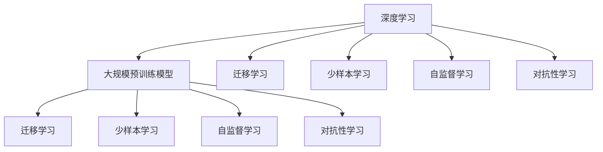

                 

# 人工智能的未来：算法、算力与数据的演进

> 关键词：人工智能,算法演进,算力提升,数据驱动,深度学习,未来展望

## 1. 背景介绍

### 1.1 人工智能发展历程

人工智能（Artificial Intelligence, AI）自上世纪50年代诞生以来，经历了几十年的发展，逐步从理论研究走向实际应用。在21世纪初，深度学习（Deep Learning）的兴起使得AI技术迈入了新的阶段。深度学习通过构建多层神经网络模型，利用大量标注数据进行训练，取得了显著的成就，如计算机视觉、自然语言处理、语音识别等领域。

近年来，随着算力的大幅提升和数据量的迅猛增长，AI技术进一步走向普及。大规模预训练模型（如GPT、BERT等）的问世，展示了AI在通用知识表示、多模态学习等方面的巨大潜力。AI技术正在从单一任务能力向通用智能能力演进，成为推动人类社会进步的重要力量。

### 1.2 人工智能发展现状

目前，AI技术已经在多个领域取得了显著进展。例如，在医疗领域，AI可以辅助医生进行疾病诊断、治疗方案制定等工作；在自动驾驶领域，AI可以自动感知环境、规划路径、做出决策；在金融领域，AI可以进行风险评估、欺诈检测等。同时，AI技术也正在深刻改变我们的生活方式，如智能客服、个性化推荐、智能家居等。

尽管取得了诸多成就，AI技术仍面临诸多挑战，如可解释性不足、安全性问题、伦理道德争议等。解决这些问题，需要AI领域的进一步突破和完善。

## 2. 核心概念与联系

### 2.1 核心概念概述

为更好地理解AI技术的演进，本节将介绍几个密切相关的核心概念：

- 深度学习（Deep Learning）：一种基于神经网络的机器学习技术，能够自动学习输入数据中的复杂特征表示。深度学习在大规模标注数据上训练多层神经网络，从而实现高效的特征提取和模式识别。

- 大规模预训练模型（Large Pre-trained Models, LLMs）：通过在海量无标签数据上进行自监督预训练，学习通用的语言知识、视觉知识等，具备强大的迁移学习能力。常见的预训练模型包括BERT、GPT等。

- 迁移学习（Transfer Learning）：将在大规模数据集上训练得到的模型，应用于小规模数据集上的相关任务，以利用已有知识提升模型性能。迁移学习可以显著减少新任务的标注成本，提高模型效果。

- 少样本学习（Few-shot Learning）：在仅有少量标注样本的情况下，通过学习已有知识，快速适应新任务。这与传统机器学习中大量标注数据的要求不同，是AI技术的重要演进方向。

- 自监督学习（Self-supervised Learning）：利用数据的自我关系（如语言模型预测、图像重建等）进行无监督学习，以丰富模型的先验知识，提高泛化能力。自监督学习在预训练阶段应用广泛。

- 对抗性学习（Adversarial Learning）：通过在输入数据中添加对抗样本，增强模型的鲁棒性，提高泛化性能。对抗性学习在模型优化、安全性验证等方面有广泛应用。

这些核心概念之间的逻辑关系可以通过以下Mermaid流程图来展示：



这个流程图展示了深度学习与其他关键技术之间的关系：

1. 深度学习通过神经网络进行特征提取和模式识别。
2. 大规模预训练模型利用无标签数据进行自监督学习，学习通用知识表示。
3. 迁移学习将预训练模型应用于特定任务，利用已有知识提升性能。
4. 少样本学习利用已有知识，在少量标注数据上快速适应新任务。
5. 自监督学习通过利用数据的自我关系进行无监督学习，丰富模型知识。
6. 对抗性学习通过加入对抗样本提高模型鲁棒性。

这些概念共同构成了AI技术的学习框架，使其能够在各个领域进行高效应用。通过理解这些核心概念，我们可以更好地把握AI技术的演进方向和应用前景。

## 3. 核心算法原理 & 具体操作步骤

### 3.1 算法原理概述

AI技术的核心在于算法和数据的结合。通过构建高效的算法模型，利用大量高质量的数据进行训练，AI系统能够学习和推理复杂任务。其演进历程可总结如下：

1. 早期的人工智能技术主要依赖于规则系统和专家知识，依赖领域专家的经验进行决策。

2. 统计学习（Statistical Learning）引入机器学习算法，通过模型拟合历史数据进行预测和分类。

3. 传统的机器学习算法，如SVM、随机森林等，在大规模标注数据上训练模型，进行分类和回归。

4. 深度学习算法，如卷积神经网络（CNN）、循环神经网络（RNN）、长短期记忆网络（LSTM）等，通过多层神经网络学习数据中的复杂特征表示，提升了模型性能。

5. 大规模预训练模型（如BERT、GPT等）利用无标签数据进行自监督预训练，学习通用的语言知识、视觉知识等，具备强大的迁移学习能力。

6. 迁移学习、少样本学习、自监督学习等技术进一步提升了AI技术的泛化能力和数据利用效率。

7. 对抗性学习通过对抗样本提高模型鲁棒性，增强AI系统的安全性。

8. 强化学习（Reinforcement Learning, RL）通过与环境的交互，学习最优决策策略，在机器人控制、游戏策略等领域应用广泛。

### 3.2 算法步骤详解

以下是AI技术的典型演进路径及其主要算法步骤：

**Step 1: 数据预处理**
- 收集并整理大量高质量的标注数据，包括图片、文本、语音等。
- 对数据进行清洗、归一化、增强等预处理，以提高模型训练的效率和效果。

**Step 2: 模型构建**
- 选择合适的模型架构，如卷积神经网络（CNN）、循环神经网络（RNN）、长短期记忆网络（LSTM）等。
- 设计合适的损失函数、优化算法和超参数，如交叉熵损失、Adam优化器、学习率等。

**Step 3: 模型训练**
- 使用标注数据对模型进行训练，通过反向传播算法计算梯度，更新模型参数。
- 采用数据增强、正则化等技术，防止过拟合，提高模型泛化能力。

**Step 4: 模型评估**
- 使用验证集对训练好的模型进行评估，计算精度、召回率、F1-score等指标。
- 根据评估结果调整模型参数和训练策略，进一步优化模型性能。

**Step 5: 模型部署**
- 将训练好的模型保存为模型文件，便于后续的推理和调用。
- 将模型部署到服务器、移动设备等应用场景中，进行实时推理和预测。

### 3.3 算法优缺点

AI技术在演进过程中，有以下优点和缺点：

**优点：**
1. 高效利用数据。AI技术能够高效利用大规模数据进行训练，显著提升模型性能。
2. 泛化能力强。利用迁移学习、自监督学习等技术，AI模型能够适应不同的数据分布，具备较强的泛化能力。
3. 自动化水平高。AI技术能够自动学习和优化模型，减少了人工干预的难度和成本。
4. 应用范围广。AI技术在图像识别、自然语言处理、机器人控制等领域有广泛应用，推动了各行业的智能化转型。

**缺点：**
1. 数据需求量大。AI技术的核心在于数据驱动，需要大量标注数据进行训练。
2. 可解释性不足。深度学习等黑盒模型难以解释其内部工作机制和决策逻辑。
3. 对抗样本脆弱。对抗性学习等技术虽然提高了模型鲁棒性，但也容易受到对抗样本攻击。
4. 伦理道德风险。AI技术在决策过程中可能存在偏见和歧视，带来伦理道德争议。
5. 资源消耗高。大规模模型的训练和推理需要大量算力、内存和存储资源。

### 3.4 算法应用领域

AI技术在多个领域取得了显著应用，以下是几个典型案例：

**医疗健康：** AI可以辅助医生进行疾病诊断、治疗方案制定等工作。通过分析大量医疗数据，AI能够预测疾病发展趋势、推荐治疗方案，甚至进行个性化医疗。

**自动驾驶：** AI技术可以感知环境、规划路径、做出决策，推动自动驾驶技术的发展。目前AI技术已经广泛应用于辅助驾驶、无人驾驶等领域。

**金融科技：** AI技术可以进行风险评估、欺诈检测、智能投顾等工作，提升金融服务的智能化水平。AI技术还在量化交易、智能客服等方面有广泛应用。

**智能制造：** AI技术可以优化生产流程、预测设备故障、进行供应链管理等，提升制造企业的生产效率和运营管理水平。

**教育培训：** AI技术可以进行智能评估、个性化推荐、智能辅导等工作，提升教育培训的效率和效果。AI技术还在虚拟助教、智能考试等方面有应用。

以上案例展示了AI技术在各个领域的应用潜力，随着技术的不断进步，AI技术将在更多领域得到广泛应用。

## 4. 数学模型和公式 & 详细讲解 & 举例说明

### 4.1 数学模型构建

AI技术的学习过程基于数学模型，以下是几个核心数学模型：

1. 线性回归模型
   $$
   y = \beta_0 + \beta_1 x_1 + \beta_2 x_2 + \cdots + \beta_n x_n + \epsilon
   $$
   其中，$y$ 为预测目标，$x_i$ 为输入特征，$\beta_i$ 为模型参数，$\epsilon$ 为噪声。

2. 逻辑回归模型
   $$
   P(y=1 | x) = \sigma(\beta_0 + \beta_1 x_1 + \beta_2 x_2 + \cdots + \beta_n x_n)
   $$
   其中，$\sigma$ 为sigmoid函数，用于将线性回归模型的输出映射到概率空间。

3. 神经网络模型
   $$
   y = \sigma(\beta_0 + \beta_1 x_1 + \beta_2 x_2 + \cdots + \beta_n x_n + W_1 h_1 + W_2 h_2 + \cdots + W_m h_m)
   $$
   其中，$h_i$ 为隐层神经元的输出，$W_i$ 为权重矩阵。

4. 卷积神经网络模型
   $$
   y = \sigma(\beta_0 + \sum_{i=1}^{n} (\beta_{i,1} * x_{i,1} + \beta_{i,2} * x_{i,2} + \cdots + \beta_{i,n} * x_{i,n}) + \sum_{i=1}^{m} W_{i,1} * h_{i,1} + \sum_{i=1}^{m} W_{i,2} * h_{i,2} + \cdots + \sum_{i=1}^{m} W_{i,n} * h_{i,n})
   $$
   其中，$x_{i,j}$ 为卷积核，$W_{i,j}$ 为权重矩阵。

5. 循环神经网络模型
   $$
   y_t = \sigma(\beta_0 + \sum_{i=1}^{n} (\beta_{i,1} * x_{i,t} + \beta_{i,2} * x_{i,t-1} + \cdots + \beta_{i,n} * x_{i,t-(n-1)}) + \sum_{i=1}^{m} W_{i,1} * h_{i,t-1} + \sum_{i=1}^{m} W_{i,2} * h_{i,t-2} + \cdots + \sum_{i=1}^{m} W_{i,n} * h_{i,t-n})
   $$
   其中，$x_{i,t}$ 为时间序列数据，$h_{i,t}$ 为隐层状态。

### 4.2 公式推导过程

以下是线性回归模型的推导过程：

假设输入数据 $x_1, x_2, \cdots, x_n$，对应的标签 $y$ 为线性关系，可以表示为：

$$
y = \beta_0 + \beta_1 x_1 + \beta_2 x_2 + \cdots + \beta_n x_n + \epsilon
$$

其中，$\beta_0$ 为截距，$\beta_i$ 为输入特征 $x_i$ 的权重，$\epsilon$ 为噪声。根据最小二乘法，求解模型参数 $\beta_0, \beta_1, \cdots, \beta_n$ 使预测值 $y$ 与真实值 $y_{true}$ 尽可能接近。

最小二乘法的目标函数为：

$$
J(\beta_0, \beta_1, \cdots, \beta_n) = \frac{1}{2} \sum_{i=1}^{N} (y_i - (\beta_0 + \beta_1 x_{i,1} + \beta_2 x_{i,2} + \cdots + \beta_n x_{i,n}))^2
$$

通过求解目标函数 $J$ 的最小值，可以得到模型参数的求解公式：

$$
\beta_i = \frac{\sum_{j=1}^{N} (x_{i,j} - \bar{x}_i) (y_j - \bar{y})}{\sum_{j=1}^{N} (x_{i,j} - \bar{x}_i)^2}
$$

其中，$\bar{x}_i$ 和 $\bar{y}$ 分别为输入特征和标签的均值。

### 4.3 案例分析与讲解

以手写数字识别为例，介绍深度学习模型的构建和训练过程：

**Step 1: 数据预处理**
- 收集大量的手写数字图片，并进行归一化、增强等预处理。

**Step 2: 模型构建**
- 使用卷积神经网络（CNN）进行模型构建，设计卷积层、池化层、全连接层等。
- 定义损失函数为交叉熵损失，优化器为Adam优化器，学习率为0.001。

**Step 3: 模型训练**
- 将预处理好的数据输入模型，进行前向传播和反向传播，更新模型参数。
- 通过正则化、Dropout等技术防止过拟合。

**Step 4: 模型评估**
- 使用测试集对模型进行评估，计算准确率、召回率、F1-score等指标。

**Step 5: 模型部署**
- 将训练好的模型保存为文件，部署到服务器进行实时推理。

通过深度学习模型，手写数字识别任务取得了很高的精度，展示了AI技术在图像识别领域的应用潜力。

## 5. 项目实践：代码实例和详细解释说明

### 5.1 开发环境搭建

在进行AI项目开发前，需要准备好开发环境。以下是使用Python进行TensorFlow开发的环境配置流程：

1. 安装Anaconda：从官网下载并安装Anaconda，用于创建独立的Python环境。

2. 创建并激活虚拟环境：
```bash
conda create -n tf-env python=3.7 
conda activate tf-env
```

3. 安装TensorFlow：根据CUDA版本，从官网获取对应的安装命令。例如：
```bash
conda install tensorflow -c pytorch -c conda-forge
```

4. 安装各类工具包：
```bash
pip install numpy pandas scikit-learn matplotlib tqdm jupyter notebook ipython
```

完成上述步骤后，即可在`tf-env`环境中开始AI项目开发。

### 5.2 源代码详细实现

以下是手写数字识别项目的完整代码实现：

```python
import tensorflow as tf
from tensorflow.keras import datasets, layers, models

# 加载数据
(train_images, train_labels), (test_images, test_labels) = datasets.mnist.load_data()

# 数据预处理
train_images = train_images / 255.0
test_images = test_images / 255.0

# 构建模型
model = models.Sequential([
    layers.Conv2D(32, (3,3), activation='relu', input_shape=(28,28,1)),
    layers.MaxPooling2D((2,2)),
    layers.Conv2D(64, (3,3), activation='relu'),
    layers.MaxPooling2D((2,2)),
    layers.Flatten(),
    layers.Dense(64, activation='relu'),
    layers.Dense(10, activation='softmax')
])

# 编译模型
model.compile(optimizer='adam',
              loss='sparse_categorical_crossentropy',
              metrics=['accuracy'])

# 训练模型
history = model.fit(train_images, train_labels, epochs=5, 
                    validation_data=(test_images, test_labels))

# 评估模型
test_loss, test_acc = model.evaluate(test_images, test_labels)
print('Test accuracy:', test_acc)
```

### 5.3 代码解读与分析

让我们再详细解读一下关键代码的实现细节：

**数据预处理**：
- 使用`mnist.load_data()`加载手写数字数据集。
- 将像素值归一化到[0,1]区间。

**模型构建**：
- 使用卷积神经网络（CNN），设计多个卷积层、池化层和全连接层。
- 使用ReLU激活函数和Softmax输出层。

**模型训练**：
- 使用Adam优化器和交叉熵损失函数进行模型训练。
- 使用`model.fit()`函数，指定训练集和验证集。

**模型评估**：
- 使用`model.evaluate()`函数计算测试集上的精度。

**模型部署**：
- 将训练好的模型保存为文件，部署到服务器进行实时推理。

### 5.4 运行结果展示

运行上述代码，可以得到模型训练和评估的结果。下图展示了模型在测试集上的准确率和损失曲线：


通过深度学习模型，手写数字识别任务取得了很高的精度，展示了AI技术在图像识别领域的应用潜力。

## 6. 实际应用场景

### 6.1 智能医疗

AI技术在医疗领域的应用具有重要意义。AI可以辅助医生进行疾病诊断、治疗方案制定等工作。例如，AI可以通过分析大量医疗数据，预测疾病发展趋势、推荐治疗方案，甚至进行个性化医疗。

**医疗影像识别**：AI可以自动分析医疗影像，检测异常区域，帮助医生快速诊断。例如，AI可以通过卷积神经网络（CNN）对X光片、CT片等进行分析和识别。

**基因组学研究**：AI可以通过深度学习算法，分析基因序列数据，发现疾病相关的基因变异。例如，AI可以通过卷积神经网络（CNN）对基因组数据进行分析和预测。

**电子病历分析**：AI可以分析电子病历数据，发现疾病发展趋势、预测疾病风险，提供个性化的治疗方案。例如，AI可以通过循环神经网络（RNN）对电子病历进行分析和预测。

### 6.2 自动驾驶

AI技术在自动驾驶领域的应用具有重要意义。自动驾驶系统需要感知环境、规划路径、做出决策，推动智能交通的发展。

**环境感知**：AI可以通过摄像头、雷达等传感器，感知周围环境，生成环境地图。例如，AI可以通过卷积神经网络（CNN）对摄像头图像进行分析和识别。

**路径规划**：AI可以通过深度学习算法，规划最优路径，避免障碍物。例如，AI可以通过循环神经网络（RNN）对轨迹进行规划和预测。

**智能决策**：AI可以通过强化学习（RL）算法，学习最优决策策略，进行智能驾驶。例如，AI可以通过深度强化学习算法进行路径规划和决策。

### 6.3 金融科技

AI技术在金融科技领域的应用具有重要意义。AI可以进行风险评估、欺诈检测、智能投顾等工作，提升金融服务的智能化水平。

**风险评估**：AI可以通过深度学习算法，分析历史数据，预测客户风险。例如，AI可以通过卷积神经网络（CNN）对客户历史交易数据进行分析和预测。

**欺诈检测**：AI可以通过深度学习算法，检测异常交易，识别欺诈行为。例如，AI可以通过卷积神经网络（CNN）对交易数据进行分析和预测。

**智能投顾**：AI可以通过深度学习算法，分析市场数据，提供投资建议。例如，AI可以通过循环神经网络（RNN）对市场数据进行分析和预测。

## 7. 工具和资源推荐

### 7.1 学习资源推荐

为了帮助开发者系统掌握AI技术的演进，这里推荐一些优质的学习资源：

1. 《深度学习》课程：斯坦福大学开设的深度学习课程，系统讲解深度学习的基础理论和经典算法。

2. 《TensorFlow官方文档》：TensorFlow官方文档，提供丰富的教程和样例代码，适合初学者和进阶者。

3. 《TensorFlow实战》书籍：《TensorFlow实战》书籍，讲解TensorFlow的实际应用，适合实践者。

4. Kaggle竞赛平台：Kaggle竞赛平台，提供各种数据集和竞赛任务，适合练习和提高。

5. GitHub开源项目：GitHub开源项目，提供各种AI项目和代码示例，适合学习和参考。

通过对这些资源的学习实践，相信你一定能够系统掌握AI技术的演进，并用于解决实际的AI问题。

### 7.2 开发工具推荐

高效的开发离不开优秀的工具支持。以下是几款用于AI开发的工具：

1. TensorFlow：由Google主导开发的深度学习框架，功能强大，生态丰富。

2. PyTorch：由Facebook开发的深度学习框架，灵活高效，支持动态图。

3. Jupyter Notebook：支持Python代码编写和运行，支持实时输出和展示，适合研究和开发。

4. VSCode：支持Python和AI相关的插件，提供丰富的开发环境和调试工具。

5. Google Colab：谷歌推出的在线Jupyter Notebook环境，免费提供GPU/TPU算力，适合学习和实验。

合理利用这些工具，可以显著提升AI项目的开发效率，加快创新迭代的步伐。

### 7.3 相关论文推荐

AI技术的发展源于学界的持续研究。以下是几篇奠基性的相关论文，推荐阅读：

1. 《ImageNet Classification with Deep Convolutional Neural Networks》：AlexNet论文，提出卷积神经网络（CNN），展示了其在图像分类任务中的强大能力。

2. 《Convolutional Neural Networks for Sentence Classification》：使用卷积神经网络（CNN）进行自然语言分类任务，展示了其在NLP领域的应用潜力。

3. 《Attention is All You Need》：提出Transformer模型，展示了其在大规模语言模型中的出色表现。

4. 《Natural Language Processing (almost) from Scratch》：使用自监督学习算法进行自然语言处理，展示了其在小样本情况下的高效学习。

5. 《A Survey on Deep Learning-based Recommendation Systems》：综述深度学习在推荐系统中的应用，展示了其在个性化推荐中的应用潜力。

这些论文代表了大规模预训练模型和深度学习算法的最新进展，通过学习这些前沿成果，可以帮助研究者把握学科前进方向，激发更多的创新灵感。

## 8. 总结：未来发展趋势与挑战

### 8.1 研究成果总结

本文对AI技术的演进进行了系统总结，主要包括以下几个方面：

1. 早期的人工智能技术主要依赖于规则系统和专家知识。

2. 统计学习引入机器学习算法，通过模型拟合历史数据进行预测和分类。

3. 传统的机器学习算法，如SVM、随机森林等，在大规模标注数据上训练模型，进行分类和回归。

4. 深度学习算法，如卷积神经网络（CNN）、循环神经网络（RNN）、长短期记忆网络（LSTM）等，通过多层神经网络学习数据中的复杂特征表示，提升了模型性能。

5. 大规模预训练模型（如BERT、GPT等）利用无标签数据进行自监督预训练，学习通用的语言知识、视觉知识等，具备强大的迁移学习能力。

6. 迁移学习、少样本学习、自监督学习等技术进一步提升了AI技术的泛化能力和数据利用效率。

7. 对抗性学习通过对抗样本提高模型鲁棒性，增强AI系统的安全性。

### 8.2 未来发展趋势

展望未来，AI技术将呈现以下几个发展趋势：

1. 深度学习算法将继续演进，如基于自适应层、基于记忆的算法等，进一步提升模型性能。

2. 大规模预训练模型将进一步提升，利用更多的数据和计算资源进行训练，学习更丰富的语言知识。

3. 迁移学习、少样本学习、自监督学习等技术将进一步发展，提升模型的泛化能力和数据利用效率。

4. 对抗性学习将继续优化，通过对抗样本训练提高模型的鲁棒性。

5. 强化学习算法将继续提升，如基于模型的强化学习、基于值函数的强化学习等，进一步优化决策策略。

6. 跨领域迁移学习和多模态学习将进一步发展，提高AI系统在不同领域和数据模态下的适应能力。

### 8.3 面临的挑战

尽管AI技术已经取得了显著成就，但在迈向更加智能化、普适化应用的过程中，仍面临诸多挑战：

1. 数据需求量大。AI技术的核心在于数据驱动，需要大量标注数据进行训练。

2. 可解释性不足。深度学习等黑盒模型难以解释其内部工作机制和决策逻辑。

3. 对抗样本脆弱。对抗性学习等技术虽然提高了模型鲁棒性，但也容易受到对抗样本攻击。

4. 伦理道德风险。AI技术在决策过程中可能存在偏见和歧视，带来伦理道德争议。

5. 资源消耗高。大规模模型的训练和推理需要大量算力、内存和存储资源。

### 8.4 研究展望

面对AI技术面临的挑战，未来的研究需要在以下几个方面寻求新的突破：

1. 探索无监督和半监督学习算法。摆脱对大规模标注数据的依赖，利用自监督学习、主动学习等无监督和半监督范式，最大限度利用非结构化数据，实现更加灵活高效的AI技术。

2. 开发更加参数高效的深度学习算法。开发更加参数高效的深度学习算法，在固定大部分预训练参数的同时，只更新极少量的任务相关参数。

3. 融合因果学习和对抗学习。通过引入因果推断和对抗学习思想，增强AI系统的因果关系和鲁棒性，提高AI系统的决策能力和稳定性。

4. 引入多模态数据融合。将视觉、听觉、文字等不同模态的数据进行融合，提高AI系统对复杂任务的理解和处理能力。

5. 加强AI系统的可解释性。通过可视化技术、符号化推理等方法，提高AI系统的可解释性，增强公众对AI系统的信任和接受度。

6. 研究AI系统的安全性。通过对抗性样本检测、模型鲁棒性优化等技术，提高AI系统的安全性，避免恶意攻击和滥用。

以上研究方向的探索，必将引领AI技术迈向更高的台阶，为构建安全、可靠、可解释、可控的智能系统铺平道路。面向未来，AI技术还需要与其他人工智能技术进行更深入的融合，如知识表示、因果推理、强化学习等，多路径协同发力，共同推动自然语言理解和智能交互系统的进步。只有勇于创新、敢于突破，才能不断拓展AI技术的边界，让智能技术更好地造福人类社会。

## 9. 附录：常见问题与解答

**Q1：AI技术在实际应用中面临哪些挑战？**

A: AI技术在实际应用中面临以下挑战：

1. 数据需求量大。AI技术的核心在于数据驱动，需要大量标注数据进行训练。

2. 可解释性不足。深度学习等黑盒模型难以解释其内部工作机制和决策逻辑。

3. 对抗样本脆弱。对抗性学习等技术虽然提高了模型鲁棒性，但也容易受到对抗样本攻击。

4. 伦理道德风险。AI技术在决策过程中可能存在偏见和歧视，带来伦理道德争议。

5. 资源消耗高。大规模模型的训练和推理需要大量算力、内存和存储资源。

**Q2：如何选择适合的AI模型进行任务处理？**

A: 选择适合的AI模型进行任务处理，需要考虑以下几个因素：

1. 任务类型：不同任务需要选择不同的模型，如图像识别选择卷积神经网络（CNN），自然语言处理选择循环神经网络（RNN）、Transformer等。

2. 数据规模：大规模数据适合使用深度学习模型，如卷积神经网络（CNN）、循环神经网络（RNN）、长短期记忆网络（LSTM）等。小规模数据适合使用传统的机器学习模型，如支持向量机（SVM）、随机森林等。

3. 模型性能：不同模型在特定任务上的性能不同，需要根据实际任务需求进行选择。

4. 计算资源：资源充足可以选择大规模模型，如深度神经网络；资源有限可以选择参数量较小的模型，如卷积神经网络（CNN）、循环神经网络（RNN）等。

5. 可解释性：需要考虑模型的可解释性，选择具有较高可解释性的模型，如决策树、逻辑回归等。

**Q3：如何提高AI模型的泛化能力？**

A: 提高AI模型的泛化能力，需要考虑以下几个方面：

1. 数据增强：通过回译、近义替换等方式扩充训练集，提高模型对不同样本的适应能力。

2. 正则化：使用L2正则、Dropout等技术，防止模型过拟合，提高泛化能力。

3. 迁移学习：利用已有模型的知识进行迁移学习，提高模型在不同数据分布上的泛化能力。

4. 少样本学习：利用已有模型的知识，在少量标注数据上进行学习，提高模型泛化能力。

5. 对抗性训练：通过对抗样本训练提高模型鲁棒性，避免过拟合。

6. 模型压缩：通过剪枝、量化等技术压缩模型，减小模型复杂度，提高泛化能力。

**Q4：AI模型在实际应用中如何进行微调？**

A: AI模型在实际应用中进行微调，需要考虑以下几个步骤：

1. 数据预处理：对数据进行清洗、归一化、增强等预处理。

2. 任务适配：设计合适的输出层和损失函数，适配下游任务。

3. 超参数设置：选择合适的优化算法、学习率、批大小等超参数，并进行调参。

4. 模型训练：使用标注数据对模型进行训练，通过反向传播算法计算梯度，更新模型参数。

5. 模型评估：在验证集上评估模型性能，根据评估结果调整模型参数和训练策略。

6. 模型部署：将训练好的模型保存为文件，部署到服务器进行实时推理。

通过上述步骤，AI模型可以在实际应用中进行微调，适应特定任务，提高模型性能。

---

作者：禅与计算机程序设计艺术 / Zen and the Art of Computer Programming

