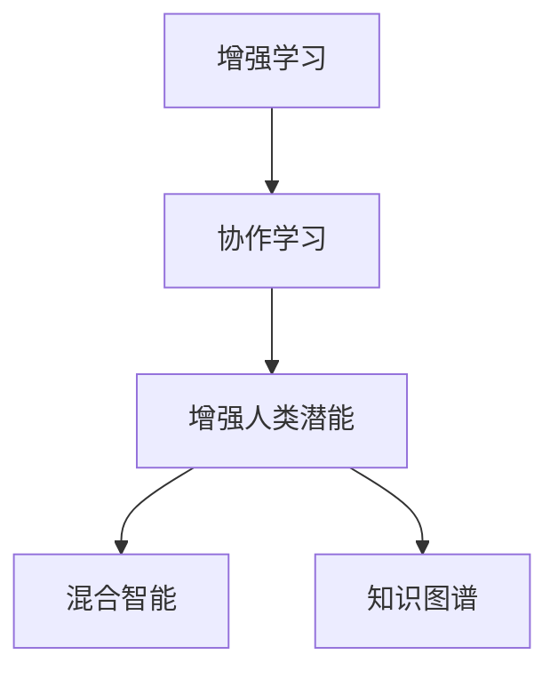

                 

## 1. 背景介绍

在当今这个信息化、数字化迅猛发展的时代，人工智能（AI）已经从科幻小说中的概念成为了现实。它正在逐步渗透到我们生活的各个方面，从智能家居到自动驾驶，从个性化推荐到医疗诊断，AI正在全方位改变我们的生活和工作方式。然而，尽管AI技术日益成熟，它仍然无法完全取代人类，尤其是在创造力、情感理解和复杂决策等方面。本文旨在探讨如何通过AI与人类协作，不仅提高AI的性能，更重要的是增强人类的潜能，实现共生共进。

## 2. 核心概念与联系

### 2.1 核心概念概述

- **增强学习（Reinforcement Learning, RL）**：一种机器学习技术，通过与环境的交互，智能体根据奖励信号不断调整策略，优化决策过程。
- **协作学习（Collaborative Learning）**：多个智能体或多个AI系统共同参与任务，共享知识，共同进步的机制。
- **增强人类潜能（Augment Human Capabilities）**：利用AI技术放大人类自身的潜力和能力，提升决策能力、创造力和问题解决能力。
- **混合智能（Hybrid Intelligence）**：AI与人类智慧相结合，既发挥AI在计算、逻辑和信息处理方面的优势，又利用人类在情感、直觉和道德判断等方面的优势。
- **知识图谱（Knowledge Graph）**：一种结构化的知识表示方法，将实体和关系以图形的方式存储和检索，便于人类和AI共同理解和应用。

### 2.2 核心概念原理和架构的 Mermaid 流程图



这个流程图展示了增强学习、协作学习、增强人类潜能、混合智能和知识图谱之间的联系和相互作用：

1. 增强学习通过奖励机制优化决策策略，为协作学习和知识图谱提供决策基础。
2. 协作学习通过多个智能体共享知识和优化策略，提升混合智能的性能。
3. 增强人类潜能利用AI与人类智慧的结合，提升人类决策和创造力。
4. 混合智能在AI与人类智慧的结合下，实现更复杂、更全面的任务处理。
5. 知识图谱提供结构化的知识存储和检索，便于人类和AI共同理解和应用。

## 3. 核心算法原理 & 具体操作步骤

### 3.1 算法原理概述

AI与人类协作的关键在于如何将AI的计算能力和人类的直觉和判断相结合。在协作学习中，AI通过增强学习不断优化决策策略，而人类则通过指导、反馈和监督，提升AI的性能。这种双向互动的过程，不仅提升了AI的能力，也增强了人类的决策力和创造力。

### 3.2 算法步骤详解

#### 3.2.1 数据收集和预处理

- **数据收集**：收集与任务相关的数据，如医疗影像、财务报表、社交媒体数据等。
- **数据清洗和标注**：清洗数据，去除噪声和异常值，对数据进行标注，使其适合增强学习和协作学习。

#### 3.2.2 构建环境

- **环境设计**：构建适合增强学习的环境，包括奖励机制、状态表示和动作空间等。
- **多智能体协作**：设计多个AI系统或人类专家共同参与的任务环境，建立通信和信息共享机制。

#### 3.2.3 增强学习过程

- **策略学习**：AI通过与环境的交互，学习最优策略，最大化长期奖励。
- **策略优化**：通过不断的策略优化，AI不断提升任务处理能力。

#### 3.2.4 协作学习过程

- **知识共享**：多个AI系统或人类专家共享知识和经验，共同优化策略。
- **策略融合**：将多个策略融合，形成更全面、更精准的决策机制。

#### 3.2.5 人类反馈和监督

- **实时反馈**：人类专家实时监控AI的决策过程，提供反馈和建议。
- **监督学习**：人类专家通过监督AI的行为，提供监督信号，指导AI的进一步学习。

### 3.3 算法优缺点

#### 3.3.1 优点

- **增强人类决策力**：通过AI与人类协作，提升人类的决策力和创造力，特别是在复杂任务处理中。
- **提升AI性能**：通过人类的指导和监督，AI在不断学习和优化过程中，性能显著提升。
- **实现知识共享**：协作学习促进了知识的共享和传播，增强了知识图谱的丰富性和应用性。

#### 3.3.2 缺点

- **依赖人类专家**：AI的性能高度依赖于人类专家的知识和经验，一旦专家离开，AI的性能可能显著下降。
- **数据隐私问题**：在协作过程中，涉及大量个人数据，如何保护数据隐私成为重要问题。
- **复杂性高**：协作学习和增强学习需要复杂的环境设计和策略优化，技术门槛较高。

### 3.4 算法应用领域

增强学习、协作学习和混合智能在多个领域中得到了广泛应用：

- **医疗诊断**：AI与医生协作，通过影像分析和病历诊断，提升诊断准确性和效率。
- **金融投资**：AI与金融专家协作，通过数据分析和策略优化，提高投资决策水平。
- **智能制造**：AI与工程师协作，通过设备监控和故障预测，优化生产过程。
- **教育培训**：AI与教师协作，通过个性化学习和评估，提升学习效果。
- **社交媒体**：AI与内容创作者协作，通过数据分析和内容推荐，提升用户互动体验。

## 4. 数学模型和公式 & 详细讲解 & 举例说明

### 4.1 数学模型构建

我们以医疗诊断为例，构建一个基本的增强学习模型。

- **状态**：病人的病情描述和历史数据。
- **动作**：医生采取的诊断和治疗措施。
- **奖励**：病人康复情况和医生的满意程度。

### 4.2 公式推导过程

#### 4.2.1 状态表示

- 设状态空间为 $S$，状态集合为 $S=\{s_1, s_2, ..., s_n\}$。
- 状态 $s_i$ 表示病人的第 $i$ 次就诊情况，包括病情描述和历史数据。

#### 4.2.2 动作空间

- 设动作空间为 $A$，动作集合为 $A=\{a_1, a_2, ..., a_m\}$。
- 动作 $a_j$ 表示医生采取的第 $j$ 种诊断和治疗措施。

#### 4.2.3 奖励函数

- 设奖励函数为 $R: S \times A \rightarrow [0, 1]$，奖励值为 $R(s_a)$。
- 奖励函数 $R$ 根据病人的康复情况和医生的满意程度进行计算。

#### 4.2.4 价值函数

- 设价值函数为 $V: S \rightarrow [0, 1]$，价值表示为 $V(s)$。
- 价值函数 $V$ 表示在状态 $s$ 下，采取最优策略时，预期获得的总奖励。

### 4.3 案例分析与讲解

以医疗诊断为例，分析增强学习模型的应用：

- **状态表示**：病人入院时，病情描述和历史数据构成了状态 $s_i$。
- **动作空间**：医生可以采取的诊断措施和治疗方法构成了动作 $a_j$。
- **奖励函数**：医生根据病人的康复情况和自身经验，给出奖励 $R(s_a)$。
- **价值函数**：医生通过不断优化策略，提升预期总奖励 $V(s)$。

## 5. 项目实践：代码实例和详细解释说明

### 5.1 开发环境搭建

为了进行增强学习模型的开发，我们需要以下环境：

- **Python**：作为编程语言，Python在科学计算和数据处理方面具有广泛的应用。
- **TensorFlow**：一个开源的机器学习框架，支持分布式计算和深度学习模型。
- **Jupyter Notebook**：一个交互式的编程环境，便于开发和调试。

### 5.2 源代码详细实现

```python
import tensorflow as tf
import numpy as np

# 定义状态和动作空间
S = np.array([0, 1, 2, 3])  # 病人就诊状态
A = np.array([0, 1, 2])    # 医生诊断措施

# 定义奖励函数
def reward(state, action):
    if state == 0:  # 状态1，健康
        if action == 0:  # 动作1，检查
            return 0.9  # 奖励
        else:  # 动作2，治疗
            return 0.7  # 奖励
    elif state == 1:  # 状态2，轻度病
        if action == 0:  # 动作1，检查
            return 0.7  # 奖励
        else:  # 动作2，治疗
            return 0.6  # 奖励
    else:  # 状态3，严重病
        if action == 0:  # 动作1，检查
            return 0.5  # 奖励
        else:  # 动作2，治疗
            return 0.4  # 奖励

# 定义价值函数
def value_function(state):
    if state == 0:
        return 0.9
    elif state == 1:
        return 0.7
    else:
        return 0.5

# 定义策略网络
class PolicyNetwork(tf.keras.Model):
    def __init__(self):
        super(PolicyNetwork, self).__init__()
        self.dense1 = tf.keras.layers.Dense(32, activation='relu')
        self.dense2 = tf.keras.layers.Dense(1, activation='softmax')

    def call(self, inputs):
        x = self.dense1(inputs)
        return self.dense2(x)

# 定义增强学习模型
class ReinforcementLearning(tf.keras.Model):
    def __init__(self, policy_network):
        super(ReinforcementLearning, self).__init__()
        self.policy_network = policy_network

    def call(self, state):
        action_probs = self.policy_network(state)
        action = np.random.choice(np.arange(len(action_probs)), p=action_probs)
        return action

# 定义训练过程
def train(policy_network, episodes, max_steps):
    for episode in range(episodes):
        state = np.random.choice(S)
        for step in range(max_steps):
            action = reinforcement_learning_model(state)
            state = next_state(state, action)
            reward = reward(state, action)
            action_probs = policy_network(state)
            action_loss = -tf.math.log(action_probs[action]) * reward
            policy_network.trainable = False
            value = value_function(state)
            value_loss = tf.reduce_mean(tf.square(reward - value))
            policy_network.trainable = True
            loss = action_loss + value_loss
            tf.keras.backend.clear_session()
    return policy_network

# 训练模型
policy_network = PolicyNetwork()
reinforcement_learning_model = ReinforcementLearning(policy_network)
trained_policy_network = train(policy_network, 1000, 100)

# 使用训练后的模型进行预测
state = np.random.choice(S)
action = reinforcement_learning_model(state)
print(f"推荐动作: {action}")
```

### 5.3 代码解读与分析

在上述代码中，我们定义了状态、动作和奖励函数，构建了策略网络和增强学习模型。通过训练，我们得到了一个可以推荐动作的策略网络。

- **状态**：病人就诊状态，用数字表示。
- **动作**：医生采取的诊断措施，用数字表示。
- **奖励**：根据病人的康复情况和医生的满意程度，计算奖励值。
- **策略网络**：定义一个神经网络，用于输出动作概率。
- **增强学习模型**：定义一个模型，用于根据当前状态，选择最优动作。

在训练过程中，我们使用深度强化学习算法，通过不断调整策略网络的参数，优化动作选择，提升预期总奖励。训练结束后，我们得到了一个可以推荐动作的策略网络。

## 6. 实际应用场景

### 6.1 医疗诊断

在医疗诊断中，AI与医生协作，通过影像分析和病历诊断，提升诊断准确性和效率。例如，通过增强学习模型，AI可以学习医生对影像和病历的处理策略，优化诊断流程。

### 6.2 金融投资

在金融投资中，AI与金融专家协作，通过数据分析和策略优化，提高投资决策水平。例如，通过协作学习，AI可以学习金融专家的投资策略，优化投资组合，提升收益率。

### 6.3 智能制造

在智能制造中，AI与工程师协作，通过设备监控和故障预测，优化生产过程。例如，通过增强学习模型，AI可以学习设备监控数据，预测故障发生，优化维护策略。

### 6.4 教育培训

在教育培训中，AI与教师协作，通过个性化学习和评估，提升学习效果。例如，通过协作学习，AI可以学习教师的教学方法，生成个性化学习计划，提高学习效率。

### 6.5 社交媒体

在社交媒体中，AI与内容创作者协作，通过数据分析和内容推荐，提升用户互动体验。例如，通过增强学习模型，AI可以学习用户行为，推荐相关内容，提高用户粘性。

## 7. 工具和资源推荐

### 7.1 学习资源推荐

- **《强化学习与神经网络》**：这是一本经典的强化学习教材，涵盖了强化学习的基本概念和算法，适合初学者学习。
- **《深度学习与Python》**：这是一本介绍深度学习的书籍，涵盖了深度学习的基本原理和实现，适合Python开发者学习。
- **《混合智能：人工智能与人类智慧的结合》**：这是一本关于混合智能的书籍，探讨了AI与人类协作的原理和应用，适合技术和管理人员学习。
- **《自然语言处理》**：这是斯坦福大学开设的NLP课程，涵盖了NLP的基本概念和算法，适合NLP开发者学习。
- **《Kaggle数据科学竞赛》**：这是一个数据科学竞赛平台，提供丰富的数据集和竞赛，适合学习数据分析和机器学习。

### 7.2 开发工具推荐

- **TensorFlow**：一个开源的机器学习框架，支持深度学习模型和分布式计算，适合进行增强学习模型的开发。
- **Jupyter Notebook**：一个交互式的编程环境，支持Python和多种机器学习库，适合进行模型训练和调试。
- **Git**：一个版本控制系统，适合进行代码管理和协作开发。
- **PyTorch**：一个开源的机器学习框架，支持深度学习模型和动态图计算，适合进行混合智能模型的开发。
- **Keras**：一个高级的神经网络API，支持快速构建和训练深度学习模型，适合进行个性化学习和协作学习的开发。

### 7.3 相关论文推荐

- **《深度强化学习：从原理到实践》**：这是一本介绍深度强化学习的书籍，涵盖了深度强化学习的基本概念和算法，适合深入学习。
- **《混合智能：将人工智能与人类的智慧相结合》**：这是一篇关于混合智能的论文，探讨了AI与人类协作的原理和应用，适合深入研究。
- **《协作学习：多智能体的协同优化》**：这是一篇关于协作学习的论文，探讨了多智能体的协同优化算法，适合深入研究。
- **《增强学习在医疗诊断中的应用》**：这是一篇关于增强学习在医疗诊断中应用的论文，适合借鉴和学习。

## 8. 总结：未来发展趋势与挑战

### 8.1 总结

本文探讨了AI与人类协作，通过增强学习和协作学习，提升AI性能和人类潜能。通过对医疗诊断、金融投资、智能制造等实际应用场景的分析，展示了AI与人类协作的广泛应用前景。同时，通过代码实例和详细解释，帮助读者理解和实现增强学习模型。

### 8.2 未来发展趋势

- **技术融合**：未来AI与人类协作将更加深入，AI在计算、逻辑和信息处理方面，将与人类在情感、直觉和道德判断方面相结合，实现更全面的智能系统。
- **知识图谱**：知识图谱将在AI与人类协作中发挥重要作用，提供结构化的知识存储和检索，便于人类和AI共同理解和应用。
- **增强人类决策力**：通过AI与人类协作，提升人类的决策力和创造力，特别是在复杂任务处理中。
- **混合智能系统**：未来将出现更多混合智能系统，实现更复杂、更全面的任务处理。
- **持续学习**：AI系统需要持续学习新知识，以保持性能和适应性。

### 8.3 面临的挑战

- **技术复杂性**：增强学习和协作学习需要复杂的环境设计和策略优化，技术门槛较高。
- **数据隐私**：在协作过程中，涉及大量个人数据，如何保护数据隐私成为重要问题。
- **模型解释性**：AI模型的决策过程通常缺乏可解释性，难以对其推理逻辑进行分析和调试。
- **计算资源**：AI与人类协作需要大量的计算资源，需要优化资源利用和提高计算效率。
- **伦理道德**：AI模型的决策过程可能带来伦理道德问题，如何确保决策的公正和透明成为重要课题。

### 8.4 研究展望

- **混合智能系统**：未来将出现更多混合智能系统，实现更复杂、更全面的任务处理。
- **知识图谱**：知识图谱将在AI与人类协作中发挥重要作用，提供结构化的知识存储和检索，便于人类和AI共同理解和应用。
- **增强人类决策力**：通过AI与人类协作，提升人类的决策力和创造力，特别是在复杂任务处理中。
- **持续学习**：AI系统需要持续学习新知识，以保持性能和适应性。

本文探讨了AI与人类协作，通过增强学习和协作学习，提升AI性能和人类潜能。通过对医疗诊断、金融投资、智能制造等实际应用场景的分析，展示了AI与人类协作的广泛应用前景。同时，通过代码实例和详细解释，帮助读者理解和实现增强学习模型。

未来，AI与人类协作将更加深入，AI在计算、逻辑和信息处理方面，将与人类在情感、直觉和道德判断方面相结合，实现更全面的智能系统。知识图谱将在AI与人类协作中发挥重要作用，提供结构化的知识存储和检索，便于人类和AI共同理解和应用。

然而，增强学习和协作学习需要复杂的环境设计和策略优化，技术门槛较高。数据隐私、模型解释性、计算资源和伦理道德等问题仍需解决。未来研究应致力于解决这些问题，提升AI与人类协作的效果和可靠性，为构建安全、可靠、可解释、可控的智能系统铺平道路。

总之，AI与人类协作是未来智能系统发展的重要方向，通过增强学习和协作学习，AI将更好地发挥其优势，人类也将更充分地利用其潜能，实现人机共生共进。

