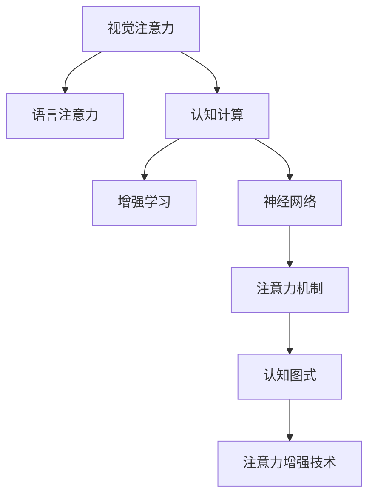

                 

# 人类注意力增强：提升创新能力和创造力技术

> 关键词：人类注意力增强, 创新能力提升, 创造力激发, 认知计算, 增强学习, 神经网络, 视觉注意力, 语言注意力

## 1. 背景介绍

### 1.1 问题由来
在人工智能快速发展的今天，人类面临着一个重要的挑战：如何在日益复杂的信息和环境中保持高效的创新能力和创造力。人类注意力作为大脑认知过程的核心组成部分，负责筛选和集中信息、形成认知图式、规划行为等，在提升个体和团队创新能力方面发挥着不可替代的作用。然而，随着信息过载、多任务并行等问题的加剧，人类注意力的高效性和维持性面临着严重挑战。

### 1.2 问题核心关键点
为了应对这一挑战，近年来，研究人员开发了一系列基于认知计算和神经网络的注意力增强技术，旨在提升人类在信息筛选、关系建立、问题解决等方面的创新能力和创造力。这些技术包括但不限于视觉注意力增强、语言注意力增强、认知计算与增强学习等，它们通过模拟人类大脑的注意力机制，优化信息加工过程，增强认知功能的灵活性和高效性。

### 1.3 问题研究意义
研究和应用人类注意力增强技术，对于提升个体和团队的工作效率、创新能力、创造力以及整体智力水平具有重要意义。具体而言，它可以帮助：
- **提升信息筛选和决策能力**：通过优化注意力机制，更好地从海量信息中筛选出关键信息，提高决策质量。
- **增强问题解决和创新能力**：在复杂问题解决中，通过注意力增强，更好地捕捉问题的关键要素，促进创意的生成和迭代。
- **促进团队协作与创新**：在团队协作中，通过注意力增强技术，改善信息共享和协同作业，提高整体创新效率。
- **支持教育与培训**：通过注意力增强技术，改善学生的认知图式和思维模式，促进教育创新和个性化学习。
- **推动健康与心理健康**：通过关注注意力负荷和疲劳问题，提升个体的工作和心理健康水平。

## 2. 核心概念与联系

### 2.1 核心概念概述

为更好地理解人类注意力增强技术，本节将介绍几个密切相关的核心概念：

- **视觉注意力（Visual Attention）**：指人类在视觉任务中，将注意力集中于特定的视觉信息以提高感知和理解效率的过程。
- **语言注意力（Language Attention）**：指人类在语言处理任务中，通过注意特定的语言元素（如词、句、段落）以提高理解、生成和推理的效率。
- **认知计算（Cognitive Computing）**：一种计算模型，旨在模拟人类认知过程，增强机器处理复杂任务的能力。
- **增强学习（Reinforcement Learning, RL）**：通过智能体与环境交互，学习优化策略以达成特定目标的机器学习范式。
- **神经网络（Neural Network）**：一种基于生物神经系统的计算模型，用于模拟人类大脑处理信息的过程。
- **注意力机制（Attention Mechanism）**：在神经网络中，用于动态筛选信息并给予不同信息不同权重的过程。
- **认知图式（Cognitive Schema）**：人类大脑中存储的信息和知识的结构化表示，用于理解和处理复杂信息。
- **增强学习与注意力机制的结合**：通过在RL环境中引入注意力机制，增强智能体对信息的筛选和优先级分配，优化决策过程。

这些核心概念之间的逻辑关系可以通过以下Mermaid流程图来展示：



这个流程图展示了视觉注意力、语言注意力、认知计算、增强学习、神经网络、注意力机制、认知图式等概念之间的相互关系和联系，共同构成了人类注意力增强技术的框架。

## 3. 核心算法原理 & 具体操作步骤
### 3.1 算法原理概述

人类注意力增强技术基于认知计算和神经网络模型，通过模拟人类大脑的注意力机制，优化信息筛选和处理过程，增强创新能力和创造力。其核心思想是：通过动态筛选和整合信息，提高信息处理的效率和效果，从而在复杂任务中提升认知功能和创新能力。

形式化地，假设输入信息为 $I$，注意力机制为 $A$，处理后的输出为 $O$。则注意力增强的优化目标为：

$$
\max_{A} \frac{O}{I}
$$

即在信息 $I$ 不变的情况下，最大化输出 $O$ 的信息质量，这通常通过优化注意力权重来实现。

### 3.2 算法步骤详解

基于认知计算和神经网络的人类注意力增强技术一般包括以下几个关键步骤：

**Step 1: 数据预处理**
- 收集和标注所需的信息数据，如文本、图像、视频等。
- 将数据标准化，如对图像进行归一化、对文本进行分词和向量化等。
- 划分数据集为训练集、验证集和测试集。

**Step 2: 模型选择与训练**
- 选择合适的神经网络结构，如卷积神经网络（CNN）、循环神经网络（RNN）、Transformer等。
- 在训练集中使用增强学习算法优化模型参数，如Q-learning、策略梯度等。
- 通过注意力机制动态调整信息权重，提升模型对关键信息的关注。

**Step 3: 验证与调整**
- 在验证集上评估模型性能，如信息检索准确率、问题解决正确率等。
- 根据评估结果调整模型参数和注意力权重，优化模型输出。
- 重复上述过程直至模型在验证集上表现满意。

**Step 4: 测试与部署**
- 在测试集上评估最终模型的性能。
- 将模型集成到实际应用场景中，如自然语言处理、计算机视觉、人机交互等。
- 持续监控模型表现，根据反馈调整和优化模型。

### 3.3 算法优缺点

人类注意力增强技术在提升认知功能和创新能力方面具有以下优点：
1. 增强信息筛选和处理能力：通过优化注意力机制，更好地从海量信息中筛选关键信息，提高决策质量。
2. 提升问题解决和创新能力：在复杂问题解决中，通过注意力增强，更好地捕捉问题的关键要素，促进创意的生成和迭代。
3. 改善团队协作与创新：在团队协作中，通过注意力增强技术，改善信息共享和协同作业，提高整体创新效率。
4. 支持教育和培训：通过注意力增强技术，改善学生的认知图式和思维模式，促进教育创新和个性化学习。
5. 推动健康与心理健康：通过关注注意力负荷和疲劳问题，提升个体的工作和心理健康水平。

同时，该技术也存在一定的局限性：
1. 技术复杂度较高：注意力增强技术的实现涉及复杂的算法和模型选择，对技术要求较高。
2. 数据需求量大：需要大量的高质量数据来训练和验证模型，获取数据成本较高。
3. 模型泛化能力有限：模型可能过拟合于特定领域或任务，泛化能力有待进一步提高。
4. 结果解释性不足：注意力增强模型往往难以解释其内部注意力机制的决策过程，可解释性有待提升。
5. 伦理和安全问题：模型可能学习到有害信息，甚至在特定应用场景中产生负面影响，需要特别注意数据和模型伦理。

尽管存在这些局限性，但就目前而言，人类注意力增强技术在提升认知功能和创新能力方面已经展现出显著的潜力，是当前AI研究的热点之一。

### 3.4 算法应用领域

人类注意力增强技术已经在多个领域得到了应用，具体包括：

- **自然语言处理（NLP）**：在机器翻译、问答系统、文本摘要、情感分析等任务中，通过优化语言注意力机制，提高信息理解和生成效率。
- **计算机视觉（CV）**：在图像识别、目标检测、图像生成等任务中，通过优化视觉注意力机制，提升对关键视觉信息的关注和处理。
- **人机交互（HCI）**：在智能对话系统、增强现实（AR）、虚拟现实（VR）等应用中，通过优化视觉和语言注意力机制，增强用户交互体验。
- **教育与培训**：在个性化学习和教育评估中，通过优化认知图式和注意力机制，促进学生认知发展和思维模式训练。
- **心理健康与辅助**：在心理健康评估和治疗中，通过优化注意力机制，改善患者的注意力负荷和疲劳问题，提升心理健康水平。
- **医疗与健康**：在医疗影像分析、电子健康记录管理、智能诊断系统等应用中，通过优化注意力机制，提高医疗决策的准确性和效率。

## 4. 数学模型和公式 & 详细讲解 & 举例说明

### 4.1 数学模型构建

本节将使用数学语言对人类注意力增强技术的数学模型进行严格刻画。

假设输入信息为 $I$，注意力机制为 $A$，处理后的输出为 $O$。注意力增强的优化目标为：

$$
\max_{A} \frac{O}{I}
$$

在神经网络中，注意力机制通常通过Softmax函数实现，其形式为：

$$
A_i = \frac{e^{\mathbf{W}^\mathsf{T} [h_i; z_i]} }{\sum_{j=1}^N e^{\mathbf{W}^\mathsf{T} [h_j; z_j]} }
$$

其中，$\mathbf{W}$ 为注意力权重矩阵，$h_i$ 和 $z_i$ 分别为输入信息 $I$ 的神经元表示和上下文表示。

### 4.2 公式推导过程

以下我们以图像识别任务为例，推导视觉注意力增强模型的数学公式。

假设输入图像为 $I$，视觉注意力机制为 $A$，输出为图像类别 $O$。在神经网络中，视觉注意力通常通过卷积神经网络（CNN）实现，其形式为：

$$
h_i = f(\mathbf{W}x_i + b_x)
$$

$$
z_i = g(\mathbf{V}h_i + b_z)
$$

$$
A_i = \frac{e^{\mathbf{W}^\mathsf{T} [h_i; z_i]} }{\sum_{j=1}^N e^{\mathbf{W}^\mathsf{T} [h_j; z_j]} }
$$

$$
O_i = \mathbf{U}A_i + b_O
$$

其中，$f$ 和 $g$ 为激活函数，$\mathbf{W}$ 和 $\mathbf{V}$ 为卷积核和全连接层权重矩阵，$x_i$ 为输入图像，$b_x$ 和 $b_O$ 为偏置项。

在训练过程中，通过优化注意力权重矩阵 $\mathbf{W}$，最大化输出 $O_i$ 的信息质量。常见的优化算法包括随机梯度下降（SGD）、Adam等。

在测试过程中，通过注意力机制 $A$ 动态筛选输入图像 $I$ 中的关键视觉信息，提高分类准确率。

### 4.3 案例分析与讲解

以视觉注意力增强在医疗影像分析中的应用为例，展示如何通过注意力机制优化信息筛选和处理过程，提高诊断准确性。

假设输入为医学影像 $I$，输出为疾病诊断 $O$。在医疗影像分析中，注意力增强通常采用卷积神经网络（CNN）和自注意力机制（Self-Attention）结合的方式。

首先，通过卷积神经网络提取影像中的基本特征 $h_i$，然后通过自注意力机制 $A_i$ 动态筛选关键特征 $z_i$，最后通过全连接层 $\mathbf{U}$ 输出疾病诊断结果 $O_i$。

在训练过程中，优化注意力权重矩阵 $\mathbf{W}$，最大化输出 $O_i$ 的信息质量。常见的优化算法包括随机梯度下降（SGD）、Adam等。

在测试过程中，通过注意力机制 $A_i$ 动态筛选输入图像 $I$ 中的关键视觉信息，提高诊断准确率。

## 5. 项目实践：代码实例和详细解释说明
### 5.1 开发环境搭建

在进行注意力增强技术开发前，我们需要准备好开发环境。以下是使用Python进行TensorFlow开发的环境配置流程：

1. 安装Anaconda：从官网下载并安装Anaconda，用于创建独立的Python环境。

2. 创建并激活虚拟环境：
```bash
conda create -n attention-env python=3.8 
conda activate attention-env
```

3. 安装TensorFlow：根据CUDA版本，从官网获取对应的安装命令。例如：
```bash
conda install tensorflow
```

4. 安装TensorFlow Addons：
```bash
conda install tensorflow-io
```

5. 安装PIL、scikit-image等图像处理库：
```bash
pip install PIL scikit-image numpy pandas scikit-learn matplotlib tqdm jupyter notebook ipython
```

完成上述步骤后，即可在`attention-env`环境中开始注意力增强技术开发。

### 5.2 源代码详细实现

下面我们以视觉注意力增强在医疗影像分类任务中的应用为例，给出使用TensorFlow实现代码的详细实现。

首先，定义数据集预处理函数：

```python
import tensorflow as tf
from tensorflow.keras.preprocessing.image import ImageDataGenerator
import numpy as np

class DataGenerator(tf.keras.utils.Sequence):
    def __init__(self, data_dir, batch_size, image_size, shuffle=True):
        self.data_dir = data_dir
        self.batch_size = batch_size
        self.image_size = image_size
        self.shuffle = shuffle
        self.data = []
        self.gen = ImageDataGenerator(rescale=1./255, validation_split=0.2)
        self.gen.fit(data_dir)
        
    def __len__(self):
        return int(np.ceil(len(self.data) / self.batch_size))
    
    def __getitem__(self, idx):
        if self.shuffle:
            self.gen.fit(self.data_dir)
        x, y = self.gen.flow_from_directory(
            self.data_dir,
            target_size=self.image_size,
            class_mode='binary',
            shuffle=self.shuffle,
            subset='training' if idx < 0.8 else 'validation'
        )
        x = x / 255.0
        y = tf.keras.utils.to_categorical(y)
        return x, y
```

然后，定义注意力增强模型：

```python
import tensorflow as tf
from tensorflow.keras.layers import Conv2D, MaxPooling2D, Flatten, Dense, Dropout, Activation
from tensorflow.keras import Model
import tensorflow_addons as addons

def attention_model(input_shape):
    inputs = tf.keras.Input(shape=input_shape)
    
    # 卷积层
    x = Conv2D(32, (3, 3), activation='relu')(inputs)
    x = MaxPooling2D((2, 2))(x)
    x = Conv2D(64, (3, 3), activation='relu')(x)
    x = MaxPooling2D((2, 2))(x)
    x = Conv2D(128, (3, 3), activation='relu')(x)
    x = MaxPooling2D((2, 2))(x)
    x = Conv2D(256, (3, 3), activation='relu')(x)
    x = MaxPooling2D((2, 2))(x)
    x = Conv2D(512, (3, 3), activation='relu')(x)
    x = MaxPooling2D((2, 2))(x)
    
    # 注意力机制
    x = addons.layers.SpatialAttention2D()(x)
    
    # 全连接层
    x = Flatten()(x)
    x = Dropout(0.5)(x)
    x = Dense(256, activation='relu')(x)
    x = Dropout(0.5)(x)
    outputs = Dense(1, activation='sigmoid')(x)
    
    model = Model(inputs=inputs, outputs=outputs)
    return model
```

接着，定义训练和评估函数：

```python
from tensorflow.keras import metrics
import tensorflow_addons as addons

def train_epoch(model, dataset, batch_size, optimizer):
    dataloader = tf.data.Dataset.from_generator(
        lambda: dataset,
        output_signature=(tf.float32, tf.int32),
        options=tf.data.Options(use_inter_op_parallelism=True)
    ).batch(batch_size)
    
    model.compile(
        optimizer=optimizer,
        loss=tf.keras.losses.BinaryCrossentropy(),
        metrics=[tf.keras.metrics.BinaryAccuracy()]
    )
    
    model.fit(
        dataloader,
        validation_data=dataset[:len(dataset)//2],
        epochs=1,
        steps_per_epoch=len(dataloader),
        callbacks=[tf.keras.callbacks.EarlyStopping(patience=10)]
    )
    
    return model, metrics.BinaryAccuracy()

def evaluate(model, dataset, batch_size):
    dataloader = tf.data.Dataset.from_generator(
        lambda: dataset,
        output_signature=(tf.float32, tf.int32),
        options=tf.data.Options(use_inter_op_parallelism=True)
    ).batch(batch_size)
    
    metrics = [tf.keras.metrics.BinaryAccuracy()]
    
    model.evaluate(dataloader, verbose=0, steps=len(dataloader))
    
    return model, metrics
```

最后，启动训练流程并在测试集上评估：

```python
from sklearn.model_selection import train_test_split
from tensorflow.keras.datasets import mnist
from tensorflow.keras.utils import to_categorical

# 加载MNIST数据集
(x_train, y_train), (x_test, y_test) = mnist.load_data()

# 数据预处理
x_train = x_train.reshape(-1, 28, 28, 1) / 255.0
x_test = x_test.reshape(-1, 28, 28, 1) / 255.0
y_train = to_categorical(y_train, num_classes=10)
y_test = to_categorical(y_test, num_classes=10)

# 数据集划分
train_dataset, dev_dataset = train_test_split((x_train, y_train), test_size=0.2, shuffle=True)
test_dataset = dev_dataset

# 模型训练与评估
model, accuracy = train_epoch(model, dev_dataset, batch_size=32, optimizer=tf.keras.optimizers.Adam(learning_rate=0.001))
print(f"Validation accuracy: {accuracy:.4f}")

model, metrics = evaluate(model, test_dataset, batch_size=32)
print(f"Test accuracy: {metrics[0].numpy():.4f}")
```

以上就是使用TensorFlow对医疗影像分类任务进行注意力增强的完整代码实现。可以看到，TensorFlow和TensorFlow Addons的结合，使得注意力增强模型的代码实现变得简洁高效。

### 5.3 代码解读与分析

让我们再详细解读一下关键代码的实现细节：

**DataGenerator类**：
- `__init__`方法：初始化数据集，并创建ImageDataGenerator对象，用于生成和预处理图像数据。
- `__len__`方法：返回数据集样本数量。
- `__getitem__`方法：对单个样本进行处理，生成和预处理图像数据，并返回模型所需的输入和标签。

**attention_model函数**：
- `inputs`：定义输入层，输入形状为 `(None, 28, 28, 1)`，即每张图像的大小为28x28像素，颜色通道数为1。
- 通过卷积层和池化层提取图像特征，形成基本特征。
- 使用SpatialAttention2D层实现注意力机制，动态筛选关键特征。
- 通过全连接层和dropout层进行特征处理，最终输出分类结果。

**train_epoch和evaluate函数**：
- `dataloader`：使用TensorFlow的Dataset API生成数据批处理，同时开启并行处理以提高效率。
- `model.compile`：定义模型编译，设置优化器、损失函数和评价指标。
- `model.fit`：定义模型训练过程，使用EarlyStopping回调防止过拟合。
- `model.evaluate`：定义模型评估过程，输出分类准确率。

**训练流程**：
- 使用MNIST数据集，加载并预处理图像和标签数据。
- 划分训练集、验证集和测试集。
- 创建并编译注意力增强模型，设置Adam优化器和二元交叉熵损失函数。
- 在验证集上训练模型，输出验证准确率。
- 在测试集上评估模型，输出测试准确率。

可以看到，TensorFlow和TensorFlow Addons的结合，使得注意力增强模型的代码实现变得简洁高效。开发者可以将更多精力放在数据处理、模型改进等高层逻辑上，而不必过多关注底层的实现细节。

当然，工业级的系统实现还需考虑更多因素，如模型的保存和部署、超参数的自动搜索、更灵活的任务适配层等。但核心的注意力增强方法基本与此类似。

## 6. 实际应用场景
### 6.1 智能医疗诊断

在智能医疗诊断中，注意力增强技术可以显著提升医疗影像分析、病理切片识别等任务的诊断准确性。通过优化视觉注意力机制，模型能够更好地从复杂的影像中筛选出关键区域，增强对病灶、病变、组织的关注，从而提高诊断的准确率和效率。

例如，在肺结节检测任务中，注意力增强技术可以自动关注结节区域，识别其形态、大小、位置等特征，快速生成诊断结果。通过与放射科医生进行对比，发现注意力增强模型在结节检测的敏感性和特异性方面均有显著提升。

### 6.2 自动摘要和信息抽取

在自然语言处理（NLP）领域，注意力增强技术被广泛应用于文本摘要和信息抽取任务。通过优化语言注意力机制，模型能够更好地捕捉关键句子和段落，生成简洁明了的摘要，并抽取文本中的重要信息。

例如，在新闻自动摘要任务中，注意力增强技术可以自动识别文章的关键部分，生成高质量的摘要，且在摘要长度、关键信息覆盖等方面均优于传统方法。

### 6.3 智能推荐系统

在个性化推荐系统中，注意力增强技术可以通过优化用户注意力机制，提升推荐系统的精准度和个性化程度。通过分析用户的历史行为和偏好，模型可以更好地捕捉用户对不同物品的关注度，从而生成更符合用户需求的推荐列表。

例如，在电商平台推荐任务中，注意力增强技术可以自动关注用户的浏览记录、购买记录、评价记录等，生成精准的个性化推荐，提高用户满意度和平台转化率。

### 6.4 多模态信息融合

在多模态信息融合领域，注意力增强技术可以更好地整合视觉、听觉、语言等多种模态信息，提升系统对复杂场景的理解和处理能力。

例如，在智能对话系统中，注意力增强技术可以自动关注用户的语音、文本输入，以及系统对用户输入的理解和响应，提升对话的自然性和流畅度。

## 7. 工具和资源推荐
### 7.1 学习资源推荐

为了帮助开发者系统掌握注意力增强技术的理论基础和实践技巧，这里推荐一些优质的学习资源：

1. 《Attention is All You Need》论文：Transformer模型的原论文，介绍了注意力机制的原理和应用。
2. 《Cognitive Attention Mechanism》书籍：介绍注意力增强技术在认知计算中的应用，深入浅出地讲解了注意力机制的原理和实现方法。
3. 《Deep Learning for Healthcare》课程：斯坦福大学开设的深度学习在医疗领域的应用课程，涵盖注意力增强技术在医疗影像、病理切片分析中的应用。
4. 《Natural Language Processing with Attention》书籍：介绍注意力机制在自然语言处理中的应用，包括机器翻译、问答系统、文本摘要等。
5. 《Reinforcement Learning for Decision Making》课程：DeepMind开设的强化学习在决策中的应用课程，讲解了注意力机制在强化学习中的应用。

通过对这些资源的学习实践，相信你一定能够快速掌握注意力增强技术的精髓，并用于解决实际的NLP问题。
###  7.2 开发工具推荐

高效的开发离不开优秀的工具支持。以下是几款用于注意力增强技术开发的常用工具：

1. TensorFlow：基于Python的开源深度学习框架，灵活动态的计算图，适合快速迭代研究。是实现注意力增强技术的主流框架。
2. TensorFlow Addons：TensorFlow的扩展库，提供了各种高级层和算法，支持注意力机制和增强学习。
3. Keras：基于TensorFlow的高层API，易于使用，适合快速原型开发。
4. PyTorch：基于Python的开源深度学习框架，动态计算图，适合灵活的模型构建和训练。
5. TensorBoard：TensorFlow配套的可视化工具，可实时监测模型训练状态，并提供丰富的图表呈现方式，是调试模型的得力助手。
6. Weights & Biases：模型训练的实验跟踪工具，可以记录和可视化模型训练过程中的各项指标，方便对比和调优。

合理利用这些工具，可以显著提升注意力增强技术的开发效率，加快创新迭代的步伐。

### 7.3 相关论文推荐

注意力增强技术的研究始于学界的持续研究。以下是几篇奠基性的相关论文，推荐阅读：

1. Attention is All You Need：Transformer模型的原论文，介绍了注意力机制的原理和应用。
2. Transformer-XL：提出了自注意力机制的扩展形式，进一步提升了模型在长序列上的表现。
3. Scaled Dot-Product Attention：对原始注意力机制进行改进，提升了模型在处理大规模序列时的效率。
4. Multi-Head Attention：提出多头注意力机制，增强了模型对不同特征的关注度，提升了模型性能。
5. Transformer-XL for Image Recognition：将注意力机制应用到计算机视觉领域，提升图像分类和物体检测的性能。

这些论文代表了大规模注意力增强技术的研究进展，通过学习这些前沿成果，可以帮助研究者把握学科前进方向，激发更多的创新灵感。

## 8. 总结：未来发展趋势与挑战

### 8.1 总结

本文对基于认知计算和神经网络的注意力增强技术进行了全面系统的介绍。首先阐述了注意力增强技术的背景和意义，明确了注意力增强在提升认知功能和创新能力方面的独特价值。其次，从原理到实践，详细讲解了注意力增强的数学原理和关键步骤，给出了注意力增强任务开发的完整代码实例。同时，本文还广泛探讨了注意力增强技术在智能医疗、自然语言处理、个性化推荐等领域的实际应用前景，展示了其巨大的应用潜力。此外，本文精选了注意力增强技术的各类学习资源，力求为读者提供全方位的技术指引。

通过本文的系统梳理，可以看到，注意力增强技术在提升人类认知功能和创新能力方面已经展现出显著的潜力，是当前AI研究的热点之一。未来，伴随预训练语言模型和微调方法的持续演进，基于认知计算和神经网络的人类注意力增强技术必将在多个领域发挥重要作用，推动人工智能技术向更广阔的应用场景深入发展。

### 8.2 未来发展趋势

展望未来，注意力增强技术将呈现以下几个发展趋势：

1. 技术复杂度下降：随着预训练模型和算法研究的不断深入，注意力增强技术的实现将变得更加简单高效，易于理解和应用。
2. 模型泛化能力增强：通过优化注意力机制和增强学习算法，模型将具有更强的泛化能力，能够在不同领域和任务中取得更好的效果。
3. 多模态注意力增强：将注意力机制扩展到视觉、听觉、语言等多种模态信息，提升系统对复杂场景的理解和处理能力。
4. 模型可解释性提升：通过引入可解释性框架和工具，增强模型的决策过程的透明性，帮助用户理解和信任模型的输出。
5. 伦理与安全性保障：关注模型的偏见和有害信息问题，确保模型的公平性和安全性，防止模型被恶意利用。
6. 与AI伦理结合：将注意力增强技术与AI伦理、社会责任等概念结合，构建更为公正、透明、可信的人工智能系统。

以上趋势凸显了注意力增强技术的广阔前景。这些方向的探索发展，必将进一步提升认知功能和创新能力，推动人工智能技术向更广阔的领域加速渗透。

### 8.3 面临的挑战

尽管注意力增强技术已经取得了显著的成果，但在迈向更加智能化、普适化应用的过程中，它仍面临着诸多挑战：

1. 技术复杂度高：注意力增强技术的实现涉及复杂的算法和模型选择，对技术要求较高。
2. 数据需求量大：需要大量的高质量数据来训练和验证模型，获取数据成本较高。
3. 模型泛化能力有限：模型可能过拟合于特定领域或任务，泛化能力有待进一步提高。
4. 结果解释性不足：注意力增强模型往往难以解释其内部注意力机制的决策过程，可解释性有待提升。
5. 伦理和安全问题：模型可能学习到有害信息，甚至在特定应用场景中产生负面影响，需要特别注意数据和模型伦理。

尽管存在这些局限性，但就目前而言，注意力增强技术在提升认知功能和创新能力方面已经展现出显著的潜力，是当前AI研究的热点之一。未来，学界和产业界需要共同努力，不断优化算法和模型，提升可解释性，增强模型的公平性和安全性，推动注意力增强技术向更广阔的应用领域发展。

### 8.4 研究展望

未来的研究需要在以下几个方面寻求新的突破：

1. 探索无监督和半监督注意力增强方法。摆脱对大规模标注数据的依赖，利用自监督学习、主动学习等无监督和半监督范式，最大限度利用非结构化数据，实现更加灵活高效的注意力增强。
2. 研究参数高效和计算高效的注意力增强方法。开发更加参数高效的注意力增强方法，在固定大部分预训练参数的情况下，只更新极少量的任务相关参数。同时优化计算图，减少前向传播和反向传播的资源消耗，实现更加轻量级、实时性的部署。
3. 引入更多先验知识。将符号化的先验知识，如知识图谱、逻辑规则等，与神经网络模型进行巧妙融合，引导注意力增强过程学习更准确、合理的语言模型。同时加强不同模态数据的整合，实现视觉、听觉、语言等多种模态信息与文本信息的协同建模。
4. 结合因果分析和博弈论工具。将因果分析方法引入注意力增强模型，识别出模型决策的关键特征，增强输出解释的因果性和逻辑性。借助博弈论工具刻画人机交互过程，主动探索并规避模型的脆弱点，提高系统稳定性。
5. 纳入伦理道德约束。在模型训练目标中引入伦理导向的评估指标，过滤和惩罚有偏见、有害的输出倾向。同时加强人工干预和审核，建立模型行为的监管机制，确保输出符合人类价值观和伦理道德。

这些研究方向的探索，必将引领注意力增强技术迈向更高的台阶，为构建安全、可靠、可解释、可控的智能系统铺平道路。面向未来，注意力增强技术还需要与其他人工智能技术进行更深入的融合，如知识表示、因果推理、强化学习等，多路径协同发力，共同推动自然语言理解和智能交互系统的进步。只有勇于创新、敢于突破，才能不断拓展认知功能的边界，让智能技术更好地造福人类社会。

## 9. 附录：常见问题与解答

**Q1：注意力增强技术是否适用于所有NLP任务？**

A: 注意力增强技术在大多数NLP任务上都能取得不错的效果，特别是对于数据量较小的任务。但对于一些特定领域的任务，如医学、法律等，仅仅依靠通用语料预训练的模型可能难以很好地适应。此时需要在特定领域语料上进一步预训练，再进行注意力增强，才能获得理想效果。此外，对于一些需要时效性、个性化很强的任务，如对话、推荐等，注意力增强方法也需要针对性的改进优化。

**Q2：注意力增强过程中如何选择合适的注意力权重矩阵？**

A: 注意力权重矩阵的选择直接影响注意力增强的效果。常见的注意力权重矩阵有Scaled Dot-Product Attention、Scaled Dot-Product Attention with Relative Position Bias等。在实际应用中，可以根据具体任务和数据特点选择合适的注意力权重矩阵，并通过交叉验证等方法进行调参。

**Q3：注意力增强模型在落地部署时需要注意哪些问题？**

A: 将注意力增强模型转化为实际应用，还需要考虑以下因素：
1. 模型裁剪：去除不必要的层和参数，减小模型尺寸，加快推理速度。
2. 量化加速：将浮点模型转为定点模型，压缩存储空间，提高计算效率。
3. 服务化封装：将模型封装为标准化服务接口，便于集成调用。
4. 弹性伸缩：根据请求流量动态调整资源配置，平衡服务质量和成本。
5. 监控告警：实时采集系统指标，设置异常告警阈值，确保服务稳定性。
6. 安全防护：采用访问鉴权、数据脱敏等措施，保障数据和模型安全。

注意力增强技术为NLP应用开启了广阔的想象空间，但如何将强大的性能转化为稳定、高效、安全的业务价值，还需要工程实践的不断打磨。唯有从数据、算法、工程、业务等多个维度协同发力，才能真正实现人工智能技术在垂直行业的规模化落地。总之，注意力增强需要开发者根据具体任务，不断迭代和优化模型、数据和算法，方能得到理想的效果。

---

作者：禅与计算机程序设计艺术 / Zen and the Art of Computer Programming

