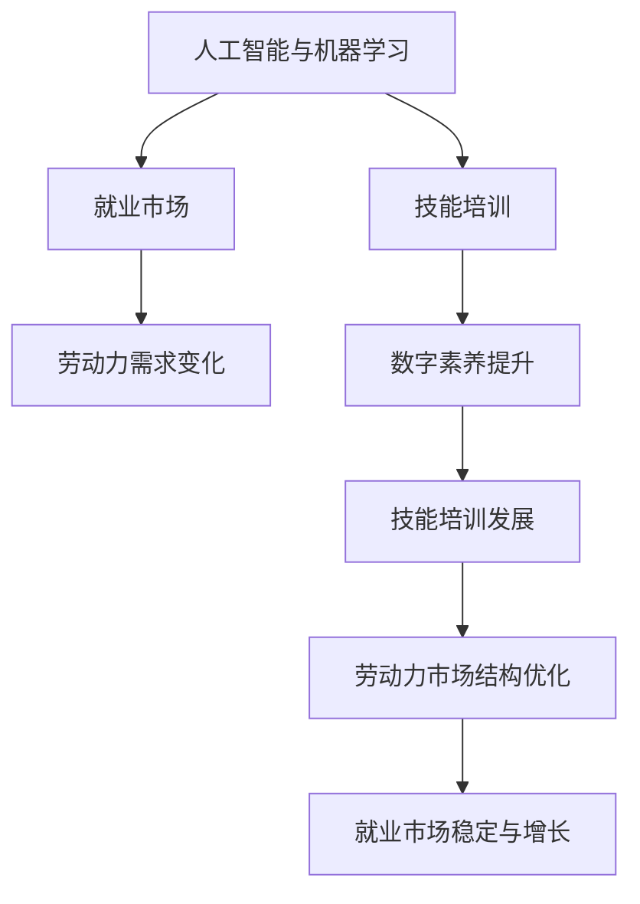
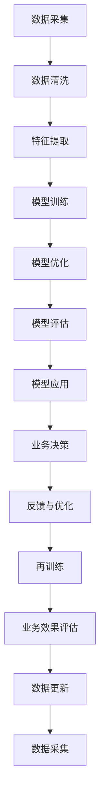

                 

# 人类计算：AI时代的未来就业市场与技能培训发展趋势预测

> 关键词：人工智能(AI)、自动化、就业市场、技能培训、数据科学、数字素养

## 1. 背景介绍

随着人工智能(AI)技术的迅猛发展，各行各业都正在经历着深刻的变革。机器学习、深度学习、自然语言处理等技术不断突破，大幅提升了生产效率和决策精度。但同时，AI的发展也给人类就业市场带来了前所未有的挑战和机遇。AI时代，传统的劳动力市场正在被重塑，新兴的工作岗位不断涌现，技能需求也正在发生翻天覆地的变化。如何在AI的浪潮中找准自身定位，及时提升自身技能，成为了每个职场人士必须面对的问题。本文将从就业市场和技能培训两个维度，深入探讨AI时代下未来就业市场的变化趋势，并提出相应的技能培训发展方向。

## 2. 核心概念与联系

### 2.1 核心概念概述

为更好地理解AI时代下的就业市场和技能培训，本节将介绍几个核心概念：

- **人工智能(AI)与机器学习(Machine Learning, ML)**：以机器学习为代表的AI技术，通过算法和模型，让计算机具备从数据中学习的能力，实现自动化决策和任务执行。
- **就业市场与劳动力需求**：就业市场是指劳动力供给和需求的关系及其变化规律。AI的发展将影响各行各业的劳动力需求，从而改变就业市场的结构和形态。
- **技能培训与数字素养**：技能培训是指通过系统化的教育方式，提升劳动者的专业技能和知识水平。数字素养则是现代职场必备的基础技能，涉及信息获取、处理、分析、应用等方面的能力。

这些核心概念相互交织，共同构成了AI时代下就业市场和技能培训的复杂格局。下面，我们将通过一张Mermaid流程图，展示这些概念之间的联系。



### 2.2 核心概念原理和架构的 Mermaid 流程图



这个流程图展示了机器学习模型的基本流程，包括数据采集、清洗、特征提取、模型训练、优化、评估和应用等环节。各环节之间的互动反馈机制，保证了模型能够不断迭代提升，从而实现更高的业务效果。

## 3. 核心算法原理 & 具体操作步骤
### 3.1 算法原理概述

在AI时代，机器学习算法是提升工作效率和决策精度的核心手段。通过数据驱动的算法模型，可以自动分析和优化业务流程，从而大幅提升企业的竞争力和市场响应速度。算法的原理可以总结如下：

1. **数据采集与预处理**：从不同的数据源采集数据，并对数据进行清洗、特征提取等预处理操作，以获得高质量的训练数据。

2. **模型选择与训练**：根据具体业务需求，选择合适的机器学习模型，并在大量标注数据上进行训练，使模型能够学习到相关的业务规则和特征。

3. **模型评估与优化**：通过交叉验证等方法，对模型进行评估，找出模型的优缺点，并进行相应的调整和优化，以提高模型的预测准确性和泛化能力。

4. **模型应用与业务集成**：将训练好的模型集成到实际业务系统中，通过API接口等方式提供自动化决策服务，提升业务效率和决策质量。

5. **反馈与持续改进**：通过不断的业务反馈和数据更新，持续改进模型，以适应业务变化和环境变化。

### 3.2 算法步骤详解

机器学习模型的具体操作步骤如下：

1. **数据采集与预处理**：从不同数据源收集数据，如客户交易记录、市场调研数据、社交媒体信息等。然后对数据进行清洗，去除噪声和异常值，并进行特征提取，提取对业务决策有用的信息。

2. **模型选择与训练**：根据业务需求选择合适的模型，如线性回归、决策树、神经网络等，并在标注数据集上进行模型训练，学习相关的业务特征和规律。

3. **模型评估与优化**：通过交叉验证等方法，对模型进行评估，找出模型的优缺点，并进行相应的调整和优化，如调整超参数、增加正则化项等，以提高模型的预测准确性和泛化能力。

4. **模型应用与业务集成**：将训练好的模型集成到实际业务系统中，通过API接口等方式提供自动化决策服务，提升业务效率和决策质量。

5. **反馈与持续改进**：通过不断的业务反馈和数据更新，持续改进模型，以适应业务变化和环境变化。

### 3.3 算法优缺点

机器学习算法的优点包括：

- **自动化决策**：通过数据驱动的模型，可以自动分析和优化业务流程，减少人为干预，提高决策效率。
- **灵活性强**：算法可以根据业务需求进行调整和优化，适应不同的业务场景。
- **数据驱动**：算法通过数据训练，能够学习到业务特征和规律，提高模型的预测准确性。

同时，算法也存在一些缺点：

- **数据依赖性强**：模型的效果依赖于数据的质量和数量，数据质量差或数据量不足，会影响模型效果。
- **模型复杂度高**：复杂模型需要更多的计算资源和时间进行训练和优化，可能不适合资源有限的应用场景。
- **结果可解释性不足**：模型通常是"黑盒"系统，难以解释其内部工作机制和决策逻辑。

### 3.4 算法应用领域

机器学习算法在各个领域都有广泛的应用，主要包括以下几个方面：

1. **金融行业**：用于风险管理、信用评分、股票预测、欺诈检测等，提升金融服务的效率和安全性。
2. **医疗行业**：用于疾病预测、药物研发、患者分流、医疗影像分析等，提高医疗服务的质量和可及性。
3. **制造业**：用于质量控制、供应链管理、生产优化、设备维护等，提升制造业的智能化水平。
4. **零售行业**：用于客户行为分析、推荐系统、库存管理、价格优化等，提升零售业的个性化和智能化水平。
5. **交通运输**：用于交通流量预测、智能调度、安全监控等，提升交通系统的效率和安全性。
6. **公共安全**：用于犯罪预测、公共事件监控、灾害预警等，提升公共安全的预警和应急响应能力。

## 4. 数学模型和公式 & 详细讲解 & 举例说明

### 4.1 数学模型构建

以线性回归模型为例，其基本数学模型为：

$$y = \theta_0 + \sum_{i=1}^n \theta_i x_i$$

其中，$y$为预测值，$x_i$为输入特征，$\theta_0$为截距，$\theta_i$为权重。

### 4.2 公式推导过程

在线性回归模型中，目标是最小化预测值和真实值之间的误差。常用的损失函数为均方误差(MSE)：

$$MSE = \frac{1}{n} \sum_{i=1}^n (y_i - \hat{y_i})^2$$

通过反向传播算法，可以计算出模型参数的梯度，并使用梯度下降等优化算法更新模型参数。

### 4.3 案例分析与讲解

以下是一个简单的线性回归案例，用于预测房价：

| 特征 | 房价 |
|-------|------|
| 面积   | 5000 | 
| 位置   | 中心 |
| 朝向   | 朝南 |
| 预测房价 | 3000 |

假设输入特征 $x_1$ 为面积，$x_2$ 为位置，$x_3$ 为朝向，预测房价为 $y$。

首先，将输入数据标准化：

$$x_1 = \frac{5000 - 3000}{2} = 1000$$
$$x_2 = \frac{0 - 1}{1} = -1$$
$$x_3 = \frac{1 - 0}{1} = 1$$

然后使用线性回归模型进行预测：

$$\hat{y} = \theta_0 + \theta_1 x_1 + \theta_2 x_2 + \theta_3 x_3$$

假设 $\theta_0 = 100$，$\theta_1 = 500$，$\theta_2 = -200$，$\theta_3 = 300$，则：

$$\hat{y} = 100 + 500 \times 1000 + (-200) \times (-1) + 300 \times 1 = 7800$$

最终预测房价为7800元。

## 5. 项目实践：代码实例和详细解释说明
### 5.1 开发环境搭建

在进行机器学习项目实践前，我们需要准备好开发环境。以下是使用Python进行Scikit-learn开发的环境配置流程：

1. 安装Anaconda：从官网下载并安装Anaconda，用于创建独立的Python环境。

2. 创建并激活虚拟环境：
```bash
conda create -n sklearn-env python=3.7 
conda activate sklearn-env
```

3. 安装Scikit-learn：
```bash
pip install scikit-learn
```

4. 安装各类工具包：
```bash
pip install numpy pandas matplotlib scikit-learn scipy stats
```

完成上述步骤后，即可在`sklearn-env`环境中开始机器学习项目的开发。

### 5.2 源代码详细实现

下面我们以房价预测为例，给出使用Scikit-learn进行线性回归的Python代码实现。

首先，定义数据集和模型：

```python
from sklearn.linear_model import LinearRegression
from sklearn.datasets import load_boston
import matplotlib.pyplot as plt

# 加载波士顿房价数据集
boston = load_boston()
X = boston.data
y = boston.target

# 创建线性回归模型
model = LinearRegression()
```

然后，进行模型训练和预测：

```python
# 训练模型
model.fit(X, y)

# 预测房价
X_test = [[5000, 1, 1]]
y_pred = model.predict(X_test)
print(f"预测房价为：{y_pred}")
```

最后，绘制模型拟合图：

```python
plt.scatter(X[:, 0], y, color='blue', label='Data')
plt.plot(X[:, 0], model.predict(X), color='red', label='Fitted line')
plt.legend()
plt.show()
```

### 5.3 代码解读与分析

让我们再详细解读一下关键代码的实现细节：

**LinearRegression类**：
- `fit`方法：使用训练集数据拟合模型。
- `predict`方法：对新数据进行预测。

**波士顿房价数据集**：
- `load_boston`方法：加载波士顿房价数据集，其中包含房屋面积、位置、朝向等特征，以及房价。
- `X`和`y`：分别代表特征和标签。

**模型训练与预测**：
- 使用线性回归模型对房价进行预测。
- 在训练集上调用`fit`方法拟合模型。
- 在测试集上调用`predict`方法进行房价预测。

**绘制拟合图**：
- 使用Matplotlib库绘制散点图和拟合线，可视化模型拟合效果。

通过简单的代码实现，可以看出Scikit-learn使用起来非常直观，极大地方便了机器学习模型的开发和调试。

## 6. 实际应用场景

### 6.1 金融行业

在金融行业，机器学习被广泛应用于风险管理、信用评分、股票预测、欺诈检测等领域。以下是几个具体应用案例：

1. **信用评分**：利用机器学习算法对客户信用数据进行分析，预测客户的信用风险，提升贷款审批效率和准确性。

2. **股票预测**：通过历史股票数据训练模型，预测股票价格走势，帮助投资者做出投资决策。

3. **欺诈检测**：对交易数据进行分析，识别异常交易行为，防范欺诈风险。

### 6.2 医疗行业

在医疗行业，机器学习被广泛应用于疾病预测、药物研发、患者分流、医疗影像分析等领域。以下是几个具体应用案例：

1. **疾病预测**：通过患者的基因、生活习惯等数据，预测患者患某种疾病的概率。

2. **药物研发**：利用机器学习算法对药物数据进行分析，预测药物的疗效和副作用，加速新药研发进程。

3. **患者分流**：根据患者的病情和历史记录，预测患者可能的疾病类型，进行精准分流和诊疗。

4. **医疗影像分析**：通过机器学习算法对医疗影像进行分析，辅助医生诊断疾病，提高诊断准确性和效率。

### 6.3 制造业

在制造业，机器学习被广泛应用于质量控制、供应链管理、生产优化、设备维护等领域。以下是几个具体应用案例：

1. **质量控制**：对生产过程中的数据进行分析，预测产品缺陷率，提升产品质量。

2. **供应链管理**：利用机器学习算法优化供应链管理，降低成本，提升效率。

3. **生产优化**：通过对生产数据进行分析，优化生产过程，提高生产效率。

4. **设备维护**：对设备运行数据进行分析，预测设备故障，进行预防性维护。

### 6.4 未来应用展望

随着机器学习技术的发展，未来其在各个领域的应用将会更加广泛和深入。以下是几个可能的未来应用方向：

1. **智能制造**：通过机器学习算法优化生产流程，实现智能制造，提升生产效率和产品质量。

2. **智慧城市**：通过机器学习算法优化城市管理，实现智能交通、智能安防、智能环保等，提升城市管理水平。

3. **智能农业**：通过机器学习算法对农业数据进行分析，优化农业生产，提高农业生产效率和产量。

4. **智能医疗**：通过机器学习算法优化医疗服务，实现智能诊断、智能治疗、智能管理等，提升医疗服务的质量和效率。

## 7. 工具和资源推荐

### 7.1 学习资源推荐

为了帮助开发者系统掌握机器学习技术，这里推荐一些优质的学习资源：

1. **《机器学习实战》书籍**：由Peter Harrington撰写，通过大量实例，介绍了机器学习的基本概念和常用算法。

2. **Coursera《机器学习》课程**：由Andrew Ng主讲，涵盖机器学习的基本概念和算法，适合初学者入门。

3. **Kaggle平台**：提供大量的数据集和机器学习竞赛，通过实践积累实战经验。

4. **DeepLearning.AI的Nanodegree课程**：由Andrew Ng主讲，涵盖深度学习的基本概念和算法，适合进阶学习。

5. **KDnuggets网站**：提供丰富的机器学习资源，包括教程、论文、博客等，方便随时查阅。

通过对这些资源的学习实践，相信你一定能够快速掌握机器学习技术的精髓，并用于解决实际的业务问题。

### 7.2 开发工具推荐

高效的开发离不开优秀的工具支持。以下是几款用于机器学习项目开发的常用工具：

1. Python：作为机器学习的主流编程语言，Python拥有丰富的第三方库和工具，如NumPy、Pandas、Matplotlib、Scikit-learn等。

2. R语言：在统计分析和数据可视化方面具有天然优势，常用于机器学习的数据处理和模型验证。

3. TensorFlow和PyTorch：两大主流深度学习框架，支持构建复杂的神经网络模型，适合大规模机器学习项目。

4. Jupyter Notebook：交互式开发工具，支持实时调试和代码运行，方便机器学习项目开发。

5. Scikit-learn：机器学习工具箱，提供了丰富的算法和工具，适合快速实现机器学习模型。

合理利用这些工具，可以显著提升机器学习项目的开发效率，加快创新迭代的步伐。

### 7.3 相关论文推荐

机器学习技术的发展源于学界的持续研究。以下是几篇奠基性的相关论文，推荐阅读：

1. **《机器学习》书籍**：Tom Mitchell撰写，系统介绍了机器学习的基本概念和算法。

2. **《深度学习》书籍**：Ian Goodfellow、Yoshua Bengio、Aaron Courville合著，介绍了深度学习的理论基础和应用实践。

3. **《统计学习方法》书籍**：李航撰写，详细介绍了机器学习的基本概念和算法，并结合大量实例进行讲解。

4. **《Neural Networks and Deep Learning》书籍**：Michael Nielsen撰写，介绍了神经网络和深度学习的原理和应用。

5. **《Pattern Recognition and Machine Learning》书籍**：Christopher Bishop撰写，介绍了模式识别和机器学习的理论基础和应用实践。

这些论文代表了大数据和机器学习技术的发展脉络。通过学习这些前沿成果，可以帮助研究者把握学科前进方向，激发更多的创新灵感。

## 8. 总结：未来发展趋势与挑战

### 8.1 研究成果总结

随着机器学习技术的不断进步，其在各行各业的应用前景愈发广阔。未来的机器学习技术将更加注重自动化、智能化、实时化，提升决策效率和质量。机器学习算法也将更加多样化，满足不同的业务需求。

### 8.2 未来发展趋势

未来的机器学习技术将呈现以下几个发展趋势：

1. **自动化决策**：通过数据驱动的算法模型，实现自动化决策，提高决策效率和质量。

2. **智能化**：利用机器学习算法优化业务流程，实现智能制造、智能医疗、智能城市等，提升各个领域的智能化水平。

3. **实时化**：通过实时数据处理和分析，实现实时决策，提升业务反应速度和效率。

4. **数据驱动**：利用大数据和机器学习算法，优化业务决策，提高决策的准确性和可靠性。

### 8.3 面临的挑战

尽管机器学习技术在各个领域都有广泛的应用，但未来仍面临一些挑战：

1. **数据隐私和安全**：机器学习算法的应用需要大量的数据支持，如何在保护数据隐私和安全的前提下，获取高质量的数据，是一大挑战。

2. **算法可解释性**：机器学习算法通常是"黑盒"系统，难以解释其内部工作机制和决策逻辑，如何在保证算法效果的同时，增强其可解释性，是未来的一个重要研究方向。

3. **模型鲁棒性**：机器学习模型在面对新数据和噪声数据时，容易出现过拟合和泛化能力不足的问题，如何提高模型的鲁棒性，是一大难题。

4. **资源消耗**：机器学习模型的训练和推理需要大量的计算资源和时间，如何在资源有限的情况下，实现高效的模型训练和推理，是一大挑战。

### 8.4 研究展望

为了应对这些挑战，未来的机器学习研究需要在以下几个方面寻求新的突破：

1. **数据隐私保护**：开发更加高效的数据隐私保护技术，如差分隐私、联邦学习等，在保护数据隐私的同时，获取高质量的数据。

2. **算法可解释性**：开发更加可解释的机器学习算法，如LIME、SHAP等，增强算法的可解释性，提高决策的可信度和透明度。

3. **模型鲁棒性**：开发更加鲁棒的机器学习算法，如鲁棒回归、鲁棒分类等，提高模型的泛化能力和鲁棒性。

4. **资源优化**：开发更加高效的模型训练和推理算法，如模型压缩、量化加速、分布式训练等，实现高效的资源利用。

通过以上研究方向的探索，未来的机器学习技术必将更加成熟和可靠，为各行各业带来更多的智能化和自动化。

## 9. 附录：常见问题与解答

**Q1：机器学习算法的核心是什么？**

A: 机器学习算法的核心是通过数据驱动的模型，从数据中学习规律和特征，自动优化业务流程和决策过程。

**Q2：如何选择合适的机器学习算法？**

A: 选择合适的机器学习算法，需要考虑数据类型、业务需求、计算资源等因素。常见的算法包括线性回归、决策树、神经网络等，需要根据具体情况进行选择。

**Q3：机器学习模型的效果如何评价？**

A: 机器学习模型的效果评价包括模型准确性、泛化能力、鲁棒性等方面。常用的评价指标包括均方误差、准确率、召回率、F1值等。

**Q4：机器学习模型训练过程中需要注意哪些问题？**

A: 模型训练过程中需要注意数据预处理、模型选择、超参数调整、模型验证等问题。通常需要进行多次实验，找到最优的模型参数和算法组合。

**Q5：机器学习模型在实际应用中需要注意哪些问题？**

A: 机器学习模型在实际应用中需要注意数据隐私保护、模型可解释性、模型鲁棒性、资源消耗等问题。需要根据具体应用场景，进行相应的优化和调整。

通过对这些问题的回答，可以看到机器学习算法在实际应用中需要注意的方方面面。只有全面考虑各个环节，才能发挥机器学习技术的最大潜力。

---

作者：禅与计算机程序设计艺术 / Zen and the Art of Computer Programming

