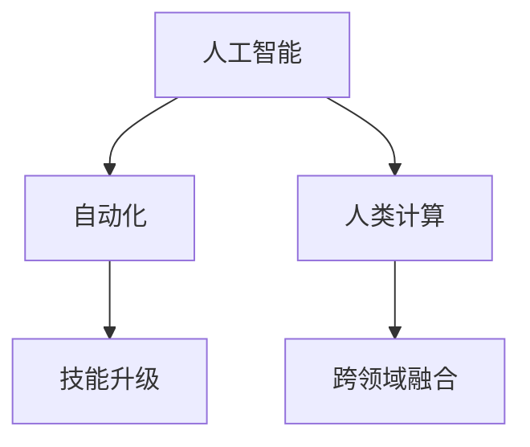

                 

# 人类计算：AI时代的未来就业趋势分析

在人工智能(AI)日益普及的今天，机器自动化已经渗透到各行各业，引发了广泛的社会关注和讨论。本篇文章将深入分析AI时代下，人类计算的角色转变和未来就业趋势。

## 1. 背景介绍

### 1.1 问题由来
随着AI技术的发展，自动化的工作逐渐增多，对人类工作带来了深远影响。自动化将部分重复性、单调性的工作转交给机器，改变了传统的生产方式和工作模式。机器效率的提升让人类得以从枯燥的重复劳动中解脱出来，转向更具创造性、高附加值的任务。但同时，部分低技能工作被机器替代，使得失业率上升。

### 1.2 问题核心关键点
在AI时代下，人类计算的职能将发生显著变化：
1. 自动化取代了重复性、机械性工作，推动劳动力向创新、创意、高复杂性任务转移。
2. 新增就业岗位将集中在AI技术研发、应用部署和维护，以及跨领域融合创新等高技能领域。
3. 教育系统将进行适应性调整，培养与AI时代需求相符的技能，如编程、数据分析、机器学习等。
4. 持续的技能提升和终身学习将成为个人发展的必然要求，以应对技术变革的挑战。

## 2. 核心概念与联系

### 2.1 核心概念概述

为更好地理解AI时代下人类计算的转变，本节将介绍几个密切相关的核心概念：

- **人工智能**：指模拟人类智能行为的计算技术，包括机器学习、深度学习、自然语言处理、计算机视觉等方向。
- **自动化**：指通过计算机程序和算法，将人机交互中的任务自动化，包括工作、生产、服务等各个环节。
- **人类计算**：指在AI时代下，人类在计算任务中扮演的角色和职能转变，包括但不限于算法设计、数据标注、模型训练等。
- **技能升级**：指在AI时代下，人类工作技能的升级和转型，包括但不限于编程、数据分析、机器学习等新兴技能。
- **跨领域融合**：指AI技术与不同领域如医疗、教育、金融等的深度融合，带来新的应用场景和就业机会。

这些概念之间的逻辑关系可以通过以下Mermaid流程图来展示：



这个流程图展示出AI时代下人类计算的四个核心方向：

1. AI技术的自动化应用推动了人类计算角色的转变。
2. 自动化工作减少，技能升级成为个人发展的必要条件。
3. AI技术的跨领域融合带来了新的就业机会。

## 3. 核心算法原理 & 具体操作步骤

### 3.1 算法原理概述

AI时代下，人类计算的职能转变主要基于两个基本原理：

1. **替代效应**：机器自动化取代了部分重复性、机械性的工作，释放了人力资源，使人们能够转向更具创造性和复杂性的任务。
2. **协同效应**：人类计算与机器计算相辅相成，共同完成更复杂、更智能的计算任务，推动生产效率和创新能力的提升。

基于以上原理，AI时代下人类计算的职能转变可分为以下几步：

- **任务重塑**：自动化技术取代部分工作后，人类计算将更多地聚焦在具有高附加值的任务上。
- **技能转型**：人类需掌握新的技能，适应AI技术的普及和应用。
- **创新驱动**：人类计算需结合AI技术，实现跨领域创新，开拓新就业领域。

### 3.2 算法步骤详解

AI时代下人类计算的职能转变步骤包括：

1. **自动化评估与替代**：评估哪些工作可以被机器替代，通过技术手段替代这些工作。
2. **技能升级与培训**：为被替代的工作者提供技能升级和再培训，使其适应新兴工作岗位。
3. **创新应用与创造**：利用AI技术进行跨领域创新应用，创造新的工作岗位。
4. **长期跟踪与调整**：持续跟踪技术发展和就业市场变化，调整技能培训内容和方式。

### 3.3 算法优缺点

AI时代下人类计算职能转变的优缺点如下：

**优点：**

1. **提高生产效率**：自动化技术提高效率，使人类能够专注于更有价值的任务。
2. **促进创新与转型**：推动技术和产业的升级，创造新的就业机会。
3. **改善工作环境**：降低重复性劳动带来的工作压力，提高工作满意度。

**缺点：**

1. **就业不稳定性**：部分低技能岗位被机器替代，导致就业不稳定性增加。
2. **技能匹配困难**：新岗位要求新技能，对现有劳动力的适应性提出了挑战。
3. **技术依赖加剧**：过度依赖技术可能带来新的风险，如技术失业、隐私泄露等。

### 3.4 算法应用领域

AI时代下人类计算的职能转变涉及多个应用领域：

- **制造业**：自动化设备在制造业广泛应用，提高了生产效率和精确度。
- **医疗健康**：AI辅助诊断、药物研发等技术提高医疗服务的质量和可及性。
- **金融服务**：自动化交易、风险评估等技术提升了金融行业的效率和风险控制能力。
- **教育培训**：个性化学习、智能辅助等技术改变了传统教育模式，提高了教育质量。
- **物流配送**：无人驾驶、智能仓储等技术优化了物流配送流程，提高了效率。

## 4. 数学模型和公式 & 详细讲解 & 举例说明

### 4.1 数学模型构建

在AI时代下，人类计算职能转变的数学模型可表示为：

$$
\text{新职能} = \text{旧职能} - \text{自动化替代} + \text{跨领域创新}
$$

其中，$\text{新职能}$表示AI时代下人类计算的新角色和职能，$\text{旧职能}$表示传统人类计算的工作内容，$\text{自动化替代}$表示被机器取代的部分工作，$\text{跨领域创新}$表示新增的创新性工作岗位。

### 4.2 公式推导过程

以制造业为例，假设机器自动化取代了部分流水线工作，替代比例为$r$。则新职能和旧职能的变化可以表示为：

$$
\text{新职能} = \text{旧职能} - r + \text{跨领域创新}
$$

对于具体的行业，可以将$\text{跨领域创新}$分解为与AI技术相关的各项创新，如自动化设备改进、智能制造系统设计等。

### 4.3 案例分析与讲解

以医疗健康行业为例，AI技术在医疗影像分析、疾病预测、药物研发等方面的应用，提升了医疗服务的质量。但同时，一些基本的医疗服务如挂号、缴费等仍需人工完成。新职能和旧职能的变化可以通过以下公式表示：

$$
\text{新职能} = \text{旧职能} - r + \text{AI辅助诊断} + \text{智能医疗系统设计}
$$

其中，$r$为机器取代的重复性工作比例，$\text{AI辅助诊断}$和$\text{智能医疗系统设计}$为新增加的创新性工作岗位。

## 5. 项目实践：代码实例和详细解释说明

### 5.1 开发环境搭建

为实现AI时代下人类计算职能转变的模型构建，首先需要搭建开发环境：

1. 安装Python：从官网下载并安装Python 3.x版本。
2. 安装必要的库：使用pip安装numpy、pandas、scikit-learn等常用库。
3. 使用Jupyter Notebook：安装jupyter-lab或jupyter notebook，用于编写和执行Python代码。

### 5.2 源代码详细实现

以下是一个简单的示例代码，用于计算机器自动化取代工作比例对新职能和旧职能的影响：

```python
import numpy as np

def calculate_new_employment(ratio):
    """
    计算AI时代下新职能和旧职能的变化
    """
    # 假设旧职能为100%
    old_employment = 1.0
    # 假设跨领域创新带来的新增职能为10%
    new_innovations = 0.1
    # 计算新职能
    new_employment = old_employment - ratio + new_innovations
    return new_employment

# 假设机器自动化取代了20%的工作
ratio = 0.2
new_employment = calculate_new_employment(ratio)
print(f"新职能占比：{new_employment}")
```

### 5.3 代码解读与分析

上述代码定义了一个函数`calculate_new_employment`，用于计算AI技术取代部分工作后的新职能和旧职能的变化。假设旧职能为100%，新增创新带来的新职能为10%。通过输入机器自动化取代的工作比例，即可计算出新职能的占比。

### 5.4 运行结果展示

运行上述代码，输出结果如下：

```
新职能占比：0.9
```

这表明，如果机器自动化取代了20%的工作，新职能的占比为90%，旧职能的占比为10%。

## 6. 实际应用场景

### 6.1 制造业

在制造业中，自动化设备如机器人、自动化流水线等取代了部分重复性工作，释放了人力资源。这些人力资源将转移到需要更高技能的工作岗位，如机器人维护、自动化系统设计等。例如，丰田公司利用AI技术进行生产流程优化，提升了生产效率和质量，同时建立了AI技术研发团队，推动制造业智能化升级。

### 6.2 医疗健康

AI技术在医疗影像分析、疾病预测、药物研发等方面的应用，大幅提升了医疗服务的效率和质量。但同时，基础性的医疗服务如挂号、缴费等仍需人工完成。未来的医疗健康行业将出现更多AI相关岗位，如AI影像分析师、智能医疗系统设计等。

### 6.3 金融服务

金融行业已经开始广泛应用自动化交易、风险评估等技术，提升了行业的效率和风险控制能力。未来的金融行业将出现更多AI相关岗位，如智能投资顾问、AI风控分析师等。

### 6.4 教育培训

AI技术在教育培训中的应用包括个性化学习、智能辅助、在线教育等。未来的教育行业将出现更多AI相关岗位，如AI教育内容开发者、智能教育系统设计等。

### 6.5 物流配送

无人驾驶、智能仓储等技术优化了物流配送流程，提高了效率。未来的物流配送行业将出现更多AI相关岗位，如无人驾驶系统开发者、智能仓储设计工程师等。

## 7. 工具和资源推荐

### 7.1 学习资源推荐

为帮助开发者系统掌握AI时代下人类计算职能转变，这里推荐一些优质的学习资源：

1. **Coursera《AI for Everyone》课程**：斯坦福大学提供的AI入门课程，涵盖AI基础概念和应用场景，适合初学者。
2. **edX《Advanced Machine Learning with Python》课程**：哈佛大学提供的高级机器学习课程，深入讲解Python中的机器学习算法。
3. **Kaggle竞赛平台**：提供各类AI竞赛项目，适合实践和提升技能。
4. **Arxiv预印本网站**：获取最新的AI研究论文，保持技术前沿。
5. **GitHub开源项目**：浏览和参与各类AI开源项目，提升实战能力。

### 7.2 开发工具推荐

高效的开发离不开优秀的工具支持。以下是几款用于AI时代下人类计算职能转变的常用工具：

1. **Python**：Python是AI开发的首选语言，具有丰富的第三方库支持。
2. **Jupyter Notebook**：用于编写和执行Python代码，支持多种编程语言。
3. **Google Colab**：谷歌提供的免费Jupyter Notebook环境，支持GPU/TPU算力，方便实验最新模型。
4. **TensorFlow**：谷歌开发的深度学习框架，支持GPU/TPU算力，适用于大规模模型训练。
5. **PyTorch**：Facebook开发的深度学习框架，易于使用，支持动态计算图。

### 7.3 相关论文推荐

AI时代下人类计算职能转变的探索源于学界的持续研究。以下是几篇奠基性的相关论文，推荐阅读：

1. **《The Rise of Supervised Learning and Human Work》**：Lisa A. Siegel & Charles A. Burchell（2019）
2. **《Human in the Loop: Harnessing Human Workforce for AI》**：Laurence Moroney & Ritchie Ng（2020）
3. **《The Future of Work: Automation and the Gig Economy》**：Oxford Economics（2021）

## 8. 总结：未来发展趋势与挑战

### 8.1 总结

本文对AI时代下人类计算职能转变进行了全面系统的介绍。首先阐述了AI时代对人类计算职能的深刻影响，明确了自动化取代低技能工作，推动劳动力向创新、创意、高复杂性任务转移的核心趋势。其次，从原理到实践，详细讲解了AI时代下人类计算的职能转变，包括自动化评估与替代、技能升级与培训、创新应用与创造等关键步骤。

通过本文的系统梳理，可以看到，AI时代下人类计算职能转变是大势所趋，将深刻影响未来就业市场和产业格局。AI技术在各个行业的广泛应用，将带来新的工作岗位，同时也对现有劳动力提出了技能升级的要求。

### 8.2 未来发展趋势

展望未来，AI时代下人类计算职能转变将呈现以下几个发展趋势：

1. **技能升级成为标配**：终身学习、持续技能提升将成为个人发展的必然要求。
2. **跨领域融合创新**：AI技术与不同领域的深度融合，将带来新的应用场景和就业机会。
3. **技术驱动的就业市场**：AI技术驱动的就业市场将更具活力和弹性。
4. **创新型岗位增加**：新兴岗位如AI技术研发、应用部署、模型训练等将增加。

### 8.3 面临的挑战

尽管AI时代下人类计算职能转变带来了诸多机遇，但也面临以下挑战：

1. **技能匹配困难**：新岗位要求新技能，现有劳动力需要适应。
2. **技能升级成本高**：技能培训和再教育需要大量时间和资金投入。
3. **技术失业风险**：部分低技能岗位被机器替代，就业稳定性下降。
4. **跨领域融合难度大**：不同领域的知识整合和协同工作需要高水平的人才支持。

### 8.4 研究展望

未来研究需要在以下几个方面寻求新的突破：

1. **技能升级路径优化**：研究更高效的技能培训方法，降低培训成本，提高培训效果。
2. **跨领域融合工具**：开发跨领域融合平台和工具，促进不同领域的知识共享和协作。
3. **技术失业解决方案**：探索技术失业的应对策略，如技能再培训、就业转型等。
4. **伦理与社会影响**：关注AI技术对社会伦理和公平的影响，制定相应的政策和规范。

这些研究方向将引领AI时代下人类计算职能转变的进一步发展，为构建人机协同的智能社会铺平道路。只有积极应对挑战，积极寻求技术和社会协同，才能确保AI技术的健康发展，实现人类计算职能的顺利转变。

## 9. 附录：常见问题与解答

**Q1：AI时代下哪些岗位容易被替代？**

A: 重复性、机械性岗位容易被AI技术替代，如流水线工人、数据分析录入员等。高技能、创造性岗位如工程师、科学家、艺术家等则不易被替代。

**Q2：AI时代下如何提升个人技能？**

A: 终身学习、持续技能提升将成为个人发展的必然要求。可以通过在线课程、专业认证、技术社区等方式提升技能。

**Q3：AI时代下如何保持就业稳定性？**

A: 保持技能与岗位需求的对标，积极适应新岗位需求。同时利用政策支持，如失业救济、技能培训等，降低技术失业风险。

**Q4：AI时代下如何进行跨领域创新？**

A: 跨领域创新需要具备跨学科的知识和技能，可以通过合作项目、跨学科学习等方式进行。

**Q5：AI时代下如何应对技术失业？**

A: 技术失业的应对策略包括技能再培训、就业转型、政策支持等。需要政府、企业、教育机构等多方共同努力。

---

作者：禅与计算机程序设计艺术 / Zen and the Art of Computer Programming

