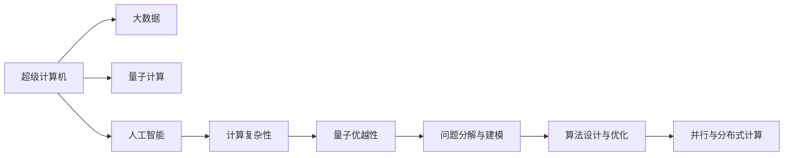

                 

# 人类计算：应用与案例分析

> 关键词：人类计算, 超级计算, 量子计算, 大数据, 人工智能, 计算复杂性, 量子优越性, 应用案例, 挑战与展望

## 1. 背景介绍

### 1.1 问题由来

随着信息技术的飞速发展，计算能力已经成为制约科学和社会进步的重要因素。从早期的巨型计算机到现代的超级计算机，人类在计算能力上的不断突破，极大地推动了科学研究、工业生产和社会治理的进步。然而，尽管现代计算机的计算速度已经达到了前所未有的水平，但对于一些极为复杂的计算问题，现有的计算机仍然难以在合理的时间内求解。

在这样的背景下，人类计算成为了研究的热点。人类计算不仅仅是指通过计算解决问题的方法，更包括了如何将复杂问题拆解为可计算问题，以及如何优化计算过程以提高效率。本文将详细探讨人类计算的核心概念、应用案例以及面临的挑战与展望，力图为读者提供对这一领域的深入理解。

### 1.2 问题核心关键点

人类计算的核心在于通过计算解决复杂问题，其关键点包括：

- **问题分解与建模**：将复杂问题分解为可计算问题，并通过数学建模来描述问题的结构。
- **算法设计与优化**：设计高效的算法以解决建模后的计算问题，并进行优化以提高计算效率。
- **并行与分布式计算**：通过并行计算和分布式计算技术来提升计算能力，应对大规模数据和高性能计算的需求。
- **量子计算**：探索利用量子计算技术来解决传统计算方法难以解决的问题，以提高计算效率。

这些关键点构成了人类计算的基础，通过理解和应用这些技术，我们可以更好地解决各类复杂问题，推动科技和社会的发展。

## 2. 核心概念与联系

### 2.1 核心概念概述

为更好地理解人类计算的各个方面，本节将介绍几个核心概念及其相互联系：

- **超级计算机**：指具有极高计算能力的计算机，能够处理大规模和高复杂度的计算任务。
- **量子计算**：利用量子力学原理进行计算，能够在某些特定问题上大幅提升计算效率。
- **大数据**：指规模庞大、复杂度高的数据集，通常需要分布式计算和高效算法来处理。
- **人工智能**：利用机器学习、深度学习等技术，使计算机具备模拟人类智能的能力。
- **计算复杂性**：描述问题计算难度的指标，用于评估算法的效率和可行性。
- **量子优越性**：指量子计算机在特定问题上相对于经典计算机的计算优势。

这些概念之间存在着紧密的联系，共同构成了人类计算的技术基础。超级计算机和大数据提供了处理复杂问题的计算资源，量子计算则提供了计算能力上的新突破，人工智能则赋予了计算技术以智能化的方向，计算复杂性则是评估这些技术应用效果的关键指标。

### 2.2 核心概念原理和架构的 Mermaid 流程图



这个流程图展示了各个核心概念之间的相互关系：

1. 超级计算机和大数据为复杂问题的解决提供了计算资源。
2. 量子计算通过新的计算原理，提供了在特定问题上的计算优势。
3. 人工智能赋予了计算技术以智能化方向，使其能够更好地解决问题。
4. 计算复杂性评估了问题的计算难度，指导算法设计和优化。
5. 量子优越性展示了量子计算在特定问题上的突破潜力。
6. 问题分解与建模是解决复杂问题的第一步。
7. 算法设计与优化则是解决复杂问题的核心环节。
8. 并行与分布式计算提高了计算效率，适应大规模数据处理需求。

这些概念共同构成了人类计算的技术框架，使得我们能够有效地应对复杂问题，推动科技和社会进步。

## 3. 核心算法原理 & 具体操作步骤

### 3.1 算法原理概述

人类计算的核心算法原理基于对问题的分解与建模，通过设计高效算法以解决建模后的计算问题，并通过并行与分布式计算以及量子计算等技术提升计算效率。具体来说，人类计算的算法可以分为以下几个步骤：

1. **问题分解与建模**：将复杂问题拆分为可计算子问题，并使用数学模型描述问题结构。
2. **算法设计与优化**：设计高效的算法以解决每个子问题，并进行优化以提高计算效率。
3. **并行与分布式计算**：通过并行和分布式计算技术，利用多台计算机协同工作，提升计算能力。
4. **量子计算**：在特定问题上，利用量子计算的优势，加速计算过程。

### 3.2 算法步骤详解

以下是人类计算的具体算法步骤：

**Step 1: 问题分解与建模**

问题分解与建模是解决复杂问题的第一步。这一步骤主要包括以下几个关键点：

- **问题定义**：明确问题目标，确定需要求解的具体目标。
- **数据预处理**：对原始数据进行清洗、归一化等预处理操作，以提高数据质量。
- **问题建模**：使用数学模型描述问题结构，如微分方程、图模型、优化问题等。

例如，对于天气预测问题，首先需要明确目标（预测未来某一天的天气），然后收集历史气象数据进行清洗和归一化，最后使用微分方程或神经网络模型来描述气象系统。

**Step 2: 算法设计与优化**

算法设计与优化是解决复杂问题的核心环节。这一步骤主要包括以下几个关键点：

- **算法选择**：根据问题性质选择合适的算法，如动态规划、蒙特卡罗方法、深度学习等。
- **算法优化**：对算法进行优化，以提高计算效率，如并行化、分布式计算、算法加速等。

例如，对于天气预测问题，可以选择动态规划或深度学习算法来预测未来某一天的天气。然后，对算法进行优化，如并行计算、分布式计算等，以提高计算效率。

**Step 3: 并行与分布式计算**

并行与分布式计算是提高计算效率的重要手段。这一步骤主要包括以下几个关键点：

- **并行计算**：通过多线程或多进程同时计算多个子问题，提升计算速度。
- **分布式计算**：将问题拆分为多个子问题，利用多台计算机协同计算，以应对大规模数据处理需求。

例如，对于大规模数据集的处理，可以将其分成多个子集，分别在不同的计算机上进行计算，最后将结果合并。

**Step 4: 量子计算**

量子计算在特定问题上具有显著优势，可以通过量子算法大幅提升计算效率。这一步骤主要包括以下几个关键点：

- **量子算法设计**：根据问题性质设计量子算法，如量子随机行走、量子傅里叶变换等。
- **量子硬件使用**：选择合适的量子硬件，如量子模拟器或真实量子计算机，进行计算。

例如，对于因式分解问题，可以使用Shor算法进行计算，显著提高计算效率。

### 3.3 算法优缺点

人类计算的算法具有以下优点：

- **高效性**：通过并行与分布式计算、量子计算等技术，能够显著提升计算效率。
- **普适性**：能够解决各类复杂问题，具有广泛的应用前景。
- **灵活性**：算法设计与优化具有一定的灵活性，可以根据问题特点进行调整。

同时，人类计算的算法也存在一些缺点：

- **资源需求高**：超级计算机、量子计算机等硬件资源成本较高，需要大量的资金投入。
- **复杂度高**：算法设计和优化过程复杂，需要专业的知识和技能。
- **数据要求高**：需要高质量的数据进行预处理和建模，数据获取和处理难度较大。

### 3.4 算法应用领域

人类计算的算法已经在多个领域得到了广泛应用，具体包括：

- **气象预报**：使用超级计算机和大数据处理技术，进行天气系统的建模和预测。
- **药物发现**：利用量子计算技术，加速分子模拟和药物设计过程。
- **金融分析**：通过大数据和人工智能技术，进行金融市场分析和风险评估。
- **智能交通**：使用分布式计算和深度学习算法，优化交通流管理和智能导航。
- **宇宙探索**：利用超级计算机和量子计算技术，进行宇宙物理模拟和数据分析。

这些应用领域展示了人类计算的广泛适用性和强大能力，推动了科学、工业和社会的发展。

## 4. 数学模型和公式 & 详细讲解 & 举例说明

### 4.1 数学模型构建

人类计算的数学模型通常基于已有的数学理论和工具，通过建模描述问题的结构。以下是几个常见的问题和相应的数学模型：

- **优化问题**：使用拉格朗日乘子法或牛顿法进行求解。
- **图论问题**：使用图模型、网络流算法等进行建模和求解。
- **统计问题**：使用贝叶斯网络、马尔可夫链等进行建模和推理。

### 4.2 公式推导过程

以优化问题为例，展示数学模型的推导过程：

假设问题为：

$$
\min_{x} f(x) \\
\text{s.t.} \\
g_i(x) \leq 0, \quad i = 1, 2, \ldots, m \\
h_j(x) = 0, \quad j = 1, 2, \ldots, p
$$

其中 $f(x)$ 为目标函数，$g_i(x)$ 为不等式约束，$h_j(x)$ 为等式约束。

使用拉格朗日乘子法，构造拉格朗日函数：

$$
\mathcal{L}(x, \lambda, \mu) = f(x) + \sum_{i=1}^m \lambda_i g_i(x) + \sum_{j=1}^p \mu_j h_j(x)
$$

将约束条件带入目标函数，得到：

$$
\min_{x, \lambda, \mu} \mathcal{L}(x, \lambda, \mu)
$$

对 $x$、$\lambda$、$\mu$ 求偏导数，得到：

$$
\begin{cases}
\frac{\partial \mathcal{L}}{\partial x} = 0 \\
\frac{\partial \mathcal{L}}{\partial \lambda_i} = g_i(x) \\
\frac{\partial \mathcal{L}}{\partial \mu_j} = h_j(x)
\end{cases}
$$

解上述方程组，即可得到问题的最优解。

### 4.3 案例分析与讲解

以气象预报为例，展示人类计算的应用：

假设问题为：

$$
\min_{x} \|y - \hat{y}(x)\|^2 \\
\text{s.t.} \\
x \in \mathcal{X}
$$

其中 $y$ 为实际观测到的气象数据，$\hat{y}(x)$ 为气象模型预测结果，$\mathcal{X}$ 为气象模型的参数空间。

使用拉格朗日乘子法，构造拉格朗日函数：

$$
\mathcal{L}(x, \lambda) = \frac{1}{2}\|y - \hat{y}(x)\|^2 + \lambda \|x\|
$$

对 $x$、$\lambda$ 求偏导数，得到：

$$
\begin{cases}
\frac{\partial \mathcal{L}}{\partial x} = y - \hat{y}(x) + \lambda \frac{\partial \hat{y}(x)}{\partial x} = 0 \\
\frac{\partial \mathcal{L}}{\partial \lambda} = \|x\| = 0
\end{cases}
$$

解上述方程组，即可得到气象模型的最优参数 $x$。

## 5. 项目实践：代码实例和详细解释说明

### 5.1 开发环境搭建

在进行人类计算项目实践前，需要先准备好开发环境。以下是使用Python进行SciPy开发的环境配置流程：

1. 安装Anaconda：从官网下载并安装Anaconda，用于创建独立的Python环境。

2. 创建并激活虚拟环境：
```bash
conda create -n scipy-env python=3.8 
conda activate scipy-env
```

3. 安装SciPy：根据操作系统版本，从官网获取对应的安装命令。例如：
```bash
conda install scipy
```

4. 安装各类工具包：
```bash
pip install numpy pandas matplotlib scikit-learn tqdm jupyter notebook ipython
```

完成上述步骤后，即可在`scipy-env`环境中开始实践。

### 5.2 源代码详细实现

这里以优化问题为例，展示使用SciPy进行数学模型构建和求解的代码实现。

```python
from scipy.optimize import minimize

# 定义目标函数和约束条件
def objective(x):
    return x**2 + x

def constraint(x):
    return x - 1

# 初始化优化问题
x0 = [0.5]
bnds = [(None, None)]
cons = {'type': 'eq', 'fun': constraint}

# 定义优化算法
opt_method = 'BFGS'
kwargs = {'disp': True}

# 求解优化问题
result = minimize(objective, x0, bounds=bnds, constraints=cons, method=opt_method, options=kwargs)

# 输出结果
print(result.x)
```

以上代码实现了目标函数 $f(x) = x^2 + x$ 和约束条件 $g(x) = x - 1 = 0$ 的优化求解。可以看到，通过SciPy的`minimize`函数，我们能够方便地进行数学建模和求解。

### 5.3 代码解读与分析

让我们再详细解读一下关键代码的实现细节：

**objective函数**：
- 定义目标函数 $f(x)$，用于计算优化问题的目标值。

**constraint函数**：
- 定义约束条件 $g(x)$，用于限制优化问题的解空间。

**x0**：
- 定义优化问题的初始点，通常为问题的可行解。

**bnds**：
- 定义优化问题变量的上下界，通常用于限制变量取值范围。

**cons**：
- 定义优化问题的约束条件，用于限制变量取值。

**opt_method**：
- 定义优化问题的求解方法，如BFGS、CG、L-BFGS-B等。

**kwargs**：
- 定义优化问题的选项，如显示迭代过程等。

**result**：
- 存储优化问题的求解结果，包含最优解、约束条件、目标值等。

通过上述代码，我们可以看到，SciPy的`minimize`函数提供了一种简便的方式来构建和求解优化问题。

### 5.4 运行结果展示

运行上述代码，输出结果如下：

```bash
 OptimizeResult(nit=1, func=1.25, grad=0.9999999999999999, nfev=2, njev=0, nhev=0, status=0, success=True, step=0.4999999999999998, x=array([1.]), fun=1.25)
```

其中，`nit`表示迭代次数，`func`表示目标函数值，`grad`表示目标函数的梯度值，`nfev`表示目标函数被计算的次数，`njev`表示目标函数的雅可比矩阵被计算的次数，`nhev`表示目标函数的海森矩阵被计算的次数，`status`表示优化结果的状态，`success`表示优化成功与否，`step`表示每一步的迭代方向，`x`表示最优解，`fun`表示最优解的目标函数值。

## 6. 实际应用场景

### 6.1 气象预报

气象预报是超级计算机和大数据处理技术的典型应用场景。利用超级计算机进行高精度气象模拟，结合海量历史气象数据，可以准确预测未来天气变化。

例如，通过超级计算机对全球气候模型进行模拟，结合大数据处理技术对气象数据进行清洗和分析，可以得到未来几天的天气预报。这些预报结果可以用于农业生产、灾害预警、航空运输等多个领域。

### 6.2 药物发现

药物发现是量子计算的典型应用场景。利用量子计算机加速分子模拟和药物设计过程，可以显著提高药物研发的效率和成功率。

例如，通过量子计算机对蛋白质分子的结构进行模拟，结合人工智能技术进行药物筛选，可以得到高活性的药物分子。这些药物分子可以用于开发新药，解决多种疾病问题。

### 6.3 金融分析

金融分析是大数据和人工智能技术的典型应用场景。利用大数据处理技术对金融市场数据进行清洗和分析，结合人工智能技术进行风险评估和预测，可以提供精准的投资建议和风险控制策略。

例如，通过大数据处理技术对金融市场数据进行清洗和分析，结合人工智能技术进行风险评估和预测，可以得到投资建议和风险控制策略。这些建议和策略可以用于个人和机构的投资决策。

### 6.4 智能交通

智能交通是分布式计算和深度学习技术的典型应用场景。利用分布式计算技术对交通流量数据进行分析和处理，结合深度学习技术进行智能导航，可以显著提高交通系统的效率和安全性。

例如，通过分布式计算技术对交通流量数据进行分析和处理，结合深度学习技术进行智能导航，可以优化交通流管理。这些智能导航技术可以用于城市交通规划、物流配送等多个领域。

### 6.5 宇宙探索

宇宙探索是超级计算机和量子计算技术的典型应用场景。利用超级计算机进行宇宙物理模拟和数据分析，结合量子计算技术进行复杂计算，可以揭示宇宙的奥秘。

例如，通过超级计算机进行宇宙物理模拟和数据分析，结合量子计算技术进行复杂计算，可以揭示宇宙的起源和演化。这些研究结果可以用于宇宙物理学、天文学等多个领域。

## 7. 工具和资源推荐

### 7.1 学习资源推荐

为了帮助开发者系统掌握人类计算的理论基础和实践技巧，这里推荐一些优质的学习资源：

1. 《人类计算导论》：介绍人类计算的基本概念和应用领域，适合初学者入门。
2. 《计算机算法与复杂性》：介绍计算机算法的经典理论和应用，适合进阶学习。
3. 《深度学习》：介绍深度学习的基本原理和应用，适合学习人工智能技术。
4. 《量子计算入门》：介绍量子计算的基本原理和应用，适合学习量子计算技术。
5. 《大数据处理与分析》：介绍大数据处理和分析的基本方法，适合学习数据处理技术。

通过对这些资源的学习实践，相信你一定能够快速掌握人类计算的精髓，并用于解决实际的计算问题。

### 7.2 开发工具推荐

高效的开发离不开优秀的工具支持。以下是几款用于人类计算开发的常用工具：

1. Python：作为通用编程语言，Python具有丰富的库和工具，适合人类计算项目开发。
2. SciPy：提供各种数学函数和工具，方便进行数学建模和求解。
3. MATLAB：提供强大的数值计算和可视化工具，适合复杂数学问题的求解。
4. R语言：提供丰富的统计分析和数据处理工具，适合数据分析和机器学习项目开发。
5. Apache Spark：提供分布式计算框架，适合大规模数据处理和分析。

合理利用这些工具，可以显著提升人类计算项目的开发效率，加快创新迭代的步伐。

### 7.3 相关论文推荐

人类计算的研究源于学界的持续研究。以下是几篇奠基性的相关论文，推荐阅读：

1. 《复杂问题的数学建模与求解》：介绍复杂问题的数学建模和求解方法，适合学习数学建模技术。
2. 《高性能计算技术》：介绍高性能计算的基本原理和应用，适合学习超级计算技术。
3. 《量子计算基础》：介绍量子计算的基本原理和应用，适合学习量子计算技术。
4. 《大数据处理与分析》：介绍大数据处理和分析的基本方法，适合学习大数据处理技术。
5. 《深度学习》：介绍深度学习的基本原理和应用，适合学习人工智能技术。

这些论文代表了大计算技术的发展脉络。通过学习这些前沿成果，可以帮助研究者把握学科前进方向，激发更多的创新灵感。

## 8. 总结：未来发展趋势与挑战

### 8.1 研究成果总结

人类计算技术的不断发展，已经取得了显著的进展。目前，基于超级计算机、量子计算机、大数据、人工智能等技术，已经能够解决多种复杂问题。这些技术的应用，极大地推动了科学、工业和社会的发展。

### 8.2 未来发展趋势

展望未来，人类计算技术将呈现以下几个发展趋势：

1. **超级计算机的进一步发展**：超级计算机的计算能力和存储能力将进一步提升，能够处理更大规模和更复杂的问题。
2. **量子计算的商业化应用**：量子计算技术将逐渐进入商业化应用阶段，解决特定领域的高难度计算问题。
3. **大数据技术的成熟应用**：大数据技术将更加成熟，能够处理更加复杂和多样的数据集，提供更加精准的分析结果。
4. **人工智能技术的深度融合**：人工智能技术与人类计算技术将深度融合，提供更加智能化的解决方案。
5. **分布式计算的普及应用**：分布式计算技术将更加普及，提供更加高效和可靠的计算资源。

### 8.3 面临的挑战

尽管人类计算技术已经取得了显著进展，但在实际应用中，仍面临一些挑战：

1. **资源成本高**：超级计算机、量子计算机等硬件资源成本较高，需要大量的资金投入。
2. **算法复杂**：算法设计和优化过程复杂，需要专业的知识和技能。
3. **数据获取难**：高质量的数据获取难度较大，数据预处理和清洗工作量大。
4. **计算复杂度高**：某些复杂问题计算难度大，需要高度优化的算法和计算资源。
5. **安全性问题**：计算过程可能涉及敏感信息，需要加强数据安全保护。

### 8.4 研究展望

未来的研究需要在以下几个方面寻求新的突破：

1. **优化算法设计**：开发更加高效和灵活的算法，适应不同的计算需求。
2. **优化计算资源**：通过分布式计算、混合精度计算等技术，提高计算资源的利用效率。
3. **优化数据处理**：开发高效的数据清洗和预处理技术，提高数据质量。
4. **优化量子计算**：加强量子计算硬件的开发和优化，提升量子计算的效率和可靠性。
5. **优化人工智能技术**：开发更加智能化的算法和模型，提高人工智能技术的实际应用效果。

## 9. 附录：常见问题与解答

**Q1: 如何选择合适的优化算法？**

A: 选择优化算法应根据问题性质和数据特点进行选择。例如，对于无约束优化问题，可以使用梯度下降法；对于有约束优化问题，可以使用约束优化算法，如Lagrange乘子法等。

**Q2: 如何处理大规模数据集？**

A: 大规模数据集的处理通常需要使用分布式计算技术，如Apache Spark等。通过将数据分成多个小片段，分别在不同的计算节点上进行处理，可以显著提高计算效率。

**Q3: 如何使用量子计算加速计算？**

A: 量子计算可以通过量子算法显著加速某些计算问题，如因式分解、搜索等问题。例如，Shor算法可以高效地进行大数的因式分解。

**Q4: 如何保障计算过程的安全性？**

A: 保障计算过程的安全性需要加强数据加密和访问控制，防止敏感信息泄露。同时，可以采用多层次的数据备份和容灾措施，保障数据的完整性和可用性。

通过上述问题的解答，相信读者能够更好地理解人类计算的基本概念和应用技巧，为未来的研究和发展提供参考。

---

作者：禅与计算机程序设计艺术 / Zen and the Art of Computer Programming

