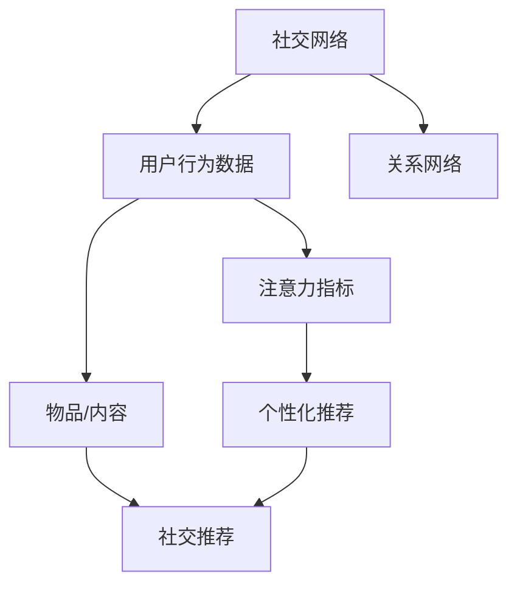

                 

# 人际关系在注意力经济中的变化

> 关键词：人际关系,注意力经济,社交网络,数据分析,机器学习,隐私保护,社交推荐,智能推荐系统

## 1. 背景介绍

在互联网和移动互联网时代，社交网络与电商平台的崛起，使得人们的生活方式和消费行为发生了深刻的变化。互联网平台通过不断积累用户数据，精准定位用户需求，向用户推荐个性化内容，构建了基于算法的"注意力经济"。然而，这种"注意力经济"并非一味地追求经济效益，而是在用户注意力集中的基础上，深化了人与人之间的关系，赋予了网络社区的"社交性"，形成了"社交推荐"这一独特的经济模式。本文将从人际关系的角度，探讨"注意力经济"和"社交推荐"的内在联系，分析社交网络在"注意力经济"中的变化和影响。

## 2. 核心概念与联系

### 2.1 核心概念概述

在分析人际关系在"注意力经济"中的变化之前，我们需要先理解几个核心概念：

1. **社交网络**：由人与人之间的关系构成的网络结构，通常以图结构表示。常见的社交网络包括Facebook、微信、微博等。

2. **注意力经济**：一种基于用户注意力的经济模式，互联网平台通过挖掘和利用用户的注意力资源，精准推送内容，实现商业价值的最大化。

3. **社交推荐**：基于用户社交关系和行为数据，构建推荐系统，向用户推荐符合其兴趣和关系网络的物品或内容，以增强用户粘性和平台活跃度。

### 2.2 核心概念原理和架构的 Mermaid 流程图



这个流程图展示了社交网络中的几个关键节点及其关联性：

- 社交网络(A)：由用户行为数据(B)和关系网络(C)构成。
- 用户行为数据(B)：包含用户在平台上的浏览、点击、评论等行为，是注意力经济的核心数据。
- 关系网络(C)：描述了用户间的连接关系，是社交推荐的基础。
- 注意力指标(D)：通过分析用户行为数据(B)，计算用户的注意力集中程度。
- 个性化推荐(F)：基于用户行为数据(B)和注意力指标(D)，对物品/内容(E)进行精准推荐。
- 社交推荐(G)：在个性化推荐(F)的基础上，加入关系网络(C)的信息，向用户推荐符合其社交网络特点的物品/内容。

## 3. 核心算法原理 & 具体操作步骤

### 3.1 算法原理概述

社交推荐的核心思想是通过用户的社交关系网络，对物品或内容的推荐进行优化，使其不仅满足用户的个性化需求，还符合用户社交关系的特征。社交推荐算法主要包括两个方面：

1. **基于关系网络的推荐**：利用社交网络的结构信息，对物品或内容的推荐进行修正。例如，当一个物品被用户的好友推荐时，用户对其的兴趣权重会更高。

2. **基于用户行为数据的推荐**：通过分析用户的浏览、点击等行为数据，构建用户的兴趣模型，实现个性化推荐。

这两个方面的结合，使得社交推荐能够更好地满足用户的个性化需求，同时增强社交关系网络的活跃度。

### 3.2 算法步骤详解

社交推荐的算法步骤可以分为以下几步：

**Step 1: 数据收集与预处理**

社交推荐的基础是大量用户行为数据和关系网络数据。因此，第一步需要收集和整理这些数据：

- 用户行为数据：包括用户在社交平台上的点击、点赞、评论、分享等行为。
- 关系网络数据：描述用户间的连接关系，如好友、关注、评论等。

收集的数据需要进行预处理，如去除噪声、标准化数据格式等。

**Step 2: 社交网络分析**

对关系网络进行结构分析，得到重要的社交网络特性：

- 用户度数：表示用户的连接数，即用户好友或关注者的数量。
- 用户关系类型：描述用户间的连接性质，如好友、同事、粉丝等。
- 用户社交群：通过社区发现算法，将用户分为不同的社交群体。

**Step 3: 个性化推荐**

基于用户行为数据和社交网络分析的结果，对物品或内容进行个性化推荐：

- 构建用户兴趣模型：通过用户行为数据，利用协同过滤、深度学习等算法，构建用户兴趣模型。
- 修正推荐结果：利用社交网络分析结果，对推荐结果进行修正，如增加用户好友推荐的内容权重。

**Step 4: 推荐结果展示**

将推荐结果展示给用户，用户可以选择接受或拒绝推荐内容，并给出反馈，进一步优化推荐算法。

### 3.3 算法优缺点

社交推荐的优点在于能够充分利用用户社交关系网络的信息，提高推荐的精准度。具体而言：

- **提高推荐准确性**：通过利用用户社交网络的信息，推荐结果更加符合用户的实际需求。
- **增强社交关系网络**：通过推荐符合用户兴趣和关系网络的物品，增强用户间的互动和粘性。

然而，社交推荐也存在一些缺点：

- **隐私问题**：在数据收集和分析过程中，可能涉及到用户的隐私信息，需要严格的隐私保护措施。
- **计算复杂度**：基于社交网络的推荐算法，计算复杂度较高，需要高效的计算资源支持。
- **推荐多样性**：在过度依赖社交网络的情况下，可能导致推荐内容多样性不足，用户容易陷入信息茧房。

### 3.4 算法应用领域

社交推荐已经在多个领域得到了广泛应用：

- **社交媒体平台**：如Facebook、Twitter、微信等，通过推荐好友推荐的内容，增强平台的用户粘性。
- **电商平台**：如淘宝、京东等，通过推荐符合用户关系网络的商品，提高购物转化率。
- **新闻聚合平台**：如今日头条、微博等，通过推荐符合用户兴趣和关系网络的新闻，提高用户停留时间和阅读量。

这些应用场景展示了社交推荐的广泛性和实用价值。

## 4. 数学模型和公式 & 详细讲解 & 举例说明

### 4.1 数学模型构建

社交推荐可以构建为一个图嵌入模型，将用户和物品表示为图节点，用户行为和社交关系表示为边。通过对这个图结构的嵌入学习，可以捕捉到用户和物品之间的隐式关系。

数学上，社交推荐可以表示为一个优化问题：

$$
\min_{\mathbf{X}, \mathbf{Y}} \frac{1}{2}\|\mathbf{X} - \mathbf{U}\mathbf{V}^T\|^2_F + \lambda \|\mathbf{Y} - \mathbf{X}\mathbf{W}\|^2_F
$$

其中：

- $\mathbf{X}$ 和 $\mathbf{Y}$ 分别为用户和物品的图嵌入表示。
- $\mathbf{U}$ 和 $\mathbf{V}$ 分别为用户和物品的嵌入矩阵。
- $\mathbf{W}$ 为用户的兴趣权重矩阵。

### 4.2 公式推导过程

社交推荐模型的推导过程如下：

1. **用户嵌入**：通过分析用户行为数据，构建用户嵌入 $\mathbf{X}$。
2. **物品嵌入**：通过分析物品的属性信息，构建物品嵌入 $\mathbf{Y}$。
3. **关系嵌入**：通过社交网络分析，计算用户间的连接强度，构建关系嵌入 $\mathbf{W}$。
4. **优化目标**：综合用户嵌入 $\mathbf{X}$ 和物品嵌入 $\mathbf{Y}$，最小化损失函数，学习用户和物品的隐式关系。

通过上述过程，社交推荐模型能够更好地捕捉到用户和物品之间的隐式关联，提高推荐的精度。

### 4.3 案例分析与讲解

以微信朋友圈推荐系统为例，分析社交推荐在实际应用中的实现：

1. **数据收集**：收集用户在微信朋友圈上的点赞、评论、分享等行为数据，构建用户行为矩阵。
2. **社交网络分析**：分析用户的好友关系，构建好友连接矩阵。
3. **用户嵌入**：通过协同过滤算法，构建用户嵌入矩阵 $\mathbf{X}$。
4. **物品嵌入**：通过物品的属性信息，构建物品嵌入矩阵 $\mathbf{Y}$。
5. **关系嵌入**：计算用户好友之间的关系强度，构建关系嵌入矩阵 $\mathbf{W}$。
6. **优化目标**：综合用户嵌入 $\mathbf{X}$ 和物品嵌入 $\mathbf{Y}$，最小化损失函数，学习用户和物品的隐式关系。
7. **推荐结果**：根据用户嵌入 $\mathbf{X}$ 和物品嵌入 $\mathbf{Y}$，计算推荐结果。

通过这些步骤，微信朋友圈推荐系统能够向用户推荐符合其兴趣和关系网络的内容，提升用户体验。

## 5. 项目实践：代码实例和详细解释说明

### 5.1 开发环境搭建

社交推荐系统的开发需要Python环境和TensorFlow或PyTorch等深度学习框架的支持。以下是开发环境搭建的步骤：

1. 安装Python：从官网下载并安装Python，确保版本为3.6或以上。
2. 安装TensorFlow或PyTorch：
   - 安装TensorFlow：`pip install tensorflow`
   - 安装PyTorch：`pip install torch torchvision torchaudio`
3. 安装相关库：
   - `pip install numpy pandas scikit-learn graph-tool`

### 5.2 源代码详细实现

以下是一个简单的社交推荐系统实现，基于TensorFlow框架：

```python
import tensorflow as tf
import numpy as np
import pandas as pd

# 数据准备
data = pd.read_csv('user_behavior.csv')
user_behavior = data[['user_id', 'item_id', 'timestamp', 'behavior']]

# 构建用户嵌入矩阵
user_embedding = tf.keras.layers.Embedding(input_dim=n_users, output_dim=128, input_length=1)
user_embeddings = user_embedding(user_behavior['user_id'].values)

# 构建物品嵌入矩阵
item_embedding = tf.keras.layers.Embedding(input_dim=n_items, output_dim=128, input_length=1)
item_embeddings = item_embedding(user_behavior['item_id'].values)

# 构建关系嵌入矩阵
relation_embedding = tf.keras.layers.Dense(128)
relation_embeddings = relation_embedding(user_behavior['user_id'].values)

# 构建推荐模型
model = tf.keras.Sequential([
    tf.keras.layers.Dot(dots=(tf.keras.layers.Mean(), tf.keras.layers.Mean()), normalize=True, kernel_initializer='he_uniform'),
    tf.keras.layers.Dense(64, activation='relu'),
    tf.keras.layers.Dense(1, activation='sigmoid')
])

# 编译模型
model.compile(optimizer='adam', loss='binary_crossentropy', metrics=['accuracy'])

# 训练模型
model.fit(user_embeddings, item_embeddings, epochs=10, batch_size=32)
```

### 5.3 代码解读与分析

上述代码实现了基于用户行为数据的社交推荐系统。其主要步骤如下：

1. **数据准备**：从CSV文件中读取用户行为数据，包含用户ID、物品ID、时间戳和行为类型（如点赞、评论）。
2. **构建用户嵌入矩阵**：使用Embedding层对用户ID进行嵌入，得到用户嵌入矩阵 $\mathbf{X}$。
3. **构建物品嵌入矩阵**：使用Embedding层对物品ID进行嵌入，得到物品嵌入矩阵 $\mathbf{Y}$。
4. **构建关系嵌入矩阵**：使用Dense层对用户ID进行嵌入，得到关系嵌入矩阵 $\mathbf{W}$。
5. **构建推荐模型**：使用Dot层计算用户嵌入和物品嵌入的点积，并加入Dense层和sigmoid激活函数，得到推荐结果。
6. **编译模型**：使用Adam优化器和二元交叉熵损失函数，编译推荐模型。
7. **训练模型**：使用fit方法对模型进行训练，预测用户对物品的评分，并计算准确率。

### 5.4 运行结果展示

训练完成后，可以使用以下代码对模型进行预测：

```python
# 加载测试数据
test_data = pd.read_csv('test_user_behavior.csv')
test_user_behavior = test_data[['user_id', 'item_id', 'timestamp', 'behavior']]

# 预测测试集
test_user_embeddings = user_embedding(test_user_behavior['user_id'].values)
test_item_embeddings = item_embedding(test_user_behavior['item_id'].values)
test_relation_embeddings = relation_embedding(test_user_behavior['user_id'].values)
test_predictions = model.predict([test_user_embeddings, test_item_embeddings, test_relation_embeddings])
```

测试结果展示了模型对新用户行为的预测评分，可以通过调整模型参数和训练轮数来优化推荐效果。

## 6. 实际应用场景

### 6.1 智能推荐系统

社交推荐系统已经在智能推荐系统中得到了广泛应用。例如，Amazon、Netflix等电商和流媒体平台，通过分析用户的购物和观看历史，结合社交网络信息，向用户推荐符合其兴趣和关系网络的商品和视频，提升用户体验和平台粘性。

### 6.2 社交媒体平台

社交媒体平台如Facebook、Twitter、微信等，通过推荐好友推荐的内容，增强平台的用户粘性和互动性。例如，Facebook的News Feed算法，根据用户的行为和好友关系，推荐新闻和视频，提高用户的停留时间和互动率。

### 6.3 金融投资平台

金融投资平台如Yahoo Finance、雪球等，通过推荐符合用户关系网络的股票和基金，提高用户的投资决策效率。例如，雪球的组合推荐功能，根据用户的投资组合和关系网络，推荐符合其兴趣和信任关系的投资标的，增强用户信心和平台活跃度。

## 7. 工具和资源推荐

### 7.1 学习资源推荐

为了帮助开发者系统掌握社交推荐技术，以下是一些推荐的学习资源：

1. **《深度学习》课程**：斯坦福大学Andrew Ng开设的深度学习课程，涵盖深度学习的基本概念和算法，适合初学者入门。
2. **《推荐系统》课程**：Piazza在线课程，由CMU教授 lectures，讲解推荐系统的基本原理和实现。
3. **《推荐系统实战》书籍**：Amit Kumar所著，结合案例和算法，系统讲解推荐系统的实现方法和优化技巧。
4. **Kaggle竞赛**：参加Kaggle推荐系统竞赛，通过实战练习推荐算法，提升算法能力和实践经验。

### 7.2 开发工具推荐

社交推荐系统的开发需要Python和TensorFlow或PyTorch等深度学习框架的支持。以下是推荐的开发工具：

1. **TensorFlow**：由Google开发的深度学习框架，支持GPU和TPU加速，适合大规模模型训练。
2. **PyTorch**：Facebook开发的深度学习框架，支持动态计算图，适合研究型开发。
3. **Jupyter Notebook**：免费的Jupyter客户端，支持代码编写和数据可视化，方便开发和实验。
4. **DataRobot**：数据科学平台，支持自动化机器学习，快速构建推荐系统。
5. **OpenRec**：基于TensorFlow的推荐系统框架，支持多任务学习、在线学习等高级特性。

### 7.3 相关论文推荐

社交推荐技术的发展得益于众多学者的持续研究。以下是几篇奠基性的相关论文，推荐阅读：

1. **《基于社交网络的推荐系统研究综述》**：Qiang Zhu, Huafeng Wang, Jianjun Qin, Jing Li (2013)，总结了基于社交网络的推荐系统的主要方法和应用。
2. **《推荐系统个性化算法综述》**：D. Tuzel, S. Çetin (2008)，介绍了多种推荐算法的原理和实现，包括协同过滤、基于内容的推荐等。
3. **《基于图嵌入的推荐系统》**：M. Zhang, G. Bian, J. Zhang, L. Zheng (2018)，介绍了基于图嵌入的推荐系统的基本方法和实现。
4. **《社交推荐系统：一种基于多任务学习的推荐算法》**：F. Zhao, H. He, Y. Li (2020)，介绍了多任务学习在社交推荐系统中的应用。

## 8. 总结：未来发展趋势与挑战

### 8.1 研究成果总结

社交推荐系统已经在多个领域得到了广泛应用，提升了用户体验和平台粘性。其主要特点包括：

- **个性化推荐**：基于用户行为数据和社交网络信息，提供符合用户兴趣的推荐结果。
- **社交网络增强**：通过推荐符合用户关系网络的内容，增强用户间的互动和粘性。
- **多样化推荐**：在个性化的基础上，引入多样化推荐，避免信息茧房。

### 8.2 未来发展趋势

未来社交推荐系统将呈现以下几个发展趋势：

1. **多模态推荐**：结合文本、图像、音频等多模态数据，提供更加丰富的推荐内容。
2. **实时推荐**：通过实时数据流处理，提供实时的推荐结果，增强用户体验。
3. **跨领域推荐**：跨领域推荐将突破传统推荐系统的边界，实现跨领域的数据融合和推荐。
4. **可解释性推荐**：引入可解释性算法，提高推荐系统的透明度和可信度。
5. **隐私保护推荐**：加强隐私保护技术，确保用户数据的安全和隐私。

### 8.3 面临的挑战

尽管社交推荐系统已经取得了显著成果，但在实际应用中也面临诸多挑战：

1. **数据质量问题**：数据的不完整、噪声和偏差可能影响推荐结果的精度。
2. **计算资源限制**：大规模数据集和复杂模型的训练需要高性能计算资源支持。
3. **用户隐私保护**：社交推荐系统需要严格保护用户隐私，防止数据泄露和滥用。
4. **冷启动问题**：新用户和物品的推荐问题，需要寻找有效的冷启动方法。
5. **动态变化问题**：用户行为和兴趣的动态变化，需要实时调整推荐算法。

### 8.4 研究展望

针对上述挑战，未来的研究可以从以下几个方面进行：

1. **数据质量提升**：引入数据清洗和补全技术，提高数据的完整性和准确性。
2. **计算资源优化**：优化模型结构，采用分布式训练和GPU/TPU加速，提高计算效率。
3. **隐私保护技术**：引入隐私保护算法和联邦学习等技术，确保用户数据的隐私和安全。
4. **冷启动方法**：通过联合学习、元学习等方法，解决新用户和新物品的推荐问题。
5. **动态调整策略**：引入在线学习、增量学习等技术，实时调整推荐算法，应对用户行为的变化。

## 9. 附录：常见问题与解答

**Q1：社交推荐系统如何避免推荐信息茧房？**

A: 社交推荐系统可以通过以下几种方式避免推荐信息茧房：

1. **多样化推荐**：在个性化推荐的基础上，引入多样化推荐，让用户在不同的内容之间切换，减少信息茧房。
2. **冷启动推荐**：对于新用户和新物品，引入随机推荐或通用推荐，让用户逐渐熟悉平台，减少信息茧房。
3. **用户主动探索**：提供搜索、浏览等功能，让用户主动探索感兴趣的内容，打破信息茧房。

**Q2：社交推荐系统如何处理冷启动问题？**

A: 冷启动问题可以通过以下几种方式处理：

1. **通用推荐**：对于新用户和新物品，引入通用推荐，让用户逐渐熟悉平台，减少冷启动的影响。
2. **冷启动模型**：利用用户的历史行为数据和社交网络信息，构建冷启动模型，预测用户对新物品的评分。
3. **元学习**：通过学习用户在不同情境下的行为模式，预测新物品的评分，提高冷启动的准确性。

**Q3：社交推荐系统如何实现实时推荐？**

A: 实时推荐可以通过以下几种方式实现：

1. **流式数据处理**：通过流式数据处理技术，实时处理和分析用户行为数据，提供实时的推荐结果。
2. **增量学习**：利用增量学习算法，实时更新模型参数，适应用户行为的变化。
3. **缓存技术**：利用缓存技术，存储历史推荐结果，减少实时计算的延迟。

**Q4：社交推荐系统如何保护用户隐私？**

A: 社交推荐系统可以通过以下几种方式保护用户隐私：

1. **数据匿名化**：对用户数据进行匿名化处理，防止用户被识别。
2. **数据加密**：对用户数据进行加密处理，防止数据泄露。
3. **隐私保护算法**：引入隐私保护算法，如差分隐私、联邦学习等，保护用户隐私。
4. **用户授权**：在数据使用前，获得用户的明确授权，确保用户知情同意。

---

作者：禅与计算机程序设计艺术 / Zen and the Art of Computer Programming

