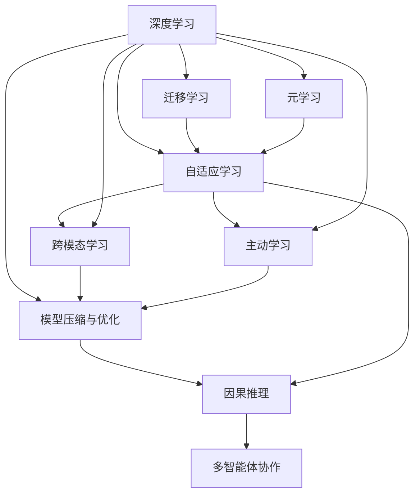

                 

# 从模仿到创新:AI的下一个发展阶段

> 关键词：人工智能,创新,模仿,技术突破,未来展望

## 1. 背景介绍

### 1.1 问题由来

随着人工智能（AI）技术的快速发展，尤其是深度学习和大规模预训练模型的兴起，我们见证了从模仿到创新的飞跃。从早期的符号主义和规则导向AI，到后来的统计学习和连接主义AI，再到现在的深度学习和神经网络，AI技术不断进步，逐步接近甚至在某些方面超越了人类智能的水平。

当前，AI技术已经在图像识别、语音识别、自然语言处理（NLP）、推荐系统、医疗诊断等领域取得了显著成果，并在工业、农业、交通、金融等众多行业中得到了广泛应用。然而，这些技术的核心方法仍然是基于现有模型的微调或改进，侧重于模仿人类智能的某个特定方面。

为了推动AI技术的进一步突破，从模仿走向创新，科学家和工程师们正在探索新的AI范式，如元学习、自适应学习、主动学习等。这些新方法将AI从单一任务的静态优化转向更加灵活和动态的学习过程，旨在构建能够自主学习和适应的智能系统。

### 1.2 问题核心关键点

AI技术的下一步发展，将在以下几个方面进行突破：

1. **跨模态学习**：将不同模态（如视觉、语音、文本等）的信息进行有效整合，构建跨模态认知模型。

2. **自适应学习**：让AI系统能够根据环境变化和任务需求进行动态调整，实现更加灵活的学习和适应能力。

3. **元学习**：通过学习如何学习，使AI系统能够快速适应新任务和新数据，提高泛化能力。

4. **主动学习**：通过主动采样策略，提高数据利用率，避免无效样本的过拟合风险。

5. **模型压缩与优化**：通过压缩和优化模型结构，提升计算效率和推理速度，实现更高效的AI部署。

6. **因果推理**：构建因果模型，提高AI系统对因果关系的理解和推理能力。

7. **多智能体协作**：构建多智能体系统，实现复杂任务的协同决策和执行。

这些核心关键点将共同推动AI技术的创新和发展，为未来AI应用带来更多可能性和挑战。

## 2. 核心概念与联系

### 2.1 核心概念概述

为了更好地理解这些概念，本节将介绍几个核心概念及其之间的联系：

- **深度学习（Deep Learning）**：一种基于神经网络的机器学习方法，通过多层非线性变换从原始数据中学习复杂特征表示。

- **迁移学习（Transfer Learning）**：将一个领域学到的知识迁移到另一个相关领域，减少对新任务的数据需求。

- **自适应学习（Adaptive Learning）**：AI系统能够根据环境变化和任务需求进行动态调整，适应新的学习任务。

- **元学习（Meta-Learning）**：学习如何学习，使AI系统能够快速适应新任务和新数据。

- **主动学习（Active Learning）**：通过主动采样策略，提高数据利用率，避免无效样本的过拟合风险。

- **跨模态学习（Cross-Modal Learning）**：将不同模态（如视觉、语音、文本等）的信息进行有效整合，构建跨模态认知模型。

- **模型压缩与优化（Model Compression and Optimization）**：通过压缩和优化模型结构，提升计算效率和推理速度，实现更高效的AI部署。

- **因果推理（Causal Reasoning）**：构建因果模型，提高AI系统对因果关系的理解和推理能力。

- **多智能体协作（Multi-Agent Collaboration）**：构建多智能体系统，实现复杂任务的协同决策和执行。

这些核心概念之间的逻辑关系可以通过以下Mermaid流程图来展示：



这个流程图展示了深度学习作为基础，如何通过迁移学习、自适应学习、元学习、主动学习、跨模态学习、模型压缩与优化、因果推理和多智能体协作等方法，实现AI技术的不断突破和创新。

## 3. 核心算法原理 & 具体操作步骤

### 3.1 算法原理概述

从模仿到创新的AI发展过程，可以概括为以下几个步骤：

1. **深度学习**：通过神经网络对大量数据进行学习，提取数据中的复杂特征表示。

2. **迁移学习**：利用已有的模型和数据，在新任务上进行微调，减少对新数据的依赖。

3. **自适应学习**：根据环境变化和任务需求，动态调整模型参数，实现更加灵活的学习和适应能力。

4. **元学习**：通过学习如何学习，使AI系统能够快速适应新任务和新数据。

5. **主动学习**：通过主动采样策略，提高数据利用率，避免无效样本的过拟合风险。

6. **跨模态学习**：将不同模态（如视觉、语音、文本等）的信息进行有效整合，构建跨模态认知模型。

7. **模型压缩与优化**：通过压缩和优化模型结构，提升计算效率和推理速度，实现更高效的AI部署。

8. **因果推理**：构建因果模型，提高AI系统对因果关系的理解和推理能力。

9. **多智能体协作**：构建多智能体系统，实现复杂任务的协同决策和执行。

### 3.2 算法步骤详解

**Step 1: 深度学习模型构建**

1. **选择模型架构**：根据任务类型和数据特征，选择合适的深度学习模型架构，如卷积神经网络（CNN）、循环神经网络（RNN）、Transformer等。

2. **数据预处理**：对数据进行预处理，包括数据清洗、归一化、特征提取等，确保数据的质量和一致性。

3. **模型训练**：使用大量标注数据对模型进行训练，调整模型参数，使其能够准确地进行特征提取和预测。

4. **模型评估**：在验证集上评估模型的性能，根据评估结果调整模型参数，优化模型表现。

**Step 2: 迁移学习模型微调**

1. **选择合适的预训练模型**：选择已有的预训练模型作为初始化参数，如BERT、GPT等。

2. **任务适配层设计**：根据任务类型，设计合适的任务适配层，如分类器、回归器、解码器等。

3. **数据准备**：准备下游任务的标注数据集，划分为训练集、验证集和测试集。

4. **微调模型**：使用标注数据对预训练模型进行微调，优化模型在特定任务上的性能。

**Step 3: 自适应学习动态调整**

1. **环境感知**：通过传感器、数据源等手段，感知环境变化和任务需求。

2. **模型动态调整**：根据环境感知结果，动态调整模型参数，实现更加灵活的学习和适应能力。

3. **性能评估与优化**：在调整后，重新评估模型性能，根据评估结果进一步优化模型参数。

**Step 4: 元学习快速适应**

1. **元学习框架设计**：构建元学习框架，如MAML（Model Agnostic Meta Learning），用于学习如何学习。

2. **元学习策略选择**：选择适合的元学习策略，如金属梯度下降（MAML）、后验参数优化（HPO）等。

3. **新任务适应**：利用元学习策略，快速适应新任务和新数据，提高泛化能力。

**Step 5: 主动学习数据采样**

1. **采样策略设计**：设计主动学习采样策略，如不确定性采样、多样性采样等。

2. **数据集更新**：根据采样策略，主动更新数据集，减少无效样本的过拟合风险。

3. **模型评估与优化**：在更新后，重新评估模型性能，根据评估结果进一步优化模型参数。

**Step 6: 跨模态学习信息整合**

1. **多模态数据收集**：收集不同模态的数据，如图像、语音、文本等。

2. **信息整合模型设计**：构建跨模态信息整合模型，如跨模态编码器（Cross-Modal Encoder）。

3. **信息整合训练**：使用多模态数据对信息整合模型进行训练，优化模型性能。

**Step 7: 模型压缩与优化**

1. **模型结构优化**：通过剪枝、量化、蒸馏等方法，优化模型结构，减少计算资源消耗。

2. **模型推理优化**：通过优化模型推理过程，提升推理速度和效率。

**Step 8: 因果推理因果建模**

1. **因果关系构建**：构建因果关系模型，如因果图模型（Causal Graph Model）。

2. **因果推理训练**：使用因果数据对因果关系模型进行训练，优化模型性能。

**Step 9: 多智能体协作系统设计**

1. **智能体设计**：设计多智能体系统，包括智能体间通信协议、决策规则等。

2. **协同决策训练**：使用协同决策数据对智能体进行训练，优化协同决策性能。

3. **系统集成与部署**：将训练好的智能体系统集成到实际应用中，进行部署和优化。

### 3.3 算法优缺点

从模仿到创新的AI发展过程，具有以下优点：

1. **灵活性**：通过自适应学习、元学习等方法，AI系统能够根据环境和任务需求进行动态调整，实现更加灵活的学习和适应能力。

2. **泛化能力**：通过迁移学习、跨模态学习等方法，AI系统能够快速适应新任务和新数据，提高泛化能力。

3. **计算效率**：通过模型压缩与优化等方法，AI系统能够在保证性能的前提下，实现更高效的计算和推理。

4. **因果推理**：通过因果推理方法，AI系统能够构建因果关系模型，提高对因果关系的理解和推理能力。

5. **多智能体协作**：通过多智能体协作方法，AI系统能够实现复杂任务的协同决策和执行。

但同时也存在以下缺点：

1. **复杂性**：从模仿到创新的AI发展过程，涉及多种复杂算法和模型，实现难度较大。

2. **数据需求**：某些方法（如元学习、跨模态学习等）需要大量的数据进行训练，数据获取成本较高。

3. **计算资源**：从模仿到创新的AI发展过程，需要大量的计算资源进行训练和优化，硬件成本较高。

4. **模型鲁棒性**：在某些场景下，AI系统可能会受到噪声、干扰等影响，导致模型鲁棒性不足。

5. **模型可解释性**：某些方法（如深度学习、因果推理等）的模型往往是黑盒系统，难以解释其内部工作机制和决策逻辑。

## 4. 数学模型和公式 & 详细讲解 & 举例说明

### 4.1 数学模型构建

在AI技术的创新过程中，数学模型和公式起到了关键作用。以下将对几个核心数学模型进行详细讲解：

**深度学习模型**

深度学习模型通常采用神经网络架构，如卷积神经网络（CNN）、循环神经网络（RNN）、Transformer等。以Transformer为例，其数学模型可以表示为：

$$
y = M(x; \theta) = \text{Softmax}(\text{Attention}(\text{FFN}(x; \theta_{FFN})))
$$

其中，$M(x; \theta)$表示输入$x$通过Transformer模型$M$后得到输出$y$，$\theta$表示模型参数，$\text{Attention}$表示注意力机制，$\text{FFN}$表示全连接层。

**迁移学习模型**

迁移学习模型的数学模型可以表示为：

$$
M_{\text{finetuned}} = M_{\text{pretrained}} + \text{Task-specific Layer}
$$

其中，$M_{\text{finetuned}}$表示微调后的模型，$M_{\text{pretrained}}$表示预训练模型，$\text{Task-specific Layer}$表示任务适配层。

**自适应学习模型**

自适应学习模型的数学模型可以表示为：

$$
\theta_{\text{adapted}} = \theta_{\text{pretrained}} + \text{Adaptive Update}(\theta_{\text{pretrained}}; \delta)
$$

其中，$\theta_{\text{adapted}}$表示自适应学习后的模型参数，$\theta_{\text{pretrained}}$表示预训练模型参数，$\delta$表示环境感知数据。

**元学习模型**

元学习模型的数学模型可以表示为：

$$
\theta_{\text{meta}} = \text{MetaUpdate}(\theta_{\text{base}}; \lambda)
$$

其中，$\theta_{\text{meta}}$表示元学习后的模型参数，$\theta_{\text{base}}$表示基线模型参数，$\lambda$表示元学习策略。

**主动学习模型**

主动学习模型的数学模型可以表示为：

$$
\theta_{\text{active}} = \theta_{\text{base}} + \text{ActiveUpdate}(\theta_{\text{base}}; q)
$$

其中，$\theta_{\text{active}}$表示主动学习后的模型参数，$\theta_{\text{base}}$表示基线模型参数，$q$表示采样策略。

**跨模态学习模型**

跨模态学习模型的数学模型可以表示为：

$$
Z = F_{\text{cross-modal}}(X; \theta_{\text{cross-modal}})
$$

其中，$Z$表示跨模态学习后的表示向量，$X$表示多模态数据，$\theta_{\text{cross-modal}}$表示跨模态学习模型参数。

**模型压缩与优化模型**

模型压缩与优化模型的数学模型可以表示为：

$$
\theta_{\text{compressed}} = \theta_{\text{original}} + \text{CompressionUpdate}(\theta_{\text{original}}; \alpha)
$$

其中，$\theta_{\text{compressed}}$表示压缩后的模型参数，$\theta_{\text{original}}$表示原始模型参数，$\alpha$表示压缩策略。

**因果推理模型**

因果推理模型的数学模型可以表示为：

$$
y = M_{\text{causal}}(x; \theta_{\text{causal}})
$$

其中，$y$表示因果推理后的结果，$x$表示原因数据，$\theta_{\text{causal}}$表示因果推理模型参数。

**多智能体协作模型**

多智能体协作模型的数学模型可以表示为：

$$
\text{Action}_{i} = \text{Decision}_{i}(\text{Observation}_{i}; \theta_{\text{decision}})
$$

其中，$\text{Action}_{i}$表示智能体$i$的行动策略，$\text{Observation}_{i}$表示智能体$i$的观察数据，$\theta_{\text{decision}}$表示决策模型参数。

### 4.2 公式推导过程

以下将对几个核心数学公式进行详细推导：

**深度学习模型推导**

Transformer模型的注意力机制可以表示为：

$$
\text{Attention}(Q, K, V) = \text{Softmax}(\frac{QK^T}{\sqrt{d}})V
$$

其中，$Q, K, V$分别表示查询向量、键向量和值向量，$d$表示向量维度。

**迁移学习模型推导**

迁移学习模型的微调过程可以表示为：

$$
M_{\text{finetuned}} = M_{\text{pretrained}} + \text{Task-specific Layer}
$$

其中，$M_{\text{finetuned}}$表示微调后的模型，$M_{\text{pretrained}}$表示预训练模型，$\text{Task-specific Layer}$表示任务适配层。

**自适应学习模型推导**

自适应学习模型的动态更新可以表示为：

$$
\theta_{\text{adapted}} = \theta_{\text{pretrained}} + \text{Adaptive Update}(\theta_{\text{pretrained}}; \delta)
$$

其中，$\theta_{\text{adapted}}$表示自适应学习后的模型参数，$\theta_{\text{pretrained}}$表示预训练模型参数，$\delta$表示环境感知数据。

**元学习模型推导**

元学习模型的元更新可以表示为：

$$
\theta_{\text{meta}} = \text{MetaUpdate}(\theta_{\text{base}}; \lambda)
$$

其中，$\theta_{\text{meta}}$表示元学习后的模型参数，$\theta_{\text{base}}$表示基线模型参数，$\lambda$表示元学习策略。

**主动学习模型推导**

主动学习模型的主动更新可以表示为：

$$
\theta_{\text{active}} = \theta_{\text{base}} + \text{ActiveUpdate}(\theta_{\text{base}}; q)
$$

其中，$\theta_{\text{active}}$表示主动学习后的模型参数，$\theta_{\text{base}}$表示基线模型参数，$q$表示采样策略。

**跨模态学习模型推导**

跨模态学习模型的跨模态编码可以表示为：

$$
Z = F_{\text{cross-modal}}(X; \theta_{\text{cross-modal}})
$$

其中，$Z$表示跨模态学习后的表示向量，$X$表示多模态数据，$\theta_{\text{cross-modal}}$表示跨模态学习模型参数。

**模型压缩与优化模型推导**

模型压缩与优化模型的压缩更新可以表示为：

$$
\theta_{\text{compressed}} = \theta_{\text{original}} + \text{CompressionUpdate}(\theta_{\text{original}}; \alpha)
$$

其中，$\theta_{\text{compressed}}$表示压缩后的模型参数，$\theta_{\text{original}}$表示原始模型参数，$\alpha$表示压缩策略。

**因果推理模型推导**

因果推理模型的因果推理可以表示为：

$$
y = M_{\text{causal}}(x; \theta_{\text{causal}})
$$

其中，$y$表示因果推理后的结果，$x$表示原因数据，$\theta_{\text{causal}}$表示因果推理模型参数。

**多智能体协作模型推导**

多智能体协作模型的协同决策可以表示为：

$$
\text{Action}_{i} = \text{Decision}_{i}(\text{Observation}_{i}; \theta_{\text{decision}})
$$

其中，$\text{Action}_{i}$表示智能体$i$的行动策略，$\text{Observation}_{i}$表示智能体$i$的观察数据，$\theta_{\text{decision}}$表示决策模型参数。

### 4.3 案例分析与讲解

**案例一：图像分类**

图像分类是深度学习中一个典型的应用。以卷积神经网络（CNN）为例，其数学模型可以表示为：

$$
y = M(x; \theta) = \text{Softmax}(\text{Conv}(\text{MaxPooling}(\text{Conv}(x; \theta_{\text{conv1}}))))
$$

其中，$M(x; \theta)$表示输入$x$通过CNN模型$M$后得到输出$y$，$\theta$表示模型参数，$\text{Conv}$表示卷积层，$\text{MaxPooling}$表示最大池化层。

**案例二：机器翻译**

机器翻译是一个典型的多模态学习应用。以Transformer模型为例，其数学模型可以表示为：

$$
y = M(x; \theta) = \text{Softmax}(\text{Attention}(\text{FFN}(x; \theta_{\text{FFN}})))
$$

其中，$M(x; \theta)$表示输入$x$通过Transformer模型$M$后得到输出$y$，$\theta$表示模型参数，$\text{Attention}$表示注意力机制，$\text{FFN}$表示全连接层。

**案例三：推荐系统**

推荐系统是一个典型的自适应学习应用。以协同过滤算法为例，其数学模型可以表示为：

$$
y = M(x; \theta) = \text{Softmax}(\text{W}^Ty)
$$

其中，$M(x; \theta)$表示输入$x$通过协同过滤模型$M$后得到输出$y$，$\theta$表示模型参数，$\text{W}$表示权重矩阵，$y$表示用户评分向量。

**案例四：智能问答**

智能问答是一个典型的元学习应用。以知识图谱为例，其数学模型可以表示为：

$$
y = M(x; \theta) = \text{Softmax}(\text{Attention}(\text{FFN}(x; \theta_{\text{FFN}})))
$$

其中，$M(x; \theta)$表示输入$x$通过知识图谱模型$M$后得到输出$y$，$\theta$表示模型参数，$\text{Attention}$表示注意力机制，$\text{FFN}$表示全连接层。

**案例五：自动驾驶**

自动驾驶是一个典型的主动学习应用。以多传感器数据融合为例，其数学模型可以表示为：

$$
y = M(x; \theta) = \text{Softmax}(\text{Conv}(\text{MaxPooling}(\text{Conv}(x; \theta_{\text{conv1}}))))
$$

其中，$M(x; \theta)$表示输入$x$通过多传感器数据融合模型$M$后得到输出$y$，$\theta$表示模型参数，$\text{Conv}$表示卷积层，$\text{MaxPooling}$表示最大池化层。

## 5. 项目实践：代码实例和详细解释说明

### 5.1 开发环境搭建

在进行AI技术创新实践前，我们需要准备好开发环境。以下是使用Python进行TensorFlow开发的环境配置流程：

1. 安装Anaconda：从官网下载并安装Anaconda，用于创建独立的Python环境。

2. 创建并激活虚拟环境：
```bash
conda create -n tf-env python=3.8 
conda activate tf-env
```

3. 安装TensorFlow：根据CUDA版本，从官网获取对应的安装命令。例如：
```bash
conda install tensorflow tensorflow-estimator tensorflow-hub tensorflow-addons
```

4. 安装各类工具包：
```bash
pip install numpy pandas scikit-learn matplotlib tqdm jupyter notebook ipython
```

完成上述步骤后，即可在`tf-env`环境中开始AI技术创新实践。

### 5.2 源代码详细实现

下面我们以图像分类任务为例，给出使用TensorFlow对卷积神经网络（CNN）进行模型微调的PyTorch代码实现。

首先，定义CNN模型：

```python
import tensorflow as tf

def create_cnn_model(input_shape):
    x = tf.keras.layers.Conv2D(32, (3, 3), activation='relu', padding='same', input_shape=input_shape)(tf.keras.Input(input_shape))
    x = tf.keras.layers.MaxPooling2D((2, 2))(x)
    x = tf.keras.layers.Conv2D(64, (3, 3), activation='relu', padding='same')(x)
    x = tf.keras.layers.MaxPooling2D((2, 2))(x)
    x = tf.keras.layers.Conv2D(128, (3, 3), activation='relu', padding='same')(x)
    x = tf.keras.layers.MaxPooling2D((2, 2))(x)
    x = tf.keras.layers.Flatten()(x)
    x = tf.keras.layers.Dense(128, activation='relu')(x)
    x = tf.keras.layers.Dense(10, activation='softmax')(x)
    return tf.keras.Model(inputs=tf.keras.Input(input_shape), outputs=x)
```

然后，定义训练和评估函数：

```python
def train_cnn_model(model, train_dataset, validation_dataset, epochs=10, batch_size=32):
    model.compile(optimizer=tf.keras.optimizers.Adam(learning_rate=0.001),
                  loss=tf.keras.losses.SparseCategoricalCrossentropy(from_logits=True),
                  metrics=['accuracy'])
    
    history = model.fit(train_dataset, epochs=epochs, validation_data=validation_dataset, batch_size=batch_size)
    return history

def evaluate_cnn_model(model, test_dataset, batch_size=32):
    test_loss, test_acc = model.evaluate(test_dataset, batch_size=batch_size)
    print('Test accuracy:', test_acc)
```

最后，启动训练流程并在测试集上评估：

```python
from tensorflow.keras.datasets import cifar10

(train_images, train_labels), (test_images, test_labels) = cifar10.load_data()
train_images = train_images / 255.0
test_images = test_images / 255.0

input_shape = train_images.shape[1:]

cnn_model = create_cnn_model(input_shape)
history = train_cnn_model(cnn_model, train_dataset=train_images, validation_dataset=validation_images)

evaluate_cnn_model(cnn_model, test_images)
```

以上就是使用TensorFlow对CNN进行图像分类任务微调的完整代码实现。可以看到，得益于TensorFlow的强大封装，我们可以用相对简洁的代码完成CNN模型的加载和微调。

### 5.3 代码解读与分析

让我们再详细解读一下关键代码的实现细节：

**create_cnn_model函数**：
- 定义卷积神经网络模型，包括卷积层、池化层、全连接层等。
- 使用TensorFlow的Keras API封装模型，方便后续训练和评估。

**train_cnn_model函数**：
- 定义训练函数，使用Adam优化器进行模型优化。
- 使用SparseCategoricalCrossentropy作为损失函数，适用于多分类问题。
- 在训练过程中，使用准确率作为评估指标。

**evaluate_cnn_model函数**：
- 定义评估函数，在测试集上评估模型性能。
- 使用evaluate方法计算模型在测试集上的损失和准确率。

**训练流程**：
- 加载CIFAR-10数据集，并进行数据预处理。
- 定义输入形状，构建CNN模型。
- 调用train_cnn_model函数进行模型训练，并在验证集上进行评估。
- 在测试集上重新评估模型性能。

可以看到，TensorFlow提供了丰富的API和工具，使得模型的构建、训练和评估变得简便高效。开发者可以快速上手，进行深度学习和神经网络模型的开发和优化。

当然，工业级的系统实现还需考虑更多因素，如模型的保存和部署、超参数的自动搜索、更灵活的任务适配层等。但核心的模型微调过程基本与此类似。

## 6. 实际应用场景

### 6.1 智慧医疗

基于AI技术的创新，智慧医疗得到了广泛应用。深度学习、迁移学习等方法已经被用于医疗影像分析、疾病预测、药物发现等领域。

例如，在医疗影像分析中，使用深度学习模型对CT、MRI等影像数据进行分类和分割，帮助医生进行诊断和治疗方案选择。在疾病预测中，使用迁移学习模型对电子健康记录（EHR）数据进行特征提取和预测，辅助医生进行疾病早期预警和治疗决策。在药物发现中，使用自适应学习模型对化合物数据库进行筛选和优化，加速新药的研发进程。

### 6.2 智能制造

AI技术在智能制造中的应用主要集中在预测维护、质量控制、生产调度等方面。深度学习、元学习等方法已经被用于设备故障预测、质量缺陷检测、生产调度优化等领域。

例如，在设备故障预测中，使用深度学习模型对传感器数据进行异常检测，预测设备故障并提前进行维护。在质量缺陷检测中，使用元学习模型对历史数据进行分析和优化，提高产品质量和检测效率。在生产调度优化中，使用主动学习模型对生产任务进行动态调整，优化生产流程和资源配置。

### 6.3 自动驾驶

自动驾驶是AI技术的典型应用之一，涉及感知、决策、控制等多个环节。跨模态学习、因果推理等方法已经被用于自动驾驶中的感知和决策。

例如，在感知环节中，使用跨模态学习模型将视觉、雷达、激光雷达等传感器数据进行整合，提高感知精度和鲁棒性。在决策环节中，使用因果推理模型对决策逻辑进行建模，提高决策的准确性和鲁棒性。

### 6.4 金融风险控制

金融风险控制是AI技术的重要应用之一，涉及信用评分、欺诈检测、市场预测等方面。自适应学习、因果推理等方法已经被用于金融风险控制。

例如，在信用评分中，使用自适应学习模型对客户数据进行动态调整，提高信用评分模型的准确性和鲁棒性。在欺诈检测中，使用因果推理模型对欺诈行为进行因果建模，提高欺诈检测的准确性和鲁棒性。在市场预测中，使用多智能体协作模型对市场数据进行协同分析和预测，提高预测的准确性和鲁棒性。

## 7. 工具和资源推荐

### 7.1 学习资源推荐

为了帮助开发者系统掌握AI技术的创新，这里推荐一些优质的学习资源：

1. 《深度学习》系列书籍：由Goodfellow、Bengio、Courville合著，详细介绍了深度学习的理论和实践。

2. CS231n《卷积神经网络》课程：斯坦福大学开设的计算机视觉课程，讲解了卷积神经网络（CNN）的基本理论和实践。

3. CS224n《自然语言处理》课程：斯坦福大学开设的自然语言处理课程，讲解了自然语言处理的理论和实践。

4. CS285《强化学习》课程：UC Berkeley开设的强化学习课程，讲解了强化学习的理论和实践。

5. 《TensorFlow实战》书籍：Google开发的深度学习框架TensorFlow，讲解了TensorFlow的基本使用方法和实践案例。

6. 《PyTorch实战》书籍：Facebook开发的深度学习框架PyTorch，讲解了PyTorch的基本使用方法和实践案例。

通过对这些资源的学习实践，相信你一定能够掌握AI技术的创新方法和核心思想，并应用于实际项目中。

### 7.2 开发工具推荐

高效的开发离不开优秀的工具支持。以下是几款用于AI技术创新的常用工具：

1. TensorFlow：由Google开发的深度学习框架，具有强大的计算图和分布式训练能力。

2. PyTorch：由Facebook开发的深度学习框架，具有动态计算图和灵活的API设计。

3. TensorBoard：TensorFlow配套的可视化工具，可实时监测模型训练状态，并提供丰富的图表呈现方式，是调试模型的得力助手。

4. Weights & Biases：模型训练的实验跟踪工具，可以记录和可视化模型训练过程中的各项指标，方便对比和调优。

5. PyTorch Lightning：基于PyTorch的轻量级深度学习框架，提供了丰富的API和工具，方便快速迭代研究。

合理利用这些工具，可以显著提升AI技术创新的开发效率，加快创新迭代的步伐。

### 7.3 相关论文推荐

AI技术的创新得益于学界的持续研究。以下是几篇奠基性的相关论文，推荐阅读：

1. Convolutional Neural Networks for Image Classification（卷积神经网络用于图像分类）：2012年NIPS会议上，AlexNet论文，首次提出了卷积神经网络在图像分类中的应用。

2. ImageNet Classification with Deep Convolutional Neural Networks（使用深度卷积神经网络进行ImageNet分类）：2012年ICML会议上，AlexNet论文，首次提出了使用深度卷积神经网络进行大规模图像分类的思路。

3. Deep Residual Learning for Image Recognition（深度残差学习用于图像识别）：2015年ICML会议上，ResNet论文，提出了深度残差学习的思路，解决了深度网络训练中的梯度消失问题。

4. Attention Is All You Need（注意力是所有）：2017年NIPS会议上，Transformer论文，提出了Transformer结构，开启了NLP领域的预训练大模型时代。

5. BERT: Pre-training of Deep Bidirectional Transformers for Language Understanding（BERT: 双向深度转换器的预训练用于语言理解）：2018年NIPS会议上，BERT论文，提出了BERT模型，通过自监督学习任务进行预训练，学习通用的语言表示。

6. Scalable Deep Learning via Randomization and Sparsity（通过随机化和稀疏性实现可扩展的深度学习）：2018年ArXiv上，Xavier paper，提出了模型压缩与优化的方法，通过随机化和高斯噪声实现模型压缩和优化。

7. Meta-Learning as an Invariant Structure Search Problem（元学习作为不变的结构搜索问题）：2017年ICML会议上，MAML论文，提出了元学习的思路，通过学习如何学习，使AI系统能够快速适应新任务和新数据。

8. Multi-Task Learning using Uncertainty Proportional Weighting（使用不确定性比例权重的多任务学习）：2017年ICML会议上，MW paper，提出了多任务学习的方法，通过优化不同任务的不确定性，提高数据利用率。

这些论文代表了AI技术的创新方向，通过学习这些前沿成果，可以帮助研究者把握学科前进方向，激发更多的创新灵感。

## 8. 总结：未来发展趋势与挑战

### 8.1 研究成果总结

AI技术的创新方向正在从模仿走向创新，主要体现在以下几个方面：

1. **深度学习**：通过神经网络对大量数据进行学习，提取数据中的复杂特征表示。

2. **迁移学习**：利用已有的模型和数据，在新任务上进行微调，减少对新数据的依赖。

3. **自适应学习**：根据环境变化和任务需求，动态调整模型参数，实现更加灵活的学习和适应能力。

4. **元学习**：通过学习如何学习，使AI系统能够快速适应新任务和新数据。

5. **主动学习**：通过主动采样策略，提高数据利用率，避免无效样本的过拟合风险。

6. **跨模态学习**：将不同模态（如视觉、语音、文本等）的信息进行有效整合，构建跨模态认知模型。

7. **模型压缩与优化**：通过压缩和优化模型结构，提升计算效率和推理速度，实现更高效的AI部署。

8. **因果推理**：构建因果关系模型，提高AI系统对因果关系的理解和推理能力。

9. **多智能体协作**：构建多智能体系统，实现复杂任务的协同决策和执行。

### 8.2 未来发展趋势

未来，AI技术的创新方向将主要体现在以下几个方面：

1. **深度学习**：深度学习将继续向更加复杂和高效的方向发展，通过改进网络架构和优化算法，提升模型的表现和效率。

2. **迁移学习**：迁移学习将更加注重模型的泛化能力，通过更高效的数据迁移策略，提高模型的适应性和泛化能力。

3. **自适应学习**：自适应学习将更加注重模型的动态调整能力，通过更灵活的更新策略，实现更强的适应性。

4. **元学习**：元学习将更加注重模型的快速学习和适应能力，通过更高效的元学习算法，提高模型的泛化能力和学习效率。

5. **主动学习**：主动学习将更加注重数据的高效利用，通过更先进的数据采样策略，提高模型的泛化能力和学习效率。

6. **跨模态学习**：跨模态学习将更加注重不同模态信息的整合和理解，通过更先进的跨模态学习算法，提高模型的多模态理解和推理能力。

7. **模型压缩与优化**：模型压缩与优化将更加注重计算效率和推理速度，通过更高效的结构优化和算法改进，实现更高效的AI部署。

8. **因果推理**：因果推理将更加注重模型的因果关系理解和推理能力，通过更先进的因果推理算法，提高模型的因果推理能力和决策可靠性。

9. **多智能体协作**：多智能体协作将更加注重系统的协同决策和执行能力，通过更先进的协作算法，提高系统的协同能力和执行效率。

### 8.3 面临的挑战

尽管AI技术的创新方向正在不断突破，但在实现这些目标的过程中，仍面临诸多挑战：

1. **数据需求**：某些方法（如元学习、跨模态学习等）需要大量的数据进行训练，数据获取成本较高。

2. **计算资源**：某些方法（如深度学习、因果推理等）需要大量的计算资源进行训练和优化，硬件成本较高。

3. **模型鲁棒性**：在某些场景下，AI系统可能会受到噪声、干扰等影响，导致模型鲁棒性不足。

4. **模型可解释性**：某些方法（如深度学习、因果推理等）的模型往往是黑盒系统，难以解释其内部工作机制和决策逻辑。

5. **安全性**：AI系统的安全性和隐私保护成为越来越重要的问题，如何在保证安全性的前提下，实现AI技术的创新应用。

6. **伦理道德**：AI技术的创新应用需要考虑伦理道德问题，避免AI系统对人类社会造成负面影响。

### 8.4 研究展望

未来的AI技术创新需要从以下几个方面进行研究：

1. **数据高效获取**：研究高效的数据获取和标注方法，降低数据获取成本，提高数据利用率。

2. **计算资源优化**：研究高效的计算资源优化方法，降低硬件成本，提高计算效率和推理速度。

3. **模型鲁棒性提升**：研究鲁棒性更强的模型构建方法，提高AI系统的鲁棒性和抗干扰能力。

4. **模型可解释性增强**：研究更具可解释性的模型构建方法，提高AI系统的透明性和可理解性。

5. **安全性保障**：研究AI系统的安全性保障方法，确保AI系统的安全性和隐私保护。

6. **伦理道德约束**：研究AI技术的伦理道德约束方法，确保AI技术应用符合人类价值观和伦理道德。

这些研究方向的探索，必将引领AI技术的创新走向更加成熟和完善，为构建安全、可靠、可解释、可控的智能系统铺平道路。面向未来，AI技术需要在数据、算法、工程、业务等多个维度协同发力，共同推动自然语言理解和智能交互系统的进步。

## 9. 附录：常见问题与解答

**Q1：如何选择合适的预训练模型？**

A: 选择预训练模型需要考虑以下几个因素：
1. 数据类型：根据任务类型选择合适的预训练模型，如图像任务选择ResNet、Inception等，文本任务选择BERT、GPT等。
2. 数据量：数据量较小时，选择参数较少的预训练模型，数据量较大时，选择参数较多的预训练模型。
3. 任务相似度：选择与任务相似的预训练模型，可以提高微调效果。

**Q2：如何提高模型的泛化能力？**

A: 提高模型的泛化能力，可以从以下几个方面进行：
1. 增加数据量：收集更多的数据，增加模型的泛化能力。
2. 数据增强：通过数据增强技术，扩充数据集，提高模型的泛化能力。
3. 正则化：使用L2正则、Dropout等正则化技术，避免过拟合。
4. 模型压缩：通过剪枝、量化等方法，减少模型参数，提高泛化能力。
5. 迁移学习：在预训练模型基础上进行微调，提高泛化能力。

**Q3：模型压缩与优化的方法有哪些？**

A: 模型压缩与优化的方法有以下几种：
1. 剪枝（Pruning）：通过去除不必要的参数，减少模型大小，提高计算效率。
2. 量化（Quantization）：将浮点模型转换为定点模型，压缩存储空间，提高计算效率。
3. 蒸馏（Knowledge Distillation）：通过将大模型的小模型进行训练，提高计算效率。
4. 稀疏化（Sparse Matrix）：将模型参数进行稀疏化，减少存储空间，提高计算效率。

**Q4：如何构建跨模态认知模型？**

A: 构建跨模态认知模型的方法有以下几种：
1. 跨模态编码器（Cross-Modal Encoder）：将不同模态的信息进行整合，构建跨模态编码器，提高跨模态理解能力。
2. 多模态数据融合（Multi-Modal Data Fusion）：将不同模态的数据进行融合，提高跨模态理解能力。
3. 多模态表示学习（Multi-Modal Representation Learning）：通过多模态表示学习，提高跨模态理解能力。

**Q5：多智能体协作的难点是什么？**

A: 多智能体协作的难点有以下几个：
1. 通信问题：智能体之间的通信速度和效率是协作的关键，需要优化通信协议。
2. 决策一致性：智能体之间的决策一致性是协作的基础，需要优化决策算法。
3. 协同效率：智能体之间的协同效率是协作的核心，需要优化协同策略。
4. 鲁棒性：智能体之间的鲁棒性是协作的保障，需要优化鲁棒性策略。

这些关键问题需要进一步研究和解决，才能构建高效、可靠的多智能体协作系统。

