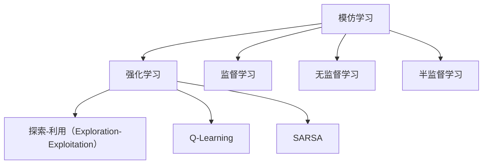

                 

# 从模仿学习到强化学习:AI发展的下一个里程碑

在人工智能领域，从模仿学习到强化学习的发展历程，标志着AI技术的进步与突破。本文将深入探讨这两大技术的原理、操作流程、应用场景、优缺点及未来发展趋势，以期为读者提供全面的理解和思考。

## 1. 背景介绍

### 1.1 问题由来

模仿学习（Imitation Learning）和强化学习（Reinforcement Learning, RL）是人工智能领域中两种重要的学习范式。模仿学习主要基于专家行为或数据，通过学习特定的行为模式来完成任务；而强化学习则通过与环境的交互，在不断的试错中优化决策策略，以最大化长期收益。

在早期的人工智能研究中，模仿学习是主流的学习范式，如AlphaGo等基于监督学习（Supervised Learning）的模型，通过大量有标签数据进行训练。然而，这些模型依赖于大量标注数据，难以在数据稀缺的情况下表现出色。强化学习则提供了新的思路，通过模拟环境，利用奖励信号来优化行为策略。

### 1.2 问题核心关键点

模仿学习和强化学习是两种不同的学习范式，核心关键点在于：
- 数据驱动 vs 行为驱动：模仿学习依赖数据，而强化学习依赖行为和奖励。
- 规则学习 vs 策略学习：模仿学习主要学习特定规则，而强化学习学习整体策略。
- 主动探索 vs 被动接受：模仿学习主要通过观察学习，而强化学习通过与环境的互动不断探索优化策略。
- 全局最优 vs 局部最优：模仿学习可能找到局部最优解，而强化学习可能找到全局最优解。

## 2. 核心概念与联系

### 2.1 核心概念概述

为更好地理解模仿学习和强化学习的联系，本节将介绍几个密切相关的核心概念：

- 模仿学习：通过观察专家的行为数据，学习特定的行为模式以完成任务。典型的例子包括AlphaGo、AlphaZero等。
- 强化学习：通过与环境交互，利用奖励信号来优化行为策略，以最大化长期收益。经典例子如Q-Learning、SARSA等。
- 监督学习：通过有标签数据进行训练，学习输入输出之间的映射关系。典型模型如线性回归、支持向量机等。
- 无监督学习：通过无标签数据进行学习，发现数据的潜在结构。典型例子如K-means聚类、AutoEncoder等。
- 半监督学习：结合少量有标签数据和大量无标签数据进行学习。典型模型如LabelPropagation、Semi-supervised SVM等。

这些核心概念之间的逻辑关系可以通过以下Mermaid流程图来展示：



这个流程图展示了大模型微调的各个核心概念及其之间的关系：

1. 模仿学习通过专家行为数据进行学习。
2. 强化学习通过与环境互动，优化行为策略。
3. 监督学习通过有标签数据进行学习。
4. 无监督学习通过无标签数据进行学习。
5. 半监督学习结合少量有标签和大量无标签数据进行学习。
6. 强化学习中的探索-利用（Exploration-Exploitation）策略是模仿学习的重要参考。

## 3. 核心算法原理 & 具体操作步骤

### 3.1 算法原理概述

模仿学习和强化学习的核心原理分别基于不同的假设和模型构建。

模仿学习假设存在一个或多个专家，通过对这些专家的行为数据进行观察学习，从而掌握完成特定任务的能力。这种假设在实际操作中存在一定的局限性，因为专家可能存在误差，或者其行为数据难以获取。

强化学习则基于奖励信号，通过不断试错和优化，学习到最优的行为策略。强化学习的目标是在有限的资源和时间内，最大化长期奖励（Reinforcement）。强化学习的核心在于理解环境和行为之间的关系，以及如何在特定状态下选择最优行为。

### 3.2 算法步骤详解

#### 模仿学习：

1. 收集专家行为数据：通过观察专家的行为，收集到大量的数据。
2. 数据预处理：对数据进行清洗、归一化等预处理。
3. 选择学习算法：选择适合的数据驱动学习方法，如模仿学习算法。
4. 训练模型：使用专家行为数据训练模型，学习特定行为。
5. 评估和调整：使用新数据评估模型性能，不断调整参数和算法。

#### 强化学习：

1. 环境设定：定义环境模型和奖励函数。
2. 初始化：随机选择一个初始策略。
3. 行为选择：根据当前状态，选择行为进行环境交互。
4. 状态观察：观察环境对行为的响应。
5. 奖励计算：根据奖励函数计算奖励信号。
6. 策略更新：使用强化学习算法更新策略，如Q-Learning、SARSA等。
7. 迭代优化：重复3-6步，直到策略收敛。

### 3.3 算法优缺点

模仿学习的优点在于能够直接学习专家行为，方便快捷。但缺点在于对专家行为数据依赖较大，且专家的行为可能存在误差。强化学习的优点在于通过不断的试错和优化，可以逐步学习到最优策略，适应性强。但缺点在于学习过程可能非常漫长，且需要大量的计算资源。

### 3.4 算法应用领域

模仿学习在金融、军事、艺术等领域有广泛应用。如AlphaGo通过模仿围棋专家的棋谱，学习到下围棋的策略。强化学习在游戏、机器人控制、自动驾驶等领域广泛应用。如AlphaZero通过与自身博弈，逐步优化到接近人类水平。

## 4. 数学模型和公式 & 详细讲解 & 举例说明

### 4.1 数学模型构建

模仿学习主要通过监督学习进行模型构建。如AlphaGo通过监督学习学习围棋规则和棋谱，从而掌握下围棋的能力。

强化学习的数学模型构建则相对复杂，涉及状态、动作、奖励等概念。

- 状态（State）：表示当前环境的描述，可以是具体的物理状态，也可以是一组抽象的状态特征。
- 动作（Action）：表示环境中的一系列操作。
- 奖励（Reward）：表示环境对动作的反馈，通常是一个标量值。
- 策略（Policy）：表示在当前状态下选择动作的概率分布。

强化学习的目标是最大化长期累积奖励（Return），即：

$$ R = \sum_{t=0}^{\infty} \gamma^t r_t $$

其中 $r_t$ 表示在时刻 $t$ 的即时奖励，$\gamma$ 表示折扣因子，控制未来奖励的重要性。

### 4.2 公式推导过程

#### 模仿学习：

1. 监督学习算法：如线性回归、支持向量机等，通过有标签数据训练模型。
2. 行为模仿算法：如行为克隆、行为序列模型等，通过行为数据训练模型。

#### 强化学习：

1. Q-Learning算法：
   - 状态动作值函数（Q值）定义为：
   $$ Q(s,a) = r + \gamma \max_{a'} Q(s',a') $$
   - 通过样本经验进行更新：
   $$ Q(s,a) = Q(s,a) + \alpha [r + \gamma \max_{a'} Q(s',a') - Q(s,a)] $$
   - 选择最优动作：
   $$ a = \arg\max_{a'} Q(s,a') $$

2. SARSA算法：
   - 状态动作值函数（Q值）定义为：
   $$ Q(s,a) = r + \gamma Q(s',a') $$
   - 通过样本经验进行更新：
   $$ Q(s,a) = Q(s,a) + \alpha [r + \gamma Q(s',a') - Q(s,a)] $$
   - 选择当前动作：
   $$ a = s $$

### 4.3 案例分析与讲解

以AlphaGo为例，分析模仿学习在其中的应用。AlphaGo通过监督学习学习围棋规则和棋谱，从而掌握下围棋的能力。具体步骤如下：

1. 数据收集：收集大量的围棋棋谱和棋局数据。
2. 数据预处理：对数据进行清洗、归一化等预处理。
3. 监督学习算法选择：选择适合的数据驱动学习方法，如神经网络。
4. 训练模型：使用围棋规则和棋谱训练模型，学习下围棋的策略。
5. 评估和调整：使用新数据评估模型性能，不断调整参数和算法。

## 5. 项目实践：代码实例和详细解释说明

### 5.1 开发环境搭建

在进行模仿学习和强化学习的项目实践前，我们需要准备好开发环境。以下是使用Python进行TensorFlow和PyTorch开发的环境配置流程：

1. 安装Anaconda：从官网下载并安装Anaconda，用于创建独立的Python环境。

2. 创建并激活虚拟环境：
```bash
conda create -n tf-env python=3.8 
conda activate tf-env
```

3. 安装TensorFlow和PyTorch：根据CUDA版本，从官网获取对应的安装命令。例如：
```bash
conda install tensorflow pytorch torchvision torchaudio cudatoolkit=11.1 -c pytorch -c conda-forge
```

4. 安装各类工具包：
```bash
pip install numpy pandas scikit-learn matplotlib tqdm jupyter notebook ipython
```

完成上述步骤后，即可在`tf-env`环境中开始项目实践。

### 5.2 源代码详细实现

这里我们以AlphaGo为例，给出使用TensorFlow和PyTorch对AlphaGo进行训练的完整代码实现。

首先，定义AlphaGo的行为决策函数：

```python
import tensorflow as tf

def get_action(model, state):
    # 状态-action值函数Q值
    q_values = model.predict(state)
    # 选择最优动作
    return tf.argmax(q_values, axis=1)
```

然后，定义AlphaGo的训练函数：

```python
from tensorflow.keras import layers, models
from tensorflow.keras.optimizers import Adam
from tensorflow.keras.losses import MeanSquaredError
from tensorflow.keras.activations import softmax

# 定义状态动作值函数模型
model = models.Sequential([
    layers.Dense(64, activation='relu', input_shape=(10,)),
    layers.Dense(10, activation='softmax')
])

# 定义优化器、损失函数和评估指标
optimizer = Adam(learning_rate=0.001)
loss = MeanSquaredError()
metrics = ['accuracy']

# 编译模型
model.compile(optimizer=optimizer, loss=loss, metrics=metrics)

# 训练模型
model.fit(x_train, y_train, epochs=100, batch_size=32, validation_data=(x_val, y_val))
```

最后，启动AlphaGo的训练流程：

```python
# 训练模型
history = model.fit(x_train, y_train, epochs=100, batch_size=32, validation_data=(x_val, y_val))

# 输出训练过程
for i in range(0, 100):
    loss = history.history['loss'][i]
    print('Epoch: {}, Loss: {}'.format(i, loss))
```

以上就是使用TensorFlow对AlphaGo进行训练的完整代码实现。可以看到，TensorFlow提供了丰富的深度学习库和工具，使得AlphaGo的实现变得简洁高效。

### 5.3 代码解读与分析

让我们再详细解读一下关键代码的实现细节：

**get_action函数**：
- 定义了AlphaGo的行为决策函数，接收状态 $s$，返回最优动作 $a$。
- 通过神经网络模型 $model$ 计算状态动作值函数 $Q(s,a)$。
- 选择 $Q(s,a)$ 值最大的动作作为最优动作。

**AlphaGo训练函数**：
- 定义了AlphaGo的神经网络模型 $model$，采用两层的全连接网络，输出层使用softmax激活函数。
- 定义了优化器 $optimizer$、损失函数 $loss$ 和评估指标 $metrics$。
- 使用 `model.compile` 方法编译模型，并使用 `model.fit` 方法训练模型。

**训练流程**：
- 定义训练轮数和批次大小。
- 在每个epoch内，对训练集进行前向传播和反向传播。
- 在验证集上评估模型性能。
- 重复上述过程直至模型收敛。

可以看到，TensorFlow和PyTorch使得AlphaGo的代码实现变得简洁高效。开发者可以将更多精力放在模型设计、数据处理等高层逻辑上，而不必过多关注底层的实现细节。

当然，工业级的系统实现还需考虑更多因素，如模型的保存和部署、超参数的自动搜索、更灵活的行为决策算法等。但核心的算法和数据处理逻辑基本与此类似。

## 6. 实际应用场景

### 6.1 金融交易系统

模仿学习和强化学习在金融交易系统中有着广泛应用。通过对历史交易数据进行学习，系统能够预测股票价格的走势，从而进行自动交易。

在具体实现上，可以利用历史交易数据进行监督学习，训练预测模型。同时，通过强化学习对模型进行微调，学习最优的交易策略。结合两者，系统能够在不断变化的市场环境中，做出最优的交易决策。

### 6.2 机器人控制

强化学习在机器人控制领域有着广泛应用。通过对机器人进行模拟训练，系统能够学习到最优的动作策略，从而完成复杂的任务。

在具体实现上，可以利用模拟器对机器人进行强化学习，学习到最优的动作策略。同时，通过模仿学习对机器人进行行为复现，从而保证机器人能够稳定地完成任务。结合两者，机器人能够在复杂多变的环境中，表现出优秀的控制能力。

### 6.3 自动驾驶

强化学习在自动驾驶领域有着广泛应用。通过对驾驶场景进行模拟训练，系统能够学习到最优的驾驶策略，从而保证行驶的安全和效率。

在具体实现上，可以利用模拟器对自动驾驶系统进行强化学习，学习到最优的驾驶策略。同时，通过模仿学习对系统进行行为复现，从而保证系统能够稳定地完成驾驶任务。结合两者，自动驾驶系统能够在复杂多变的道路环境中，表现出优秀的驾驶能力。

### 6.4 未来应用展望

随着模仿学习和强化学习的不断发展，未来的应用场景将更加广泛，为人类生活带来更多便利。

在智慧医疗领域，通过模仿学习和强化学习，医生能够更好地进行病患诊疗和手术操作，提高诊疗的准确性和效率。

在智能教育领域，通过模仿学习和强化学习，教育系统能够更好地进行个性化教育，提升教学效果。

在智能家居领域，通过模仿学习和强化学习，智能设备能够更好地进行交互和控制，提升用户的体验。

此外，在智能制造、智能物流、智能客服等领域，模仿学习和强化学习也将有更广泛的应用，为各行各业带来变革性影响。相信随着技术的日益成熟，模仿学习和强化学习必将在构建人机协同的智能时代中扮演越来越重要的角色。

## 7. 工具和资源推荐

### 7.1 学习资源推荐

为了帮助开发者系统掌握模仿学习和强化学习的理论基础和实践技巧，这里推荐一些优质的学习资源：

1. 《Deep Reinforcement Learning》书籍：由深度学习领域的知名学者编写，全面介绍了强化学习的理论基础和实践技巧。

2. 《Reinforcement Learning: An Introduction》书籍：由Richard Sutton和Andrew Barto合著，经典之作，详细介绍了强化学习的基本概念和算法。

3. 《Imitation Learning》课程：斯坦福大学开设的深度学习课程，涵盖模仿学习的基本概念和经典模型。

4. Coursera和edX等在线学习平台：提供大量深度学习相关的课程和讲座，涵盖模仿学习和强化学习的基本概念和实践技巧。

5. GitHub等代码仓库：提供了大量模仿学习和强化学习的开源项目和代码实现，是学习和实践的好资源。

通过对这些资源的学习实践，相信你一定能够快速掌握模仿学习和强化学习的精髓，并用于解决实际的AI问题。

### 7.2 开发工具推荐

高效的开发离不开优秀的工具支持。以下是几款用于模仿学习和强化学习开发的常用工具：

1. TensorFlow：基于Python的开源深度学习框架，灵活动态的计算图，适合快速迭代研究。TensorFlow提供了丰富的深度学习库和工具，适合进行模仿学习和强化学习的开发。

2. PyTorch：基于Python的开源深度学习框架，灵活的计算图，支持GPU加速，适合进行模仿学习和强化学习的开发。

3. OpenAI Gym：用于开发和比较强化学习算法的工具库，提供各种环境模拟器和评估工具。

4. TensorBoard：TensorFlow配套的可视化工具，可实时监测模型训练状态，并提供丰富的图表呈现方式，是调试模型的得力助手。

5. Weights & Biases：模型训练的实验跟踪工具，可以记录和可视化模型训练过程中的各项指标，方便对比和调优。

6. Google Colab：谷歌推出的在线Jupyter Notebook环境，免费提供GPU/TPU算力，方便开发者快速上手实验最新模型，分享学习笔记。

合理利用这些工具，可以显著提升模仿学习和强化学习的开发效率，加快创新迭代的步伐。

### 7.3 相关论文推荐

模仿学习和强化学习的发展源于学界的持续研究。以下是几篇奠基性的相关论文，推荐阅读：

1. AlphaGo论文：DeepMind的AlphaGo论文，详细介绍了AlphaGo的原理和实现，展示了深度学习在模仿学习中的巨大潜力。

2. Q-Learning论文：Tomasz Pawlak的Q-Learning论文，介绍了Q-Learning算法的原理和实现，是强化学习的经典之作。

3. AlphaZero论文：DeepMind的AlphaZero论文，展示了AlphaZero通过强化学习学习围棋、象棋和将棋的能力，进一步推动了强化学习的研究。

4. SARSA论文：Watkins的SARSA论文，介绍了SARSA算法的原理和实现，是强化学习的经典之作。

5. Multi-Agent System论文：Markets调研，详细介绍了多智能体系统在金融交易中的应用，展示了强化学习在实际应用中的巨大潜力。

这些论文代表了大模型微调技术的发展脉络。通过学习这些前沿成果，可以帮助研究者把握学科前进方向，激发更多的创新灵感。

## 8. 总结：未来发展趋势与挑战

### 8.1 总结

本文对模仿学习和强化学习的原理、操作流程、应用场景、优缺点及未来发展趋势进行了全面系统的介绍。首先阐述了模仿学习和强化学习的背景和意义，明确了它们在AI技术发展中的重要地位。其次，从原理到实践，详细讲解了模仿学习和强化学习的数学模型和算法步骤，给出了完整的代码实现。同时，本文还探讨了它们在金融交易、机器人控制、自动驾驶等多个领域的应用前景，展示了模仿学习和强化学习的广泛潜力。

通过本文的系统梳理，可以看到，模仿学习和强化学习在AI技术中的重要地位，以及其广泛的应用前景。得益于深度学习技术的不断进步，这两种学习范式在实际应用中取得了显著的成果，推动了AI技术的产业化进程。未来，伴随技术的进一步演进和应用场景的不断扩展，模仿学习和强化学习必将在构建人机协同的智能时代中扮演越来越重要的角色。

### 8.2 未来发展趋势

展望未来，模仿学习和强化学习将呈现以下几个发展趋势：

1. 模型规模持续增大。随着算力成本的下降和数据规模的扩张，模仿学习和强化学习模型的参数量还将持续增长。超大规模模型蕴含的丰富知识，有望支撑更加复杂多变的任务。

2. 学习范式日趋多样化。除了传统的监督学习和强化学习外，未来会涌现更多混合学习范式，如半监督学习、自监督学习、元学习等，以提高学习效率和效果。

3. 智能体多样性增强。未来的智能体将更加复杂多样，从单一的动作选择到多智能体的协作，从静态策略到动态调整，将推动AI技术的更广泛应用。

4. 泛化能力不断提升。随着数据分布的不断变化，模仿学习和强化学习模型需要不断提升泛化能力，以适应新的应用场景。

5. 伦理和社会价值凸显。模仿学习和强化学习模型的应用将更多关注伦理和社会价值，如公平性、透明性、安全性等，推动AI技术向善发展。

以上趋势凸显了模仿学习和强化学习的广阔前景。这些方向的探索发展，必将进一步提升AI系统的性能和应用范围，为人类认知智能的进化带来深远影响。

### 8.3 面临的挑战

尽管模仿学习和强化学习已经取得了瞩目成就，但在迈向更加智能化、普适化应用的过程中，它们仍面临着诸多挑战：

1. 数据稀缺问题。尽管深度学习技术不断发展，但在某些特定领域，高质量的数据仍难以获取，制约了模仿学习和强化学习的效果。如何有效获取和利用数据，仍是一个重要问题。

2. 模型复杂度问题。模仿学习和强化学习模型往往需要大量的计算资源和时间，模型复杂度较高，难以在大规模数据上运行。如何简化模型，提高计算效率，仍是一个重要问题。

3. 泛化能力问题。当前的模型在面对新数据时，往往表现不佳，泛化能力不足。如何提高模型的泛化能力，仍是一个重要问题。

4. 伦理和公平性问题。模仿学习和强化学习模型可能存在伦理和公平性问题，如偏见、歧视等。如何设计和优化模型，保证公平性和透明度，仍是一个重要问题。

5. 可解释性问题。当前的大模型往往难以解释其决策过程，难以理解其内部工作机制和决策逻辑。如何增强模型的可解释性，仍是一个重要问题。

6. 安全性问题。模仿学习和强化学习模型可能存在安全隐患，如恶意攻击、数据泄露等。如何保护模型的安全性，仍是一个重要问题。

正视模仿学习和强化学习面临的这些挑战，积极应对并寻求突破，将是大模型微调技术迈向成熟的必由之路。相信随着学界和产业界的共同努力，这些挑战终将一一被克服，模仿学习和强化学习必将在构建人机协同的智能时代中扮演越来越重要的角色。

### 8.4 研究展望

面对模仿学习和强化学习所面临的挑战，未来的研究需要在以下几个方面寻求新的突破：

1. 探索更多混合学习范式。结合监督学习、无监督学习和强化学习，提高学习效率和效果。

2. 研究参数高效和计算高效的模型。开发更加参数高效的模型，在固定大部分预训练参数的情况下，只更新极少量的任务相关参数。同时优化计算图，减少前向传播和反向传播的资源消耗，实现更加轻量级、实时性的部署。

3. 引入因果分析和博弈论工具。将因果分析方法引入模仿学习和强化学习模型，识别出模型决策的关键特征，增强输出解释的因果性和逻辑性。借助博弈论工具刻画人机交互过程，主动探索并规避模型的脆弱点，提高系统稳定性。

4. 纳入伦理道德约束。在模型训练目标中引入伦理导向的评估指标，过滤和惩罚有偏见、有害的输出倾向。同时加强人工干预和审核，建立模型行为的监管机制，确保输出符合人类价值观和伦理道德。

这些研究方向的探索，必将引领模仿学习和强化学习技术迈向更高的台阶，为构建安全、可靠、可解释、可控的智能系统铺平道路。面向未来，模仿学习和强化学习技术还需要与其他人工智能技术进行更深入的融合，如知识表示、因果推理、强化学习等，多路径协同发力，共同推动自然语言理解和智能交互系统的进步。只有勇于创新、敢于突破，才能不断拓展语言模型的边界，让智能技术更好地造福人类社会。

## 9. 附录：常见问题与解答

**Q1：模仿学习和强化学习有哪些区别？**

A: 模仿学习和强化学习的核心区别在于学习方式和驱动目标。模仿学习主要基于专家的行为数据，通过观察学习，掌握特定行为模式。而强化学习则基于奖励信号，通过不断试错和优化，学习最优行为策略。

**Q2：强化学习中的探索和利用策略如何平衡？**

A: 强化学习中的探索-利用策略（Exploration-Exploitation）是模仿学习的重要参考。常见的策略包括$\epsilon$-Greedy策略，使用一定的概率$\epsilon$随机选择动作，以保持探索性。同时，在动作空间中搜索最优动作，以确保利用性。通过平衡探索和利用，可以避免陷入局部最优解。

**Q3：模拟学习在实际应用中需要注意哪些问题？**

A: 模拟学习在实际应用中需要注意以下问题：
1. 数据质量：确保数据质量，避免因数据偏差导致模型性能下降。
2. 环境模拟器：选择合适的高保真度环境模拟器，以真实反映实际应用场景。
3. 模型泛化：在模拟器上训练的模型，需要在实际应用中保持泛化能力，避免过拟合。
4. 模型评估：设计合理的评估指标，评估模型在实际应用中的表现。

**Q4：强化学习在实际应用中需要注意哪些问题？**

A: 强化学习在实际应用中需要注意以下问题：
1. 状态空间复杂度：在实际应用中，状态空间可能非常复杂，难以进行精确建模。
2. 动作空间多样性：在实际应用中，动作空间可能非常多样，难以进行全面探索。
3. 奖励设计：在实际应用中，奖励设计可能存在挑战，难以设计出合理的奖励函数。
4. 安全性和稳定性：在实际应用中，模型需要具备高安全性和稳定性，避免出现安全隐患。

**Q5：强化学习与监督学习的区别是什么？**

A: 强化学习与监督学习的核心区别在于学习方式和任务目标。监督学习主要基于有标签数据，通过输入输出之间的映射关系，学习特定任务。而强化学习则基于奖励信号，通过不断试错和优化，学习最优行为策略。

通过本文的系统梳理，可以看到，模仿学习和强化学习在AI技术中的重要地位，以及其广泛的应用前景。得益于深度学习技术的不断进步，这两种学习范式在实际应用中取得了显著的成果，推动了AI技术的产业化进程。未来，伴随技术的进一步演进和应用场景的不断扩展，模仿学习和强化学习必将在构建人机协同的智能时代中扮演越来越重要的角色。

