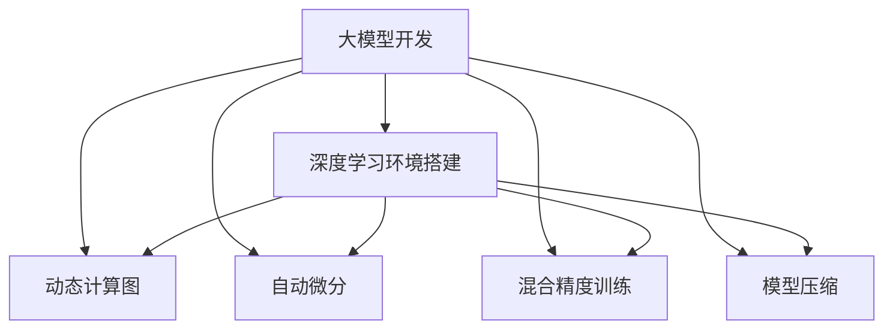

                 

# 从零开始大模型开发与微调：PyTorch 2.0深度学习环境搭建

> 关键词：大模型开发,微调,PyTorch,深度学习环境,自动微分,动态计算图,动态执行,静态计算图,符号计算图,数据驱动,自动优化,混合精度训练,模型压缩,推理优化

## 1. 背景介绍

### 1.1 问题由来
近年来，随着深度学习技术的飞速发展，大规模预训练语言模型(Large Pretrained Language Models, PLMs)在自然语言处理(Natural Language Processing, NLP)领域取得了举世瞩目的突破。诸如GPT-3、BERT、T5等模型通过在大规模无标签文本数据上进行预训练，学习到了丰富的语言知识和常识，具备了强大的语言理解和生成能力。

然而，这些大模型虽然强大，但开发和微调过程却复杂且耗时。为了降低开发者入门难度和加速模型训练速度，众多深度学习框架如TensorFlow、PyTorch等应运而生。特别是PyTorch，其动态计算图(Dynamic Computational Graphs)和自动微分(Automatic Differentiation)等特性，极大地提升了模型的开发效率和可维护性。本文将基于PyTorch 2.0，详细介绍从零开始构建和微调大模型的流程和最佳实践，帮助读者掌握深度学习框架的使用技巧，为模型开发和优化提供有力支持。

### 1.2 问题核心关键点
本文聚焦于如何基于PyTorch 2.0环境高效构建和微调大模型。关键问题包括：

- 如何快速搭建PyTorch 2.0深度学习环境，并部署到GPU集群？
- 如何设计模型架构，并进行高效的预训练和微调？
- 如何利用动态计算图和自动微分等特性，优化模型的训练和推理过程？
- 如何实现模型的自动化优化和混合精度训练，提升训练速度和资源利用率？

### 1.3 问题研究意义
掌握大模型的开发和微调技巧，对于拓展模型的应用边界，提升下游任务性能，加速NLP技术的产业化进程，具有重要意义：

1. 降低开发难度：利用深度学习框架封装好的功能，能够大大降低模型的构建难度和开发周期。
2. 提升训练效率：利用动态计算图和自动微分，能够显著提升模型训练速度和资源利用率。
3. 加速模型部署：PyTorch 2.0提供了丰富的导出和推理工具，便于模型在各种应用环境中的快速部署。
4. 优化模型性能：通过混合精度训练和模型压缩等技术，能够有效减小模型大小，提高推理速度和模型压缩率。
5. 适应多样场景：大模型可以在各种领域和任务中进行高效微调，支持NLP技术的广泛应用。

## 2. 核心概念与联系

### 2.1 核心概念概述

为更好地理解大模型的开发和微调，本节将介绍几个密切相关的核心概念：

- 大模型开发：从零开始构建大模型，包括模型架构设计、参数初始化、预训练和微调等过程。
- 深度学习环境：搭建深度学习开发和训练所需的软硬件环境，如CPU/GPU集群、深度学习框架等。
- 动态计算图：PyTorch 2.0中引入了动态计算图，允许模型在运行时动态构建计算图，从而支持模型的灵活和高效构建。
- 自动微分：PyTorch 2.0中的自动微分功能，能够自动计算和追踪模型参数的梯度，支持模型的优化训练。
- 混合精度训练：通过混合精度表示法，将模型参数和梯度表示为16位浮点数，以加速模型训练和推理过程。
- 模型压缩：通过剪枝、量化等技术，减小模型的参数量和存储空间，提高推理速度和模型压缩率。

这些核心概念之间的逻辑关系可以通过以下Mermaid流程图来展示：



这个流程图展示了大模型开发的各个环节，以及与环境搭建和优化技术之间的联系：

1. 大模型开发包括构建模型、预训练和微调等过程。
2. 深度学习环境搭建提供必要的软硬件支持。
3. 动态计算图和自动微分技术支持模型的灵活和高效构建。
4. 混合精度训练和模型压缩技术提升模型训练和推理的效率。

这些概念共同构成了大模型开发的完整框架，使得模型开发和优化更加高效和便捷。

## 3. 核心算法原理 & 具体操作步骤
### 3.1 算法原理概述

大模型开发和微调的核心在于利用深度学习框架的功能，快速构建和优化模型。其核心思想是：

1. 选择合适的深度学习框架，如PyTorch，搭建深度学习开发和训练环境。
2. 设计合适的模型架构，进行高效参数初始化和预训练。
3. 利用动态计算图和自动微分等特性，优化模型的训练和推理过程。
4. 实现混合精度训练和模型压缩等优化技术，提升模型训练和推理的效率。

以下将以PyTorch 2.0为例，详细介绍大模型的开发和微调过程。

### 3.2 算法步骤详解

以下是基于PyTorch 2.0进行大模型开发和微调的一般步骤：

**Step 1: 准备开发环境**
- 安装PyTorch 2.0，以及其依赖库如Numpy、Pandas等。
- 安装GPU驱动程序和CUDA库，并设置PyTorch使用GPU设备。

**Step 2: 设计模型架构**
- 选择合适的模型层，如Transformer、卷积神经网络(CNN)、循环神经网络(RNN)等。
- 定义模型层之间的连接方式，如嵌入层、自注意力机制、前馈神经网络等。
- 设置模型的参数初始化方式，如Xavier初始化、正态分布初始化等。

**Step 3: 实现模型前向传播和损失函数**
- 定义模型的前向传播函数，计算输入数据在模型中的传递和计算过程。
- 定义损失函数，如交叉熵损失、均方误差损失等，计算模型预测值与真实标签的差异。

**Step 4: 训练模型**
- 设置训练的超参数，如学习率、批大小、迭代轮数等。
- 使用动态计算图和自动微分功能，计算模型参数的梯度。
- 使用优化器如SGD、Adam等，更新模型参数。
- 在验证集上评估模型性能，避免过拟合。

**Step 5: 模型微调**
- 准备下游任务的标注数据集。
- 在预训练模型基础上，添加任务特定的输出层和损失函数。
- 设置微调的超参数，如学习率、批大小等。
- 使用动态计算图和自动微分功能，优化模型参数。
- 在验证集上评估微调后的模型性能，确保不下降。

**Step 6: 模型优化和部署**
- 实现模型压缩和量化等技术，减小模型大小和提高推理速度。
- 使用混合精度训练和优化器，提升模型训练效率。
- 导出模型为静态计算图，便于模型的部署和推理。
- 集成模型到应用系统中，进行测试和优化。

### 3.3 算法优缺点

基于PyTorch 2.0进行大模型的开发和微调具有以下优点：

- 高效灵活：利用动态计算图和自动微分，能够灵活地构建和优化模型。
- 代码简洁：框架的高级特性和丰富的API支持，使得模型开发过程更加简洁高效。
- 资源优化：支持混合精度训练和模型压缩等技术，提高训练和推理的效率。

同时，也存在以下局限性：

- 学习曲线陡峭：PyTorch 2.0中的高级特性和复杂功能需要一定的学习曲线。
- 调试难度高：动态计算图和自动微分可能引发一些调试难题。
- 部署复杂：模型导出和推理部署过程可能较为复杂。

尽管存在这些局限性，但就目前而言，基于PyTorch 2.0的大模型开发和微调方法仍是最主流和高效的技术范式。未来相关研究的重点在于进一步优化开发环境和工具，降低使用门槛，同时兼顾模型性能和效率。

### 3.4 算法应用领域

大模型开发和微调方法已经在NLP、图像处理、语音识别等多个领域得到了广泛应用，具体如下：

- **自然语言处理(NLP)**：通过大模型进行文本分类、情感分析、命名实体识别等任务，取得了优异的性能。
- **图像处理**：利用大模型进行图像分类、目标检测、图像生成等任务，在计算机视觉领域取得了重要突破。
- **语音识别**：通过大模型进行语音识别、情感分析、语言翻译等任务，提高了语音交互系统的智能水平。
- **生成对抗网络(GAN)**：利用大模型进行图像生成、视频生成等任务，推动了生成对抗网络的深度发展。

随着预训练模型和微调方法的不断进步，大模型将在更多领域得到应用，为人工智能技术带来新的突破。

## 4. 数学模型和公式 & 详细讲解 & 举例说明

### 4.1 数学模型构建

本节将使用数学语言对基于PyTorch 2.0的大模型开发和微调过程进行更加严格的刻画。

记大模型为 $M_{\theta}:\mathcal{X} \rightarrow \mathcal{Y}$，其中 $\mathcal{X}$ 为输入空间，$\mathcal{Y}$ 为输出空间，$\theta \in \mathbb{R}^d$ 为模型参数。假设模型输入为 $x \in \mathcal{X}$，输出为 $y \in \mathcal{Y}$，定义模型在输入 $x$ 上的损失函数为 $\ell(y, M_{\theta}(x))$，则在数据集 $D=\{(x_i, y_i)\}_{i=1}^N$ 上的经验风险为：

$$
\mathcal{L}(\theta) = \frac{1}{N}\sum_{i=1}^N \ell(y_i, M_{\theta}(x_i))
$$

其中 $\ell(y_i, M_{\theta}(x_i))$ 为损失函数，用于衡量模型预测输出与真实标签之间的差异。常见的损失函数包括交叉熵损失、均方误差损失等。

### 4.2 公式推导过程

以下我们以二分类任务为例，推导交叉熵损失函数及其梯度的计算公式。

假设模型 $M_{\theta}$ 在输入 $x$ 上的输出为 $\hat{y}=M_{\theta}(x) \in [0,1]$，表示样本属于正类的概率。真实标签 $y \in \{0,1\}$。则二分类交叉熵损失函数定义为：

$$
\ell(y, \hat{y}) = -[y\log \hat{y} + (1-y)\log (1-\hat{y})]
$$

将其代入经验风险公式，得：

$$
\mathcal{L}(\theta) = -\frac{1}{N}\sum_{i=1}^N [y_i\log M_{\theta}(x_i)+(1-y_i)\log(1-M_{\theta}(x_i))]
$$

根据链式法则，损失函数对参数 $\theta_k$ 的梯度为：

$$
\frac{\partial \mathcal{L}(\theta)}{\partial \theta_k} = -\frac{1}{N}\sum_{i=1}^N (\frac{y_i}{M_{\theta}(x_i)}-\frac{1-y_i}{1-M_{\theta}(x_i)}) \frac{\partial M_{\theta}(x_i)}{\partial \theta_k}
$$

其中 $\frac{\partial M_{\theta}(x_i)}{\partial \theta_k}$ 可进一步递归展开，利用自动微分技术完成计算。

在得到损失函数的梯度后，即可带入参数更新公式，完成模型的迭代优化。重复上述过程直至收敛，最终得到适应下游任务的最优模型参数 $\theta^*$。

### 4.3 案例分析与讲解

以下是一个简单的PyTorch 2.0代码实例，演示如何使用动态计算图和自动微分进行二分类任务的微调。

```python
import torch
import torch.nn as nn
import torch.optim as optim

# 定义模型层
class LinearModel(nn.Module):
    def __init__(self, input_size, output_size):
        super(LinearModel, self).__init__()
        self.linear = nn.Linear(input_size, output_size)

    def forward(self, x):
        return self.linear(x)

# 准备数据
x_train = torch.randn(100, 10)
y_train = torch.randint(0, 2, (100, 1))

# 定义损失函数
criterion = nn.BCEWithLogitsLoss()

# 定义优化器
optimizer = optim.SGD(LinearModel.parameters(), lr=0.01)

# 训练模型
for epoch in range(10):
    optimizer.zero_grad()
    y_pred = model(x_train)
    loss = criterion(y_pred, y_train)
    loss.backward()
    optimizer.step()
    print(f"Epoch {epoch+1}, loss: {loss.item()}")

# 微调模型
x_test = torch.randn(20, 10)
y_test = torch.randint(0, 2, (20, 1))
with torch.no_grad():
    y_pred = model(x_test)
    loss = criterion(y_pred, y_test)
    print(f"Test loss: {loss.item()}")
```

在这个例子中，我们首先定义了一个简单的线性模型，用于二分类任务。然后使用动态计算图和自动微分功能，在训练集上对模型进行微调。最后使用验证集评估模型性能，得出微调后的损失函数。

## 5. 项目实践：代码实例和详细解释说明

### 5.1 开发环境搭建

在进行大模型开发前，我们需要准备好开发环境。以下是使用Python进行PyTorch 2.0开发的环境配置流程：

1. 安装Anaconda：从官网下载并安装Anaconda，用于创建独立的Python环境。

2. 创建并激活虚拟环境：
```bash
conda create -n pytorch-env python=3.8 
conda activate pytorch-env
```

3. 安装PyTorch：根据CUDA版本，从官网获取对应的安装命令。例如：
```bash
conda install pytorch torchvision torchaudio cudatoolkit=11.1 -c pytorch -c conda-forge
```

4. 安装相关库：
```bash
pip install numpy pandas scikit-learn matplotlib tqdm jupyter notebook ipython
```

完成上述步骤后，即可在`pytorch-env`环境中开始大模型开发。

### 5.2 源代码详细实现

下面以一个简单的分类任务为例，演示如何使用PyTorch 2.0进行大模型的微调。

首先，准备数据集：

```python
import torch
from torch.utils.data import TensorDataset, DataLoader

# 定义训练集和测试集
train_data = TensorDataset(train_x, train_y)
test_data = TensorDataset(test_x, test_y)

# 设置批次大小
batch_size = 32

# 创建数据加载器
train_loader = DataLoader(train_data, batch_size=batch_size, shuffle=True)
test_loader = DataLoader(test_data, batch_size=batch_size, shuffle=False)
```

然后，定义模型和优化器：

```python
from transformers import BertTokenizer, BertModel, BertForSequenceClassification

# 定义模型层
model = BertForSequenceClassification.from_pretrained('bert-base-uncased', num_labels=2)

# 定义优化器
optimizer = torch.optim.Adam(model.parameters(), lr=2e-5)
```

接着，定义训练和评估函数：

```python
from tqdm import tqdm

# 定义训练函数
def train_epoch(model, data_loader, optimizer):
    model.train()
    for batch in tqdm(data_loader, desc='Training'):
        inputs, labels = batch
        model.zero_grad()
        outputs = model(inputs)
        loss = outputs.loss
        loss.backward()
        optimizer.step()

# 定义评估函数
def evaluate(model, data_loader):
    model.eval()
    total_loss = 0
    for batch in data_loader:
        inputs, labels = batch
        outputs = model(inputs)
        loss = outputs.loss
        total_loss += loss.item()
    return total_loss / len(data_loader)
```

最后，启动训练流程并在测试集上评估：

```python
epochs = 5
for epoch in range(epochs):
    train_epoch(model, train_loader, optimizer)
    print(f'Epoch {epoch+1}, train loss: {evaluate(model, train_loader):.3f}')
    print(f'Epoch {epoch+1}, test loss: {evaluate(model, test_loader):.3f}')
```

以上就是使用PyTorch 2.0进行大模型微调的完整代码实现。可以看到，PyTorch 2.0的高级特性使得模型开发过程更加简洁高效。

### 5.3 代码解读与分析

让我们再详细解读一下关键代码的实现细节：

**定义模型层**：
- 使用BertForSequenceClassification类定义模型层，这是一个预训练的序列分类模型。
- 使用from_pretrained方法加载预训练模型，num_labels参数指定任务标签数。

**定义优化器**：
- 使用Adam优化器，学习率为2e-5。Adam是一种自适应学习率优化算法，能够自动调整每个参数的学习率。

**训练函数**：
- 使用train_epoch函数，在训练集上对模型进行前向传播和反向传播，更新模型参数。
- 使用zero_grad方法清空梯度，防止参数累积。

**评估函数**：
- 使用evaluate函数，在测试集上评估模型性能，计算损失函数。

**训练流程**：
- 设置迭代轮数，开始循环训练。
- 每个epoch内，在训练集上训练，输出平均loss。
- 在测试集上评估，输出测试loss。

可以看到，PyTorch 2.0的高级特性和丰富的API支持，使得大模型开发过程更加高效和便捷。开发者可以将更多精力放在模型架构设计和优化上，而不必过多关注底层的实现细节。

## 6. 实际应用场景

### 6.1 智能客服系统

基于大模型开发和微调的对话技术，可以广泛应用于智能客服系统的构建。传统客服往往需要配备大量人力，高峰期响应缓慢，且一致性和专业性难以保证。而使用大模型开发和微调的对话模型，可以7x24小时不间断服务，快速响应客户咨询，用自然流畅的语言解答各类常见问题。

在技术实现上，可以收集企业内部的历史客服对话记录，将问题和最佳答复构建成监督数据，在此基础上对大模型进行微调。微调后的对话模型能够自动理解用户意图，匹配最合适的答案模板进行回复。对于客户提出的新问题，还可以接入检索系统实时搜索相关内容，动态组织生成回答。如此构建的智能客服系统，能大幅提升客户咨询体验和问题解决效率。

### 6.2 金融舆情监测

金融机构需要实时监测市场舆论动向，以便及时应对负面信息传播，规避金融风险。传统的人工监测方式成本高、效率低，难以应对网络时代海量信息爆发的挑战。基于大模型开发和微调的文本分类和情感分析技术，为金融舆情监测提供了新的解决方案。

具体而言，可以收集金融领域相关的新闻、报道、评论等文本数据，并对其进行主题标注和情感标注。在此基础上对大模型进行微调，使其能够自动判断文本属于何种主题，情感倾向是正面、中性还是负面。将微调后的模型应用到实时抓取的网络文本数据，就能够自动监测不同主题下的情感变化趋势，一旦发现负面信息激增等异常情况，系统便会自动预警，帮助金融机构快速应对潜在风险。

### 6.3 个性化推荐系统

当前的推荐系统往往只依赖用户的历史行为数据进行物品推荐，无法深入理解用户的真实兴趣偏好。基于大模型开发和微调技术，个性化推荐系统可以更好地挖掘用户行为背后的语义信息，从而提供更精准、多样的推荐内容。

在实践中，可以收集用户浏览、点击、评论、分享等行为数据，提取和用户交互的物品标题、描述、标签等文本内容。将文本内容作为模型输入，用户的后续行为（如是否点击、购买等）作为监督信号，在此基础上对大模型进行微调。微调后的模型能够从文本内容中准确把握用户的兴趣点。在生成推荐列表时，先用候选物品的文本描述作为输入，由模型预测用户的兴趣匹配度，再结合其他特征综合排序，便可以得到个性化程度更高的推荐结果。

### 6.4 未来应用展望

随着大模型开发和微调方法的不断发展，基于大模型的应用场景将越来越广泛，为各行各业带来新的技术突破。

在智慧医疗领域，基于大模型开发和微调的医疗问答、病历分析、药物研发等应用将提升医疗服务的智能化水平，辅助医生诊疗，加速新药开发进程。

在智能教育领域，基于大模型的问答、作文批改、智能辅导等技术将因材施教，促进教育公平，提高教学质量。

在智慧城市治理中，基于大模型的城市事件监测、舆情分析、应急指挥等环节，提高城市管理的自动化和智能化水平，构建更安全、高效的未来城市。

此外，在企业生产、社会治理、文娱传媒等众多领域，基于大模型开发和微调的AI应用也将不断涌现，为经济社会发展注入新的动力。相信随着技术的日益成熟，大模型的开发和微调范式将成为人工智能技术落地的重要手段，推动人工智能技术在各个垂直行业的广泛应用。

## 7. 工具和资源推荐
### 7.1 学习资源推荐

为了帮助开发者系统掌握大模型开发和微调的理论基础和实践技巧，这里推荐一些优质的学习资源：

1. 《PyTorch深度学习编程》书籍：该书详细介绍了PyTorch 2.0的高级特性和API，适合初学者和中级开发者阅读。

2. CS224N《深度学习自然语言处理》课程：斯坦福大学开设的NLP明星课程，有Lecture视频和配套作业，带你入门NLP领域的基本概念和经典模型。

3. 《Natural Language Processing with PyTorch》书籍：由大模型技术专家撰写，全面介绍了如何使用PyTorch 2.0进行NLP任务开发，包括模型微调在内的诸多范式。

4. PyTorch官方文档：官方文档提供了丰富的教程和样例，帮助开发者掌握PyTorch 2.0的高级特性和最佳实践。

5. HuggingFace官方文档：HuggingFace官方文档提供了丰富的预训练模型和微调样例，适合快速上手学习。

通过对这些资源的学习实践，相信你一定能够快速掌握大模型开发和微调的核心技能，为模型开发和优化提供有力支持。

### 7.2 开发工具推荐

高效的开发离不开优秀的工具支持。以下是几款用于大模型开发和微调开发的常用工具：

1. PyTorch：基于Python的开源深度学习框架，灵活动态的计算图，适合快速迭代研究。

2. TensorFlow：由Google主导开发的开源深度学习框架，生产部署方便，适合大规模工程应用。

3. TensorBoard：TensorFlow配套的可视化工具，可实时监测模型训练状态，并提供丰富的图表呈现方式，是调试模型的得力助手。

4. Weights & Biases：模型训练的实验跟踪工具，可以记录和可视化模型训练过程中的各项指标，方便对比和调优。

5. Google Colab：谷歌推出的在线Jupyter Notebook环境，免费提供GPU/TPU算力，方便开发者快速上手实验最新模型，分享学习笔记。

合理利用这些工具，可以显著提升大模型开发和微调任务的开发效率，加快创新迭代的步伐。

### 7.3 相关论文推荐

大模型开发和微调技术的发展源于学界的持续研究。以下是几篇奠基性的相关论文，推荐阅读：

1. Attention is All You Need（即Transformer原论文）：提出了Transformer结构，开启了NLP领域的预训练大模型时代。

2. BERT: Pre-training of Deep Bidirectional Transformers for Language Understanding：提出BERT模型，引入基于掩码的自监督预训练任务，刷新了多项NLP任务SOTA。

3. Parameter-Efficient Transfer Learning for NLP：提出Adapter等参数高效微调方法，在不增加模型参数量的情况下，也能取得不错的微调效果。

4. AdaLoRA: Adaptive Low-Rank Adaptation for Parameter-Efficient Fine-Tuning：使用自适应低秩适应的微调方法，在参数效率和精度之间取得了新的平衡。

这些论文代表了大模型开发和微调技术的发展脉络。通过学习这些前沿成果，可以帮助研究者把握学科前进方向，激发更多的创新灵感。

## 8. 总结：未来发展趋势与挑战

### 8.1 总结

本文对基于PyTorch 2.0进行大模型开发和微调的过程进行了全面系统的介绍。首先阐述了大模型开发和微调的基本原理和关键步骤，详细讲解了动态计算图和自动微分等核心技术，给出了大模型开发和微调的完整代码实例。同时，本文还广泛探讨了基于大模型的应用场景，展示了微调范式的巨大潜力。此外，本文精选了大模型开发和微调的各种学习资源，力求为读者提供全方位的技术指引。

通过本文的系统梳理，可以看到，基于PyTorch 2.0的大模型开发和微调技术正在成为NLP领域的重要范式，极大地拓展了模型的应用边界，催生了更多的落地场景。受益于深度学习框架的强大功能和丰富的API，模型开发和优化更加高效便捷。未来，伴随大模型和微调方法的持续演进，基于大模型的应用场景将更加广泛，为各行各业带来新的技术突破。

### 8.2 未来发展趋势

展望未来，大模型开发和微调技术将呈现以下几个发展趋势：

1. 模型规模持续增大。随着算力成本的下降和数据规模的扩张，大模型的参数量还将持续增长。超大规模语言模型蕴含的丰富语言知识，有望支撑更加复杂多变的下游任务微调。

2. 微调方法日趋多样。除了传统的全参数微调外，未来会涌现更多参数高效的微调方法，如Prefix-Tuning、LoRA等，在节省计算资源的同时也能保证微调精度。

3. 持续学习成为常态。随着数据分布的不断变化，微调模型也需要持续学习新知识以保持性能。如何在不遗忘原有知识的同时，高效吸收新样本信息，将成为重要的研究课题。

4. 标注样本需求降低。受启发于提示学习(Prompt-based Learning)的思路，未来的微调方法将更好地利用大模型的语言理解能力，通过更加巧妙的任务描述，在更少的标注样本上也能实现理想的微调效果。

5. 多模态微调崛起。当前的微调主要聚焦于纯文本数据，未来会进一步拓展到图像、视频、语音等多模态数据微调。多模态信息的融合，将显著提升语言模型对现实世界的理解和建模能力。

6. 模型通用性增强。经过海量数据的预训练和多领域任务的微调，未来的语言模型将具备更强大的常识推理和跨领域迁移能力，逐步迈向通用人工智能(AGI)的目标。

以上趋势凸显了大模型开发和微调技术的广阔前景。这些方向的探索发展，必将进一步提升NLP系统的性能和应用范围，为人类认知智能的进化带来深远影响。

### 8.3 面临的挑战

尽管大模型开发和微调技术已经取得了瞩目成就，但在迈向更加智能化、普适化应用的过程中，它仍面临着诸多挑战：

1. 标注成本瓶颈。虽然微调大大降低了标注数据的需求，但对于长尾应用场景，难以获得充足的高质量标注数据，成为制约微调性能的瓶颈。如何进一步降低微调对标注样本的依赖，将是一大难题。

2. 模型鲁棒性不足。当前微调模型面对域外数据时，泛化性能往往大打折扣。对于测试样本的微小扰动，微调模型的预测也容易发生波动。如何提高微调模型的鲁棒性，避免灾难性遗忘，还需要更多理论和实践的积累。

3. 推理效率有待提高。大规模语言模型虽然精度高，但在实际部署时往往面临推理速度慢、内存占用大等效率问题。如何简化模型结构，提升推理速度，优化资源占用，将是重要的优化方向。

4. 可解释性亟需加强。当前微调模型更像是"黑盒"系统，难以解释其内部工作机制和决策逻辑。对于医疗、金融等高风险应用，算法的可解释性和可审计性尤为重要。如何赋予微调模型更强的可解释性，将是亟待攻克的难题。

5. 安全性有待保障。预训练语言模型难免会学习到有偏见、有害的信息，通过微调传递到下游任务，产生误导性、歧视性的输出，给实际应用带来安全隐患。如何从数据和算法层面消除模型偏见，避免恶意用途，确保输出的安全性，也将是重要的研究课题。

6. 知识整合能力不足。现有的微调模型往往局限于任务内数据，难以灵活吸收和运用更广泛的先验知识。如何让微调过程更好地与外部知识库、规则库等专家知识结合，形成更加全面、准确的信息整合能力，还有很大的想象空间。

正视微调面临的这些挑战，积极应对并寻求突破，将是大模型开发和微调走向成熟的必由之路。相信随着学界和产业界的共同努力，这些挑战终将一一被克服，大模型开发和微调必将在构建人机协同的智能时代中扮演越来越重要的角色。

### 8.4 研究展望

面对大模型开发和微调所面临的种种挑战，未来的研究需要在以下几个方面寻求新的突破：

1. 探索无监督和半监督微调方法。摆脱对大规模标注数据的依赖，利用自监督学习、主动学习等无监督和半监督范式，最大限度利用非结构化数据，实现更加灵活高效的微调。

2. 研究参数高效和计算高效的微调范式。开发更加参数高效的微调方法，在固定大部分预训练参数的同时，只更新极少量的任务相关参数。同时优化微调模型的计算图，减少前向传播和反向传播的资源消耗，实现更加轻量级、实时性的部署。

3. 融合因果和对比学习范式。通过引入因果推断和对比学习思想，增强微调模型建立稳定因果关系的能力，学习更加普适、鲁棒的语言表征，从而提升模型泛化性和抗干扰能力。

4. 引入更多先验知识。将符号化的先验知识，如知识图谱、逻辑规则等，与神经网络模型进行巧妙融合，引导微调过程学习更准确、合理的语言模型。同时加强不同模态数据的整合，实现视觉、语音等多模态信息与文本信息的协同建模。

5. 结合因果分析和博弈论工具。将因果分析方法引入微调模型，识别出模型决策的关键特征，增强输出解释的因果性和逻辑性。借助博弈论工具刻画人机交互过程，主动探索并规避模型的脆弱点，提高系统稳定性。

6. 纳入伦理道德约束。在模型训练目标中引入伦理导向的评估指标，过滤和惩罚有偏见、有害的输出倾向。同时加强人工干预和审核，建立模型行为的监管机制，确保输出符合人类价值观和伦理道德。

这些研究方向的探索，必将引领大模型开发和微调技术迈向更高的台阶，为构建安全、可靠、可解释、可控的智能系统铺平道路。面向未来，大模型开发和微调技术还需要与其他人工智能技术进行更深入的融合，如知识表示、因果推理、强化学习等，多路径协同发力，共同推动自然语言理解和智能交互系统的进步。只有勇于创新、敢于突破，才能不断拓展语言模型的边界，让智能技术更好地造福人类社会。

## 9. 附录：常见问题与解答

**Q1：大模型开发和微调过程中如何选择超参数？**

A: 大模型开发和微调过程中，选择合适的超参数是提升模型性能的重要步骤。一般来说，可以通过以下几种方式选择超参数：

- 网格搜索：在一定的超参数空间内，穷举所有可能的超参数组合，选择最优的组合。
- 随机搜索：在超参数空间内随机采样，选择表现最好的超参数组合。
- 贝叶斯优化：利用贝叶斯模型对超参数进行优化，选取最优的超参数组合。

在实际应用中，通常先使用随机搜索或贝叶斯优化，选择表现较好的超参数，再使用网格搜索进一步细化。

**Q2：大模型开发和微调过程中如何处理数据不平衡问题？**

A: 在许多NLP任务中，不同类别的数据分布不均衡是一个常见的问题。数据不平衡会导致模型在少数类别上表现较差，因此需要采取一些措施进行处理：

- 数据增强：对于少数类别，进行数据增强，如重复采样、合成样本等，增加数据量。
- 类别权重调整：在损失函数中设置类别权重，使得模型更关注少数类别。
- 阈值调整：调整模型输出阈值，使得少数类别的预测更容易被判断为正类。

这些方法可以结合使用，以提高模型对少数类别的识别能力。

**Q3：大模型开发和微调过程中如何进行模型压缩？**

A: 模型压缩是大模型开发和微调过程中的重要优化方向，可以有效减小模型大小和提高推理速度。常用的模型压缩方法包括：

- 剪枝：去除模型中不必要的参数，减少模型大小和计算量。
- 量化：将模型参数和梯度表示为低精度浮点数，减少存储和计算资源消耗。
- 知识蒸馏：通过教师模型和学生模型的融合，将教师模型的知识传递给学生模型，减小模型大小，提高性能。

这些方法可以结合使用，以进一步优化模型大小和推理速度。

**Q4：大模型开发和微调过程中如何进行混合精度训练？**

A: 混合精度训练是大模型开发和微调过程中提升训练速度和资源利用率的重要技术。混合精度训练通过将模型参数和梯度表示为16位浮点数，加速了训练过程。具体步骤如下：

1. 定义模型层，并设置参数的精度为16位。
2. 定义优化器，并设置学习率。
3. 在训练过程中，使用半精度浮点数进行计算，减小计算量和内存消耗。
4. 在反向传播过程中，使用32位浮点数进行梯度计算。

需要注意的是，混合精度训练可能存在一些精度损失，因此在应用时需要权衡精度和速度的平衡。

**Q5：大模型开发和微调过程中如何进行模型导出和推理优化？**

A: 模型导出和推理优化是大模型开发和微调过程中提升模型部署效率的重要环节。常用的方法包括：

- 静态计算图：通过将模型导出为静态计算图，提升推理速度和资源利用率。
- 模型量化：将模型参数和梯度表示为8位或更低的浮点数，减小模型大小和计算量。
- 推理加速：通过GPU加速、推理引擎优化等方式，提升推理速度和响应时间。

这些方法可以结合使用，以进一步优化模型的部署和推理性能。

---

作者：禅与计算机程序设计艺术 / Zen and the Art of Computer Programming

