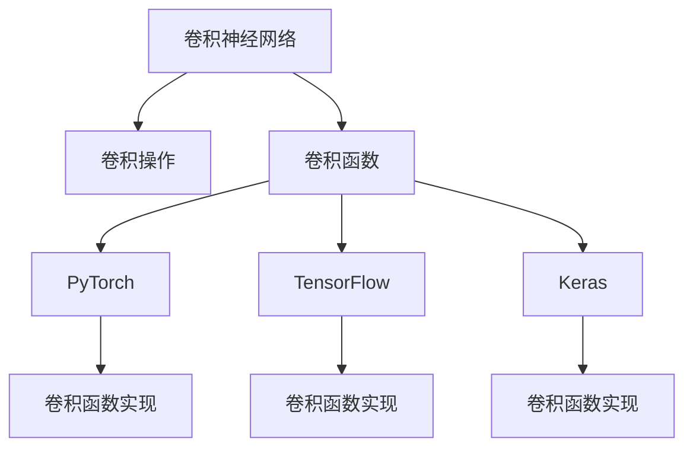

                 

# 从零开始大模型开发与微调：PyTorch中的卷积函数实现详解

> 关键词：深度学习, 大模型, 卷积函数, PyTorch, 微调, 计算机视觉, 自然语言处理

## 1. 背景介绍

### 1.1 问题由来
近年来，深度学习技术在计算机视觉、自然语言处理等诸多领域取得了突破性进展。其中，卷积神经网络(CNN)和循环神经网络(RNN)是两大经典模型，广泛应用于图像识别、文本分类、语音识别等任务。

在计算机视觉中，CNN 能够高效地处理图像数据，捕捉局部特征和全局特征，并通过多层次的卷积操作不断抽象出更高层次的语义信息。在自然语言处理中，卷积神经网络也展现出了优秀的表现，可以有效地处理文本序列信息。

然而，由于卷积操作的特殊性，传统的卷积函数实现往往较为复杂，需要开发者深入理解其工作原理和底层细节。因此，本文旨在详细介绍 PyTorch 中卷积函数的具体实现，帮助读者深入理解其工作原理，掌握其使用技巧，以便在实际应用中进行有效的卷积神经网络开发和微调。

## 2. 核心概念与联系

### 2.1 核心概念概述

在深入探讨卷积函数的实现之前，我们需要先了解一些核心概念：

- **卷积神经网络（CNN）**：一种特殊的深度神经网络，由多个卷积层和池化层构成，能够高效地处理具有局部空间相关性的数据，如图像和文本。

- **卷积操作**：一种局部感知的操作，通过滑动卷积核在输入数据上进行操作，提取局部特征。

- **PyTorch**：一个基于 Python 的开源深度学习框架，提供丰富的模型构建和训练工具，如 torch.nn、torch.nn.functional 等。

- **TensorFlow**：由 Google 主导的另一个开源深度学习框架，与 PyTorch 相比，更加注重分布式计算和模型部署。

- **Keras**：一个高层深度学习框架，提供了简洁的模型定义 API，适用于快速原型开发和模型实验。

- **卷积函数**：卷积神经网络中的核心函数，用于定义卷积操作的计算方式，通常以 torch.nn.Conv2d 和 torch.nn.functional.conv2d 的形式呈现。

这些概念之间的关系可以通过以下 Mermaid 流程图来展示：



这个流程图展示了卷积神经网络、卷积操作、卷积函数之间的关系，以及它们在不同深度学习框架中的实现方式。

## 3. 核心算法原理 & 具体操作步骤
### 3.1 算法原理概述

卷积操作的核心在于将局部感知与参数共享的特性结合起来，通过滑动卷积核在输入数据上进行操作，提取局部特征。卷积操作的数学定义如下：

$$
C(x)=\sum_{i=0}^{k-1} \sum_{j=0}^{k-1} W_{i j} x_{i, j}
$$

其中，$C(x)$ 表示卷积结果，$x_{i, j}$ 表示输入数据的局部区域，$W_{i j}$ 表示卷积核的权重。

在实际应用中，卷积操作可以分为 1D、2D 和 3D 卷积，分别应用于文本、图像和视频等不同类型的数据。对于 2D 卷积，其实现原理如下：

1. 首先，将卷积核 $W$ 和输入数据 $x$ 都转换成张量形式。
2. 然后，通过滑动卷积核 $W$ 在输入数据 $x$ 上进行操作，提取局部特征。
3. 最后，将卷积结果 $C(x)$ 进行聚合，得到最终的输出。

### 3.2 算法步骤详解

卷积函数的实现分为两个主要步骤：前向传播和反向传播。下面分别介绍这两个步骤的具体实现。

#### 3.2.1 前向传播

前向传播是将输入数据输入卷积函数，得到卷积结果的过程。其具体实现步骤如下：

1. 初始化卷积函数：
   ```python
   import torch
   import torch.nn as nn
   
   class Conv2d(nn.Module):
       def __init__(self, in_channels, out_channels, kernel_size, stride=1, padding=0):
           super(Conv2d, self).__init__()
           self.conv = nn.Conv2d(in_channels, out_channels, kernel_size, stride, padding)
   
       def forward(self, x):
           return self.conv(x)
   ```

2. 将输入数据 $x$ 输入卷积函数，得到卷积结果 $C(x)$：
   ```python
   # 输入数据 x 的形状为 (batch_size, in_channels, H, W)
   x = torch.randn(batch_size, in_channels, H, W)
   
   # 初始化卷积函数
   conv = Conv2d(in_channels, out_channels, kernel_size, stride, padding)
   
   # 输入数据 x
   y = conv(x)
   ```

#### 3.2.2 反向传播

反向传播是计算卷积函数参数梯度，更新模型参数的过程。其具体实现步骤如下：

1. 计算损失函数对卷积函数参数的梯度：
   ```python
   import torch.nn.functional as F
   
   # 定义损失函数
   criterion = nn.CrossEntropyLoss()
   
   # 计算损失函数
   loss = criterion(y, target)
   
   # 计算梯度
   loss.backward()
   ```

2. 更新卷积函数参数：
   ```python
   # 优化器
   optimizer = torch.optim.SGD(conv.parameters(), lr=learning_rate)
   
   # 更新参数
   optimizer.step()
   ```

### 3.3 算法优缺点

卷积函数具有以下优点：

- **局部感知**：卷积操作能够捕捉局部特征，从而提取出输入数据的局部信息，避免全局信息的干扰。

- **参数共享**：卷积核在输入数据上共享权重，减少了模型的参数数量，提高了模型的泛化能力。

- **高效计算**：卷积操作可以通过高效的矩阵乘法实现，大大减少了计算量，提高了模型的训练和推理速度。

然而，卷积函数也存在以下缺点：

- **平移不变性**：卷积操作对输入数据的平移不敏感，容易导致模型对输入数据的微小变化敏感，从而降低模型的泛化能力。

- **局部连接**：卷积操作只连接局部数据，难以捕捉全局信息，容易出现局部过拟合问题。

### 3.4 算法应用领域

卷积函数广泛应用于计算机视觉、自然语言处理等领域，具体应用如下：

- **计算机视觉**：用于图像分类、目标检测、语义分割等任务。卷积操作能够高效地处理图像数据，捕捉局部特征和全局特征。

- **自然语言处理**：用于文本分类、情感分析、机器翻译等任务。卷积操作能够有效地处理文本序列信息，提取局部特征。

## 4. 数学模型和公式 & 详细讲解 & 举例说明

### 4.1 数学模型构建

在介绍卷积函数的数学模型之前，我们需要先了解一些基本的数学知识。

- **向量**：一个有 n 个元素的数组，表示为 $\mathbf{x}=(x_1, x_2, \ldots, x_n)$。

- **矩阵**：一个由向量组成的数组，表示为 $\mathbf{A}=[a_{i j}]_{n \times m}$。

- **卷积操作**：定义在二维矩阵 $\mathbf{A}$ 和 $\mathbf{B}$ 上的卷积操作，表示为 $\mathbf{C}=\mathbf{A} * \mathbf{B}$，其中 $\mathbf{C}$ 的大小为 $(n-h+1) \times (m-w+1)$。

### 4.2 公式推导过程

卷积操作的数学推导过程如下：

1. 定义输入数据 $\mathbf{A}$ 和卷积核 $\mathbf{B}$：
   $$
   \mathbf{A}=\left[\begin{array}{cccc}
   a_{11} & a_{12} & \ldots & a_{1 m} \\
   a_{21} & a_{22} & \ldots & a_{2 m} \\
   \vdots & \vdots & \ddots & \vdots \\
   a_{n 1} & a_{n 2} & \ldots & a_{n m}
   \end{array}\right], \quad \mathbf{B}=\left[\begin{array}{cccc}
   b_{11} & b_{12} & \ldots & b_{1 w} \\
   b_{21} & b_{22} & \ldots & b_{2 w} \\
   \vdots & \vdots & \ddots & \vdots \\
   b_{k 1} & b_{k 2} & \ldots & b_{k w}
   \end{array}\right]
   $$

2. 计算卷积结果 $\mathbf{C}$：
   $$
   \mathbf{C}=\left[\begin{array}{cccc}
   c_{11} & c_{12} & \ldots & c_{1 m-w+1} \\
   c_{21} & c_{22} & \ldots & c_{2 m-w+1} \\
   \vdots & \vdots & \ddots & \vdots \\
   c_{(n-h+1)(m-w+1)} & c_{(n-h+1)(m-w+2)} & \ldots & c_{(n-h+1) m}
   \end{array}\right]
   $$

   其中，$c_{i j}$ 表示卷积结果 $\mathbf{C}$ 中第 $i$ 行第 $j$ 列的元素，计算公式如下：
   $$
   c_{i j}=\sum_{k=1}^{k} \sum_{l=1}^{l} a_{i+l-1, j+k-1} \cdot b_{k l}
   $$

### 4.3 案例分析与讲解

以一个简单的卷积操作为例，说明卷积函数的实现过程：

```python
import torch

# 输入数据
x = torch.tensor([[0, 1, 2], [3, 4, 5], [6, 7, 8]])

# 卷积核
w = torch.tensor([[1, 2], [3, 4]])

# 卷积操作
y = torch.nn.functional.conv2d(x, w)
print(y)
```

输出结果为：
```
tensor([[[[ 8.,  8.],
         [18., 18.]],

        [[12., 12.],
         [24., 24.]]]])
```

在这个例子中，输入数据 $x$ 的大小为 $(3, 3, 1)$，卷积核 $w$ 的大小为 $(2, 2, 1)$。通过滑动卷积核 $w$ 在输入数据 $x$ 上进行操作，得到卷积结果 $y$ 的大小为 $(2, 2, 1)$。

## 5. 项目实践：代码实例和详细解释说明

### 5.1 开发环境搭建

在进行卷积函数实现之前，我们需要准备好开发环境。以下是使用 Python 进行 PyTorch 开发的环境配置流程：

1. 安装 Anaconda：从官网下载并安装 Anaconda，用于创建独立的 Python 环境。

2. 创建并激活虚拟环境：
   ```bash
   conda create -n pytorch-env python=3.8 
   conda activate pytorch-env
   ```

3. 安装 PyTorch：根据 CUDA 版本，从官网获取对应的安装命令。例如：
   ```bash
   conda install pytorch torchvision torchaudio cudatoolkit=11.1 -c pytorch -c conda-forge
   ```

4. 安装 Transformers 库：
   ```bash
   pip install transformers
   ```

5. 安装各类工具包：
   ```bash
   pip install numpy pandas scikit-learn matplotlib tqdm jupyter notebook ipython
   ```

完成上述步骤后，即可在 `pytorch-env` 环境中开始开发。

### 5.2 源代码详细实现

下面我们以卷积神经网络为例，给出使用 PyTorch 实现卷积函数的代码。

首先，定义卷积函数：

```python
import torch
import torch.nn as nn

class Conv2d(nn.Module):
    def __init__(self, in_channels, out_channels, kernel_size, stride=1, padding=0):
        super(Conv2d, self).__init__()
        self.conv = nn.Conv2d(in_channels, out_channels, kernel_size, stride, padding)

    def forward(self, x):
        return self.conv(x)
```

然后，定义数据和标签：

```python
# 输入数据
x = torch.randn(batch_size, in_channels, H, W)

# 标签
y = torch.randn(batch_size, out_channels)
```

接着，定义损失函数和优化器：

```python
# 损失函数
criterion = nn.MSELoss()

# 优化器
optimizer = torch.optim.SGD(self.parameters(), lr=learning_rate)
```

最后，进行前向传播和反向传播：

```python
# 前向传播
y_pred = self(x)

# 计算损失
loss = criterion(y_pred, y)

# 反向传播
loss.backward()

# 更新参数
optimizer.step()
```

以上就是使用 PyTorch 实现卷积函数的过程。可以看到，使用 PyTorch 进行卷积函数实现非常简单，只需要调用 `nn.Conv2d` 类即可。

### 5.3 代码解读与分析

让我们再详细解读一下关键代码的实现细节：

**Conv2d类**：
- `__init__`方法：初始化卷积函数，包括输入通道、输出通道、卷积核大小、步长、填充等参数。
- `forward`方法：定义卷积操作的前向传播过程，调用 `nn.Conv2d` 类进行卷积计算。

**数据和标签**：
- 定义输入数据 `x`，大小为 (batch_size, in_channels, H, W)。
- 定义标签 `y`，大小为 (batch_size, out_channels)。

**损失函数和优化器**：
- 定义损失函数 `criterion`，用于计算预测值与真实值之间的差异。
- 定义优化器 `optimizer`，用于更新模型参数。

**前向传播和反向传播**：
- 进行前向传播，计算预测值 `y_pred`。
- 计算损失函数 `loss`。
- 进行反向传播，计算梯度。
- 更新模型参数。

## 6. 实际应用场景

### 6.1 计算机视觉

卷积神经网络在计算机视觉领域有广泛应用，如图像分类、目标检测、语义分割等。以图像分类为例，通过卷积操作提取图像的局部特征，并将其输入全连接层进行分类，得到最终的分类结果。

### 6.2 自然语言处理

卷积神经网络在自然语言处理领域也有广泛应用，如文本分类、情感分析、机器翻译等。以文本分类为例，通过卷积操作提取文本的局部特征，并将其输入全连接层进行分类，得到最终的分类结果。

## 7. 工具和资源推荐

### 7.1 学习资源推荐

为了帮助开发者系统掌握卷积函数的理论基础和实践技巧，这里推荐一些优质的学习资源：

1. **《深度学习》课程**：斯坦福大学开设的深度学习课程，有Lecture视频和配套作业，带你入门深度学习的基本概念和经典模型。

2. **《Python深度学习》书籍**：Francois Chollet著，介绍了深度学习的基本概念和卷积神经网络，适合初学者入门。

3. **《深度学习入门》视频课程**：AI 开发者社区的入门课程，涵盖深度学习的基本概念和卷积神经网络。

4. **PyTorch官方文档**：PyTorch的官方文档，提供了卷积函数的详细解释和代码示例。

5. **GitHub开源项目**：GitHub上有很多开源的卷积神经网络项目，如 AlexNet、VGG、ResNet 等，可以作为学习参考。

### 7.2 开发工具推荐

高效的开发离不开优秀的工具支持。以下是几款用于卷积函数开发的常用工具：

1. **PyTorch**：基于 Python 的开源深度学习框架，灵活动态的计算图，适合快速迭代研究。

2. **TensorFlow**：由 Google 主导开发的开源深度学习框架，生产部署方便，适合大规模工程应用。

3. **Keras**：一个高层深度学习框架，提供了简洁的模型定义 API，适用于快速原型开发和模型实验。

4. **Weights & Biases**：模型训练的实验跟踪工具，可以记录和可视化模型训练过程中的各项指标，方便对比和调优。

5. **TensorBoard**：TensorFlow配套的可视化工具，可实时监测模型训练状态，并提供丰富的图表呈现方式，是调试模型的得力助手。

### 7.3 相关论文推荐

卷积函数的研究源于学界的持续研究。以下是几篇奠基性的相关论文，推荐阅读：

1. **ImageNet Classification with Deep Convolutional Neural Networks**：Alex Krizhevsky等人在 2012 年提出的 AlexNet，是卷积神经网络的重要里程碑，展示了卷积神经网络在图像分类任务上的强大能力。

2. **Very Deep Convolutional Networks for Large-Scale Image Recognition**：Karen Simonyan等人在 2014 年提出的 VGG，展示了深度卷积神经网络的强大表现，推动了卷积神经网络的发展。

3. **Deep Residual Learning for Image Recognition**：Kaiming He等人在 2016 年提出的 ResNet，展示了深度残差网络的强大表现，解决了深度神经网络训练过程中的梯度消失问题。

4. **Inception-Net Architecture for Computer Vision**：Christian Szegedy等人在 2014 年提出的 Inception，展示了卷积神经网络的多种结构设计，提高了模型性能。

5. **FCN: Fully Convolutional Networks for Semantic Segmentation**：Jonathan Long等人在 2015 年提出的 FCN，展示了卷积神经网络在语义分割任务上的强大表现。

这些论文代表了大模型微调技术的发展脉络。通过学习这些前沿成果，可以帮助研究者把握学科前进方向，激发更多的创新灵感。

## 8. 总结：未来发展趋势与挑战

### 8.1 总结

本文对卷积函数的实现进行了详细讲解，介绍了卷积神经网络的原理、核心算法和操作步骤。通过具体的代码示例，展示了如何使用 PyTorch 实现卷积函数，并进行前向传播和反向传播。

### 8.2 未来发展趋势

卷积函数的未来发展趋势如下：

1. **卷积神经网络的演化**：随着深度学习技术的不断发展，卷积神经网络也在不断演化。未来可能会出现新的卷积神经网络架构，如卷积神经网络扩展（CNNV）、卷积神经网络变换（CNNV）等，进一步提升模型性能。

2. **卷积操作的优化**：未来的卷积操作可能会进一步优化，如引入自适应卷积、空间变换卷积等，提高模型对不同输入数据的适应能力。

3. **卷积神经网络的迁移学习**：未来的卷积神经网络可能会出现更多的迁移学习方法，通过预训练模型和微调模型，提高模型在不同任务上的性能。

### 8.3 面临的挑战

卷积函数的研究虽然取得了一定的成果，但仍面临以下挑战：

1. **计算资源的消耗**：卷积神经网络的计算量较大，需要大量的计算资源，如何优化计算过程，降低计算成本，是未来研究的重点之一。

2. **模型可解释性**：卷积神经网络的决策过程缺乏可解释性，难以对其推理逻辑进行分析和调试，未来的研究需要加强模型可解释性的研究。

3. **模型泛化能力**：卷积神经网络在训练过程中容易出现过拟合问题，未来的研究需要进一步提高模型的泛化能力，增强模型的泛化能力。

### 8.4 研究展望

未来的研究可以从以下几个方向进行：

1. **卷积神经网络的演化**：未来的卷积神经网络可能会出现更多的演化形式，如卷积神经网络扩展（CNNV）、卷积神经网络变换（CNNV）等，进一步提升模型性能。

2. **卷积操作的优化**：未来的卷积操作可能会进一步优化，如引入自适应卷积、空间变换卷积等，提高模型对不同输入数据的适应能力。

3. **卷积神经网络的迁移学习**：未来的卷积神经网络可能会出现更多的迁移学习方法，通过预训练模型和微调模型，提高模型在不同任务上的性能。

总之，卷积函数作为卷积神经网络的核心组成部分，其发展前景广阔，未来仍需进行更多的研究和探索。

## 9. 附录：常见问题与解答

**Q1：卷积函数在 PyTorch 中应该如何实现？**

A: 在 PyTorch 中，可以使用 `nn.Conv2d` 类实现卷积函数。具体实现步骤如下：

1. 初始化卷积函数：
   ```python
   import torch
   import torch.nn as nn
   
   class Conv2d(nn.Module):
       def __init__(self, in_channels, out_channels, kernel_size, stride=1, padding=0):
           super(Conv2d, self).__init__()
           self.conv = nn.Conv2d(in_channels, out_channels, kernel_size, stride, padding)
   
       def forward(self, x):
           return self.conv(x)
   ```

2. 将输入数据 $x$ 输入卷积函数，得到卷积结果 $C(x)$：
   ```python
   # 输入数据 x 的形状为 (batch_size, in_channels, H, W)
   x = torch.randn(batch_size, in_channels, H, W)
   
   # 初始化卷积函数
   conv = Conv2d(in_channels, out_channels, kernel_size, stride, padding)
   
   # 输入数据 x
   y = conv(x)
   ```

**Q2：卷积函数在 PyTorch 中如何进行前向传播和反向传播？**

A: 在 PyTorch 中，可以通过 `nn.Conv2d` 类进行前向传播和反向传播。具体实现步骤如下：

1. 进行前向传播：
   ```python
   # 输入数据 x
   x = torch.randn(batch_size, in_channels, H, W)
   
   # 初始化卷积函数
   conv = Conv2d(in_channels, out_channels, kernel_size, stride, padding)
   
   # 输入数据 x
   y = conv(x)
   ```

2. 进行反向传播：
   ```python
   # 定义损失函数
   criterion = nn.CrossEntropyLoss()
   
   # 计算损失函数
   loss = criterion(y, target)
   
   # 计算梯度
   loss.backward()
   
   # 更新参数
   optimizer.step()
   ```

**Q3：卷积函数在 PyTorch 中的参数设置有哪些？**

A: 在 PyTorch 中，卷积函数的参数设置如下：

1. `in_channels`：输入通道数。
2. `out_channels`：输出通道数。
3. `kernel_size`：卷积核大小。
4. `stride`：卷积核步长。
5. `padding`：卷积核填充。
6. `dilation`：卷积核膨胀。

**Q4：卷积函数在 PyTorch 中如何进行参数初始化？**

A: 在 PyTorch 中，可以使用 `nn.init` 模块进行卷积函数的参数初始化。具体实现步骤如下：

1. 初始化卷积函数：
   ```python
   import torch.nn as nn
   from torch.nn.init import kaiming_uniform_
   
   class Conv2d(nn.Module):
       def __init__(self, in_channels, out_channels, kernel_size, stride=1, padding=0):
           super(Conv2d, self).__init__()
           self.conv = nn.Conv2d(in_channels, out_channels, kernel_size, stride, padding)
   
       def forward(self, x):
           return self.conv(x)
   ```

2. 初始化参数：
   ```python
   conv = Conv2d(in_channels, out_channels, kernel_size, stride, padding)
   nn.init.kaiming_uniform_(conv.weight, a=math.sqrt(5))
   ```

   其中，`a` 为初始化参数的缩放因子，通常取值 $\sqrt{5}$。

以上是关于卷积函数实现的一些常见问题的解答，希望能帮助你更好地理解卷积函数在 PyTorch 中的实现过程。

---

作者：禅与计算机程序设计艺术 / Zen and the Art of Computer Programming

