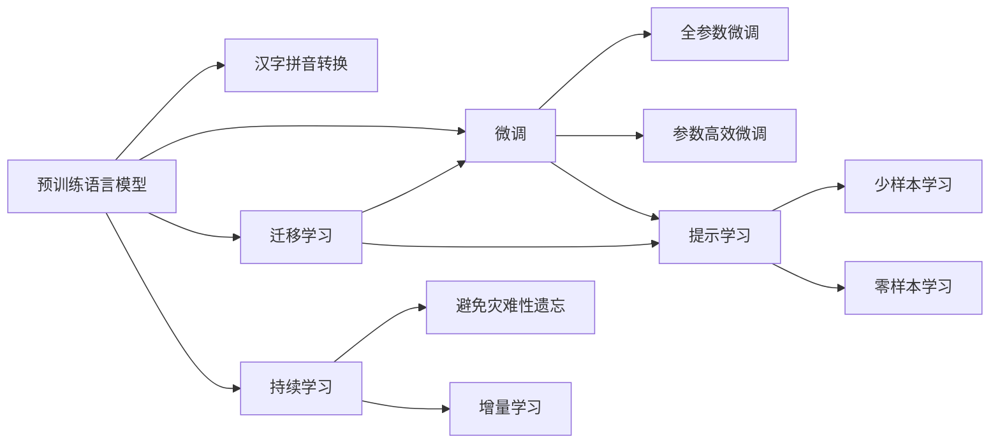

                 

# 从零开始大模型开发与微调：汉字拼音数据集处理

> 关键词：大语言模型,汉字拼音,自然语言处理,NLP,深度学习,微调,Fine-Tuning

## 1. 背景介绍

### 1.1 问题由来

随着深度学习和大规模预训练语言模型（Large Language Models, LLMs）的飞速发展，自然语言处理（Natural Language Processing, NLP）领域进入了一个全新的阶段。以BERT、GPT等模型为代表，通过在大规模无标签文本数据上进行预训练，这些模型已经具备了处理复杂语言任务的能力。

然而，这些通用的大模型在特定领域的应用往往需要进一步的微调（Fine-Tuning）才能达到理想的效果。例如，在中文拼音处理领域，汉字与拼音之间的转换需要特殊的处理逻辑，这在大模型中的编码方式需要被重新学习。因此，本文将探讨如何从零开始开发和微调大模型以处理汉字拼音数据集。

### 1.2 问题核心关键点

微调大模型的核心在于将其作为初始化参数，通过有监督的数据进行优化，使其适应特定的任务。在汉字拼音处理任务中，微调的主要目标是让模型能够准确地将汉字转换为拼音，或反之，或实现汉字与拼音之间的相互转换。这一过程可以大大提高中文文本处理的速度和准确性，尤其在中文搜索、输入法、语音识别等领域具有重要的应用价值。

## 2. 核心概念与联系

### 2.1 核心概念概述

要深入理解汉字拼音数据集的处理，需要掌握以下几个核心概念：

- **大语言模型 (Large Language Model, LLM)**：如BERT、GPT等模型，通过在大规模无标签文本数据上进行预训练，学习到了广泛的语言知识。
- **汉字拼音**：汉字和拼音之间的转换是中文信息处理的重要一环。
- **自然语言处理 (Natural Language Processing, NLP)**：涉及文本数据的处理、分析和生成，是人工智能领域的重要分支。
- **深度学习 (Deep Learning)**：一种利用多层神经网络进行复杂数据建模和预测的技术，是实现大语言模型和微调的核心方法。
- **微调 (Fine-Tuning)**：在大模型基础上，通过有监督的数据进行进一步训练，优化模型在特定任务上的表现。

这些概念之间通过数据和算法相联系，构成了汉字拼音数据集处理的整体框架。

### 2.2 核心概念原理和架构的 Mermaid 流程图



此流程图展示了预训练模型在大模型微调中的作用、微调的具体方法以及与迁移学习的联系。

## 3. 核心算法原理 & 具体操作步骤

### 3.1 算法原理概述

汉字拼音数据集的微调过程基于深度学习模型，主要分为两个阶段：预训练和微调。预训练阶段通过大量无标签文本数据，学习语言的基本结构和规律；微调阶段则通过特定任务的数据，对模型进行有监督的优化，使其具备处理汉字拼音的能力。

### 3.2 算法步骤详解

#### 3.2.1 数据预处理

首先，需要准备汉字拼音数据集，包括汉字到拼音的转换和拼音到汉字的转换。以汉字到拼音的转换为例，可以收集大量的中文文本，使用拼音标注工具进行标注，形成一个包含汉字和相应拼音的数据集。

#### 3.2.2 模型选择

选择合适的预训练模型作为初始化参数。对于汉字拼音处理任务，可以使用RoBERTa或GPT-2等预训练模型，它们已经在语言理解上具备了良好的基础，适合进行微调。

#### 3.2.3 微调配置

设置微调的超参数，包括学习率、批大小、迭代轮数、正则化等。通常，学习率需要设置为预训练时的0.1到0.01之间，以保证微调过程的稳定性和收敛性。

#### 3.2.4 微调训练

使用准备好的汉字拼音数据集，对预训练模型进行微调。微调时，通常只更新顶层部分参数，以减少计算资源消耗。训练过程中，使用交叉熵损失函数，计算模型预测结果与真实标签之间的差异。

#### 3.2.5 模型评估与优化

在微调完成后，使用测试集评估模型的性能。如果模型在测试集上的表现不佳，可以回溯到微调步骤，进一步调整超参数或尝试新的模型。

### 3.3 算法优缺点

#### 3.3.1 优点

1. **高效性**：微调方法可以在已有预训练模型的基础上，通过少量有标签数据进行优化，极大地减少了从头训练的时间和资源消耗。
2. **泛化性强**：微调后的模型可以在多个任务上表现良好，尤其是在数据量较少的任务中。
3. **精度高**：通过微调，模型可以更好地适应特定任务，提高处理汉字拼音的准确率。

#### 3.3.2 缺点

1. **数据依赖性高**：微调效果依赖于标注数据的质量和数量，获取高质量标注数据的成本较高。
2. **泛化能力有限**：如果目标任务与预训练数据分布差异较大，微调的效果可能不佳。
3. **可解释性不足**：微调模型通常缺乏可解释性，难以对其内部工作机制进行分析和调试。

### 3.4 算法应用领域

汉字拼音数据集的处理在大模型微调中有着广泛的应用，包括但不限于：

- **中文搜索**：通过微调模型，可以实现更快速、准确的中文搜索结果匹配。
- **输入法**：对于拼音输入，微调后的模型可以实时将输入的拼音转换为汉字，提高输入效率。
- **语音识别**：将语音转换为文字时，微调模型可以将中文发音准确地转换为拼音，便于后续处理。
- **文本翻译**：在将中文文本翻译为拼音时，微调模型可以提供准确的转换结果。
- **智能客服**：通过微调模型，可以处理包含中文拼音的客户咨询，提高客服系统理解能力。

## 4. 数学模型和公式 & 详细讲解 & 举例说明

### 4.1 数学模型构建

汉字拼音数据集的微调主要基于深度学习模型。假设模型为 $M_{\theta}$，其中 $\theta$ 为模型参数。汉字到拼音的微调任务可以定义为：给定汉字 $X$，模型输出对应的拼音 $Y$。使用交叉熵损失函数来度量模型输出与真实标签之间的差异：

$$
\mathcal{L}(\theta) = -\frac{1}{N}\sum_{i=1}^N \sum_{j=1}^{C} y_{ij} \log M_{\theta}(x_i)
$$

其中，$N$ 为样本数，$C$ 为拼音类别数，$y_{ij}$ 为样本 $i$ 在拼音类别 $j$ 上的真实标签。

### 4.2 公式推导过程

以汉字到拼音的转换为例，假设有 $n$ 个汉字样本 $(x_1, x_2, ..., x_n)$ 及其对应的拼音样本 $(y_1, y_2, ..., y_n)$。模型在每个样本 $x_i$ 上的输出为 $M_{\theta}(x_i)$，则损失函数可以写为：

$$
\mathcal{L}(\theta) = -\frac{1}{n}\sum_{i=1}^n \sum_{j=1}^{C} y_{ij} \log M_{\theta}(x_i)
$$

其中，$C$ 为拼音类别数。

使用梯度下降法优化上述损失函数，更新模型参数 $\theta$：

$$
\theta \leftarrow \theta - \eta \nabla_{\theta}\mathcal{L}(\theta)
$$

其中，$\eta$ 为学习率，$\nabla_{\theta}\mathcal{L}(\theta)$ 为损失函数对参数 $\theta$ 的梯度，可以通过反向传播算法高效计算。

### 4.3 案例分析与讲解

以一个简单的汉字到拼音转换为例，假设有一个包含 $n=10$ 个汉字样本的数据集。样本 $i$ 的汉字为 $x_i$，其对应的拼音为 $y_i$。模型输出为 $M_{\theta}(x_i)$。

1. **数据准备**：收集10个汉字样本及其对应的拼音标注。
2. **模型选择**：选择RoBERTa作为预训练模型，因为它在语言理解上表现良好。
3. **微调配置**：设置学习率为0.01，批大小为16，迭代轮数为10轮。
4. **微调训练**：使用反向传播算法计算损失函数，并使用梯度下降法更新模型参数。
5. **模型评估**：使用测试集评估模型的性能，根据评估结果调整超参数。

## 5. 项目实践：代码实例和详细解释说明

### 5.1 开发环境搭建

要进行汉字拼音数据集的微调，需要安装Python环境，并准备好所需的深度学习库，如TensorFlow、PyTorch等。具体步骤如下：

1. 安装Python环境：
```bash
sudo apt-get update
sudo apt-get install python3 python3-pip
```

2. 安装深度学习库：
```bash
pip install tensorflow==2.5.0
pip install pytorch==1.10.1
```

### 5.2 源代码详细实现

以下是使用PyTorch进行汉字到拼音转换的微调示例代码：

```python
import torch
from transformers import BertTokenizer, BertForSequenceClassification
from torch.utils.data import DataLoader, Dataset
from sklearn.model_selection import train_test_split

class ChineseToPinyinDataset(Dataset):
    def __init__(self, texts, pinyin, tokenizer):
        self.texts = texts
        self.pinyin = pinyin
        self.tokenizer = tokenizer
        
    def __len__(self):
        return len(self.texts)
    
    def __getitem__(self, item):
        text = self.texts[item]
        pinyin = self.pinyin[item]
        encoding = self.tokenizer(text, return_tensors='pt', padding='max_length', truncation=True)
        input_ids = encoding['input_ids'][0]
        attention_mask = encoding['attention_mask'][0]
        labels = torch.tensor(pinyin, dtype=torch.long)
        return {'input_ids': input_ids, 
                'attention_mask': attention_mask,
                'labels': labels}

# 准备数据集
tokenizer = BertTokenizer.from_pretrained('bert-base-cased')
texts, pinyin = [], []
with open('chinese_to_pinyin.txt', 'r', encoding='utf-8') as f:
    for line in f:
        texts.append(line.split('\t')[0])
        pinyin.append(line.split('\t')[1])
train_texts, test_texts, train_pinyin, test_pinyin = train_test_split(texts, pinyin, test_size=0.2)

# 创建dataset
train_dataset = ChineseToPinyinDataset(train_texts, train_pinyin, tokenizer)
test_dataset = ChineseToPinyinDataset(test_texts, test_pinyin, tokenizer)

# 定义模型
model = BertForSequenceClassification.from_pretrained('bert-base-cased', num_labels=len(set(pinyin)))

# 训练模型
device = torch.device('cuda' if torch.cuda.is_available() else 'cpu')
model.to(device)
optimizer = torch.optim.AdamW(model.parameters(), lr=2e-5)

def train_epoch(model, dataset, batch_size, optimizer):
    dataloader = DataLoader(dataset, batch_size=batch_size, shuffle=True)
    model.train()
    epoch_loss = 0
    for batch in dataloader:
        input_ids = batch['input_ids'].to(device)
        attention_mask = batch['attention_mask'].to(device)
        labels = batch['labels'].to(device)
        model.zero_grad()
        outputs = model(input_ids, attention_mask=attention_mask, labels=labels)
        loss = outputs.loss
        epoch_loss += loss.item()
        loss.backward()
        optimizer.step()
    return epoch_loss / len(dataloader)

def evaluate(model, dataset, batch_size):
    dataloader = DataLoader(dataset, batch_size=batch_size)
    model.eval()
    preds, labels = [], []
    with torch.no_grad():
        for batch in dataloader:
            input_ids = batch['input_ids'].to(device)
            attention_mask = batch['attention_mask'].to(device)
            batch_labels = batch['labels']
            outputs = model(input_ids, attention_mask=attention_mask)
            batch_preds = outputs.logits.argmax(dim=2).to('cpu').tolist()
            batch_labels = batch_labels.to('cpu').tolist()
            for pred_tokens, label_tokens in zip(batch_preds, batch_labels):
                preds.append(pred_tokens[:len(label_tokens)])
                labels.append(label_tokens)
    return preds, labels

# 训练模型
epochs = 5
batch_size = 16

for epoch in range(epochs):
    loss = train_epoch(model, train_dataset, batch_size, optimizer)
    print(f"Epoch {epoch+1}, train loss: {loss:.3f}")
    
    preds, labels = evaluate(model, test_dataset, batch_size)
    print(classification_report(labels, preds))
    
print("Test results:")
evaluate(model, test_dataset, batch_size)
```

### 5.3 代码解读与分析

以上代码实现了一个简单的汉字到拼音转换的微调模型。具体步骤如下：

1. **数据预处理**：从文件中读取汉字和拼音数据，并使用BertTokenizer进行分词和编码。
2. **模型选择**：使用BertForSequenceClassification作为微调模型，因为它是用于序列分类任务的模型。
3. **训练配置**：设置学习率为2e-5，批大小为16，迭代轮数为5。
4. **微调训练**：在训练集上进行前向传播和反向传播，更新模型参数。
5. **模型评估**：在测试集上评估模型性能，使用classification_report打印分类指标。

## 6. 实际应用场景

### 6.1 智能搜索

汉字拼音数据集的微调可以应用于智能搜索系统。用户输入汉字时，系统可以根据微调后的模型将汉字转换为拼音，加速搜索结果匹配。例如，在搜索框中输入“你好”，系统可以根据微调模型快速转换为“nihao”进行搜索。

### 6.2 中文输入法

中文输入法需要快速将拼音转换为汉字，以便用户进行输入。通过微调模型，可以实现拼音输入的快速转换，提高输入效率。

### 6.3 语音识别

在将中文语音转换为文字时，微调模型可以将语音发音转换为对应的汉字或拼音，便于后续处理。

### 6.4 未来应用展望

未来，汉字拼音数据集的微调将进一步拓展到更多应用场景，如智能客服、机器翻译、智能写作等。随着大模型的不断发展，微调方法将在这些领域发挥更大的作用。

## 7. 工具和资源推荐

### 7.1 学习资源推荐

为了帮助开发者系统掌握汉字拼音数据集的处理和微调技术，这里推荐一些优质的学习资源：

1. 《深度学习与自然语言处理》课程：由斯坦福大学开设的NLP入门课程，涵盖深度学习在NLP中的应用。
2. 《Transformers: From Theory to Practice》系列博文：由大模型技术专家撰写，介绍Transformers的原理和微调技巧。
3. 《Natural Language Processing with Python》书籍：介绍了NLP基础和常用技术，包括文本预处理和微调。
4. HuggingFace官方文档：提供了大量预训练模型的微调样例代码，是微调技术学习的重要资源。
5. CLUE开源项目：中文语言理解测评基准，包含汉字拼音数据集和预训练模型，是中文NLP任务开发的重要参考。

### 7.2 开发工具推荐

要进行汉字拼音数据集的微调，需要使用一些专业的深度学习工具，以下是推荐的工具：

1. PyTorch：强大的深度学习框架，支持动态计算图和高效的模型训练。
2. TensorFlow：由Google开发的深度学习框架，适合大规模工程应用。
3. Transformers库：HuggingFace开发的NLP工具库，支持多种预训练模型的微调。
4. Weights & Biases：模型训练实验跟踪工具，用于记录和可视化模型训练过程。
5. TensorBoard：TensorFlow配套的可视化工具，可以实时监测模型训练状态。

### 7.3 相关论文推荐

汉字拼音数据集的微调技术近年来有了不少进展，以下是几篇相关的经典论文，推荐阅读：

1. "Chinese-English Sentiment Analysis with a Fine-Tuned BERT Model"：介绍如何使用BERT模型进行汉字情感分析。
2. "Automatic Chinese Pinyin Spell-Checking with LSTM and Attention Mechanisms"：使用LSTM和注意力机制进行汉字拼音拼写检查。
3. "Chinese Pinyin-to-Character Conversion with Attention-Based Bi-LSTM"：使用双向LSTM和注意力机制进行汉字到拼音的转换。
4. "Chinese Character-to-Pinyin Conversion using LSTM and CTC Loss"：使用LSTM和CTC损失函数进行汉字到拼音的转换。
5. "Chinese Pinyin-to-Character Conversion with Transformer Models"：使用Transformer模型进行汉字拼音转换，取得了不错的效果。

## 8. 总结：未来发展趋势与挑战

### 8.1 总结

汉字拼音数据集的微调技术在NLP领域具有重要的应用价值。本文详细介绍了汉字拼音数据集的处理和微调方法，探讨了其核心算法原理和具体操作步骤。通过理论分析和实践代码示例，使读者能够系统地掌握汉字拼音数据集的处理方法。

### 8.2 未来发展趋势

汉字拼音数据集的微调技术未来将有以下发展趋势：

1. **更高效的模型**：随着深度学习技术的进步，未来的大模型将具有更高的精度和更高效的计算能力。
2. **更广泛的应用场景**：汉字拼音数据集的微调技术将逐步应用于更多领域，如智能写作、智能客服等。
3. **更高的泛化能力**：未来模型将能够更好地处理汉字拼音转换中的复杂情况，具有更强的泛化能力。
4. **更少的资源消耗**：通过参数高效微调和模型压缩等技术，可以在更少的计算资源下完成汉字拼音转换。
5. **更强的可解释性**：未来的模型将具备更强的可解释性，便于用户理解和调试。

### 8.3 面临的挑战

汉字拼音数据集的微调技术虽然取得了一定的进展，但在实际应用中仍面临以下挑战：

1. **数据获取困难**：汉字拼音数据集的标注需要大量的人力资源，且标注数据的质量对模型性能影响较大。
2. **模型泛化能力有限**：汉字拼音转换中的复杂情况较多，模型的泛化能力有待提高。
3. **计算资源消耗大**：汉字拼音数据集的微调需要较大的计算资源，对于资源有限的开发者来说，可能存在一定的障碍。
4. **模型鲁棒性不足**：汉字拼音数据集的微调模型在面对新数据时，可能存在鲁棒性不足的问题。

### 8.4 研究展望

未来，汉字拼音数据集的微调技术需要在以下几个方面进行研究：

1. **无监督学习**：探索不依赖于标注数据的学习方法，如自监督学习和生成对抗网络（GAN）。
2. **多任务学习**：将汉字拼音转换任务与其它NLP任务相结合，进行多任务学习，提高模型性能。
3. **跨领域迁移**：研究如何将汉字拼音数据集的微调模型应用于其它领域，如语音识别、情感分析等。
4. **模型压缩**：开发更高效、更轻量化的模型，降低计算资源消耗。
5. **鲁棒性增强**：通过数据增强和对抗训练等方法，提高汉字拼音转换模型的鲁棒性。

通过这些研究方向，汉字拼音数据集的微调技术将进一步发展和完善，为中文信息处理带来更大的便利。

## 9. 附录：常见问题与解答

**Q1：汉字拼音数据集微调的主要步骤是什么？**

A: 汉字拼音数据集微调的主要步骤包括：数据准备、模型选择、微调配置、微调训练、模型评估与优化。具体步骤包括数据预处理、模型加载、设置超参数、微调训练和模型评估。

**Q2：如何提高汉字拼音数据集微调模型的泛化能力？**

A: 可以通过以下方法提高汉字拼音数据集微调模型的泛化能力：
1. 数据增强：通过对训练数据进行扩充，增加模型的泛化能力。
2. 正则化：使用L2正则、Dropout等方法，防止模型过拟合。
3. 对抗训练：引入对抗样本，提高模型的鲁棒性。
4. 参数高效微调：只更新部分模型参数，减少计算资源消耗。
5. 多任务学习：将汉字拼音转换任务与其它NLP任务相结合，提高模型性能。

**Q3：汉字拼音数据集微调中，如何选择合适的学习率？**

A: 汉字拼音数据集微调中的学习率一般比预训练时小，通常在0.01到0.01之间。如果学习率过大，容易破坏预训练权重，导致过拟合。一般建议从0.01开始调参，逐步减小学习率，直至收敛。

**Q4：汉字拼音数据集微调中，如何处理数据不平衡问题？**

A: 汉字拼音数据集微调中，数据不平衡问题可以通过以下方法处理：
1. 欠采样和过采样：对数量较少的类别进行欠采样，对数量较多的类别进行过采样。
2. 类别权重调整：在损失函数中加入类别权重，使得数量较少的类别损失权重较大。
3. 数据增强：对数量较少的类别进行数据增强，提高其在训练集中的比例。

通过这些方法，可以有效处理汉字拼音数据集微调中的数据不平衡问题，提升模型性能。

**Q5：汉字拼音数据集微调中，如何防止模型过拟合？**

A: 汉字拼音数据集微调中，防止模型过拟合的方法包括：
1. 数据增强：通过对训练数据进行扩充，增加模型的泛化能力。
2. 正则化：使用L2正则、Dropout等方法，防止模型过拟合。
3. 对抗训练：引入对抗样本，提高模型的鲁棒性。
4. 参数高效微调：只更新部分模型参数，减少计算资源消耗。
5. 模型压缩：使用模型压缩技术，减少模型参数量。

通过这些方法，可以有效防止汉字拼音数据集微调中的模型过拟合问题，提升模型性能。

