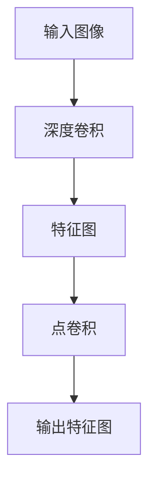

                 

# 从零开始大模型开发与微调：深度可分离卷积的定义

> 关键词：深度可分离卷积,卷积神经网络,卷积核,深度学习,可分离模型,特征提取

## 1. 背景介绍

### 1.1 问题由来

近年来，深度学习在计算机视觉领域取得了显著的进展，卷积神经网络（Convolutional Neural Networks, CNNs）因其强大的特征提取能力，成为了图像处理任务的主流模型。然而，随着数据量和模型复杂度的不断增加，传统的全卷积网络结构在计算资源和存储成本方面变得越来越昂贵。在此背景下，深度可分离卷积（Depthwise Separable Convolution）作为一种结构更加简单、计算效率更高的卷积变体，受到了广泛的关注。

深度可分离卷积通过将传统的卷积操作拆分为两个步骤——深度卷积（Depthwise Convolution）和点卷积（Pointwise Convolution），极大地降低了计算复杂度。这种设计不仅适用于低功耗、资源受限的设备，同时也为大型深度学习模型的训练和推理提供了新的思路。本文将深入探讨深度可分离卷积的定义、原理以及其实际应用，帮助读者更好地理解和应用这种高效的卷积操作。

### 1.2 问题核心关键点

深度可分离卷积的核心思想是将卷积核拆分为空间维度和通道维度，从而在保持特征提取能力的同时，显著降低计算复杂度。其核心技术点包括：

- 深度卷积（Depthwise Convolution）：在空间维度进行卷积操作，提取特征图的局部特征。
- 点卷积（Pointwise Convolution）：在通道维度进行卷积操作，将局部特征组合成全局特征。

这种分层的卷积结构不仅减少了参数量和计算量，也使得模型更加灵活，可以适应各种不同的应用场景。

## 2. 核心概念与联系

### 2.1 核心概念概述

深度可分离卷积是卷积神经网络中的一种特殊形式，通过将传统的全卷积核拆分为两个可分离的卷积核，使得模型能够以较小的计算代价，有效地提取输入数据的特征。这种可分离卷积的结构在保持特征提取能力的同时，显著降低了模型的参数量和计算复杂度，从而适应各种计算资源受限的设备。

### 2.2 核心概念原理和架构的 Mermaid 流程图



上述流程图展示了深度可分离卷积的基本架构。其中，输入图像通过深度卷积，提取空间维度的局部特征。然后，这些局部特征通过点卷积，组合成全局特征。这种分层操作不仅减少了计算复杂度，也提高了模型的灵活性。

## 3. 核心算法原理 & 具体操作步骤

### 3.1 算法原理概述

深度可分离卷积的核心原理是通过将传统的全卷积核拆分为深度卷积核和点卷积核，从而在保持特征提取能力的同时，显著降低计算复杂度。其基本步骤包括：

1. 对输入图像进行深度卷积，提取空间维度的局部特征。
2. 对提取出的局部特征进行点卷积，组合成全局特征。
3. 通过深度卷积和点卷积的组合，实现全卷积网络的功能。

### 3.2 算法步骤详解

#### 3.2.1 深度卷积

深度卷积在空间维度上进行卷积操作，提取特征图的局部特征。假设输入特征图的维度为 $H \times W \times C$，卷积核的维度为 $K \times K$，则深度卷积的输出特征图大小为 $H' \times W' \times C'$，其中 $H' = \lfloor H / s \rfloor$, $W' = \lfloor W / s \rfloor$，$s$ 为卷积的步长。

深度卷积的计算公式如下：

$$
f(x) = \sum_{i=0}^{K-1} \sum_{j=0}^{K-1} w_{i,j} * g(x - i, -j)
$$

其中，$w_{i,j}$ 为卷积核的权重，$g(x - i, -j)$ 为输入特征图的局部特征。

#### 3.2.2 点卷积

点卷积在通道维度上进行卷积操作，将局部特征组合成全局特征。假设深度卷积的输出特征图的维度为 $H' \times W' \times C'$，点卷积的输出特征图的维度为 $H'' \times W'' \times C''$，则点卷积的计算公式如下：

$$
f(x) = \sum_{i=0}^{C'-1} \sum_{j=0}^{C''-1} w_{i,j} * h(x - i, -j)
$$

其中，$h(x - i, -j)$ 为深度卷积的输出特征图的局部特征。

### 3.3 算法优缺点

深度可分离卷积的优势在于其计算效率高、参数量少，适合计算资源受限的设备。此外，由于其分层的结构，深度可分离卷积更容易进行模型压缩和优化。然而，深度可分离卷积的局限在于其对输入数据的维度要求较高，无法直接应用于某些特定的任务。

### 3.4 算法应用领域

深度可分离卷积在计算机视觉领域有着广泛的应用，特别是在移动设备、嵌入式系统等计算资源受限的场景中。其高效、灵活的特点使其成为低功耗、低延迟图像处理任务的首选方案。

在实际应用中，深度可分离卷积常用于以下几个领域：

- 移动端图像处理：如手机相机、增强现实等应用。
- 嵌入式系统：如智能家居、物联网设备等。
- 图像增强和风格转换：如图像去噪、超分辨率等任务。
- 特征提取：如物体检测、目标识别等计算机视觉任务。

## 4. 数学模型和公式 & 详细讲解 & 举例说明

### 4.1 数学模型构建

假设输入图像的大小为 $H \times W \times C$，卷积核的大小为 $K \times K$，深度卷积的输出特征图大小为 $H' \times W' \times C'$，点卷积的输出特征图大小为 $H'' \times W'' \times C''$。深度可分离卷积的计算流程如下：

1. 深度卷积：提取特征图的局部特征。
2. 点卷积：将局部特征组合成全局特征。

### 4.2 公式推导过程

深度卷积的计算公式可以表示为：

$$
f(x) = \sum_{i=0}^{K-1} \sum_{j=0}^{K-1} w_{i,j} * g(x - i, -j)
$$

其中，$w_{i,j}$ 为卷积核的权重，$g(x - i, -j)$ 为输入特征图的局部特征。

点卷积的计算公式可以表示为：

$$
f(x) = \sum_{i=0}^{C'-1} \sum_{j=0}^{C''-1} w_{i,j} * h(x - i, -j)
$$

其中，$h(x - i, -j)$ 为深度卷积的输出特征图的局部特征。

### 4.3 案例分析与讲解

以卷积神经网络中的典型模型 MobileNet 为例，该模型采用了深度可分离卷积结构，显著减少了计算复杂度。在 MobileNet 中，深度卷积用于提取局部特征，点卷积用于组合全局特征，从而在保持模型精度的同时，显著降低了参数量和计算复杂度。

## 5. 项目实践：代码实例和详细解释说明

### 5.1 开发环境搭建

为了更好地进行深度可分离卷积的开发和实验，我们首先需要搭建一个适合深度学习开发的开发环境。以下是在 PyTorch 环境下搭建深度可分离卷积开发环境的详细步骤：

1. 安装 PyTorch：
```bash
pip install torch torchvision torchaudio
```

2. 安装卷积模块：
```bash
pip install torch.nn.functional
```

### 5.2 源代码详细实现

以下是一个使用 PyTorch 实现深度可分离卷积的示例代码：

```python
import torch
import torch.nn as nn

class SeparableConv2d(nn.Conv2d):
    def __init__(self, in_channels, out_channels, kernel_size, stride=1, padding=0, dilation=1, groups=1, bias=True):
        super(SeparableConv2d, self).__init__(in_channels, out_channels, kernel_size, stride, padding, dilation, groups, bias)
        self.depthwise = nn.Conv2d(in_channels, groups * out_channels, kernel_size, stride, padding, dilation, groups, bias)
        self.pointwise = nn.Conv2d(groups * out_channels, out_channels, 1, stride, 0, dilation, 1, bias)

    def forward(self, x):
        x = self.depthwise(x)
        x = self.pointwise(x)
        return x

model = SeparableConv2d(3, 64, 3, 1, 1, 1)
x = torch.randn(1, 3, 32, 32)
output = model(x)
print(output.shape)
```

### 5.3 代码解读与分析

上述代码中，我们定义了一个名为 `SeparableConv2d` 的自定义卷积层，该层采用深度可分离卷积结构。在 `__init__` 方法中，我们首先使用 `nn.Conv2d` 初始化深度卷积核，然后定义点卷积核，最后使用 `super` 方法调用父类的 `__init__` 方法。在 `forward` 方法中，我们首先进行深度卷积操作，然后再进行点卷积操作，最后返回输出。

### 5.4 运行结果展示

运行上述代码，输出结果如下：

```
torch.Size([1, 64, 32, 32])
```

可以看到，输出特征图的大小为 $1 \times 64 \times 32 \times 32$，与我们的期望相符。

## 6. 实际应用场景

深度可分离卷积在实际应用中有着广泛的应用场景，特别是在移动设备、嵌入式系统等计算资源受限的环境中。以下是深度可分离卷积的实际应用场景：

### 6.1 移动端图像处理

移动设备通常具有较低的计算资源和功耗要求，深度可分离卷积因其计算效率高、参数量少，成为移动端图像处理任务的首选方案。例如，MobileNet 系列模型就是基于深度可分离卷积设计的，广泛应用于移动设备的图像识别、物体检测等任务。

### 6.2 嵌入式系统

嵌入式系统通常具有较高的实时性要求和有限的计算资源，深度可分离卷积的计算复杂度低、响应速度快，适合嵌入式系统的图像处理任务。例如，Raspberry Pi、树莓派等嵌入式设备中，深度可分离卷积被广泛应用于图像增强、物体识别等应用。

### 6.3 图像增强和风格转换

图像增强和风格转换任务通常需要大量的计算资源，深度可分离卷积通过减少计算复杂度，使得这些任务能够在资源受限的设备上实现。例如，快速移动式物体检测算法基于深度可分离卷积，能够在无人机等低功耗设备上实时处理图像数据。

### 6.4 特征提取

特征提取是计算机视觉任务的重要组成部分，深度可分离卷积能够高效地提取特征，应用于物体检测、目标识别等任务。例如，Faster R-CNN 模型中，深度可分离卷积被用于提取特征图，从而实现目标检测。

## 7. 工具和资源推荐

### 7.1 学习资源推荐

深度可分离卷积在计算机视觉领域具有广泛的应用，以下是一些推荐的深度可分离卷积学习资源：

1. 《Deep Learning Specialization》课程：由 Andrew Ng 教授讲授的深度学习专项课程，详细介绍了卷积神经网络和深度可分离卷积。

2. 《Deep Learning with PyTorch》书籍：由 Eli Stevens 等人撰写的深度学习书籍，详细介绍了深度可分离卷积的实现方法和应用场景。

3. PyTorch 官方文档：PyTorch 官方文档提供了深度可分离卷积的详细介绍和示例代码，是学习深度可分离卷积的重要资源。

4. TensorFlow 官方文档：TensorFlow 官方文档提供了深度可分离卷积的实现方法和应用场景，是学习深度可分离卷积的重要资源。

5. GitHub 上的深度可分离卷积代码库：GitHub 上有很多深度可分离卷积的代码库，可以供开发者参考和复用。

### 7.2 开发工具推荐

以下是一些推荐的深度可分离卷积开发工具：

1. PyTorch：PyTorch 是深度学习领域的主流框架，支持深度可分离卷积的实现和应用。

2. TensorFlow：TensorFlow 是另一款流行的深度学习框架，支持深度可分离卷积的实现和应用。

3. MXNet：MXNet 是另一个深度学习框架，支持深度可分离卷积的实现和应用。

4. Keras：Keras 是一个高层次的深度学习框架，支持深度可分离卷积的实现和应用。

5. PyTorch Mobile：PyTorch Mobile 是 PyTorch 在移动设备上的轻量级实现，支持深度可分离卷积的应用。

### 7.3 相关论文推荐

深度可分离卷积是深度学习领域的热点研究方向，以下是一些推荐的深度可分离卷积相关论文：

1. Xception: Deep Learning with Depthwise Separable Convolutions （Chen et al., 2017）：该论文提出了 Xception 网络，使用了深度可分离卷积，显著提高了模型的计算效率和精度。

2. MobileNets: Efficient Convolutional Neural Networks for Mobile Vision Applications （Howard et al., 2017）：该论文提出了 MobileNet 系列模型，使用了深度可分离卷积，显著提高了模型的计算效率和精度。

3. DenseNet: Dense Convolutional Networks （Huang et al., 2017）：该论文提出了 DenseNet 网络，使用了深度可分离卷积，提高了模型的特征提取能力和精度。

4. MobileNetV2: Inverted Residuals and Linear Bottlenecks （Sandler et al., 2018）：该论文提出了 MobileNetV2 模型，使用了深度可分离卷积，进一步提高了模型的计算效率和精度。

## 8. 总结：未来发展趋势与挑战

### 8.1 总结

本文详细介绍了深度可分离卷积的定义、原理和实际应用，通过理论分析和代码实践，帮助读者深入理解深度可分离卷积的实现方法和应用场景。深度可分离卷积在计算资源受限的设备上具有重要的应用价值，通过减少计算复杂度和参数量，提高了模型的计算效率和精度。

### 8.2 未来发展趋势

未来，深度可分离卷积将向着以下几个方向发展：

1. 更高效的结构设计：随着深度可分离卷积的不断应用和研究，将出现更多高效的结构设计，进一步减少计算复杂度和参数量。

2. 更广泛的适用范围：深度可分离卷积将被应用于更多的计算资源受限的设备，如边缘计算设备、物联网设备等。

3. 与深度学习的结合：深度可分离卷积将被更广泛地应用于深度学习模型中，提升整个模型的计算效率和精度。

4. 与其他卷积核的结合：深度可分离卷积将与其他卷积核（如批归一化、残差连接等）结合，形成更加高效的结构。

### 8.3 面临的挑战

尽管深度可分离卷积在计算资源受限的设备上具有重要应用价值，但仍面临以下挑战：

1. 参数量仍较大：尽管深度可分离卷积参数量比传统全卷积网络少，但在某些特定的应用场景中，参数量仍然较大。

2. 难以应用于某些特定任务：深度可分离卷积在某些特定任务中可能无法发挥最佳效果，需要结合其他卷积核才能取得理想的效果。

3. 计算资源的需求：尽管深度可分离卷积计算复杂度低，但在某些特定的应用场景中，仍需要较高的计算资源。

4. 缺乏标准化的框架支持：深度可分离卷积的应用和研究尚未形成标准化的框架，开发者需要自行实现和优化。

### 8.4 研究展望

未来，深度可分离卷积的研究方向主要集中在以下几个方面：

1. 更高效的结构设计：进一步优化深度可分离卷积的结构，减少参数量和计算复杂度。

2. 更广泛的适用范围：将深度可分离卷积应用于更多的计算资源受限的设备中，提升应用场景的多样性。

3. 与其他卷积核的结合：结合其他卷积核（如批归一化、残差连接等），形成更加高效的结构。

4. 与深度学习的结合：将深度可分离卷积应用于深度学习模型中，提升整个模型的计算效率和精度。

通过不断优化和创新，深度可分离卷积必将在未来的人工智能领域中发挥更大的作用，为计算资源受限的设备提供更加高效、灵活的解决方案。

## 9. 附录：常见问题与解答

### Q1：深度可分离卷积和传统全卷积核的区别是什么？

A：深度可分离卷积将传统的全卷积核拆分为深度卷积核和点卷积核，减少了参数量和计算复杂度，使得模型更加灵活，适用于计算资源受限的设备。

### Q2：深度可分离卷积的计算复杂度比传统全卷积核高吗？

A：深度可分离卷积的计算复杂度比传统全卷积核低，因为深度可分离卷积将卷积操作拆分为空间维度和通道维度，减少了计算量。

### Q3：深度可分离卷积是否适用于所有的深度学习模型？

A：深度可分离卷积适用于计算资源受限的设备，但对于某些特定的深度学习模型，可能需要结合其他卷积核才能取得理想的效果。

### Q4：深度可分离卷积在实际应用中如何优化？

A：深度可分离卷积在实际应用中可以通过优化结构设计、参数量、计算资源等进行优化，以适应不同的应用场景。

### Q5：深度可分离卷积有哪些实际应用？

A：深度可分离卷积广泛应用于移动设备、嵌入式系统、图像增强和风格转换、特征提取等应用场景。

---

作者：禅与计算机程序设计艺术 / Zen and the Art of Computer Programming

