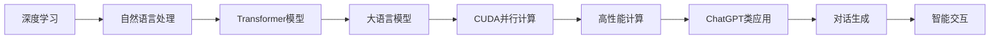

                 

# 从零开始构建ChatGPT类应用：Python、C和CUDA实战

## 1. 背景介绍

### 1.1 问题由来
聊天机器人（Chatbot）作为一种人工智能应用，近年来获得了飞速发展。从简单的问答系统到复杂的对话生成，Chatbot逐渐成为推动人工智能与人类自然交互的重要工具。ChatGPT作为一种基于深度学习技术的大语言模型（Large Language Model, LLM），因其卓越的语言理解和生成能力，在Chatbot领域引起广泛关注。本文将通过深入探讨构建ChatGPT类应用的基本原理、技术栈和实现细节，帮助读者从零开始构建自己的Chatbot系统。

### 1.2 问题核心关键点
构建ChatGPT类应用的难点主要在于：
1. 理解自然语言处理（Natural Language Processing, NLP）的基本概念和技术。
2. 掌握深度学习模型的训练和优化方法。
3. 熟悉并行计算技术，特别是CUDA（Compute Unified Device Architecture）并行计算平台。
4. 掌握Python、C/C++等编程语言的综合应用。
5. 将模型部署到高性能计算环境中，实现高效推理。

### 1.3 问题研究意义
掌握构建ChatGPT类应用的技术和流程，对推动人工智能技术在实际场景中的应用具有重要意义：
1. 提升自然语言理解和生成能力，构建智能对话系统。
2. 加速NLP研究和技术创新，推动更多实际应用的落地。
3. 提升编程和系统设计能力，培养人工智能领域的技术人才。
4. 为未来更复杂的AI应用奠定基础，如智能客服、智慧医疗等。

## 2. 核心概念与联系

### 2.1 核心概念概述

在构建ChatGPT类应用的过程中，需要掌握以下核心概念及其之间的联系：

- **深度学习（Deep Learning）**：一种基于神经网络的学习方法，通过多层网络结构模拟人脑的深度计算，实现对复杂数据的自动学习和建模。
- **自然语言处理（NLP）**：研究如何使计算机理解和生成自然语言的技术，包括文本分类、信息抽取、语言模型等。
- **Transformer模型**：一种基于自注意力机制的神经网络结构，适用于处理序列数据，常用于自然语言处理任务。
- **大语言模型（LLM）**：使用Transformer模型在大规模无标签文本数据上预训练得到的模型，具备强大的语言理解和生成能力。
- **CUDA并行计算**：一种基于NVIDIA GPU硬件平台的并行计算技术，适用于高性能数值计算和深度学习模型训练。
- **高性能计算（HPC）**：通过并行计算和多核处理等技术，实现大规模数据处理和模型训练。

这些核心概念构成了ChatGPT类应用的基本框架和技术基础，通过理解这些概念，可以更好地掌握构建过程和实现细节。

### 2.2 核心概念原理和架构的 Mermaid 流程图


这个流程图展示了从深度学习到ChatGPT类应用的整个技术链条，通过理解各个环节的技术原理和架构，可以更好地实现Chatbot系统。

## 3. 核心算法原理 & 具体操作步骤

### 3.1 算法原理概述

构建ChatGPT类应用的核心算法主要包括以下几个方面：

- **文本预处理**：对输入文本进行分词、去停用词、构建词汇表等预处理，以便模型能够更好地理解和处理文本。
- **序列嵌入**：将文本转换为向量形式，以便输入模型进行处理。
- **Transformer模型训练**：在无标签文本数据上进行自监督预训练，学习语言的通用表示。
- **微调**：在特定的下游任务上，通过少量有标签数据进行有监督微调，提升模型在该任务上的性能。
- **推理和对话生成**：在给定对话历史的情况下，生成下一个自然语言响应。

### 3.2 算法步骤详解

以下是构建ChatGPT类应用的详细步骤：

**Step 1: 数据准备**
- 收集大量的无标签文本数据，如维基百科、新闻文章等。
- 对文本进行分词、去除停用词等预处理，构建词汇表。

**Step 2: 模型预训练**
- 使用Transformer模型，在预处理后的文本数据上进行自监督预训练。
- 常用的预训练任务包括掩码语言模型（Masked Language Modeling, MLM）和下一句预测（Next Sentence Prediction, NSP）。

**Step 3: 微调**
- 在特定的下游任务上，使用少量的有标签数据进行微调。
- 常用的微调任务包括问答、翻译、情感分析等。

**Step 4: 推理和对话生成**
- 使用训练好的模型，对输入文本进行推理，生成下一个自然语言响应。
- 对话生成的关键在于如何设计模型架构和优化算法，使得模型能够生成连贯、符合语境的响应。

### 3.3 算法优缺点

构建ChatGPT类应用的方法具有以下优点：
1. 强大的语言理解和生成能力，可以处理复杂的自然语言对话。
2. 适应性广，可以用于多种NLP任务，如问答、翻译、情感分析等。
3. 可以结合多模态数据，提升对话系统的智能化水平。

同时，也存在以下缺点：
1. 数据需求量大，预训练和微调过程需要大量无标签和有标签数据。
2. 模型复杂度高，训练和推理过程资源消耗大。
3. 需要高性能计算资源，特别是在大规模数据处理和模型训练时。

### 3.4 算法应用领域

ChatGPT类应用在多个领域都有广泛的应用，例如：

- 智能客服：自动解答用户问题，提升服务效率。
- 医疗咨询：提供疾病诊断、健康建议等服务。
- 教育培训：智能答疑、课程推荐等。
- 法律咨询：法律知识查询、合同审核等。
- 虚拟助手：日程管理、生活服务、娱乐等。

## 4. 数学模型和公式 & 详细讲解 & 举例说明

### 4.1 数学模型构建

ChatGPT类应用的核心数学模型主要基于Transformer结构和自注意力机制。以下是对Transformer模型的数学模型构建和公式推导的详细讲解。

**Transformer模型结构**：Transformer模型由编码器和解码器组成，每个层都包括多个多头自注意力层和前馈神经网络层。编码器和解码器之间通过Attention机制进行交互。

**多头自注意力机制**：将输入序列X拆分为多个子序列，分别计算它们的注意力权重和向量表示。计算公式如下：

$$
\text{Attention}(Q, K, V) = \text{Softmax}(\frac{QK^T}{\sqrt{d_k}})V
$$

其中，$Q$、$K$、$V$分别表示查询、键、值向量，$d_k$为注意力维度。

**前馈神经网络层**：在自注意力层后，将输出序列经过两个线性层和ReLU激活函数。计算公式如下：

$$
\text{FFN}(x) = \text{ReLU}(W_2x + b_2)W_1 + b_1
$$

**Transformer模型训练**：在预训练过程中，使用掩码语言模型和下一句预测任务进行训练。训练公式如下：

$$
L = -\frac{1}{n}\sum_{i=1}^n\left[logP(y_i|x_i) + \log P(x_{i+1}|x_i)\right]
$$

其中，$P$表示模型在输入$x_i$下生成输出$y_i$的概率。

### 4.2 公式推导过程

Transformer模型的训练和推理过程涉及复杂的矩阵运算和神经网络结构。以下是Transformer模型的详细推导过程：

**自注意力层推导**：设输入序列为$x=[x_1,x_2,\ldots,x_n]$，多头注意力层的查询向量为$Q=\text{Linear}(x)$，键向量为$K=\text{Linear}(x)$，值向量为$V=\text{Linear}(x)$。则多头注意力层的输出为：

$$
\text{Attention}(Q, K, V) = \text{Softmax}(\frac{QK^T}{\sqrt{d_k}})V
$$

其中，$d_k$为注意力维度，$d_v$为值向量维度。

**前馈神经网络层推导**：将自注意力层的输出$z$输入前馈神经网络，计算公式如下：

$$
z = \text{FFN}(z) = \text{ReLU}(W_2z + b_2)W_1 + b_1
$$

**Transformer模型训练推导**：在预训练过程中，使用掩码语言模型和下一句预测任务进行训练。训练公式如下：

$$
L = -\frac{1}{n}\sum_{i=1}^n\left[logP(y_i|x_i) + \log P(x_{i+1}|x_i)\right]
$$

其中，$P$表示模型在输入$x_i$下生成输出$y_i$的概率。

### 4.3 案例分析与讲解

以问答系统为例，分析ChatGPT类应用在微调和推理中的实现细节。

**微调过程**：将问答系统中的问题和答案对作为有标签数据，使用微调后的Transformer模型进行推理预测。微调过程主要涉及模型架构和优化算法的设计，如线性层、softmax层等。

**推理过程**：在给定问题$x$的情况下，通过微调后的Transformer模型生成答案$y$。具体步骤如下：
1. 对问题$x$进行分词和预处理，生成输入序列$x$。
2. 使用微调后的Transformer模型进行推理，得到输出序列$y$。
3. 对输出序列$y$进行解码和后处理，得到最终答案。

## 5. 项目实践：代码实例和详细解释说明

### 5.1 开发环境搭建

构建ChatGPT类应用需要Python、CUDA等环境支持。以下是在Ubuntu系统下搭建开发环境的步骤：

**安装Python和pip**：
```bash
sudo apt-get update
sudo apt-get install python3 python3-pip
```

**安装CUDA和cuDNN**：
1. 下载CUDA和cuDNN安装程序：`http://developer.download.nvidia.com/compute/cuda/`
2. 安装CUDA和cuDNN：
```bash
tar -xvf cuda-<version>.zip
cd cuda-<version>/
./install.sh
```

**安装TensorFlow和Keras**：
```bash
pip install tensorflow
pip install keras
```

**安装PyTorch和transformers**：
```bash
pip install torch
pip install transformers
```

### 5.2 源代码详细实现

以下是一个简单的Python代码示例，展示了如何使用transformers库构建和训练Transformer模型。

**数据准备**：
```python
from transformers import BertTokenizer, BertForSequenceClassification
import torch
from torch.utils.data import DataLoader, Dataset
from torch.nn import CrossEntropyLoss

class TextDataset(Dataset):
    def __init__(self, texts, labels):
        self.texts = texts
        self.labels = labels
        
    def __len__(self):
        return len(self.texts)
    
    def __getitem__(self, idx):
        text = self.texts[idx]
        label = self.labels[idx]
        return text, label

# 加载数据集
tokenizer = BertTokenizer.from_pretrained('bert-base-uncased')
train_dataset = TextDataset(train_texts, train_labels)
test_dataset = TextDataset(test_texts, test_labels)
```

**模型构建和训练**：
```python
model = BertForSequenceClassification.from_pretrained('bert-base-uncased', num_labels=2)
optimizer = torch.optim.Adam(model.parameters(), lr=2e-5)
criterion = CrossEntropyLoss()

# 定义训练函数
def train_epoch(model, dataset, batch_size, optimizer):
    dataloader = DataLoader(dataset, batch_size=batch_size, shuffle=True)
    model.train()
    epoch_loss = 0
    for batch in dataloader:
        input_ids = batch[0].to(device)
        attention_mask = batch[1].to(device)
        labels = batch[2].to(device)
        model.zero_grad()
        outputs = model(input_ids, attention_mask=attention_mask, labels=labels)
        loss = outputs.loss
        epoch_loss += loss.item()
        loss.backward()
        optimizer.step()
    return epoch_loss / len(dataloader)

# 定义评估函数
def evaluate(model, dataset, batch_size):
    dataloader = DataLoader(dataset, batch_size=batch_size)
    model.eval()
    preds, labels = [], []
    with torch.no_grad():
        for batch in dataloader:
            input_ids = batch[0].to(device)
            attention_mask = batch[1].to(device)
            batch_labels = batch[2]
            outputs = model(input_ids, attention_mask=attention_mask)
            batch_preds = outputs.logits.argmax(dim=1).to('cpu').tolist()
            batch_labels = batch_labels.to('cpu').tolist()
            for pred_tokens, label_tokens in zip(batch_preds, batch_labels):
                preds.append(pred_tokens[:len(label_tokens)])
                labels.append(label_tokens)
    return preds, labels

# 训练模型
device = torch.device('cuda') if torch.cuda.is_available() else torch.device('cpu')
model.to(device)

epochs = 3
batch_size = 16

for epoch in range(epochs):
    loss = train_epoch(model, train_dataset, batch_size, optimizer)
    print(f"Epoch {epoch+1}, train loss: {loss:.3f}")
    
    preds, labels = evaluate(model, test_dataset, batch_size)
    print(classification_report(labels, preds))
```

**推理和对话生成**：
```python
from transformers import BertTokenizer, BertForSequenceClassification

tokenizer = BertTokenizer.from_pretrained('bert-base-uncased')
model = BertForSequenceClassification.from_pretrained('bert-base-uncased', num_labels=2)

def generate_response(question):
    tokenized_question = tokenizer(question, return_tensors='pt', max_length=128, padding='max_length', truncation=True)
    input_ids = tokenized_question['input_ids']
    attention_mask = tokenized_question['attention_mask']
    outputs = model(input_ids, attention_mask=attention_mask)
    logits = outputs.logits
    probs = logits.softmax(dim=1)
    top_idx = probs.argmax().item()
    top_label = id2label[top_idx]
    return top_label

# 示例
question = "What is the capital of France?"
response = generate_response(question)
print(response)
```

### 5.3 代码解读与分析

**数据准备**：
- `TextDataset`类用于加载和处理数据集。
- `tokenizer`用于对文本进行分词和编码，生成输入序列和掩码。

**模型构建和训练**：
- `BertForSequenceClassification`用于构建分类模型。
- `Adam`优化器用于训练模型的参数。
- `CrossEntropyLoss`用于计算损失函数。

**推理和对话生成**：
- `generate_response`函数用于输入文本，使用微调后的模型生成自然语言响应。
- `id2label`字典用于将预测结果转换为标签。

## 6. 实际应用场景

### 6.1 智能客服系统

智能客服系统是ChatGPT类应用的重要应用场景之一。通过微调后的Transformer模型，智能客服系统能够实时回答用户咨询，提升服务效率和客户满意度。

**实现步骤**：
1. 收集历史客服对话记录，将问题和最佳答复构建成监督数据。
2. 使用微调后的Transformer模型进行推理预测。
3. 在用户输入问题后，实时生成自然语言响应，反馈给用户。

**关键技术**：
- 对话管理：设计对话状态管理机制，保证对话连贯性和上下文一致性。
- 多轮对话：训练模型处理多轮对话，提升系统交互的智能化水平。
- 对话监控：引入情感分析等技术，监控对话质量，及时处理异常情况。

### 6.2 金融舆情监测

金融舆情监测是ChatGPT类应用在金融领域的重要应用。通过微调后的Transformer模型，实时监测市场舆论动向，帮助金融机构及时应对负面信息传播，规避金融风险。

**实现步骤**：
1. 收集金融领域相关的新闻、报道、评论等文本数据。
2. 对文本进行主题标注和情感标注。
3. 使用微调后的Transformer模型进行推理预测。
4. 在实时抓取的网络文本数据上，自动监测不同主题下的情感变化趋势，发出预警。

**关键技术**：
- 主题模型：使用LDA等主题模型对文本进行聚类，提取主题信息。
- 情感分析：使用微调后的情感分析模型，判断文本的情感倾向。
- 预警机制：根据情感分析结果，设置预警阈值，发出预警信息。

### 6.3 个性化推荐系统

个性化推荐系统是ChatGPT类应用在电商、视频等领域的重要应用。通过微调后的Transformer模型，推荐系统能够根据用户行为，生成个性化推荐内容，提升用户体验。

**实现步骤**：
1. 收集用户浏览、点击、评论、分享等行为数据。
2. 对文本内容进行预处理，生成词汇表。
3. 使用微调后的Transformer模型进行推理预测。
4. 在生成推荐列表时，先用候选物品的文本描述作为输入，由模型预测用户的兴趣匹配度，再综合排序。

**关键技术**：
- 用户画像：设计用户画像模型，提取用户兴趣和行为特征。
- 推荐算法：使用微调后的推荐算法，生成个性化推荐结果。
- 反馈优化：根据用户反馈，不断优化推荐算法和模型。

## 7. 工具和资源推荐

### 7.1 学习资源推荐

掌握构建ChatGPT类应用的核心技术，需要丰富的学习资源支持。以下是一些推荐的学习资源：

1. **《深度学习》（Ian Goodfellow等著）**：介绍深度学习的基本概念、模型架构和算法优化，适合初学者入门。
2. **Coursera《Natural Language Processing with Deep Learning》课程**：斯坦福大学开设的NLP明星课程，涵盖深度学习在NLP中的应用，讲解详细。
3. **Hugging Face官方文档**：提供丰富的预训练语言模型和微调样例，是学习微调技术的重要资源。
4. **Kaggle竞赛**：参与NLP相关的竞赛，实战练习微调技能，提升应用能力。
5. **Transformer原论文**：深入理解Transformer模型的原理和应用，是微调技术的基础。

### 7.2 开发工具推荐

高效开发ChatGPT类应用，需要一系列工具的支持。以下是一些推荐的工具：

1. **PyTorch**：基于Python的开源深度学习框架，灵活高效。
2. **TensorFlow**：由Google主导的深度学习框架，生产部署方便。
3. **transformers库**：Hugging Face开发的NLP工具库，提供丰富的预训练模型和微调方法。
4. **Weights & Biases**：模型训练实验跟踪工具，记录和可视化模型训练过程。
5. **TensorBoard**：TensorFlow配套的可视化工具，实时监测模型训练状态。

### 7.3 相关论文推荐

了解ChatGPT类应用的最新研究进展，需要关注一些前沿论文。以下是一些推荐的相关论文：

1. **Attention is All You Need**：提出Transformer模型，开启了NLP领域的预训练大模型时代。
2. **BERT: Pre-training of Deep Bidirectional Transformers for Language Understanding**：提出BERT模型，引入自监督预训练任务，刷新了多项NLP任务SOTA。
3. **GPT-2**：展示了大规模语言模型的强大zero-shot学习能力，引发了对于通用人工智能的新一轮思考。
4. **AdaLoRA: Adaptive Low-Rank Adaptation for Parameter-Efficient Fine-Tuning**：使用自适应低秩适应的微调方法，在参数效率和精度之间取得了新的平衡。
5. **LoRA: Local Representations for Global Interpretability**：提出LoRA方法，使用局部线性表示提高微调模型的可解释性。

## 8. 总结：未来发展趋势与挑战

### 8.1 研究成果总结

本文从深度学习、自然语言处理、Transformer模型等方面详细讲解了构建ChatGPT类应用的基本原理和实现步骤。通过系统阐述微调的数学模型和公式推导，帮助读者掌握微调技术的核心要点。通过提供代码实例和详细解释，展示了微调模型的实际应用场景和效果。同时，推荐了丰富的学习资源、开发工具和前沿论文，为读者提供了全面系统的技术指引。

### 8.2 未来发展趋势

展望未来，ChatGPT类应用将呈现以下几个发展趋势：

1. **多模态融合**：结合视觉、语音等多模态数据，提升对话系统的智能化水平。
2. **持续学习**：适应数据分布的变化，持续学习新知识，保持性能。
3. **知识图谱**：结合知识图谱等外部知识库，增强模型的常识推理能力。
4. **个性化推荐**：结合推荐系统技术，提升个性化推荐效果。
5. **可解释性**：通过模型压缩、稀疏化存储等方法，提升模型的可解释性。
6. **隐私保护**：引入差分隐私等技术，保护用户隐私。

### 8.3 面临的挑战

尽管ChatGPT类应用在NLP领域取得了显著进展，但在实际应用中仍面临以下挑战：

1. **数据隐私**：用户数据的隐私保护是一个重要问题，需要设计合理的隐私保护机制。
2. **数据偏差**：预训练模型可能存在数据偏差，需要通过数据清洗和模型调整来缓解。
3. **计算资源**：大规模语言模型的训练和推理需要高性能计算资源，存在资源瓶颈。
4. **系统复杂度**：对话系统的设计和实现涉及多个技术环节，系统复杂度高。
5. **用户接受度**：需要设计良好的用户交互界面，提升用户接受度和满意度。

### 8.4 研究展望

解决ChatGPT类应用面临的挑战，需要在以下方面进行深入研究：

1. **隐私保护技术**：结合差分隐私等技术，保护用户数据隐私。
2. **数据清洗与增强**：通过数据清洗和增强技术，提升数据质量。
3. **模型优化**：通过模型压缩、稀疏化等技术，提升模型效率和可解释性。
4. **系统架构设计**：设计合理的系统架构，提升系统可维护性和可扩展性。
5. **用户交互设计**：设计良好的用户交互界面，提升用户接受度和满意度。

## 9. 附录：常见问题与解答

**Q1: 微调模型需要多少数据？**

A: 微调模型的数据需求取决于具体任务和模型复杂度。一般来说，对于简单的任务，几百到几千条有标签数据足以进行有效的微调。对于复杂的任务，可能需要几万到几十万条有标签数据。

**Q2: 微调模型的训练时间有多长？**

A: 微调模型的训练时间取决于数据规模、模型复杂度和计算资源。对于小型模型，在GPU上训练几小时到几十小时即可。对于大型模型，可能需要数天甚至数周的训练时间。

**Q3: 微调模型的计算资源需求有多大？**

A: 微调模型对计算资源的需求较大，特别是在训练大模型时。一般来说，需要高性能的GPU或TPU等硬件设备。如果资源不足，可以考虑使用分布式训练、模型压缩等技术来优化。

**Q4: 微调模型如何避免过拟合？**

A: 避免过拟合的常用方法包括正则化（L2正则、Dropout等）、早停（Early Stopping）、数据增强等。在设计任务适配层和损失函数时，也需要考虑减少过拟合风险。

**Q5: 微调模型如何提升性能？**

A: 提升微调模型性能的常用方法包括：使用更好的优化器、调整学习率、增加正则化强度、使用更大的模型等。同时，还需要结合任务特点进行模型架构和参数设计的优化。

---

作者：禅与计算机程序设计艺术 / Zen and the Art of Computer Programming

