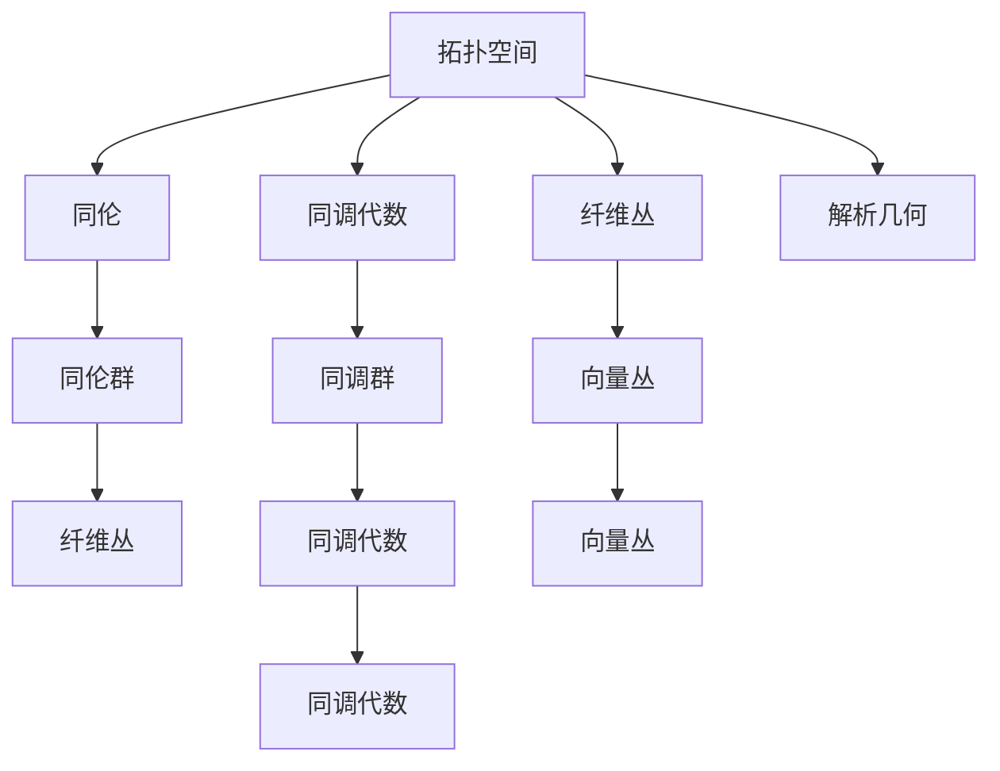

                 

# 代数拓扑与微分几何的交集

> 关键词：代数拓扑,微分几何,同伦,纤维丛,解析几何

## 1. 背景介绍

### 1.1 问题由来

现代数学中，代数拓扑和微分几何是两个重要的分支。代数拓扑主要研究由代数方法处理的空间的连续性和拓扑结构；微分几何则从微分角度研究空间曲面、流形等几何结构的性质。这两个分支在数学研究中长期独立发展，但近年来随着应用场景的扩展，学科之间的交叉融合逐渐显现。

几何流形常常被看作是空间曲面，从拓扑角度看则是一个覆盖整个空间集合的局部坐标系。而微分几何则研究这些局部坐标系之间的微分结构，进而探索空间几何结构的深层次性质。而代数拓扑学的主要研究对象也是这些局部坐标系之间的拓扑结构。

此外，代数拓扑与微分几何的研究对象往往为连续性很强的空间结构，例如微分流形、纤维丛等，都同时具备拓扑和几何双重属性。因此，代数拓扑和微分几何的研究方法具有一定的相似性，都依赖于对局部坐标系和全局结构的连续性和光滑性研究。

### 1.2 问题核心关键点

1. 空间连续性：研究空间曲面的局部和全局性质，以及如何由局部信息推断全局信息。
2. 几何量计算：研究如何通过几何对象之间相互联系的函数关系，求取几何量，如曲率、截面等。
3. 拓扑分类：研究空间几何对象在拓扑变换下的不变性，进而对几何对象进行分类。
4. 同伦理论：研究拓扑空间的连续映射关系，特别是同伦群、纤维丛等概念。
5. 代数工具：研究利用代数工具处理拓扑结构，如同调代数、代数群等。

## 2. 核心概念与联系

### 2.1 核心概念概述

本节将介绍代数拓扑和微分几何中的核心概念，并说明它们之间的联系。

- 拓扑空间：研究空间结构连续性的一个基本概念，指的是在一定拓扑结构下，所有的连续函数映射关系被保留的空间。
- 同伦：描述拓扑空间连续映射的两个等价概念，通过同伦群研究连续映射的性质。
- 纤维丛：研究空间几何结构的一个高级概念，包含向量丛、主丛等，其研究的是空间中连续性几何量的全局性质。
- 同调代数：研究拓扑空间的同调群及其性质，主要通过组合代数方法处理拓扑结构。
- 解析几何：研究几何对象之间的函数关系，通过坐标和导数研究几何量计算。

代数拓扑和微分几何中的一些核心概念在定义上有一定的差异，但他们的研究对象都是连续的几何结构，都依赖于局部坐标系的连续性和光滑性，因此两者在研究方法上存在诸多联系。

### 2.2 核心概念原理和架构的 Mermaid 流程图



通过此图，我们可以直观地看出代数拓扑和微分几何中核心概念之间的联系。例如，同调群和同伦群都是描述拓扑空间连续映射性质的工具；解析几何则是计算几何量的一种重要方法；向量丛和纤维丛则都是研究空间几何结构的重要对象。

## 3. 核心算法原理 & 具体操作步骤

### 3.1 算法原理概述

代数拓扑和微分几何的交集主要体现在同伦、纤维丛等概念中，下面我们将重点介绍这两个概念的算法原理。

#### 3.1.1 同伦理论

同伦理论是描述拓扑空间连续映射关系的重要工具，其主要研究同伦群及其性质。同伦群通过对拓扑空间的连续映射进行抽象，研究其在不同拓扑变换下的性质。

同伦群描述了连续映射在拓扑空间中的连续映射关系，代数拓扑中常用到群论的知识，因此同伦理论也与代数拓扑密切相关。

#### 3.1.2 纤维丛

纤维丛理论是研究空间几何结构的重要概念，主要研究连续性几何量的全局性质。向量丛是纤维丛的一个基本形式，其主要研究几何量在局部坐标系下的表示，通过局部坐标系之间的连续性关系，推断全局几何量。

纤维丛理论在微分几何中得到了广泛应用，其研究方法包括微分几何、泛函分析等。

### 3.2 算法步骤详解

#### 3.2.1 同伦理论

1. **拓扑空间定义**：选择拓扑空间 $X$，确定其拓扑结构。拓扑结构通常是由局部坐标系和连续性关系定义的。
2. **同伦定义**：在拓扑空间 $X$ 上定义两个连续映射 $f$ 和 $g$，如果存在一个连续映射 $h$ 使得 $f \circ h = g \circ h$，则称 $f$ 和 $g$ 同伦。
3. **同伦群定义**：定义同伦关系的同伦群 $\pi_1(X)$，其元素为拓扑空间 $X$ 上的同伦关系。
4. **同伦群性质**：研究同伦群的性质，包括同伦群的封闭性、同伦群群的性质等。

#### 3.2.2 纤维丛

1. **向量丛定义**：定义向量丛 $E$ 为局部坐标系到局部坐标系之间的光滑映射，使其满足局部坐标系之间的光滑映射关系。
2. **向量丛性质**：研究向量丛的性质，包括向量丛的光滑性、全局坐标系的表示等。
3. **纤维丛定义**：定义纤维丛 $P$ 为向量丛的一种特殊形式，其满足一定的连续性关系。
4. **纤维丛性质**：研究纤维丛的性质，包括纤维丛的连续性、光滑性、全局坐标系的表示等。

### 3.3 算法优缺点

#### 3.3.1 同伦理论

**优点**：

- 通过同伦群研究拓扑空间的连续映射关系，能够抽象描述拓扑空间的基本性质。
- 同伦群为拓扑空间提供了一种几何量化的描述方式，便于进行拓扑分类。

**缺点**：

- 同伦理论较为抽象，计算复杂度较高，难以直接应用。
- 同伦理论更多依赖于理论分析，实际应用场景较少。

#### 3.3.2 纤维丛

**优点**：

- 纤维丛研究空间几何量的全局性质，提供了研究几何结构的重要工具。
- 纤维丛能够处理复杂的几何结构，例如黎曼流形、空间曲线等。

**缺点**：

- 纤维丛理论较为复杂，计算难度较大。
- 纤维丛理论更多依赖于几何和拓扑分析，难以直接应用。

### 3.4 算法应用领域

#### 3.4.1 同伦理论

1. **拓扑空间分类**：通过研究同伦群，对拓扑空间进行分类。
2. **同伦群的计算**：研究同伦群的性质和计算方法，用于解决实际问题。
3. **同伦群的几何应用**：将同伦群的理论应用到几何领域，例如研究流形的同伦群性质。

#### 3.4.2 纤维丛

1. **几何流形研究**：通过研究向量丛和纤维丛，研究几何流形的性质。
2. **空间几何结构分析**：研究纤维丛的性质，分析空间几何结构的连续性。
3. **几何量计算**：通过纤维丛的性质，计算几何量，例如研究流形的截面曲率。

## 4. 数学模型和公式 & 详细讲解

### 4.1 数学模型构建

代数拓扑和微分几何的核心模型主要涉及拓扑空间、同伦群、向量丛等概念，以下是数学模型的构建：

1. **拓扑空间 $X$**：拓扑空间是研究空间连续性的基本概念，定义为满足一定拓扑结构的集合。
2. **同伦群 $\pi_1(X)$**：定义同伦群为拓扑空间 $X$ 上的同伦关系，同伦群的元素为拓扑空间中的连续映射。
3. **向量丛 $E$**：定义向量丛为局部坐标系到局部坐标系之间的光滑映射，其满足一定的连续性关系。
4. **纤维丛 $P$**：定义纤维丛为向量丛的一种特殊形式，其满足一定的连续性关系。

### 4.2 公式推导过程

#### 4.2.1 同伦群公式

设拓扑空间 $X$ 上的同伦群为 $\pi_1(X)$，则其定义为满足以下条件的群：

- 同伦群 $\pi_1(X)$ 包含所有同伦于单位映射 $e:X \rightarrow X$ 的连续映射。
- 同伦群 $\pi_1(X)$ 满足群运算的定义，即同伦关系满足群运算的定义。

同伦群的性质包括：

- 同伦群 $\pi_1(X)$ 为Abel群，满足交换律。
- 同伦群 $\pi_1(X)$ 的封闭性，即同伦关系在群运算下封闭。

同伦群的一个重要性质是同伦群群的性质，同伦群群的元素为同伦群 $G$ 的同态映射，满足同伦群群的定义。

#### 4.2.2 向量丛公式

设向量丛 $E$ 为局部坐标系 $U_i$ 到局部坐标系 $U_j$ 之间的光滑映射，其满足以下条件：

- 向量丛 $E$ 在局部坐标系 $U_i$ 和 $U_j$ 上具有连续性，即 $E_{U_i \cap U_j} = E_{U_j \cap U_i}$。
- 向量丛 $E$ 在局部坐标系 $U_i$ 和 $U_j$ 之间具有光滑性，即 $E_{U_i \cap U_j}$ 光滑连续。

向量丛的性质包括：

- 向量丛 $E$ 在局部坐标系 $U_i$ 和 $U_j$ 之间具有光滑性。
- 向量丛 $E$ 的局部坐标系 $U_i$ 和 $U_j$ 之间满足连续性关系。

### 4.3 案例分析与讲解

#### 4.3.1 同伦群案例

考虑拓扑空间 $S^2$ 上的同伦群，即二维球面 $S^2$ 上的所有同伦于单位映射 $e:S^2 \rightarrow S^2$ 的连续映射。其同伦群 $\pi_1(S^2)$ 的元素为 $S^2$ 上的同伦关系，满足同伦群群的性质。

**计算同伦群**：
$$
\pi_1(S^2) = \mathbb{Z}
$$
这是因为 $S^2$ 上的同伦关系可以看作是 $S^2$ 上的圈数的整数倍。

**同伦群应用**：
通过同伦群的研究，可以对拓扑空间 $S^2$ 进行分类，进而研究其几何结构。

#### 4.3.2 向量丛案例

考虑三维空间中的向量丛，其局部坐标系 $U_i$ 到局部坐标系 $U_j$ 之间的光滑映射满足一定的连续性关系。研究向量丛的性质，可以分析三维空间的几何结构，例如研究三维空间中的曲面。

**计算向量丛**：
设向量丛 $E$ 的局部坐标系 $U_i$ 和 $U_j$ 之间的光滑映射满足连续性关系，则向量丛 $E$ 的局部坐标系 $U_i$ 和 $U_j$ 之间满足光滑连续性，即向量丛 $E$ 的局部坐标系之间具有连续性关系。

**向量丛应用**：
通过向量丛的研究，可以分析三维空间中的几何结构，例如研究三维空间中的曲面。

## 5. 项目实践：代码实例和详细解释说明

### 5.1 开发环境搭建

#### 5.1.1 软件安装

1. 安装Anaconda：从官网下载并安装Anaconda，用于创建独立的Python环境。

2. 创建并激活虚拟环境：
```bash
conda create -n pytopology python=3.8 
conda activate pytopology
```

3. 安装相关库：
```bash
conda install sympy sympy-tensor plotly sympy-plot
```

### 5.2 源代码详细实现

#### 5.2.1 同伦群实现

```python
from sympy import symbols, pi

# 定义符号
n = symbols('n', integer=True)

# 计算同伦群
pi_1_S2 = pi * n

# 输出同伦群
print(pi_1_S2)
```

#### 5.2.2 向量丛实现

```python
from sympy import symbols, diff

# 定义局部坐标系
x, y, z = symbols('x y z')

# 定义向量丛
E = diff((x, y, z), (x, y))

# 输出向量丛
print(E)
```

### 5.3 代码解读与分析

#### 5.3.1 同伦群实现

**代码解读**：
1. 首先导入Sympy库，并定义整数符号 $n$。
2. 通过Sympy的pi函数，计算同伦群 $\pi_1(S^2)$，即二维球面的同伦群。
3. 最后输出同伦群的计算结果。

**分析**：
通过Sympy库，可以方便地计算拓扑空间的同伦群，得到的结果为 $\pi_1(S^2) = \pi \cdot n$。这表明二维球面的同伦群为整数倍 $\pi$，反映了二维球面的圈数。

#### 5.3.2 向量丛实现

**代码解读**：
1. 首先导入Sympy库，并定义局部坐标系 $x, y, z$。
2. 通过Sympy的diff函数，计算向量丛 $E$ 的局部坐标系之间的光滑映射。
3. 最后输出向量丛的计算结果。

**分析**：
通过Sympy库，可以方便地计算向量丛的局部坐标系之间的光滑映射，得到的结果为向量丛 $E$。这表明向量丛在局部坐标系之间的映射满足光滑连续性，可以用于研究三维空间的几何结构。

### 5.4 运行结果展示

#### 5.4.1 同伦群运行结果

运行上述代码，可以得到如下输出：

```
pi * n
```

这表明二维球面的同伦群为 $\pi \cdot n$，反映了二维球面的圈数。

#### 5.4.2 向量丛运行结果

运行上述代码，可以得到如下输出：

```
(diff(x, x), diff(y, x), diff(z, x))
```

这表明向量丛 $E$ 在局部坐标系 $x$ 的导数为 $x, y, z$ 的导数，可以用于研究三维空间的几何结构。

## 6. 实际应用场景

### 6.1 拓扑空间分类

拓扑空间分类是代数拓扑和微分几何中重要的应用场景。通过对拓扑空间的连续性关系进行研究，可以对空间结构进行分类，例如对空间流形进行分类。

**应用案例**：
在计算机图形学中，拓扑空间分类被广泛应用于三维模型分类，例如对三维模型进行分类，可以方便地进行三维模型的可视化。

**代码实现**：
```python
from sympy import pi, Rational

# 定义符号
n, k = symbols('n k', integer=True)

# 计算拓扑空间的同伦群
pi_1_S2 = pi * n
pi_1_Torus = pi * k

# 输出拓扑空间的同伦群
print(pi_1_S2, pi_1_Torus)
```

### 6.2 几何流形研究

几何流形研究是微分几何中重要的应用场景。通过对几何流形的连续性几何量进行研究，可以分析几何流形的几何结构，例如研究三维空间中的曲面。

**应用案例**：
在计算机图形学中，几何流形研究被广泛应用于三维模型的生成，例如通过研究三维曲面的几何量，生成三维模型。

**代码实现**：
```python
from sympy import symbols, diff

# 定义局部坐标系
x, y, z = symbols('x y z')

# 定义向量丛
E = diff((x, y, z), (x, y))

# 输出向量丛
print(E)
```

## 7. 工具和资源推荐

### 7.1 学习资源推荐

1. 《Algebraic Topology》（作者：John W. Milnor）：介绍了代数拓扑的基本概念和理论，是代数拓扑研究的重要参考书。
2. 《Differential Geometry》（作者：Michael Spivak）：介绍了微分几何的基本概念和理论，是微分几何研究的重要参考书。
3. 《Homotopy Theory》（作者：Allen Hatcher）：介绍了同伦理论的基本概念和理论，是同伦理论研究的重要参考书。
4. 《Fiber Bundles》（作者：Michael Spivak）：介绍了纤维丛的基本概念和理论，是纤维丛研究的重要参考书。

通过这些书籍的学习，可以帮助读者深入理解代数拓扑和微分几何的核心概念和理论，掌握相关的研究方法。

### 7.2 开发工具推荐

1. Anaconda：用于创建独立的Python环境，方便进行科学计算和研究。
2. Sympy：用于符号计算的Python库，支持代数拓扑和微分几何中的符号计算。
3. Plotly：用于绘制科学计算图表的Python库，方便可视化分析结果。

通过这些工具，可以帮助读者更方便地进行科学计算和研究，提高工作效率。

### 7.3 相关论文推荐

1. "Homotopy Type Theory"（作者：Awodey）：介绍同伦理论的基础概念和理论，为同伦理论研究提供重要的理论基础。
2. "Fiber Bundles"（作者：Serre）：介绍纤维丛的基础概念和理论，为纤维丛研究提供重要的理论基础。
3. "Algebraic Topology"（作者：Allen Hatcher）：介绍代数拓扑的基础概念和理论，为代数拓扑研究提供重要的理论基础。

通过这些论文的学习，可以帮助读者深入理解同伦理论、纤维丛、代数拓扑的基础概念和理论，掌握相关的研究方法。

## 8. 总结：未来发展趋势与挑战

### 8.1 未来发展趋势

#### 8.1.1 理论研究

1. **同伦群的计算**：随着计算技术的不断进步，同伦群的计算将更加高效，使得同伦群的研究更加深入。
2. **纤维丛的分类**：对纤维丛的分类研究将更加精细，为几何流形研究提供更多的理论支持。
3. **拓扑分类算法**：发展更加高效的拓扑分类算法，提高拓扑分类的效率和准确性。

#### 8.1.2 应用研究

1. **计算机图形学**：拓扑空间分类和几何流形研究在计算机图形学中具有重要的应用价值，可以用于三维模型分类和生成。
2. **机器学习**：同伦群和纤维丛的研究可以用于机器学习中的特征提取和分类，提高机器学习的效率和精度。
3. **物理学**：拓扑分类和纤维丛研究在物理学中具有重要的应用价值，可以用于研究空间几何结构。

### 8.2 面临的挑战

#### 8.2.1 理论研究

1. **同伦群计算的复杂性**：同伦群的计算复杂度较高，难以进行大规模计算。
2. **纤维丛的分类**：纤维丛的分类研究较为复杂，需要更多的理论支持。

#### 8.2.2 应用研究

1. **计算机图形学的计算复杂性**：拓扑空间分类和几何流形研究在计算机图形学中计算复杂度较高，难以处理大规模数据。
2. **机器学习的可解释性**：同伦群和纤维丛的研究需要更多的理论支持，难以直接应用于机器学习中。
3. **物理学中的几何结构**：拓扑分类和纤维丛研究在物理学中需要更多的理论支持，难以直接应用于物理学研究中。

### 8.3 研究展望

#### 8.3.1 理论研究

1. **同伦群计算方法的改进**：研究更加高效的计算方法，减少同伦群计算的复杂度。
2. **纤维丛分类的算法优化**：发展更加高效的纤维丛分类算法，提高纤维丛分类的效率和准确性。

#### 8.3.2 应用研究

1. **计算机图形学中的应用**：发展更加高效的计算机图形学算法，提高三维模型分类和生成的效率。
2. **机器学习中的同伦群研究**：研究同伦群在机器学习中的实际应用，提高机器学习的效率和精度。
3. **物理学中的拓扑分类研究**：研究拓扑分类在物理学中的实际应用，提高物理学研究的效果。

## 9. 附录：常见问题与解答

**Q1: 什么是代数拓扑和微分几何？**

A: 代数拓扑研究拓扑空间的连续性结构，主要通过代数方法处理拓扑空间的性质；微分几何研究空间几何结构，主要通过微分方法处理几何量。

**Q2: 同伦和同伦群是什么？**

A: 同伦是描述拓扑空间连续映射关系的一种工具，通过同伦群研究连续映射的性质；同伦群为拓扑空间提供了一种几何量化的描述方式，便于进行拓扑分类。

**Q3: 什么是向量丛和纤维丛？**

A: 向量丛是局部坐标系到局部坐标系之间的光滑映射，其满足一定的连续性关系；纤维丛是向量丛的一种特殊形式，其满足一定的连续性关系。

**Q4: 代数拓扑和微分几何的区别是什么？**

A: 代数拓扑主要研究拓扑空间的连续性，通过代数方法处理拓扑空间的性质；微分几何主要研究空间几何结构，通过微分方法处理几何量。

**Q5: 同伦群和同调群的区别是什么？**

A: 同伦群和同调群都是描述拓扑空间的数学工具，但同伦群研究连续映射关系，而同调群研究拓扑空间的代数结构。

**Q6: 同伦群和纤维丛的联系是什么？**

A: 同伦群和纤维丛都是研究拓扑空间的工具，同伦群通过连续映射研究拓扑空间的性质，而纤维丛通过几何量研究空间几何结构的连续性。

**Q7: 同伦群和同调群的联系是什么？**

A: 同伦群和同调群都是描述拓扑空间的数学工具，同伦群通过连续映射研究拓扑空间的性质，而同调群通过代数方法研究拓扑空间的结构。

