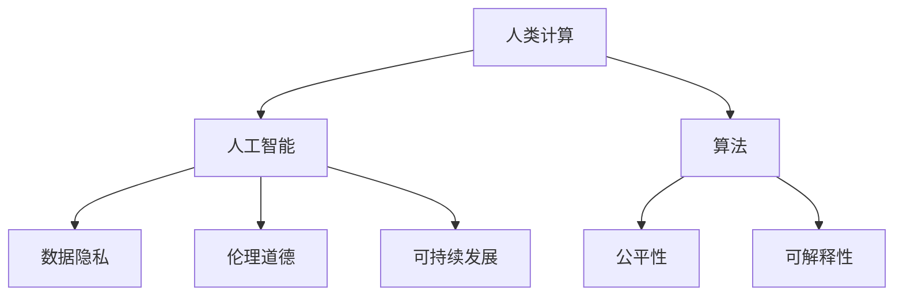

                 

# 以人为本的科技未来：人类计算的价值观

## 1. 背景介绍

### 1.1 问题由来

随着科技的快速发展，人类社会正在经历前所未有的变革。人工智能、大数据、物联网等技术的应用，深刻改变了人们的生产生活方式。然而，在技术迅猛发展的同时，我们也面临着一系列新的挑战：如何在科技进步与人类福祉之间找到平衡点？如何让科技真正服务于人类，而非反过来主导人类的行为？

### 1.2 问题核心关键点

构建以人为本的科技未来，需要重新审视技术的设计和应用。本文将从计算、数据、算法三个核心维度，探讨如何赋予科技以人本价值观。

## 2. 核心概念与联系

### 2.1 核心概念概述

在探讨以人为本的科技未来时，我们首先需要理解以下核心概念：

- 人类计算(Human Computation)：将人类智慧与计算技术结合，设计出既能发挥人类特长，又能利用机器高效处理的信息系统。
- 人工智能与人类智慧相融合：机器学习和深度学习等技术，让计算机具备一定的感知、决策、学习能力，同时保留人类智慧的核心优势。
- 数据隐私与安全：确保在数据采集、存储、处理、分享等各个环节，充分尊重和保护用户的隐私权和数据安全。
- 伦理道德：在技术应用中引入伦理道德框架，避免偏见、歧视、恶意应用等负面影响，确保技术公平公正。
- 可持续发展：开发节能环保、低碳高效的计算方式，推动技术的可持续发展。

这些核心概念共同构成了以人为本科技未来的基本框架，指导着我们构建更加人性化、公平、安全的技术系统。

### 2.2 核心概念原理和架构的 Mermaid 流程图



这个流程图展示了人类计算和人工智能系统中的核心元素和它们之间的联系：

1. **人类计算**通过**算法**与**人工智能**结合，实现高效的信息处理。
2. **数据隐私**和**伦理道德**保障系统设计的人本关怀，确保技术公平和无害。
3. **可持续发展**提供计算技术的环境友好性，避免对自然和社会的负面影响。

## 3. 核心算法原理 & 具体操作步骤

### 3.1 算法原理概述

基于人本价值观的科技系统，其核心算法应具备以下特点：

- 算法设计应以人为中心，体现人类智慧与计算技术的深度融合。
- 算法应具备高度的可解释性，让用户理解和信任其决策过程。
- 算法应能平衡算力与伦理道德，避免数据滥用和偏见问题。
- 算法应具备高效、节能的特性，促进可持续发展。

### 3.2 算法步骤详解

构建以人为本的科技系统，需要经历以下关键步骤：

**Step 1: 确定人本目标**  
明确系统设计目标，如提升社会福祉、优化资源分配、增强教育公平等，并建立衡量这些目标的指标体系。

**Step 2: 数据收集与清洗**  
收集与目标相关的数据，并进行预处理，确保数据的质量和多样性。在数据收集过程中，应充分尊重用户隐私，保障数据安全。

**Step 3: 算法设计**  
根据人本目标和数据特点，选择合适的算法模型。算法设计应遵循公平、透明、可解释、高效的原则。

**Step 4: 算法训练与优化**  
使用标注数据对算法进行训练，并根据模型性能进行优化调整。优化过程中，应综合考虑模型效率、数据公平性、隐私保护等指标。

**Step 5: 系统部署与迭代**  
将训练好的算法模型部署到实际应用场景中，并进行持续监控和迭代改进。在部署过程中，应确保系统的可扩展性、稳定性和安全性。

### 3.3 算法优缺点

基于人本价值观的算法设计，有以下优点：

- 以人为本的系统更能理解和满足用户需求，提升用户体验和满意度。
- 透明可解释的算法使用户能够更好地理解其决策过程，增强信任感。
- 通过平衡算力与伦理道德，算法更难滥用，避免数据隐私泄露和偏见问题。

然而，这种设计也存在以下挑战：

- 数据收集与处理过程复杂，需要投入更多资源和时间。
- 算法设计需综合考虑多个因素，增加了设计和实现难度。
- 系统部署与优化迭代过程需要持续监控和优化，工作量较大。

### 3.4 算法应用领域

基于人本价值观的算法设计，在以下几个领域具有广泛应用：

- 智慧城市：通过智能交通、能源管理、环境监测等应用，提升城市运行效率和居民生活质量。
- 医疗健康：利用数据分析和预测技术，提升疾病预防和治疗效果，促进医疗公平。
- 教育培训：开发智能教学系统，提供个性化学习建议，提高教育质量和学习效率。
- 社会服务：构建基于算法的社会救助、公共安全等系统，提高服务效率和社会稳定。

## 4. 数学模型和公式 & 详细讲解 & 举例说明

### 4.1 数学模型构建

人本价值观的算法设计，涉及多个维度的数据和指标。以下以智慧城市为例，构建综合评价模型。

设 $X$ 为影响城市运行效率的各项指标，$Y$ 为目标指标（如交通拥堵率、能源消耗等）。假设模型为线性回归模型，构建如下数学模型：

$$
Y = \beta_0 + \beta_1X_1 + \beta_2X_2 + \ldots + \beta_nX_n + \epsilon
$$

其中，$\beta_i$ 为指标 $X_i$ 的权重，$\epsilon$ 为误差项。

### 4.2 公式推导过程

1. **数据收集与预处理**  
收集与城市运行效率相关的各项指标数据，并进行归一化、去噪等预处理，确保数据质量。

2. **模型构建与训练**  
使用训练集数据，通过最小二乘法拟合线性回归模型，求解权重 $\beta_i$。

3. **模型评估与优化**  
使用测试集数据，评估模型预测效果，并通过交叉验证等方法，对模型进行优化调整。

4. **模型部署与迭代**  
将训练好的模型部署到实际应用中，并进行持续监控和优化迭代，以应对数据分布变化和新的需求。

### 4.3 案例分析与讲解

以智慧交通系统为例，通过模型评估和优化，实现实时交通流量预测和拥堵点优化。

1. **数据收集**  
收集历史交通流量数据、天气数据、人口密度数据等，作为训练数据。

2. **模型构建**  
构建基于时间序列分析的交通流量预测模型，使用LSTM神经网络进行训练。

3. **模型评估**  
在测试集上评估模型预测精度，通过均方误差（MSE）等指标，判断模型的表现。

4. **模型优化**  
根据模型评估结果，调整网络结构、增加数据样本、调整学习率等，优化模型参数。

5. **部署与应用**  
将优化后的模型部署到城市交通管理系统中，实时预测交通流量，指导信号灯控制和路线规划，提升交通效率和安全性。

## 5. 项目实践：代码实例和详细解释说明

### 5.1 开发环境搭建

为了实现基于人本价值观的智慧交通系统，我们需要搭建相应的开发环境。

1. **安装Python**  
从官网下载并安装Python 3.x版本。

2. **安装相关库**  
安装TensorFlow、Keras、NumPy等机器学习库，以及OpenCV、Pandas、Scikit-learn等数据处理库。

3. **配置开发环境**  
使用Jupyter Notebook搭建开发环境，方便进行数据处理、模型训练和结果展示。

### 5.2 源代码详细实现

以下是一个简单的智慧交通系统实现示例，使用TensorFlow和Keras库：

```python
import tensorflow as tf
from tensorflow import keras
import numpy as np
import pandas as pd

# 加载数据
data = pd.read_csv('traffic_data.csv')

# 数据预处理
data = data.dropna()
X = data[['weather', 'population', 'date']].values
y = data['traffic_flow'].values

# 构建模型
model = keras.Sequential([
    keras.layers.Dense(64, activation='relu', input_shape=(3,)),
    keras.layers.Dense(64, activation='relu'),
    keras.layers.Dense(1)
])

model.compile(optimizer='adam', loss='mse', metrics=['mae'])

# 模型训练
model.fit(X, y, epochs=50, batch_size=32, validation_split=0.2)

# 模型评估
test_data = pd.read_csv('traffic_data_test.csv')
X_test = test_data[['weather', 'population', 'date']].values
y_test = test_data['traffic_flow'].values
mse = model.evaluate(X_test, y_test, verbose=0)[1]
print(f"Mean Squared Error: {mse:.2f}")
```

### 5.3 代码解读与分析

**数据预处理**  
- 使用Pandas库读取交通流量数据，进行数据清洗和预处理。
- 删除缺失数据，保留完整样本。

**模型构建与训练**  
- 使用Keras库构建多层感知器（MLP）模型，包含两个隐藏层和一个输出层。
- 使用Adam优化器和均方误差（MSE）作为损失函数，进行模型训练。

**模型评估**  
- 在测试集上评估模型均方误差（MSE），衡量模型预测精度。

**优化与迭代**  
- 根据模型评估结果，调整模型结构、优化参数等，进行迭代改进。

**实际应用**  
- 将训练好的模型部署到智慧交通管理系统中，实时预测交通流量，指导交通控制和路线规划。

## 6. 实际应用场景

### 6.1 智慧城市

智慧城市是一个综合应用场景，融合了多个领域的技术。

**智慧交通**  
通过智能交通管理，实现实时交通流量预测和拥堵点优化，提升交通效率和安全性。

**智慧能源**  
通过能源数据分析和预测，优化能源分配和使用，减少能源浪费，提升能源利用效率。

**智慧环境**  
通过环境监测和大数据分析，优化城市规划和管理，提升空气质量和水资源管理水平。

### 6.2 医疗健康

医疗健康领域，基于人本价值观的算法设计，旨在提升医疗服务的公平性和效率。

**疾病预测**  
利用数据分析和机器学习技术，预测疾病流行趋势和个体患病风险，提供个性化预防和干预方案。

**智能诊疗**  
通过自然语言处理和图像识别技术，提升医疗影像诊断和病历分析的准确性和效率。

**资源优化**  
通过数据分析和算法优化，合理分配医疗资源，提升医疗服务的可及性和公平性。

### 6.3 教育培训

教育培训领域，基于人本价值观的算法设计，旨在提升教育质量和个性化学习体验。

**智能教学**  
开发智能教学系统，根据学生学习行为和反馈，提供个性化学习建议和资源推荐。

**学习评估**  
利用数据分析和机器学习技术，评估学生的学习效果和知识掌握情况，提供反馈和改进建议。

**课程设计**  
通过数据挖掘和算法分析，优化课程设计，提升教学效果和学习体验。

### 6.4 未来应用展望

未来，基于人本价值观的科技系统将在更多领域得到应用，推动社会的全面进步。

**社会服务**  
通过智能算法优化社会资源分配，提升社会服务的公平性和效率，促进社会和谐稳定。

**环境保护**  
利用数据分析和预测技术，优化资源管理和环境保护，实现可持续发展。

**文化传承**  
通过自然语言处理和机器学习技术，挖掘和传承人类文化遗产，推动文化创新和传播。

**伦理道德**  
建立完善的伦理道德框架，确保技术应用的公平、公正和透明，避免偏见和滥用。

## 7. 工具和资源推荐

### 7.1 学习资源推荐

为了帮助开发者系统掌握人本价值观的科技系统构建方法，以下是一些优质的学习资源：

1. **《人类计算导论》**  
一本系统介绍人类计算概念、技术和应用的书，适合入门和进阶学习。

2. **Coursera《数据科学与机器学习》课程**  
斯坦福大学开设的机器学习课程，涵盖数据处理、算法设计等基础知识，适合技术初学者。

3. **Kaggle数据科学竞赛**  
全球最大的数据科学竞赛平台，通过参与比赛，实战练习算法设计和数据处理技能。

4. **Google AI博客**  
谷歌人工智能团队发布的博客，涵盖前沿技术和应用案例，适合技术爱好者和从业者。

5. **ArXiv预印本数据库**  
全球最大的学术预印本数据库，涵盖人工智能领域的最新研究成果，适合深度学习研究者。

通过对这些资源的深入学习，相信你一定能够掌握人本价值观的科技系统构建方法，并应用于实际问题解决。

### 7.2 开发工具推荐

高效的工具支持，是实现人本价值观科技系统的重要保障。以下是几款常用的开发工具：

1. **Jupyter Notebook**  
开源的交互式编程环境，支持Python、R等多种语言，方便数据处理和模型训练。

2. **TensorFlow**  
谷歌推出的深度学习框架，支持分布式训练和模型部署，适合大规模数据处理和模型训练。

3. **PyTorch**  
Facebook开发的深度学习框架，灵活易用，支持动态计算图，适合快速原型开发和模型训练。

4. **RapidMiner**  
一款数据科学平台，支持数据预处理、模型训练、可视化等多种功能，适合数据科学从业者。

5. **Tableau**  
一款数据可视化工具，支持复杂的数据分析和可视化，适合数据科学家和业务分析师。

合理利用这些工具，可以显著提升人本价值观科技系统的开发效率，加快创新迭代的步伐。

### 7.3 相关论文推荐

人本价值观的科技系统构建，需要跨学科的知识和技术的融合。以下是几篇奠基性的相关论文，推荐阅读：

1. **《人类计算与社会计算：定义、内涵及应用》**  
探讨人类计算与社会计算的概念和应用，强调技术与人本价值的结合。

2. **《人工智能与人类智慧的融合：设计原则与实践》**  
介绍人工智能与人类智慧融合的设计原则和实践案例，强调技术的伦理道德和社会责任。

3. **《数据隐私保护技术综述》**  
综述数据隐私保护的技术和方法，涵盖数据加密、匿名化、差分隐私等多种技术。

4. **《公平性在机器学习中的应用》**  
探讨机器学习中的公平性问题，提出多种方法确保算法的公平性和透明性。

5. **《可持续发展的计算技术》**  
介绍节能环保、低碳高效的计算技术，强调技术对环境的影响和可持续发展的意义。

这些论文代表了大数据、人工智能等前沿技术的发展脉络，通过学习这些前沿成果，可以帮助研究者把握学科前进方向，激发更多的创新灵感。

## 8. 总结：未来发展趋势与挑战

### 8.1 研究成果总结

本文对基于人本价值观的科技系统构建进行了全面系统的介绍。首先阐述了人本价值观的科技系统构建背景和意义，明确了以人为本的系统设计目标和衡量指标。其次，从计算、数据、算法三个核心维度，详细讲解了人本价值观的算法设计方法和具体操作步骤。最后，结合智慧城市、医疗健康、教育培训等多个领域的应用案例，展示了人本价值观科技系统的前景和潜力。

通过本文的系统梳理，可以看到，基于人本价值观的科技系统，通过合理利用计算、数据和算法，不仅能够提升技术性能，更能够在提升社会福祉、促进公平正义、保护隐私安全等方面发挥重要作用。

### 8.2 未来发展趋势

展望未来，人本价值观的科技系统将呈现以下几个发展趋势：

1. **跨领域融合**  
人工智能技术将与更多领域的技术进行融合，推动跨学科的创新应用。

2. **深度人机协同**  
通过增强人机交互和协作，实现更高效、更人性化的科技应用。

3. **数据智能与人类智慧相融合**  
利用大数据和人工智能技术，提升人类智慧的表达和应用，实现更智能的决策支持。

4. **伦理道德与技术共进**  
在技术应用中引入伦理道德框架，确保技术应用的公平、公正和透明。

5. **可持续发展与环保**  
开发节能环保、低碳高效的计算方式，推动技术的可持续发展。

以上趋势凸显了人本价值观科技系统的广阔前景。这些方向的探索发展，必将进一步提升科技系统的性能和应用范围，为人类社会带来深远影响。

### 8.3 面临的挑战

尽管人本价值观的科技系统已经取得了显著成就，但在迈向更加智能化、普适化应用的过程中，仍面临诸多挑战：

1. **数据隐私与安全**  
在数据收集、存储、处理、分享等环节，如何充分尊重和保护用户的隐私权和数据安全，是一个重要挑战。

2. **算法公平性与透明性**  
如何设计公平、透明、可解释的算法，避免数据滥用和偏见问题，是一个技术难题。

3. **资源消耗与环境影响**  
在实现高效率计算的同时，如何降低能耗，减少对环境的影响，是一个需要深入研究的课题。

4. **伦理道德与法规约束**  
如何建立完善的伦理道德框架，确保技术应用的公平、公正和透明，是一个复杂且重要的问题。

5. **跨领域知识融合**  
如何有效融合跨领域的知识和技术，实现科技系统的全面提升，是一个多学科融合的挑战。

6. **技术应用的社会影响**  
如何评估和控制技术应用的社会影响，避免技术滥用和负面效应，是一个需要深入研究的问题。

这些挑战需要在技术、伦理、法律等多个维度进行深入探讨和解决。

### 8.4 研究展望

面对人本价值观科技系统所面临的挑战，未来的研究需要在以下几个方面寻求新的突破：

1. **数据隐私保护技术**  
研发更先进的数据隐私保护技术，如差分隐私、联邦学习等，确保数据安全和隐私保护。

2. **公平性算法设计**  
开发更加公平、透明、可解释的算法，确保算法决策的公正性和透明性。

3. **高效节能技术**  
开发更高效、节能的计算技术，如量子计算、边缘计算等，推动技术的可持续发展。

4. **跨学科知识融合**  
在人工智能、大数据、伦理学、社会学等多个学科领域进行深度融合，推动科技系统的全面提升。

5. **技术应用的社会影响评估**  
建立完善的技术应用社会影响评估体系，确保技术应用的公平、公正和透明。

6. **伦理道德与法律框架**  
构建完善的伦理道德与法律框架，引导科技应用的伦理道德规范，确保技术应用的合法性和合理性。

这些研究方向的探索，必将引领人本价值观科技系统迈向更高的台阶，为构建更加公平、公正、可持续的科技社会奠定坚实基础。

## 9. 附录：常见问题与解答

**Q1：如何平衡算力与伦理道德？**

A: 在算法设计和应用中，应始终将伦理道德放在首位，确保算法决策的公正性、透明性和可解释性。可以使用多种技术手段，如公平性约束、差分隐私、解释性模型等，确保算法设计和应用的伦理道德性。

**Q2：如何保护数据隐私？**

A: 在数据收集、存储、处理和分享等各个环节，应采用多种隐私保护技术，如数据加密、匿名化、差分隐私等，确保用户隐私权和数据安全。

**Q3：如何实现算法的公平性？**

A: 在算法设计和应用中，应考虑不同群体的利益和需求，确保算法的公平性和透明性。可以使用多种公平性约束技术，如平衡正则化、公平性约束等，确保算法决策的公正性。

**Q4：如何实现算法的可解释性？**

A: 在算法设计和应用中，应采用可解释性强的算法模型，如决策树、规则模型等，确保算法的决策过程透明和可解释。可以使用多种解释性工具，如LIME、SHAP等，进一步增强算法的可解释性。

**Q5：如何确保算法的可持续性？**

A: 在算法设计和应用中，应采用节能环保、低碳高效的计算技术，如分布式计算、边缘计算等，确保算法的可持续性。可以使用多种节能技术，如量化加速、模型压缩等，降低算法的计算资源消耗。

这些问题的解答，将有助于开发者更好地理解人本价值观的科技系统构建方法，并应用于实际问题解决。

---

作者：禅与计算机程序设计艺术 / Zen and the Art of Computer Programming

