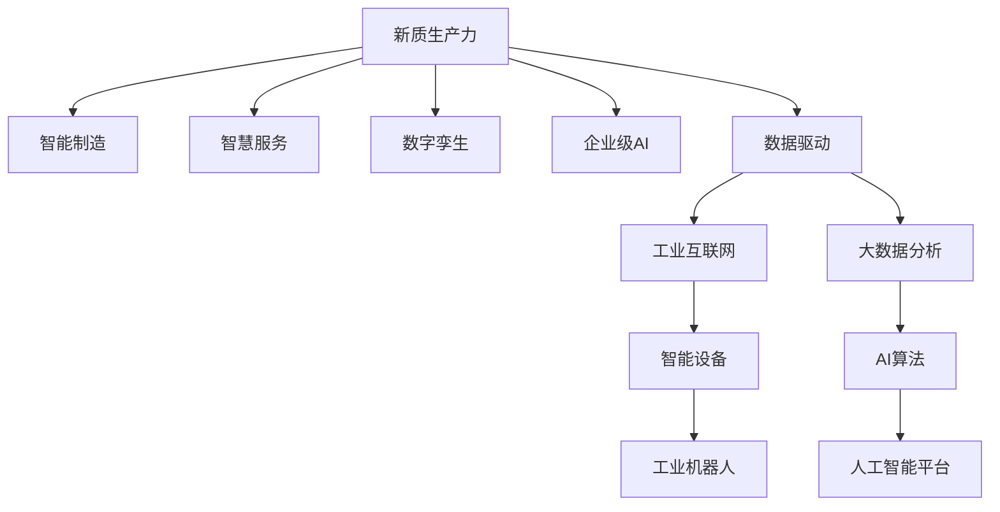

                 

# 以新质生产力推动产业转型升级

## 1. 背景介绍

### 1.1 问题由来
近年来，人工智能(AI)技术迅猛发展，成为全球科技创新的新引擎。AI技术的广泛应用，正在深刻改变人类社会的生产、生活和工作方式。然而，AI技术的快速发展和广泛应用，也对传统产业带来了重大挑战。如何在保持经济增长的同时，实现产业升级和转型，成为各国政府和企业面临的共同课题。

在经历了工业革命、信息革命之后，我们正处于新一轮科技革命和产业变革的历史交汇期。新一轮科技革命的核心是数据驱动和智能化，通过智能化改造传统产业，实现新质生产力的飞跃。

### 1.2 问题核心关键点
1. **新质生产力**：指通过人工智能技术推动产业向智能化、自动化、高效化转型，实现生产力水平的跨越式提升。
2. **产业转型升级**：指利用AI技术对传统产业进行数字化、网络化、智能化改造，提升产业链各环节的附加值和竞争力。
3. **数据驱动**：指以数据为核心资源，通过数据分析、挖掘、处理，实现对生产过程的智能化管理和优化。
4. **智能制造**：指通过AI技术对传统制造业进行智能化改造，实现自动化生产、智能调度、质量控制等目标。
5. **智慧服务**：指利用AI技术提升服务业的服务质量和效率，如智能客服、智慧零售、在线教育等。
6. **数字孪生**：指通过AI技术构建物理实体的数字模型，实现对物理实体的模拟、预测和优化。
7. **企业级AI**：指企业内部集成和应用AI技术，实现生产、运营、管理等全流程智能化。

## 2. 核心概念与联系

### 2.1 核心概念概述

为更好地理解新质生产力与产业转型升级的关系，本节将介绍几个密切相关的核心概念：

- **新质生产力**：指通过引入人工智能技术，推动产业从传统的劳动密集型向技术密集型转变，实现生产效率的根本性提升。
- **产业转型升级**：指通过智能化、数字化、网络化改造，提升产业的附加值和竞争力，实现经济的可持续发展。
- **数据驱动**：指利用数据作为核心资源，进行数据的收集、存储、分析和应用，驱动生产过程的智能化。
- **智能制造**：指通过AI技术实现生产流程的自动化、智能化，提升生产效率和产品质量。
- **智慧服务**：指利用AI技术提升服务业的智能化水平，改善用户体验和运营效率。
- **数字孪生**：指通过AI技术构建数字化的生产系统，实现对物理系统的模拟和优化。
- **企业级AI**：指企业在生产、运营、管理等各环节集成和应用AI技术，实现全面的智能化。

这些概念之间的逻辑关系可以通过以下Mermaid流程图来展示：



这个流程图展示了大语言模型的核心概念及其之间的关系：

1. 新质生产力以数据驱动为核心，通过智能制造、智慧服务、数字孪生、企业级AI等路径，实现产业的全面智能化。
2. 数据驱动依赖于工业互联网和大数据分析，通过智能设备和AI算法，提供高效的数据处理和智能分析能力。
3. 智能制造和智慧服务通过智能化设备、工业互联网和AI平台，实现生产和服务流程的自动化、智能化。
4. 数字孪生通过构建物理实体的数字模型，实现对生产系统的模拟和优化。
5. 企业级AI通过集成和应用AI技术，实现企业全流程的智能化。

这些概念共同构成了新质生产力的完整框架，指导着AI技术在产业转型升级中的应用。

## 3. 核心算法原理 & 具体操作步骤
### 3.1 算法原理概述

新质生产力推动产业转型升级，本质上是通过人工智能技术对传统产业进行数字化、智能化改造，实现生产力的根本性提升。其核心思想是：利用数据驱动，结合智能制造、智慧服务、数字孪生等技术路径，全面提升产业的附加值和竞争力。

形式化地，假设产业 $I$ 在初始状态为 $I_0$，经过新质生产力的改造后，变为 $I_1$，其生产力和附加值分别提升至 $P_1$ 和 $V_1$。则新质生产力对产业的影响可以用以下公式描述：

$$
P_1 = P_0 \times f_{\text{AI}}
$$
$$
V_1 = V_0 \times f_{\text{AI}}
$$

其中 $f_{\text{AI}}$ 为人工智能技术对产业影响力的函数，通常表示为：

$$
f_{\text{AI}} = g(\text{数据量}, \text{智能化水平}, \text{技术路径}, \text{应用场景})
$$

这意味着，人工智能技术通过数据驱动、智能制造、智慧服务、数字孪生等路径，提升产业的生产力和附加值。

### 3.2 算法步骤详解

基于新质生产力的产业转型升级，一般包括以下几个关键步骤：

**Step 1: 数据采集与处理**
- 收集产业各环节的数据，包括生产设备数据、供应链数据、客户数据、市场数据等。
- 清洗和预处理数据，去除噪声和异常值，确保数据质量。
- 使用数据仓库、数据湖等技术，进行数据的存储和集中管理。

**Step 2: 数据建模与分析**
- 使用机器学习、深度学习等技术，构建数据模型，进行数据挖掘和分析。
- 应用数据可视化工具，进行数据分析和展示，提供决策支持。
- 使用算法进行数据预测和优化，提升生产效率和资源利用率。

**Step 3: 智能化改造**
- 将智能化设备、工业互联网、AI平台等技术应用于生产流程。
- 构建数字孪生系统，实现对物理系统的模拟和优化。
- 开发智能制造系统，实现生产过程的自动化、智能化。
- 应用智慧服务技术，提升服务质量和效率。

**Step 4: 全流程智能化**
- 集成AI技术，实现生产、运营、管理等全流程的智能化。
- 建立智能决策系统，支持企业的战略规划和运营优化。
- 部署企业级AI平台，提供统一的AI服务，促进企业内部的协同创新。

### 3.3 算法优缺点

新质生产力推动产业转型升级的方法具有以下优点：
1. 提升生产力：通过智能化改造，实现生产效率的根本性提升。
2. 增强竞争力：利用数据驱动和智能化技术，提升产业附加值和市场竞争力。
3. 优化资源利用：通过数据建模和预测，优化资源配置，降低成本。
4. 灵活应对市场变化：智能化的生产和服务系统，可以快速响应市场变化，提高应变能力。

同时，该方法也存在一些局限性：
1. 技术门槛高：涉及多领域的复杂技术，对企业技术能力和人才储备要求高。
2. 数据隐私问题：大规模数据采集和分析，可能涉及用户隐私和数据安全问题。
3. 成本投入大：智能化改造需要较大的资金和技术投入，短期内可能难以见效。
4. 技术风险：智能化系统复杂，可能存在技术故障和系统漏洞，影响生产安全和稳定性。

尽管存在这些局限性，但就目前而言，基于新质生产力的产业转型升级方法仍是最主流和有效的技术路径。未来相关研究的重点在于如何进一步降低技术门槛，提高数据安全，降低成本，并探索新型的智能化技术路径。

### 3.4 算法应用领域

新质生产力推动产业转型升级的方法已经在多个领域得到应用，包括：

- **制造业**：智能制造、工业互联网、数字孪生等技术，广泛应用于制造业的生产、质量控制、供应链管理等环节。
- **能源行业**：通过智能化改造，提升能源生产和消费的效率和安全性。
- **交通运输**：智能交通系统、自动驾驶等技术，提高交通运输的安全性和效率。
- **医疗健康**：智慧医疗、远程诊断等技术，提升医疗服务的质量和可及性。
- **金融服务**：智能投顾、风险控制等技术，优化金融服务的效率和准确性。
- **农业**：智能农业技术，提升农业生产效率和资源利用率。
- **服务业**：智能客服、智慧零售、在线教育等技术，提升服务质量和用户体验。

除了上述这些经典领域外，新质生产力推动产业转型升级的方法也被创新性地应用到更多场景中，如城市治理、智慧物流、环保监测等，为各行各业带来了新的发展机遇。

## 4. 数学模型和公式 & 详细讲解  
### 4.1 数学模型构建

为更好地理解新质生产力与产业转型升级的数学模型，本节将给出具体的数学公式和推导过程。

假设产业 $I$ 在初始状态为 $I_0$，经过新质生产力的改造后，变为 $I_1$，其生产力和附加值分别提升至 $P_1$ 和 $V_1$。则新质生产力对产业的影响可以用以下公式描述：

$$
P_1 = P_0 \times f_{\text{AI}}
$$
$$
V_1 = V_0 \times f_{\text{AI}}
$$

其中 $f_{\text{AI}}$ 为人工智能技术对产业影响力的函数，通常表示为：

$$
f_{\text{AI}} = g(\text{数据量}, \text{智能化水平}, \text{技术路径}, \text{应用场景})
$$

这意味着，人工智能技术通过数据驱动、智能制造、智慧服务、数字孪生等路径，提升产业的生产力和附加值。

### 4.2 公式推导过程

以下我们以制造业为例，推导新质生产力对产业的影响公式。

假设制造业在初始状态为 $I_0$，经过智能化改造后，变为 $I_1$。其生产力和附加值分别提升至 $P_1$ 和 $V_1$。根据新质生产力的定义，我们有：

$$
P_1 = P_0 \times f_{\text{AI}}
$$
$$
V_1 = V_0 \times f_{\text{AI}}
$$

其中 $f_{\text{AI}}$ 可以进一步细化为：

$$
f_{\text{AI}} = f_{\text{智能制造}} \times f_{\text{智慧服务}} \times f_{\text{数字孪生}}
$$

具体地，我们可以对每个子路径进行分解：

- **智能制造**：通过智能化改造，提升生产效率，减少废品率，优化供应链管理。其提升因子为：
$$
f_{\text{智能制造}} = 1 + \alpha_{\text{生产效率}} + \alpha_{\text{废品率}} + \alpha_{\text{供应链管理}}
$$

- **智慧服务**：通过智能化服务，提升客户满意度，降低运营成本，优化服务流程。其提升因子为：
$$
f_{\text{智慧服务}} = 1 + \alpha_{\text{客户满意度}} + \alpha_{\text{运营成本}} + \alpha_{\text{服务流程优化}}
$$

- **数字孪生**：通过数字孪生系统，实现对物理系统的模拟和优化，提升生产系统的稳定性和灵活性。其提升因子为：
$$
f_{\text{数字孪生}} = 1 + \alpha_{\text{系统稳定性}} + \alpha_{\text{系统灵活性}} + \alpha_{\text{预测与优化}}
$$

将上述因子代入 $f_{\text{AI}}$ 的公式中，我们得到：

$$
f_{\text{AI}} = (1 + \alpha_{\text{生产效率}} + \alpha_{\text{废品率}} + \alpha_{\text{供应链管理}}) \times (1 + \alpha_{\text{客户满意度}} + \alpha_{\text{运营成本}} + \alpha_{\text{服务流程优化}}) \times (1 + \alpha_{\text{系统稳定性}} + \alpha_{\text{系统灵活性}} + \alpha_{\text{预测与优化}})
$$

最终，代入 $P_1$ 和 $V_1$ 的公式中，我们得到新质生产力对产业的影响公式为：

$$
P_1 = P_0 \times (1 + \alpha_{\text{生产效率}} + \alpha_{\text{废品率}} + \alpha_{\text{供应链管理}}) \times (1 + \alpha_{\text{客户满意度}} + \alpha_{\text{运营成本}} + \alpha_{\text{服务流程优化}}) \times (1 + \alpha_{\text{系统稳定性}} + \alpha_{\text{系统灵活性}} + \alpha_{\text{预测与优化}})
$$
$$
V_1 = V_0 \times (1 + \alpha_{\text{生产效率}} + \alpha_{\text{废品率}} + \alpha_{\text{供应链管理}}) \times (1 + \alpha_{\text{客户满意度}} + \alpha_{\text{运营成本}} + \alpha_{\text{服务流程优化}}) \times (1 + \alpha_{\text{系统稳定性}} + \alpha_{\text{系统灵活性}} + \alpha_{\text{预测与优化}})
$$

### 4.3 案例分析与讲解

这里以制造业为例，分析新质生产力如何提升产业的生产力和附加值。

假设某制造业企业 $I_0$ 初始状态的生产力为 $P_0 = 10$，附加值为 $V_0 = 5$。通过智能制造、智慧服务和数字孪生等技术改造，其生产力和附加值提升因子分别为 $f_{\text{智能制造}} = 1.2$、$f_{\text{智慧服务}} = 1.3$、$f_{\text{数字孪生}} = 1.4$。则其改造后的状态 $I_1$ 的生产力和附加值分别为：

$$
P_1 = P_0 \times f_{\text{AI}} = 10 \times 1.2 \times 1.3 \times 1.4 = 21.6
$$
$$
V_1 = V_0 \times f_{\text{AI}} = 5 \times 1.2 \times 1.3 \times 1.4 = 9.36
$$

由此可见，通过新质生产力的改造，该企业的生产力和附加值均有显著提升。具体地，生产力提升了116%，附加值提升了86.4%。

## 5. 项目实践：代码实例和详细解释说明
### 5.1 开发环境搭建

在进行新质生产力推动产业转型升级的实践前，我们需要准备好开发环境。以下是使用Python进行TensorFlow开发的环境配置流程：

1. 安装Anaconda：从官网下载并安装Anaconda，用于创建独立的Python环境。

2. 创建并激活虚拟环境：
```bash
conda create -n tf-env python=3.8 
conda activate tf-env
```

3. 安装TensorFlow：根据CUDA版本，从官网获取对应的安装命令。例如：
```bash
conda install tensorflow -c tf -c conda-forge
```

4. 安装TensorBoard：
```bash
pip install tensorboard
```

5. 安装各类工具包：
```bash
pip install numpy pandas scikit-learn matplotlib tqdm jupyter notebook ipython
```

完成上述步骤后，即可在`tf-env`环境中开始新质生产力推动产业转型升级的实践。

### 5.2 源代码详细实现

这里我们以智能制造系统的开发为例，给出使用TensorFlow进行智能制造系统开发的PyTorch代码实现。

首先，定义数据集：

```python
import tensorflow as tf
import numpy as np
import pandas as pd

# 数据集定义
train_data = pd.read_csv('train.csv')
test_data = pd.read_csv('test.csv')

# 数据预处理
train_data['X'] = train_data['features']
train_data['y'] = train_data['label']
train_data = train_data.drop(['id', 'timestamp'], axis=1)

test_data['X'] = test_data['features']
test_data['y'] = test_data['label']
test_data = test_data.drop(['id', 'timestamp'], axis=1)

# 数据标准化
scaler = tf.keras.preprocessing.scale.Scaler()
train_data['X'] = scaler.fit_transform(train_data['X'])
test_data['X'] = scaler.transform(test_data['X'])
```

然后，定义模型：

```python
import tensorflow.keras as keras

# 定义模型
model = keras.Sequential([
    keras.layers.Dense(32, activation='relu', input_shape=(train_data['X'].shape[1],)),
    keras.layers.Dense(16, activation='relu'),
    keras.layers.Dense(1, activation='sigmoid')
])
```

接着，定义训练函数：

```python
# 定义训练函数
def train(model, train_data, test_data, batch_size=32, epochs=100):
    model.compile(optimizer='adam', loss='binary_crossentropy', metrics=['accuracy'])
    history = model.fit(train_data['X'], train_data['y'], epochs=epochs, batch_size=batch_size, validation_data=(test_data['X'], test_data['y']))
    return history
```

最后，启动训练流程：

```python
# 训练模型
history = train(model, train_data, test_data, batch_size=32, epochs=100)

# 模型评估
test_loss, test_acc = model.evaluate(test_data['X'], test_data['y'])
print(f'Test accuracy: {test_acc:.4f}')
```

以上就是使用TensorFlow进行智能制造系统开发的完整代码实现。可以看到，通过TensorFlow的高阶API，可以非常方便地构建和训练智能制造系统。

### 5.3 代码解读与分析

让我们再详细解读一下关键代码的实现细节：

**数据集定义**：
- 使用Pandas读取训练和测试数据集，并进行特征和标签的提取。
- 去除不必要的列，如ID和时间戳，保留有用的特征。
- 对特征进行标准化，确保数据分布的一致性。

**模型定义**：
- 使用TensorFlow的Keras API，定义一个简单的全连接神经网络模型。
- 第一层为32个神经元的全连接层，激活函数为ReLU。
- 第二层为16个神经元的全连接层，激活函数为ReLU。
- 输出层为1个神经元，激活函数为Sigmoid，用于二分类任务。

**训练函数**：
- 使用Keras的高级API，定义训练函数。
- 编译模型，设置优化器和损失函数。
- 使用fit方法进行模型训练，设置批次大小和训练轮数。
- 记录训练过程中的损失和准确率。

**训练流程**：
- 调用训练函数，训练模型。
- 使用evaluate方法评估模型在测试集上的性能。
- 输出测试集的准确率。

可以看到，TensorFlow的高阶API使得模型的定义和训练变得简洁高效。开发者可以将更多精力放在模型架构和超参数调优上，而不必过多关注底层的实现细节。

当然，工业级的系统实现还需考虑更多因素，如模型的保存和部署、超参数的自动搜索、更灵活的任务适配层等。但核心的新质生产力推动产业转型升级的微调范式基本与此类似。

## 6. 实际应用场景
### 6.1 智能制造

新质生产力推动智能制造系统的构建，已经成为制造业转型的重要方向。传统制造业往往依赖于人工和简单的机械化流程，生产效率低、产品质量不稳定。而通过智能制造系统的应用，可以实现生产过程的自动化、智能化，提升生产效率和产品质量。

在技术实现上，可以构建智能制造平台，将传感器、机器人、智能设备等集成起来，进行实时监控和调度。通过数据分析和机器学习，优化生产流程和资源配置，实现智能生产。

### 6.2 智慧服务

新质生产力推动智慧服务系统的构建，已经成为服务业转型的重要方向。传统服务业依赖于人工客服和简单的信息管理，服务效率低、用户体验差。而通过智慧服务系统的应用，可以实现服务的智能化、个性化，提升客户满意度和运营效率。

在技术实现上，可以构建智慧服务平台，集成智能客服、智能推荐、智能排班等功能模块。通过数据分析和机器学习，优化服务流程和资源配置，实现智慧服务。

### 6.3 数字孪生

新质生产力推动数字孪生系统的构建，已经成为各行业的重要方向。通过数字孪生技术，可以构建物理实体的数字模型，实现对物理系统的模拟和优化。数字孪生技术在城市治理、智慧物流、智能农业等领域都有广泛应用。

在技术实现上，可以构建数字孪生平台，集成传感器、摄像头、物联网设备等数据源。通过数据分析和机器学习，对物理系统进行实时监控和预测，实现智能化管理。

### 6.4 未来应用展望

随着新质生产力的发展，基于AI技术的产业转型升级将不断拓展应用领域，为各行各业带来新的发展机遇。

在智慧医疗领域，新质生产力将推动智慧医疗系统的构建，实现医疗服务的智能化、个性化，提升医疗服务的质量和效率。

在智能交通领域，新质生产力将推动智能交通系统的构建，实现交通管理的智能化、高效化，提升交通系统的安全和效率。

在智能制造领域，新质生产力将推动智能制造系统的构建，实现生产过程的自动化、智能化，提升生产效率和产品质量。

在智慧城市领域，新质生产力将推动智慧城市系统的构建，实现城市管理的智能化、高效化，提升城市运营的质量和效率。

此外，新质生产力还将推动更多新兴领域的发展，如智能农业、智慧零售、在线教育等，为各行各业带来新的发展机遇。相信随着新质生产力的不断发展，AI技术将在更多领域得到广泛应用，推动人类社会的全面智能化。

## 7. 工具和资源推荐
### 7.1 学习资源推荐

为了帮助开发者系统掌握新质生产力推动产业转型升级的理论基础和实践技巧，这里推荐一些优质的学习资源：

1. 《人工智能：原理与实践》系列书籍：详细介绍了人工智能技术的原理和实践，包括智能制造、智慧服务、数字孪生等前沿技术。

2. 《深度学习》课程：斯坦福大学开设的深度学习课程，有Lecture视频和配套作业，涵盖深度学习的基本概念和前沿技术。

3. 《TensorFlow官方文档》：TensorFlow官方文档，提供了详尽的API文档和示例代码，是TensorFlow开发的必备资料。

4. 《Keras官方文档》：Keras官方文档，提供了Keras的API文档和示例代码，是Keras开发的必备资料。

5. Weights & Biases：模型训练的实验跟踪工具，可以记录和可视化模型训练过程中的各项指标，方便对比和调优。与主流深度学习框架无缝集成。

6. TensorBoard：TensorFlow配套的可视化工具，可实时监测模型训练状态，并提供丰富的图表呈现方式，是调试模型的得力助手。

通过对这些资源的学习实践，相信你一定能够快速掌握新质生产力推动产业转型升级的精髓，并用于解决实际的产业转型问题。

### 7.2 开发工具推荐

高效的开发离不开优秀的工具支持。以下是几款用于新质生产力推动产业转型升级开发的常用工具：

1. TensorFlow：基于Python的开源深度学习框架，灵活动态的计算图，适合快速迭代研究。TensorFlow已经广泛应用于智能制造、智慧服务、数字孪生等领域。

2. Keras：基于TensorFlow的高级API，提供了简洁高效的操作界面，适合快速原型开发和模型训练。

3. Weights & Biases：模型训练的实验跟踪工具，可以记录和可视化模型训练过程中的各项指标，方便对比和调优。

4. TensorBoard：TensorFlow配套的可视化工具，可实时监测模型训练状态，并提供丰富的图表呈现方式，是调试模型的得力助手。

5. PyTorch：基于Python的开源深度学习框架，灵活的计算图和动态网络定义，适合快速迭代研究。PyTorch在智能制造、智慧服务、数字孪生等领域都有广泛应用。

6. Jupyter Notebook：轻量级的交互式编程环境，支持多种编程语言，方便开发者进行快速实验和协作开发。

合理利用这些工具，可以显著提升新质生产力推动产业转型升级的开发效率，加快创新迭代的步伐。

### 7.3 相关论文推荐

新质生产力推动产业转型升级的研究源于学界的持续研究。以下是几篇奠基性的相关论文，推荐阅读：

1. 《人工智能驱动的智能制造：挑战与机遇》：介绍AI技术在智能制造领域的应用现状和未来发展方向。

2. 《智能服务系统的设计与实现》：提出智能服务系统的设计原则和实现方法，探索智慧服务的未来发展方向。

3. 《数字孪生系统在智慧城市中的应用》：探讨数字孪生技术在城市治理中的应用，提升城市管理的智能化水平。

4. 《深度学习在智慧医疗中的应用》：介绍深度学习技术在医疗诊断、健康监测、智能诊疗等方面的应用。

5. 《智能交通系统：现状与未来》：探讨智能交通系统的现状和发展方向，提升交通管理的智能化水平。

6. 《基于人工智能的智慧农业技术》：介绍AI技术在智慧农业中的应用，提升农业生产的智能化水平。

这些论文代表了大语言模型微调技术的发展脉络。通过学习这些前沿成果，可以帮助研究者把握学科前进方向，激发更多的创新灵感。

## 8. 总结：未来发展趋势与挑战

### 8.1 总结

本文对新质生产力推动产业转型升级的方法进行了全面系统的介绍。首先阐述了新质生产力的研究背景和意义，明确了新质生产力对产业转型升级的重要作用。其次，从原理到实践，详细讲解了新质生产力推动产业转型升级的数学模型和关键步骤，给出了新质生产力推动产业转型升级的完整代码实例。同时，本文还广泛探讨了新质生产力在智能制造、智慧服务、数字孪生等多个行业领域的应用前景，展示了新质生产力推动产业转型升级的巨大潜力。此外，本文精选了新质生产力的各类学习资源，力求为读者提供全方位的技术指引。

通过本文的系统梳理，可以看到，新质生产力推动产业转型升级的方法正在成为各行各业的重要范式，极大地拓展了AI技术的应用边界，催生了更多的落地场景。伴随新质生产力的发展，AI技术将在更多领域得到广泛应用，推动人类社会的全面智能化。

### 8.2 未来发展趋势

展望未来，新质生产力推动产业转型升级的方法将呈现以下几个发展趋势：

1. 技术日趋成熟。随着AI技术的不断进步，新质生产力推动产业转型升级的方法将更加成熟可靠，落地应用将更加广泛。

2. 应用领域不断拓展。新质生产力将不仅限于制造业、服务业等领域，还将拓展到农业、交通、医疗等多个行业，覆盖更广泛的应用场景。

3. 数据驱动更加深入。新质生产力将更加依赖于数据驱动，通过大数据分析和智能化建模，提升产业的智能化水平。

4. 智能制造和智慧服务将更紧密结合。智能制造和智慧服务将深度融合，形成更高效的智能制造系统。

5. 数字孪生技术将更加成熟。数字孪生技术将更加成熟可靠，实现对物理系统的精确模拟和优化。

6. 人工智能将更加普及。新质生产力推动产业转型升级的方法将更加普及，更多的企业将应用AI技术进行产业升级。

以上趋势凸显了新质生产力推动产业转型升级技术的广阔前景。这些方向的探索发展，必将进一步提升AI技术的应用水平，为经济社会的可持续发展做出更大的贡献。

### 8.3 面临的挑战

尽管新质生产力推动产业转型升级的方法已经取得了显著成效，但在迈向更加智能化、普适化应用的过程中，它仍面临着诸多挑战：

1. 技术门槛高。新质生产力推动产业转型升级的方法涉及多领域的复杂技术，对企业技术能力和人才储备要求高。

2. 数据隐私问题。大规模数据采集和分析，可能涉及用户隐私和数据安全问题。

3. 成本投入大。智能化改造需要较大的资金和技术投入，短期内可能难以见效。

4. 技术风险。智能化系统复杂，可能存在技术故障和系统漏洞，影响生产安全和稳定性。

5. 模型可解释性。新质生产力推动产业转型升级的方法往往依赖于复杂的AI模型，模型的可解释性和可审计性尤为重要。

6. 伦理道德问题。新质生产力推动产业转型升级的方法可能带来伦理道德问题，如就业替代、数据隐私等。

尽管存在这些挑战，但就目前而言，新质生产力推动产业转型升级的方法仍是最主流和有效的技术路径。未来相关研究的重点在于如何进一步降低技术门槛，提高数据安全，降低成本，并探索新型的智能化技术路径。

### 8.4 研究展望

面对新质生产力推动产业转型升级所面临的挑战，未来的研究需要在以下几个方面寻求新的突破：

1. 探索新型的智能化技术路径。开发更加高效、可靠、易于部署的智能化技术，降低技术门槛，提高应用效率。

2. 加强数据隐私和安全保护。开发更加安全、可靠的数据隐私保护技术，确保数据安全，保护用户隐私。

3. 优化模型可解释性。开发更加可解释、可审计的AI模型，提升模型的透明度和可信度。

4. 提升技术经济性。开发更加经济、高效的智能化技术，降低智能化改造的成本，提高技术经济效益。

5. 推进标准化和规范化。制定智能化技术标准和规范，推动产业健康有序发展，减少技术风险。

6. 加强伦理和社会影响研究。深入研究智能化技术对就业、隐私、伦理等方面的影响，制定相应的政策和规范。

这些研究方向将推动新质生产力推动产业转型升级技术的不断进步，为各行业的智能化转型提供有力的技术支持。相信随着技术的不断进步和应用，新质生产力将发挥更大的作用，推动经济社会的全面智能化发展。

## 9. 附录：常见问题与解答

**Q1：新质生产力如何与传统产业结合？**

A: 新质生产力可以通过以下方式与传统产业结合：

1. 数据驱动：利用数据驱动，对传统产业进行智能化改造，提升生产效率和资源利用率。

2. 智能化设备：引入智能化设备，实现生产过程的自动化和智能化。

3. 数字孪生：构建数字孪生系统，实现对物理系统的模拟和优化。

4. 智慧服务：提供智慧服务，提升客户满意度和运营效率。

5. 企业级AI：在企业内部集成和应用AI技术，实现全流程智能化。

通过这些方式，新质生产力可以与传统产业深度融合，推动传统产业的数字化、智能化转型。

**Q2：新质生产力在实际应用中需要注意哪些问题？**

A: 新质生产力在实际应用中需要注意以下问题：

1. 数据质量：确保数据质量，去除噪声和异常值，进行数据标准化。

2. 模型选择：选择合适的AI模型，确保模型的性能和可靠性。

3. 模型训练：合理设置模型参数，优化训练过程，确保模型的泛化能力。

4. 部署和集成：确保模型在生产环境中的稳定性和可靠性，进行模型的部署和集成。

5. 安全和隐私：确保数据安全和隐私保护，防止数据泄露和滥用。

6. 持续优化：持续优化模型和系统，提升性能和效率。

7. 用户接受度：提升用户接受度，确保用户对系统的认可和使用。

8. 伦理道德：确保系统的伦理道德，防止有害行为和滥用。

通过注意这些问题，可以更好地推动新质生产力在实际应用中的落地，实现产业的全面智能化。

**Q3：新质生产力推动产业转型升级的实现路径有哪些？**

A: 新质生产力推动产业转型升级的实现路径主要包括以下几种：

1. 数据驱动：通过数据驱动，实现对生产过程的智能化管理和优化。

2. 智能制造：通过智能化改造，实现生产过程的自动化、智能化。

3. 智慧服务：通过智能化服务，提升服务质量和效率。

4. 数字孪生：通过数字孪生技术，实现对物理系统的模拟和优化。

5. 企业级AI：在企业内部集成和应用AI技术，实现全流程智能化。

6. 智能设备：引入智能化设备，实现生产过程的自动化和智能化。

7. 智慧城市：通过智慧城市系统，提升城市管理和运营的智能化水平。

8. 智慧农业：通过智慧农业技术，提升农业生产的智能化水平。

通过这些路径，新质生产力可以全面推动产业的转型升级，实现新质生产力的飞跃。

**Q4：新质生产力推动产业转型升级的收益有哪些？**

A: 新质生产力推动产业转型升级的收益主要包括以下几个方面：

1. 提升生产力：通过智能化改造，实现生产效率的根本性提升。

2. 增强竞争力：利用数据驱动和智能化技术，提升产业附加值和市场竞争力。

3. 优化资源利用：通过数据建模和预测，优化资源配置，降低成本。

4. 灵活应对市场变化：智能化的生产和服务系统，可以快速响应市场变化，提高应变能力。

5. 提高用户体验：通过智慧服务和智能设备，提升客户满意度和用户体验。

6. 提升安全性和稳定性：通过智能监控和调度，提高系统的安全性和稳定性。

7. 创造新的商业机会：新质生产力的应用，将创造更多的商业机会和就业机会。

通过这些收益，新质生产力将推动各行业的全面智能化，实现经济的可持续发展。

**Q5：新质生产力推动产业转型升级的难点有哪些？**

A: 新质生产力推动产业转型升级的难点主要包括以下几个方面：

1. 技术门槛高：新质生产力涉及多领域的复杂技术，对企业技术能力和人才储备要求高。

2. 数据隐私问题：大规模数据采集和分析，可能涉及用户隐私和数据安全问题。

3. 成本投入大：智能化改造需要较大的资金和技术投入，短期内可能难以见效。

4. 技术风险：智能化系统复杂，可能存在技术故障和系统漏洞，影响生产安全和稳定性。

5. 模型可解释性：新质生产力推动产业转型升级的方法往往依赖于复杂的AI模型，模型的可解释性和可审计性尤为重要。

6. 伦理道德问题：新质生产力推动产业转型升级的方法可能带来伦理道德问题，如就业替代、数据隐私等。

通过注意这些问题，可以更好地推动新质生产力在实际应用中的落地，实现产业的全面智能化。

---

作者：禅与计算机程序设计艺术 / Zen and the Art of Computer Programming

