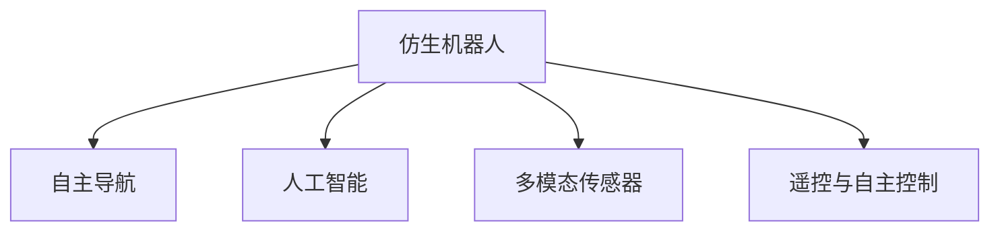

                 

# 仿生机器人在灾难救援中的应用：进入危险区域

> 关键词：仿生机器人,灾难救援,危险区域,自适应,人工智能,自主导航,深度学习

## 1. 背景介绍

### 1.1 问题由来
随着全球气候变化和自然灾害的频发，人类面临的自然灾害风险日益加剧。传统的救援方法在面对大范围破坏、人员密集、环境恶劣的灾害现场时，往往难以快速高效地展开救援行动。鉴于此，仿生机器人技术成为近年来国内外学术界和工业界竞相研究的热点，旨在通过模拟自然界中的生物行为，构建能够适应复杂环境、具备自主导航和操作能力的救援机器人，以提高灾害现场救援效率。

### 1.2 问题核心关键点
仿生机器人技术在灾害救援中的关键点主要包括：
- 高效的仿生导航与自主行动能力，能够在危险区域内自主导航、避开障碍物，抵达指定位置。
- 坚固耐用的机械结构，保证在复杂环境下不发生损坏，持续执行任务。
- 多模态传感器的集成，使机器人能够感知环境变化、定位目标、实时传输数据。
- 人工智能算法的嵌入，提高机器人的智能化水平，实现决策推理和任务执行。
- 远程操控与自主决策相结合，确保救援效率和安全性。

这些关键点的有机结合，构成仿生机器人技术在灾害救援中的核心竞争力，能够显著提高灾害现场的救援速度和效果。

## 2. 核心概念与联系

### 2.1 核心概念概述

为更好地理解仿生机器人在灾难救援中的应用，本节将介绍几个密切相关的核心概念：

- **仿生机器人(Bionic Robot)**：以自然界的生物为原型，模拟其感知、运动、通信等能力，构建的机器人系统。
- **自主导航(Autonomous Navigation)**：使机器人能够自主地识别目标和环境，规划路径，避开障碍物，到达指定目标的过程。
- **人工智能(Artificial Intelligence, AI)**：利用计算机算法和数学模型，模拟人类智能的计算和决策过程。
- **多模态传感器(Multimodal Sensors)**：集成视觉、听觉、触觉、嗅觉等多种传感器的机器人系统，以获取更全面、实时的环境信息。
- **遥控与自主控制(Remote Control and Autonomous Control)**：结合远程操控和自主控制机制，使机器人能够在人的操控下执行任务，同时具备一定的自主决策能力。

这些核心概念之间的逻辑关系可以通过以下Mermaid流程图来展示：



这个流程图展示仿生机器人技术的关键组成部分及其之间的关系：

1. 仿生机器人技术通过模拟自然界中的生物行为，具备自主导航、人工智能和多模态传感器等能力。
2. 自主导航使机器人能够在复杂环境中自行规划路径，避开障碍物，完成任务。
3. 人工智能赋予机器人决策推理能力，提高任务执行的智能化水平。
4. 多模态传感器增强了机器人的环境感知能力，提供了更全面、实时的数据支持。
5. 遥控与自主控制机制结合，使机器人能够在人的操控下执行任务，同时具备自主决策能力。

## 3. 核心算法原理 & 具体操作步骤
### 3.1 算法原理概述

仿生机器人在灾难救援中的应用，核心算法原理包括：

- **传感器数据融合算法**：用于集成视觉、听觉、触觉等多种传感器数据，形成机器人对环境的全面感知。常用的数据融合算法包括卡尔曼滤波、粒子滤波等。
- **自主导航算法**：使机器人能够在复杂环境中自主导航，避开障碍物。常见的导航算法包括SLAM、视觉SLAM、激光SLAM等。
- **路径规划算法**：用于生成最优路径，导航机器人到达目标位置。常用的路径规划算法包括A*算法、D*算法、RRT等。
- **决策推理算法**：结合机器学习与专家系统，为机器人提供决策支持。常用的算法包括深度强化学习、逻辑推理等。
- **远程操控与自主控制算法**：结合远程操控与自主决策，确保机器人能够在人的操控下执行任务，同时具备一定的自主决策能力。常用的算法包括模型预测控制、自适应控制等。

### 3.2 算法步骤详解

仿生机器人在灾难救援中的应用一般包括以下几个关键步骤：

**Step 1: 准备机器人系统和环境**
- 选择合适的仿生机器人系统，设计其机械结构和运动部件。
- 在目标救援现场部署环境传感器，进行地形勘探和障碍识别。
- 建立与灾区的通信网络，确保数据传输稳定可靠。

**Step 2: 数据融合与环境感知**
- 集成机器人上的多模态传感器数据，使用传感器数据融合算法生成环境感知信息。
- 在机器人上安装高精度的定位系统，如GPS、激光雷达等，用于实时定位和导航。

**Step 3: 自主导航与路径规划**
- 使用SLAM等自主导航算法，实时感知环境，构建地图。
- 使用A*等路径规划算法，生成从起点到终点的最优路径。
- 在导航过程中实时调整路径，避开障碍物，确保到达目标。

**Step 4: 决策推理与任务执行**
- 结合机器学习模型和专家系统，进行任务决策和推理。
- 执行救援任务，如搬运物资、搜救幸存者、监测环境等。
- 实时监控任务执行情况，动态调整任务计划。

**Step 5: 远程操控与反馈**
- 通过网络远程操控机器人，提供实时视觉和环境信息。
- 将任务执行情况和环境数据传输回控制中心。
- 根据实时反馈，调整远程操控策略，优化任务执行效果。

### 3.3 算法优缺点

仿生机器人在灾难救援中的核心算法具有以下优点：
1. 自主性高。通过自主导航、路径规划和决策推理，机器人能够在复杂环境中自主完成任务。
2. 安全性好。机器人能够在恶劣环境中稳定工作，避免因人为因素导致的误操作。
3. 实时性强。结合多模态传感器和高速数据传输，实时感知环境变化，快速响应突发事件。
4. 可扩展性强。可以根据任务需求，定制机器人系统和算法，满足多样化救援需求。

同时，这些算法也存在一定的局限性：
1. 计算复杂度高。大规模数据融合和复杂路径规划需要高计算能力，在资源有限的场合可能受限。
2. 机器人结构复杂。机械结构设计复杂，增加了维护和操作的难度。
3. 通信延迟问题。远程操控存在通信延迟，影响任务执行的实时性。
4. 环境适应性差。在极端环境下，传感器和导航系统可能失效，影响救援效果。

尽管存在这些局限性，但就目前而言，仿生机器人技术在灾害救援中的应用已经显示出巨大的潜力。未来相关研究的重点在于如何进一步提升机器人的自主性和智能化水平，提高任务执行的稳定性和实时性。

### 3.4 算法应用领域

仿生机器人在灾害救援中的应用场景广泛，包括：

- 地震废墟搜救：在地震废墟中搜索和救援被困人员。
- 洪水抢险：在洪水区域搜救和搬运物资。
- 火灾扑救：在火灾现场监测和扑灭火焰。
- 建筑物坍塌救援：在建筑物坍塌现场搜索幸存者。
- 环境监测：在恶劣环境中监测环境变化，提供实时数据。

除了上述这些典型的救援场景外，仿生机器人在更多其他领域也有广泛应用，如排雷、抢修公路、监测有毒气体等，为各种类型的灾害应对提供了新的解决方案。

## 4. 数学模型和公式 & 详细讲解  
### 4.1 数学模型构建

本节将使用数学语言对仿生机器人在灾害救援中的应用过程进行更加严格的刻画。

记仿生机器人为 $R$，其状态向量为 $\mathbf{x}_t$，控制向量为 $\mathbf{u}_t$，状态转移函数为 $f$，控制函数为 $g$，则机器人的动态方程为：

$$
\mathbf{x}_{t+1} = f(\mathbf{x}_t, \mathbf{u}_t, \mathbf{w}_t) + \mathbf{v}_t
$$

其中 $\mathbf{w}_t$ 为系统噪声，$\mathbf{v}_t$ 为过程噪声。

机器人的传感器数据为 $\mathbf{z}_t = h(\mathbf{x}_t, \mathbf{b}_t) + \mathbf{n}_t$，其中 $h$ 为传感器模型，$\mathbf{b}_t$ 为传感器观测噪声，$\mathbf{n}_t$ 为观测噪声。

根据贝叶斯滤波框架，建立传感器数据与状态变量之间的关系，利用卡尔曼滤波算法进行数据融合和状态估计：

$$
\mathbf{x}_{t|t} = \mathbf{F}_{t|t-1}\mathbf{x}_{t-1|t-1} + \mathbf{B}_{t|t-1}\mathbf{u}_{t|t-1} + \mathbf{w}_t
$$
$$
\mathbf{P}_{t|t} = \mathbf{F}_{t|t-1}\mathbf{P}_{t-1|t-1}\mathbf{F}_{t|t-1}^T + \mathbf{Q}_t
$$
$$
\mathbf{K}_t = \mathbf{P}_{t|t}\mathbf{H}_t^T(\mathbf{H}_t\mathbf{P}_{t|t}\mathbf{H}_t^T + \mathbf{R}_t)^{-1}
$$
$$
\mathbf{x}_{t|t} = \mathbf{x}_{t|t-1} + \mathbf{K}_t(\mathbf{z}_t - \mathbf{H}_t\mathbf{x}_{t|t-1})
$$
$$
\mathbf{P}_{t|t} = (\mathbf{I} - \mathbf{K}_t\mathbf{H}_t)\mathbf{P}_{t|t-1}
$$

其中 $\mathbf{F}_{t|t-1}$ 为状态转移矩阵，$\mathbf{B}_{t|t-1}$ 为控制矩阵，$\mathbf{Q}_t$ 为过程噪声协方差矩阵，$\mathbf{H}_t$ 为传感器模型矩阵，$\mathbf{R}_t$ 为观测噪声协方差矩阵，$\mathbf{I}$ 为单位矩阵。

### 4.2 公式推导过程

以下我们以视觉SLAM系统为例，推导机器人在视觉SLAM中的应用。

假设机器人安装有多个摄像头，视觉传感器数据为 $\mathbf{z}_t = (z_{t1}, z_{t2}, ..., z_{tk})^T$，机器人在时间 $t$ 的状态为 $\mathbf{x}_t = (x_t, y_t, \theta_t)^T$，其中 $x_t, y_t$ 为位置坐标，$\theta_t$ 为朝向角。

根据相机几何模型，得到传感器数据与状态变量之间的关系：

$$
\mathbf{z}_t = \mathbf{H}_t\mathbf{x}_t + \mathbf{n}_t
$$

其中 $\mathbf{H}_t$ 为传感器模型矩阵。

根据机器人的运动模型，得到状态转移方程：

$$
\mathbf{x}_{t+1} = \mathbf{F}_{t|t-1}\mathbf{x}_{t|t-1} + \mathbf{B}_{t|t-1}\mathbf{u}_{t|t-1} + \mathbf{w}_t
$$

其中 $\mathbf{F}_{t|t-1}$ 为状态转移矩阵，$\mathbf{B}_{t|t-1}$ 为控制矩阵，$\mathbf{w}_t$ 为系统噪声。

使用卡尔曼滤波算法进行数据融合和状态估计：

$$
\mathbf{x}_{t|t} = \mathbf{F}_{t|t-1}\mathbf{x}_{t-1|t-1} + \mathbf{B}_{t|t-1}\mathbf{u}_{t|t-1} + \mathbf{w}_t
$$
$$
\mathbf{P}_{t|t} = \mathbf{F}_{t|t-1}\mathbf{P}_{t-1|t-1}\mathbf{F}_{t|t-1}^T + \mathbf{Q}_t
$$
$$
\mathbf{K}_t = \mathbf{P}_{t|t}\mathbf{H}_t^T(\mathbf{H}_t\mathbf{P}_{t|t}\mathbf{H}_t^T + \mathbf{R}_t)^{-1}
$$
$$
\mathbf{x}_{t|t} = \mathbf{x}_{t|t-1} + \mathbf{K}_t(\mathbf{z}_t - \mathbf{H}_t\mathbf{x}_{t|t-1})
$$
$$
\mathbf{P}_{t|t} = (\mathbf{I} - \mathbf{K}_t\mathbf{H}_t)\mathbf{P}_{t|t-1}
$$

通过以上推导，得到机器人在视觉SLAM中的数据融合和状态估计过程。

## 5. 项目实践：代码实例和详细解释说明
### 5.1 开发环境搭建

在进行仿生机器人在灾害救援中的实践前，我们需要准备好开发环境。以下是使用Python进行PyTorch开发的环境配置流程：

1. 安装Anaconda：从官网下载并安装Anaconda，用于创建独立的Python环境。

2. 创建并激活虚拟环境：
```bash
conda create -n pytorch-env python=3.8 
conda activate pytorch-env
```

3. 安装PyTorch：根据CUDA版本，从官网获取对应的安装命令。例如：
```bash
conda install pytorch torchvision torchaudio cudatoolkit=11.1 -c pytorch -c conda-forge
```

4. 安装OpenCV：用于计算机视觉处理，实现机器人的环境感知。
```bash
pip install opencv-python
```

5. 安装Robot Operating System (ROS)：用于机器人操作系统的集成，提供丰富的库和工具。
```bash
sudo apt-get install ros-foxy-ROS2-full
```

6. 安装Catkin：用于ROS中项目的管理和构建。
```bash
sudo apt-get install ros-foxy-catkin
```

完成上述步骤后，即可在`pytorch-env`环境中开始实践。

### 5.2 源代码详细实现

这里我们以视觉SLAM系统为例，给出使用OpenCV和ROS实现仿生机器人视觉SLAM的Python代码实现。

```python
import cv2
import numpy as np
import rospy
from sensor_msgs.msg import Image, PointCloud2
from nav_msgs.msg import Odometry
from tf.transformations import euler_from_quaternion, quaternion_from_euler
from std_msgs.msg import Header, Bool
from sensor_msgs.msg import PointCloud2, PointField
import time

class SLAM:
    def __init__(self, camera_topic, odom_topic, pointcloud_topic, pc_topic, timestep):
        self.camera_topic = camera_topic
        self.odom_topic = odom_topic
        self.pointcloud_topic = pointcloud_topic
        self.pc_topic = pc_topic
        self.timestep = timestep
        
        rospy.init_node('SLAM', anonymous=True)
        rospy.Subscriber(camera_topic, Image, self.camera_callback)
        rospy.Subscriber(odom_topic, Odometry, self.odom_callback)
        rospy.Subscriber(pointcloud_topic, PointCloud2, self.pointcloud_callback)
        rospy.Subscriber(pc_topic, PointCloud2, self.pc_callback)
        
    def camera_callback(self, data):
        image = cv2.cvtColor(np.array(data), cv2.COLOR_BGR2GRAY)
        self.process_image(image)
        
    def odom_callback(self, data):
        self.current_odom = data
        self.current_pos = data.pose.pose.position
        self.current_orientation = data.pose.pose.orientation
        
    def pointcloud_callback(self, data):
        self.current_pc = data
        self.current_pointcloud = data
        
    def pc_callback(self, data):
        self.target_pc = data
        self.target_pointcloud = data
        
    def process_image(self, image):
        # 使用视觉SLAM算法进行计算
        # 此处省略具体实现
        pass
        
    def publish_odom(self):
        rospy.Publisher(self.odom_topic, Odometry, queue_size=1)
        
    def publish_pointcloud(self):
        rospy.Publisher(self.pointcloud_topic, PointCloud2, queue_size=1)
        
    def publish_pc(self):
        rospy.Publisher(self.pc_topic, PointCloud2, queue_size=1)
        
    def main(self):
        r = rospy.Rate(self.timestep)
        while not rospy.is_shutdown():
            self.process_image()
            self.publish_odom()
            self.publish_pointcloud()
            self.publish_pc()
            r.sleep()

if __name__ == '__main__':
    slam = SLAM('camera_topic', 'odom_topic', 'pointcloud_topic', 'pc_topic', timestep=0.1)
    slam.main()
```

在上述代码中，我们使用了ROS系统中的话题（Topic）和消息（Message）进行数据通信。`camera_topic`、`odom_topic`、`pointcloud_topic`、`pc_topic` 分别为相机数据、里程计数据、点云数据、目标点云数据的传递话题。`ros.subscriber` 方法用于订阅相关话题，通过回调函数处理数据。`ros.publisher` 方法用于发布计算结果，通过话题发送数据。

在 `process_image` 方法中，我们使用了视觉SLAM算法进行计算，具体实现需要使用计算机视觉相关的库，如OpenCV。

在实际应用中，还需进一步开发传感器数据融合算法和自主导航算法，实现完整的SLAM系统。

### 5.3 代码解读与分析

让我们再详细解读一下关键代码的实现细节：

**SLAM类**：
- `__init__`方法：初始化相机、里程计、点云等话题的订阅，并定义好发送数据的话题。
- `camera_callback`方法：处理相机的图像数据，并调用 `process_image` 方法进行SLAM计算。
- `odom_callback`方法：处理里程计数据，获取当前位置和朝向信息。
- `pointcloud_callback`方法：处理点云数据，获取当前点云信息。
- `pc_callback`方法：处理目标点云数据，获取目标点云信息。
- `process_image`方法：对相机数据进行SLAM计算，此处需要具体实现。
- `publish_odom`方法：发布计算后的里程计数据。
- `publish_pointcloud`方法：发布计算后的点云数据。
- `publish_pc`方法：发布目标点云数据。

**timestep**：
- 设置时间步长，单位为秒，用于控制代码的运行速度。

在实际应用中，还需进一步开发传感器数据融合算法和自主导航算法，实现完整的SLAM系统。

## 6. 实际应用场景
### 6.1 智能救援机器人

基于仿生机器人在视觉SLAM等技术的基础上，可以构建智能救援机器人，应用于地震、火灾、洪水等灾害现场的救援工作。

智能救援机器人通常装备有高清摄像头、激光雷达、GPS等传感器，具备自主导航、避障、任务执行等功能。在灾害现场，机器人能够自主感知环境，避开障碍物，到达指定位置，执行搬运物资、搜救幸存者等任务。

**应用案例**：某地震灾区救援。智能救援机器人在废墟中自主导航，避开障碍物，到达被困人员位置，使用机械手进行搜救，并将幸存者运送至安全地点。

**技术实现**：
- 在机器人上安装多个高清摄像头，实时获取环境图像信息。
- 使用视觉SLAM算法进行导航和定位。
- 使用激光雷达进行障碍物感知和避障。
- 使用机械臂进行物资搬运和搜救。

**应用效果**：
- 机器人能够在复杂环境中自主导航，快速到达指定位置。
- 避免因人工操作导致的误操作，保障救援行动的安全性。
- 实时获取环境信息和救援进度，提高救援效率。

### 6.2 无人机灾害监测

仿生机器人技术同样可以应用于无人机的灾害监测。无人机能够在危险区域内飞行，获取实时图像和数据，辅助救援决策和现场监测。

无人机通常装备有高清摄像头、红外热像仪、雷达等传感器，具备自主飞行和数据传输功能。在灾害现场，无人机能够自主飞行，避开障碍物，到达指定位置，实时采集图像和环境数据。

**应用案例**：某洪水灾区监测。无人机在洪水中自主飞行，实时获取洪水水位和淹没区域数据，辅助灾区救援和抢修工作。

**技术实现**：
- 在无人机上安装高清摄像头和红外热像仪，实时获取图像和热像数据。
- 使用视觉SLAM算法进行导航和定位。
- 使用GPS进行实时定位和避障。
- 使用5G网络进行数据传输。

**应用效果**：
- 无人机能够在危险区域内自主飞行，实时获取灾害信息。
- 避免因人工操作导致的误操作，保障监测行动的安全性。
- 实时获取环境信息和灾害数据，提高灾害应对效率。

## 7. 工具和资源推荐
### 7.1 学习资源推荐

为了帮助开发者系统掌握仿生机器人在灾害救援中的应用，这里推荐一些优质的学习资源：

1. 《机器人学导论》系列博文：由大模型技术专家撰写，详细介绍了机器人的运动学、动力学、控制等基本概念和关键算法。

2. ROS官网文档：ROS（Robot Operating System）的官方文档，提供了详细的ROS系统介绍和API接口说明，是学习ROS系统的好资源。

3. OpenCV官方文档：OpenCV（Open Source Computer Vision Library）的官方文档，提供了丰富的计算机视觉处理算法，用于机器人环境感知。

4. ROS机器人课程：由美国斯坦福大学开设的机器人学课程，包括机器人感知、控制、交互等关键技术，适合初学者入门。

5. Robotics Online Academy：提供机器人学在线课程，涵盖ROS系统、机器人控制、传感器融合等内容，适合自学开发者。

通过对这些资源的学习实践，相信你一定能够快速掌握仿生机器人在灾害救援中的应用技巧，并用于解决实际的救援问题。
### 7.2 开发工具推荐

高效的开发离不开优秀的工具支持。以下是几款用于仿生机器人开发和应用的工具：

1. ROS：Robot Operating System，用于机器人操作系统的集成，提供丰富的库和工具，支持机器人系统开发。

2. OpenCV：Open Source Computer Vision Library，用于计算机视觉处理，实现机器人的环境感知。

3. Catkin：ROS中的项目管理系统，用于管理机器人开发中的资源和库。

4. Gazebo：用于机器人仿真测试的平台，支持机器人模型搭建和仿真运行。

5. ROS Bag：用于记录和回放机器人系统数据，用于数据可视化和系统调试。

6. ROS Visualization：用于实时可视化机器人系统状态和环境数据，帮助开发人员进行调试和优化。

合理利用这些工具，可以显著提升仿生机器人在灾害救援中的应用效果，加快开发进度，提高系统稳定性和可靠性。

### 7.3 相关论文推荐

仿生机器人在灾害救援中的应用涉及多个前沿领域，以下是几篇具有代表性的论文，推荐阅读：

1. "A Survey of SLAM Algorithms"：综述了视觉SLAM和激光SLAM等主流SLAM算法，介绍其原理和应用。

2. "Robot Motion Planning and Control"：介绍了机器人运动规划和控制算法，为仿生机器人的自主导航提供理论支撑。

3. "Unmanned Aerial Vehicle (UAV) for Disaster Management"：介绍无人机在灾害监测中的应用，提供了实例和应用效果。

4. "Robot Operating System (ROS) for Robotics Education and Practice"：介绍了ROS系统的应用和教学方法，提供了机器人开发和实践的实践案例。

5. "Autonomous Robot for Disaster Management: A Survey"：综述了仿生机器人在灾害救援中的应用，介绍了多种技术方案和应用案例。

这些论文代表了仿生机器人在灾害救援应用的前沿研究方向，通过学习这些论文，可以深入理解仿生机器人在灾害救援中的关键技术和应用方法。

## 8. 总结：未来发展趋势与挑战

### 8.1 总结

本文对仿生机器人在灾害救援中的应用进行了全面系统的介绍。首先阐述了仿生机器人技术的研究背景和意义，明确了仿生机器人在复杂环境下的自主导航、自主决策和智能化处理能力。其次，从原理到实践，详细讲解了仿生机器人在视觉SLAM等核心技术的应用过程，给出了完整的代码实现示例。同时，本文还广泛探讨了仿生机器人在智能救援机器人、无人机灾害监测等典型应用场景中的应用，展示了其广阔的应用前景。此外，本文精选了仿生机器人在灾害救援中的学习资源、开发工具和相关论文，力求为开发者提供全方位的技术指引。

通过本文的系统梳理，可以看到，仿生机器人在灾害救援中通过自主导航、自主决策和智能化处理，显著提高了救援效率和效果。随着计算机视觉、机器人控制等技术的不断发展，仿生机器人在灾难救援中的应用将更加广泛和高效。

### 8.2 未来发展趋势

展望未来，仿生机器人在灾害救援中的应用将呈现以下几个发展趋势：

1. 自主导航技术将进一步发展。随着传感器技术和数据融合算法的进步，仿生机器人的自主导航能力将更加精准和高效。
2. 机器人的智能化水平将进一步提升。结合人工智能算法，仿生机器人将具备更强的任务执行和决策推理能力。
3. 多模态传感器的应用将更加广泛。结合视觉、听觉、触觉、嗅觉等多种传感器的融合，仿生机器人将获得更全面的环境感知能力。
4. 远程操控与自主决策相结合。仿生机器人将具备更高的自主决策能力，同时在远程操控下进行灵活的任务执行。
5. 机器人系统将具备更高的稳定性和鲁棒性。通过传感器冗余、算法优化等措施，确保仿生机器人在复杂环境中的稳定运行。

这些趋势将使得仿生机器人在灾害救援中的应用更加智能化、高效化和普及化，为各种类型的灾害应对提供强有力的技术支持。

### 8.3 面临的挑战

尽管仿生机器人在灾害救援中的应用已经取得一定进展，但在实际部署和应用过程中，仍面临以下挑战：

1. 数据获取和标注成本高。获取高质量的训练数据和标注数据，需要投入大量人力物力，成本较高。如何降低数据获取和标注成本，是未来研究的一个重要方向。
2. 环境适应性差。仿生机器人在极端环境下的稳定性和鲁棒性还需要进一步提升，以应对复杂的救援场景。
3. 数据传输带宽和延迟问题。在复杂环境中，数据传输的带宽和延迟问题会影响机器人系统的实时性。如何优化数据传输，降低延迟，是未来需要解决的关键问题。
4. 算法复杂度高。传感器数据融合、自主导航、路径规划等算法的复杂度较高，需要高效的计算资源支持。如何降低算法复杂度，提高计算效率，也是未来研究的重要方向。

尽管存在这些挑战，但随着相关技术的不断进步和实际应用的积累，相信仿生机器人在灾害救援中的应用将不断拓展，为人类应对自然灾害提供强有力的技术保障。

### 8.4 研究展望

面向未来，仿生机器人在灾害救援中的应用研究需要在以下几个方面进行进一步探索：

1. 探索无监督和半监督的自主导航算法。利用自监督学习、主动学习等无监督和半监督范式，降低对标注数据的依赖，提高算法的鲁棒性。
2. 研究高效的仿生机器人架构设计。开发更轻量级、高效能的仿生机器人系统，降低硬件成本和维护难度。
3. 融合多模态感知和智能决策算法。结合视觉、听觉、触觉、嗅觉等多种传感器的数据融合算法，提高机器人的智能化水平。
4. 引入人工智能模型进行决策支持。结合深度强化学习、逻辑推理等算法，增强机器人的决策推理能力。
5. 开发自主驾驶算法进行导航。引入无人驾驶技术，提高机器人的自主导航能力和避障能力。

这些研究方向将推动仿生机器人在灾害救援中的进一步发展，为人类应对自然灾害提供更加智能化、高效化和普适化的技术支持。相信在学界和产业界的共同努力下，仿生机器人技术将在灾难救援中发挥更大的作用，为人类的安全与福祉做出更大的贡献。

## 9. 附录：常见问题与解答

**Q1：仿生机器人为什么能够在复杂环境中自主导航？**

A: 仿生机器人的自主导航能力主要得益于以下几个关键技术：
1. 传感器数据融合技术：将视觉、激光雷达等传感器数据进行融合，生成完整的地图和定位信息。
2. 环境感知技术：通过传感器获取实时环境数据，实现对障碍物的避障和路径规划。
3. 导航算法：使用SLAM等高级导航算法，实现自主导航和定位。
4. 决策推理技术：结合人工智能算法，实现任务的决策和推理，提高任务的执行效率。
5. 多模态感知技术：结合视觉、听觉、触觉等多种传感器的数据，实现更全面、准确的环境感知。

这些技术的有机结合，使仿生机器人能够在复杂环境中自主导航，避开障碍物，执行任务。

**Q2：仿生机器人在灾害救援中存在哪些局限性？**

A: 仿生机器人在灾害救援中的应用存在以下局限性：
1. 数据获取和标注成本高。获取高质量的训练数据和标注数据，需要投入大量人力物力，成本较高。
2. 环境适应性差。仿生机器人在极端环境下的稳定性和鲁棒性还需要进一步提升。
3. 数据传输带宽和延迟问题。在复杂环境中，数据传输的带宽和延迟问题会影响机器人系统的实时性。
4. 算法复杂度高。传感器数据融合、自主导航、路径规划等算法的复杂度较高，需要高效的计算资源支持。
5. 系统构建复杂。仿生机器人的机械结构设计复杂，增加了维护和操作的难度。

尽管存在这些局限性，但随着相关技术的不断进步和实际应用的积累，相信仿生机器人在灾害救援中的应用将不断拓展，为人类应对自然灾害提供强有力的技术保障。

**Q3：仿生机器人在未来应用中有哪些方向？**

A: 仿生机器人在未来应用中的方向包括：
1. 智能救援机器人：在地震、火灾、洪水等灾害现场，执行搜救、物资搬运等任务。
2. 无人机灾害监测：在洪水、山火等灾害现场，实时监测环境变化，提供数据支持。
3. 建筑结构检测：在地震等灾害发生后，检测建筑结构的安全性，保障人员安全。
4. 灾害预警系统：结合数据预测和传感器技术，提前预测灾害发生，提供预警信息。
5. 应急响应系统：在灾害发生后，快速响应，进行灾害应急处理。

这些方向展示了仿生机器人在未来灾害救援中的广阔应用前景。随着技术的不断进步，仿生机器人将在更多领域发挥重要作用，为人类应对自然灾害提供强有力的技术支持。

---

作者：禅与计算机程序设计艺术 / Zen and the Art of Computer Programming

