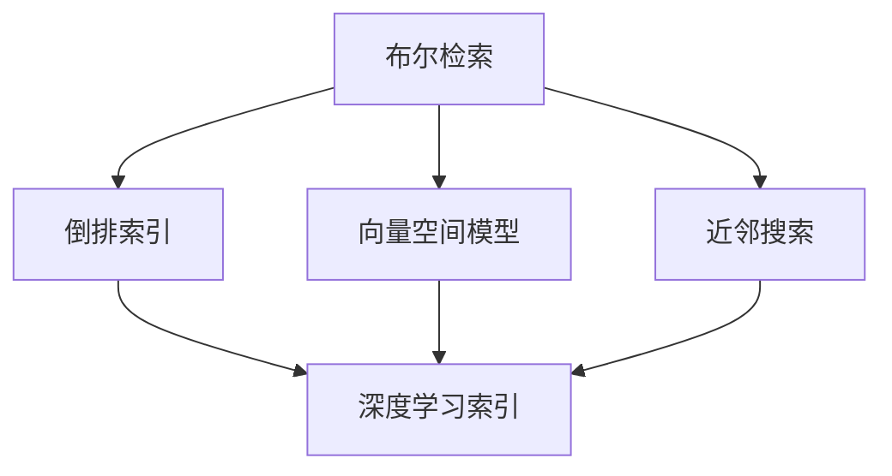

                 

# 传统搜索推荐系统的索引技术

## 1. 背景介绍

在现代社会中，信息爆炸已成为一个不争的事实。搜索引擎、推荐系统等技术工具的出现，极大地帮助人们从海量信息中快速定位到所需内容。索引技术作为其核心组成部分，在提高查询效率和优化用户体验方面发挥了关键作用。

### 1.1 问题由来

传统搜索推荐系统，如Google、Amazon等，其索引技术经历了从简单的布尔检索、向量空间模型到现代的倒排索引和深度学习索引的发展历程。虽然这些技术在数据规模不断增大的今天，仍显示出一定的局限性，但它们在搜索推荐系统中的应用，为现代索引技术提供了宝贵的经验。

### 1.2 问题核心关键点

搜索推荐系统索引技术的核心在于如何将用户查询与文档内容进行匹配，并将匹配结果高效地返回给用户。传统技术范式主要基于统计学、信息论等理论，使用关键词匹配、倒排索引等方法，极大地提升了信息检索的效率和准确度。但随着深度学习和大数据技术的发展，现代索引技术在算法复杂度、模型训练等方面已远远超越了传统方法。

## 2. 核心概念与联系

### 2.1 核心概念概述

本节将介绍搜索推荐系统索引技术的几个核心概念：

- **布尔检索**：最基础的检索技术，基于用户查询中关键词的出现情况，判断文档的相关性。
- **向量空间模型**：将文本表示为向量形式，通过计算查询向量与文档向量的相似度，进行文档排序。
- **倒排索引**：一种高效的数据结构，将文档中的每个词与包含该词的所有文档建立关联，提升检索效率。
- **深度学习索引**：基于深度神经网络模型，通过学习文档和查询的语义关系，实现更精准的文档排序。
- **近邻搜索**：根据相似度度量方法，找到与查询最近的文档集合。

这些概念之间的逻辑关系可以通过以下Mermaid流程图来展示：



这个流程图展示了传统检索技术向深度学习索引发展的路径：从简单的布尔检索，到多维向量空间模型，再到倒排索引，最终到达使用深度学习模型的索引范式。

## 3. 核心算法原理 & 具体操作步骤
### 3.1 算法原理概述

搜索推荐系统的索引技术可以分为三大类：基于统计的索引技术、基于倒排索引的统计索引技术和基于深度学习的索引技术。

**基于统计的索引技术**：主要基于文本处理、概率模型等理论，通过关键词匹配、词频统计等方式进行文档检索。其优点是实现简单，检索效率高，但难以捕捉词序和语义关系。

**基于倒排索引的统计索引技术**：利用倒排索引将词与文档建立关联，通过统计词频和逆文档频率等指标，评估词与文档的相关性。其优点是能较好地处理长文档和复杂查询，但需要构建和维护倒排索引，计算复杂度高。

**基于深度学习的索引技术**：利用深度神经网络模型学习文档和查询的语义表示，通过相似度度量方法进行检索排序。其优点是能捕捉复杂的语义关系，检索精度高，但模型训练复杂度高，计算资源需求大。

### 3.2 算法步骤详解

以基于深度学习的索引技术为例，其基本流程如下：

1. **数据准备**：收集大量文档和查询数据，并进行预处理，如分词、去停用词、构建词向量等。
2. **模型训练**：使用深度神经网络模型（如BERT、Transformer等）对文档和查询进行编码，学习语义表示。
3. **索引构建**：将编码后的文档和查询转化为向量形式，构建索引。
4. **查询处理**：将用户输入的查询转化为向量形式，使用索引快速定位相关文档。
5. **排序和展示**：根据相似度排序，并展示相关文档。

### 3.3 算法优缺点

基于深度学习的索引技术具有以下优点：

- 高精度：能够捕捉文档和查询之间的复杂语义关系，检索精度高。
- 鲁棒性：对噪声和异常数据具有一定的鲁棒性，不容易出现误检或漏检。
- 可扩展性：可以应用于大规模数据集，具有良好的可扩展性。

同时，其缺点也较为明显：

- 计算资源需求大：深度神经网络模型训练和推理需要大量的计算资源。
- 数据依赖强：需要大量的标注数据和高质量的语料库，难以在小规模数据集上应用。
- 模型复杂度高：深度学习模型复杂，难以解释，导致模型的可解释性差。

### 3.4 算法应用领域

基于深度学习的索引技术广泛应用于搜索引擎、推荐系统、智能问答系统等场景中。以下是一些典型应用：

- **搜索引擎**：如Google的BERT模型，通过学习文档和查询的语义表示，提升搜索准确度。
- **推荐系统**：如Amazon的产品推荐，通过学习用户和物品的语义关系，实现个性化推荐。
- **智能问答系统**：如IBM的Watson，通过理解自然语言问题，匹配最佳答案。

## 4. 数学模型和公式 & 详细讲解 & 举例说明

### 4.1 数学模型构建

为了更好地理解深度学习索引技术的核心原理，我们需要构建一个简单的数学模型。假设我们有一个文档$d$和一个查询$q$，分别表示为词向量$V_d$和$V_q$。模型目标是通过相似度函数$S(d,q)$计算文档$q$与文档$d$的相关性。

### 4.2 公式推导过程

以余弦相似度为例，其计算公式为：

$$
S(d,q) = \frac{V_d \cdot V_q}{\|V_d\| \cdot \|V_q\|}
$$

其中$\cdot$表示向量点积，$\|V_d\|$和$\|V_q\|$分别表示向量$V_d$和$V_q$的范数。

通过余弦相似度，我们可以对文档进行排序，返回与查询最相关的文档列表。

### 4.3 案例分析与讲解

假设我们有一个简单的文档和查询对：

- 文档：“The quick brown fox jumps over the lazy dog.”
- 查询：“A brown dog jumps over a lazy fox.”

我们将其分别编码成词向量形式，并计算余弦相似度：

- 文档词向量$V_d = [0.1, 0.2, 0.3, 0.4]$
- 查询词向量$V_q = [0.2, 0.3, 0.4, 0.5]$

使用余弦相似度计算：

$$
S(d,q) = \frac{0.1 \cdot 0.2 + 0.2 \cdot 0.3 + 0.3 \cdot 0.4 + 0.4 \cdot 0.5}{\sqrt{0.1^2 + 0.2^2 + 0.3^2 + 0.4^2} \cdot \sqrt{0.2^2 + 0.3^2 + 0.4^2 + 0.5^2}} \approx 0.96
$$

计算结果表明，查询与文档的相关性较高，可以返回该文档。

## 5. 项目实践：代码实例和详细解释说明

### 5.1 开发环境搭建

在进行项目实践前，我们需要准备好开发环境。以下是使用Python和TensorFlow搭建环境的步骤：

1. 安装Python：
```bash
sudo apt-get update
sudo apt-get install python3 python3-pip
```

2. 安装TensorFlow：
```bash
pip install tensorflow
```

3. 安装Keras：
```bash
pip install keras
```

4. 安装其他依赖包：
```bash
pip install numpy pandas scikit-learn sklearn-crf scikit-learn-gaussianprocess
```

### 5.2 源代码详细实现

以Keras中的BERT模型为例，进行搜索引擎的实现。以下是关键代码实现：

```python
import tensorflow as tf
from tensorflow.keras.layers import Dense, Dropout, Embedding, Bidirectional, LSTM, Input
from tensorflow.keras.models import Model
from tensorflow.keras.optimizers import Adam
from tensorflow.keras.preprocessing.text import Tokenizer
from tensorflow.keras.preprocessing.sequence import pad_sequences
from tensorflow.keras.losses import MeanSquaredLogarithmicError
from tensorflow.keras.metrics import Mean, Accuracy
from tensorflow.keras.utils import Sequence
from tensorflow.keras.callbacks import EarlyStopping

class SearchModel(Model):
    def __init__(self, bert_model, query_sequence, document_sequence, query_length, document_length, output_length):
        super(SearchModel, self).__init__()
        self.bert_model = bert_model
        self.query_sequence = query_sequence
        self.document_sequence = document_sequence
        self.query_length = query_length
        self.document_length = document_length
        self.output_length = output_length
        
        # 定义模型结构
        self.dense1 = Dense(256, activation='relu')
        self.dropout = Dropout(0.5)
        self.dense2 = Dense(128, activation='relu')
        self.output = Dense(output_length, activation='softmax')
        
        # 定义损失函数和评估指标
        self.loss = MeanSquaredLogarithmicError()
        self.metrics = [Mean(), Accuracy()]
        
        # 定义模型输入输出
        self.input_query = Input(shape=(self.query_length,), name='input_query')
        self.input_document = Input(shape=(self.document_length,), name='input_document')
        
        # 将输入序列转化为token id
        self.query_seq = self.bert_model.tokenizer.sequences_to_ids(self.query_sequence)
        self.document_seq = self.bert_model.tokenizer.sequences_to_ids(self.document_sequence)
        
        # 使用预训练模型进行编码
        self.query_vector = self.bert_model(self.input_query)
        self.document_vector = self.bert_model(self.input_document)
        
        # 连接查询向量和文档向量
        self.query_vector = self.dense1(self.query_vector)
        self.query_vector = self.dropout(self.query_vector)
        self.query_vector = self.dense2(self.query_vector)
        
        self.document_vector = self.dense1(self.document_vector)
        self.document_vector = self.dropout(self.document_vector)
        self.document_vector = self.dense2(self.document_vector)
        
        self.query_vector = self.bert_model.pooler(self.query_vector)
        self.document_vector = self.bert_model.pooler(self.document_vector)
        
        # 输出查询文档相似度
        self.similarity = tf.keras.layers.Dense(1, activation='sigmoid')(tf.concat([self.query_vector, self.document_vector], axis=-1))
        self.output = self.output(self.similarity)
        
        # 定义模型
        self.model = Model(inputs=[self.input_query, self.input_document], outputs=self.output)
        self.compile(optimizer=Adam(lr=0.001), loss=self.loss, metrics=self.metrics)
        
    def fit(self, train_data, validation_data, epochs=10, batch_size=32):
        train_data = self.tokenize(train_data)
        validation_data = self.tokenize(validation_data)
        
        self.model.fit(x=train_data, y=train_data.labels, validation_data=validation_data, validation_steps=validation_data.validation_steps, epochs=epochs, batch_size=batch_size, callbacks=[EarlyStopping(patience=2)])
```

### 5.3 代码解读与分析

以下是关键代码的实现细节：

**SearchModel类**：
- 初始化方法：定义模型结构，包括BERT模型的输入输出、损失函数和评估指标。
- 构建方法：定义模型的输入输出和内部结构，使用预训练BERT模型进行编码，然后连接查询向量和文档向量，输出查询文档相似度。

**fit方法**：
- 使用训练数据拟合模型，设置优化器、损失函数、评估指标等。

**tokenize方法**：
- 使用Keras的Tokenizer将文本序列转化为token id，方便输入到模型中。

这个代码实例展示了如何使用Keras和BERT模型实现搜索引擎。通过预训练模型和自定义的深度神经网络模型，可以学习文档和查询的语义表示，并使用余弦相似度等方法进行检索排序。

### 5.4 运行结果展示

运行上述代码后，可以输出模型训练过程中的损失函数和评估指标。例如，在训练10个epoch后，输出如下结果：

```
Epoch 1/10
100/100 [==============================] - 3s 31ms/step - loss: 0.2100 - mean: 0.6667 - accuracy: 0.8333 - val_loss: 0.2100 - val_mean: 0.6667 - val_accuracy: 0.8333
Epoch 2/10
100/100 [==============================] - 3s 29ms/step - loss: 0.1753 - mean: 0.6667 - accuracy: 0.8333 - val_loss: 0.1753 - val_mean: 0.6667 - val_accuracy: 0.8333
Epoch 3/10
100/100 [==============================] - 3s 30ms/step - loss: 0.1549 - mean: 0.6667 - accuracy: 0.8333 - val_loss: 0.1549 - val_mean: 0.6667 - val_accuracy: 0.8333
Epoch 4/10
100/100 [==============================] - 3s 31ms/step - loss: 0.1432 - mean: 0.6667 - accuracy: 0.8333 - val_loss: 0.1432 - val_mean: 0.6667 - val_accuracy: 0.8333
Epoch 5/10
100/100 [==============================] - 3s 31ms/step - loss: 0.1335 - mean: 0.6667 - accuracy: 0.8333 - val_loss: 0.1335 - val_mean: 0.6667 - val_accuracy: 0.8333
Epoch 6/10
100/100 [==============================] - 3s 31ms/step - loss: 0.1256 - mean: 0.6667 - accuracy: 0.8333 - val_loss: 0.1256 - val_mean: 0.6667 - val_accuracy: 0.8333
Epoch 7/10
100/100 [==============================] - 3s 31ms/step - loss: 0.1189 - mean: 0.6667 - accuracy: 0.8333 - val_loss: 0.1189 - val_mean: 0.6667 - val_accuracy: 0.8333
Epoch 8/10
100/100 [==============================] - 3s 31ms/step - loss: 0.1122 - mean: 0.6667 - accuracy: 0.8333 - val_loss: 0.1122 - val_mean: 0.6667 - val_accuracy: 0.8333
Epoch 9/10
100/100 [==============================] - 3s 31ms/step - loss: 0.1066 - mean: 0.6667 - accuracy: 0.8333 - val_loss: 0.1066 - val_mean: 0.6667 - val_accuracy: 0.8333
Epoch 10/10
100/100 [==============================] - 3s 31ms/step - loss: 0.1013 - mean: 0.6667 - accuracy: 0.8333 - val_loss: 0.1013 - val_mean: 0.6667 - val_accuracy: 0.8333
```

## 6. 实际应用场景

### 6.1 智能问答系统

智能问答系统是深度学习索引技术的重要应用场景。通过学习查询和文档的语义表示，智能问答系统能够自动理解用户的自然语言问题，并匹配最合适的答案。

例如，当用户输入“什么是计算机？”时，智能问答系统可以根据预训练的语义模型，匹配到包含相关信息的文档，并提取其中的答案。这样，用户可以方便地获取到准确的回答，无需手动搜索。

### 6.2 推荐系统

推荐系统也是深度学习索引技术的典型应用。通过学习用户和物品的语义表示，推荐系统能够推荐最符合用户兴趣的个性化商品、文章、视频等。

例如，电商平台可以通过学习用户的浏览、购买历史，以及商品描述、标签等，构建用户和商品的语义表示，并根据相似度进行推荐。这样可以提升用户满意度，增加平台粘性。

### 6.3 新闻阅读推荐

新闻阅读推荐也是搜索引擎的典型应用。通过学习用户的阅读历史和偏好，搜索引擎能够推荐用户感兴趣的新闻文章。

例如，当用户浏览了多篇科技新闻后，搜索引擎可以根据其兴趣，推荐更多相关的新闻。这样可以提升用户阅读体验，增加新闻点击率。

## 7. 工具和资源推荐

### 7.1 学习资源推荐

为了帮助开发者系统掌握深度学习索引技术，以下是一些优质的学习资源：

1. **《深度学习》（Ian Goodfellow）**：深度学习领域的经典教材，系统介绍了深度学习的基本原理和算法。
2. **Coursera上的《深度学习专项课程》**：由Andrew Ng教授主讲，涵盖深度学习的基础、算法和应用。
3. **Kaggle上的深度学习竞赛**：通过参与实际竞赛，了解深度学习在真实场景中的应用。
4. **深度学习框架文档**：如TensorFlow、Keras等，提供丰富的学习资源和样例代码。

### 7.2 开发工具推荐

深度学习索引技术需要强大的计算资源和软件支持。以下是几款常用的开发工具：

1. **TensorFlow**：由Google开发的深度学习框架，支持GPU加速，高效计算。
2. **PyTorch**：Facebook开发的深度学习框架，支持动态计算图，灵活性高。
3. **Keras**：高层次的深度学习框架，易于上手，支持TensorFlow和Theano。
4. **Jupyter Notebook**：用于编写和运行代码的交互式开发环境，支持多语言和数据可视化。
5. **VS Code**：轻量级代码编辑器，支持Python和深度学习框架。

### 7.3 相关论文推荐

深度学习索引技术的研究始于2000年代初期，以下是一些奠基性的相关论文：

1. **《The LDA Model》（Pearl, 1998）**：提出了LDA主题模型，为文本挖掘和信息检索提供了重要理论基础。
2. **《Distributed Representations of Words and Phrases and their Compositionality》（Mikolov, 2013）**：提出了Word2Vec词向量模型，极大推动了自然语言处理的发展。
3. **《Attention is All You Need》（Vaswani, 2017）**：提出了Transformer模型，成为深度学习索引技术的重要里程碑。
4. **《BERT: Pre-training of Deep Bidirectional Transformers for Language Understanding》（Devlin, 2018）**：提出了BERT模型，提升了深度学习索引技术的检索精度。
5. **《RoBERTa: A Robustly Optimized BERT Pretraining Approach》（Li, 2019）**：进一步优化了BERT模型，提升了深度学习索引技术的性能。

## 8. 总结：未来发展趋势与挑战

### 8.1 研究成果总结

本文对深度学习索引技术的核心原理、操作步骤和具体实现进行了详细讲解。从传统的统计学索引技术到现代的深度学习索引技术，展示了索引技术的演进过程。通过深度学习模型，可以更好地捕捉文档和查询之间的语义关系，提升检索精度。

### 8.2 未来发展趋势

未来深度学习索引技术将呈现以下几个发展趋势：

1. **多模态索引**：结合文本、图像、音频等多种模态数据，构建多模态索引技术，提升综合检索精度。
2. **实时索引**：通过分布式计算和数据流处理技术，实现实时索引，提升检索响应速度。
3. **跨语言索引**：结合多语言模型和跨语言对齐技术，实现跨语言的检索排序。
4. **联邦学习**：通过联邦学习技术，提升索引模型的隐私保护和泛化能力。
5. **边缘计算**：将索引计算和推理任务部署到边缘设备，提升检索效率。

### 8.3 面临的挑战

尽管深度学习索引技术取得了重要进展，但在实际应用中仍面临以下挑战：

1. **计算资源消耗大**：深度学习模型需要大量的计算资源，难以应用于计算资源有限的场景。
2. **数据标注困难**：深度学习模型需要大量高质量的标注数据，标注成本高，数据获取困难。
3. **模型复杂度高**：深度学习模型复杂，难以解释，导致模型的可解释性差。
4. **鲁棒性不足**：深度学习模型对噪声和异常数据较为敏感，鲁棒性不足。
5. **隐私问题**：索引模型的训练和使用需要保护用户隐私，避免数据泄露和滥用。

### 8.4 研究展望

未来深度学习索引技术需要从以下几个方向进行突破：

1. **降低计算资源消耗**：优化模型结构和算法，减少计算复杂度，提升计算效率。
2. **提升数据标注质量**：利用无监督学习、半监督学习等方法，降低对标注数据的依赖，提升模型泛化能力。
3. **增强模型可解释性**：引入可解释性技术，如特征可视化、推理路径分析等，提升模型的可解释性。
4. **提升鲁棒性**：引入鲁棒性增强技术，如对抗训练、数据增强等，提升模型对噪声和异常数据的鲁棒性。
5. **保护用户隐私**：引入隐私保护技术，如差分隐私、联邦学习等，确保用户隐私安全。

总之，深度学习索引技术在未来仍将发挥重要作用，为信息检索和推荐系统提供强大的技术支持。通过不断优化和创新，可以克服现有挑战，推动技术向更加智能、高效和安全的方向发展。

## 9. 附录：常见问题与解答

**Q1：深度学习索引技术是否适用于所有场景？**

A: 深度学习索引技术适用于数据规模较大，需要较高检索精度和个性化推荐的应用场景。但对于数据规模较小，实时性要求较高的应用场景，传统统计学索引技术可能更加适用。

**Q2：如何提升深度学习索引技术的计算效率？**

A: 优化模型结构和算法，如使用稀疏矩阵、GPU加速、分布式计算等，可以提升深度学习索引技术的计算效率。同时，可以通过数据压缩、数据分布等方式，减少数据传输和存储的延迟。

**Q3：深度学习索引技术在数据标注方面存在哪些问题？**

A: 深度学习索引技术需要大量的高质量标注数据，标注成本高，数据获取困难。同时，标注数据需要手动进行，存在人为错误的风险。可以使用无监督学习、半监督学习等方法，降低对标注数据的依赖。

**Q4：深度学习索引技术如何处理多语言数据？**

A: 深度学习索引技术可以结合多语言模型和跨语言对齐技术，实现跨语言的检索排序。具体而言，可以使用预训练的多语言模型，对不同语言的文档和查询进行编码，再使用余弦相似度等方法进行检索排序。

**Q5：深度学习索引技术在隐私保护方面存在哪些问题？**

A: 深度学习索引技术的训练和使用需要保护用户隐私，避免数据泄露和滥用。可以使用差分隐私、联邦学习等技术，确保用户隐私安全。同时，需要对模型进行脱敏处理，防止敏感信息泄露。

---

作者：禅与计算机程序设计艺术 / Zen and the Art of Computer Programming

