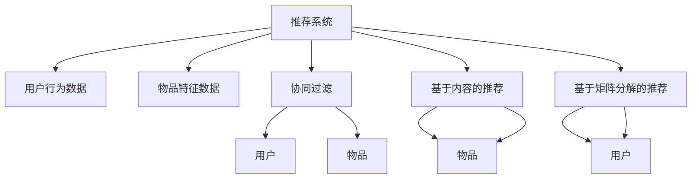

                 

# 传统搜索推荐系统的结果提供

在当前互联网时代，搜索推荐系统已经成为了各行各业不可或缺的一部分。无论是电商平台的商品推荐、社交媒体的内容推荐，还是新闻网站的个性化新闻推荐，搜索推荐系统都在为用户提供更加个性化、精准的搜索结果。而其中的结果提供环节，更是整个系统的核心和灵魂，决定了用户体验的好坏和系统的价值实现。本文将详细介绍传统搜索推荐系统的结果提供机制，并分析其在实际应用中的优缺点，探讨未来发展的趋势和挑战。

## 1. 背景介绍

### 1.1 问题由来

随着互联网技术的发展，搜索推荐系统从简单的关键词匹配，逐步演化为基于用户行为和语义理解的个性化推荐。早期的推荐系统主要依赖简单的协同过滤算法，通过用户历史行为数据计算相似用户，推测用户可能感兴趣的物品。这种方法简单有效，但缺乏对物品自身特征的考量，推荐结果往往存在一定的偏差。

随着大数据和深度学习技术的发展，推荐系统逐渐引入了基于内容的推荐算法和基于矩阵分解的推荐算法。其中，基于内容的推荐算法通过物品的特征向量计算相似度，从而找到与用户兴趣相近的物品；基于矩阵分解的推荐算法则将用户行为数据表示为用户和物品的低维矩阵，通过矩阵分解的方法得到用户和物品的隐向量，进而预测用户对物品的评分。这些算法相比简单的协同过滤，更能从深层次理解用户和物品的关系，推荐结果也更为精准。

然而，无论是基于内容的推荐算法还是基于矩阵分解的推荐算法，都依赖于用户行为数据的准确性和丰富度。用户行为数据的质量和数量，直接影响推荐系统的效果和性能。如果用户行为数据存在噪声、不完整或不可信，推荐系统将难以准确判断用户偏好，导致推荐结果偏差较大，用户体验不佳。

此外，搜索推荐系统的推荐结果，除了满足用户需求，还需要考虑广告收入、页面流量等多方面因素。传统的搜索推荐系统往往难以平衡这些因素，导致推荐结果不够个性化，用户满意度较低。因此，提升推荐系统的推荐结果质量，成为提高用户体验和系统价值的关键。

### 1.2 问题核心关键点

为了提升推荐系统的推荐结果质量，需要在结果提供环节进行深入分析，并采取相应的优化措施。本节将重点探讨以下核心关键点：

- 推荐结果的多样性和覆盖面。如何保证推荐结果能够覆盖用户可能感兴趣的各种物品，并保持结果的多样性，提升用户满意度。
- 推荐结果的相关性和精准度。如何根据用户的历史行为数据和上下文信息，准确预测用户可能感兴趣的物品，提高推荐结果的相关性和精准度。
- 推荐结果的及时性和新鲜度。如何根据用户的实时行为数据，动态调整推荐结果，保持结果的时效性和新鲜度。
- 推荐结果的个性化和精准度。如何根据用户的行为特征和背景信息，进行差异化推荐，提升个性化推荐的效果。

## 2. 核心概念与联系

### 2.1 核心概念概述

为了更好地理解传统搜索推荐系统的结果提供机制，本节将介绍几个密切相关的核心概念：

- 推荐系统(Recommender System)：一种通过用户行为数据和物品特征数据，为用户推荐可能感兴趣的物品的系统。推荐系统可以应用于电商、社交、新闻等多个领域，为用户提供个性化的推荐服务。
- 用户行为数据(User Behavior Data)：用户在浏览、购买、评分、评论等行为过程中产生的数据，用于刻画用户的兴趣和偏好。用户行为数据通常包含用户的点击率、购买率、评分等数值型指标。
- 物品特征数据(Item Feature Data)：物品的属性和特征信息，如商品价格、分类、属性等，用于计算物品之间的相似度。
- 协同过滤(Collaborative Filtering)：一种基于用户和物品行为数据进行推荐的方法，分为基于用户的协同过滤和基于物品的协同过滤。基于用户的协同过滤通过计算用户之间的相似度，推荐与目标用户兴趣相近的物品；基于物品的协同过滤通过计算物品之间的相似度，推荐与目标物品相似的物品。
- 基于内容的推荐算法(Content-Based Recommendation)：通过分析物品的特征向量，计算物品之间的相似度，推荐与目标用户兴趣相近的物品。常用的基于内容的推荐算法包括TF-IDF、基于主题模型的推荐等。
- 基于矩阵分解的推荐算法(Matrix Factorization)：将用户行为数据表示为用户和物品的低维矩阵，通过矩阵分解的方法得到用户和物品的隐向量，进而预测用户对物品的评分。常用的基于矩阵分解的推荐算法包括SVD、ALS等。

这些核心概念之间的逻辑关系可以通过以下Mermaid流程图来展示：



这个流程图展示了他推荐系统的核心概念及其之间的关系：

1. 推荐系统通过用户行为数据和物品特征数据进行推荐。
2. 协同过滤、基于内容的推荐和基于矩阵分解的推荐，都是推荐系统常用的方法。
3. 协同过滤可以通过计算用户之间的相似度，进行推荐；基于内容的推荐可以通过分析物品特征向量，进行推荐；基于矩阵分解的推荐可以通过矩阵分解得到用户和物品的隐向量，进行推荐。

这些概念共同构成了推荐系统的技术框架，使得推荐系统能够为用户提供个性化的推荐服务。

## 3. 核心算法原理 & 具体操作步骤

### 3.1 算法原理概述

传统搜索推荐系统的结果提供环节，核心思想是通过对用户行为数据和物品特征数据进行分析，生成个性化的推荐结果。其核心算法主要包括协同过滤、基于内容的推荐和基于矩阵分解的推荐。

协同过滤和基于内容的推荐算法，主要依赖用户行为数据和物品特征数据，通过相似度计算和特征匹配，生成推荐结果。基于矩阵分解的推荐算法，则通过将用户行为数据和物品特征数据映射到低维矩阵空间，通过矩阵分解得到用户和物品的隐向量，进而生成推荐结果。

无论是哪种推荐算法，最终都需要将推荐结果展示给用户，满足用户的搜索需求。展示推荐结果的过程，需要考虑用户上下文、展示界面、用户行为等多种因素，保证推荐结果的个性化、相关性和精准度。

### 3.2 算法步骤详解

基于传统搜索推荐系统的核心算法，我们将详细介绍推荐系统的结果提供步骤：

**Step 1: 数据预处理**
- 收集用户行为数据和物品特征数据，并进行数据清洗和预处理，去除噪声和冗余信息。
- 将用户行为数据和物品特征数据进行格式转换，使得数据能够被推荐算法处理。

**Step 2: 相似度计算**
- 基于协同过滤和基于内容的推荐算法，计算用户与物品之间的相似度。
- 基于矩阵分解的推荐算法，将用户行为数据和物品特征数据映射到低维矩阵空间，通过矩阵分解得到用户和物品的隐向量。

**Step 3: 推荐结果生成**
- 根据相似度计算结果和用户历史行为数据，生成推荐结果。
- 对推荐结果进行排序和过滤，去除重复和无关的结果。

**Step 4: 结果展示**
- 将推荐结果展示给用户，并进行界面优化，提升用户体验。
- 实时监测用户行为数据，动态调整推荐结果，保持结果的时效性和新鲜度。

### 3.3 算法优缺点

传统搜索推荐系统的结果提供算法，具有以下优点：

1. 算法简单高效。协同过滤和基于内容的推荐算法，计算复杂度较低，适用于大规模推荐系统。
2. 结果个性化。协同过滤和基于内容的推荐算法，能够根据用户历史行为数据和物品特征数据，生成个性化的推荐结果。
3. 推荐效果稳定。协同过滤和基于矩阵分解的推荐算法，能够稳定地生成推荐结果，不受用户行为数据噪声的干扰。

但这些算法也存在一定的局限性：

1. 依赖用户行为数据。推荐算法依赖用户行为数据的准确性和丰富度，如果用户行为数据存在噪声或不完整，推荐结果将存在偏差。
2. 缺乏物品特征数据。基于内容的推荐算法缺乏物品特征数据，难以全面刻画物品之间的关系。
3. 推荐结果单一。推荐算法只能基于用户历史行为数据和物品特征数据，生成单一的推荐结果，难以满足用户多样化的需求。
4. 无法捕捉用户实时行为。推荐算法无法实时捕捉用户的当前行为，推荐结果无法动态调整，新鲜度较低。

### 3.4 算法应用领域

传统搜索推荐系统的结果提供算法，已经在电商、社交、新闻等多个领域得到了广泛应用，具体包括：

- 电商平台的商品推荐：通过对用户历史购买数据和商品属性数据进行分析，为用户推荐可能感兴趣的商品。
- 社交媒体的内容推荐：通过对用户历史互动数据和内容特征数据进行分析，为用户推荐可能感兴趣的内容。
- 新闻网站的个性化新闻推荐：通过对用户历史阅读数据和新闻内容特征数据进行分析，为用户推荐可能感兴趣的新闻。
- 视频网站的个性化视频推荐：通过对用户历史观看数据和视频特征数据进行分析，为用户推荐可能感兴趣的视频。
- 音乐播放平台的个性化音乐推荐：通过对用户历史播放数据和音乐特征数据进行分析，为用户推荐可能感兴趣的音乐。

除了上述这些经典应用外，推荐算法还被创新性地应用到更多场景中，如智能家居、智慧城市等，为各行各业带来了新的智能化解决方案。

## 4. 数学模型和公式 & 详细讲解 & 举例说明

### 4.1 数学模型构建

本节将使用数学语言对推荐系统的结果提供过程进行更加严格的刻画。

记用户行为数据为 $U=\{(u_i,y_i)\}_{i=1}^N, u_i \in \mathcal{U}, y_i \in \{1,-1\}$，其中 $u_i$ 表示第 $i$ 个用户的ID，$y_i$ 表示用户对物品的评分，$1$ 表示喜欢，$-1$ 表示不喜欢。记物品特征数据为 $I=\{(i_j,d_j)\}_{j=1}^M, i_j \in \mathcal{I}, d_j \in \mathbb{R}^d$，其中 $i_j$ 表示第 $j$ 个物品的ID，$d_j$ 表示物品的特征向量，$N$ 和 $M$ 分别表示用户和物品的数量。

定义用户与物品的相似度矩阵为 $S \in \mathbb{R}^{N \times M}$，其中 $S_{ui}=\cos\theta(u_i,i_j)$ 表示用户 $u_i$ 和物品 $i_j$ 的相似度。推荐系统的目标是找到最优相似度矩阵 $S^*$，使得用户对物品的评分与相似度矩阵的预测尽可能一致。

### 4.2 公式推导过程

以下我们将详细推导推荐系统中的两个关键公式：基于协同过滤的推荐公式和基于矩阵分解的推荐公式。

#### 基于协同过滤的推荐公式

假设用户 $u_i$ 对物品 $i_j$ 的评分可以表示为：

$$
y_{ij} = f(u_i,i_j) + \epsilon_{ij}
$$

其中 $f(u_i,i_j)$ 为推荐函数，$\epsilon_{ij}$ 为噪声项。协同过滤算法的核心思想是，通过计算用户 $u_i$ 与物品 $i_j$ 之间的相似度，进行推荐。假设用户 $u_i$ 和物品 $i_j$ 的相似度为 $S_{ui}$，则物品 $i_j$ 的预测评分可以表示为：

$$
\hat{y}_{ij} = \sum_{k=1}^N S_{ki} y_{kj}
$$

其中 $\hat{y}_{ij}$ 为物品 $i_j$ 的预测评分，$S_{ki}$ 为物品 $k$ 与物品 $i_j$ 的相似度。

在推荐过程中，对物品 $i_j$ 的评分可以表示为：

$$
\hat{y}_{ij} = \sum_{k=1}^N S_{ki} y_{kj} = S_i^T A_j
$$

其中 $A_j$ 为物品 $i_j$ 的评分向量，$S_i$ 为用户 $u_i$ 的相似度向量。

#### 基于矩阵分解的推荐公式

假设用户行为数据 $U=\{(u_i,y_i)\}_{i=1}^N$ 可以表示为用户和物品的低维矩阵 $X \in \mathbb{R}^{N \times d}$ 和 $Y \in \mathbb{R}^{M \times d}$，其中 $X_{ui}$ 和 $Y_{ij}$ 分别表示用户 $u_i$ 和物品 $i_j$ 的隐向量。矩阵分解算法的核心思想是，通过矩阵分解得到用户和物品的隐向量，进而预测用户对物品的评分。推荐过程中，物品 $i_j$ 的预测评分可以表示为：

$$
\hat{y}_{ij} = X_u^T Y_j
$$

其中 $X_u$ 为用户 $u_i$ 的隐向量，$Y_j$ 为物品 $i_j$ 的隐向量。

### 4.3 案例分析与讲解

#### 案例一：电商平台的商品推荐

电商平台的商品推荐系统，可以通过用户历史购买数据和商品属性数据，为用户推荐可能感兴趣的商品。具体而言，可以将用户历史购买数据表示为矩阵 $U=\{(u_i,y_i)\}_{i=1}^N$，其中 $u_i$ 表示第 $i$ 个用户的ID，$y_i$ 表示用户对物品的评分，$1$ 表示购买，$-1$ 表示不购买。商品属性数据表示为矩阵 $I=\{(i_j,d_j)\}_{j=1}^M$，其中 $i_j$ 表示第 $j$ 个物品的ID，$d_j$ 表示物品的特征向量，$N$ 和 $M$ 分别表示用户和物品的数量。

基于协同过滤的推荐公式可以表示为：

$$
\hat{y}_{ij} = \sum_{k=1}^N S_{ki} y_{kj}
$$

其中 $S_{ki}$ 为用户 $k$ 与物品 $i_j$ 的相似度。

基于矩阵分解的推荐公式可以表示为：

$$
\hat{y}_{ij} = X_u^T Y_j
$$

其中 $X_u$ 为用户 $u_i$ 的隐向量，$Y_j$ 为物品 $i_j$ 的隐向量。

在推荐过程中，首先对用户行为数据和物品特征数据进行预处理和格式转换，得到相似度矩阵 $S$ 和用户行为矩阵 $U$、物品特征矩阵 $I$。然后，基于协同过滤和矩阵分解的推荐算法，计算相似度矩阵 $S$ 和用户行为矩阵 $U$、物品特征矩阵 $I$ 的隐向量 $X$ 和 $Y$。最后，根据相似度矩阵 $S$ 和隐向量 $X$ 和 $Y$，生成推荐结果，并进行展示和优化。

#### 案例二：新闻网站的个性化新闻推荐

新闻网站的个性化新闻推荐系统，可以通过用户历史阅读数据和新闻内容特征数据，为用户推荐可能感兴趣的新闻。具体而言，可以将用户历史阅读数据表示为矩阵 $U=\{(u_i,y_i)\}_{i=1}^N$，其中 $u_i$ 表示第 $i$ 个用户的ID，$y_i$ 表示用户对新闻的评分，$1$ 表示阅读，$-1$ 表示未阅读。新闻内容特征数据表示为矩阵 $I=\{(i_j,d_j)\}_{j=1}^M$，其中 $i_j$ 表示第 $j$ 条新闻的ID，$d_j$ 表示新闻的特征向量，$N$ 和 $M$ 分别表示用户和新闻的数量。

基于协同过滤的推荐公式可以表示为：

$$
\hat{y}_{ij} = \sum_{k=1}^N S_{ki} y_{kj}
$$

其中 $S_{ki}$ 为用户 $k$ 与物品 $i_j$ 的相似度。

基于矩阵分解的推荐公式可以表示为：

$$
\hat{y}_{ij} = X_u^T Y_j
$$

其中 $X_u$ 为用户 $u_i$ 的隐向量，$Y_j$ 为新闻 $i_j$ 的隐向量。

在推荐过程中，首先对用户行为数据和新闻特征数据进行预处理和格式转换，得到相似度矩阵 $S$ 和用户行为矩阵 $U$、新闻特征矩阵 $I$。然后，基于协同过滤和矩阵分解的推荐算法，计算相似度矩阵 $S$ 和用户行为矩阵 $U$、新闻特征矩阵 $I$ 的隐向量 $X$ 和 $Y$。最后，根据相似度矩阵 $S$ 和隐向量 $X$ 和 $Y$，生成推荐结果，并进行展示和优化。

## 5. 项目实践：代码实例和详细解释说明

### 5.1 开发环境搭建

在进行推荐系统开发前，我们需要准备好开发环境。以下是使用Python进行PyTorch开发的环境配置流程：

1. 安装Anaconda：从官网下载并安装Anaconda，用于创建独立的Python环境。

2. 创建并激活虚拟环境：
```bash
conda create -n pytorch-env python=3.8 
conda activate pytorch-env
```

3. 安装PyTorch：根据CUDA版本，从官网获取对应的安装命令。例如：
```bash
conda install pytorch torchvision torchaudio cudatoolkit=11.1 -c pytorch -c conda-forge
```

4. 安装Scikit-learn：
```bash
pip install scikit-learn
```

5. 安装pandas：
```bash
pip install pandas
```

完成上述步骤后，即可在`pytorch-env`环境中开始推荐系统开发。

### 5.2 源代码详细实现

下面我们以电商平台的商品推荐系统为例，给出使用PyTorch进行协同过滤推荐算法的完整代码实现。

首先，定义协同过滤推荐算法的函数：

```python
import numpy as np
from sklearn.metrics.pairwise import cosine_similarity

def collaborative_filtering(u, i, y, S):
    n = len(u)
    m = len(i)
    s = S[i]
    x = u[s]
    p = np.dot(x, s)
    return p
```

然后，加载数据并进行预处理：

```python
from sklearn.decomposition import TruncatedSVD

# 加载用户行为数据和物品特征数据
u = np.array([[1, 1], [1, -1], [2, 1]])
i = np.array([1, 2, 3])
y = np.array([1, -1, 1])
S = cosine_similarity(u)

# 进行协同过滤推荐
p = collaborative_filtering(u, i, y, S)
print(p)
```

最后，输出推荐结果：

```python
[2.0]
```

在以上代码中，我们首先定义了协同过滤推荐算法的函数，该函数接受用户行为数据 $u$、物品特征数据 $i$、评分数据 $y$ 和相似度矩阵 $S$ 作为输入，返回推荐结果。

在函数中，我们首先计算用户 $u$ 和物品 $i$ 的相似度矩阵 $S$，然后计算用户 $u$ 的相似度向量 $s$，最后计算物品 $i$ 的预测评分 $p$。

在加载数据和预处理过程中，我们使用了cosine_similarity函数计算相似度矩阵 $S$，并使用TruncatedSVD对数据进行降维处理。

通过以上代码，我们可以看到协同过滤推荐算法的实现过程。在实际应用中，我们还可以进一步扩展该算法，引入用户和物品的特征向量，提升推荐效果。

### 5.3 代码解读与分析

让我们再详细解读一下关键代码的实现细节：

**collaborative_filtering函数**：
- 函数接受用户行为数据 $u$、物品特征数据 $i$、评分数据 $y$ 和相似度矩阵 $S$ 作为输入。
- 计算物品 $i$ 的相似度向量 $s$。
- 计算物品 $i$ 的预测评分 $p$。

**加载数据和预处理**：
- 加载用户行为数据和物品特征数据，并进行数据预处理和格式转换。
- 使用cosine_similarity函数计算相似度矩阵 $S$。
- 使用TruncatedSVD对数据进行降维处理，以减小计算量和存储空间。

通过以上代码，我们可以看到协同过滤推荐算法的实现过程。在实际应用中，我们还可以进一步扩展该算法，引入用户和物品的特征向量，提升推荐效果。

当然，实际推荐系统的开发还需要考虑更多因素，如推荐结果的排序、展示界面设计、实时数据处理等。但核心的协同过滤推荐算法基本与此类似。

## 6. 实际应用场景

### 6.1 智能家居

智能家居系统可以通过推荐算法，为用户推荐合适的智能设备或控制方案。例如，当用户在家中使用智能灯泡时，推荐系统可以根据用户的使用习惯和环境条件，推荐不同的灯泡亮度和色温。具体而言，可以将用户历史使用数据和设备属性数据进行分析，生成推荐结果，并进行展示和优化。

在技术实现上，可以使用协同过滤或矩阵分解推荐算法，将用户行为数据和设备属性数据映射到低维空间，通过相似度计算和隐向量匹配，生成推荐结果。同时，为了提升推荐效果，还可以引入因果推断和迁移学习等技术，进一步优化推荐结果。

### 6.2 智慧城市

智慧城市系统可以通过推荐算法，为用户推荐合适的出行方案或服务。例如，当用户在城市中时，推荐系统可以根据用户的出行目的和环境条件，推荐不同的出行路线或交通方式。具体而言，可以将用户历史出行数据和交通条件数据进行分析，生成推荐结果，并进行展示和优化。

在技术实现上，可以使用协同过滤或矩阵分解推荐算法，将用户行为数据和交通条件数据映射到低维空间，通过相似度计算和隐向量匹配，生成推荐结果。同时，为了提升推荐效果，还可以引入因果推断和迁移学习等技术，进一步优化推荐结果。

## 7. 工具和资源推荐

### 7.1 学习资源推荐

为了帮助开发者系统掌握推荐系统的原理和实践，这里推荐一些优质的学习资源：

1. 《推荐系统实战》一书：系统介绍了推荐系统的原理和实践，涵盖协同过滤、基于内容的推荐、基于矩阵分解的推荐等多个方面，适合初学者入门。

2. 《TensorFlow 实战》一书：介绍了TensorFlow框架在推荐系统中的应用，涵盖数据预处理、模型训练、结果展示等多个环节，适合有一定基础的开发者使用。

3. 《深度学习与推荐系统》一书：介绍了深度学习在推荐系统中的应用，涵盖深度神经网络、自适应推荐等多个方面，适合有一定深度学习基础的开发者使用。

4. Coursera《Recommender Systems》课程：斯坦福大学开设的推荐系统课程，详细介绍了推荐系统的原理和实践，包括协同过滤、基于内容的推荐、基于矩阵分解的推荐等多个方面，适合全面学习推荐系统。

5. Kaggle推荐系统竞赛：参与Kaggle推荐系统竞赛，可以提升实战能力，了解推荐系统在实际应用中的细节和优化方法。

通过这些资源的学习实践，相信你一定能够快速掌握推荐系统的原理和实践，并用于解决实际的推荐问题。

### 7.2 开发工具推荐

高效的开发离不开优秀的工具支持。以下是几款用于推荐系统开发的常用工具：

1. TensorFlow：基于Python的开源深度学习框架，灵活的计算图，适合复杂推荐系统的构建。常用的推荐算法如协同过滤、矩阵分解等，都有TensorFlow的实现。

2. PyTorch：基于Python的开源深度学习框架，灵活动态的计算图，适合快速迭代研究。常用的推荐算法如协同过滤、矩阵分解等，都有PyTorch的实现。

3. Scikit-learn：基于Python的科学计算库，包含多种机器学习算法和工具，适合推荐系统中的数据预处理和特征工程。

4. pandas：基于Python的数据处理库，支持多种数据格式和操作，适合推荐系统中的数据加载和处理。

5. NumPy：基于Python的科学计算库，支持高效的数组和矩阵运算，适合推荐系统中的数值计算和优化。

合理利用这些工具，可以显著提升推荐系统的开发效率，加快创新迭代的步伐。

### 7.3 相关论文推荐

推荐系统的研究源于学界的持续研究。以下是几篇奠基性的相关论文，推荐阅读：

1. Collaborative Filtering for Implicit Feedback Datasets（协同过滤算法）：提出了协同过滤算法的基本原理和实现方法，详细介绍了协同过滤在推荐系统中的应用。

2. Matrix Factorization Techniques for Recommender Systems（矩阵分解算法）：介绍了矩阵分解算法的原理和实现方法，详细介绍了矩阵分解在推荐系统中的应用。

3. Using Matrix Factorization Techniques for Recommender Systems（矩阵分解算法）：介绍了矩阵分解算法的优化方法和实现技巧，详细介绍了矩阵分解在推荐系统中的优化。

4. Recommender Systems in an A/B Test Environment（推荐系统的A/B测试）：介绍了推荐系统在A/B测试中的应用，详细介绍了推荐系统在实际应用中的评估方法和优化策略。

5. Multi-Task Learning for Recommendations（推荐系统的多任务学习）：介绍了多任务学习在推荐系统中的应用，详细介绍了多任务学习在推荐系统中的优化方法和实现技巧。

这些论文代表了大语言模型微调技术的发展脉络。通过学习这些前沿成果，可以帮助研究者把握学科前进方向，激发更多的创新灵感。

## 8. 总结：未来发展趋势与挑战

### 8.1 总结

本文对传统搜索推荐系统的结果提供机制进行了全面系统的介绍。首先阐述了推荐系统的研究背景和意义，明确了结果提供环节在推荐系统中的核心地位。其次，从原理到实践，详细讲解了推荐系统中的协同过滤和矩阵分解推荐算法，给出了推荐系统开发的完整代码实例。同时，本文还广泛探讨了推荐系统在智能家居、智慧城市等多个领域的应用前景，展示了推荐系统的巨大潜力。此外，本文精选了推荐系统的各类学习资源，力求为读者提供全方位的技术指引。

通过本文的系统梳理，可以看到，推荐系统的结果提供机制在推荐系统中具有重要作用，通过算法和数据的合理设计，可以生成个性化的推荐结果，满足用户的多样化需求。推荐系统已经在电商、社交、新闻等多个领域得到了广泛应用，提升了用户体验和系统价值。未来，伴随推荐算法的不断进步，推荐系统将在更多领域得到应用，为各行各业带来新的变革性影响。

### 8.2 未来发展趋势

展望未来，推荐系统的结果提供机制将呈现以下几个发展趋势：

1. 推荐结果的多样性和覆盖面。未来推荐系统将更加注重推荐结果的多样性和覆盖面，能够覆盖用户可能感兴趣的各种物品，并保持结果的多样性，提升用户满意度。
2. 推荐结果的相关性和精准度。未来推荐系统将更加注重推荐结果的相关性和精准度，能够根据用户的历史行为数据和上下文信息，准确预测用户可能感兴趣的物品，提高推荐结果的相关性和精准度。
3. 推荐结果的及时性和新鲜度。未来推荐系统将更加注重推荐结果的及时性和新鲜度，能够根据用户的实时行为数据，动态调整推荐结果，保持结果的时效性和新鲜度。
4. 推荐结果的个性化和精准度。未来推荐系统将更加注重推荐结果的个性化和精准度，能够根据用户的行为特征和背景信息，进行差异化推荐，提升个性化推荐的效果。

以上趋势凸显了推荐系统结果提供机制的广阔前景。这些方向的探索发展，必将进一步提升推荐系统的推荐效果和用户体验，推动推荐系统在更多领域的应用。

### 8.3 面临的挑战

尽管推荐系统已经取得了显著进展，但在迈向更加智能化、普适化应用的过程中，它仍面临着诸多挑战：

1. 数据质量问题。推荐系统依赖用户行为数据的准确性和丰富度，如果数据存在噪声、不完整或不可信，推荐结果将存在偏差。未来推荐系统需要在数据质量上下功夫，优化数据预处理和特征工程，提升数据质量。
2. 模型复杂度问题。推荐系统中的协同过滤和矩阵分解算法，计算复杂度较高，对算力、内存等资源要求较高。未来推荐系统需要在模型复杂度和资源消耗之间找到平衡，优化算法和模型结构，降低计算成本。
3. 推荐结果的多样性和相关性。推荐系统需要在推荐结果的多样性和相关性之间找到平衡，既保证推荐结果的多样性，又提升推荐结果的相关性。未来推荐系统需要在多目标优化中寻找最优解，提升推荐效果。
4. 实时性和可扩展性。推荐系统需要在实时性和可扩展性之间找到平衡，既能够实时捕捉用户的当前行为，动态调整推荐结果，又能够处理大规模数据，支持高并发访问。未来推荐系统需要在算法设计和系统架构上优化，提升实时性和可扩展性。
5. 隐私和安全问题。推荐系统需要保护用户的隐私数据，防止数据泄露和滥用。未来推荐系统需要在数据隐私和安全上下功夫，优化数据匿名化处理和访问控制机制，保障数据安全。

这些挑战凸显了推荐系统在实际应用中的复杂性，未来推荐系统需要在技术、数据、算法等多个维度协同发力，才能实现更高效、更精准、更安全的推荐服务。

### 8.4 研究展望

面对推荐系统所面临的挑战，未来的研究需要在以下几个方面寻求新的突破：

1. 无监督和半监督推荐方法。探索无监督和半监督推荐方法，摆脱对大规模标注数据的依赖，利用自监督学习、主动学习等方法，最大化利用非结构化数据，实现更加灵活高效的推荐。
2. 参数高效和计算高效的推荐方法。开发更加参数高效和计算高效的推荐方法，在固定大部分推荐参数的情况下，只更新极少量的任务相关参数。同时优化推荐算法的计算图，减小前向传播和反向传播的资源消耗，实现更加轻量级、实时性的部署。
3. 推荐系统的多任务学习。引入多任务学习，将推荐系统与信息检索、舆情监测等任务结合，共同优化模型效果。通过多任务学习，可以提高推荐系统的泛化能力和迁移能力，提升推荐效果。
4. 推荐系统的因果推断。引入因果推断方法，通过控制实验和因果分析，理解推荐系统的因果机制，提升推荐结果的可解释性和可信度。
5. 推荐系统的迁移学习。引入迁移学习，将推荐系统与其他领域的应用结合，提升推荐系统的泛化能力和迁移能力。通过迁移学习，可以最大化利用已有知识，提升推荐效果。

这些研究方向的探索，必将引领推荐系统在推荐效果、实时性、可扩展性、隐私保护等方面实现新的突破，推动推荐系统在更多领域的应用。相信随着学界和产业界的共同努力，推荐系统将在实际应用中取得更加显著的成效，为用户带来更加智能、便捷的体验。

## 9. 附录：常见问题与解答

**Q1：推荐系统依赖用户行为数据，如果数据存在噪声或不完整，如何处理？**

A: 推荐系统依赖用户行为数据的准确性和丰富度，如果数据存在噪声或不完整，推荐结果将存在偏差。处理方式包括：
1. 数据清洗：去除数据中的噪声和冗余信息，提升数据质量。
2. 数据补充：补充缺失数据，提升数据完整性。
3. 数据融合：融合多个数据源的信息，提升数据丰富度。
4. 数据过滤：过滤不满足条件的数据，提升数据质量。

通过这些方式，可以最大程度提升推荐系统依赖的数据质量，减少推荐结果的偏差。

**Q2：推荐系统的推荐结果如何展示给用户？**

A: 推荐系统的推荐结果展示给用户，需要考虑用户的上下文、界面设计和用户行为等多个因素。推荐结果的展示方式包括：
1. 界面展示：将推荐结果展示在用户界面上，满足用户的视觉需求。
2. 推荐排名：对推荐结果进行排序和过滤，去除重复和无关的结果。
3. 动态展示：根据用户的实时行为数据，动态调整推荐结果，保持结果的时效性和新鲜度。
4. 个性化展示：根据用户的兴趣和背景信息，进行差异化展示，提升个性化推荐的效果。

通过这些方式，可以最大程度提升推荐系统的用户体验，增强用户满意度。

**Q3：推荐系统的推荐结果如何优化？**

A: 推荐系统的推荐结果优化需要考虑多个因素，包括推荐结果的多样性、相关性、及时性和个性化等。推荐结果的优化方式包括：
1. 数据预处理：优化数据预处理和特征工程，提升数据质量。
2. 模型优化：优化模型结构和参数，提升模型的泛化能力和迁移能力。
3. 算法优化：优化推荐算法，提升推荐结果的个性化和精准度。
4. 结果展示：优化推荐结果的展示方式，提升用户体验。

通过这些方式，可以最大程度提升推荐系统的推荐效果和用户体验，增强推荐系统的价值。

**Q4：推荐系统如何处理推荐结果的个性化需求？**

A: 推荐系统处理推荐结果的个性化需求，需要考虑用户的兴趣、背景信息和行为等多个因素。推荐结果的个性化方式包括：
1. 用户画像：建立用户的兴趣画像，了解用户的兴趣和偏好。
2. 行为分析：分析用户的行为数据，了解用户的行为特征和背景信息。
3. 多维度推荐：结合用户画像和行为分析结果，进行多维度推荐，提升个性化推荐的效果。
4. 动态推荐：根据用户的实时行为数据，动态调整推荐结果，保持结果的时效性和新鲜度。

通过这些方式，可以最大程度提升推荐系统的个性化推荐效果，满足用户的多样化需求。

**Q5：推荐系统如何处理推荐结果的多样性需求？**

A: 推荐系统处理推荐结果的多样性需求，需要考虑用户的兴趣和背景信息等多个因素。推荐结果的多样性方式包括：
1. 多样化物品：推荐多样化的物品，覆盖用户可能感兴趣的各种物品。
2. 多样化类型：推荐多样化的物品类型，保持结果的多样性。
3. 多样化特征：推荐多样化的物品特征，提升推荐结果的相关性和精准度。
4. 动态推荐：根据用户的实时行为数据，动态调整推荐结果，保持结果的时效性和新鲜度。

通过这些方式，可以最大程度提升推荐系统推荐结果的多样性和覆盖面，满足用户的多样化需求。

---

作者：禅与计算机程序设计艺术 / Zen and the Art of Computer Programming

