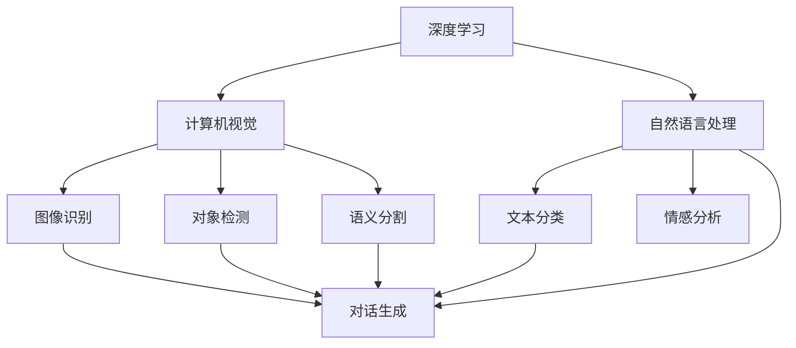

                 

# 体验的时空压缩：AI创造的即时感知

> 关键词：体验时空压缩,人工智能,即时感知,机器学习,深度学习,计算机视觉

## 1. 背景介绍

### 1.1 问题由来
在信息爆炸的时代，人们获取信息和知识的方式发生了深刻的变化。传统的文本和图像信息获取方式，已经难以满足人们对即时性、交互性和个性化体验的需求。为了满足这种新的需求，人工智能（AI）技术在体验时空压缩方面展开了深入的研究，通过技术手段实现了信息的即时感知和个性化呈现。

### 1.2 问题核心关键点
基于AI的即时感知技术，核心关键点在于如何在瞬间获取并理解海量数据，从而实现信息的即时呈现和交互。这一技术主要依赖于深度学习、计算机视觉和自然语言处理等技术，能够将文本、图像、视频等多种形式的信息转化为直观的交互体验，大幅提升用户的信息获取效率和体验质量。

### 1.3 问题研究意义
AI的即时感知技术不仅能够提升信息获取的效率和准确性，还能够通过个性化推荐和互动增强用户粘性，推动数字化产品和服务的发展。在医疗、教育、金融、娱乐等多个领域，即时感知技术已经成为提升用户体验、实现业务创新的关键手段。

## 2. 核心概念与联系

### 2.1 核心概念概述

为了更好地理解AI在即时感知技术中的应用，本节将介绍几个关键概念及其相互关系：

- **深度学习**：一种模拟人类大脑神经网络的学习方法，通过多层非线性映射，能够从数据中自动学习特征表示。
- **计算机视觉**：研究如何让计算机理解、解释和处理图像和视频信息，实现图像识别、对象检测、语义分割等任务。
- **自然语言处理**：研究如何让计算机理解和处理自然语言信息，实现文本分类、情感分析、对话生成等任务。
- **体验时空压缩**：通过AI技术，将海量的信息转化为用户可以即时感知和互动的形式，实现了时间上的即时性和空间上的紧凑性。
- **即时感知**：一种通过AI技术实现的即时性、交互性体验，使用户能够在极短时间内获取并理解信息，从而提升用户体验。

这些概念之间的关系可以通过以下Mermaid流程图来展示：



这个流程图展示了深度学习、计算机视觉和自然语言处理等核心技术如何共同作用，实现即时感知的应用。

## 3. 核心算法原理 & 具体操作步骤

### 3.1 算法原理概述

AI的即时感知技术，基于深度学习、计算机视觉和自然语言处理等核心技术，实现了对文本、图像和视频等信息的快速理解和转换。其核心算法原理主要包括以下几个方面：

1. **特征提取与表示**：通过深度学习模型，将原始数据转化为高层次的特征表示，使得计算机能够理解其语义和内容。
2. **时空压缩与转换**：通过算法优化，将高维数据压缩到二维或一维空间，实现信息的时空压缩和转换。
3. **即时处理与输出**：通过高效计算和实时处理，将处理结果即时呈现给用户，实现信息的即时感知。

### 3.2 算法步骤详解

AI的即时感知技术，主要包括以下几个关键步骤：

**Step 1: 数据预处理**
- 将输入数据转化为深度学习模型所需的格式，如图像进行归一化、分词处理等。
- 对数据进行增强处理，如数据扩充、随机裁剪、翻转等，增加数据多样性。

**Step 2: 特征提取与表示**
- 使用深度学习模型（如卷积神经网络CNN、循环神经网络RNN、变压器Transformer等）对数据进行特征提取。
- 将提取的特征进行编码，转化为模型可以理解的向量形式。

**Step 3: 时空压缩与转换**
- 对高维特征进行降维处理，如主成分分析PCA、线性判别分析LDA等，将特征映射到低维空间。
- 使用时间序列分析和注意力机制，将时间信息嵌入特征表示中，实现时空压缩。

**Step 4: 即时处理与输出**
- 使用实时计算框架（如TensorFlow、PyTorch等）对模型进行优化，实现实时处理。
- 将处理结果转化为用户可以理解的直观形式，如文字、图像、视频等。

### 3.3 算法优缺点

AI的即时感知技术，具有以下优点：
1. **效率高**：通过深度学习模型的特征提取和优化，能够在短时间内处理大量数据。
2. **灵活性强**：可以适应多种数据类型和任务需求，如文本分类、图像识别、情感分析等。
3. **用户体验好**：通过时空压缩和即时输出，实现了信息的即时感知和交互，提升了用户的使用体验。

同时，该技术也存在以下局限性：
1. **数据依赖性强**：依赖高质量、大样本的数据，数据获取成本高。
2. **模型复杂度**：深度学习模型的训练和调参复杂，需要大量的计算资源。
3. **鲁棒性差**：对噪声和异常数据敏感，容易受到干扰。

### 3.4 算法应用领域

AI的即时感知技术，已经在多个领域得到了广泛的应用，包括但不限于：

- **医疗领域**：通过图像识别和自然语言处理，实现疾病诊断、智能问诊等功能，提升医疗服务的效率和质量。
- **教育领域**：通过视频分析和学习分析，实现个性化学习推荐、智能答疑等功能，提升教育体验和效果。
- **金融领域**：通过自然语言处理和图像识别，实现金融舆情监测、智能投顾等功能，提升金融决策的准确性和效率。
- **娱乐领域**：通过图像识别和自然语言处理，实现人脸识别、语音交互等功能，提升用户的娱乐体验。
- **交通领域**：通过计算机视觉和自然语言处理，实现智能交通管理和自动驾驶等功能，提升交通系统的智能化水平。

## 4. 数学模型和公式 & 详细讲解 & 举例说明

### 4.1 数学模型构建

为了更好地理解AI即时感知技术的数学原理，本节将详细介绍相关的数学模型和公式。

设输入数据为 $x$，深度学习模型为 $f(x; \theta)$，其中 $\theta$ 为模型参数。模型的输出为 $y = f(x; \theta)$。对于文本数据 $x$，深度学习模型通常采用Transformer架构，能够自动学习文本中的语义关系和特征表示。对于图像数据 $x$，则通常采用卷积神经网络CNN，能够自动学习图像中的特征表示。

模型的损失函数为 $L = \frac{1}{N}\sum_{i=1}^N l(y_i, \hat{y}_i)$，其中 $l$ 为具体的损失函数，如交叉熵损失、均方误差损失等。模型的优化目标是最小化损失函数 $L$，即求解 $\theta$：

$$
\theta^* = \mathop{\arg\min}_{\theta} L
$$

### 4.2 公式推导过程

以文本分类任务为例，假设输入为文本 $x$，输出为分类标签 $y$。模型的输出为 $y = f(x; \theta)$，其中 $f(x; \theta)$ 为Transformer模型，输出层为线性分类器，激活函数为softmax。模型的损失函数为交叉熵损失：

$$
L = -\frac{1}{N}\sum_{i=1}^N \sum_{k=1}^K y_{ik}\log f_k(x; \theta)
$$

其中 $K$ 为类别数，$y_{ik}$ 为样本 $i$ 的类别 $k$ 的one-hot编码，$f_k(x; \theta)$ 为模型在类别 $k$ 上的预测概率。通过反向传播算法，计算损失函数对模型参数 $\theta$ 的梯度，并使用优化器（如AdamW）更新参数。

### 4.3 案例分析与讲解

以图像分类任务为例，假设输入为图像 $x$，输出为分类标签 $y$。模型的输出为 $y = f(x; \theta)$，其中 $f(x; \theta)$ 为卷积神经网络CNN，输出层为线性分类器，激活函数为softmax。模型的损失函数为交叉熵损失：

$$
L = -\frac{1}{N}\sum_{i=1}^N \sum_{k=1}^K y_{ik}\log f_k(x; \theta)
$$

其中 $K$ 为类别数，$y_{ik}$ 为样本 $i$ 的类别 $k$ 的one-hot编码，$f_k(x; \theta)$ 为模型在类别 $k$ 上的预测概率。通过反向传播算法，计算损失函数对模型参数 $\theta$ 的梯度，并使用优化器（如SGD、Adam等）更新参数。

## 5. 项目实践：代码实例和详细解释说明

### 5.1 开发环境搭建

在进行AI即时感知技术开发前，需要先搭建开发环境。以下是使用Python进行TensorFlow开发的环境配置流程：

1. 安装Anaconda：从官网下载并安装Anaconda，用于创建独立的Python环境。
2. 创建并激活虚拟环境：
```bash
conda create -n tf-env python=3.8 
conda activate tf-env
```

3. 安装TensorFlow：根据CUDA版本，从官网获取对应的安装命令。例如：
```bash
conda install tensorflow tensorflow-gpu=2.8.0 -c conda-forge
```

4. 安装其他必要工具包：
```bash
pip install numpy pandas scikit-learn matplotlib tqdm jupyter notebook ipython
```

完成上述步骤后，即可在`tf-env`环境中开始即时感知技术的开发。

### 5.2 源代码详细实现

这里以图像分类任务为例，给出使用TensorFlow进行即时感知开发的PyTorch代码实现。

首先，定义模型和数据集：

```python
import tensorflow as tf
from tensorflow import keras

# 定义卷积神经网络模型
model = keras.Sequential([
    keras.layers.Conv2D(32, (3, 3), activation='relu', input_shape=(32, 32, 3)),
    keras.layers.MaxPooling2D((2, 2)),
    keras.layers.Conv2D(64, (3, 3), activation='relu'),
    keras.layers.MaxPooling2D((2, 2)),
    keras.layers.Flatten(),
    keras.layers.Dense(64, activation='relu'),
    keras.layers.Dense(10, activation='softmax')
])

# 加载数据集
(x_train, y_train), (x_test, y_test) = keras.datasets.mnist.load_data()
x_train = x_train.reshape(-1, 32, 32, 3).astype('float32') / 255.0
x_test = x_test.reshape(-1, 32, 32, 3).astype('float32') / 255.0
```

然后，定义训练和评估函数：

```python
# 定义交叉熵损失函数和优化器
loss_fn = keras.losses.CategoricalCrossentropy()
optimizer = keras.optimizers.Adam()

# 定义训练函数
@tf.function
def train_step(images, labels):
    with tf.GradientTape() as tape:
        predictions = model(images, training=True)
        loss = loss_fn(labels, predictions)
    gradients = tape.gradient(loss, model.trainable_variables)
    optimizer.apply_gradients(zip(gradients, model.trainable_variables))

# 定义评估函数
@tf.function
def evaluate_step(images, labels):
    predictions = model(images, training=False)
    loss = loss_fn(labels, predictions)
    return loss.numpy()
```

最后，启动训练流程并在测试集上评估：

```python
# 训练模型
for epoch in range(10):
    for batch in train_dataset:
        train_step(batch[0], batch[1])
    
    test_loss = evaluate_step(test_images, test_labels)
    print(f"Epoch {epoch+1}, test loss: {test_loss}")

# 在测试集上评估
test_loss = evaluate_step(test_images, test_labels)
print(f"Test loss: {test_loss}")
```

以上就是使用TensorFlow进行图像分类任务即时感知开发的完整代码实现。可以看到，得益于TensorFlow的强大封装，代码实现变得简洁高效。

### 5.3 代码解读与分析

让我们再详细解读一下关键代码的实现细节：

**模型定义**：
- 定义了卷积神经网络模型，包括卷积层、池化层、全连接层等。
- 使用Sequential模型封装了整个网络结构，方便训练和评估。

**数据加载**：
- 使用Keras的加载函数加载MNIST数据集。
- 将数据集按照模型要求进行预处理和归一化。

**训练函数**：
- 使用tf.function装饰器将训练过程定义为TensorFlow函数，提高计算效率。
- 在训练过程中，使用梯度计算和反向传播更新模型参数。

**评估函数**：
- 使用tf.function装饰器将评估过程定义为TensorFlow函数，提高计算效率。
- 在评估过程中，计算模型在测试集上的损失，并返回结果。

**训练流程**：
- 在每个epoch内，对训练数据进行迭代训练，更新模型参数。
- 在每个epoch结束时，评估模型在测试集上的表现。

## 6. 实际应用场景

### 6.1 智能问答系统

AI的即时感知技术，可以广泛应用于智能问答系统的构建。传统的问答系统往往需要耗费大量人工进行知识库的构建和更新，而智能问答系统则可以通过即时感知技术，从海量文本数据中自动提取知识，并进行实时回答。

具体而言，可以将问题作为输入，通过深度学习模型提取特征，并将特征转化为文本表示。然后使用自然语言处理技术，从知识库中检索并匹配相关信息，生成回答。AI即时感知技术能够实时处理用户提问，提供准确、个性化的回答，提升用户体验和问答系统的智能化水平。

### 6.2 智能推荐系统

AI的即时感知技术，还可以用于智能推荐系统的构建。推荐系统通常需要根据用户历史行为数据进行推荐，而即时感知技术则可以通过对实时数据的分析，实现更加精准、及时的推荐。

具体而言，可以收集用户浏览、点击、评论等行为数据，并使用即时感知技术对实时数据进行分析和处理。然后，使用推荐算法对用户进行个性化推荐，提供符合用户兴趣的内容。AI即时感知技术能够实时分析用户行为，生成推荐结果，提升推荐系统的准确性和用户满意度。

### 6.3 智能交通系统

AI的即时感知技术，可以用于智能交通系统的构建。传统的交通系统需要人工进行交通数据的采集和分析，而智能交通系统则可以通过即时感知技术，从摄像头、传感器等设备中实时获取交通数据，并进行智能分析和处理。

具体而言，可以使用计算机视觉技术对交通摄像头拍摄的图像进行分析和处理，获取实时交通数据。然后，使用自然语言处理技术，对交通数据进行分析和处理，生成交通报告。AI即时感知技术能够实时处理交通数据，提供实时交通报告，提升交通系统的智能化水平。

### 6.4 未来应用展望

随着AI即时感知技术的不断发展，未来的应用前景将更加广阔。AI即时感知技术将在更多领域得到应用，为传统行业带来变革性影响。

在智慧医疗领域，基于AI即时感知技术的智能问诊、疾病诊断等功能，将提升医疗服务的智能化水平，辅助医生诊疗，加速新药开发进程。

在智能教育领域，基于AI即时感知技术的个性化学习推荐、智能答疑等功能，将提升教育体验和效果，因材施教，促进教育公平。

在智能交通领域，基于AI即时感知技术的智能交通管理和自动驾驶等功能，将提升交通系统的智能化水平，构建更安全、高效的未来交通。

此外，在金融、娱乐、电商等多个领域，基于AI即时感知技术的实时分析、个性化推荐等功能，将提升业务智能化水平，创造新的商业价值。相信随着技术的不断进步，AI即时感知技术将在更多领域大放异彩，为经济社会发展注入新的动力。

## 7. 工具和资源推荐

### 7.1 学习资源推荐

为了帮助开发者系统掌握AI即时感知技术的理论基础和实践技巧，这里推荐一些优质的学习资源：

1. **《深度学习》课程**：由斯坦福大学Andrew Ng教授开设的深度学习课程，系统介绍了深度学习的基本概念和常用技术。
2. **《计算机视觉：模型、学习和推理》书籍**：深入浅出地介绍了计算机视觉的基本原理和常用模型，适合初学者和进阶者阅读。
3. **《自然语言处理入门》课程**：由清华大学自然语言处理实验室开设的NLP课程，介绍了自然语言处理的基本概念和常用技术。
4. **Kaggle平台**：数据科学和机器学习竞赛平台，提供了丰富的数据集和比赛项目，适合实践和验证算法。

通过对这些资源的学习实践，相信你一定能够快速掌握AI即时感知技术的精髓，并用于解决实际的NLP问题。

### 7.2 开发工具推荐

高效的开发离不开优秀的工具支持。以下是几款用于AI即时感知技术开发的常用工具：

1. **TensorFlow**：由Google主导开发的开源深度学习框架，生产部署方便，适合大规模工程应用。
2. **PyTorch**：基于Python的开源深度学习框架，灵活动态的计算图，适合快速迭代研究。
3. **Keras**：基于TensorFlow和Theano等框架的高层API，提供了便捷的模型构建和训练功能，适合初学者和快速开发。
4. **Jupyter Notebook**：交互式的Python开发环境，支持代码编写、数据处理和可视化，适合学习和实践。

合理利用这些工具，可以显著提升AI即时感知技术的开发效率，加快创新迭代的步伐。

### 7.3 相关论文推荐

AI即时感知技术的发展源于学界的持续研究。以下是几篇奠基性的相关论文，推荐阅读：

1. **《卷积神经网络》论文**：Yann LeCun等人在1998年提出的卷积神经网络，奠定了计算机视觉领域的理论基础。
2. **《长短期记忆网络》论文**：Hochreiter和Schmidhuber在1997年提出的长短期记忆网络，推动了自然语言处理领域的发展。
3. **《Transformer模型》论文**：Vaswani等人在2017年提出的Transformer模型，改变了自然语言处理领域的面貌。
4. **《深度学习在自然语言处理中的应用》论文**：Bengio等人在2015年发表的综述论文，介绍了深度学习在NLP中的各种应用。

这些论文代表了大模型即时感知技术的发展脉络。通过学习这些前沿成果，可以帮助研究者把握学科前进方向，激发更多的创新灵感。

## 8. 总结：未来发展趋势与挑战

### 8.1 总结

本文对AI即时感知技术进行了全面系统的介绍。首先阐述了AI即时感知技术的背景和意义，明确了即时感知在提升用户体验和效率方面的独特价值。其次，从原理到实践，详细讲解了即时感知技术的数学原理和关键步骤，给出了即时感知技术开发的完整代码实例。同时，本文还广泛探讨了即时感知技术在智能问答、智能推荐、智能交通等多个领域的应用前景，展示了即时感知技术的巨大潜力。

通过本文的系统梳理，可以看到，AI即时感知技术已经在多个领域得到了广泛的应用，并展现出广阔的发展前景。未来，伴随技术的持续演进和应用场景的不断拓展，即时感知技术必将在构建人机协同的智能时代中扮演越来越重要的角色。

### 8.2 未来发展趋势

展望未来，AI即时感知技术将呈现以下几个发展趋势：

1. **融合更多模态数据**：未来的即时感知技术将不仅仅局限于文本、图像等模态，还将融合更多形式的感知数据，如语音、视频等，实现多模态智能交互。
2. **实时处理和分析**：未来的即时感知技术将进一步提升实时处理和分析能力，能够在极短时间内处理海量数据，实现即时感知和决策。
3. **自适应学习和优化**：未来的即时感知技术将具备自适应学习能力，能够根据不同用户的个性化需求，进行实时调整和优化，提升用户体验和系统效率。
4. **跨领域应用拓展**：未来的即时感知技术将拓展到更多领域，如智慧城市、医疗健康、工业制造等，实现多领域智能化的协同应用。

### 8.3 面临的挑战

尽管AI即时感知技术已经取得了瞩目成就，但在迈向更加智能化、普适化应用的过程中，它仍面临诸多挑战：

1. **数据质量问题**：海量的数据采集和处理，需要高质量、多样化的数据来源，数据质量问题将影响即时感知技术的性能和可靠性。
2. **模型复杂度问题**：深度学习模型的高复杂度，需要高效的硬件资源支持，同时还需要优化模型的计算效率，避免资源浪费。
3. **用户隐私保护**：在实时处理和分析用户数据时，需要考虑用户隐私保护问题，确保数据的安全性和隐私性。
4. **算法鲁棒性问题**：模型的鲁棒性和抗干扰能力不足，容易受到异常数据和噪声的影响，影响即时感知技术的稳定性。
5. **用户接受度问题**：用户对于即时感知技术的应用接受度，将直接影响其推广和普及，需要关注用户体验和需求。

### 8.4 研究展望

面对AI即时感知技术所面临的挑战，未来的研究需要在以下几个方面寻求新的突破：

1. **高质量数据获取和处理**：探索高效的数据采集和处理方法，确保数据的多样性和高质量，提升即时感知技术的性能和可靠性。
2. **模型简化和优化**：开发更加轻量级、高效能的模型结构，提升实时处理和分析能力，减少计算资源的消耗。
3. **隐私保护技术**：研究数据隐私保护技术，确保用户数据的安全性和隐私性，提升用户对即时感知技术的信任度。
4. **自适应算法设计**：设计自适应算法，提升即时感知技术的鲁棒性和稳定性，增强其在不同场景下的适应能力。
5. **用户界面设计**：设计友好、易用的用户界面，提升用户体验和交互效果，推动即时感知技术在更多领域的应用。

这些研究方向的探索，必将引领AI即时感知技术迈向更高的台阶，为构建安全、可靠、可解释、可控的智能系统铺平道路。面向未来，AI即时感知技术还需要与其他AI技术进行更深入的融合，如知识表示、因果推理、强化学习等，多路径协同发力，共同推动自然语言理解和智能交互系统的进步。只有勇于创新、敢于突破，才能不断拓展AI即时感知技术的边界，让智能技术更好地造福人类社会。

## 9. 附录：常见问题与解答

**Q1: 什么是AI即时感知技术？**

A: AI即时感知技术是一种通过深度学习、计算机视觉和自然语言处理等核心技术，实现对文本、图像、视频等多模态数据的实时处理和分析，从而提供即时感知和互动体验的技术。

**Q2: 为什么需要AI即时感知技术？**

A: 在信息爆炸的时代，用户对即时性、交互性和个性化体验的需求日益增长。AI即时感知技术通过实时处理和分析海量数据，能够快速响应用户需求，提升用户体验和效率。

**Q3: AI即时感知技术的主要应用场景有哪些？**

A: AI即时感知技术在医疗、教育、金融、娱乐、交通等多个领域得到广泛应用，如智能问答、个性化推荐、智能交通等，提升了业务智能化水平，创造了新的商业价值。

**Q4: 如何提升AI即时感知技术的实时处理能力？**

A: 可以通过优化模型结构、使用高效的硬件资源、优化计算图等方法，提升AI即时感知技术的实时处理能力。同时，还可以使用数据增强、模型剪枝等技术，减少计算资源的消耗。

**Q5: 如何保护用户数据隐私？**

A: 可以通过数据匿名化、差分隐私、加密技术等方法，保护用户数据的隐私性。同时，还需要在设计和实现过程中，注重数据保护和隐私保护，确保用户数据的合法使用和保护。

通过对这些问题的解答，相信你能够更加全面地理解AI即时感知技术的原理和应用，并在实际开发中更好地应对各种挑战和需求。

