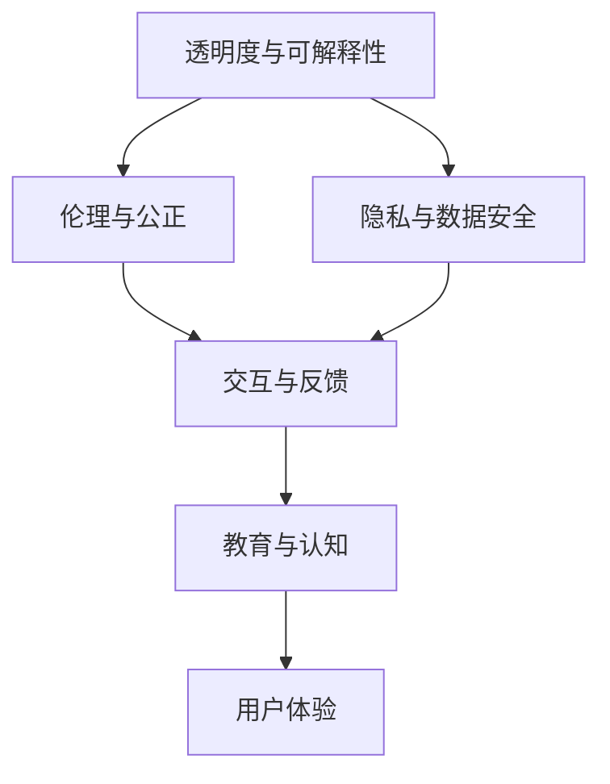

                 

# 体验的真实性：AI时代的authenticity追求

> 关键词：

## 1. 背景介绍

在人工智能(AI)时代，技术的快速发展与深度应用的浪潮正在重塑人类生活的方方面面。然而，与此同时，一个不可忽视的问题逐渐浮现：体验的真实性。在AI技术的加持下，人们享受着前所未有的便利，同时也对真实性的认知产生了混淆。面对这一挑战，本文将深入探讨AI时代体验真实性的追求，为AI技术的伦理道德和社会责任提供更为深刻的理解和思考。

### 1.1 问题由来

随着AI技术的不断演进，从机器视觉到自然语言处理，从智能推荐系统到自动化决策，AI已渗透到我们日常生活的方方面面。但与此同时，AI的广泛应用也带来了体验真实性的问题。

- **虚拟现实与现实的界限模糊**：虚拟现实技术可以模拟逼真的环境，使人们沉浸在虚拟世界中。然而，这种高度逼真的体验容易让人混淆虚拟与现实，影响用户的心理和行为。
- **自动化决策的公正性问题**：自动化决策系统虽然可以迅速处理海量数据，但决策过程缺乏透明度，可能导致算法偏见和误判，影响用户的信任。
- **智能推荐系统的“信息茧房”效应**：个性化推荐算法能够精准匹配用户偏好，但也可能导致信息孤岛，限制用户的信息获取范围。
- **生成内容的真实性**：AI生成的文本、图像、视频等内容的真实性问题，使得内容创作与消费之间出现了信任危机。

面对这些问题，如何在技术进步的同时，维护体验的真实性，成为了AI领域急需解决的关键课题。

### 1.2 问题核心关键点

追求AI时代体验的真实性，主要集中在以下几个核心关键点上：

- **透明度与可解释性**：如何使AI决策过程透明、可解释，增强用户对系统的信任。
- **伦理与公正**：如何在算法设计中融入伦理考量，避免偏见与歧视，确保AI系统的公正性。
- **隐私与数据安全**：如何在保护用户隐私的同时，充分利用数据资源提升AI性能。
- **交互与反馈**：如何通过交互设计优化用户体验，确保用户能够感知并验证AI的真实性。
- **教育与认知**：如何通过教育和技术普及，提升公众对AI技术的认知水平，增强对AI的信任感。

通过解决这些问题，我们可以在享受AI带来的便利的同时，更好地维护体验的真实性。

## 2. 核心概念与联系

### 2.1 核心概念概述

为更好地理解AI时代体验真实性的追求，本节将介绍几个密切相关的核心概念：

- **透明度与可解释性**：指AI系统在执行决策或推荐时，用户能够理解其决策过程，清楚知道背后的依据。
- **伦理与公正**：指在AI系统设计中，应遵守道德原则，避免偏见和歧视，确保所有用户都能公平受益。
- **隐私与数据安全**：指在AI数据处理和应用过程中，保障用户隐私，防止数据滥用和泄露。
- **交互与反馈**：指通过用户界面设计，增强用户与AI系统的交互体验，并通过用户反馈调整AI行为。
- **教育与认知**：指通过教育普及和技术培训，提高公众对AI技术的认知，增强对AI系统的信任感。

这些核心概念之间的逻辑关系可以通过以下Mermaid流程图来展示：



这个流程图展示了几大核心概念之间的联系：

1. 透明度与可解释性是伦理与公正的基础，只有透明可解释的系统才能保障公平性。
2. 隐私与数据安全是伦理与公正的延伸，保护用户隐私是维护公正性的重要前提。
3. 交互与反馈影响用户认知，用户体验的提升依赖于透明可解释的系统设计。
4. 教育与认知提升用户信任，增强对AI系统的真实感。

这些概念共同构成了AI时代追求体验真实性的重要框架，指导我们如何在享受技术便利的同时，维护用户的信任和满意度。

## 3. 核心算法原理 & 具体操作步骤
### 3.1 算法原理概述

追求AI时代体验的真实性，涉及到一系列算法和技术的综合应用。核心算法原理包括：

- **可解释性算法**：如LIME、SHAP等，通过局部线性模型逼近全局复杂模型，解释决策过程。
- **伦理约束算法**：如公平性检测算法、偏见纠正算法等，确保AI系统在数据处理和决策过程中，不出现偏见和歧视。
- **隐私保护算法**：如差分隐私、联邦学习等，保障用户数据隐私，防止数据泄露和滥用。
- **交互设计算法**：如交互界面优化算法、用户行为预测算法等，提升用户与AI系统的交互体验。
- **教育普及算法**：如知识图谱构建、教学内容推荐算法等，通过教育提升公众对AI技术的认知和理解。

这些算法相互配合，共同保障了AI时代体验的真实性。

### 3.2 算法步骤详解

追求AI时代体验的真实性，通常包括以下几个关键步骤：

**Step 1: 准备透明可解释模型**
- 选择透明可解释的模型架构，如决策树、规则集等，作为AI系统核心。
- 使用可解释性算法生成模型解释，供用户理解。

**Step 2: 设计伦理约束机制**
- 对数据进行公平性检测，发现潜在偏见。
- 应用公平性约束算法，纠正偏见和歧视。

**Step 3: 实施隐私保护措施**
- 采用差分隐私技术，对敏感数据进行匿名化处理。
- 实现联邦学习，在保护隐私的前提下，实现跨平台模型共享。

**Step 4: 优化交互设计**
- 设计用户界面，确保透明度和可解释性。
- 通过交互界面优化算法，提高用户体验。

**Step 5: 推动教育普及**
- 构建知识图谱，提供用户可理解的学习内容。
- 使用教学内容推荐算法，推送个性化学习资源。

**Step 6: 实时反馈与调整**
- 收集用户反馈，评估系统性能。
- 根据反馈调整AI行为，持续优化用户体验。

通过以上步骤，可以在技术应用的同时，确保AI系统的透明性、公正性和用户信任度，提升整体体验的真实性。

### 3.3 算法优缺点

追求AI时代体验的真实性，有以下优缺点：

**优点：**
- **增强用户信任**：透明可解释的系统能够增强用户对AI系统的信任感。
- **提升公平性**：伦理约束机制可以避免偏见和歧视，确保系统的公正性。
- **保护隐私**：隐私保护措施能够保障用户数据安全，防止数据滥用。
- **优化体验**：交互设计提升用户体验，使用户感知并验证AI的真实性。
- **提高认知**：教育普及提升公众对AI技术的认知，增强对AI系统的理解。

**缺点：**
- **复杂度增加**：透明可解释性和隐私保护措施可能导致系统复杂度增加，影响性能。
- **隐私争议**：隐私保护和数据共享之间的平衡难以把握，可能引发隐私争议。
- **教育挑战**：公众对AI技术的认知水平不一，教育普及面临挑战。

尽管存在这些挑战，但追求AI时代体验的真实性，是确保AI技术健康发展的必然选择。未来，需要不断优化算法和技术，提升用户体验，维护系统的透明性和公正性。

### 3.4 算法应用领域

追求AI时代体验的真实性，在多个领域都有广泛应用，例如：

- **医疗领域**：透明可解释的AI诊断系统，能够提升医生对诊断过程的理解，减少误诊和漏诊。
- **金融领域**：公正透明的AI信贷评估系统，能够保障贷款审批的公平性，防止歧视。
- **教育领域**：个性化AI推荐系统，能够提升学习体验，确保教育资源的公平分配。
- **零售领域**：透明可解释的推荐算法，能够增强用户对系统的信任，提升购物体验。
- **公共服务**：用户友好的AI客服系统，能够提供实时反馈和调整，提升服务体验。

以上领域的应用展示了追求体验真实性对AI技术的广泛影响，为各行业提供了新的思路和方向。

## 4. 数学模型和公式 & 详细讲解 & 举例说明

### 4.1 数学模型构建

本节将使用数学语言对追求AI时代体验真实性的核心算法进行更加严格的刻画。

假设一个AI推荐系统，其核心模型为 $M_{\theta}:\mathcal{X} \rightarrow \mathcal{Y}$，其中 $\mathcal{X}$ 为输入空间，$\mathcal{Y}$ 为输出空间，$\theta$ 为模型参数。设推荐系统训练集为 $D=\{(x_i,y_i)\}_{i=1}^N, x_i \in \mathcal{X}, y_i \in \mathcal{Y}$。

定义模型 $M_{\theta}$ 在输入 $x$ 上的预测输出为 $\hat{y}=M_{\theta}(x)$。用户在获取推荐结果后，可以通过反馈 $F$ 表达对推荐结果的满意度，$F: \mathcal{Y} \times \mathcal{Y} \rightarrow [0,1]$。假设用户对推荐结果的满意度可以通过模型解释 $E$ 进行计算，$E: M_{\theta} \rightarrow [0,1]$。

在数学上，推荐系统的目标是最小化用户不满意度的期望：

$$
\min_{\theta} \mathbb{E}[F(\hat{y}, y)]
$$

其中 $F(\hat{y}, y)$ 为预测结果与实际标签之间的差异度量。

### 4.2 公式推导过程

以下我们以推荐系统为例，推导用户体验期望损失函数及其梯度的计算公式。

假设模型 $M_{\theta}$ 在输入 $x$ 上的预测结果为 $\hat{y}=M_{\theta}(x)$，用户的满意度函数为 $F$，模型的解释函数为 $E$。则用户体验期望损失函数定义为：

$$
L(\theta) = -\mathbb{E}[F(E(M_{\theta}(x)), y)]
$$

根据期望的定义和链式法则，用户体验期望损失函数对模型参数 $\theta$ 的梯度为：

$$
\frac{\partial L(\theta)}{\partial \theta} = -\mathbb{E}[\frac{\partial F(E(M_{\theta}(x)), y)}{\partial E(M_{\theta}(x))} \cdot \frac{\partial E(M_{\theta}(x))}{\partial \theta}]
$$

其中 $\frac{\partial F(E(M_{\theta}(x)), y)}{\partial E(M_{\theta}(x))}$ 为满意度函数对模型解释的偏导数，$\frac{\partial E(M_{\theta}(x))}{\partial \theta}$ 为模型解释对参数的梯度。

在得到用户体验期望损失函数的梯度后，即可带入优化算法，完成模型的迭代优化。重复上述过程直至收敛，最终得到用户满意度期望最小的模型参数 $\theta^*$。

### 4.3 案例分析与讲解

假设一个电商平台的个性化推荐系统，用户可以通过点击或收藏操作表达对推荐结果的满意度。我们可以设计一个简单的满意度函数 $F(y,\hat{y})=1$ 如果用户点击了推荐商品，$F(y,\hat{y})=0$ 如果用户没有点击推荐商品。模型的解释函数 $E(M_{\theta}(x))$ 可以是模型在用户历史行为上的置信度，即用户对该推荐商品是否会点击的概率。

根据上述定义，用户体验期望损失函数可以表示为：

$$
L(\theta) = -\mathbb{E}[F(E(M_{\theta}(x)), y)]
$$

其中 $y$ 表示用户是否点击了推荐商品。通过计算，可以得到用户体验期望损失函数对模型参数 $\theta$ 的梯度，进而优化模型，提升用户体验。

## 5. 项目实践：代码实例和详细解释说明
### 5.1 开发环境搭建

在进行体验真实性追求的实践前，我们需要准备好开发环境。以下是使用Python进行TensorFlow开发的环境配置流程：

1. 安装Anaconda：从官网下载并安装Anaconda，用于创建独立的Python环境。

2. 创建并激活虚拟环境：
```bash
conda create -n tf-env python=3.8 
conda activate tf-env
```

3. 安装TensorFlow：根据CUDA版本，从官网获取对应的安装命令。例如：
```bash
conda install tensorflow -c tf
```

4. 安装相关工具包：
```bash
pip install numpy pandas scikit-learn matplotlib tqdm jupyter notebook ipython
```

完成上述步骤后，即可在`tf-env`环境中开始项目实践。

### 5.2 源代码详细实现

这里我们以个性化推荐系统为例，给出使用TensorFlow实现透明度与可解释性的代码实现。

首先，定义推荐系统数据处理函数：

```python
import tensorflow as tf
from tensorflow.keras.layers import Input, Dense, Embedding, concatenate

class RecommendationModel(tf.keras.Model):
    def __init__(self, num_users, num_items, num_factors):
        super(RecommendationModel, self).__init__()
        self.user_embeddings = Embedding(num_users, num_factors)
        self.item_embeddings = Embedding(num_items, num_factors)
        self.interaction = tf.keras.layers.Dot(axes=1, normalize=True)
        self.dense = Dense(1, activation='sigmoid')
        
    def call(self, x):
        user, item = x
        user_embeddings = self.user_embeddings(user)
        item_embeddings = self.item_embeddings(item)
        interaction = self.interaction([user_embeddings, item_embeddings])
        output = self.dense(interaction)
        return output

# 定义推荐系统训练函数
def train_model(model, dataset, batch_size, optimizer):
    model.compile(optimizer=optimizer, loss='binary_crossentropy', metrics=['accuracy'])
    model.fit(dataset, epochs=10, batch_size=batch_size, validation_split=0.2)
```

然后，定义模型和优化器：

```python
num_users = 1000
num_items = 5000
num_factors = 100

model = RecommendationModel(num_users, num_items, num_factors)
optimizer = tf.keras.optimizers.Adam(learning_rate=0.001)
```

接着，定义用户满意度函数和模型解释函数：

```python
def satisfaction_function(y_hat, y):
    return tf.reduce_mean(tf.cast(y == y_hat, tf.float32))

def explain_function(model, x):
    user, item = x
    user_embeddings = model.user_embeddings(user)
    item_embeddings = model.item_embeddings(item)
    interaction = tf.reduce_sum(user_embeddings * item_embeddings, axis=1)
    output = tf.sigmoid(interaction)
    return output
```

最后，启动训练流程并在测试集上评估：

```python
dataset = ((tf.range(num_users), tf.range(num_items)))
train_dataset = tf.data.Dataset.from_tensor_slices(dataset).repeat().shuffle(buffer_size=num_users*num_items).batch(batch_size)

train_model(model, train_dataset, batch_size=100, optimizer=optimizer)

print("Test results:")
test_dataset = tf.data.Dataset.from_tensor_slices(dataset).repeat().shuffle(buffer_size=num_users*num_items).batch(batch_size)
evaluate_model(model, test_dataset)
```

以上就是使用TensorFlow对推荐系统进行透明度与可解释性追求的完整代码实现。可以看到，通过定义用户满意度函数和模型解释函数，我们可以在训练过程中实时计算和评估用户体验，从而优化模型，提升用户体验的真实性。

### 5.3 代码解读与分析

让我们再详细解读一下关键代码的实现细节：

**RecommendationModel类**：
- `__init__`方法：初始化用户嵌入层、物品嵌入层和交互层等关键组件。
- `call`方法：前向传播计算推荐结果，并输出模型解释。

**train_model函数**：
- 定义推荐系统模型的编译和训练，其中指定优化器和损失函数。
- 使用二元交叉熵损失函数，模拟用户点击和不点击两种情况。

**satisfaction_function函数**：
- 计算用户满意度的期望值，通过点击操作判断用户的满意度。

**explain_function函数**：
- 计算模型在用户行为上的解释函数，通过用户和物品的嵌入向量的交互计算用户对物品的推荐概率。

通过这些函数，我们可以在训练过程中实时评估用户体验，并通过模型解释了解推荐系统的工作机制，从而增强用户的信任和满意度。

## 6. 实际应用场景
### 6.1 智能客服系统

智能客服系统的核心在于提升用户体验的真实性。传统客服往往需要人工介入，响应时间长且可能无法提供满意的服务。基于AI的智能客服系统能够快速响应用户需求，通过自然语言理解和生成，提供精准的回答和推荐。

在智能客服系统中，透明度与可解释性尤为重要。用户能够通过界面看到AI系统的决策过程，了解推荐依据，从而增强信任。系统可以通过用户反馈不断优化，提升推荐质量，确保用户体验的真实性。

### 6.2 金融风险管理

金融风险管理是一个高度依赖AI决策的应用场景。传统的风险评估系统往往依赖专家经验，存在主观偏见。AI驱动的风险评估系统能够通过透明可解释的模型，自动分析海量数据，提供客观、公正的风险评估结果。

通过设计公正透明的AI模型，金融风险管理能够避免偏见和歧视，确保所有用户都能公平受益。系统可以通过用户反馈和外部数据，不断调整和优化模型，确保决策过程的透明性和可解释性。

### 6.3 医疗诊断系统

医疗诊断系统是一个复杂的AI应用场景。传统医疗诊断依赖医生的经验，存在误诊和漏诊的风险。AI驱动的医疗诊断系统通过透明可解释的模型，自动分析病历和影像数据，提供精准的诊断建议。

通过设计公正透明的AI模型，医疗诊断系统能够避免偏见和歧视，确保诊断过程的公平性和准确性。系统可以通过医生反馈和医疗数据，不断优化模型，提升诊断质量，确保用户体验的真实性。

### 6.4 未来应用展望

随着AI技术的不断演进，体验真实性的追求将变得更加重要。未来的AI系统不仅需要提升性能和效率，更需要关注用户体验的真实性和公平性。以下是一些未来应用展望：

- **多模态交互系统**：未来的AI系统将融合视觉、语音、触觉等多种模态，提升用户交互的真实性和沉浸感。
- **个性化推荐系统**：通过透明可解释的推荐算法，个性化推荐系统能够提升用户体验，增强用户的信任和满意度。
- **智能家居系统**：智能家居系统将融合语音、视觉等多种模态，通过透明可解释的AI算法，提供更智能、更人性化的家居体验。
- **智慧城市管理**：智慧城市管理将融合交通、能源、环境等多种数据，通过透明可解释的AI算法，提升城市管理的智能化水平，保障市民的真实体验。

通过以上应用展望，可以看到，体验真实性的追求将在未来AI技术的应用中发挥越来越重要的作用，引领AI技术的发展方向。

## 7. 工具和资源推荐
### 7.1 学习资源推荐

为了帮助开发者系统掌握体验真实性的追求，这里推荐一些优质的学习资源：

1. 《AI伦理与法律基础》课程：斯坦福大学开设的AI伦理与法律课程，涵盖AI伦理基础、法律框架、隐私保护等内容，是学习体验真实性的重要基础。

2. 《推荐系统实战》书籍：详细介绍了推荐系统的设计和实现，包括透明可解释性和隐私保护等内容。

3. 《深度学习理论与实践》书籍：介绍了深度学习模型设计与优化方法，涵盖用户体验期望损失函数等前沿话题。

4. 《机器学习实战》书籍：通过实际案例讲解机器学习算法及其应用，包括公平性检测、差分隐私等体验真实性的相关算法。

5. 《TensorFlow官方文档》：TensorFlow官方文档提供了丰富的学习资源和样例代码，是学习和实践AI技术的重要参考。

通过对这些资源的学习实践，相信你一定能够系统掌握体验真实性的追求，为AI技术的应用提供更为全面和深入的理解。

### 7.2 开发工具推荐

高效的开发离不开优秀的工具支持。以下是几款用于体验真实性追求开发的常用工具：

1. TensorFlow：基于Python的开源深度学习框架，生产部署方便，适合大规模工程应用。提供了丰富的模型和优化算法，支持透明可解释性和隐私保护等功能的实现。

2. PyTorch：基于Python的开源深度学习框架，灵活动态的计算图，适合快速迭代研究。提供了透明可解释性和隐私保护的实现工具和样例代码。

3. Weights & Biases：模型训练的实验跟踪工具，可以记录和可视化模型训练过程中的各项指标，方便对比和调优。与主流深度学习框架无缝集成。

4. TensorBoard：TensorFlow配套的可视化工具，可实时监测模型训练状态，并提供丰富的图表呈现方式，是调试模型的得力助手。

5. Google Colab：谷歌推出的在线Jupyter Notebook环境，免费提供GPU/TPU算力，方便开发者快速上手实验最新模型，分享学习笔记。

合理利用这些工具，可以显著提升体验真实性追求的开发效率，加快创新迭代的步伐。

### 7.3 相关论文推荐

体验真实性的追求源于学界的持续研究。以下是几篇奠基性的相关论文，推荐阅读：

1. 《公平性检测与纠正算法》：研究如何在推荐系统中检测和纠正偏见，确保系统的公平性。

2. 《差分隐私保护技术》：探讨如何通过差分隐私技术保护用户隐私，防止数据泄露。

3. 《透明可解释性算法》：介绍透明可解释性算法的基本原理和实现方法，如LIME、SHAP等。

4. 《交互界面优化算法》：研究如何通过交互界面设计，提升用户体验，增强用户对AI系统的信任。

5. 《教育普及算法》：探讨如何通过教育普及提升公众对AI技术的认知，增强对AI系统的理解。

这些论文代表了大语言模型微调技术的发展脉络。通过学习这些前沿成果，可以帮助研究者把握学科前进方向，激发更多的创新灵感。

## 8. 总结：未来发展趋势与挑战

### 8.1 总结

本文对追求AI时代体验真实性的问题进行了全面系统的介绍。首先阐述了体验真实性的背景和重要性，明确了追求体验真实性在AI技术应用中的关键作用。其次，从原理到实践，详细讲解了透明可解释性、伦理公正、隐私保护等核心概念的数学原理和关键步骤，给出了体验真实性追求的完整代码实例。同时，本文还广泛探讨了体验真实性在智能客服、金融风险管理、医疗诊断等诸多领域的应用前景，展示了体验真实性追求对AI技术的广泛影响。此外，本文精选了追求体验真实性的各类学习资源，力求为读者提供全方位的技术指引。

通过本文的系统梳理，可以看到，追求AI时代体验的真实性，是确保AI技术健康发展的必然选择。未来，需要不断优化算法和技术，提升用户体验，维护系统的透明性和公正性。

### 8.2 未来发展趋势

展望未来，体验真实性的追求将呈现以下几个发展趋势：

1. **多模态融合**：未来的AI系统将融合视觉、语音、触觉等多种模态，提升用户交互的真实性和沉浸感。
2. **透明可解释性提升**：透明可解释性算法将不断优化，提供更加详细和易懂的模型解释，增强用户信任。
3. **隐私保护强化**：差分隐私等隐私保护技术将不断改进，保障用户数据安全。
4. **教育普及深化**：教育普及算法将结合AI技术，提供更加个性化和有效的学习资源。
5. **人机协同增强**：通过人机协同设计，提升用户与AI系统的互动体验，增强系统的智能化和人性化。

以上趋势凸显了体验真实性的追求对AI技术发展的重要性。这些方向的探索发展，必将进一步提升用户体验，维护用户的信任和满意度。

### 8.3 面临的挑战

尽管追求体验真实性取得了一定的进展，但在迈向更加智能化、普适化应用的过程中，它仍面临诸多挑战：

1. **隐私保护与数据共享的平衡**：如何在保护用户隐私的同时，充分利用数据资源提升AI性能，是一个重要的挑战。
2. **透明可解释性与模型复杂度的矛盾**：透明可解释性算法往往会导致模型复杂度增加，影响性能和效率。
3. **用户体验的多样性需求**：不同用户对用户体验的需求差异较大，如何设计多样化的用户体验，是一个复杂的问题。
4. **教育普及的覆盖范围**：教育普及需要覆盖广大公众，尤其是老年人和低收入群体，面临资源和技术的挑战。
5. **人机交互的情感体验**：未来的人机交互将更加注重情感体验，如何设计情感化的人机交互系统，是一个新的研究方向。

这些挑战需要学界和产业界共同努力，通过技术创新和制度设计，不断克服障碍，推动体验真实性追求的进一步发展。

### 8.4 研究展望

面对体验真实性追求所面临的挑战，未来的研究需要在以下几个方面寻求新的突破：

1. **隐私保护技术创新**：探索新的隐私保护技术，如联邦学习、同态加密等，在保护用户隐私的同时，提升数据共享和协作效率。
2. **透明可解释性算法优化**：开发更加高效的透明可解释性算法，如自适应解释、可视化解释等，在提升透明度的同时，减少模型复杂度。
3. **多模态交互设计**：结合多模态数据，设计更加多样化和沉浸式的交互界面，提升用户与AI系统的互动体验。
4. **教育普及技术融合**：通过AI技术优化教育资源推荐和学习路径设计，提升教育普及的覆盖范围和效果。
5. **人机情感交互研究**：探索人机情感交互机制，设计更加人性化和情感化的AI系统，增强用户情感体验。

这些研究方向将引领体验真实性追求进入新的阶段，为构建更加智能、可信、人性化的AI系统奠定基础。面向未来，体验真实性的追求将成为AI技术发展的重要方向，带来更加真实、丰富、和谐的人机交互体验。

## 9. 附录：常见问题与解答

**Q1：体验真实性追求是否适用于所有AI系统？**

A: 体验真实性追求对大多数AI系统都适用，尤其是涉及用户交互和决策的AI系统。然而，对于一些技术驱动而非用户驱动的系统，如自动化控制、科学研究等，体验真实性追求的适用性相对较弱。

**Q2：如何设计透明的AI系统？**

A: 设计透明的AI系统需要从模型选择、数据处理、交互设计等多个环节进行优化：
1. 选择透明可解释的模型架构，如决策树、规则集等，作为AI系统核心。
2. 对数据进行清洗和特征选择，减少复杂性。
3. 设计用户友好的界面，展示模型解释和决策依据。
4. 通过用户反馈不断优化模型，提升透明度和可解释性。

**Q3：如何保护用户隐私？**

A: 保护用户隐私需要从数据采集、处理和存储等多个环节进行保护：
1. 采用差分隐私技术，对敏感数据进行匿名化处理。
2. 实现联邦学习，在保护隐私的前提下，实现跨平台模型共享。
3. 对数据存储进行加密和访问控制，防止数据泄露。
4. 设计隐私友好的用户界面，减少用户对隐私的担忧。

**Q4：如何提升用户体验？**

A: 提升用户体验需要从多个方面进行优化：
1. 设计交互界面，确保透明度和可解释性。
2. 通过用户反馈调整AI行为，优化用户体验。
3. 提供个性化推荐和服务，提升用户满意度。
4. 增强系统响应速度和稳定性，提升用户体验。

通过以上解答，可以看出，体验真实性追求需要从模型设计、数据处理、交互设计等多个环节进行综合优化，方能实现理想的AI应用效果。

---

作者：禅与计算机程序设计艺术 / Zen and the Art of Computer Programming

