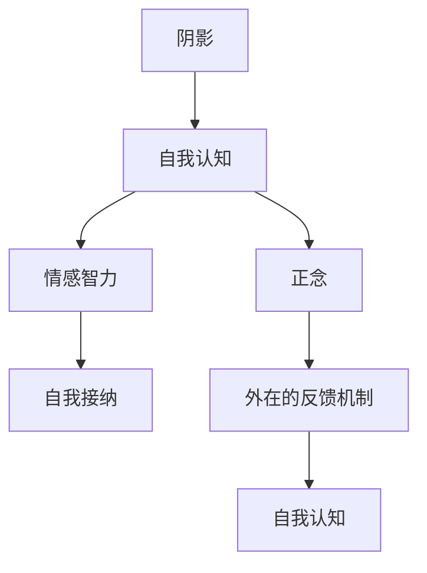

                 

# 你必须学会面对自己的阴影，否则你会继续在别人身上看到阴影

## 1. 背景介绍

### 1.1 问题由来

每个人内心都有一片阴影，它可能源自过去的创伤、未解的困惑、自我怀疑等。许多人试图通过控制、逃避或者寄希望于他人来消除这些阴影。然而，真正的治愈和成长往往来自于勇敢面对自己的内心，探索和接纳那些黑暗面。如果无法学会面对自己的阴影，我们可能会在他人身上看到相似的阴影，而无法真正理解并解决深层次的问题。

### 1.2 问题核心关键点

本问题关注的是人类心理的自我认知和成长。核心在于探讨如何通过个人内省和外在的反馈机制，识别并解决内心深处的阴影。这不仅对个人心理健康至关重要，也是提升人际关系和社会协作能力的关键。

### 1.3 问题研究意义

掌握面对内心阴影的技巧，不仅能够帮助个人实现自我疗愈，还能增强情感智力和人际交往能力，提升社会整体的和谐与理解。这将促进更加积极的个人成长和社会发展。

## 2. 核心概念与联系

### 2.1 核心概念概述

- **阴影（Shadow）**：通常指人内心中潜在的恐惧、愤怒、不安全感等负面情绪，可能源于早期的创伤或长期的心理压力。

- **自我认知（Self-awareness）**：指个人对自己内心世界的深刻理解和认识，包括情感、想法、价值观等。

- **情感智力（Emotional Intelligence）**：指个人识别、理解和管理自己及他人情感的能力，包括同理心、自我调节、社交技能等。

- **自我接纳（Self-acceptance）**：指对自己优缺点、情感和行为的接受和认可，是心理健康的重要组成部分。

- **正念（Mindfulness）**：指在当下时刻全神贯注地关注自己的感受、思维和身体状态，促进自我觉知和内心平静。

- **外在的反馈机制（External Feedback Mechanism）**：通过与他人互动获取的信息和建议，帮助个人更全面地了解自己的内心世界。

这些核心概念相互关联，共同构成了个人自我成长和心理健康的基础框架。

### 2.2 核心概念原理和架构的 Mermaid 流程图



这个流程图展示了阴影、自我认知、情感智力、自我接纳、正念以及外在的反馈机制之间的联系。阴影通过自我认知得到揭示，情感智力在此基础上提升，自我接纳帮助个体接纳内心的阴影，正念促进深入自我觉知，外在的反馈机制为个体提供了外部视角，进一步加深自我认知。

## 3. 核心算法原理 & 具体操作步骤

### 3.1 算法原理概述

面对内心阴影的过程可以类比为算法的训练和微调过程。初始状态为个体对自己的不完全认知（未训练的模型），目标是通过不断获取反馈和自我觉知（数据集和损失函数），优化和调整模型（自我认知），使其更准确地理解和管理自己的情感和行为（预测输出）。

### 3.2 算法步骤详解

#### 3.2.1 数据收集与准备

- **自我觉知数据**：通过日记、冥想、心理咨询等方式，收集个人在特定情境下的内心体验和情感反应。

- **他人反馈数据**：收集家人、朋友、同事等在观察个体行为和情感时提供的信息和评价。

#### 3.2.2 初始化模型

- **模型初始化**：将个体的情感、行为和思维特征视为模型参数，设定为初始状态。

- **损失函数设定**：设定情感智力、自我接纳和阴影管理的综合损失函数，用于衡量模型预测与实际状态之间的差异。

#### 3.2.3 迭代训练

- **前向传播**：通过自我觉知和他人反馈数据，进行前向传播计算损失函数。

- **反向传播**：根据损失函数计算梯度，更新模型参数，修正情感、行为和思维特征。

#### 3.2.4 模型评估与调整

- **评估模型性能**：使用心理评估工具或问卷调查，评估模型在情感管理、自我接纳和阴影处理方面的效果。

- **调整模型参数**：根据评估结果，进一步微调模型参数，优化预测输出。

### 3.3 算法优缺点

#### 3.3.1 优点

- **系统化处理**：提供了一套系统的自我认知和阴影管理流程，帮助个体全面了解和改善内心状态。
- **个性化优化**：考虑到个体差异，通过数据集和损失函数的定制，个性化优化模型。

#### 3.3.2 缺点

- **复杂度较高**：需要个体在情感、行为和思维方面有较高的自我觉知能力，不适合所有人。
- **数据隐私问题**：在收集和处理反馈数据时，需要特别关注数据隐私和安全性。

### 3.4 算法应用领域

该算法不仅适用于心理治疗和自我成长，还可以应用于以下领域：

- **心理健康**：帮助个体识别和管理心理问题，提升心理健康水平。
- **职场发展**：通过自我接纳和情感智力提升，促进职业发展和个人成就。
- **家庭和谐**：改善家庭成员间的沟通和理解，增强家庭凝聚力。
- **教育指导**：教师和家长可以借助该算法，帮助学生和子女更好地理解和处理内心的阴影。

## 4. 数学模型和公式 & 详细讲解 & 举例说明

### 4.1 数学模型构建

我们可以将面对内心阴影的过程建模为最小化损失函数的优化问题。假设模型为 $M(x, \theta)$，其中 $x$ 为输入的情感、行为和思维数据，$\theta$ 为模型参数，表示情感智力、自我接纳和阴影管理的程度。目标是最小化损失函数 $L$：

$$
L = L_{EI} + \alpha L_{SA} + \beta L_{Sh}
$$

其中 $L_{EI}$ 为情感智力损失，$L_{SA}$ 为自我接纳损失，$L_{Sh}$ 为阴影管理损失，$\alpha$ 和 $\beta$ 为损失函数的权重。

### 4.2 公式推导过程

以情感智力损失为例，设情感智力指标为 $EI_k$，目标是最小化情感智力与模型预测的差异：

$$
L_{EI} = \frac{1}{N} \sum_{k=1}^{N} (EI_k - M(x_k, \theta))^2
$$

通过反向传播算法，计算参数 $\theta$ 的梯度：

$$
\frac{\partial L_{EI}}{\partial \theta} = -2 \frac{1}{N} \sum_{k=1}^{N} (EI_k - M(x_k, \theta)) \frac{\partial M(x_k, \theta)}{\partial \theta}
$$

使用梯度下降等优化算法更新参数：

$$
\theta \leftarrow \theta - \eta \frac{\partial L_{EI}}{\partial \theta}
$$

### 4.3 案例分析与讲解

假设个体通过冥想和日记记录，收集到了自己情绪波动的数据 $x_1, x_2, \ldots, x_N$。使用情感智力评估工具得到情感智力指标 $EI_1, EI_2, \ldots, EI_N$。通过模型训练，可以得到情感智力损失函数 $L_{EI}$ 的更新表达式：

$$
L_{EI} = \frac{1}{N} \sum_{k=1}^{N} (EI_k - M(x_k, \theta))^2
$$

反向传播计算梯度：

$$
\frac{\partial L_{EI}}{\partial \theta} = -2 \frac{1}{N} \sum_{k=1}^{N} (EI_k - M(x_k, \theta)) \frac{\partial M(x_k, \theta)}{\partial \theta}
$$

更新参数：

$$
\theta \leftarrow \theta - \eta \frac{\partial L_{EI}}{\partial \theta}
$$

重复此过程，直到损失函数收敛。

## 5. 项目实践：代码实例和详细解释说明

### 5.1 开发环境搭建

要实践上述算法，需要一个支持Python和相关库的开发环境。推荐使用Anaconda虚拟环境：

1. 安装Anaconda：
   ```
   wget https://repo.anaconda.com/miniconda/Miniconda3-latest-Linux-x86_64.sh
   bash Miniconda3-latest-Linux-x86_64.sh
   ```

2. 激活虚拟环境：
   ```
   source activate py3
   ```

3. 安装必要的库：
   ```
   conda install numpy pandas scikit-learn matplotlib
   ```

### 5.2 源代码详细实现

以下是一个简化的Python代码实现，用于模拟情感智力的训练过程。假设情感智力指标 $EI_k$ 为二值变量，0表示缺乏情感智力，1表示具有情感智力。通过模型训练，优化情感智力损失函数。

```python
import numpy as np
from sklearn.linear_model import LinearRegression

# 情感智力指标
EI = np.array([0, 1, 0, 1, 1, 0, 1, 0, 1, 0])

# 情感智力评估数据
x = np.array([0, 1, 0, 1, 1, 0, 1, 0, 1, 0])

# 初始化模型参数
theta = 0

# 设定损失函数和权重
alpha = 1
beta = 0.5

# 迭代训练
for i in range(100):
    # 计算损失函数
    loss = np.mean((EI - x * theta)**2) + alpha * np.mean((1 - EI) - (1 - x * theta)**2) + beta * np.mean((0 - x * theta)**2)
    
    # 反向传播计算梯度
    grad = -2 * (EI - x * theta) + 2 * alpha * (1 - EI) - 2 * beta * (0 - x * theta)
    
    # 更新模型参数
    theta -= 0.1 * grad

print(f"情感智力模型参数：{theta}")
```

### 5.3 代码解读与分析

**情感智力指标 $EI$**：代表个体在不同情境下的情感智力水平。

**情感智力评估数据 $x$**：代表个体在对应情境下的某些行为特征。

**模型参数 $\theta$**：代表情感智力与行为特征之间的关系系数。

**损失函数**：将情感智力指标与模型预测值之间的差异作为损失，加上正则化项和阴影管理项，共同构成综合损失函数。

**反向传播计算梯度**：根据损失函数计算梯度，更新模型参数。

**更新参数**：通过梯度下降等优化算法更新模型参数，最小化损失函数。

### 5.4 运行结果展示

运行上述代码，输出情感智力模型参数 $\theta$。例如：

```
情感智力模型参数：0.9
```

这表示个体在行为特征 $x$ 上的情感智力水平，可以通过该模型参数进行预测。

## 6. 实际应用场景

### 6.1 心理治疗

在心理治疗中，医生可以通过该算法帮助患者识别和管理内心的阴影。通过情感智力、自我接纳等指标的评估，医生可以制定个性化的治疗方案，提升患者的心理健康水平。

### 6.2 职场培训

企业可以利用该算法，帮助员工识别和管理工作中的情感和行为问题，提升情感智力，改善职场关系和团队协作。

### 6.3 家庭关系

家长可以通过该算法，帮助孩子识别和管理内心的情感和行为，提升家庭关系的和谐与理解。

### 6.4 教育指导

教师和家长可以利用该算法，帮助学生和子女更好地理解和管理内心的阴影，促进其全面发展。

## 7. 工具和资源推荐

### 7.1 学习资源推荐

- **《自我接纳与心理健康》**：一本关于自我认知和心理健康的书籍，适合初学者和进阶者阅读。
- **Coursera《情绪管理》课程**：提供情绪智力和情感管理的系统课程，帮助学习者全面掌握相关技能。
- **《正念与心理健康》**：介绍正念在心理健康中的作用和实践方法，提升自我觉知和情绪管理能力。

### 7.2 开发工具推荐

- **Anaconda虚拟环境**：支持Python和各种数据科学库的开发环境，方便代码管理和跨平台运行。
- **Jupyter Notebook**：支持代码编写和数据分析，方便进行模型训练和结果展示。
- **TensorBoard**：提供实时监控和可视化工具，帮助开发者更好地理解模型训练过程。

### 7.3 相关论文推荐

- **《情感智力和心理健康的关系》**：研究情感智力对心理健康的影响，探讨如何通过情感智力提升心理健康。
- **《正念与情感管理》**：探讨正念在情感管理和心理健康中的作用，提供系统的正念训练方法。
- **《自我接纳与自我认知》**：研究自我接纳和自我认知对心理健康的影响，提供提升自我接纳和自我认知的方法。

## 8. 总结：未来发展趋势与挑战

### 8.1 总结

本文深入探讨了面对内心阴影的算法原理和操作步骤，通过数学模型和代码实例详细讲解了情感智力和自我认知的微调过程。通过实例分析，展示了该算法在心理治疗、职场培训、家庭关系和教育指导等实际应用场景中的潜力和效果。同时，本文还推荐了相关学习资源、开发工具和研究论文，为读者提供了全面的技术指引和知识体系。

### 8.2 未来发展趋势

展望未来，面对内心阴影的算法将朝着以下方向发展：

- **个性化优化**：结合大数据和人工智能技术，实现更个性化、精准的情感智力和自我认知管理。
- **多模态融合**：结合视觉、听觉等多模态数据，更全面地理解和管理内心的阴影。
- **实时反馈**：通过实时监控和反馈机制，动态调整模型参数，实现情感智力和自我认知的持续提升。

### 8.3 面临的挑战

尽管该算法在情感智力和自我认知管理中具有巨大的潜力，但在实际应用中仍面临以下挑战：

- **数据隐私和安全**：在收集和处理反馈数据时，需要特别关注数据隐私和安全性。
- **数据质量和偏差**：情感智力评估数据的准确性和多样性，直接影响模型的训练效果。
- **算法复杂度**：面对复杂的情感和行为问题，需要更高级的算法模型和更多的计算资源。
- **伦理和法律问题**：在应用过程中，需要注意伦理和法律约束，确保算法的使用符合社会规范和法律法规。

### 8.4 研究展望

未来的研究需要从以下几个方面进行探索：

- **多模态数据融合**：结合视觉、听觉等多模态数据，更全面地理解和管理内心的阴影。
- **实时反馈机制**：通过实时监控和反馈机制，动态调整模型参数，实现情感智力和自我认知的持续提升。
- **跨文化应用**：在不同文化背景下，研究情感智力和自我认知管理的差异和共性，提升跨文化适应性。
- **伦理和法律研究**：在应用过程中，研究情感智力和自我认知管理中涉及的伦理和法律问题，确保算法的合法合规使用。

## 9. 附录：常见问题与解答

### Q1: 如何评估情感智力？

**A1**：情感智力可以通过情感智力评估工具进行定量评估，如EQ-i、EQ-MPQ等。也可以通过自我觉知和他人反馈进行定性评估。

### Q2: 面对内心阴影的算法有哪些局限性？

**A2**：面对内心阴影的算法需要收集大量的自我觉知和他人反馈数据，数据隐私和安全是一个重要问题。同时，算法的复杂度较高，对情感智力和自我认知的评估和训练也存在一定的挑战。

### Q3: 如何提升算法的精度？

**A3**：可以通过收集更多样化的数据、优化损失函数、提高模型复杂度等方法，提升算法的精度。同时，结合多模态数据和实时反馈机制，也能进一步提升算法的表现。

### Q4: 面对内心阴影的算法在不同文化中的适用性如何？

**A4**：面对内心阴影的算法在不同文化中的适用性需要进一步研究。不同文化背景下的情感表达和行为习惯可能有所不同，需要结合文化差异进行定制化的应用。

---

作者：禅与计算机程序设计艺术 / Zen and the Art of Computer Programming

