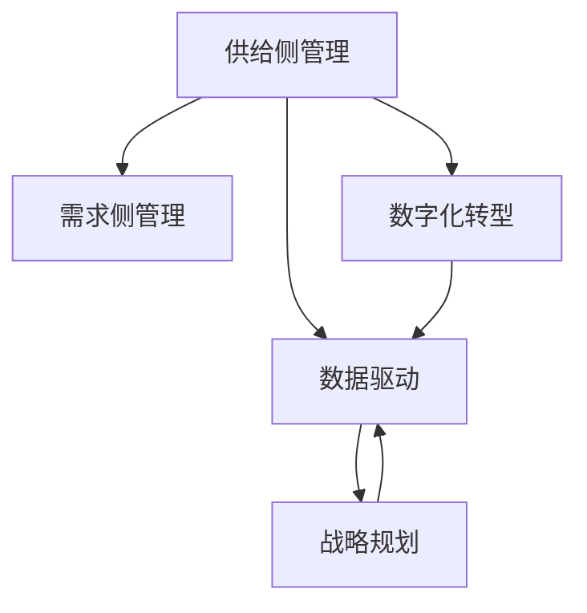

                 

## 1. 背景介绍

### 1.1 问题由来
在数字化时代，供给侧管理对于推动经济增长具有重要的战略意义。企业必须通过对市场需求进行深入理解，精准识别供给侧要素，制定科学合理的策略，才能在激烈的市场竞争中保持领先优势。数字化转型成为推动业务增长的关键，而数据驱动的供给侧管理策略是实现这一转型的重要手段。

### 1.2 问题核心关键点
数字化时代，企业面临的挑战日益复杂。如何在动态变化的市场环境中，快速响应消费者需求，优化供给侧资源配置，实现供需匹配，是当前数字化业务增长的核心问题。

### 1.3 问题研究意义
数字化供给侧管理策略的制定和实施，对于提升企业市场竞争力，实现经济增长具有重要意义：

1. **提升响应速度**：数字化工具使企业能够快速获取市场信息，更精准地预测市场需求变化。
2. **优化资源配置**：通过数据分析，企业可以更好地理解和利用供给侧资源，优化生产流程，提高效率。
3. **降低运营成本**：数字化管理减少了信息传递的复杂性和错误率，降低了运营成本。
4. **增强客户满意度**：数字化手段使得企业可以更好地理解客户需求，提供个性化服务，提升客户满意度。
5. **应对市场变化**：数字化工具能够实时监控市场动态，帮助企业灵活应对市场变化，减少损失。

## 2. 核心概念与联系

### 2.1 核心概念概述

为了深入理解供给驱动业务增长的策略，本节将介绍几个关键概念：

- **供给侧管理**：指通过管理资源、技术和制度等供给侧要素，优化生产和供应链，提升经济效率，实现供需匹配。
- **需求侧管理**：指通过管理市场需求，预测和引导消费者行为，实现市场供需平衡。
- **数据驱动**：利用数据对业务运营进行科学决策，提升效率和效果。
- **数字化转型**：通过应用数字化技术，优化业务流程，提升业务运营效率。
- **战略规划**：基于对市场和业务环境的深入分析，制定长远发展策略。

这些核心概念之间通过数据驱动的数字化手段紧密联系，共同构成了企业供给侧管理的完整框架。

### 2.2 核心概念原理和架构的 Mermaid 流程图(Mermaid 流程节点中不要有括号、逗号等特殊字符)


这个流程图展示了供给侧管理和需求侧管理之间的关系，并通过数据驱动和数字化转型作为连接两者的桥梁，最终实现了企业战略规划的制定和实施。

## 3. 核心算法原理 & 具体操作步骤
### 3.1 算法原理概述

供给驱动业务增长策略的核心算法原理主要包括以下几个方面：

1. **市场分析**：利用数据分析技术，对市场需求进行深入挖掘，识别关键需求要素，预测未来需求变化趋势。
2. **资源配置**：通过资源优化算法，优化资源分配，提高资源利用率。
3. **生产调度**：采用调度算法，实现生产流程的优化，提高生产效率。
4. **供应链管理**：利用供应链优化算法，优化供应链网络，提升供应链响应速度和稳定性。
5. **客户关系管理**：通过数据分析和机器学习技术，提升客户满意度和忠诚度。

### 3.2 算法步骤详解

以下是供给驱动业务增长策略的详细操作步骤：

**Step 1: 市场分析**

- 收集市场数据，包括消费者行为、购买记录、社交媒体反馈等。
- 运用统计学和机器学习技术，挖掘数据中的关键信息，如需求量、价格敏感度、购买偏好等。
- 预测未来需求变化趋势，建立需求模型。

**Step 2: 资源配置**

- 分析企业现有资源，包括人员、设备、资金等，建立资源库。
- 利用线性规划、整数规划等优化算法，优化资源配置方案，确保资源的最大利用率。
- 引入数据反馈机制，实时监控资源使用情况，动态调整资源配置。

**Step 3: 生产调度**

- 根据需求模型，确定生产计划和订单量。
- 使用生产调度算法，如先进先出(First-in-First-out, FIFO)、库存优化等，优化生产流程。
- 实时监控生产过程，及时调整生产计划，提高生产效率。

**Step 4: 供应链管理**

- 建立供应链网络模型，包括供应商、物流和分销渠道等。
- 利用供应链优化算法，如基于遗传算法的供应链优化、供应链协同优化等，优化供应链网络。
- 引入实时监控和反馈机制，提高供应链响应速度和稳定性。

**Step 5: 客户关系管理**

- 收集客户反馈和行为数据，如投诉、评价、购买记录等。
- 运用数据分析和机器学习技术，挖掘客户需求和偏好，建立客户画像。
- 通过客户画像，提供个性化服务和定制化产品，提升客户满意度和忠诚度。

**Step 6: 战略规划**

- 基于市场分析和资源配置结果，制定中长期发展战略。
- 定期评估市场和业务环境变化，及时调整战略规划，确保战略的有效性和适应性。

### 3.3 算法优缺点

供给驱动业务增长策略的优势在于：

1. **数据驱动**：通过数据分析技术，能够实时获取市场信息，优化决策过程，提升业务效率。
2. **动态响应**：能够根据市场变化实时调整资源配置和生产计划，快速响应市场需求。
3. **系统优化**：通过优化算法，实现生产流程和供应链网络的优化，提高资源利用率和生产效率。
4. **客户导向**：通过客户画像和个性化服务，提升客户满意度和忠诚度，增强市场竞争力。

缺点主要集中在：

1. **数据质量依赖**：策略的有效性依赖于数据的完整性和准确性。
2. **技术复杂性**：需要整合多种技术手段，对技术要求较高。
3. **初期成本高**：技术实施和数据采集需要投入大量资源。
4. **人才短缺**：需要具备数据科学、机器学习、供应链管理等多方面技能的人才。

### 3.4 算法应用领域

供给驱动业务增长策略在多个领域都有广泛应用，包括：

1. **制造业**：通过数据分析和生产调度算法，优化生产流程，提高生产效率和质量。
2. **零售业**：利用需求分析和供应链优化算法，优化库存管理和物流配送。
3. **农业**：通过数据分析和生产调度算法，优化种植和养殖流程，提高产量和质量。
4. **医疗健康**：利用需求分析和供应链优化算法，优化医疗资源配置和患者服务流程。
5. **金融服务**：通过数据分析和客户关系管理，提升客户满意度和忠诚度，提高金融服务的精准性和效率。
6. **物流运输**：利用供应链优化算法，优化物流网络，提升运输效率和安全性。
7. **能源电力**：通过数据分析和生产调度算法，优化能源配置和电力供应，提高能源利用效率。

## 4. 数学模型和公式 & 详细讲解 & 举例说明（备注：数学公式请使用latex格式，latex嵌入文中独立段落使用 $$，段落内使用 $)
### 4.1 数学模型构建

供给驱动业务增长策略的数学模型主要包括以下几个部分：

- **市场分析模型**：利用线性回归、时间序列分析等方法，建立市场需求预测模型。
- **资源配置模型**：利用线性规划、整数规划等优化算法，建立资源配置优化模型。
- **生产调度模型**：利用生产调度算法，建立生产计划优化模型。
- **供应链管理模型**：利用供应链优化算法，建立供应链网络优化模型。
- **客户关系管理模型**：利用聚类分析、推荐系统等技术，建立客户画像模型。

### 4.2 公式推导过程

以市场需求预测模型为例，进行详细推导：

设市场需求 $D_t$ 取决于时间 $t$，可以建立如下线性回归模型：

$$
D_t = \beta_0 + \beta_1 X_t + \epsilon_t
$$

其中，$X_t$ 为影响市场需求的外部因素，如季节性因素、促销活动等；$\epsilon_t$ 为随机误差项。

通过最小二乘法，可以得到回归系数 $\beta_0$ 和 $\beta_1$：

$$
\hat{\beta} = (\mathbf{X}^T \mathbf{X})^{-1} \mathbf{X}^T \mathbf{D}
$$

其中 $\mathbf{X}$ 为自变量矩阵，$\mathbf{D}$ 为因变量向量。

通过市场需求预测模型，企业可以预测未来市场变化，指导资源配置和生产调度。

### 4.3 案例分析与讲解

以下以某零售企业的供应链优化为例，展示供给驱动业务增长策略的实际应用：

**案例背景**：
某零售企业面临供应链管理问题，由于库存管理不当，导致缺货或过剩库存，影响客户满意度和运营效率。

**问题描述**：
1. 需求量不确定，需实时监控和预测。
2. 库存水平过高或过低，导致成本增加或客户不满意。
3. 物流配送效率低下，增加运输成本。

**解决方案**：

**Step 1: 数据收集与预处理**

- 收集历史销售数据、订单数据、供应商数据、库存数据等。
- 对数据进行清洗、去重、归一化等预处理。

**Step 2: 需求预测**

- 利用时间序列分析方法，如ARIMA模型，对未来需求进行预测。
- 结合季节性因素和促销活动，建立更准确的需求预测模型。

**Step 3: 库存优化**

- 根据需求预测结果，建立库存优化模型，优化库存水平。
- 引入先进先出( FIFO )和定期订货( Periodic Ordering )等算法，降低库存成本。
- 实时监控库存水平，根据需求变化动态调整库存。

**Step 4: 供应链优化**

- 建立供应链网络模型，包括供应商、物流中心和销售点等节点。
- 利用遗传算法等优化算法，优化供应链网络结构。
- 实时监控供应链运作，优化物流配送路径和运输方式，提高配送效率。

**Step 5: 客户关系管理**

- 收集客户反馈数据，利用聚类分析技术，建立客户画像。
- 通过客户画像，提供个性化服务和定制化产品，提升客户满意度和忠诚度。

**Step 6: 战略规划**

- 基于需求预测和供应链优化结果，制定中长期发展战略。
- 定期评估市场和业务环境变化，及时调整战略规划，确保战略的有效性和适应性。

**结果展示**：

- 通过供应链优化，库存水平降低，运输成本降低。
- 客户满意度提升，市场份额增加。
- 战略规划更加科学，企业能够更好地应对市场变化。

## 5. 项目实践：代码实例和详细解释说明
### 5.1 开发环境搭建

在进行项目实践前，我们需要准备好开发环境。以下是使用Python进行Pandas和Scikit-learn开发的环境配置流程：

1. 安装Anaconda：从官网下载并安装Anaconda，用于创建独立的Python环境。

2. 创建并激活虚拟环境：
```bash
conda create -n supply-env python=3.8 
conda activate supply-env
```

3. 安装Pandas和Scikit-learn：
```bash
conda install pandas scikit-learn
```

4. 安装TensorFlow等必要工具：
```bash
pip install tensorflow matplotlib
```

5. 安装Jupyter Notebook：
```bash
pip install jupyter notebook
```

完成上述步骤后，即可在`supply-env`环境中开始项目实践。

### 5.2 源代码详细实现

以下是使用Pandas和Scikit-learn进行市场分析和库存优化的Python代码实现。

```python
import pandas as pd
from sklearn.linear_model import LinearRegression

# 读取历史销售数据
sales_data = pd.read_csv('sales_data.csv')

# 数据预处理
sales_data = sales_data.dropna().drop_duplicates()

# 特征工程
features = ['sales_date', 'temperature', 'holiday', 'promotion']
X = sales_data[features]
y = sales_data['sales_volume']

# 建立线性回归模型
model = LinearRegression()
model.fit(X, y)

# 预测未来需求
future_date = pd.Timestamp('2023-10-01').asfreq('M')
future_data = pd.DataFrame({'temperature': 20, 'holiday': 0, 'promotion': 1}, index=[future_date])
predicted_sales = model.predict(future_data)

# 输出预测结果
print(predicted_sales)
```

### 5.3 代码解读与分析

让我们再详细解读一下关键代码的实现细节：

**数据处理**：
- 使用Pandas库读取历史销售数据，并进行去重、去NaN等预处理操作。
- 选择与需求相关的特征，如销售日期、温度、节假日和促销活动等。

**模型训练**：
- 利用线性回归模型，建立市场需求预测模型。
- 通过训练集拟合模型，预测未来市场需求。

**结果展示**：
- 通过模型预测未来销售量，指导库存和供应链优化。

**库存优化**：
- 结合线性回归模型和库存优化算法，实时监控库存水平，动态调整库存策略。

## 6. 实际应用场景
### 6.1 智能制造

智能制造企业可以利用供给驱动业务增长策略，优化生产流程，提高生产效率和产品质量。例如，通过数据分析和生产调度算法，企业可以实时监控生产过程，优化生产计划，降低生产成本，提高产品质量。

### 6.2 零售业

零售企业可以通过市场需求预测和库存优化，降低库存成本，提高客户满意度。例如，通过供应链优化算法，企业可以优化物流配送路径，提高配送效率，降低运输成本。

### 6.3 农业

农业企业可以利用市场需求预测和资源配置算法，优化种植和养殖流程，提高产量和质量。例如，通过数据分析和生产调度算法，企业可以优化农资投入，降低生产成本，提高农产品市场竞争力。

### 6.4 未来应用展望

随着数字技术和数据的不断成熟，供给驱动业务增长策略将在更多领域得到应用，为企业带来新的增长动力。未来，以下领域将呈现显著发展：

1. **物联网(IoT)**：利用物联网技术，实时监控生产过程，优化生产调度，提高生产效率。
2. **人工智能(AI)**：利用人工智能技术，提升数据分析和决策能力，实现智能供应链管理。
3. **区块链(BS)**：利用区块链技术，提升供应链的透明度和可追溯性，提高供应链响应速度。
4. **云计算(Cloud)**：利用云计算技术，实现数据集中管理和资源优化，降低企业运营成本。

## 7. 工具和资源推荐
### 7.1 学习资源推荐

为了帮助开发者系统掌握供给驱动业务增长的理论基础和实践技巧，这里推荐一些优质的学习资源：

1. 《数据分析与机器学习》系列博文：由数据科学专家撰写，深入浅出地介绍了数据分析和机器学习的基本概念和实践方法。

2. 《供应链管理》课程：由供应链管理领域专家开设的在线课程，涵盖供应链优化、库存管理等内容，帮助开发者系统掌握供应链管理的知识。

3. 《生产调度与优化》书籍：详细介绍了生产调度的算法和优化方法，适合工程实践者深入学习和应用。

4. 《智能制造》书籍：探讨智能制造的最新技术和应用案例，适合制造行业的从业者参考。

5. 《数字供应链管理》书籍：讲解数字技术在供应链管理中的应用，适合供应链管理领域的研究者学习。

通过对这些资源的学习实践，相信你一定能够快速掌握供给驱动业务增长的精髓，并用于解决实际的业务问题。

### 7.2 开发工具推荐

高效的开发离不开优秀的工具支持。以下是几款用于数据驱动业务增长的开发工具：

1. Jupyter Notebook：数据科学和机器学习常用的交互式编程工具，支持Python、R等语言，提供丰富的数据可视化功能。

2. TensorFlow：由Google主导开发的深度学习框架，支持大规模分布式计算，适合进行复杂的数据分析和模型训练。

3. PyTorch：基于Python的开源深度学习框架，灵活动态的计算图，适合快速迭代研究。

4. Scikit-learn：开源机器学习库，提供丰富的机器学习算法和工具，适合进行数据处理和模型训练。

5. Keras：高级神经网络API，提供简单易用的接口，适合快速搭建和训练深度学习模型。

合理利用这些工具，可以显著提升供给驱动业务增长的开发效率，加快创新迭代的步伐。

### 7.3 相关论文推荐

供给驱动业务增长的理论基础来源于多个学科，以下是几篇奠基性的相关论文，推荐阅读：

1. 《利用需求预测和库存优化提高供应链效率》：利用时间序列分析和线性规划，提高供应链管理效率。

2. 《生产调度与优化算法研究》：详细介绍了多种生产调度算法及其应用。

3. 《智能供应链管理》：探讨了利用数字技术实现智能供应链管理的方法。

4. 《市场需求预测与优化模型》：介绍了多种市场需求预测模型及其应用。

5. 《客户关系管理技术研究》：探讨了客户关系管理的最新技术方法。

这些论文代表了大数据和人工智能在业务增长中的应用方向，通过学习这些前沿成果，可以帮助研究者把握学科前进方向，激发更多的创新灵感。

## 8. 总结：未来发展趋势与挑战
### 8.1 研究成果总结

供给驱动业务增长策略通过数据驱动和智能化手段，优化资源配置和生产调度，提升企业市场竞争力。该策略已经应用于多个行业，取得了显著的成效。

### 8.2 未来发展趋势

展望未来，供给驱动业务增长策略将呈现以下几个发展趋势：

1. **智能化提升**：利用人工智能和大数据技术，进一步提升数据分析和决策能力，实现智能业务增长。
2. **数字化转型**：通过数字技术，实现业务流程的全面数字化，提高业务效率和响应速度。
3. **实时监控与反馈**：引入实时监控和反馈机制，及时调整业务策略，保持动态优化。
4. **跨行业应用**：将供给驱动业务增长策略应用于更多行业，提升整体产业的智能化水平。
5. **客户导向**：通过客户画像和个性化服务，提升客户满意度和忠诚度，增强市场竞争力。

### 8.3 面临的挑战

尽管供给驱动业务增长策略已经取得了一定的成效，但在实际应用中也面临一些挑战：

1. **数据质量问题**：数据的完整性和准确性对策略的执行至关重要。数据缺失、噪声等问题会影响策略的有效性。
2. **技术复杂性**：需要整合多种技术手段，对技术要求较高，实施和维护成本较高。
3. **人才培养**：需要具备数据科学、机器学习、供应链管理等多方面技能的人才，人才缺口较大。
4. **技术更新快**：新技术不断涌现，企业需要持续学习新技术，更新策略和工具。
5. **市场变化快**：市场需求变化快速，企业需要快速响应和调整策略。

### 8.4 研究展望

未来的研究应在以下方面寻求新的突破：

1. **多模态数据融合**：将不同类型的数据（如物联网数据、客户反馈等）进行融合，提升数据分析的全面性。
2. **智能决策支持**：利用人工智能技术，提升决策的智能化水平，减少人为干预。
3. **实时优化与调优**：引入实时优化算法，动态调整策略，保持持续优化。
4. **跨行业应用推广**：将供给驱动业务增长策略应用于更多行业，提升整体产业的智能化水平。
5. **客户体验优化**：通过客户画像和个性化服务，提升客户满意度和忠诚度，增强市场竞争力。

## 9. 附录：常见问题与解答

**Q1: 供给驱动业务增长策略的核心思想是什么？**

A: 供给驱动业务增长策略的核心思想是通过数据驱动和智能化手段，优化资源配置和生产调度，提升企业市场竞争力。其核心在于精准识别市场需求，科学优化资源配置，提高生产效率和客户满意度。

**Q2: 如何选择合适的市场分析方法？**

A: 市场分析方法的选择应基于数据类型和分析目标。对于时间序列数据，可采用ARIMA模型或Prophet模型；对于多维度数据，可采用决策树或随机森林等方法。应结合具体业务需求，选择最适合的分析方法。

**Q3: 在项目实施过程中，需要注意哪些关键点？**

A: 在项目实施过程中，需要注意以下关键点：
1. 数据质量：确保数据的完整性和准确性，减少数据噪声。
2. 技术选型：根据业务需求和技术成熟度，选择合适的技术方案。
3. 人才培养：建立专业团队，确保技术实施和维护能力。
4. 实时监控：建立实时监控和反馈机制，及时调整策略。
5. 策略调整：根据市场变化，及时调整策略和工具。

**Q4: 如何提升供应链管理的效率？**

A: 提升供应链管理的效率可以从以下几个方面入手：
1. 利用物联网技术，实时监控生产过程，优化生产调度。
2. 引入供应链优化算法，优化供应链网络结构，提高响应速度。
3. 实时监控和反馈机制，及时调整库存和物流计划。
4. 引入区块链技术，提升供应链的透明度和可追溯性。
5. 引入人工智能技术，提升数据分析和决策能力。

**Q5: 如何提升客户满意度？**

A: 提升客户满意度可以从以下几个方面入手：
1. 收集客户反馈数据，建立客户画像，了解客户需求和偏好。
2. 提供个性化服务和定制化产品，提升客户满意度和忠诚度。
3. 建立客户关系管理系统，定期跟进客户关系。
4. 引入推荐系统，提高客户转化率和购买率。

---

作者：禅与计算机程序设计艺术 / Zen and the Art of Computer Programming

