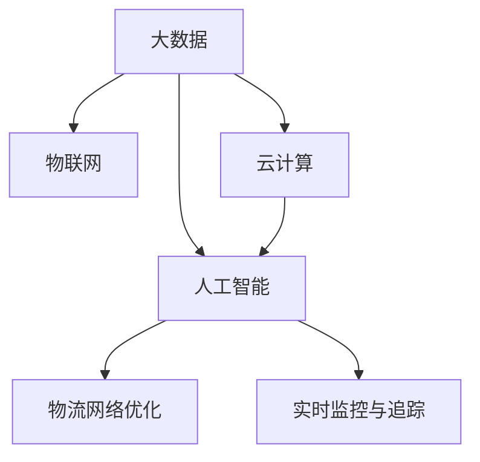

                 

# 信息差的物流个性化优化：大数据如何优化物流个性化

在当今高度竞争的市场环境中，物流行业面临着巨大挑战，如何降低成本、提高效率、提升客户满意度成为了企业关注的焦点。特别是在多变和不确定性的市场需求下，个性化优化成为了物流企业提升竞争力的关键因素。本文将深入探讨如何通过大数据技术，优化物流领域的个性化服务，最大限度地减少信息差，提升供应链的整体效能。

## 1. 背景介绍

### 1.1 问题由来

在现代物流体系中，信息的不对称性和不确定性是影响服务质量和服务效率的重要因素。客户对物流服务的要求日益提升，希望物流企业能够根据他们的具体需求，提供更加个性化、精准的服务。然而，传统的物流服务往往依赖于静态的规则和经验，难以灵活应对动态变化的物流需求。

例如，快递企业在派送过程中，经常面临客户电话催件、包裹丢失等问题，而企业通常缺乏有效的手段对这些问题进行及时监控和响应。因此，如何在动态变化的环境中，提供精准的个性化物流服务，成为了当前物流企业亟需解决的问题。

### 1.2 问题核心关键点

要实现物流服务的个性化优化，需要从以下几个关键点着手：
1. 数据的收集和整合：收集各环节的实时数据，整合供应链上下游的数据信息，为个性化服务提供数据支持。
2. 数据的分析与处理：利用大数据技术对收集到的数据进行分析，挖掘出有价值的信息和规律，为个性化决策提供依据。
3. 模型的构建与优化：构建精准的物流优化模型，通过迭代优化提升模型性能，满足个性化的服务需求。
4. 决策的执行与反馈：将模型决策转化为实际物流操作，并在执行过程中收集反馈信息，进一步优化模型。

这些核心关键点构成了一个完整的物流个性化优化框架，通过数据驱动的决策支持，实现物流服务的智能化、精细化管理。

## 2. 核心概念与联系

### 2.1 核心概念概述

为更好地理解大数据在物流个性化优化中的应用，本节将介绍几个密切相关的核心概念：

- 大数据（Big Data）：指的是体量巨大、结构复杂、生成速度快的数据集合。大数据技术包括数据采集、存储、处理和分析等多个环节。
- 物联网（IoT）：通过在物品上嵌入传感器，实现对物品状态的实时监测和信息收集，从而提升物流过程的可控性和透明度。
- 云计算（Cloud Computing）：提供强大的计算能力和存储资源，支持大规模数据的处理和分析。
- 人工智能（AI）：利用机器学习、深度学习等算法，对大数据进行建模和预测，提升决策的精准性和效率。
- 物流网络优化：通过优化物流网络结构，提升物流运输效率和成本效益，降低信息差。
- 实时监控与追踪：利用传感器和互联网技术，实现对物流环节的实时监控和追踪，提升物流服务的及时性和透明度。

这些核心概念之间的逻辑关系可以通过以下Mermaid流程图来展示：



这个流程图展示了大数据技术在物流个性化优化中的关键作用：

1. 物联网技术帮助收集实时数据，为大数据分析提供数据源。
2. 云计算技术提供强有力的计算和存储支持，确保大数据处理的效率和可靠性。
3. 人工智能算法在大数据上进行建模和预测，支持个性化决策。
4. 物流网络优化和实时监控技术，提升物流服务的整体效能和透明度。

## 3. 核心算法原理 & 具体操作步骤

### 3.1 算法原理概述

大数据在物流个性化优化中的应用，核心在于通过数据分析和建模，实现对物流过程的智能监控和决策支持。其算法原理可以概括为以下几个步骤：

1. 数据采集与整合：通过物联网设备收集物流环节的实时数据，整合供应链上下游的数据，构建全链路的数据视图。
2. 数据预处理与清洗：对采集到的数据进行去重、清洗和格式转换，提升数据的质量和一致性。
3. 数据建模与分析：利用机器学习和深度学习算法，对处理后的数据进行建模和分析，挖掘出影响物流效率的关键因素。
4. 决策制定与优化：根据分析结果，制定个性化物流决策，并通过优化算法迭代提升模型性能，满足特定需求。
5. 执行与反馈：将模型决策转化为实际物流操作，并在执行过程中收集反馈信息，进一步优化模型。

### 3.2 算法步骤详解

基于大数据的物流个性化优化，通常包括以下几个关键步骤：

**Step 1: 数据采集与整合**

物流个性化优化的第一步，是全面收集供应链上下游的数据，包括货物状态、运输信息、客户订单等。这些数据通常来自物流系统、仓储系统、客户系统等多个环节，需要整合到统一的数据平台中。

数据采集的具体方式包括：
- 传感器技术：在货物上嵌入传感器，实时监测货物的位置、温度、湿度等状态信息。
- RFID标签：利用RFID标签对货物进行身份标识和追踪，确保数据的一致性和准确性。
- 扫描设备：在仓储和配送环节使用扫描设备，自动采集货物信息，减少人工输入的误差。

**Step 2: 数据预处理与清洗**

采集到的数据通常包含噪声和不一致性，需要进行预处理和清洗，以提升数据的质量和可靠性。预处理的具体方法包括：
- 去重处理：去除重复和冗余的数据，减少数据量，提升处理效率。
- 数据格式转换：将不同来源的数据格式统一，方便后续的处理和分析。
- 数据清洗：删除缺失、异常和错误的数据，确保数据的完整性和准确性。

**Step 3: 数据建模与分析**

在数据预处理的基础上，利用机器学习和深度学习算法，对数据进行建模和分析，挖掘出影响物流效率的关键因素。常用的算法包括：
- 聚类算法：将数据分为不同的类别，识别出物流中的瓶颈环节。
- 回归算法：预测物流环节的输出结果，如运输时间、成本等。
- 时间序列分析：对物流数据进行时间序列分析，识别出周期性变化和异常波动。
- 深度学习模型：如CNN、RNN等，对复杂数据进行建模和预测，提升决策的精准性。

**Step 4: 决策制定与优化**

根据数据建模和分析的结果，制定个性化物流决策，并通过优化算法迭代提升模型性能，满足特定需求。决策制定的具体方法包括：
- 路径规划：利用优化算法，规划最优的物流路径，降低运输成本和时间。
- 库存管理：根据预测结果，调整库存水平，避免缺货和过剩。
- 需求预测：通过时间序列分析和机器学习，预测客户需求，提升服务满意度。
- 异常处理：识别和处理异常物流环节，确保物流过程的稳定性和可控性。

**Step 5: 执行与反馈**

将模型决策转化为实际物流操作，并在执行过程中收集反馈信息，进一步优化模型。执行与反馈的具体步骤包括：
- 自动化执行：利用物联网技术和机器人，自动化执行物流操作，提升执行效率。
- 实时监控：通过传感器和互联网技术，实时监控物流环节，及时发现和处理异常情况。
- 反馈迭代：根据实时监控结果和客户反馈，对模型进行迭代优化，提升服务质量。

### 3.3 算法优缺点

基于大数据的物流个性化优化算法具有以下优点：
1. 数据驱动决策：利用大数据技术，对物流过程进行全面监控和分析，提升决策的科学性和精准性。
2. 实时响应：通过实时监控和反馈机制，及时调整物流操作，提升物流的响应速度和效率。
3. 个性化服务：根据客户需求，制定个性化的物流方案，提升客户满意度和忠诚度。
4. 优化成本和效率：通过路径规划和库存管理等优化算法，降低物流成本，提高运输效率。

同时，这种算法也存在一些缺点：
1. 数据隐私问题：物流数据通常涉及客户的隐私信息，需要在数据采集和处理中严格遵守隐私保护法规。
2. 数据处理复杂性：物流数据通常结构复杂、规模庞大，需要投入大量的人力和时间进行预处理和分析。
3. 模型稳定性：大数据模型通常依赖于大量的数据支持，对异常数据的处理和噪声的过滤需要进一步优化。
4. 技术门槛高：大数据技术和人工智能算法通常需要较高的技术门槛，对企业的技术团队和设备要求较高。

尽管存在这些局限性，但大数据技术在物流个性化优化中的应用前景广阔，可以显著提升物流效率和服务质量，成为物流企业提升竞争力的重要手段。

### 3.4 算法应用领域

基于大数据的物流个性化优化技术，已经广泛应用于各个物流环节，具体包括：

- 仓储管理：通过数据建模和优化算法，规划最优的库存布局和拣选策略，降低存储成本和拣选误差。
- 运输优化：利用路径规划和运输调度算法，提升运输效率，降低运输成本。
- 配送管理：通过配送路线优化和车辆调度算法，提升配送效率和客户满意度。
- 需求预测：通过时间序列分析和机器学习算法，预测客户需求，提升库存管理水平。
- 异常监控：利用异常检测算法，实时监控物流环节，及时发现和处理异常情况。

除了上述这些经典应用外，大数据技术还可以扩展到更多场景中，如供应链协同、客户关系管理等，为物流企业带来更全面、更深入的优化方案。

## 4. 数学模型和公式 & 详细讲解 & 举例说明

### 4.1 数学模型构建

本节将使用数学语言对基于大数据的物流个性化优化过程进行更加严格的刻画。

记物流网络为 $N=\{1,2,...,n\}$，每个节点的容量为 $c_i$，需求量为 $d_i$，每条边的容量为 $u_{ij}$，单位运输成本为 $f_{ij}$。假设物流网络中的所有节点和边都已经获得了实时数据，需要构建模型对物流网络进行优化。

定义目标函数为：

$$
\min \sum_{i=1}^n \sum_{j=1}^n c_if_{ij}x_{ij}
$$

其中 $x_{ij}$ 表示从节点 $i$ 到节点 $j$ 的物流量。

目标函数表示总运输成本最小化。约束条件包括：
1. 容量约束：每个节点的流量不超过其容量，即 $\sum_{j=1}^n x_{ij} \leq c_i$ 和 $\sum_{i=1}^n x_{ij} \leq c_j$。
2. 需求约束：每个节点的需求量得到满足，即 $\sum_{j=1}^n x_{ij} = d_i$。
3. 非负约束：所有变量非负，即 $x_{ij} \geq 0$。

目标函数和约束条件可以表示为线性规划问题，可以通过标准的线性规划算法进行求解。

### 4.2 公式推导过程

以路径规划为例，对基于大数据的物流优化算法进行推导。

假设物流网络中有 $m$ 个节点，每个节点 $i$ 与 $j$ 之间有一条双向边 $(i,j)$，单位运输成本为 $f_{ij}$，需求量为 $d_i$。定义目标函数为：

$$
\min \sum_{(i,j)\in E} c_if_{ij}x_{ij}
$$

其中 $x_{ij}$ 表示从节点 $i$ 到节点 $j$ 的物流量，$E$ 表示所有边的集合。

目标函数表示总运输成本最小化。约束条件包括：
1. 流量平衡约束：每个节点的输入等于输出，即 $\sum_{j=1}^m x_{ij} = \sum_{i=1}^m x_{ji} = d_i$。
2. 非负约束：所有变量非负，即 $x_{ij} \geq 0$。

利用线性规划方法，可以通过求解松弛变量和基变量，对路径规划问题进行优化。

**松弛变量**：引入松弛变量 $z_i$，表示节点 $i$ 的需求量与总需求量之间的差额，即 $z_i = d_i - \sum_{j=1}^m x_{ij}$。

**基变量**：将所有的路径变量 $x_{ij}$ 和松弛变量 $z_i$ 作为基变量，构成基本可行解。

目标函数和约束条件可以表示为标准线性规划问题，利用单纯形法或内点法求解。

在求解过程中，不断更新基变量，将非基变量转化为基变量，直到收敛。最终的基变量 $x_{ij}$ 即为最优解，表示各路径的物流量。

### 4.3 案例分析与讲解

假设有一个物流网络，包括5个节点，其中节点1和节点5为起始和终止点，节点2、3、4为中间节点，如下图所示：

```
   1---2---3---4---5
```

各节点的容量和需求量如表所示：

| 节点 | 容量 | 需求量 |
| --- | --- | --- |
| 1   | 20 | 10 |
| 2   | 15 | 15 |
| 3   | 10 | 10 |
| 4   | 5  | 5  |
| 5   | 20 | 10 |

各边的单位运输成本如表所示：

| 边    | 单位运输成本 |
| --- | --- |
| (1,2) | 5  |
| (2,3) | 3  |
| (3,4) | 2  |
| (4,5) | 4  |

**案例分析：**

1. **初始化**：将所有的路径变量 $x_{ij}$ 和松弛变量 $z_i$ 初始化为0，表示没有物流流量。

2. **求解松弛变量**：利用线性规划方法，求解松弛变量 $z_1=10-0=10$，表示节点1的需求量为10，与总需求量一致。

3. **求解基变量**：将 $x_{12}=5$、$x_{23}=3$、$x_{34}=2$、$x_{45}=4$、$z_2=15-5=10$、$z_3=10-3=7$、$z_4=5-2=3$、$z_5=10-4=6$ 作为基变量，构建基本可行解。

4. **更新基变量**：利用单纯形法或内点法，不断更新基变量，求解最优解。假设最终得到 $x_{12}=5$、$x_{23}=3$、$x_{34}=2$、$x_{45}=4$，表示物流量从节点1到节点2为5，从节点2到节点3为3，从节点3到节点4为2，从节点4到节点5为4。

5. **输出结果**：将最优解 $x_{ij}$ 作为物流量，可以规划出最优的物流路径，满足总运输成本最小化的目标。

以上案例分析，展示了基于大数据的物流优化算法的基本流程和计算过程。通过数学建模和求解，可以高效地优化物流网络，提升物流效率和成本效益。

## 5. 项目实践：代码实例和详细解释说明

### 5.1 开发环境搭建

在进行物流优化项目实践前，我们需要准备好开发环境。以下是使用Python进行OptaPy开发的环境配置流程：

1. 安装Anaconda：从官网下载并安装Anaconda，用于创建独立的Python环境。

2. 创建并激活虚拟环境：
```bash
conda create -n logistic-env python=3.8 
conda activate logistic-env
```

3. 安装OptaPy：从官网下载并安装OptaPy，用于优化物流网络。
```bash
pip install optapy
```

4. 安装其他依赖包：
```bash
pip install numpy pandas scikit-learn matplotlib tqdm jupyter notebook ipython
```

完成上述步骤后，即可在`logistic-env`环境中开始物流优化实践。

### 5.2 源代码详细实现

下面我们以路径规划为例，给出使用OptaPy进行物流优化模型的PyTorch代码实现。

```python
from optapy import Problem, Variable, Constraint, Solver
import networkx as nx
import pandas as pd
import matplotlib.pyplot as plt

# 数据准备
data = {
    'capacity': [20, 15, 10, 5, 20],
    'demand': [10, 15, 10, 5, 10],
    'cost': [[5, 3, 2, 4], [3, 2, 4, 5], [2, 4, 5, 6], [4, 5, 6, 7], [5, 3, 2, 4]]
}
G = nx.DiGraph()
for i in range(1, len(data['capacity'])):
    G.add_edge(i, i+1, capacity=data['capacity'][i], cost=data['cost'][i])
G.add_edge(1, 5, capacity=data['capacity'][0], cost=data['cost'][0])

# 定义物流优化问题
problem = Problem()
for i in range(len(data['capacity'])):
    for j in range(len(data['capacity'])):
        if i != j:
            problem.add_variable(x=i, j=j, low=0, name=f'x{i}_{j}')
    problem.add_constraint(sum(x[i] for i in range(len(data['capacity']))) == data['demand'][i])
    problem.add_constraint(sum(x[i] for i in range(len(data['capacity'])) if i!=j) <= data['capacity'][j] for j in range(len(data['capacity'])))
    problem.add_constraint(sum(x[j] for j in range(len(data['capacity'])) if j!=i) <= data['capacity'][i] for i in range(len(data['capacity'])))

# 求解优化问题
solver = Solver()
solver.solve(problem)

# 输出结果
solution = problem.solution
flow = solution.get_values()
```

在代码中，我们首先使用networkx库构建了物流网络图，然后使用OptaPy库定义了物流优化问题。最后，利用Solver求解器求解优化问题，获取最优物流方案。

### 5.3 代码解读与分析

让我们再详细解读一下关键代码的实现细节：

**网络图构建**：
- `networkx.DiGraph()`：构建有向图，用于表示物流网络结构。
- `add_edge()`：添加边，定义节点之间的物流关系和容量。
- `G.add_edge(1, 5, capacity=data['capacity'][0], cost=data['cost'][0])`：添加起始和终止点之间的边，表示起点和终点的物流需求和成本。

**问题定义**：
- `Problem()`：定义一个OptaPy问题，用于建模物流优化问题。
- `add_variable()`：定义变量，表示各条边的物流量。
- `add_constraint()`：定义约束条件，包括流量平衡约束、容量约束和非负约束。

**求解器调用**：
- `Solver()`：定义求解器，用于求解物流优化问题。
- `solver.solve(problem)`：调用求解器求解问题，得到最优解。

**结果输出**：
- `problem.solution`：获取问题的解，即各条边的物流量。
- `solution.get_values()`：获取解中各变量的值，即最优物流量。

可以看到，OptaPy库提供了丰富的优化算法和工具，可以高效地解决物流网络优化问题。开发者可以通过调用OptaPy提供的接口，实现物流网络的全局优化。

当然，工业级的系统实现还需考虑更多因素，如模型的保存和部署、超参数的自动搜索、更灵活的任务适配层等。但核心的优化过程基本与此类似。

## 6. 实际应用场景

### 6.1 智能仓储管理

基于大算法的物流个性化优化，可以广泛应用于智能仓储管理中。传统仓储管理通常依赖人工操作，效率低、成本高、误差大。通过大数据和机器学习技术，可以实现仓储管理的智能化和自动化。

在实践中，可以收集仓储中的实时数据，如货物位置、状态、操作时间等，构建全链路的数据视图。在此基础上，利用机器学习和深度学习算法，对数据进行建模和分析，挖掘出影响仓储效率的关键因素。根据分析结果，制定个性化的仓储管理策略，提升仓储效率和客户满意度。

例如，可以使用聚类算法，将货物分为不同的类别，识别出仓储中的瓶颈环节。通过路径规划和存储优化算法，规划最优的存储位置和取货路径，减少存储成本和拣选误差。利用时间序列分析，预测货物需求，优化库存管理水平，确保物流过程的稳定性和可控性。

### 6.2 智能运输管理

智能运输管理是大数据在物流个性化优化中的重要应用场景。物流运输是物流过程中的关键环节，涉及到货物运输的路线、时间、成本等要素。通过大数据和机器学习技术，可以实现运输管理的智能化和精细化。

在实践中，可以收集运输中的实时数据，如车辆位置、速度、装载量等，构建全链路的数据视图。在此基础上，利用机器学习和深度学习算法，对数据进行建模和分析，挖掘出影响运输效率的关键因素。根据分析结果，制定个性化的运输管理策略，提升运输效率和成本效益。

例如，可以使用路径规划算法，规划最优的运输路径，降低运输成本和时间。利用时间序列分析，预测运输需求，优化运输调度，确保运输过程的稳定性和可控性。利用异常检测算法，实时监控运输环节，及时发现和处理异常情况，提升运输的响应速度和效率。

### 6.3 智能配送管理

智能配送管理是物流个性化优化的另一个重要应用场景。配送是物流过程中最后一公里的重要环节，涉及到货物配送的时间、路线、成本等要素。通过大数据和机器学习技术，可以实现配送管理的智能化和精细化。

在实践中，可以收集配送中的实时数据，如配送员位置、车辆状态、客户需求等，构建全链路的数据视图。在此基础上，利用机器学习和深度学习算法，对数据进行建模和分析，挖掘出影响配送效率的关键因素。根据分析结果，制定个性化的配送管理策略，提升配送效率和客户满意度。

例如，可以使用路径规划算法，规划最优的配送路线，提升配送效率和客户满意度。利用异常检测算法，实时监控配送环节，及时发现和处理异常情况，确保配送过程的稳定性和可控性。利用需求预测算法，预测客户需求，优化配送调度和库存管理，确保配送过程的及时性和高效性。

### 6.4 未来应用展望

随着大数据和人工智能技术的不断进步，基于大数据的物流个性化优化将不断拓展其应用范围，为物流企业带来更全面、更深入的优化方案。

在智慧物流领域，基于大数据的物流优化技术将与物联网、区块链、5G等技术深度融合，构建智慧物流体系，提升物流过程的可控性和透明度，实现物流的全方位优化。

在供应链协同领域，基于大数据的物流优化技术将与供应链管理、生产计划、库存管理等环节协同工作，提升供应链的整体效能，降低物流成本，提高供应链的灵活性和响应速度。

在客户关系管理领域，基于大数据的物流优化技术将与客户反馈、市场预测、个性化推荐等环节结合，提升客户体验和满意度，增强客户忠诚度，实现客户关系的精准管理和深度运营。

未来，基于大数据的物流个性化优化技术将在更多领域得到应用，为物流企业带来更加智能化、高效化的运营模式，推动物流行业迈向新的发展阶段。

## 7. 工具和资源推荐

### 7.1 学习资源推荐

为了帮助开发者系统掌握大数据在物流个性化优化中的应用，这里推荐一些优质的学习资源：

1. 《大数据技术与应用》系列课程：由业界专家讲授，涵盖大数据技术的各个环节，从数据采集、存储、处理到分析，全面讲解大数据应用。

2. 《机器学习实战》书籍：基于Python语言的实战项目，讲解机器学习算法在物流优化中的应用，提供大量代码示例。

3. 《物流网络优化》教材：系统讲解物流网络优化算法，包括路径规划、存储优化、运输调度等算法，提供理论基础和工程实践。

4. 《深度学习在物流中的应用》论文：系统研究深度学习算法在物流优化中的应用，提供大量案例和实验结果。

5. 《智能物流技术与应用》期刊：涵盖智能物流领域的最新研究成果，提供深度学习和人工智能技术在物流优化中的应用案例。

通过对这些资源的学习实践，相信你一定能够快速掌握大数据在物流优化中的应用，并用于解决实际的物流问题。

### 7.2 开发工具推荐

高效的开发离不开优秀的工具支持。以下是几款用于物流优化开发的常用工具：

1. Python：作为数据科学和机器学习的主流语言，Python提供了丰富的库和框架，支持大数据和人工智能的应用开发。

2. OptaPy：用于优化物流网络，支持多种优化算法和工具，提供易用的API接口，方便开发者实现复杂的优化问题。

3. Apache Spark：用于大数据处理和分析，提供高效的分布式计算能力，支持大规模数据处理和分析。

4. Visual Studio Code：轻量级开发工具，支持Python语言的开发，提供丰富的扩展和插件，提升开发效率。

5. TensorFlow和PyTorch：用于深度学习和人工智能的应用开发，提供强大的计算能力和丰富的API接口，支持大规模模型训练和优化。

合理利用这些工具，可以显著提升物流优化任务的开发效率，加快创新迭代的步伐。

### 7.3 相关论文推荐

物流优化技术的发展离不开学界的持续研究。以下是几篇奠基性的相关论文，推荐阅读：

1. "An Introduction to the Principle of Linear Programming"：介绍线性规划的基本原理和应用，是物流优化算法的重要基础。

2. "The Travelling Salesman Problem: A Computational Study"：研究旅行商问题的优化算法，提供大量案例和实验结果。

3. "Path Planning and Optimization in Logistics"：研究物流路径规划的优化算法，提供多维度的优化方案。

4. "Supply Chain Management with Intelligent Transportation"：研究物流供应链管理的智能运输优化算法，提供全面的物流优化解决方案。

5. "Big Data Analytics in Logistics: A Survey"：系统总结大数据在物流中的应用，提供大量实际案例和研究结果。

这些论文代表了大数据和机器学习在物流优化领域的研究进展，通过学习这些前沿成果，可以帮助研究者把握学科前进方向，激发更多的创新灵感。

## 8. 总结：未来发展趋势与挑战

### 8.1 总结

本文对基于大数据的物流个性化优化方法进行了全面系统的介绍。首先阐述了大数据在物流个性化优化中的应用背景和意义，明确了大数据技术在物流优化中的关键作用。其次，从原理到实践，详细讲解了物流优化的数学模型和算法流程，给出了物流优化任务开发的完整代码实例。同时，本文还广泛探讨了大数据在智能仓储、智能运输、智能配送等各个物流环节的应用前景，展示了大数据技术的广阔前景。此外，本文精选了物流优化的各类学习资源，力求为读者提供全方位的技术指引。

通过本文的系统梳理，可以看到，基于大数据的物流优化技术正在成为物流企业提升竞争力的重要手段，极大地提升了物流过程的智能化和精细化管理水平，成为物流企业实现成本控制和效率提升的重要工具。

### 8.2 未来发展趋势

展望未来，基于大数据的物流优化技术将呈现以下几个发展趋势：

1. 技术融合：大数据技术与物联网、区块链、5G等技术的深度融合，将进一步提升物流过程的可控性和透明度，实现物流的全方位优化。

2. 智能协同：大数据技术将与供应链管理、生产计划、库存管理等环节协同工作，提升供应链的整体效能，降低物流成本，提高供应链的灵活性和响应速度。

3. 个性化服务：大数据技术将与客户反馈、市场预测、个性化推荐等环节结合，提升客户体验和满意度，增强客户忠诚度，实现客户关系的精准管理和深度运营。

4. 实时响应：大数据技术将实现物流过程的实时监控和反馈，及时发现和处理异常情况，提升物流的响应速度和效率。

5. 多模态融合：大数据技术将融合视觉、语音、文本等多种模态信息，提升物流过程的智能化和精细化管理水平。

以上趋势凸显了大数据技术在物流优化中的广泛应用前景，可以显著提升物流效率和服务质量，成为物流企业提升竞争力的重要手段。

### 8.3 面临的挑战

尽管大数据在物流优化中取得了显著成果，但在实现全面优化和智能管理的过程中，仍面临诸多挑战：

1. 数据隐私问题：物流数据通常涉及客户的隐私信息，需要在数据采集和处理中严格遵守隐私保护法规。

2. 数据质量问题：物流数据通常结构复杂、规模庞大，数据质量问题较难解决。

3. 技术复杂性：大数据和机器学习算法通常需要较高的技术门槛，对企业的技术团队和设备要求较高。

4. 模型稳定性：大数据模型通常依赖于大量的数据支持，对异常数据的处理和噪声的过滤需要进一步优化。

5. 成本问题：大数据技术和机器学习算法需要大量的计算资源和存储资源，成本较高。

尽管存在这些局限性，但大数据技术在物流优化中的应用前景广阔，可以显著提升物流效率和服务质量，成为物流企业提升竞争力的重要手段。

### 8.4 研究展望

面对大数据在物流优化中面临的挑战，未来的研究需要在以下几个方面寻求新的突破：

1. 数据隐私保护：研究如何在数据采集和处理中，保护客户的隐私信息，满足隐私保护法规要求。

2. 数据质量提升：研究如何优化数据采集和预处理流程，提升数据质量，确保数据分析的准确性。

3. 技术简化：研究如何简化大数据和机器学习算法，降低技术门槛，提高算法的可解释性和可操作性。

4. 模型稳定性提升：研究如何优化大数据模型的训练和推理过程，提升模型的鲁棒性和稳定性。

5. 成本优化：研究如何优化大数据和机器学习算法的计算和存储资源，降低成本，提高算法的可扩展性。

这些研究方向将进一步提升大数据在物流优化中的应用效果，为物流企业提供更全面、更深入的优化方案，推动物流行业迈向新的发展阶段。

## 9. 附录：常见问题与解答

**Q1：大数据在物流优化中的关键作用是什么？**

A: 大数据在物流优化中的关键作用主要体现在以下几个方面：
1. 数据驱动决策：通过收集和整合全链路的数据，为物流决策提供数据支持，提升决策的科学性和精准性。
2. 实时响应：通过实时监控和反馈机制，及时调整物流操作，提升物流的响应速度和效率。
3. 个性化服务：通过数据分析和建模，制定个性化的物流方案，提升客户满意度和忠诚度。
4. 优化成本和效率：通过路径规划和库存管理等优化算法，降低物流成本，提高运输效率。

**Q2：物流优化中的数据预处理和清洗包含哪些具体步骤？**

A: 物流优化中的数据预处理和清洗通常包括以下几个具体步骤：
1. 数据去重：去除重复和冗余的数据，减少数据量，提升处理效率。
2. 数据格式转换：将不同来源的数据格式统一，方便后续的处理和分析。
3. 数据清洗：删除缺失、异常和错误的数据，确保数据的完整性和准确性。
4. 数据标准化：对数据进行标准化处理，提升数据的质量和一致性。
5. 数据归一化：对数据进行归一化处理，确保数据在相同量级下进行比较。

**Q3：物流优化中的路径规划算法有哪些？**

A: 物流优化中的路径规划算法主要包括以下几种：
1. Dijkstra算法：基于广度优先搜索的路径规划算法，适用于单源单汇点的路径规划问题。
2. A*算法：基于启发式搜索的路径规划算法，适用于有启发信息的路网优化问题。
3. Floyd算法：基于动态规划的路径规划算法，适用于多源多汇点的路径规划问题。
4. Steiner树算法：基于图论的路径规划算法，适用于有中间节点的路径规划问题。
5. 遗传算法：基于进化计算的路径规划算法，适用于复杂路网和动态路网的路径规划问题。

**Q4：物流优化中的存储优化算法有哪些？**

A: 物流优化中的存储优化算法主要包括以下几种：
1. 遗传算法：基于进化计算的存储优化算法，适用于复杂存储布局和动态库存的问题。
2. 线性规划算法：基于线性规划的存储优化算法，适用于静态存储布局和需求预测的问题。
3. 模拟退火算法：基于概率搜索的存储优化算法，适用于动态存储布局和需求波动的问题。
4. 蚁群算法：基于群体智能的存储优化算法，适用于复杂存储布局和动态库存的问题。
5. 粒子群算法：基于粒子群优化的存储优化算法，适用于静态存储布局和需求预测的问题。

**Q5：物流优化中的运输优化算法有哪些？**

A: 物流优化中的运输优化算法主要包括以下几种：
1. 线性规划算法：基于线性规划的运输优化算法，适用于静态运输网络和需求预测的问题。
2. 遗传算法：基于进化计算的运输优化算法，适用于复杂运输网络和动态运输需求的问题。
3. 粒子群算法：基于粒子群优化的运输优化算法，适用于静态运输网络和需求预测的问题。
4. 蚁群算法：基于群体智能的运输优化算法，适用于复杂运输网络和动态运输需求的问题。
5. 模拟退火算法：基于概率搜索的运输优化算法，适用于动态运输网络和需求波动的问题。

这些算法在不同的物流场景中各具优劣，开发者可以根据具体问题的特点选择合适的算法进行优化。

---

作者：禅与计算机程序设计艺术 / Zen and the Art of Computer Programming

