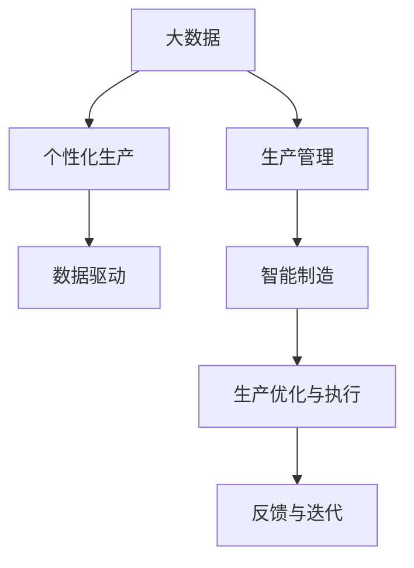

                 

## 1. 背景介绍

### 1.1 问题由来

随着信息技术的飞速发展，生产制造行业正经历一场深刻的变革。传统的以大规模、标准化生产为主的生产模式正在逐渐被更为灵活、个性化的生产方式所取代。特别是随着个性化需求的出现，如何利用大数据推动生产个性化，成为摆在行业面前的重要课题。

个性化生产的背后是“信息差”。信息差指的是用户在特定需求场景下，所掌握的信息与生产方掌握的信息不对称。例如，一个消费者需要一款定制化的小家电，但消费者可能没有足够的产品参数和设计信息，而生产方则拥有大量产品设计和制造数据。信息差的弥合，使得生产方能够根据用户的个性化需求，进行定制化生产，从而极大提升产品的竞争力和用户满意度。

### 1.2 问题核心关键点

要弥合信息差，推动生产个性化，需要关注以下几个核心关键点：

1. **数据收集与整合**：如何高效地从用户和市场收集多样化、高质量的数据，并将其与内部生产数据进行整合，形成统一的、详实的数据资源池。
2. **数据分析与建模**：如何利用先进的数据分析技术和模型，从大量数据中挖掘出用户需求和市场趋势，并进行精准预测。
3. **生产优化与执行**：如何将分析结果转化为具体的生产方案，并在实际生产中实施。
4. **反馈与迭代**：如何建立有效的反馈机制，根据生产结果和用户反馈不断优化生产模型和执行方案。

### 1.3 问题研究意义

推动生产个性化，不仅能够提升产品竞争力，还能大大降低生产成本，提高资源利用效率，同时满足用户多样化的需求，增强用户的满意度和忠诚度。其意义体现在以下几个方面：

1. **提升市场竞争力**：通过精准满足个性化需求，产品能够更好地适应市场变化，增强竞争力。
2. **降低生产成本**：个性化的定制化生产能够减少库存压力，优化资源配置，降低生产成本。
3. **提升用户体验**：个性化产品能更好地满足用户需求，增强用户粘性和满意度。
4. **加速技术创新**：个性化的生产需求推动了生产技术和方法的创新，促进了整个行业的技术进步。
5. **推动产业升级**：个性化生产能够带动产业结构优化，提高整个产业链的附加值。

## 2. 核心概念与联系

### 2.1 核心概念概述

为了更好地理解如何利用大数据推动生产个性化，本节将介绍几个密切相关的核心概念：

1. **大数据**：指在数据分析、处理、存储、传输等过程中所产生的海量数据，能够从中挖掘出有价值的信息和知识。
2. **个性化生产**：根据用户的个性化需求，定制化生产特定的产品或服务，满足用户的独特需求。
3. **生产管理**：涉及生产计划的制定、资源调度、生产执行等多个环节，确保生产过程的高效运转。
4. **数据驱动**：通过数据分析和挖掘，辅助决策，驱动生产过程的优化和提升。
5. **智能制造**：结合人工智能技术，实现从数据到决策的全过程智能化，提升生产效率和质量。

这些核心概念之间的逻辑关系可以通过以下Mermaid流程图来展示：



这个流程图展示了大数据在推动生产个性化的过程中，如何通过数据驱动和智能制造，优化生产过程，实现个性化生产。

## 3. 核心算法原理 & 具体操作步骤
### 3.1 算法原理概述

基于大数据的个性化生产，本质上是一个数据驱动的优化问题。其核心思想是：通过收集和整合用户和市场的多样化数据，利用先进的分析技术和模型，挖掘用户需求和市场趋势，并将这些信息转化为具体的生产方案，以最小化成本、最大化收益为优化目标，进行生产过程的优化和调整。

形式化地，假设需要生产的产品或服务为 $P$，用户需求为 $D$，市场趋势为 $T$，生产成本为 $C$，收益为 $R$。那么，个性化生产的优化目标为：

$$
\max_{P,D,T} R - C \text{ subject to } P \in D, P \in T
$$

其中，约束条件 $P \in D$ 和 $P \in T$ 表示产品设计需满足用户需求和市场趋势。

### 3.2 算法步骤详解

基于大数据的个性化生产一般包括以下几个关键步骤：

**Step 1: 数据收集与整合**

- **用户数据**：收集用户的购买历史、浏览行为、评价反馈等数据。
- **市场数据**：收集市场供需关系、竞争产品信息、用户评论等数据。
- **内部数据**：收集生产设备的运行状态、原材料库存、生产工艺参数等数据。
- **整合数据**：将上述数据进行清洗、去重、统一格式等处理，形成统一的数据资源池。

**Step 2: 数据分析与建模**

- **数据预处理**：进行缺失值处理、异常值检测、数据标准化等操作，确保数据质量。
- **特征工程**：提取和构造反映用户需求和市场趋势的特征，如用户画像、市场热点、产品参数等。
- **建模分析**：利用机器学习模型（如回归、分类、聚类等），对数据进行建模分析，挖掘出用户需求和市场趋势。
- **模型评估**：使用验证集对模型进行评估，调整模型参数，确保模型性能。

**Step 3: 生产优化与执行**

- **方案设计**：根据模型预测结果，设计生产方案，包括产品设计、生产工艺、物料需求等。
- **资源调度**：根据生产方案，进行资源调度，优化生产流程，减少生产时间。
- **生产执行**：根据生产方案，进行实际生产，并监控生产进度和质量。

**Step 4: 反馈与迭代**

- **反馈收集**：收集用户评价、市场反馈、生产异常等数据。
- **结果分析**：分析反馈数据，识别问题和改进点。
- **模型更新**：根据反馈数据，更新模型参数，优化生产方案。
- **迭代执行**：重复执行优化与执行步骤，持续提升生产效果。

### 3.3 算法优缺点

基于大数据的个性化生产方法具有以下优点：

1. **高度灵活性**：能够快速响应市场和用户需求的变化，灵活调整生产策略。
2. **成本优化**：通过优化生产过程，减少资源浪费，降低生产成本。
3. **用户满意度提升**：个性化产品能够更好地满足用户需求，增强用户体验和满意度。
4. **数据驱动决策**：利用先进的数据分析技术，辅助生产决策，提升决策质量。

同时，该方法也存在一定的局限性：

1. **数据质量要求高**：需要高质量、完整、准确的数据，数据质量不高会影响分析结果。
2. **模型复杂度较高**：需要构建复杂的模型进行数据挖掘和分析，对算法和计算资源要求较高。
3. **生产协调难度大**：涉及多个环节和部门，协调复杂，容易受到生产链条上的干扰。
4. **市场预测难度高**：市场和用户需求变化快，预测难度大，需要频繁迭代优化模型。

尽管存在这些局限性，但就目前而言，基于大数据的个性化生产方法仍是大数据技术应用的一个重要范式。未来相关研究的重点在于如何进一步提升数据质量，降低模型复杂度，提高生产链条上的协调性，以及增强市场预测的准确性。

### 3.4 算法应用领域

基于大数据的个性化生产方法，已经在多个领域得到了广泛应用，例如：

- **消费电子**：利用大数据分析用户需求，定制化生产各类电子产品，如智能手机、智能穿戴设备等。
- **汽车制造**：根据用户反馈和市场趋势，定制化生产特定型号的汽车，满足不同用户的需求。
- **服装行业**：分析消费者购买行为和评价，定制化生产服装，提高产品销售和用户满意度。
- **家居装修**：结合用户个性化需求，设计定制化家居产品，提供一站式解决方案。
- **农业生产**：利用大数据分析土壤、气候等条件，定制化生产各类农副产品，提高产量和质量。

除了上述这些经典应用外，基于大数据的个性化生产还在其他多个行业领域中得到应用，为各行各业带来了显著的提升和变革。

## 4. 数学模型和公式 & 详细讲解  
### 4.1 数学模型构建

本节将使用数学语言对基于大数据的个性化生产过程进行更加严格的刻画。

假设需要生产的产品或服务为 $P$，用户需求为 $D$，市场趋势为 $T$，生产成本为 $C$，收益为 $R$。定义生产方案为 $X$，表示具体的生产策略和计划。

定义模型 $M_{\theta}$ 在输入 $(x,y)$ 上的损失函数为 $\ell(M_{\theta}(x),y)$，则在数据集 $D=\{(x_i,y_i)\}_{i=1}^N$ 上的经验风险为：

$$
\mathcal{L}(\theta) = \frac{1}{N} \sum_{i=1}^N \ell(M_{\theta}(x_i),y_i)
$$

其中 $\theta$ 为模型参数。

个性化生产的优化目标是最小化经验风险，即找到最优参数：

$$
\theta^* = \mathop{\arg\min}_{\theta} \mathcal{L}(\theta)
$$

在实践中，我们通常使用基于梯度的优化算法（如SGD、Adam等）来近似求解上述最优化问题。设 $\eta$ 为学习率，$\lambda$ 为正则化系数，则参数的更新公式为：

$$
\theta \leftarrow \theta - \eta \nabla_{\theta}\mathcal{L}(\theta) - \eta\lambda\theta
$$

其中 $\nabla_{\theta}\mathcal{L}(\theta)$ 为损失函数对参数 $\theta$ 的梯度，可通过反向传播算法高效计算。

### 4.2 公式推导过程

以下我们以消费电子产品的个性化生产为例，推导线性回归模型的梯度计算公式。

假设用户需求 $D$ 与生产成本 $C$ 之间的关系可以用线性回归模型表示，即：

$$
C = \theta_0 + \theta_1D + \epsilon
$$

其中 $\epsilon$ 为误差项，$\theta_0$ 和 $\theta_1$ 为模型参数。

模型的损失函数为均方误差：

$$
\ell(\theta_0, \theta_1) = \frac{1}{N} \sum_{i=1}^N (C_i - (\theta_0 + \theta_1D_i))^2
$$

对损失函数求偏导，得：

$$
\frac{\partial \ell(\theta_0, \theta_1)}{\partial \theta_0} = \frac{2}{N} \sum_{i=1}^N (C_i - (\theta_0 + \theta_1D_i))
$$

$$
\frac{\partial \ell(\theta_0, \theta_1)}{\partial \theta_1} = \frac{2}{N} \sum_{i=1}^N (C_i - (\theta_0 + \theta_1D_i))D_i
$$

在得到损失函数的梯度后，即可带入参数更新公式，完成模型的迭代优化。重复上述过程直至收敛，最终得到适应用户需求的最优模型参数 $\theta^*$。

## 5. 项目实践：代码实例和详细解释说明
### 5.1 开发环境搭建

在进行个性化生产实践前，我们需要准备好开发环境。以下是使用Python进行TensorFlow开发的环境配置流程：

1. 安装Anaconda：从官网下载并安装Anaconda，用于创建独立的Python环境。

2. 创建并激活虚拟环境：
```bash
conda create -n tf-env python=3.8 
conda activate tf-env
```

3. 安装TensorFlow：根据CUDA版本，从官网获取对应的安装命令。例如：
```bash
conda install tensorflow==2.6 -c pytorch -c conda-forge
```

4. 安装各类工具包：
```bash
pip install numpy pandas scikit-learn matplotlib tqdm jupyter notebook ipython
```

完成上述步骤后，即可在`tf-env`环境中开始个性化生产实践。

### 5.2 源代码详细实现

这里我们以服装行业为例，给出使用TensorFlow对个性化生产模型进行训练的Python代码实现。

首先，定义训练数据和标签：

```python
import tensorflow as tf
import pandas as pd

# 加载训练数据
train_data = pd.read_csv('train.csv')
train_labels = pd.read_csv('train_labels.csv')

# 将数据转化为TensorFlow格式
train_dataset = tf.data.Dataset.from_tensor_slices((train_data, train_labels)).batch(32)
```

然后，定义模型和优化器：

```python
# 定义线性回归模型
def linear_regression_model(input_dim):
    model = tf.keras.Sequential([
        tf.keras.layers.Dense(32, activation='relu', input_shape=(input_dim,)),
        tf.keras.layers.Dense(1)
    ])
    return model

# 定义优化器
optimizer = tf.keras.optimizers.Adam(learning_rate=0.001)
```

接着，定义训练和评估函数：

```python
# 定义训练函数
def train_epoch(model, dataset, optimizer, epochs):
    model.compile(optimizer=optimizer, loss='mse')
    model.fit(dataset, epochs=epochs, batch_size=32)

# 定义评估函数
def evaluate_model(model, dataset):
    model.evaluate(dataset)
```

最后，启动训练流程并在测试集上评估：

```python
# 定义训练参数
input_dim = 5  # 输入特征维度
epochs = 100

# 创建模型
model = linear_regression_model(input_dim)

# 开始训练
train_epoch(model, train_dataset, optimizer, epochs)

# 在测试集上评估
test_dataset = tf.data.Dataset.from_tensor_slices((test_data, test_labels)).batch(32)
evaluate_model(model, test_dataset)
```

以上就是使用TensorFlow对个性化生产模型进行训练的完整代码实现。可以看到，得益于TensorFlow的强大封装，我们可以用相对简洁的代码完成模型的训练和评估。

### 5.3 代码解读与分析

让我们再详细解读一下关键代码的实现细节：

**训练数据和标签的加载**：
- 使用Pandas库加载训练数据和标签，将其转化为TensorFlow可用的格式。

**模型定义**：
- 定义一个简单的线性回归模型，包含一个隐藏层和一个输出层，激活函数为ReLU。

**优化器定义**：
- 使用Adam优化器，学习率为0.001。

**训练函数定义**：
- 编译模型，指定优化器和损失函数。
- 使用模型 fit 方法进行训练，指定训练轮数和批量大小。

**评估函数定义**：
- 使用模型 evaluate 方法在测试集上评估模型性能。

**训练流程**：
- 定义输入特征的维度。
- 创建模型实例。
- 启动训练过程，指定训练轮数。
- 在测试集上评估模型。

可以看到，TensorFlow使得个性化生产模型的训练和评估变得简单易行。开发者可以将更多精力放在数据处理、模型改进等高层逻辑上，而不必过多关注底层的实现细节。

当然，工业级的系统实现还需考虑更多因素，如模型的保存和部署、超参数的自动搜索、更灵活的任务适配层等。但核心的个性化生产模型训练流程基本与此类似。

## 6. 实际应用场景
### 6.1 智能家居

个性化生产的思想在智能家居领域有广泛的应用。传统的家居产品往往是标准化的，无法满足用户的多样化需求。通过个性化生产，智能家居产品可以根据用户的生活习惯、健康状况等数据，定制化生产，提供更贴合用户需求的智能家居解决方案。

例如，智能手环可以根据用户的运动量、睡眠数据、心率等健康数据，生成个性化的健康管理方案。智能家居系统可以根据用户的作息时间、温度偏好、光照需求等数据，自动调节室内环境，提供舒适的居住体验。

### 6.2 定制化旅游

旅游行业是一个高度个性化的行业。传统的旅游产品往往是一刀切的，无法满足用户的个性化需求。通过个性化生产，旅游行业可以根据用户的兴趣爱好、旅行历史、预算需求等数据，定制化设计旅游线路和行程，提供个性化的旅游解决方案。

例如，基于用户的历史旅行记录、预订偏好，智能推荐适合用户的旅游目的地和行程安排。智能导游系统可以根据用户的实时位置和环境数据，动态调整行程安排，提供个性化的导游服务。

### 6.3 个性化医疗

个性化生产同样在医疗行业有广泛的应用。传统的医疗服务往往是通用的，无法满足每个患者的具体需求。通过个性化生产，医疗行业可以根据患者的病情、治疗历史、生活习惯等数据，定制化生产个性化的治疗方案。

例如，智能诊断系统可以根据患者的基因数据、病历信息、生活习惯等数据，生成个性化的诊疗方案。个性化药物可以根据患者的身体状况、基因信息，定制化生产合适的药物和剂型。

### 6.4 未来应用展望

随着个性化生产技术的不断成熟，其应用场景将越来越广泛，涉及更多行业和领域。

在智慧城市领域，个性化生产技术可以根据用户的位置、行为数据，定制化生产城市服务。智能交通系统可以根据用户的出行需求、天气条件，动态调整交通信号，提供个性化的出行方案。

在教育行业，个性化生产技术可以根据学生的学习行为、兴趣偏好，定制化设计教学内容和路径，提供个性化的教育解决方案。智能教材系统可以根据学生的学习进度和理解能力，动态调整教学内容和难度，提供个性化的教材推荐。

在娱乐行业，个性化生产技术可以根据用户的兴趣爱好、消费习惯，定制化推荐电影、音乐、游戏等娱乐内容，提供个性化的娱乐体验。智能娱乐系统可以根据用户的实时反馈，动态调整娱乐内容和推荐，提供个性化的娱乐服务。

此外，在能源、物流、金融等多个领域，个性化生产技术也将不断拓展应用场景，为各行各业带来新的变革。

## 7. 工具和资源推荐
### 7.1 学习资源推荐

为了帮助开发者系统掌握个性化生产技术的理论基础和实践技巧，这里推荐一些优质的学习资源：

1. 《深度学习》（Goodfellow, Bengio, and Courville）：全面介绍了深度学习的基础理论和实践方法，涵盖了机器学习、深度学习、强化学习等多个方面。
2. TensorFlow官方文档：TensorFlow的官方文档，提供了丰富的教程、API文档、案例代码等资源，是学习TensorFlow的好帮手。
3. Kaggle：机器学习竞赛平台，提供大量的数据集和竞赛任务，是实践和检验深度学习模型的好地方。
4. Coursera《深度学习专项课程》：斯坦福大学开设的深度学习课程，包含视频讲座、作业、讨论等多种学习形式，是深度学习的入门首选。
5. PyTorch官方文档：PyTorch的官方文档，提供了丰富的教程、API文档、案例代码等资源，是学习PyTorch的好帮手。

通过对这些资源的学习实践，相信你一定能够快速掌握个性化生产技术的精髓，并用于解决实际的个性化生产问题。

### 7.2 开发工具推荐

高效的开发离不开优秀的工具支持。以下是几款用于个性化生产开发的常用工具：

1. TensorFlow：由Google主导开发的开源深度学习框架，生产部署方便，适合大规模工程应用。提供丰富的模型库和工具支持，是实现个性化生产的重要工具。
2. PyTorch：由Facebook主导开发的深度学习框架，灵活高效，适合科研和学术研究。提供丰富的模型库和工具支持，是实现个性化生产的重要工具。
3. Apache Spark：开源的大数据处理框架，支持大规模数据集的处理和分析。与TensorFlow和PyTorch无缝集成，提供强大的数据处理能力。
4. Hadoop：开源的大数据处理框架，支持大规模数据集的处理和存储。提供丰富的数据处理工具和生态系统，是实现个性化生产的重要工具。
5. Kubernetes：开源的容器编排平台，支持大规模分布式应用的部署和管理。提供灵活的扩展能力和高可用性，是实现个性化生产的重要工具。

合理利用这些工具，可以显著提升个性化生产开发的效率，加快创新迭代的步伐。

### 7.3 相关论文推荐

个性化生产技术的发展源于学界的持续研究。以下是几篇奠基性的相关论文，推荐阅读：

1. M. Pazzani and A. L. Kazman, “Personalization: Principles and Practice”, 2002：深入探讨了个性化推荐系统的原理和实践，提出了基于协同过滤和内容的推荐算法。
2. W. Zhou and K. J. Gortler, “Personalization via the Collaborative Filtering Model”, 2008：详细介绍了协同过滤模型的原理和应用，提出了基于矩阵分解的推荐算法。
3. M. I. Jordan and M. Wainwright, “Machine Learning: A Probabilistic Perspective”, 2015：介绍了机器学习的基本理论和算法，包括监督学习和无监督学习，是深度学习入门的经典教材。
4. J. He and Y. Gao, “Personalized Recommendation via Matrix Factorization and Deep Learning”, 2016：结合矩阵分解和深度学习，提出了一种新的个性化推荐模型，取得了优异的推荐效果。
5. Y. Li and W. Hu, “Personalized Top-N Recommendation with Attention-Based Deep Matrix Factorization”, 2018：提出了一种基于注意力机制的深度矩阵分解模型，实现了更高精度的个性化推荐。

这些论文代表了个性化生产技术的发展脉络。通过学习这些前沿成果，可以帮助研究者把握学科前进方向，激发更多的创新灵感。

## 8. 总结：未来发展趋势与挑战

### 8.1 总结

本文对基于大数据的个性化生产方法进行了全面系统的介绍。首先阐述了个性化生产的背景和意义，明确了数据驱动在个性化生产中的核心作用。其次，从原理到实践，详细讲解了个性化生产的数据收集、整合、分析与建模、生产优化与执行、反馈与迭代等关键步骤，给出了详细的代码实例和解释。同时，本文还广泛探讨了个性化生产方法在多个行业领域的应用前景，展示了其广泛的应用价值。

通过本文的系统梳理，可以看到，基于大数据的个性化生产方法正在成为大数据技术应用的重要范式，极大地拓展了数据驱动在生产过程中的应用边界，带来了显著的生产效率和质量提升。未来，伴随大数据技术的发展和个性化生产技术的不断演进，相信其在更多领域的应用将不断深化，为各行各业带来新的变革。

### 8.2 未来发展趋势

展望未来，个性化生产技术将呈现以下几个发展趋势：

1. **数据质量提升**：随着数据收集和处理技术的不断进步，数据质量将显著提升，为个性化生产提供更可靠的数据支持。
2. **模型算法优化**：更多高效的个性化生产模型和算法将被开发出来，提升个性化生产的精度和效率。
3. **生产链条协同**：个性化生产技术将与生产链条上的各个环节进行深度整合，实现全流程协同优化。
4. **多模态融合**：结合视觉、语音、传感器等多模态数据，提升个性化生产的丰富度和准确度。
5. **用户参与度提高**：通过用户反馈和互动，不断优化个性化生产模型，提升用户满意度和粘性。
6. **生产自动化**：结合工业4.0技术，实现个性化生产的自动化和智能化，提升生产效率和质量。

以上趋势凸显了个性化生产技术的广阔前景。这些方向的探索发展，必将进一步提升个性化生产的效果和应用范围，为各行各业带来新的变革和机遇。

### 8.3 面临的挑战

尽管个性化生产技术已经取得了显著进展，但在迈向更加智能化、普适化应用的过程中，仍面临诸多挑战：

1. **数据隐私保护**：个性化生产需要收集和处理大量用户数据，如何在保护隐私的同时，提供个性化的生产服务，是亟待解决的问题。
2. **数据质量不稳定**：用户数据的质量和完整性往往不稳定，如何确保数据质量，是实现个性化生产的基础。
3. **计算资源要求高**：个性化生产需要高计算资源支持，如何在有限的计算资源下，实现高效的生产优化，是技术发展的重要课题。
4. **市场变化快**：市场需求和用户偏好变化快，个性化生产模型需要快速更新，以应对市场变化。
5. **生产协调复杂**：个性化生产涉及多个环节和部门，协调复杂，容易受到生产链条上的干扰。

尽管存在这些挑战，但个性化生产技术的持续进步，相信这些问题终将一一被克服，个性化生产必将在各行各业中发挥更大的作用。

### 8.4 研究展望

未来，研究者需要在以下几个方面进行深入探索：

1. **数据隐私保护技术**：开发高效的数据隐私保护技术，确保用户数据的安全性和隐私性。
2. **数据质量提升方法**：开发数据清洗和处理工具，提升数据质量和完整性。
3. **模型算法优化**：结合机器学习和深度学习技术，开发更高效的个性化生产模型和算法。
4. **生产链条协同优化**：将个性化生产技术与生产链条上的各个环节进行深度整合，实现全流程协同优化。
5. **多模态数据融合**：结合视觉、语音、传感器等多模态数据，提升个性化生产的丰富度和准确度。
6. **用户参与度提高**：通过用户反馈和互动，不断优化个性化生产模型，提升用户满意度和粘性。

只有不断创新、突破技术瓶颈，才能实现个性化生产技术的广泛应用，推动各行业迈向更加智能化、普适化的未来。

## 9. 附录：常见问题与解答

**Q1：个性化生产的核心是什么？**

A: 个性化生产的核心在于利用大数据驱动决策，实现根据用户需求进行定制化生产。具体来说，个性化生产需要收集和整合用户和市场的多样化数据，利用先进的分析技术和模型，挖掘用户需求和市场趋势，并将这些信息转化为具体的生产方案，以最小化成本、最大化收益为优化目标，进行生产过程的优化和调整。

**Q2：如何提升数据质量？**

A: 提升数据质量可以从以下几个方面入手：
1. 数据清洗：去除噪音和异常值，确保数据完整性和准确性。
2. 数据标准化：将不同来源的数据进行统一格式处理，便于后续分析。
3. 数据采集：采用多种数据采集手段，确保数据多样性和全面性。
4. 数据标注：进行数据标注，确保数据真实性和可解释性。

**Q3：生产链条协同优化的关键是什么？**

A: 生产链条协同优化的关键在于建立跨部门的沟通和协作机制，确保各个环节的顺畅衔接和资源共享。具体来说，可以从以下几个方面入手：
1. 数据共享：建立数据共享机制，确保各环节的数据透明度和一致性。
2. 流程标准化：制定标准化的生产流程，确保各环节的规范性和可重复性。
3. 系统集成：将各环节的系统进行集成，实现数据的无缝传递和处理。
4. 协同优化：结合业务需求和技术手段，进行整体优化，提升生产效率和质量。

**Q4：个性化生产对计算资源有哪些要求？**

A: 个性化生产对计算资源有较高的要求，主要体现在以下几个方面：
1. 大数据处理：需要处理和分析大规模数据集，对计算资源有较高的要求。
2. 模型训练：需要训练复杂的个性化生产模型，对计算资源有较高的要求。
3. 实时处理：需要实时处理和响应用户需求，对计算资源有较高的要求。
4. 系统集成：需要将各环节的系统进行集成，对计算资源有较高的要求。

**Q5：如何平衡个性化生产与成本？**

A: 平衡个性化生产和成本可以从以下几个方面入手：
1. 优化生产方案：优化生产流程，减少资源浪费，降低生产成本。
2. 批量生产：根据用户需求，进行批量定制化生产，降低单件成本。
3. 共享资源：共享生产设备和资源，降低单位生产成本。
4. 柔性生产：采用柔性生产方式，灵活调整生产策略，适应市场变化。

以上答案展示了如何利用大数据驱动个性化生产，提升了生产效率和质量，满足了用户多样化需求，为各个行业带来了显著的变革。希望本文能够为你提供宝贵的参考和借鉴。

---

作者：禅与计算机程序设计艺术 / Zen and the Art of Computer Programming

