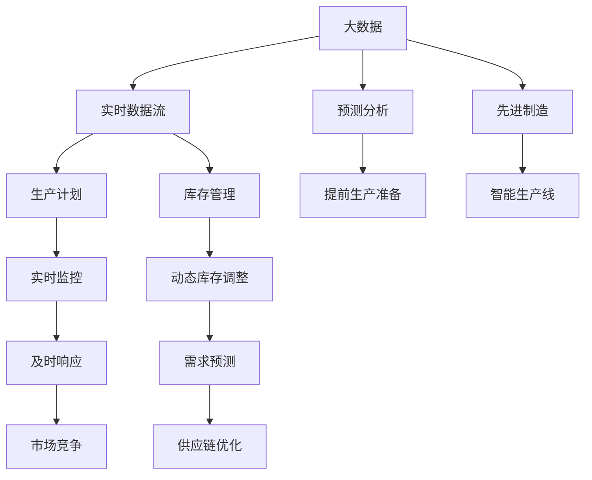

                 

# 信息差：大数据在制造业的应用

## 1. 背景介绍

### 1.1 问题由来

在过去的几十年里，全球制造业经历了巨大的变革。自动化生产线的引入、机器人技术的快速发展、以及信息技术的不断进步，使得制造业的生产效率和产品质量都得到了极大的提升。然而，传统制造系统往往面临信息孤岛问题，企业内部的生产流程、物流管理、供应链控制等方面，缺乏高效的数据整合与实时信息共享。信息差（Information Gap）的存在，导致了生产资源无法得到有效配置，生产效率低下，库存积压严重，客户需求响应速度慢等问题。

### 1.2 问题核心关键点

信息差问题的核心在于企业内部和外部之间存在着信息不对称。一方面，制造企业在生产、物流、销售等各个环节生成大量数据，但这些数据往往分散在各个孤立的系统之中，缺乏有效的集成和利用。另一方面，市场和客户需求的变化也难以实时传达给生产一线，导致生产计划和库存管理无法及时响应市场需求。信息差的存在，使得制造企业在面对复杂多变的市场环境时，往往反应迟钝，难以快速调整生产策略和资源配置。

### 1.3 问题研究意义

研究如何利用大数据技术弥合信息差，提升制造企业的运营效率和市场响应速度，对于推动制造业的数字化转型，提升全球供应链的灵活性和竞争力，具有重要的现实意义。通过大数据技术的应用，制造企业可以实现跨部门的协同作业、实时数据监控、精准的生产计划制定，从而大幅提升生产效率、降低运营成本、提升客户满意度，最终实现制造业的智能化升级。

## 2. 核心概念与联系

### 2.1 核心概念概述

为了更好地理解大数据在制造业的应用，本节将介绍几个密切相关的核心概念：

- 大数据（Big Data）：指数据量巨大、类型多样、速度实时、价值密度低的大规模数据集合。通过大数据分析，可以从海量数据中挖掘出有用的信息，支持决策和运营优化。
- 信息差（Information Gap）：指企业内部和外部之间存在着信息不对称，使得企业难以获得实时、准确的市场和客户需求信息，导致生产计划和库存管理无法及时响应市场需求。
- 实时数据流（Real-time Data Streaming）：指通过传感器、物联网（IoT）设备等技术，实时收集企业生产、物流、销售等各个环节的数据流，为生产决策提供及时、准确的依据。
- 预测分析（Predictive Analytics）：指利用机器学习、统计学等技术，对未来市场、需求、生产等进行预测，以提前做好生产准备和库存管理。
- 先进制造（Advanced Manufacturing）：指通过数字化、自动化、智能化技术，提高生产效率、降低成本、提升产品质量的制造方式。

这些核心概念之间的逻辑关系可以通过以下Mermaid流程图来展示：



这个流程图展示了大数据、实时数据流、预测分析、先进制造等概念之间的联系：

1. 大数据通过实时数据流获取企业内部和外部的各种数据，支持预测分析和先进制造。
2. 实时数据流和预测分析结合，可以提前做好生产准备和库存管理。
3. 预测分析和先进制造配合，可以实现智能生产线、实时监控和动态库存调整。
4. 实时监控和动态库存调整可以及时响应市场变化和客户需求，提升市场竞争力。
5. 智能生产线和供应链优化结合，可以构建更加高效、灵活的制造系统。

## 3. 核心算法原理 & 具体操作步骤

### 3.1 算法原理概述

大数据在制造业的应用主要围绕实时数据流、预测分析和先进制造三个核心环节展开。具体来说，通过实时数据流获取企业内部的各种生产、物流、销售数据，结合预测分析进行需求预测、生产计划制定和库存管理优化，最终通过先进制造技术实现高效生产。

### 3.2 算法步骤详解

大数据在制造业的应用可以概括为以下几个关键步骤：

**Step 1: 数据采集与集成**

- 利用传感器、物联网设备等技术，从生产车间、仓库、物流中心等环节实时采集数据。
- 通过数据集成平台，将这些数据源集成到一个统一的数据仓库中。
- 清洗和预处理数据，确保数据质量和完整性。

**Step 2: 实时数据流分析**

- 利用大数据处理技术（如Apache Spark、Hadoop等），对实时数据流进行高效处理和分析。
- 通过流式计算框架（如Apache Kafka、Flink等），实时监控生产、物流、销售等环节的状态。
- 利用实时数据流进行异常检测和告警，及时发现和处理生产问题。

**Step 3: 预测分析与生产计划**

- 使用机器学习、深度学习等技术，对历史数据和实时数据进行建模，进行需求预测和生产计划制定。
- 结合供应链管理信息，进行动态库存调整和资源配置优化。
- 使用集成优化算法（如遗传算法、模拟退火等），优化生产计划和供应链方案。

**Step 4: 智能制造与实时监控**

- 通过智能制造技术（如工业物联网、数字孪生等），实现生产过程的数字化和智能化。
- 利用物联网设备和传感器，实时监控生产过程中的各个环节。
- 结合预测分析和实时监控数据，动态调整生产参数，优化生产效率。

**Step 5: 数据分析与决策支持**

- 利用大数据分析技术，挖掘生产、物流、销售等环节的关联性和规律性。
- 通过可视化工具（如Tableau、PowerBI等），将分析结果可视化展示，支持高层决策。
- 结合业务需求和市场趋势，制定企业战略和运营方案。

### 3.3 算法优缺点

大数据在制造业的应用具有以下优点：

1. 提高生产效率。通过实时数据流和预测分析，可以优化生产计划和库存管理，提升生产效率。
2. 降低运营成本。通过大数据分析，可以发现生产过程中的瓶颈和浪费，降低资源消耗。
3. 提升客户满意度。通过精准的生产计划和库存管理，可以更好地满足客户需求，提升客户满意度。
4. 增强市场竞争力。通过实时数据流和预测分析，可以及时响应市场变化，增强市场竞争力。

同时，该方法也存在一些局限性：

1. 数据质量和隐私问题。实时数据流的采集和存储需要保证数据质量和隐私安全，否则可能影响数据分析的准确性和可靠性。
2. 技术和人才投入高。大数据技术和预测分析需要高水平的技术和专业人才支持，企业需要投入大量资源进行培训和技术引进。
3. 设备投资大。智能制造和物联网设备的引入需要较大的一次性投资，对企业财务压力较大。
4. 数据集成复杂。实时数据流的集成和整合需要高度复杂的技术和协作，实施难度较大。

尽管存在这些局限性，但大数据技术在制造业的应用已展现出巨大的潜力，未来随着技术的不断成熟和成本的进一步降低，将有望在更多制造业场景中得到应用，推动制造业的数字化转型。

### 3.4 算法应用领域

大数据在制造业的应用涵盖多个领域，包括但不限于：

1. **智能制造**：通过物联网、工业物联网、数字孪生等技术，实现生产过程的数字化、智能化，提升生产效率和质量。
2. **供应链优化**：利用实时数据流和预测分析，优化库存管理、物流调度和资源配置，降低运营成本，提升供应链的灵活性和效率。
3. **预测维护**：通过预测分析，预测设备故障和维护需求，提前做好维修和备件准备，减少生产停滞和设备维护成本。
4. **质量控制**：利用大数据分析技术，实时监控产品质量，及时发现和解决生产过程中出现的问题，提升产品质量。
5. **能源管理**：通过实时数据流和能源管理系统的结合，优化能源使用，降低能源消耗，提升能源利用效率。
6. **员工管理**：通过实时监控和数据分析，优化员工工作流程和任务分配，提升员工生产效率和工作满意度。

## 4. 数学模型和公式 & 详细讲解 & 举例说明

### 4.1 数学模型构建

本节将使用数学语言对大数据在制造业的应用进行更加严格的刻画。

记企业内部生产、物流、销售等环节的实时数据流为 $D=\{d_i\}_{i=1}^N$，其中 $d_i$ 表示第 $i$ 个数据点，包括时间戳、生产状态、设备状态、库存水平等信息。设生产计划为 $P$，库存水平为 $I$，市场需求为 $D_{market}$。

定义实时数据流分析的损失函数为 $L(D)$，预测分析的损失函数为 $L(P, I, D_{market})$，智能制造的损失函数为 $L_{manufacturing}$，数据分析与决策支持的损失函数为 $L_{analysis}$。则大数据在制造业应用的总损失函数为：

$$
\mathcal{L} = \alpha L(D) + \beta L(P, I, D_{market}) + \gamma L_{manufacturing} + \delta L_{analysis}
$$

其中 $\alpha, \beta, \gamma, \delta$ 为权重参数，根据实际情况进行调整。

### 4.2 公式推导过程

以下我们以预测分析为例，推导预测模型的损失函数及其梯度计算公式。

假设需求预测模型为 $F_{pred}(t)$，实际市场需求为 $D_{actual}(t)$，其中 $t$ 为时间。定义预测模型的误差函数为：

$$
E(t) = \frac{1}{N} \sum_{i=1}^N |F_{pred}(t) - D_{actual}(t)|^2
$$

则预测分析的损失函数为：

$$
L(P, I, D_{market}) = \sum_{t=1}^{T} \frac{\lambda}{2} E(t) + \eta |P - \hat{P}|^2 + \zeta |I - \hat{I}|^2
$$

其中 $T$ 为预测时间窗口，$\lambda, \eta, \zeta$ 为惩罚系数，$P, I$ 为生产计划和库存水平，$\hat{P}, \hat{I}$ 为模型预测的生产计划和库存水平。

通过反向传播算法，可以得到损失函数对模型参数 $w$ 的梯度为：

$$
\frac{\partial L}{\partial w} = -\frac{\lambda}{N} \sum_{t=1}^T \sum_{i=1}^N \frac{\partial E(t)}{\partial w} + \eta \frac{\partial |P - \hat{P}|^2}{\partial w} + \zeta \frac{\partial |I - \hat{I}|^2}{\partial w}
$$

在得到损失函数的梯度后，即可带入优化算法，进行参数更新。重复上述过程直至收敛，最终得到适应实时需求的生产计划和库存水平。

## 5. 项目实践：代码实例和详细解释说明

### 5.1 开发环境搭建

在进行大数据在制造业应用的项目实践前，我们需要准备好开发环境。以下是使用Python进行PyTorch开发的环境配置流程：

1. 安装Anaconda：从官网下载并安装Anaconda，用于创建独立的Python环境。

2. 创建并激活虚拟环境：
```bash
conda create -n pytorch-env python=3.8 
conda activate pytorch-env
```

3. 安装PyTorch：根据CUDA版本，从官网获取对应的安装命令。例如：
```bash
conda install pytorch torchvision torchaudio cudatoolkit=11.1 -c pytorch -c conda-forge
```

4. 安装TensorFlow：
```bash
pip install tensorflow
```

5. 安装各类工具包：
```bash
pip install numpy pandas scikit-learn matplotlib tqdm jupyter notebook ipython
```

完成上述步骤后，即可在`pytorch-env`环境中开始项目实践。

### 5.2 源代码详细实现

下面我们以预测分析在制造业中的应用为例，给出使用TensorFlow进行实时需求预测的代码实现。

首先，定义需求预测的数据处理函数：

```python
import tensorflow as tf
import numpy as np

def process_data(data):
    data = np.array(data, dtype=float)
    data = data.reshape(-1, 1)
    return data
```

然后，定义模型和优化器：

```python
def create_model():
    model = tf.keras.Sequential([
        tf.keras.layers.Dense(64, activation='relu', input_shape=(1,)),
        tf.keras.layers.Dense(1)
    ])
    model.compile(optimizer=tf.keras.optimizers.Adam(0.01), loss='mse')
    return model

model = create_model()
```

接着，定义训练和评估函数：

```python
def train_model(model, x_train, y_train, epochs=100):
    model.fit(x_train, y_train, epochs=epochs, batch_size=32, verbose=0)

def evaluate_model(model, x_test, y_test):
    mse = tf.keras.metrics.MeanSquaredError()
    mse(y_test, model.predict(x_test))
    return mse.result()
```

最后，启动训练流程并在测试集上评估：

```python
x_train = process_data(train_data)
y_train = process_data(train_labels)

x_test = process_data(test_data)
y_test = process_data(test_labels)

train_model(model, x_train, y_train)
mse = evaluate_model(model, x_test, y_test)
print(f"Mean Squared Error: {mse:.3f}")
```

以上就是使用TensorFlow进行实时需求预测的完整代码实现。可以看到，TensorFlow提供了简单易用的API，可以快速实现神经网络模型的搭建和训练。

### 5.3 代码解读与分析

让我们再详细解读一下关键代码的实现细节：

**process_data函数**：
- 将输入数据转换为numpy数组，并进行归一化处理，确保数据符合模型输入格式。

**create_model函数**：
- 定义一个包含两个全连接层的神经网络模型，使用ReLU激活函数和Adam优化器，最后输出一个标量值。

**train_model函数**：
- 使用训练数据对模型进行训练，设置训练轮数和批次大小，并输出训练损失。

**evaluate_model函数**：
- 使用测试数据对模型进行评估，计算平均平方误差，并返回评估结果。

**训练流程**：
- 先对训练数据进行预处理，然后进行模型训练，并在测试集上评估模型性能。

可以看到，TensorFlow提供了丰富的工具和API，使得大数据在制造业应用的实现变得简洁高效。开发者可以专注于算法设计和模型优化，而不必过多关注底层的实现细节。

当然，工业级的系统实现还需考虑更多因素，如模型的保存和部署、超参数的自动搜索、更灵活的任务适配层等。但核心的预测分析范式基本与此类似。

## 6. 实际应用场景

### 6.1 智能制造

大数据在智能制造中的应用，主要体现在以下几个方面：

1. **生产过程监控**：通过实时数据流和物联网设备，实时监控生产过程中的各个环节，如设备状态、生产速度、温度、湿度等。这些实时数据可以帮助企业及时发现和解决生产过程中出现的问题，提升生产效率和产品质量。
2. **设备预测维护**：通过大数据分析和预测模型，预测设备故障和维护需求，提前做好维修和备件准备，减少生产停滞和设备维护成本。
3. **质量控制**：利用大数据分析技术，实时监控产品质量，及时发现和解决生产过程中出现的问题，提升产品质量。

### 6.2 供应链优化

大数据在供应链优化中的应用，主要体现在以下几个方面：

1. **库存管理**：通过实时数据流和预测分析，优化库存管理，实时调整库存水平，减少库存积压和短缺。
2. **物流调度和运输优化**：利用实时数据流和预测分析，优化物流调度和运输路径，降低物流成本，提升运输效率。
3. **供应商管理**：通过实时数据流和分析工具，监控供应商的生产和交付情况，及时发现和解决供应链问题，提高供应链的稳定性和可靠性。

### 6.3 预测分析与决策支持

大数据在预测分析与决策支持中的应用，主要体现在以下几个方面：

1. **需求预测**：通过历史数据和实时数据，预测市场需求和生产计划，优化生产资源配置，提升生产效率和市场竞争力。
2. **市场趋势分析**：利用大数据分析技术，分析市场趋势和客户需求变化，为企业决策提供科学依据。
3. **风险管理**：通过大数据分析和预测模型，识别企业运营中的风险点，提前做好风险控制和应对措施。

## 7. 工具和资源推荐

### 7.1 学习资源推荐

为了帮助开发者系统掌握大数据在制造业的应用，这里推荐一些优质的学习资源：

1. 《大数据应用实战》系列书籍：由著名数据科学家和工程师撰写，深入浅出地介绍了大数据技术在各个行业的应用案例。
2. 《工业物联网与智能制造》课程：由知名大学和工业界专家联合开设，涵盖工业物联网、智能制造、数据分析等前沿技术。
3. 《Python数据分析实战》书籍：介绍了使用Python进行数据分析的实用技巧和方法，涵盖数据预处理、统计分析、机器学习等技术。
4. Coursera《数据科学与人工智能》课程：由斯坦福大学和谷歌等机构提供，涵盖数据科学、机器学习、人工智能等多个领域的前沿知识。
5. 《TensorFlow实战》书籍：介绍了使用TensorFlow进行深度学习和数据分析的实践技巧，适合初学者和有经验的数据科学家。

通过对这些资源的学习实践，相信你一定能够快速掌握大数据在制造业的应用精髓，并用于解决实际的业务问题。

### 7.2 开发工具推荐

高效的开发离不开优秀的工具支持。以下是几款用于大数据在制造业应用开发的常用工具：

1. Apache Spark：基于内存计算的分布式数据处理引擎，支持流式计算、批处理和大数据分析。
2. Apache Kafka：实时数据流处理平台，支持数据采集、传输和存储，适合大数据在制造业的实时数据流应用。
3. TensorFlow：由Google主导开发的深度学习框架，生产部署方便，适合大规模工程应用。
4. Tableau：数据可视化工具，支持大数据分析结果的可视化展示，适合高层决策和业务分析。
5. Jupyter Notebook：交互式编程环境，适合进行数据预处理、模型训练和评估等任务。

合理利用这些工具，可以显著提升大数据在制造业应用的开发效率，加快创新迭代的步伐。

### 7.3 相关论文推荐

大数据在制造业的应用源于学界的持续研究。以下是几篇奠基性的相关论文，推荐阅读：

1. 《智能制造与物联网》（Intelligent Manufacturing and Internet of Things）：介绍了智能制造与物联网技术在制造中的应用，涵盖了传感器、工业物联网、数字孪生等技术。
2. 《大数据驱动的供应链优化》（Supply Chain Optimization Driven by Big Data）：讨论了大数据在供应链优化中的应用，提出了基于需求预测的库存管理方法和物流优化策略。
3. 《实时数据流与预测分析》（Real-time Data Streaming and Predictive Analytics）：研究了实时数据流和预测分析在制造中的应用，提出了基于实时数据流的需求预测和生产计划优化方法。
4. 《工业大数据分析与决策支持》（Industrial Big Data Analytics and Decision Support）：介绍了大数据分析在工业领域的应用，涵盖生产过程监控、设备预测维护、质量控制等技术。
5. 《先进制造与人工智能》（Advanced Manufacturing and Artificial Intelligence）：讨论了先进制造与人工智能技术的融合，提出了基于人工智能的智能制造方法和优化算法。

这些论文代表了大数据在制造业应用的发展脉络。通过学习这些前沿成果，可以帮助研究者把握学科前进方向，激发更多的创新灵感。

## 8. 总结：未来发展趋势与挑战

### 8.1 总结

本文对大数据在制造业的应用进行了全面系统的介绍。首先阐述了大数据在制造业的应用背景和意义，明确了实时数据流、预测分析和先进制造在其中的重要作用。其次，从原理到实践，详细讲解了大数据在制造业的实现过程，给出了实时数据流、预测分析和智能制造的代码实现。同时，本文还广泛探讨了大数据在智能制造、供应链优化、预测分析等方面的应用前景，展示了大数据技术在制造业的巨大潜力。

通过本文的系统梳理，可以看到，大数据在制造业的应用已经成为推动制造业数字化转型的重要手段。实时数据流的采集和分析，预测模型的构建和训练，智能制造的数字化和智能化，构成了大数据在制造业应用的核心技术框架。随着大数据技术的不断成熟和应用实践的不断积累，相信大数据在制造业的应用将迎来更广阔的前景，为制造业的智能化升级提供强有力的技术支撑。

### 8.2 未来发展趋势

展望未来，大数据在制造业的应用将呈现以下几个发展趋势：

1. 数据采集和集成技术将不断提升。随着传感器、物联网设备的发展，企业可以采集更多、更实时的数据，从而提升数据的质量和完整性。同时，数据集成技术也将不断改进，实现更加高效的数据整合和治理。
2. 实时数据流和流式计算技术将广泛应用。实时数据流和流式计算技术将在大数据在制造业的应用中发挥重要作用，支持企业进行实时监控、预测分析和智能决策。
3. 预测分析技术和算法将更加丰富。机器学习、深度学习、强化学习等算法将不断应用于需求预测、生产计划和库存管理等方面，提升预测的准确性和稳定性。
4. 智能制造和工业物联网技术将深入融合。智能制造和工业物联网技术将深度融合，形成更加高效、智能的生产体系，提升生产效率和产品质量。
5. 大数据分析工具和平台将更加灵活。大数据分析工具和平台将不断丰富和完善，支持企业进行多维度、多层次的数据分析和决策支持。

### 8.3 面临的挑战

尽管大数据在制造业的应用已取得显著成效，但在迈向更加智能化、普适化应用的过程中，仍面临诸多挑战：

1. 数据安全和隐私问题。实时数据流的采集和存储需要保证数据安全和隐私，避免数据泄露和滥用。
2. 数据质量保障问题。实时数据流的采集和处理需要保证数据的质量和准确性，避免因数据错误导致的决策失误。
3. 技术复杂性和成本问题。大数据技术和智能制造技术需要高水平的技术和专业人才支持，且相关设备和系统的引入需要较大的一次性投资，对企业财务压力较大。
4. 数据集成和协作问题。实时数据流的集成和整合需要高度复杂的技术和协作，实施难度较大。
5. 人才和技能问题。大数据和智能制造技术的应用需要高度复合型的人才，企业需要投入大量资源进行人才培训和团队建设。

尽管存在这些挑战，但大数据技术在制造业的应用已展现出巨大的潜力，未来随着技术的不断成熟和成本的进一步降低，将有望在更多制造业场景中得到应用，推动制造业的数字化转型。

### 8.4 研究展望

面对大数据在制造业应用所面临的挑战，未来的研究需要在以下几个方面寻求新的突破：

1. 探索更高效的数据采集和集成技术。研究如何利用低成本、高性能的传感器和设备，提升实时数据流的采集效率和质量。同时研究更高效的数据集成和治理方法，保证数据的完整性和一致性。
2. 开发更灵活的预测分析模型。研究更先进、更稳定的预测算法，提升预测的准确性和鲁棒性。同时研究如何结合领域知识和先验信息，提高预测模型的泛化能力和适应性。
3. 深化智能制造和工业物联网技术的融合。研究如何通过大数据和人工智能技术的融合，提升生产过程的智能化和自动化水平，实现更加高效、智能的生产体系。
4. 推动数据安全和隐私保护技术的发展。研究更有效的数据加密、数据匿名化等技术，保障数据安全和隐私。同时研究如何建立数据使用的透明性和监管机制，确保数据使用的合法性和合规性。
5. 培养更多高素质的大数据和智能制造人才。通过教育培训和产业合作，培养更多复合型的人才，提升企业的技术水平和创新能力。

这些研究方向的探索，必将引领大数据在制造业应用技术迈向更高的台阶，为制造业的智能化升级提供强有力的技术支撑。面向未来，大数据在制造业的应用需要跨学科、跨领域的协同合作，共同推动制造业的数字化转型，实现可持续发展。

