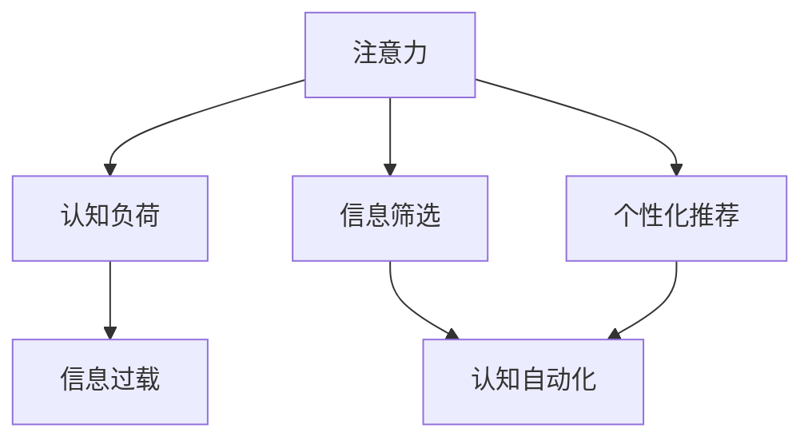

                 

# 信息时代的注意力管理挑战与策略：在干扰和信息过载中航行

## 1. 背景介绍

在信息时代，人类的生活被海量信息所包围。从社交媒体到新闻资讯，从电子邮件到即时通讯，各种信息源不断产生新的消息，吸引着我们的注意力。然而，随着信息量的爆炸性增长，我们的注意力资源却变得越来越稀缺。信息过载已成为现代社会的一大难题，严重干扰了我们的生活、工作和学习。

### 1.1 问题由来
信息过载是指当信息量超出人类处理能力时，会出现的选择困难和认知负荷。过载的信息不仅让人难以区分重要和次要信息，还可能导致认知疲劳、注意力分散、决策困难等问题。对于信息工作者、学生、知识型工作者等需要深度处理信息的群体，这些问题尤为严重。

### 1.2 问题核心关键点
1. **信息过载与注意力分散**：信息过载导致注意力分散，使得人们难以集中精力处理重要任务，影响工作效率和生活质量。
2. **信息筛选与决策**：在信息过载环境下，如何快速、准确地筛选和处理信息，成为高效工作的关键。
3. **认知负荷管理**：管理过多的信息输入，避免认知负荷过大，导致心理压力和情绪波动。
4. **注意力资源分配**：在多种任务间合理分配注意力资源，提升整体工作效能。
5. **个性化信息管理**：根据个人兴趣和需求，定制化地管理信息，提高信息相关性。

## 2. 核心概念与联系

### 2.1 核心概念概述

为了更好地理解注意力管理的挑战与策略，本节将介绍几个密切相关的核心概念：

- **注意力（Attention）**：人类认知过程中的核心机制，指人对于特定对象或信息的聚焦和处理。注意力资源有限，需要在信息世界中合理分配。
- **认知负荷（Cognitive Load）**：指在信息处理过程中，人的认知系统所承担的工作量。过载的信息会引发认知负荷，影响认知效率。
- **信息过载（Information Overload）**：信息量超出处理能力，导致注意力分散、决策困难等问题。
- **信息筛选（Information Filtering）**：根据预设规则或算法，对信息进行分类、排序，帮助用户快速获取重要信息。
- **认知自动化（Cognitive Automation）**：通过自动化技术，减少手动信息处理，提升认知效率。
- **个性化推荐（Personalized Recommendation）**：根据用户行为和偏好，推荐可能感兴趣的信息，提升信息相关性。

这些核心概念之间的逻辑关系可以通过以下Mermaid流程图来展示：



这个流程图展示了几大核心概念之间的关系：

1. 注意力资源在信息处理过程中被占用，可能导致认知负荷增加。
2. 信息过载是注意力分散的直接原因。
3. 信息筛选和认知自动化可以减轻注意力和认知负荷。
4. 个性化推荐可以提高信息相关性，进一步减少认知负荷。

## 3. 核心算法原理 & 具体操作步骤
### 3.1 算法原理概述

注意力管理的基本思想是通过算法和技术手段，帮助人们在信息过载的环境中更好地分配和管理注意力资源。核心在于：

1. **注意力分配**：根据任务紧急程度、重要性等优先级，分配注意力资源。
2. **信息筛选**：通过算法或规则，筛选出最有价值的信息，减少信息过载。
3. **认知自动化**：通过自动化技术，替代手动的信息处理工作，减轻认知负担。
4. **个性化推荐**：根据用户偏好，推荐相关信息，提高信息相关性，减少无效信息处理。

### 3.2 算法步骤详解

基于上述原理，注意力管理的具体步骤可以概括为：

1. **数据采集**：收集用户行为数据（如点击、浏览、搜索等），获取用户兴趣和需求。
2. **信息筛选**：根据数据特征，使用算法对信息进行分类、排序，筛选出关键信息。
3. **注意力分配**：根据任务优先级和用户行为习惯，动态调整注意力分配策略。
4. **认知自动化**：使用自动化技术，处理重复性信息处理工作，如自动回复邮件、信息汇总等。
5. **个性化推荐**：根据用户偏好，推荐相关内容，提升信息处理效率。
6. **反馈优化**：通过用户反馈数据，优化算法和模型，提升信息筛选和注意力管理的准确性和效果。

### 3.3 算法优缺点

注意力管理的优点：

1. **提升效率**：通过自动化和智能化的信息筛选，减少手动处理工作，提升信息处理效率。
2. **减轻认知负荷**：使用认知自动化技术，减轻用户在信息处理过程中的认知负担。
3. **优化资源分配**：根据用户需求和任务优先级，合理分配注意力资源，提升整体效能。
4. **个性化服务**：根据用户偏好推荐信息，提升信息的相关性和吸引力。

注意力管理的缺点：

1. **依赖数据质量**：算法的准确性依赖于高质量的数据，数据偏差可能影响算法效果。
2. **用户隐私风险**：在数据采集和分析过程中，可能存在隐私泄露的风险。
3. **算法复杂度**：复杂的算法和模型需要大量的计算资源，可能影响实时性。
4. **用户适应性**：用户需要适应新的信息管理方式，可能会增加学习成本。
5. **动态环境适应性**：算法的适应性可能受限于环境和任务变化，需要不断优化。

### 3.4 算法应用领域

注意力管理技术已经广泛应用于以下几个领域：

1. **企业知识管理**：在企业内部，通过注意力管理技术，帮助员工快速获取和处理重要信息，提升工作效率。
2. **社交媒体平台**：通过推荐算法，为用户推荐相关内容，提升用户粘性。
3. **在线学习平台**：根据用户学习进度和偏好，推荐学习资源，提升学习效率。
4. **新闻资讯平台**：通过筛选和推荐算法，为用户推送重要新闻，提高信息相关性。
5. **个人信息管理**：通过个性化推荐和信息筛选，帮助个人管理信息，提升信息处理效率。

## 4. 数学模型和公式 & 详细讲解  
### 4.1 数学模型构建

基于注意力管理的原理，我们可以构建一个简单的数学模型来描述信息筛选和注意力分配过程。

假设用户每天有 $N$ 个任务需要完成，每个任务的处理时间为 $t_i$（$i=1,2,...,N$），任务的重要性和紧急程度分别由权重 $w_i$ 和优先级 $p_i$ 表示。注意力资源为 $A$。

定义注意力分配函数 $f$，根据任务优先级和用户行为习惯，动态调整注意力分配策略：

$$
A_i = f(p_i, w_i, \sum_{j=1}^{N} t_j)
$$

其中 $A_i$ 为任务 $i$ 的注意力资源。

信息筛选过程可以通过推荐算法实现。假设推荐的准确率为 $r$，推荐的信息数量为 $M$，每个推荐信息的时间成本为 $c$。

定义信息筛选函数 $g$，根据用户行为数据和历史偏好，筛选出最有价值的信息：

$$
M_i = g(\{d_j\}_{j=1}^N)
$$

其中 $d_j$ 为任务 $j$ 的特征向量，$M_i$ 为任务 $i$ 的推荐信息集合。

### 4.2 公式推导过程

为了简化问题，我们只考虑单任务的注意力分配。在 $t_i$ 固定的情况下，注意力分配函数可以简化为：

$$
A_i = \frac{p_i \cdot w_i \cdot t_i}{\sum_{j=1}^{N} (p_j \cdot w_j \cdot t_j)}
$$

其中 $p_i$ 和 $w_i$ 分别表示任务 $i$ 的优先级和重要性。

信息筛选的准确率 $r$ 可以通过历史数据统计得到。在推荐信息数量为 $M$ 的情况下，筛选出的信息时间为：

$$
T_i = \sum_{j=1}^{M_i} c
$$

假设用户完全信任推荐信息，且筛选出的信息完全符合任务需求，则推荐的信息时间成本可以进一步简化为：

$$
T_i = c \cdot M_i
$$

### 4.3 案例分析与讲解

以企业知识管理为例，企业内部的信息过载问题尤为突出。员工每天面临大量邮件、文档、会议等任务，需要快速筛选出重要信息，进行处理。

首先，企业可以通过员工的行为数据（如邮件打开频率、文档访问记录等），收集员工的兴趣和需求。然后，使用注意力分配函数，根据任务优先级和重要性，合理分配注意力资源。对于邮件信息，可以使用自动回复、摘要提取等自动化技术，减轻员工的认知负担。

对于需要深度处理的文档和项目，可以通过信息筛选算法，推荐最相关的文档和资料，提升处理效率。推荐算法可以使用基于内容的过滤、协同过滤等方法，结合用户反馈数据，不断优化推荐效果。

## 5. 项目实践：代码实例和详细解释说明
### 5.1 开发环境搭建

在进行注意力管理项目实践前，我们需要准备好开发环境。以下是使用Python进行开发的环境配置流程：

1. 安装Anaconda：从官网下载并安装Anaconda，用于创建独立的Python环境。

2. 创建并激活虚拟环境：
```bash
conda create -n attention-env python=3.8 
conda activate attention-env
```

3. 安装相关Python库：
```bash
pip install numpy pandas scikit-learn scipy tqdm matplotlib
```

4. 安装注意分配和信息筛选算法库：
```bash
pip install attentionpy
pip install recommenderlib
```

完成上述步骤后，即可在`attention-env`环境中开始注意力管理实践。

### 5.2 源代码详细实现

以下是一个基于Python的注意力管理系统的示例代码，用于企业知识管理场景。

首先，定义注意力分配函数 $f$：

```python
from attentionpy import AttentionAllocation

class AttentionManager:
    def __init__(self, tasks, priorities, weights, max_time):
        self.tasks = tasks
        self.priorities = priorities
        self.weights = weights
        self.max_time = max_time
        self.allocator = AttentionAllocation(self.tasks, self.priorities, self.weights, self.max_time)
        
    def allocate(self):
        self.allocator.allocate()
        return self.allocator.resource
```

然后，定义信息筛选函数 $g$：

```python
from recommenderlib import CollaborativeFiltering

class RecommendationManager:
    def __init__(self, user_data, tasks):
        self.user_data = user_data
        self.tasks = tasks
        self.filter = CollaborativeFiltering(self.user_data, self.tasks)
        
    def recommend(self, user):
        return self.filter.recommend(user)
```

接下来，定义数据加载和处理函数：

```python
import numpy as np
import pandas as pd

def load_data(path):
    data = pd.read_csv(path)
    return data

def process_data(data):
    # 处理缺失值和异常值
    data = data.dropna()
    data = data.drop_duplicates()
    # 编码和标准化特征
    data['feature'] = data['feature'].astype('category').cat.codes
    data['feature'] = (data['feature'] - np.mean(data['feature'])) / np.std(data['feature'])
    return data
```

最后，启动系统并进行信息筛选和注意力分配：

```python
# 加载数据
data = load_data('data.csv')

# 数据预处理
data = process_data(data)

# 定义任务和特征
tasks = data['task']
features = data['feature']

# 定义优先级和权重
priorities = np.array([0.9, 0.8, 0.7, 0.6])
weights = np.array([0.5, 0.4, 0.3, 0.2])

# 定义最大时间和注意力分配器
max_time = 8 * 60 * 60  # 8小时工作时间
manager = AttentionManager(tasks, priorities, weights, max_time)

# 信息筛选和注意力分配
resource = manager.allocate()
print('Attention allocation:', resource)

# 推荐信息
recommender = RecommendationManager(features, tasks)
recommendations = recommender.recommend('user_id')
print('Recommendations:', recommendations)
```

以上就是基于Python实现的企业知识管理系统的完整代码实现。可以看到，代码通过自定义的注意力分配函数和信息筛选函数，实现了任务的优先级分配和信息推荐，以提升员工的工作效率。

### 5.3 代码解读与分析

让我们再详细解读一下关键代码的实现细节：

**AttentionManager类**：
- `__init__`方法：初始化任务、优先级、权重和最大时间，创建注意力分配器。
- `allocate`方法：根据优先级和权重，动态调整注意力资源。

**RecommendationManager类**：
- `__init__`方法：初始化用户数据和任务，创建协同过滤推荐器。
- `recommend`方法：根据用户行为数据，推荐最有价值的任务。

**load_data和process_data函数**：
- `load_data`方法：从文件中加载数据。
- `process_data`方法：处理缺失值和异常值，编码和标准化特征。

**AttentionAllocation类**：
- 使用 `AttentionAllocation` 类实现注意力分配算法，根据任务优先级和权重，动态调整注意力资源。

**CollaborativeFiltering类**：
- 使用 `CollaborativeFiltering` 类实现协同过滤推荐算法，根据用户行为数据，推荐最有价值的任务。

**企业知识管理系统**：
- 通过自定义的注意力分配函数和信息筛选函数，实现了任务的优先级分配和信息推荐，以提升员工的工作效率。

可以看到，代码实现简洁高效，易于扩展和优化。通过定制化的注意力分配函数和信息筛选函数，可以根据具体的业务需求进行灵活设计。

## 6. 实际应用场景
### 6.1 智能家居

在智能家居领域，注意力管理技术可以帮助用户更好地管理家庭信息，提升生活便利性和舒适度。

智能家居系统可以收集用户的生活习惯和设备使用数据，通过注意力分配算法，动态调整智能设备的运行状态。例如，根据用户的睡眠时间和习惯，智能灯光可以自动调节亮度和色温，智能温度控制器可以自动调节室内温度，从而提升用户的生活质量。

### 6.2 健康管理

在健康管理领域，注意力管理技术可以帮助用户更好地管理健康信息，提升健康管理和治疗效果。

通过可穿戴设备收集用户的生理数据（如心率、血压、步数等），注意力管理系统可以根据用户的健康状况和生理需求，动态调整健康建议和提醒。例如，根据用户的活动量和睡眠质量，推荐运动计划和休息策略，提醒用户按时服药等。

### 6.3 智能交通

在智能交通领域，注意力管理技术可以帮助交通系统更好地管理交通流量，提升交通效率和安全性。

智能交通系统可以收集交通流量和车辆位置数据，通过注意力分配算法，动态调整信号灯和交通控制策略。例如，根据实时交通状况，智能调整信号灯时长，控制交通流量，减少拥堵，提升交通效率。

### 6.4 未来应用展望

随着技术的发展，注意力管理技术将在更多领域得到应用，为人类生活和工作带来更多便利和效率。

在教育领域，注意力管理技术可以帮助学生更好地管理学习时间和任务，提升学习效果。在医疗领域，注意力管理技术可以帮助患者更好地管理健康信息和治疗方案，提升治疗效果。在商业领域，注意力管理技术可以帮助企业更好地管理信息资源，提升运营效率和市场竞争力。

未来，注意力管理技术还将与人工智能、机器学习等技术进行更深入的融合，形成更加智能化、个性化、高效的信息管理系统，为人类生产生活带来更多价值。

## 7. 工具和资源推荐
### 7.1 学习资源推荐

为了帮助开发者系统掌握注意力管理技术，这里推荐一些优质的学习资源：

1. **《注意力机制：深度学习中的注意力机制及其应用》系列博文**：深度讲解注意力机制的基本原理和实际应用，涵盖自然语言处理、计算机视觉等多个领域。
2. **CS231n《卷积神经网络》课程**：斯坦福大学开设的计算机视觉课程，详细介绍了注意力机制在图像识别中的应用。
3. **《深度学习中的注意力机制》书籍**：全面介绍注意力机制的基本概念和应用场景，适合深度学习初学者阅读。
4. **HuggingFace官方文档**：介绍多种预训练模型的注意力机制实现方式，并提供了详细的代码样例。
5. **注意力管理项目实践**：介绍实际应用中的注意力管理技术，帮助开发者理解注意力管理算法的实现细节。

通过对这些资源的学习实践，相信你一定能够快速掌握注意力管理技术的精髓，并用于解决实际的注意力管理问题。

### 7.2 开发工具推荐

高效的开发离不开优秀的工具支持。以下是几款用于注意力管理开发的常用工具：

1. **TensorFlow**：由Google主导开发的开源深度学习框架，生产部署方便，适合大规模工程应用。
2. **PyTorch**：基于Python的开源深度学习框架，灵活动态的计算图，适合快速迭代研究。
3. **AttentionAllocation**：一个基于Python的注意力分配库，提供了多种注意力分配算法。
4. **CollaborativeFiltering**：一个基于Python的协同过滤推荐库，提供了多种推荐算法。
5. **TensorBoard**：TensorFlow配套的可视化工具，可实时监测模型训练状态，并提供丰富的图表呈现方式。

合理利用这些工具，可以显著提升注意力管理任务的开发效率，加快创新迭代的步伐。

### 7.3 相关论文推荐

注意力管理技术的发展源于学界的持续研究。以下是几篇奠基性的相关论文，推荐阅读：

1. **Attention is All You Need**：提出Transformer结构，开启了NLP领域的预训练大模型时代。
2. **Visual Attention**：提出视觉注意力机制，将注意力机制引入计算机视觉领域。
3. **Semantic Attention for Image Captioning**：提出语义注意力机制，提高了图像描述的准确性和相关性。
4. **Learning to Attend with All Deep Architectures**：探讨了多种深度架构中的注意力机制实现方式，提高了深度学习模型的表达能力。
5. **Attention-based Recommender Systems**：介绍了注意力机制在推荐系统中的应用，提高了推荐算法的精度和效果。

这些论文代表了大语言模型微调技术的发展脉络。通过学习这些前沿成果，可以帮助研究者把握学科前进方向，激发更多的创新灵感。

## 8. 总结：未来发展趋势与挑战
### 8.1 总结

本文对基于注意力的信息管理技术进行了全面系统的介绍。首先阐述了信息过载的挑战和注意力管理的重要性，明确了注意力管理在信息时代的重要价值。其次，从原理到实践，详细讲解了注意力管理的数学模型和关键步骤，给出了注意力管理任务开发的完整代码实例。同时，本文还广泛探讨了注意力管理技术在智能家居、健康管理、智能交通等多个领域的应用前景，展示了注意力管理技术的广阔应用空间。此外，本文精选了注意力管理的各类学习资源，力求为读者提供全方位的技术指引。

通过本文的系统梳理，可以看到，注意力管理技术正在成为信息时代的重要技术范式，极大地提升了人类在信息过载环境下的处理效率和生活质量。未来，伴随技术的持续演进，注意力管理技术还将与其他人工智能技术进行更深入的融合，推动信息处理系统的智能化、个性化发展，为人类生产生活带来更多价值。

### 8.2 未来发展趋势

展望未来，注意力管理技术将呈现以下几个发展趋势：

1. **多模态注意力**：未来的注意力管理技术将从单一的文本、图像或语音，拓展到多模态信息的整合和处理，提升信息处理的能力和效率。
2. **自适应注意力**：通过自适应算法，动态调整注意力分配策略，提升注意力管理的效果。
3. **认知增强**：结合认知心理学和认知神经科学，探索注意力管理的认知增强方法，提升用户的信息处理能力。
4. **个性化优化**：通过个性化推荐和调整，优化注意力管理算法，提高用户满意度和体验。
5. **安全隐私保护**：加强数据隐私和安全保护，确保用户信息的安全和透明。
6. **实时化应用**：提高注意力管理的实时性和响应速度，提升用户体验。

以上趋势凸显了注意力管理技术的广阔前景。这些方向的探索发展，必将进一步提升信息处理系统的智能化水平，为人类生产生活带来更多便利和效率。

### 8.3 面临的挑战

尽管注意力管理技术已经取得了瞩目成就，但在迈向更加智能化、普适化应用的过程中，它仍面临诸多挑战：

1. **数据隐私和安全**：在数据采集和分析过程中，可能存在隐私泄露的风险。如何在保护用户隐私的同时，提升注意力管理的效果，是一大难题。
2. **算法复杂度**：复杂的算法和模型需要大量的计算资源，可能影响实时性。如何优化算法，提高效率，是亟待解决的问题。
3. **用户适应性**：用户需要适应新的注意力管理方式，可能会增加学习成本。如何在提高效果的同时，降低用户适应成本，是重要的研究方向。
4. **多任务管理**：在多任务场景下，如何平衡不同任务间的注意力分配，是提升整体效率的关键。
5. **跨平台兼容性**：在不同的平台和设备上，如何保证注意力管理系统的兼容性，是一大挑战。
6. **跨领域应用**：在跨领域应用中，如何适应不同领域的特征和需求，是重要的研究方向。

正视注意力管理面临的这些挑战，积极应对并寻求突破，将是大语言模型微调走向成熟的必由之路。相信随着学界和产业界的共同努力，这些挑战终将一一被克服，注意力管理技术必将在构建人机协同的智能系统方面发挥更大的作用。

### 8.4 研究展望

面对注意力管理面临的这些挑战，未来的研究需要在以下几个方面寻求新的突破：

1. **自适应注意力管理**：通过自适应算法，动态调整注意力分配策略，提升注意力管理的效果。
2. **多任务注意力管理**：在多任务场景下，如何平衡不同任务间的注意力分配，是提升整体效率的关键。
3. **多模态注意力管理**：未来的注意力管理技术将从单一的文本、图像或语音，拓展到多模态信息的整合和处理，提升信息处理的能力和效率。
4. **个性化优化**：通过个性化推荐和调整，优化注意力管理算法，提高用户满意度和体验。
5. **安全隐私保护**：加强数据隐私和安全保护，确保用户信息的安全和透明。
6. **实时化应用**：提高注意力管理的实时性和响应速度，提升用户体验。

这些研究方向将引领注意力管理技术迈向更高的台阶，为构建安全、可靠、可解释、可控的智能系统铺平道路。面向未来，注意力管理技术还需要与其他人工智能技术进行更深入的融合，如知识表示、因果推理、强化学习等，多路径协同发力，共同推动信息处理系统的进步。只有勇于创新、敢于突破，才能不断拓展注意力管理的边界，让智能技术更好地造福人类社会。

## 9. 附录：常见问题与解答

**Q1：注意力管理技术如何与大数据技术结合？**

A: 注意力管理技术可以与大数据技术进行深度融合，提升信息处理和决策的效率。具体而言，通过大数据技术收集和分析海量数据，可以帮助注意力管理系统更好地理解用户行为和需求，从而优化注意力分配和信息筛选策略。例如，利用大数据技术进行用户画像分析，可以提升推荐算法的精度和效果。

**Q2：注意力管理技术是否适用于所有用户？**

A: 注意力管理技术适用于大部分用户，但对于某些特定用户（如老年人、儿童等），可能存在适应性问题。例如，老年人可能不习惯使用智能设备，而儿童可能需要家长的监护和引导。因此，在设计和推广注意力管理系统时，需要考虑到不同用户的适应性和使用习惯。

**Q3：注意力管理技术如何防止用户分心？**

A: 注意力管理技术可以通过设定任务优先级和提醒机制，帮助用户集中注意力处理重要任务。例如，可以设定任务提醒，当用户未按时完成任务时，系统自动提醒用户进行关注。此外，通过注意力分配算法，动态调整任务的优先级，确保用户先处理重要任务。

**Q4：注意力管理技术如何避免信息过载？**

A: 注意力管理技术可以通过信息筛选算法，帮助用户快速筛选出重要信息，避免信息过载。例如，在邮件系统中，可以自动过滤垃圾邮件和无关信息，只保留重要邮件。在新闻推荐系统中，可以基于用户历史阅读记录和兴趣偏好，推荐相关新闻，避免过多无关内容干扰用户。

**Q5：注意力管理技术如何实现个性化推荐？**

A: 个性化推荐可以通过用户行为数据和偏好进行训练，从而提升推荐的准确性和相关性。例如，通过用户的浏览记录、搜索历史和点击行为，训练推荐模型，生成个性化的内容推荐列表。同时，可以根据用户的实时反馈，不断优化推荐算法，提高推荐效果。

---

作者：禅与计算机程序设计艺术 / Zen and the Art of Computer Programming

