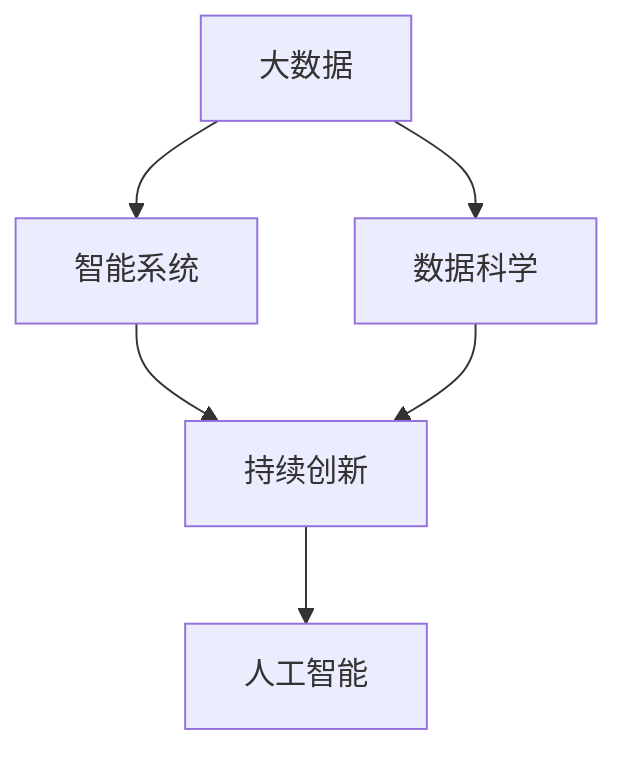

                 

# 信息是继续坚持：构建未来

> 关键词：信息构建, 大数据, 数据科学, 智能系统, 持续创新, 人工智能

## 1. 背景介绍

### 1.1 问题由来
在当前信息爆炸的时代，我们正处于一个数据和信息至关重要的阶段。信息的积累和处理不仅推动了科技的进步，更改变了各行各业的运营模式和决策方式。然而，信息的持续积累并非易事，如何从海量数据中提取有效信息，高效利用信息构建智能系统，成为当今世界关注的焦点。

### 1.2 问题核心关键点
信息构建的核心在于数据的获取、处理和应用。在科技的推动下，我们正逐步实现数据的自动化处理，并利用机器学习、深度学习等先进技术从数据中挖掘出有价值的信息。然而，构建未来智能系统不仅仅依赖于技术手段，更依赖于对信息构建的持续关注和创新。

### 1.3 问题研究意义
信息构建的重要性体现在其对社会各领域的深远影响上。在医疗、金融、教育、工业等领域，信息构建技术的进步使得决策更加科学、高效，提升了整体生产力。通过信息的精准捕捉和分析，我们能够更好地理解世界，预测未来，进而构建出更具前瞻性的智能系统。

## 2. 核心概念与联系

### 2.1 核心概念概述
为更好地理解信息构建的核心方法和策略，本节将介绍几个关键概念：

- 大数据(Big Data)：指体量巨大、类型多样的数据集，具有海量的信息潜力。大数据的获取、处理和分析已经成为推动信息构建的重要手段。
- 数据科学(Data Science)：利用数学、统计、计算机科学等学科的知识，从数据中提取知识、发现规律的一门交叉学科。数据科学为信息构建提供了理论基础和方法工具。
- 智能系统(Intelligent System)：通过利用人工智能技术，如机器学习、深度学习等，从数据中学习并执行复杂任务的系统。智能系统是信息构建的最终目标。
- 持续创新(Sustained Innovation)：指在信息构建过程中，持续关注技术进展，引入新技术、新方法，不断优化和更新信息构建过程。
- 人工智能(Artificial Intelligence)：以模拟人类智能为核心的技术体系，包括感知、学习、推理、自然语言处理等方面。人工智能为信息构建提供了强大的技术支持。

这些概念之间的逻辑关系可以通过以下Mermaid流程图来展示：



这个流程图展示了大数据、数据科学、智能系统、持续创新和人工智能等核心概念之间的联系：

1. 大数据为数据科学提供了数据基础，数据科学通过分析大数据获取知识，智能系统通过学习知识实现智能决策，持续创新和人工智能技术推动信息构建不断进步。
2. 智能系统最终实现信息构建的目标，持续创新和人工智能为信息构建提供技术手段。

## 3. 核心算法原理 & 具体操作步骤
### 3.1 算法原理概述

信息构建的核心算法原理基于数据科学和大数据技术，通过从海量数据中提取有用信息，利用机器学习模型对这些信息进行分析和建模。信息构建的主要步骤包括数据获取、数据预处理、特征工程、模型选择和训练、模型评估和优化等。

### 3.2 算法步骤详解

以下我们以分类任务为例，详细介绍信息构建的核心算法步骤：

**Step 1: 数据获取与预处理**
- 从多个数据源获取结构化和非结构化数据，如文本、图片、音频等。
- 清洗数据，去除噪声，保证数据质量。

**Step 2: 特征工程**
- 选择合适的特征，通过统计、转换等方式提取特征。
- 利用降维、特征选择等技术提高特征表示的有效性。

**Step 3: 模型选择与训练**
- 根据任务类型选择合适的机器学习或深度学习模型，如SVM、随机森林、CNN、RNN等。
- 使用交叉验证等技术选择最优模型参数，通过梯度下降等优化算法进行模型训练。

**Step 4: 模型评估与优化**
- 在测试集上评估模型性能，使用准确率、召回率、F1-score等指标评估模型效果。
- 根据评估结果进行模型调整，包括超参数调优、模型融合等。

**Step 5: 部署与监控**
- 将训练好的模型部署到生产环境中，进行实时数据预测。
- 实时监控模型性能，设置异常告警机制，保证系统稳定运行。

### 3.3 算法优缺点

大数据和机器学习技术在信息构建中具有以下优点：

1. 处理能力强大：大数据技术能够处理海量数据，机器学习模型能够从数据中提取复杂模式。
2. 自动化程度高：自动化数据处理和模型训练，减少了人工干预。
3. 可扩展性强：支持分布式计算，易于扩展。

然而，大数据和机器学习也存在一些局限性：

1. 数据质量要求高：数据质量直接影响模型效果，对数据的完整性和一致性有较高要求。
2. 计算资源消耗大：大规模数据处理和模型训练需要大量计算资源。
3. 模型可解释性不足：机器学习模型通常视为"黑盒"，难以解释其内部工作机制。
4. 数据隐私风险：处理大量敏感数据时，隐私保护问题不可忽视。

尽管存在这些局限性，但大数据和机器学习在信息构建中仍然是主流技术，能够显著提升信息提取和建模的效率和准确性。

### 3.4 算法应用领域

信息构建技术在诸多领域中得到广泛应用，例如：

- 医疗诊断：通过分析患者病历、基因数据等，构建智能诊断系统，提高诊疗效率和准确性。
- 金融风险管理：利用市场数据、交易记录等构建风险评估模型，预测金融市场趋势。
- 智能推荐系统：分析用户行为数据，构建推荐模型，提升用户体验和系统效率。
- 自动化驾驶：利用传感器数据、地图信息等，构建智能驾驶系统，保障行车安全。
- 智能客服：通过分析客户反馈、行为数据等，构建智能客服系统，提升客户满意度。

除了上述这些经典应用外，信息构建技术还在智慧城市、智能制造、教育等领域发挥着重要作用，推动了各行各业的智能化转型。

## 4. 数学模型和公式 & 详细讲解 & 举例说明
### 4.1 数学模型构建

信息构建的数学模型通常基于统计学和概率论，利用各种分布和假设进行建模。以下以线性回归为例，介绍信息构建的数学模型构建过程。

假设数据集为 $(x_i,y_i)_{i=1}^n$，其中 $x_i \in \mathbb{R}^d, y_i \in \mathbb{R}$。线性回归模型为：

$$
y = \beta_0 + \beta_1 x_1 + \beta_2 x_2 + \cdots + \beta_d x_d + \epsilon
$$

其中 $\beta = (\beta_0, \beta_1, \cdots, \beta_d)$ 为模型参数，$\epsilon$ 为误差项，假设其服从均值为0、方差为 $\sigma^2$ 的高斯分布。

### 4.2 公式推导过程

根据最小二乘法的思想，线性回归的目标是最小化误差项的平方和：

$$
\sum_{i=1}^n (y_i - \hat{y}_i)^2
$$

其中 $\hat{y}_i = \beta_0 + \beta_1 x_{i1} + \beta_2 x_{i2} + \cdots + \beta_d x_{id}$。

将目标函数对 $\beta$ 求导，并令导数等于0，可得：

$$
\sum_{i=1}^n (y_i - \hat{y}_i) = 0
$$

将上述方程展开，得到：

$$
\beta = (X^T X)^{-1} X^T y
$$

其中 $X = \begin{bmatrix} 1 & x_{11} & x_{12} & \cdots & x_{1d} \\ 1 & x_{21} & x_{22} & \cdots & x_{2d} \\ \vdots \\ 1 & x_{n1} & x_{n2} & \cdots & x_{nd} \end{bmatrix}$，$y = \begin{bmatrix} y_1 \\ y_2 \\ \vdots \\ y_n \end{bmatrix}$。

### 4.3 案例分析与讲解

考虑一个房价预测问题，数据集包括房屋面积、房间数、地理位置等特征，目标变量为房价。构建线性回归模型，利用上述公式进行模型训练和预测。

**Step 1: 数据获取与预处理**
- 获取房屋数据，清洗并处理缺失值和异常值。

**Step 2: 特征工程**
- 选择合适的特征，如房屋面积、房间数、地理位置等。
- 进行特征转换，如对房屋面积进行归一化处理。

**Step 3: 模型选择与训练**
- 使用线性回归模型，根据数据集构建模型。
- 使用交叉验证选择最优模型参数，训练模型。

**Step 4: 模型评估与优化**
- 在测试集上评估模型性能，使用RMSE等指标。
- 根据评估结果调整模型参数，进行模型优化。

**Step 5: 部署与监控**
- 将模型部署到生产环境中，进行实时房价预测。
- 实时监控模型性能，设置异常告警机制。

## 5. 项目实践：代码实例和详细解释说明
### 5.1 开发环境搭建

在进行信息构建项目实践前，我们需要准备好开发环境。以下是使用Python进行Pandas和Scikit-Learn开发的环境配置流程：

1. 安装Anaconda：从官网下载并安装Anaconda，用于创建独立的Python环境。

2. 创建并激活虚拟环境：
```bash
conda create -n data-env python=3.8 
conda activate data-env
```

3. 安装Pandas和Scikit-Learn：
```bash
conda install pandas scikit-learn
```

4. 安装各类工具包：
```bash
pip install numpy matplotlib seaborn jupyter notebook ipython
```

完成上述步骤后，即可在`data-env`环境中开始信息构建实践。

### 5.2 源代码详细实现

这里我们以房价预测项目为例，给出使用Pandas和Scikit-Learn进行信息构建的PyTorch代码实现。

首先，导入必要的库和模块：

```python
import pandas as pd
import numpy as np
from sklearn.model_selection import train_test_split
from sklearn.linear_model import LinearRegression
from sklearn.metrics import mean_squared_error
from sklearn.preprocessing import StandardScaler
import matplotlib.pyplot as plt
import seaborn as sns
```

然后，读取数据集并进行初步处理：

```python
# 读取数据
data = pd.read_csv('house_prices.csv')

# 处理缺失值
data.fillna(method='ffill', inplace=True)

# 处理异常值
data = data[data['room_count'] > 0]

# 特征工程
features = ['area', 'room_count', 'location']
X = data[features]
y = data['price']

# 标准化数据
scaler = StandardScaler()
X = scaler.fit_transform(X)

# 划分数据集
X_train, X_test, y_train, y_test = train_test_split(X, y, test_size=0.2, random_state=42)
```

接着，训练线性回归模型并进行评估：

```python
# 训练模型
model = LinearRegression()
model.fit(X_train, y_train)

# 预测
y_pred = model.predict(X_test)

# 评估
rmse = np.sqrt(mean_squared_error(y_test, y_pred))
print(f'RMSE: {rmse:.2f}')

# 可视化结果
sns.scatterplot(x=y_test, y=y_pred, color='red', label='Actual vs Predicted')
plt.xlabel('Actual Price')
plt.ylabel('Predicted Price')
plt.title('Actual vs Predicted Prices')
plt.legend()
plt.show()
```

以上就是一个简单的房价预测项目的信息构建代码实现。可以看到，利用Pandas和Scikit-Learn等库，信息构建的代码实现变得简洁高效。

### 5.3 代码解读与分析

让我们再详细解读一下关键代码的实现细节：

**特征选择和数据处理**：
- 首先使用`fillna`方法填补缺失值，保证数据完整性。
- 通过`room_count > 0`的条件过滤异常值，去除不合理的数据点。
- 选择与房价相关的特征，如面积、房间数、地理位置等。
- 对特征进行标准化处理，确保数据分布的一致性。

**模型训练和评估**：
- 使用Scikit-Learn的`LinearRegression`模型训练线性回归模型。
- 使用交叉验证方法划分训练集和测试集。
- 使用RMSE等指标评估模型性能。
- 通过可视化展示预测结果和实际结果的对比。

可以看到，Pandas和Scikit-Learn等库的强大功能大大简化了信息构建的代码实现。开发者可以专注于模型选择和特征工程等高层逻辑，而不必过多关注底层的实现细节。

当然，工业级的系统实现还需考虑更多因素，如模型的保存和部署、超参数的自动搜索、更灵活的特征工程等。但核心的信息构建流程基本与此类似。

## 6. 实际应用场景
### 6.1 医疗诊断

信息构建技术在医疗诊断中有着广泛的应用，通过构建智能诊断系统，可以显著提高诊断的准确性和效率。

在实践中，可以收集病历、基因数据、影像数据等医疗数据，构建多模态信息融合的诊断模型。利用机器学习技术，模型能够从多维度数据中提取有效信息，辅助医生进行诊断决策。例如，在肿瘤诊断中，可以利用病理图像、基因表达谱等数据，构建癌症分类模型，提高诊断准确性。

### 6.2 金融风险管理

金融风险管理是信息构建技术的另一重要应用场景。通过构建智能风险评估模型，金融机构可以更好地预测和防范风险。

在实践中，可以收集市场数据、交易记录、客户行为等数据，构建风险评估模型。利用机器学习技术，模型能够从多维度数据中提取有用信息，预测客户的违约概率、市场波动等风险因素，提供风险预警和策略建议。例如，在信用评估中，可以利用客户的历史交易数据和社交媒体行为，构建信用评分模型，预测客户的违约风险。

### 6.3 智能推荐系统

智能推荐系统是信息构建技术的典型应用之一。通过构建推荐模型，可以显著提升用户满意度和服务效率。

在实践中，可以收集用户浏览、点击、评分等行为数据，构建推荐模型。利用机器学习技术，模型能够从多维度数据中提取用户兴趣，推荐个性化的内容和服务。例如，在电商推荐中，可以利用用户的历史浏览和购买数据，构建推荐模型，推荐用户可能感兴趣的商品。

### 6.4 未来应用展望

随着信息构建技术的不断进步，未来将呈现以下几个发展趋势：

1. 数据隐私保护：数据隐私问题日益受到关注，未来的信息构建需要更加注重隐私保护，采用差分隐私等技术，确保数据安全。
2. 自动化数据处理：数据处理过程繁琐耗时，未来的信息构建需要更加自动化的数据处理和模型训练，减少人工干预。
3. 多模态信息融合：未来信息构建将更加注重多模态信息的融合，通过视觉、语音、文本等多种信息源，提升模型的鲁棒性和泛化能力。
4. 实时化信息构建：未来的信息构建需要更加实时化的处理，通过流式数据处理技术，实现动态数据更新和实时模型训练。
5. 模型可解释性：未来的信息构建需要更加可解释的模型，通过模型解释和可视化技术，提升模型的可信度和应用范围。

## 7. 工具和资源推荐
### 7.1 学习资源推荐

为了帮助开发者系统掌握信息构建的理论基础和实践技巧，这里推荐一些优质的学习资源：

1. 《Data Science for Business》书籍：由Foster Provost和Tom Fawcett合著，全面介绍了数据科学在商业应用中的重要性，适合初学者和专业人士。
2. Coursera《Applied Data Science with Python》课程：由Johns Hopkins大学开设的在线课程，涵盖数据处理、机器学习、数据可视化等多个方面，是数据科学入门的经典课程。
3. Kaggle：全球最大的数据科学竞赛平台，提供丰富的数据集和竞赛项目，是实践数据科学技能的最佳场所。
4. Scikit-Learn官方文档：Scikit-Learn的官方文档，提供了详细的算法介绍和应用案例，是学习机器学习算法的重要资料。
5. Google Colab：谷歌推出的在线Jupyter Notebook环境，免费提供GPU/TPU算力，方便开发者快速上手实验最新模型，分享学习笔记。

通过对这些资源的学习实践，相信你一定能够快速掌握信息构建的精髓，并用于解决实际的NLP问题。

### 7.2 开发工具推荐

高效的开发离不开优秀的工具支持。以下是几款用于信息构建开发的常用工具：

1. Jupyter Notebook：交互式的编程环境，支持Python、R等语言，适用于数据科学和机器学习项目开发。
2. Google Colab：在线Jupyter Notebook环境，支持GPU/TPU算力，适用于大模型和深度学习项目的开发和调试。
3. PyTorch：基于Python的开源深度学习框架，灵活动态的计算图，适合快速迭代研究。
4. TensorFlow：由Google主导开发的开源深度学习框架，生产部署方便，适合大规模工程应用。
5. Weights & Biases：模型训练的实验跟踪工具，可以记录和可视化模型训练过程中的各项指标，方便对比和调优。
6. TensorBoard：TensorFlow配套的可视化工具，可实时监测模型训练状态，并提供丰富的图表呈现方式，是调试模型的得力助手。

合理利用这些工具，可以显著提升信息构建任务的开发效率，加快创新迭代的步伐。

### 7.3 相关论文推荐

信息构建技术的发展源于学界的持续研究。以下是几篇奠基性的相关论文，推荐阅读：

1. "Data Mining, Statistical Learning, and Statistical Inference" 论文：John W. Friedman等合著，全面介绍了数据挖掘、统计学习等方法，是数据科学的经典教材。
2. "The Elements of Statistical Learning" 论文：Tibshirani、Hastie和Friedman合著，介绍了多种统计学习算法，是机器学习领域的权威书籍。
3. "Deep Learning" 论文：Ian Goodfellow等合著，介绍了深度学习的基本概念和方法，是深度学习领域的经典教材。
4. "Machine Learning Yearning" 论文：Andrew Ng撰写，提供了机器学习应用实践的实用指南，适合工程实践。
5. "Generative Adversarial Networks" 论文：Ian Goodfellow等合著，介绍了生成对抗网络的基本原理和方法，是生成模型领域的经典论文。

这些论文代表了大数据和机器学习的信息构建发展脉络。通过学习这些前沿成果，可以帮助研究者把握学科前进方向，激发更多的创新灵感。

## 8. 总结：未来发展趋势与挑战

### 8.1 总结

本文对信息构建的核心方法和策略进行了全面系统的介绍。首先阐述了大数据、数据科学、智能系统、持续创新和人工智能等核心概念，明确了信息构建在各领域的深远影响。其次，从原理到实践，详细讲解了信息构建的数学模型和操作步骤，给出了信息构建任务开发的完整代码实例。同时，本文还广泛探讨了信息构建在医疗、金融、推荐等多个行业领域的应用前景，展示了信息构建技术的广泛应用。

通过本文的系统梳理，可以看到，信息构建技术在推动数据驱动决策、提升智能系统性能、促进跨领域合作等方面发挥了重要作用。信息构建技术的持续发展和创新，必将在未来的智能系统中发挥更加重要的作用。

### 8.2 未来发展趋势

展望未来，信息构建技术将呈现以下几个发展趋势：

1. 数据隐私保护：数据隐私问题日益受到关注，未来的信息构建需要更加注重隐私保护，采用差分隐私等技术，确保数据安全。
2. 自动化数据处理：数据处理过程繁琐耗时，未来的信息构建需要更加自动化的数据处理和模型训练，减少人工干预。
3. 多模态信息融合：未来信息构建将更加注重多模态信息的融合，通过视觉、语音、文本等多种信息源，提升模型的鲁棒性和泛化能力。
4. 实时化信息构建：未来的信息构建需要更加实时化的处理，通过流式数据处理技术，实现动态数据更新和实时模型训练。
5. 模型可解释性：未来的信息构建需要更加可解释的模型，通过模型解释和可视化技术，提升模型的可信度和应用范围。

这些趋势凸显了信息构建技术的广阔前景，将进一步提升信息构建的效率和准确性，推动各领域的智能化转型。

### 8.3 面临的挑战

尽管信息构建技术已经取得了瞩目成就，但在迈向更加智能化、普适化应用的过程中，它仍面临着诸多挑战：

1. 数据质量瓶颈：数据质量直接影响模型效果，对数据的完整性和一致性有较高要求。如何提升数据质量，保证数据可用性，是未来信息构建的关键。
2. 计算资源消耗大：大规模数据处理和模型训练需要大量计算资源。如何在有限资源下优化模型训练和数据处理，是未来信息构建需要解决的问题。
3. 模型可解释性不足：机器学习模型通常视为"黑盒"，难以解释其内部工作机制。如何在保证模型效果的同时，提升模型可解释性，是未来信息构建的重要方向。
4. 数据隐私风险：处理大量敏感数据时，隐私保护问题不可忽视。如何在保障隐私的前提下，实现数据共享和利用，是未来信息构建需要解决的问题。
5. 数据伦理问题：信息构建过程中可能涉及伦理和道德问题，如数据偏见、算法歧视等。如何在技术设计和管理中体现伦理道德，是未来信息构建的重要课题。

尽管存在这些挑战，但随着学界和产业界的共同努力，这些挑战终将一一被克服，信息构建必将在构建智能系统、推动社会进步中发挥更加重要的作用。

### 8.4 研究展望

面对信息构建面临的种种挑战，未来的研究需要在以下几个方面寻求新的突破：

1. 探索无监督和半监督学习范式：摆脱对大规模标注数据的依赖，利用自监督学习、主动学习等无监督和半监督范式，最大限度利用非结构化数据，实现更加灵活高效的信息构建。
2. 研究参数高效和计算高效的构建范式：开发更加参数高效的构建方法，在固定大部分模型参数的情况下，只更新极少量的任务相关参数。同时优化构建模型的计算图，减少前向传播和反向传播的资源消耗，实现更加轻量级、实时性的部署。
3. 融合因果和对比学习范式：通过引入因果推断和对比学习思想，增强信息构建模型的建立稳定因果关系的能力，学习更加普适、鲁棒的语言表征，从而提升模型泛化性和抗干扰能力。
4. 引入更多先验知识：将符号化的先验知识，如知识图谱、逻辑规则等，与神经网络模型进行巧妙融合，引导信息构建过程学习更准确、合理的语言模型。同时加强不同模态数据的整合，实现视觉、语音等多模态信息与文本信息的协同建模。
5. 结合因果分析和博弈论工具：将因果分析方法引入信息构建模型，识别出模型决策的关键特征，增强输出解释的因果性和逻辑性。借助博弈论工具刻画人机交互过程，主动探索并规避模型的脆弱点，提高系统稳定性。
6. 纳入伦理道德约束：在模型训练目标中引入伦理导向的评估指标，过滤和惩罚有偏见、有害的输出倾向。同时加强人工干预和审核，建立模型行为的监管机制，确保输出符合人类价值观和伦理道德。

这些研究方向的探索，必将引领信息构建技术迈向更高的台阶，为构建安全、可靠、可解释、可控的智能系统铺平道路。面向未来，信息构建技术还需要与其他人工智能技术进行更深入的融合，如知识表示、因果推理、强化学习等，多路径协同发力，共同推动自然语言理解和智能交互系统的进步。只有勇于创新、敢于突破，才能不断拓展信息构建的边界，让智能技术更好地造福人类社会。

## 9. 附录：常见问题与解答

**Q1：信息构建技术是否适用于所有领域？**

A: 信息构建技术在诸多领域中得到广泛应用，特别是在数据量较大的场景中表现优异。但对于一些数据量较小、特征复杂、数据分布较不均等的领域，可能需要结合领域知识进行特殊处理。

**Q2：如何选择适合的信息构建算法？**

A: 选择信息构建算法需要考虑数据类型、任务目标、模型复杂度等因素。一般来说，对于分类任务，可以选择逻辑回归、支持向量机等算法；对于回归任务，可以选择线性回归、决策树等算法。此外，深度学习算法在处理复杂数据结构时表现较好，但也需注意计算资源消耗。

**Q3：信息构建中如何处理数据偏差？**

A: 数据偏差是信息构建过程中常见的问题，可能导致模型效果不佳。可以通过数据预处理、特征工程、算法优化等手段来处理数据偏差。例如，在处理分类任务时，可以引入过采样、欠采样等技术平衡数据分布。

**Q4：信息构建模型的可解释性如何提升？**

A: 提升信息构建模型的可解释性可以从模型设计、模型训练、模型输出等多个方面入手。例如，选择可解释性较强的算法，如决策树、线性回归等；在模型训练过程中，记录模型参数变化，提供模型解释；在模型输出时，利用可视化工具展示模型决策过程。

**Q5：信息构建技术如何与其他人工智能技术结合？**

A: 信息构建技术可以与自然语言处理、计算机视觉、语音识别等多种人工智能技术结合，实现多模态信息的协同建模。例如，在医疗领域，可以利用影像数据和文本数据，构建多模态的疾病诊断模型。在金融领域，可以利用文本数据和数值数据，构建多模态的风险评估模型。

通过对这些常见问题的解答，相信你一定能够更好地理解信息构建技术的核心思想和实现方法，进一步提升其在实际应用中的效果和可靠性。

